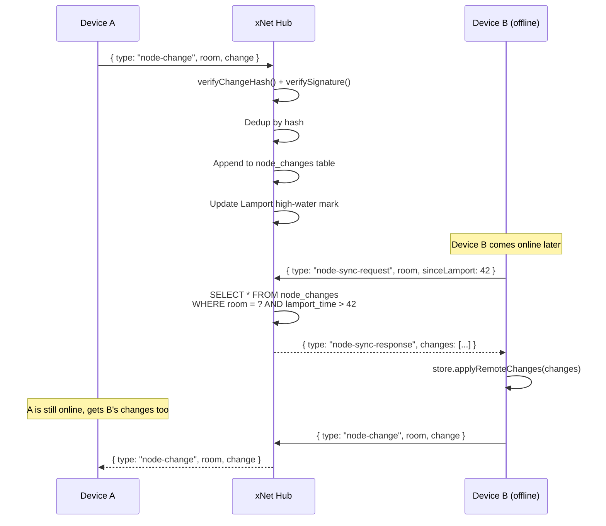

# 09: Node Sync Relay

> Structured data sync through the hub — tasks, database rows, and relations work offline-to-offline

**Dependencies:** `01-package-scaffold.md`, `02-ucan-auth.md`, `04-sqlite-storage.md`
**Modifies:** `packages/hub/src/services/node-relay.ts`, `packages/hub/src/storage/`, `packages/data/src/store/types.ts`, `packages/react/src/sync/`

## Codebase Status (Feb 2026)

| Existing Asset        | Location                                     | Status                                                                                                     |
| --------------------- | -------------------------------------------- | ---------------------------------------------------------------------------------------------------------- |
| Change\<T\> type      | `packages/sync/src/change.ts` (247 LOC)      | **Complete** — universal signed change with hash chains, Lamport timestamps, batch support                 |
| LamportClock          | `packages/sync/src/clock.ts` (152 LOC)       | **Complete** — tick, receive, compare, serialize/parse                                                     |
| Hash chain validation | `packages/sync/src/chain.ts` (300 LOC)       | **Complete** — validateChain, detectFork, topologicalSort                                                  |
| NodeStore             | `packages/data/src/store/` (683 LOC)         | **Complete** — event-sourced CRUD, LWW resolution, batch changes                                           |
| NodeStorageAdapter    | `packages/data/src/store/types.ts` (291 LOC) | **Complete** — `appendChange`, `getChanges`, `getAllChanges`, etc. **Missing: `getChangesSince(lamport)`** |
| IndexedDB adapter     | `packages/data/src/store/` (332 LOC)         | **Complete** — 5 object stores. Needs `byLamport` index + `getChangesSince`.                               |
| Memory adapter        | `packages/data/src/store/` (218 LOC)         | **Complete** — needs `getChangesSince` method added.                                                       |

### Key Gaps

> 1. **`getChangesSince(lamportTime)` does not exist** on `NodeStorageAdapter` — this is the critical addition needed for delta sync. The interface has `getAllChanges()` and `getLastLamportTime()` but no range query.
> 2. **Hub does NOT need materialized state** — it only stores the append-only change log and serves deltas. Clients handle LWW resolution locally (see [Exploration 0026](../explorations/0026_NODE_CHANGE_ARCHITECTURE.md)).
> 3. **`verifyIntegrity` in the plan only checks hash prefix** — real verification needs `@xnet/crypto` BLAKE3 + Ed25519 signature check. The `@xnet/sync` `verifyChangeHash` function should be used.

## Overview

The hub currently relays only Yjs CRDT updates (rich text documents). Structured data — tasks, database rows, relations, properties — uses a separate event-sourced system (`NodeStore` + Lamport clocks + LWW per-property). Today, NodeChanges have **no transport**: they only sync when manually passed between stores. This means structured data only works on a single device.

The Node Sync Relay makes the hub persist and relay `NodeChange` events, enabling structured data to sync between devices that are never online simultaneously. The hub verifies change signatures, deduplicates by hash, and serves delta-sync responses based on Lamport timestamps.



## Implementation

### 1. Storage Extension: Node Changes Table

```sql
-- Addition to packages/hub/src/storage/sqlite.ts schema

-- Node change log (event-sourced structured data)
CREATE TABLE IF NOT EXISTS node_changes (
  hash TEXT PRIMARY KEY,           -- ContentId (cid:blake3:...)
  room TEXT NOT NULL,              -- Room/workspace scope
  node_id TEXT NOT NULL,           -- Which node was changed
  schema_id TEXT,                  -- Schema IRI (on first change)
  lamport_time INTEGER NOT NULL,   -- For ordering + delta sync
  lamport_author TEXT NOT NULL,    -- DID for tie-breaking
  author_did TEXT NOT NULL,        -- Change author
  wall_time INTEGER NOT NULL,      -- Unix ms
  parent_hash TEXT,                -- Hash chain link
  payload_json TEXT NOT NULL,      -- JSON serialized NodePayload
  signature_b64 TEXT NOT NULL,     -- Base64 Ed25519 signature
  batch_id TEXT,                   -- Optional transaction group
  batch_index INTEGER,
  batch_size INTEGER,
  received_at INTEGER NOT NULL DEFAULT (unixepoch('now') * 1000)
);

CREATE INDEX IF NOT EXISTS idx_node_changes_room_lamport
  ON node_changes(room, lamport_time);
CREATE INDEX IF NOT EXISTS idx_node_changes_node
  ON node_changes(node_id, lamport_time);
CREATE INDEX IF NOT EXISTS idx_node_changes_batch
  ON node_changes(batch_id) WHERE batch_id IS NOT NULL;
```

### 2. Storage Interface Extension

```typescript
// Addition to packages/hub/src/storage/interface.ts

export interface SerializedNodeChange {
  hash: string // ContentId
  room: string
  nodeId: string
  schemaId?: string
  lamportTime: number
  lamportAuthor: string // DID
  authorDid: string
  wallTime: number
  parentHash: string | null
  payload: {
    nodeId: string
    schemaId?: string
    properties: Record<string, unknown>
    deleted?: boolean
  }
  signatureB64: string // Base64-encoded Uint8Array
  batchId?: string
  batchIndex?: number
  batchSize?: number
}

export interface HubStorage {
  // ... existing methods ...

  // Node change operations
  hasNodeChange(hash: string): Promise<boolean>
  appendNodeChange(room: string, change: SerializedNodeChange): Promise<void>
  getNodeChangesSince(room: string, sinceLamport: number): Promise<SerializedNodeChange[]>
  getNodeChangesForNode(room: string, nodeId: string): Promise<SerializedNodeChange[]>
  getHighWaterMark(room: string): Promise<number>
}
```

### 3. SQLite Implementation

```typescript
// Addition to packages/hub/src/storage/sqlite.ts

// Add to prepared statements:
const nodeStmts = {
  hasChange: db.prepare('SELECT 1 FROM node_changes WHERE hash = ?'),

  appendChange: db.prepare(`
    INSERT OR IGNORE INTO node_changes
      (hash, room, node_id, schema_id, lamport_time, lamport_author,
       author_did, wall_time, parent_hash, payload_json, signature_b64,
       batch_id, batch_index, batch_size, received_at)
    VALUES (?, ?, ?, ?, ?, ?, ?, ?, ?, ?, ?, ?, ?, ?, ?)
  `),

  getChangesSince: db.prepare(`
    SELECT * FROM node_changes
    WHERE room = ? AND lamport_time > ?
    ORDER BY lamport_time ASC, lamport_author ASC
    LIMIT 1000
  `),

  getChangesForNode: db.prepare(`
    SELECT * FROM node_changes
    WHERE room = ? AND node_id = ?
    ORDER BY lamport_time ASC
  `),

  getHighWaterMark: db.prepare(`
    SELECT MAX(lamport_time) as hwm FROM node_changes WHERE room = ?
  `)
}

// Add to storage object:
const storage: HubStorage = {
  // ... existing methods ...

  async hasNodeChange(hash: string): Promise<boolean> {
    return !!nodeStmts.hasChange.get(hash)
  },

  async appendNodeChange(room: string, change: SerializedNodeChange): Promise<void> {
    nodeStmts.appendChange.run(
      change.hash,
      room,
      change.nodeId,
      change.schemaId ?? null,
      change.lamportTime,
      change.lamportAuthor,
      change.authorDid,
      change.wallTime,
      change.parentHash,
      JSON.stringify(change.payload),
      change.signatureB64,
      change.batchId ?? null,
      change.batchIndex ?? null,
      change.batchSize ?? null,
      Date.now()
    )
  },

  async getNodeChangesSince(room: string, sinceLamport: number): Promise<SerializedNodeChange[]> {
    const rows = nodeStmts.getChangesSince.all(room, sinceLamport) as any[]
    return rows.map(rowToSerializedChange)
  },

  async getNodeChangesForNode(room: string, nodeId: string): Promise<SerializedNodeChange[]> {
    const rows = nodeStmts.getChangesForNode.all(room, nodeId) as any[]
    return rows.map(rowToSerializedChange)
  },

  async getHighWaterMark(room: string): Promise<number> {
    const row = nodeStmts.getHighWaterMark.get(room) as { hwm: number | null } | undefined
    return row?.hwm ?? 0
  }
}

function rowToSerializedChange(row: any): SerializedNodeChange {
  return {
    hash: row.hash,
    room: row.room,
    nodeId: row.node_id,
    schemaId: row.schema_id ?? undefined,
    lamportTime: row.lamport_time,
    lamportAuthor: row.lamport_author,
    authorDid: row.author_did,
    wallTime: row.wall_time,
    parentHash: row.parent_hash,
    payload: JSON.parse(row.payload_json),
    signatureB64: row.signature_b64,
    batchId: row.batch_id ?? undefined,
    batchIndex: row.batch_index ?? undefined,
    batchSize: row.batch_size ?? undefined
  }
}
```

### 4. Node Relay Service

```typescript
// packages/hub/src/services/node-relay.ts

import { verifyChangeHash } from '@xnet/sync'
import type { HubStorage, SerializedNodeChange } from '../storage/interface'
import type { AuthContext } from '../auth/ucan'

export interface NodeChangeMessage {
  type: 'node-change'
  room: string
  change: SerializedNodeChange
}

export interface NodeSyncRequest {
  type: 'node-sync-request'
  room: string
  sinceLamport: number
}

export interface NodeSyncResponse {
  type: 'node-sync-response'
  room: string
  changes: SerializedNodeChange[]
  highWaterMark: number
}

/**
 * Node Relay Service — persists and relays NodeChange events.
 *
 * Unlike the Yjs relay (which maintains Y.Doc instances in memory),
 * the node relay is purely append-only: it stores changes and serves
 * them back on request. No materialized state is maintained on the hub.
 */
export class NodeRelayService {
  constructor(private storage: HubStorage) {}

  /**
   * Handle an incoming NodeChange broadcast.
   * Verifies, deduplicates, and persists.
   *
   * Returns true if the change was new (should be relayed to others).
   */
  async handleNodeChange(msg: NodeChangeMessage, auth: AuthContext): Promise<boolean> {
    const { room, change } = msg

    // 1. Verify UCAN capability for this room
    if (!auth.can('node-sync/write', room)) {
      return false
    }

    // 2. Verify change integrity (hash matches content)
    if (!this.verifyIntegrity(change)) {
      console.warn(`[node-relay] Invalid change hash from ${auth.did}: ${change.hash}`)
      return false
    }

    // 3. Verify author matches UCAN issuer (optional strict mode)
    // In permissive mode, any authenticated user can relay changes
    // In strict mode: change.authorDid must match auth.did

    // 4. Deduplicate by hash
    const exists = await this.storage.hasNodeChange(change.hash)
    if (exists) {
      return false // Already have this change
    }

    // 5. Persist
    await this.storage.appendNodeChange(room, change)

    return true // New change — relay to others in room
  }

  /**
   * Handle a sync request: return all changes since a Lamport time.
   */
  async handleSyncRequest(msg: NodeSyncRequest, auth: AuthContext): Promise<NodeSyncResponse> {
    const { room, sinceLamport } = msg

    if (!auth.can('node-sync/read', room)) {
      return { type: 'node-sync-response', room, changes: [], highWaterMark: 0 }
    }

    const changes = await this.storage.getNodeChangesSince(room, sinceLamport)
    const highWaterMark = await this.storage.getHighWaterMark(room)

    return {
      type: 'node-sync-response',
      room,
      changes,
      highWaterMark
    }
  }

  /**
   * Verify change hash matches content.
   * Does NOT verify Ed25519 signature (that requires the author's public key
   * which we don't have on the hub without DID resolution).
   */
  private verifyIntegrity(change: SerializedNodeChange): boolean {
    // Reconstruct the unsigned change and verify hash
    // For now, trust the hash (full verification requires @xnet/sync on hub)
    // TODO: Import verifyChangeHash from @xnet/sync when hub depends on it
    return change.hash.startsWith('cid:blake3:') && change.hash.length > 20
  }
}
```

### 5. WebSocket Message Handling

```typescript
// Addition to packages/hub/src/services/signaling.ts

import type { NodeRelayService, NodeChangeMessage, NodeSyncRequest } from './node-relay'

/**
 * Extended signaling handler for node-change messages.
 * Integrates with the NodeRelayService.
 */
export function handleNodeMessages(
  nodeRelay: NodeRelayService,
  auth: AuthContext,
  ws: WebSocket,
  sendToRoom: (room: string, data: object, exclude?: WebSocket) => void
) {
  return {
    async handleMessage(data: any): Promise<object | null> {
      switch (data.type) {
        case 'node-change': {
          const msg = data as NodeChangeMessage
          const isNew = await nodeRelay.handleNodeChange(msg, auth)

          if (isNew) {
            // Relay to all other subscribers in this room
            sendToRoom(
              msg.room,
              {
                type: 'node-change',
                room: msg.room,
                change: msg.change
              },
              ws
            )
          }

          return null // No direct response needed
        }

        case 'node-sync-request': {
          const msg = data as NodeSyncRequest
          const response = await nodeRelay.handleSyncRequest(msg, auth)
          return response
        }

        default:
          return null // Not a node message
      }
    }
  }
}
```

### 6. Client-Side: NodeStore Sync Provider

```typescript
// packages/react/src/sync/NodeStoreSyncProvider.ts

import type { NodeChange } from '@xnet/data'
import type { SerializedNodeChange } from '@xnet/hub/src/storage/interface'
import type { ConnectionManager } from './connection-manager'

/**
 * Bridges NodeStore changes to the hub via the BSM's ConnectionManager.
 *
 * - Listens to NodeStore change events and broadcasts to hub
 * - On connect, requests changes since last known Lamport time
 * - Applies received remote changes to local NodeStore
 *
 * NOTE: This uses the BSM's ConnectionManager (single multiplexed WebSocket)
 * rather than managing its own connection. See planStep03_3_1BgSync for details.
 */
export class NodeStoreSyncProvider {
  private lastLamport = 0
  private room: string
  private connection: ConnectionManager | null = null
  private cleanup: (() => void) | null = null

  constructor(
    private store: any, // NodeStore
    room: string
  ) {
    this.room = room
  }

  /**
   * Attach to the BSM's ConnectionManager (shares the single hub WebSocket).
   * Falls back to raw WebSocket for backwards compatibility.
   */
  attach(connection: ConnectionManager): void
  attach(ws: WebSocket): void
  attach(target: ConnectionManager | WebSocket): void {
    if ('joinRoom' in target) {
      // BSM ConnectionManager path (preferred)
      this.connection = target
      this.cleanup = target.joinRoom(this.room, (data) => {
        this.handleMessage(data)
      })
    } else {
      // Legacy raw WebSocket path (backwards compat)
      target.addEventListener('message', (event: MessageEvent) => {
        const msg = JSON.parse(event.data)
        if (msg.type === 'node-change' && msg.room === this.room) {
          this.handleRemoteChange(msg.change)
        } else if (msg.type === 'node-sync-response' && msg.room === this.room) {
          this.handleSyncResponse(msg)
        }
      })
    }

    // Request catch-up on attach
    this.requestSync()
  }

  private handleMessage(data: Record<string, unknown>): void {
    if (data.type === 'node-change') {
      this.handleRemoteChange(data.change as SerializedNodeChange)
    } else if (data.type === 'node-sync-response') {
      this.handleSyncResponse(data as any)
    }
  }

  /**
   * Broadcast a local change to the hub.
   */
  broadcastChange(change: NodeChange): void {
    const serialized = this.serializeChange(change)

    if (this.connection) {
      // BSM path: publish via ConnectionManager
      this.connection.publish(this.room, {
        type: 'node-change',
        room: this.room,
        change: serialized
      })
    }
  }

  /**
   * Request changes since our last known Lamport time.
   */
  private requestSync(): void {
    if (this.connection) {
      this.connection.publish(this.room, {
        type: 'node-sync-request',
        room: this.room,
        sinceLamport: this.lastLamport
      })
    }
  }

  private async handleRemoteChange(serialized: SerializedNodeChange): Promise<void> {
    const change = this.deserializeChange(serialized)

    // Update our high-water mark
    if (serialized.lamportTime > this.lastLamport) {
      this.lastLamport = serialized.lamportTime
    }

    await this.store.applyRemoteChange(change)
  }

  private async handleSyncResponse(msg: {
    changes: SerializedNodeChange[]
    highWaterMark: number
  }): Promise<void> {
    const changes = msg.changes.map((s) => this.deserializeChange(s))
    await this.store.applyRemoteChanges(changes)
    this.lastLamport = msg.highWaterMark
  }

  private serializeChange(change: NodeChange): SerializedNodeChange {
    return {
      hash: change.hash,
      room: this.room,
      nodeId: change.payload.nodeId,
      schemaId: change.payload.schemaId,
      lamportTime: change.lamport.time,
      lamportAuthor: change.lamport.author,
      authorDid: change.authorDID,
      wallTime: change.wallTime,
      parentHash: change.parentHash,
      payload: change.payload,
      signatureB64: toBase64(change.signature),
      batchId: change.batchId,
      batchIndex: change.batchIndex,
      batchSize: change.batchSize
    }
  }

  private deserializeChange(s: SerializedNodeChange): NodeChange {
    return {
      id: s.hash.slice(0, 21), // Use hash prefix as ID
      type: 'node-change',
      hash: s.hash as any,
      parentHash: s.parentHash as any,
      authorDID: s.authorDid as any,
      signature: fromBase64(s.signatureB64),
      wallTime: s.wallTime,
      lamport: { time: s.lamportTime, author: s.lamportAuthor as any },
      payload: s.payload as any,
      batchId: s.batchId,
      batchIndex: s.batchIndex,
      batchSize: s.batchSize
    }
  }

  detach(): void {
    if (this.cleanup) {
      this.cleanup()
      this.cleanup = null
    }
    this.connection = null
  }
}

function toBase64(data: Uint8Array): string {
  return btoa(String.fromCharCode(...data))
}

function fromBase64(str: string): Uint8Array {
  return new Uint8Array(
    atob(str)
      .split('')
      .map((c) => c.charCodeAt(0))
  )
}
```

### 7. NodeStorageAdapter Extension (Client-Side)

```typescript
// Addition to packages/data/src/store/types.ts

export interface NodeStorageAdapter {
  // ... existing methods ...

  /**
   * Get changes with Lamport time greater than `since`.
   * Used for delta sync with hub relay.
   * Falls back to getAllChanges() + filter if not implemented.
   */
  getChangesSince?(sinceLamport: number): Promise<NodeChange[]>
}
```

```typescript
// Addition to packages/data/src/store/indexeddb-adapter.ts

async getChangesSince(sinceLamport: number): Promise<NodeChange[]> {
  const db = await this.getDB()
  const tx = db.transaction('changes', 'readonly')
  const index = tx.objectStore('changes').index('byLamport')
  const range = IDBKeyRange.lowerBound(sinceLamport, true) // exclusive

  const results: NodeChange[] = []
  let cursor = await index.openCursor(range)
  while (cursor) {
    results.push(cursor.value as NodeChange)
    cursor = await cursor.continue()
  }
  return results
}
```

### 8. Server Wiring

```typescript
// Addition to packages/hub/src/server.ts

import { NodeRelayService } from './services/node-relay'

export function createServer(config: HubConfig): HubInstance {
  // ... existing setup ...

  const nodeRelay = new NodeRelayService(storage)

  // In WebSocket message handler, after existing signaling/query handling:
  ws.on('message', async (raw) => {
    const data = JSON.parse(raw.toString())

    // ... existing handlers (signaling, query) ...

    // Node sync messages
    if (data.type === 'node-change' || data.type === 'node-sync-request') {
      const handler = handleNodeMessages(nodeRelay, auth, ws, (room, msg, exclude) => {
        // Broadcast to room subscribers (excluding sender)
        const topic = topics.get(room)
        if (!topic) return
        const encoded = JSON.stringify(msg)
        for (const sub of topic.subscribers) {
          if (sub !== exclude && sub.readyState === 1) {
            sub.send(encoded)
          }
        }
      })
      const response = await handler.handleMessage(data)
      if (response) {
        ws.send(JSON.stringify(response))
      }
    }
  })

  // ... rest of server setup ...
}
```

## Tests

```typescript
// packages/hub/test/node-relay.test.ts

import { describe, it, expect, beforeAll, afterAll } from 'vitest'
import { WebSocket } from 'ws'
import { createHub, type HubInstance } from '../src'
import type { SerializedNodeChange } from '../src/storage/interface'

describe('Node Sync Relay', () => {
  let hub: HubInstance
  const PORT = 14451
  const ROOM = 'workspace-test-1'

  beforeAll(async () => {
    hub = await createHub({ port: PORT, auth: false, storage: 'memory' })
    await hub.start()
  })

  afterAll(async () => {
    await hub.stop()
  })

  function connect(): Promise<WebSocket> {
    return new Promise((resolve) => {
      const ws = new WebSocket(`ws://localhost:${PORT}`)
      ws.on('open', () => resolve(ws))
    })
  }

  function makeChange(overrides: Partial<SerializedNodeChange> = {}): SerializedNodeChange {
    return {
      hash: `cid:blake3:${Math.random().toString(36).slice(2)}`,
      room: ROOM,
      nodeId: 'node-1',
      schemaId: 'xnet://xnet.dev/Task',
      lamportTime: 1,
      lamportAuthor: 'did:key:z6MkAlice',
      authorDid: 'did:key:z6MkAlice',
      wallTime: Date.now(),
      parentHash: null,
      payload: {
        nodeId: 'node-1',
        schemaId: 'xnet://xnet.dev/Task',
        properties: { title: 'Test Task', status: 'todo' }
      },
      signatureB64: btoa('fake-signature-for-test'),
      ...overrides
    }
  }

  it('persists a node-change and serves on sync-request', async () => {
    const wsA = await connect()
    const wsB = await connect()

    // A subscribes to the room
    wsA.send(JSON.stringify({ type: 'subscribe', topics: [ROOM] }))
    wsB.send(JSON.stringify({ type: 'subscribe', topics: [ROOM] }))
    await new Promise((r) => setTimeout(r, 50))

    // A sends a change
    const change = makeChange({ lamportTime: 5 })
    wsA.send(
      JSON.stringify({
        type: 'node-change',
        room: ROOM,
        change
      })
    )

    // B should receive it as a relay
    const relayed = await new Promise<any>((resolve) => {
      wsB.on('message', (raw) => {
        const msg = JSON.parse(raw.toString())
        if (msg.type === 'node-change') resolve(msg)
      })
    })

    expect(relayed.change.hash).toBe(change.hash)
    expect(relayed.change.payload.properties.title).toBe('Test Task')

    wsA.close()
    wsB.close()
  })

  it('deduplicates changes by hash', async () => {
    const ws = await connect()
    ws.send(JSON.stringify({ type: 'subscribe', topics: [ROOM] }))
    await new Promise((r) => setTimeout(r, 50))

    const change = makeChange({ hash: 'cid:blake3:dedup-test-hash', lamportTime: 10 })

    // Send same change twice
    ws.send(JSON.stringify({ type: 'node-change', room: ROOM, change }))
    ws.send(JSON.stringify({ type: 'node-change', room: ROOM, change }))
    await new Promise((r) => setTimeout(r, 100))

    // Request all changes — should only have one
    ws.send(JSON.stringify({ type: 'node-sync-request', room: ROOM, sinceLamport: 9 }))

    const response = await new Promise<any>((resolve) => {
      ws.on('message', (raw) => {
        const msg = JSON.parse(raw.toString())
        if (msg.type === 'node-sync-response') resolve(msg)
      })
    })

    const matching = response.changes.filter((c: any) => c.hash === 'cid:blake3:dedup-test-hash')
    expect(matching.length).toBe(1)

    ws.close()
  })

  it('serves delta sync (changes since Lamport time)', async () => {
    const ws = await connect()
    ws.send(JSON.stringify({ type: 'subscribe', topics: [ROOM] }))
    await new Promise((r) => setTimeout(r, 50))

    // Send changes at Lamport 20, 30, 40
    for (const lt of [20, 30, 40]) {
      ws.send(
        JSON.stringify({
          type: 'node-change',
          room: ROOM,
          change: makeChange({ lamportTime: lt, hash: `cid:blake3:lt-${lt}` })
        })
      )
    }
    await new Promise((r) => setTimeout(r, 100))

    // Request since Lamport 25 — should get 30 and 40
    ws.send(JSON.stringify({ type: 'node-sync-request', room: ROOM, sinceLamport: 25 }))

    const response = await new Promise<any>((resolve) => {
      ws.on('message', (raw) => {
        const msg = JSON.parse(raw.toString())
        if (msg.type === 'node-sync-response') resolve(msg)
      })
    })

    const times = response.changes.map((c: any) => c.lamportTime)
    expect(times).toContain(30)
    expect(times).toContain(40)
    expect(times).not.toContain(20)

    ws.close()
  })

  it('handles offline-to-offline sync via hub', async () => {
    const ROOM2 = 'workspace-offline-test'

    // Client A sends changes then disconnects
    const wsA = await connect()
    wsA.send(JSON.stringify({ type: 'subscribe', topics: [ROOM2] }))
    await new Promise((r) => setTimeout(r, 50))

    wsA.send(
      JSON.stringify({
        type: 'node-change',
        room: ROOM2,
        change: makeChange({
          room: ROOM2,
          lamportTime: 1,
          hash: 'cid:blake3:offline-a',
          payload: { nodeId: 'node-1', properties: { title: 'From A' } }
        })
      })
    )
    await new Promise((r) => setTimeout(r, 100))
    wsA.close()
    await new Promise((r) => setTimeout(r, 50))

    // Client B connects later and requests sync
    const wsB = await connect()
    wsB.send(JSON.stringify({ type: 'subscribe', topics: [ROOM2] }))
    await new Promise((r) => setTimeout(r, 50))

    wsB.send(JSON.stringify({ type: 'node-sync-request', room: ROOM2, sinceLamport: 0 }))

    const response = await new Promise<any>((resolve) => {
      wsB.on('message', (raw) => {
        const msg = JSON.parse(raw.toString())
        if (msg.type === 'node-sync-response') resolve(msg)
      })
    })

    expect(response.changes.length).toBeGreaterThanOrEqual(1)
    expect(response.changes[0].payload.properties.title).toBe('From A')

    wsB.close()
  })
})
```

## Checklist

- [ ] Add `node_changes` table to SQLite schema
- [ ] Add `hasNodeChange`, `appendNodeChange`, `getNodeChangesSince`, `getHighWaterMark` to `HubStorage`
- [ ] Implement `NodeRelayService` (verify, dedup, persist, serve)
- [ ] Add `node-change` message type to WebSocket handler
- [ ] Add `node-sync-request` / `node-sync-response` message types
- [ ] Broadcast new changes to room subscribers (excluding sender)
- [ ] Create `NodeStoreSyncProvider` for client-side integration
- [ ] Wire `NodeStoreSyncProvider` into BSM's `ConnectionManager` (not raw WebSocket)
- [ ] Add `getChangesSince(lamport)` to `NodeStorageAdapter` interface
- [ ] Implement `getChangesSince` in IndexedDB adapter (use existing `byLamport` index)
- [ ] Wire `NodeStoreSyncProvider` into `SyncManager.start()` (auto-attach when hubUrl set)
- [ ] Add memory adapter implementation for `node_changes` (tests)
- [ ] Write relay tests (persist, dedup, delta sync, offline-to-offline)
- [ ] Verify LWW conflict resolution works across hub relay

---

[← Previous: Client Integration](./08-client-integration.md) | [Back to README](./README.md) | [Next: File Storage →](./10-file-storage.md)
