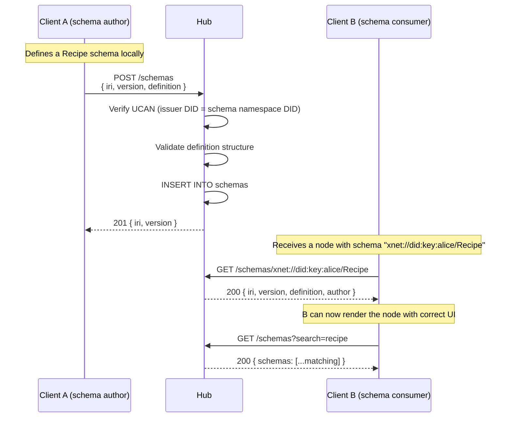

# 11: Schema Registry

> Network-accessible schema discovery — resolve, publish, and browse shared schemas by IRI

**Dependencies:** `01-package-scaffold.md`, `02-ucan-auth.md`, `04-sqlite-storage.md`
**Modifies:** `packages/hub/src/services/schemas.ts`, `packages/hub/src/routes/schemas.ts`, `packages/hub/src/storage/`

## Codebase Status (Feb 2026)

| Existing Asset           | Location                              | Status                                                                                           |
| ------------------------ | ------------------------------------- | ------------------------------------------------------------------------------------------------ |
| SchemaRegistry           | `packages/data/src/schema/`           | **Complete** — `defineSchema()` with typed properties, local registration. No remote resolution. |
| Schema property types    | `packages/data/src/schema/`           | **Complete** — 15 property types including `relation()`, `person()`, `file()`                    |
| Local API schema listing | `apps/electron/src/main/local-api.ts` | Lists registered schemas via HTTP — same pattern hub would use                                   |

> **No remote schema resolution exists.** The `SchemaRegistry` class needs a `setRemoteResolver()` method added to fall back to hub queries when a schema IRI isn't locally registered.

## Overview

The `SchemaRegistry` in `@xnet/data` is currently local-only. When Client A creates a node with schema `xnet://did:key:z6MkAlice.../Recipe`, Client B cannot resolve that schema definition — it has no way to know what properties a "Recipe" has. The hub provides a network-accessible registry where users can publish schemas and others can discover them.

Schemas are immutable once published (versioned by IRI). The hub stores schema definitions as JSON, indexes them for search, and serves them via HTTP. This enables a community ecosystem of shared schemas (like npm for data types).



## Implementation

### 1. Storage: Schemas Table

```sql
-- Addition to packages/hub/src/storage/sqlite.ts schema

-- Schema definitions (immutable per version)
CREATE TABLE IF NOT EXISTS schemas (
  iri TEXT NOT NULL,                -- Full schema IRI (xnet://...)
  version INTEGER NOT NULL,        -- Monotonic version number
  definition_json TEXT NOT NULL,    -- Full SchemaDefinition as JSON
  author_did TEXT NOT NULL,        -- Publisher DID
  name TEXT NOT NULL,              -- Human-readable name
  description TEXT DEFAULT '',     -- Schema description
  properties_count INTEGER DEFAULT 0,  -- Number of defined properties
  created_at INTEGER NOT NULL DEFAULT (unixepoch('now') * 1000),
  PRIMARY KEY (iri, version)
);

-- Latest version view (for quick lookups)
CREATE INDEX IF NOT EXISTS idx_schemas_iri ON schemas(iri);
CREATE INDEX IF NOT EXISTS idx_schemas_author ON schemas(author_did);
CREATE INDEX IF NOT EXISTS idx_schemas_name ON schemas(name);

-- Full-text search for schema discovery
CREATE VIRTUAL TABLE IF NOT EXISTS schema_search USING fts5(
  iri UNINDEXED,
  name,
  description,
  property_names  -- Space-separated property names for searchability
);
```

### 2. Storage Interface Extension

```typescript
// Addition to packages/hub/src/storage/interface.ts

export interface SchemaRecord {
  iri: string
  version: number
  definition: object // SchemaDefinition JSON
  authorDid: string
  name: string
  description: string
  propertiesCount: number
  createdAt: number
}

export interface HubStorage {
  // ... existing methods ...

  // Schema operations
  putSchema(schema: SchemaRecord): Promise<void>
  getSchema(iri: string, version?: number): Promise<SchemaRecord | null>
  listSchemasByAuthor(authorDid: string): Promise<SchemaRecord[]>
  searchSchemas(
    query: string,
    options?: { limit?: number; offset?: number }
  ): Promise<SchemaRecord[]>
  listPopularSchemas(limit?: number): Promise<SchemaRecord[]>
}
```

### 3. Schema Service

```typescript
// packages/hub/src/services/schemas.ts

import type { HubStorage, SchemaRecord } from '../storage/interface'

export interface SchemaDefinitionInput {
  /** Full schema IRI (e.g., xnet://did:key:z6Mk.../Recipe) */
  iri: string
  /** Version number (must be > current latest) */
  version: number
  /** Schema name (human-readable) */
  name: string
  /** Description */
  description?: string
  /** Full schema definition (properties, etc.) */
  definition: {
    iri: string
    name: string
    properties: Record<
      string,
      {
        type: string
        label?: string
        required?: boolean
        default?: unknown
        options?: unknown
      }
    >
    [key: string]: unknown
  }
}

/**
 * Schema Registry Service — publish, resolve, and discover schemas.
 *
 * Authorization model:
 * - Anyone can READ schemas (they're public definitions)
 * - Only the namespace owner can PUBLISH (DID in IRI must match UCAN issuer)
 * - Built-in schemas (xnet://xnet.dev/...) require admin capability
 */
export class SchemaRegistryService {
  constructor(private storage: HubStorage) {}

  /**
   * Publish a new schema version.
   * Verifies the publisher owns the schema namespace.
   */
  async publish(input: SchemaDefinitionInput, publisherDid: string): Promise<SchemaRecord> {
    // 1. Validate IRI format
    if (!input.iri.startsWith('xnet://')) {
      throw new SchemaError('INVALID_IRI', 'Schema IRI must start with xnet://')
    }

    // 2. Verify namespace ownership
    // IRI format: xnet://<authority>/<path>
    // authority = "xnet.dev" (built-in) or "did:key:..." (user-defined)
    const authority = this.extractAuthority(input.iri)
    if (authority !== 'xnet.dev' && authority !== publisherDid) {
      throw new SchemaError(
        'UNAUTHORIZED',
        `Publisher ${publisherDid} cannot publish to namespace ${authority}`
      )
    }

    // 3. Check version is newer than existing
    const existing = await this.storage.getSchema(input.iri)
    if (existing && input.version <= existing.version) {
      throw new SchemaError(
        'VERSION_CONFLICT',
        `Version ${input.version} must be greater than current ${existing.version}`
      )
    }

    // 4. Validate definition structure
    if (!input.definition.properties || typeof input.definition.properties !== 'object') {
      throw new SchemaError('INVALID_DEFINITION', 'Schema definition must include properties')
    }

    // 5. Store
    const record: SchemaRecord = {
      iri: input.iri,
      version: input.version,
      definition: input.definition,
      authorDid: publisherDid,
      name: input.name,
      description: input.description ?? '',
      propertiesCount: Object.keys(input.definition.properties).length,
      createdAt: Date.now()
    }

    await this.storage.putSchema(record)
    return record
  }

  /**
   * Resolve a schema by IRI. Returns the latest version.
   */
  async resolve(iri: string, version?: number): Promise<SchemaRecord | null> {
    return this.storage.getSchema(iri, version)
  }

  /**
   * Search for schemas by keyword.
   */
  async search(
    query: string,
    options?: { limit?: number; offset?: number }
  ): Promise<SchemaRecord[]> {
    if (!query.trim()) return []
    return this.storage.searchSchemas(query, options)
  }

  /**
   * List schemas published by a specific author.
   */
  async listByAuthor(authorDid: string): Promise<SchemaRecord[]> {
    return this.storage.listSchemasByAuthor(authorDid)
  }

  /**
   * List popular/featured schemas.
   */
  async listPopular(limit = 20): Promise<SchemaRecord[]> {
    return this.storage.listPopularSchemas(limit)
  }

  private extractAuthority(iri: string): string {
    // xnet://authority/path → authority
    const url = iri.replace('xnet://', '')
    const slashIdx = url.indexOf('/')
    return slashIdx >= 0 ? url.slice(0, slashIdx) : url
  }
}

export class SchemaError extends Error {
  constructor(
    public code:
      | 'INVALID_IRI'
      | 'UNAUTHORIZED'
      | 'VERSION_CONFLICT'
      | 'INVALID_DEFINITION'
      | 'NOT_FOUND',
    message: string
  ) {
    super(message)
    this.name = 'SchemaError'
  }
}
```

### 4. HTTP Routes

```typescript
// packages/hub/src/routes/schemas.ts

import { Hono } from 'hono'
import type { SchemaRegistryService } from '../services/schemas'
import type { AuthContext } from '../auth/ucan'

export function createSchemaRoutes(schemas: SchemaRegistryService): Hono {
  const app = new Hono()

  /**
   * POST /schemas
   * Publish a new schema version.
   *
   * Body: { iri, version, name, description?, definition }
   * Response: 201 { iri, version, name, ... }
   */
  app.post('/', async (c) => {
    const auth = c.get('auth') as AuthContext
    const body = await c.req.json()

    try {
      const record = await schemas.publish(body, auth.did)
      return c.json(record, 201)
    } catch (err) {
      if (err instanceof Error && err.name === 'SchemaError') {
        const schemaErr = err as import('../services/schemas').SchemaError
        switch (schemaErr.code) {
          case 'INVALID_IRI':
          case 'INVALID_DEFINITION':
            return c.json({ error: schemaErr.message, code: schemaErr.code }, 400)
          case 'UNAUTHORIZED':
            return c.json({ error: schemaErr.message, code: schemaErr.code }, 403)
          case 'VERSION_CONFLICT':
            return c.json({ error: schemaErr.message, code: schemaErr.code }, 409)
        }
      }
      throw err
    }
  })

  /**
   * GET /schemas/:iri
   * Resolve a schema by IRI (URL-encoded).
   *
   * Query params:
   *   version: specific version number (optional, defaults to latest)
   *
   * Response: 200 SchemaRecord | 404
   */
  app.get('/resolve/*', async (c) => {
    // IRI is everything after /schemas/resolve/
    const iri = decodeURIComponent(c.req.path.replace('/schemas/resolve/', ''))
    const version = c.req.query('version') ? parseInt(c.req.query('version')!) : undefined

    const record = await schemas.resolve(iri, version)
    if (!record) {
      return c.json({ error: 'Schema not found', code: 'NOT_FOUND' }, 404)
    }

    return c.json(record)
  })

  /**
   * GET /schemas?search=<query>&limit=20&offset=0
   * Search schemas by keyword.
   */
  app.get('/', async (c) => {
    const search = c.req.query('search')
    const author = c.req.query('author')
    const limit = parseInt(c.req.query('limit') ?? '20')
    const offset = parseInt(c.req.query('offset') ?? '0')

    if (search) {
      const results = await schemas.search(search, { limit, offset })
      return c.json({ schemas: results, total: results.length })
    }

    if (author) {
      const results = await schemas.listByAuthor(author)
      return c.json({ schemas: results, total: results.length })
    }

    // Default: popular schemas
    const results = await schemas.listPopular(limit)
    return c.json({ schemas: results, total: results.length })
  })

  return app
}
```

### 5. Client-Side: Remote Schema Resolver

````typescript
// packages/react/src/hooks/useRemoteSchema.ts

import { useContext, useEffect, useState } from 'react'
import { XNetContext } from '../provider/XNetProvider'

export interface RemoteSchemaDefinition {
  iri: string
  version: number
  name: string
  description: string
  definition: {
    properties: Record<string, { type: string; label?: string; required?: boolean }>
    [key: string]: unknown
  }
  authorDid: string
}

/**
 * Hook to resolve a schema from the hub when not available locally.
 *
 * @example
 * ```tsx
 * function NodeRenderer({ node }) {
 *   const { schema, loading } = useRemoteSchema(node.schemaId)
 *   if (loading) return <Skeleton />
 *   return <DynamicForm schema={schema} values={node.properties} />
 * }
 * ```
 */
export function useRemoteSchema(iri: string | undefined): {
  schema: RemoteSchemaDefinition | null
  loading: boolean
  error: Error | null
} {
  const ctx = useContext(XNetContext)
  const [schema, setSchema] = useState<RemoteSchemaDefinition | null>(null)
  const [loading, setLoading] = useState(false)
  const [error, setError] = useState<Error | null>(null)

  useEffect(() => {
    if (!iri || !ctx?.hubUrl) return

    let cancelled = false
    setLoading(true)

    const hubHttpUrl = ctx.hubUrl.replace('wss://', 'https://').replace('ws://', 'http://')
    const encodedIri = encodeURIComponent(iri)

    fetch(`${hubHttpUrl}/schemas/resolve/${encodedIri}`)
      .then(async (res) => {
        if (cancelled) return
        if (!res.ok) {
          if (res.status === 404) {
            setSchema(null)
          } else {
            throw new Error(`Failed to resolve schema: ${res.status}`)
          }
          return
        }
        const data = await res.json()
        setSchema(data)
      })
      .catch((err) => {
        if (!cancelled) setError(err)
      })
      .finally(() => {
        if (!cancelled) setLoading(false)
      })

    return () => {
      cancelled = true
    }
  }, [iri, ctx?.hubUrl])

  return { schema, loading, error }
}
````

### 6. Schema Registry Integration with Local Registry

```typescript
// packages/data/src/schema/registry.ts (proposed addition)

/**
 * Remote schema resolver fallback.
 * When a schema is not found locally, query the hub.
 *
 * Usage:
 *   registry.setRemoteResolver(async (iri) => {
 *     const res = await fetch(`${hubUrl}/schemas/resolve/${encodeURIComponent(iri)}`)
 *     if (!res.ok) return null
 *     const { definition } = await res.json()
 *     return definition
 *   })
 */
export class SchemaRegistry {
  private remoteResolver: ((iri: string) => Promise<object | null>) | null = null

  setRemoteResolver(resolver: (iri: string) => Promise<object | null>): void {
    this.remoteResolver = resolver
  }

  async get(iri: SchemaIRI): Promise<Schema | null> {
    // Check local first
    const local = this.schemas.get(iri) ?? null
    if (local) return local

    // Try remote if configured
    if (this.remoteResolver) {
      const remote = await this.remoteResolver(iri)
      if (remote) {
        // Cache locally for future lookups
        const schema = this.parseDefinition(remote)
        if (schema) this.schemas.set(iri, schema)
        return schema
      }
    }

    return null
  }
}
```

## Tests

```typescript
// packages/hub/test/schemas.test.ts

import { describe, it, expect, beforeAll, afterAll } from 'vitest'
import { createHub, type HubInstance } from '../src'

describe('Schema Registry', () => {
  let hub: HubInstance
  const PORT = 14453
  const BASE = `http://localhost:${PORT}`

  beforeAll(async () => {
    hub = await createHub({ port: PORT, auth: false, storage: 'memory' })
    await hub.start()
  })

  afterAll(async () => {
    await hub.stop()
  })

  const recipeSchema = {
    iri: 'xnet://did:key:z6MkTestAlice/Recipe',
    version: 1,
    name: 'Recipe',
    description: 'A cooking recipe with ingredients and steps',
    definition: {
      iri: 'xnet://did:key:z6MkTestAlice/Recipe',
      name: 'Recipe',
      properties: {
        title: { type: 'text', label: 'Title', required: true },
        servings: { type: 'number', label: 'Servings', default: 4 },
        ingredients: { type: 'text', label: 'Ingredients' },
        steps: { type: 'text', label: 'Steps' },
        prepTime: { type: 'number', label: 'Prep Time (min)' }
      }
    }
  }

  it('publishes and resolves a schema', async () => {
    const postRes = await fetch(`${BASE}/schemas`, {
      method: 'POST',
      headers: { 'Content-Type': 'application/json' },
      body: JSON.stringify(recipeSchema)
    })
    expect(postRes.status).toBe(201)
    const record = await postRes.json()
    expect(record.iri).toBe(recipeSchema.iri)
    expect(record.propertiesCount).toBe(5)

    // Resolve it
    const getRes = await fetch(`${BASE}/schemas/resolve/${encodeURIComponent(recipeSchema.iri)}`)
    expect(getRes.status).toBe(200)
    const resolved = await getRes.json()
    expect(resolved.name).toBe('Recipe')
    expect(resolved.definition.properties.title.type).toBe('text')
  })

  it('rejects version conflict', async () => {
    // Try publishing same version again
    const res = await fetch(`${BASE}/schemas`, {
      method: 'POST',
      headers: { 'Content-Type': 'application/json' },
      body: JSON.stringify(recipeSchema)
    })
    expect(res.status).toBe(409)
  })

  it('allows higher version', async () => {
    const v2 = { ...recipeSchema, version: 2, description: 'Updated recipe schema' }
    const res = await fetch(`${BASE}/schemas`, {
      method: 'POST',
      headers: { 'Content-Type': 'application/json' },
      body: JSON.stringify(v2)
    })
    expect(res.status).toBe(201)

    // Latest version is v2
    const getRes = await fetch(`${BASE}/schemas/resolve/${encodeURIComponent(recipeSchema.iri)}`)
    const resolved = await getRes.json()
    expect(resolved.version).toBe(2)
  })

  it('returns 404 for unknown schema', async () => {
    const res = await fetch(`${BASE}/schemas/resolve/${encodeURIComponent('xnet://unknown/Foo')}`)
    expect(res.status).toBe(404)
  })

  it('searches schemas by keyword', async () => {
    const res = await fetch(`${BASE}/schemas?search=recipe`)
    expect(res.status).toBe(200)
    const { schemas } = await res.json()
    expect(schemas.length).toBeGreaterThanOrEqual(1)
    expect(schemas[0].name).toBe('Recipe')
  })

  it('lists schemas by author', async () => {
    const res = await fetch(`${BASE}/schemas?author=did:key:z6MkTestAlice`)
    expect(res.status).toBe(200)
    const { schemas } = await res.json()
    expect(schemas.every((s: any) => s.authorDid === 'did:key:z6MkTestAlice')).toBe(true)
  })

  it('rejects invalid IRI format', async () => {
    const res = await fetch(`${BASE}/schemas`, {
      method: 'POST',
      headers: { 'Content-Type': 'application/json' },
      body: JSON.stringify({ ...recipeSchema, iri: 'http://invalid/path' })
    })
    expect(res.status).toBe(400)
  })
})
```

## Checklist

- [x] Add `schemas` and `schema_search` tables to SQLite schema
- [x] Add schema methods to `HubStorage` interface
- [x] Implement `SchemaRegistryService` (publish, resolve, search)
- [x] Enforce namespace ownership (IRI authority must match publisher DID)
- [x] Create Hono routes: POST (publish), GET /resolve/ (resolve), GET (search/list)
- [x] Add FTS5 search for schema discovery
- [x] Create `useRemoteSchema()` React hook
- [x] Add `setRemoteResolver()` to `SchemaRegistry` in `@xnet/data`
- [x] Wire schema routes into server
- [x] Write registry tests (publish, resolve, version, search)
- [x] Seed built-in schemas (Page, Task, Database) on hub startup

---

[← Previous: File Storage](./10-file-storage.md) | [Back to README](./README.md) | [Next: Awareness Persistence →](./12-awareness-persistence.md)
