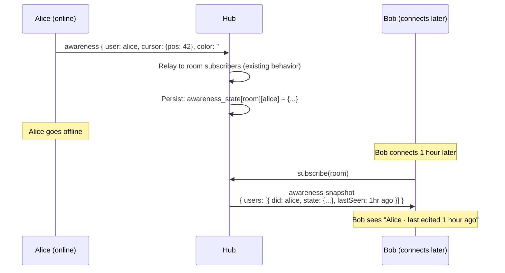

# 12: Awareness Persistence

> Last-seen presence and cursor state — know who edited what, even when they're offline

**Dependencies:** `01-package-scaffold.md`, `03-sync-relay.md`
**Modifies:** `packages/hub/src/services/awareness.ts`, `packages/hub/src/storage/`

## Codebase Status (Feb 2026)

| Existing Asset                     | Location                              | Status                                                                      |
| ---------------------------------- | ------------------------------------- | --------------------------------------------------------------------------- |
| UserPresence type                  | `packages/data/src/sync/awareness.ts` | **Complete** — name, color, cursor, selection                               |
| Awareness in BSM                   | `apps/electron/src/main/bsm.ts`       | BSM forwards awareness messages between renderer and network                |
| Awareness in WebSocketSyncProvider | `packages/react/src/sync/`            | Handles Yjs awareness protocol messages                                     |
| `useNode` remoteUsers              | `packages/react/src/hooks/`           | Presence is embedded in `useNode` return — no standalone `usePresence` hook |

> **No awareness persistence exists.** Awareness is purely ephemeral — when a peer disconnects, their presence vanishes immediately. The hub would persist last-known awareness state with TTL for "Alice was here 2 hours ago" UX.
>
> **Note:** There is no standalone `usePresence()` hook — presence data comes through `useNode`'s `remoteUsers` field. Phase 11.4 should create a dedicated `usePresence()` hook.

## Overview

The hub already relays awareness messages (presence, cursors, selections) as pass-through. This upgrade persists the last-known awareness state per user per room, so clients connecting later can see "Alice was editing this document 2 hours ago" without Alice being online. The hub evicts stale awareness entries after a configurable TTL (default: 24 hours).



## Implementation

### 1. Storage: Awareness State Table

```sql
-- Addition to packages/hub/src/storage/sqlite.ts schema

-- Persisted awareness state (last-known presence per user per room)
CREATE TABLE IF NOT EXISTS awareness_state (
  room TEXT NOT NULL,
  user_did TEXT NOT NULL,
  state_json TEXT NOT NULL,          -- Serialized awareness state
  last_seen INTEGER NOT NULL,        -- Unix ms of last update
  PRIMARY KEY (room, user_did)
);

CREATE INDEX IF NOT EXISTS idx_awareness_room ON awareness_state(room);
CREATE INDEX IF NOT EXISTS idx_awareness_stale
  ON awareness_state(last_seen) WHERE last_seen < (unixepoch('now') * 1000 - 86400000);
```

### 2. Storage Interface Extension

```typescript
// Addition to packages/hub/src/storage/interface.ts

export interface AwarenessEntry {
  room: string
  userDid: string
  state: {
    user?: {
      name?: string
      color?: string
      avatar?: string
    }
    cursor?: {
      anchor: number
      head: number
    }
    selection?: unknown
    [key: string]: unknown
  }
  lastSeen: number // Unix ms
}

export interface HubStorage {
  // ... existing methods ...

  // Awareness operations
  setAwareness(entry: AwarenessEntry): Promise<void>
  getAwareness(room: string): Promise<AwarenessEntry[]>
  removeAwareness(room: string, userDid: string): Promise<void>
  cleanStaleAwareness(olderThanMs: number): Promise<number>
}
```

### 3. Awareness Service

```typescript
// packages/hub/src/services/awareness.ts

import type { HubStorage, AwarenessEntry } from '../storage/interface'

export interface AwarenessConfig {
  /** TTL for awareness entries (default: 24 hours) */
  ttlMs: number
  /** How often to clean stale entries (default: 1 hour) */
  cleanupIntervalMs: number
  /** Max users tracked per room (default: 100) */
  maxUsersPerRoom: number
}

const DEFAULT_CONFIG: AwarenessConfig = {
  ttlMs: 24 * 60 * 60 * 1000, // 24 hours
  cleanupIntervalMs: 60 * 60 * 1000, // 1 hour
  maxUsersPerRoom: 100
}

/**
 * Awareness Persistence Service.
 *
 * Extends the existing awareness relay by storing the last-known
 * state of each user in each room. When a new client joins, they
 * receive a snapshot of recent awareness states.
 */
export class AwarenessService {
  private config: AwarenessConfig
  private cleanupTimer: ReturnType<typeof setInterval> | null = null

  constructor(
    private storage: HubStorage,
    config?: Partial<AwarenessConfig>
  ) {
    this.config = { ...DEFAULT_CONFIG, ...config }
  }

  /**
   * Start the periodic cleanup of stale entries.
   */
  start(): void {
    this.cleanupTimer = setInterval(() => {
      this.cleanup().catch(console.error)
    }, this.config.cleanupIntervalMs)
  }

  /**
   * Stop the cleanup timer.
   */
  stop(): void {
    if (this.cleanupTimer) {
      clearInterval(this.cleanupTimer)
      this.cleanupTimer = null
    }
  }

  /**
   * Handle an incoming awareness update.
   * Called by the signaling service after relaying to other clients.
   */
  async handleAwarenessUpdate(
    room: string,
    userDid: string,
    state: Record<string, unknown>
  ): Promise<void> {
    const entry: AwarenessEntry = {
      room,
      userDid,
      state: state as AwarenessEntry['state'],
      lastSeen: Date.now()
    }

    await this.storage.setAwareness(entry)
  }

  /**
   * Get the awareness snapshot for a room.
   * Returns last-known states for all users within TTL.
   */
  async getSnapshot(room: string): Promise<AwarenessEntry[]> {
    const entries = await this.storage.getAwareness(room)
    const cutoff = Date.now() - this.config.ttlMs

    // Filter out stale entries
    return entries.filter((e) => e.lastSeen > cutoff).slice(0, this.config.maxUsersPerRoom)
  }

  /**
   * Remove a user's awareness (e.g., on explicit disconnect).
   */
  async handleDisconnect(room: string, userDid: string): Promise<void> {
    // Don't delete — just let it age out.
    // This way, "last seen" still works after disconnect.
    // Optionally, set a "disconnected" flag:
    const entries = await this.storage.getAwareness(room)
    const existing = entries.find((e) => e.userDid === userDid)
    if (existing) {
      existing.state = { ...existing.state, online: false }
      existing.lastSeen = Date.now()
      await this.storage.setAwareness(existing)
    }
  }

  /**
   * Clean up stale awareness entries.
   */
  private async cleanup(): Promise<void> {
    const removed = await this.storage.cleanStaleAwareness(this.config.ttlMs)
    if (removed > 0) {
      console.info(`[awareness] Cleaned ${removed} stale entries`)
    }
  }
}
```

### 4. Signaling Integration

```typescript
// Addition to packages/hub/src/services/signaling.ts

import type { AwarenessService } from './awareness'

/**
 * Extended signaling handler for awareness persistence.
 * Intercepts awareness messages and persists state.
 * Sends snapshot to new room subscribers.
 */
export function wireAwareness(signaling: SignalingService, awareness: AwarenessService): void {
  // Intercept awareness messages from the existing message interceptor
  const originalInterceptor = signaling.getMessageInterceptor()

  signaling.setMessageInterceptor((topic, data) => {
    // Call original interceptor (relay service)
    if (originalInterceptor) originalInterceptor(topic, data)

    // Persist awareness updates
    if (data?.type === 'awareness' && data?.from) {
      // Extract user DID from awareness state
      // The awareness update contains a user object with DID
      const userDid = data.from // peerId maps to DID after auth
      const state = data.state ?? data.update ?? {}

      awareness.handleAwarenessUpdate(topic, userDid, state).catch(console.error)
    }
  })

  // Send snapshot when a client subscribes to a room
  signaling.onRoomJoin(async (topic, ws) => {
    const snapshot = await awareness.getSnapshot(topic)
    if (snapshot.length > 0) {
      ws.send(
        JSON.stringify({
          type: 'publish',
          topic,
          data: {
            type: 'awareness-snapshot',
            from: 'hub-relay',
            users: snapshot.map((e) => ({
              did: e.userDid,
              state: e.state,
              lastSeen: e.lastSeen,
              isStale: Date.now() - e.lastSeen > 5 * 60 * 1000 // >5min = stale
            }))
          }
        })
      )
    }
  })

  // Mark user as disconnected on room leave
  signaling.onRoomLeave(async (topic, userDid) => {
    if (userDid) {
      await awareness.handleDisconnect(topic, userDid)
    }
  })
}
```

### 5. Client-Side: Awareness Snapshot Handling

```typescript
// Addition to packages/react/src/sync/WebSocketSyncProvider.ts

interface AwarenessSnapshotUser {
  did: string
  state: {
    user?: { name?: string; color?: string }
    cursor?: { anchor: number; head: number }
    online?: boolean
  }
  lastSeen: number
  isStale: boolean
}

// In the message handler, add:
case 'awareness-snapshot': {
  // Hub sent us historical awareness states
  const users = (data as any).users as AwarenessSnapshotUser[]

  // Emit as awareness updates so the UI can render "last seen" indicators
  this.emit('awareness-snapshot', users)

  // Optionally populate the awareness store with stale entries
  // (shown grayed out in the UI)
  for (const user of users) {
    if (!user.isStale) {
      // Recent users: show as if they were present
      this.awarenessStates.set(user.did, {
        ...user.state,
        lastSeen: user.lastSeen
      })
    }
  }
  break
}
```

### 6. React Hook: usePresence Enhancement

````typescript
// packages/react/src/hooks/usePresence.ts (enhancement)

export interface PresenceUser {
  did: string
  name?: string
  color?: string
  cursor?: { anchor: number; head: number }
  online: boolean
  lastSeen: number
}

/**
 * Enhanced presence hook that includes both live and historical presence.
 *
 * @example
 * ```tsx
 * function PresenceAvatars({ docId }) {
 *   const { users } = usePresence(docId)
 *   return (
 *     <div className="flex -space-x-2">
 *       {users.map(u => (
 *         <Avatar
 *           key={u.did}
 *           name={u.name}
 *           color={u.color}
 *           opacity={u.online ? 1 : 0.4}
 *           title={u.online ? 'Online now' : `Last seen ${formatTimeAgo(u.lastSeen)}`}
 *         />
 *       ))}
 *     </div>
 *   )
 * }
 * ```
 */
export function usePresence(room: string): { users: PresenceUser[] } {
  // ... implementation merges live awareness with snapshot data ...
}
````

### 7. Server Wiring

```typescript
// Addition to packages/hub/src/server.ts

import { AwarenessService } from './services/awareness'
import { wireAwareness } from './services/signaling'

export function createServer(config: HubConfig): HubInstance {
  // ... existing setup ...

  const awareness = new AwarenessService(storage, {
    ttlMs: config.awarenessTtlMs ?? 24 * 60 * 60 * 1000
  })
  awareness.start()

  // Wire awareness into signaling
  wireAwareness(signaling, awareness)

  // ... in stop():
  async stop() {
    awareness.stop()
    // ... existing shutdown ...
  }
}
```

## Tests

```typescript
// packages/hub/test/awareness.test.ts

import { describe, it, expect, beforeAll, afterAll } from 'vitest'
import { WebSocket } from 'ws'
import { createHub, type HubInstance } from '../src'

describe('Awareness Persistence', () => {
  let hub: HubInstance
  const PORT = 14454
  const ROOM = 'xnet-doc-awareness-test'

  beforeAll(async () => {
    hub = await createHub({ port: PORT, auth: false, storage: 'memory' })
    await hub.start()
  })

  afterAll(async () => {
    await hub.stop()
  })

  function connect(): Promise<WebSocket> {
    return new Promise((resolve) => {
      const ws = new WebSocket(`ws://localhost:${PORT}`)
      ws.on('open', () => resolve(ws))
    })
  }

  it('sends awareness snapshot to new subscriber', async () => {
    // Alice joins and sends awareness
    const wsAlice = await connect()
    wsAlice.send(JSON.stringify({ type: 'subscribe', topics: [ROOM] }))
    await new Promise((r) => setTimeout(r, 50))

    wsAlice.send(
      JSON.stringify({
        type: 'publish',
        topic: ROOM,
        data: {
          type: 'awareness',
          from: 'did:key:z6MkAlice',
          state: { user: { name: 'Alice', color: '#e53' }, cursor: { anchor: 42, head: 42 } }
        }
      })
    )
    await new Promise((r) => setTimeout(r, 100))

    // Alice disconnects
    wsAlice.close()
    await new Promise((r) => setTimeout(r, 100))

    // Bob joins later — should get snapshot
    const wsBob = await connect()
    const snapshotPromise = new Promise<any>((resolve) => {
      wsBob.on('message', (raw) => {
        const msg = JSON.parse(raw.toString())
        if (msg.data?.type === 'awareness-snapshot') resolve(msg.data)
      })
    })

    wsBob.send(JSON.stringify({ type: 'subscribe', topics: [ROOM] }))

    const snapshot = await snapshotPromise
    expect(snapshot.users.length).toBeGreaterThanOrEqual(1)

    const alice = snapshot.users.find((u: any) => u.did === 'did:key:z6MkAlice')
    expect(alice).toBeDefined()
    expect(alice.state.user.name).toBe('Alice')
    expect(alice.lastSeen).toBeGreaterThan(0)

    wsBob.close()
  })

  it('updates awareness on repeated messages', async () => {
    const ROOM2 = 'xnet-doc-awareness-update'
    const ws = await connect()
    ws.send(JSON.stringify({ type: 'subscribe', topics: [ROOM2] }))
    await new Promise((r) => setTimeout(r, 50))

    // Send cursor at position 10
    ws.send(
      JSON.stringify({
        type: 'publish',
        topic: ROOM2,
        data: {
          type: 'awareness',
          from: 'did:key:z6MkBob',
          state: { cursor: { anchor: 10, head: 10 } }
        }
      })
    )
    await new Promise((r) => setTimeout(r, 50))

    // Update cursor to position 50
    ws.send(
      JSON.stringify({
        type: 'publish',
        topic: ROOM2,
        data: {
          type: 'awareness',
          from: 'did:key:z6MkBob',
          state: { cursor: { anchor: 50, head: 50 } }
        }
      })
    )
    await new Promise((r) => setTimeout(r, 100))

    ws.close()
    await new Promise((r) => setTimeout(r, 50))

    // New client should get latest cursor position
    const ws2 = await connect()
    const snapshot = await new Promise<any>((resolve) => {
      ws2.on('message', (raw) => {
        const msg = JSON.parse(raw.toString())
        if (msg.data?.type === 'awareness-snapshot') resolve(msg.data)
      })
      ws2.send(JSON.stringify({ type: 'subscribe', topics: [ROOM2] }))
    })

    const bob = snapshot.users.find((u: any) => u.did === 'did:key:z6MkBob')
    expect(bob.state.cursor.anchor).toBe(50)

    ws2.close()
  })

  it('does not send snapshot for empty rooms', async () => {
    const ROOM3 = 'xnet-doc-empty-room'
    const ws = await connect()

    let gotSnapshot = false
    ws.on('message', (raw) => {
      const msg = JSON.parse(raw.toString())
      if (msg.data?.type === 'awareness-snapshot') gotSnapshot = true
    })

    ws.send(JSON.stringify({ type: 'subscribe', topics: [ROOM3] }))
    await new Promise((r) => setTimeout(r, 200))

    expect(gotSnapshot).toBe(false)
    ws.close()
  })
})
```

## Checklist

- [x] Add `awareness_state` table to SQLite schema
- [x] Add awareness methods to `HubStorage` interface
- [x] Implement `AwarenessService` (persist, snapshot, cleanup)
- [x] Wire into signaling message interceptor
- [x] Send `awareness-snapshot` on room join
- [x] Mark users as offline on disconnect (don't delete)
- [x] Periodic cleanup of entries older than TTL
- [x] Handle `awareness-snapshot` in `WebSocketSyncProvider`
- [x] Enhance `usePresence` hook to include historical state
- [x] Write awareness tests (snapshot, update, empty room)
- [x] Configure TTL via hub config

---

[← Previous: Schema Registry](./11-schema-registry.md) | [Back to README](./README.md) | [Next: Peer Discovery →](./13-peer-discovery.md)
