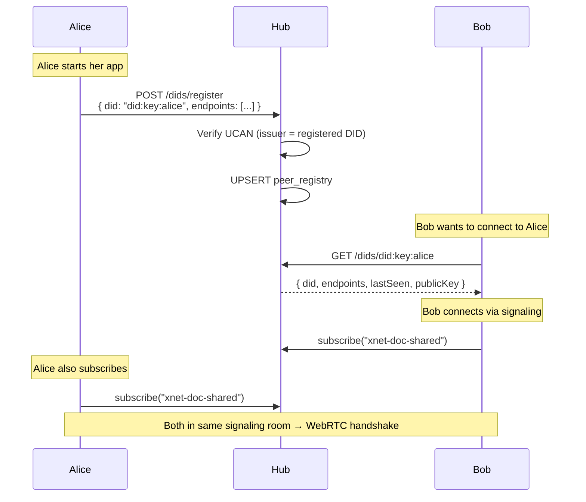

# 13: Peer Discovery

> DID resolution and rendezvous — find peers by identity, not by IP address

**Dependencies:** `01-package-scaffold.md`, `02-ucan-auth.md`
**Modifies:** `packages/hub/src/services/discovery.ts`, `packages/hub/src/routes/dids.ts`, `packages/network/src/resolution/did.ts`

## Overview

The `DIDResolver` in `@xnet/network` is a stub — `resolve()` returns null for all lookups. The hub fills this gap by acting as a rendezvous point: clients register their DID with their current endpoints (WebSocket URL, WebRTC signaling params), and other clients can look up peers by DID to establish connections.

This also fills the empty `NetworkConfig.bootstrapPeers` array — the hub IS the bootstrap node. Clients configured with a `hubUrl` use the hub for both signaling and peer discovery.



## Implementation

### 1. Storage: Peer Registry Table

```sql
-- Addition to packages/hub/src/storage/sqlite.ts schema

-- Peer registry (DID → endpoints mapping)
CREATE TABLE IF NOT EXISTS peer_registry (
  did TEXT PRIMARY KEY,                  -- did:key:...
  public_key_b64 TEXT NOT NULL,         -- Base64 Ed25519 public key
  display_name TEXT,                     -- Optional human-readable name
  endpoints_json TEXT NOT NULL,          -- JSON array of endpoint descriptors
  hub_url TEXT,                          -- Which hub this peer uses
  capabilities_json TEXT DEFAULT '[]',   -- What this peer offers
  last_seen INTEGER NOT NULL,            -- Unix ms
  registered_at INTEGER NOT NULL DEFAULT (unixepoch('now') * 1000),
  version INTEGER NOT NULL DEFAULT 1     -- Monotonic update counter
);

CREATE INDEX IF NOT EXISTS idx_peer_last_seen ON peer_registry(last_seen);
CREATE INDEX IF NOT EXISTS idx_peer_hub ON peer_registry(hub_url);
```

### 2. Storage Interface Extension

```typescript
// Addition to packages/hub/src/storage/interface.ts

export interface PeerEndpoint {
  /** Endpoint type */
  type: 'websocket' | 'webrtc-signaling' | 'libp2p' | 'http'
  /** Address (URL, multiaddr, etc.) */
  address: string
  /** Priority (lower = preferred) */
  priority: number
}

export interface PeerRecord {
  did: string
  publicKeyB64: string
  displayName?: string
  endpoints: PeerEndpoint[]
  hubUrl?: string
  capabilities: string[]
  lastSeen: number
  registeredAt: number
  version: number
}

export interface HubStorage {
  // ... existing methods ...

  // Peer discovery
  upsertPeer(peer: PeerRecord): Promise<void>
  getPeer(did: string): Promise<PeerRecord | null>
  listRecentPeers(limit?: number): Promise<PeerRecord[]>
  searchPeers(query: string): Promise<PeerRecord[]>
  removeStalePeers(olderThanMs: number): Promise<number>
  getPeerCount(): Promise<number>
}
```

### 3. Discovery Service

```typescript
// packages/hub/src/services/discovery.ts

import type { HubStorage, PeerRecord, PeerEndpoint } from '../storage/interface'

export interface DiscoveryConfig {
  /** How long before a peer is considered stale (default: 7 days) */
  staleTtlMs: number
  /** How often to clean stale peers (default: 6 hours) */
  cleanupIntervalMs: number
  /** Max peers to store (default: 10000) */
  maxPeers: number
}

const DEFAULT_CONFIG: DiscoveryConfig = {
  staleTtlMs: 7 * 24 * 60 * 60 * 1000, // 7 days
  cleanupIntervalMs: 6 * 60 * 60 * 1000, // 6 hours
  maxPeers: 10000
}

export interface RegisterInput {
  did: string
  publicKeyB64: string
  displayName?: string
  endpoints: PeerEndpoint[]
  hubUrl?: string
  capabilities?: string[]
}

/**
 * Peer Discovery Service.
 *
 * Acts as a rendezvous point for DID-based peer lookup.
 * Peers register their endpoints on connect, and other peers
 * can resolve DIDs to find connection info.
 */
export class DiscoveryService {
  private config: DiscoveryConfig
  private cleanupTimer: ReturnType<typeof setInterval> | null = null

  constructor(
    private storage: HubStorage,
    config?: Partial<DiscoveryConfig>
  ) {
    this.config = { ...DEFAULT_CONFIG, ...config }
  }

  start(): void {
    this.cleanupTimer = setInterval(() => {
      this.cleanup().catch(console.error)
    }, this.config.cleanupIntervalMs)
  }

  stop(): void {
    if (this.cleanupTimer) {
      clearInterval(this.cleanupTimer)
      this.cleanupTimer = null
    }
  }

  /**
   * Register or update a peer's endpoint info.
   * The registering DID must match the UCAN issuer.
   */
  async register(input: RegisterInput, authenticatedDid: string): Promise<PeerRecord> {
    // Verify the registrant owns this DID
    if (input.did !== authenticatedDid) {
      throw new DiscoveryError(
        'UNAUTHORIZED',
        `Cannot register endpoints for ${input.did} as ${authenticatedDid}`
      )
    }

    // Validate endpoints
    if (!input.endpoints.length) {
      throw new DiscoveryError('INVALID_INPUT', 'At least one endpoint is required')
    }

    for (const ep of input.endpoints) {
      if (!['websocket', 'webrtc-signaling', 'libp2p', 'http'].includes(ep.type)) {
        throw new DiscoveryError('INVALID_INPUT', `Unknown endpoint type: ${ep.type}`)
      }
    }

    const existing = await this.storage.getPeer(input.did)
    const record: PeerRecord = {
      did: input.did,
      publicKeyB64: input.publicKeyB64,
      displayName: input.displayName,
      endpoints: input.endpoints,
      hubUrl: input.hubUrl,
      capabilities: input.capabilities ?? [],
      lastSeen: Date.now(),
      registeredAt: existing?.registeredAt ?? Date.now(),
      version: (existing?.version ?? 0) + 1
    }

    await this.storage.upsertPeer(record)
    return record
  }

  /**
   * Resolve a DID to its peer record.
   */
  async resolve(did: string): Promise<PeerRecord | null> {
    const record = await this.storage.getPeer(did)
    if (!record) return null

    // Check if stale
    if (Date.now() - record.lastSeen > this.config.staleTtlMs) {
      return null // Treat stale records as non-existent
    }

    return record
  }

  /**
   * Update last-seen timestamp for a connected peer.
   * Called on WebSocket message activity.
   */
  async heartbeat(did: string): Promise<void> {
    const record = await this.storage.getPeer(did)
    if (record) {
      record.lastSeen = Date.now()
      await this.storage.upsertPeer(record)
    }
  }

  /**
   * List recently active peers.
   */
  async listRecent(limit = 50): Promise<PeerRecord[]> {
    return this.storage.listRecentPeers(limit)
  }

  /**
   * Get hub statistics.
   */
  async getStats(): Promise<{ totalPeers: number; activePeers: number }> {
    const total = await this.storage.getPeerCount()
    const recent = await this.storage.listRecentPeers(10000)
    const cutoff = Date.now() - 5 * 60 * 1000 // Active = seen in last 5min
    const active = recent.filter((p) => p.lastSeen > cutoff).length
    return { totalPeers: total, activePeers: active }
  }

  private async cleanup(): Promise<void> {
    const removed = await this.storage.removeStalePeers(this.config.staleTtlMs)
    if (removed > 0) {
      console.info(`[discovery] Removed ${removed} stale peers`)
    }
  }
}

export class DiscoveryError extends Error {
  constructor(
    public code: 'UNAUTHORIZED' | 'INVALID_INPUT' | 'NOT_FOUND',
    message: string
  ) {
    super(message)
    this.name = 'DiscoveryError'
  }
}
```

### 4. HTTP Routes

```typescript
// packages/hub/src/routes/dids.ts

import { Hono } from 'hono'
import type { DiscoveryService } from '../services/discovery'
import type { AuthContext } from '../auth/ucan'

export function createDiscoveryRoutes(discovery: DiscoveryService): Hono {
  const app = new Hono()

  /**
   * POST /dids/register
   * Register or update the authenticated peer's endpoints.
   *
   * Body: { did, publicKeyB64, displayName?, endpoints, hubUrl?, capabilities? }
   * Response: 200 PeerRecord
   */
  app.post('/register', async (c) => {
    const auth = c.get('auth') as AuthContext
    const body = await c.req.json()

    try {
      const record = await discovery.register(body, auth.did)
      return c.json(record)
    } catch (err) {
      if (err instanceof Error && err.name === 'DiscoveryError') {
        const discErr = err as import('../services/discovery').DiscoveryError
        switch (discErr.code) {
          case 'UNAUTHORIZED':
            return c.json({ error: discErr.message, code: discErr.code }, 403)
          case 'INVALID_INPUT':
            return c.json({ error: discErr.message, code: discErr.code }, 400)
        }
      }
      throw err
    }
  })

  /**
   * GET /dids/:did
   * Resolve a DID to its peer record.
   *
   * Response: 200 PeerRecord | 404
   */
  app.get('/:did{did:key:.+}', async (c) => {
    const did = c.req.param('did')
    const record = await discovery.resolve(did)

    if (!record) {
      return c.json({ error: 'Peer not found', code: 'NOT_FOUND' }, 404)
    }

    return c.json(record)
  })

  /**
   * GET /dids
   * List recently active peers.
   *
   * Query: ?limit=50
   * Response: { peers: PeerRecord[], stats: { total, active } }
   */
  app.get('/', async (c) => {
    const limit = parseInt(c.req.query('limit') ?? '50')
    const [peers, stats] = await Promise.all([discovery.listRecent(limit), discovery.getStats()])
    return c.json({ peers, stats })
  })

  return app
}
```

### 5. Auto-Registration on WebSocket Connect

```typescript
// Addition to packages/hub/src/server.ts

import { DiscoveryService } from './services/discovery'

// When a client connects with a valid UCAN, auto-register their endpoint:
wss.on('connection', async (ws, req) => {
  // ... existing auth + rate limit checks ...

  // Auto-register peer if authenticated
  if (auth.did && auth.did !== 'anonymous') {
    const clientEndpoint = {
      type: 'websocket' as const,
      address: config.publicUrl ?? `ws://localhost:${config.port}`,
      priority: 0
    }

    await discovery
      .register(
        {
          did: auth.did,
          publicKeyB64: auth.publicKeyB64 ?? '',
          endpoints: [clientEndpoint],
          hubUrl: config.publicUrl
        },
        auth.did
      )
      .catch(() => {}) // Best-effort registration
  }

  // Update heartbeat on each message
  ws.on('message', () => {
    if (auth.did) discovery.heartbeat(auth.did).catch(() => {})
  })
})
```

### 6. Client-Side: DID Resolver Implementation

```typescript
// packages/network/src/resolution/did.ts (replacement for stub)

export interface DIDResolverConfig {
  hubUrl: string
}

export interface PeerLocation {
  did: string
  endpoints: Array<{
    type: string
    address: string
    priority: number
  }>
  lastSeen: number
}

/**
 * DID Resolver that queries the hub for peer endpoint info.
 * Replaces the current stub that returns null.
 */
export class DIDResolver {
  private cache = new Map<string, { record: PeerLocation; fetchedAt: number }>()
  private cacheTtlMs = 60_000 // 1 minute cache

  constructor(private config: DIDResolverConfig) {}

  /**
   * Resolve a DID to its peer location (endpoints).
   */
  async resolve(did: string): Promise<PeerLocation | null> {
    // Check cache
    const cached = this.cache.get(did)
    if (cached && Date.now() - cached.fetchedAt < this.cacheTtlMs) {
      return cached.record
    }

    try {
      const hubHttpUrl = this.config.hubUrl
        .replace('wss://', 'https://')
        .replace('ws://', 'http://')

      const res = await fetch(`${hubHttpUrl}/dids/${encodeURIComponent(did)}`)
      if (!res.ok) return null

      const record = await res.json()
      const location: PeerLocation = {
        did: record.did,
        endpoints: record.endpoints,
        lastSeen: record.lastSeen
      }

      this.cache.set(did, { record: location, fetchedAt: Date.now() })
      return location
    } catch {
      return null
    }
  }

  /**
   * Register this peer's endpoints with the hub.
   */
  async publish(did: string, endpoints: PeerLocation['endpoints'], token: string): Promise<void> {
    const hubHttpUrl = this.config.hubUrl.replace('wss://', 'https://').replace('ws://', 'http://')

    await fetch(`${hubHttpUrl}/dids/register`, {
      method: 'POST',
      headers: {
        'Content-Type': 'application/json',
        Authorization: `Bearer ${token}`
      },
      body: JSON.stringify({ did, endpoints, publicKeyB64: '' })
    })
  }

  /**
   * Clear the resolution cache.
   */
  clearCache(): void {
    this.cache.clear()
  }
}
```

### 7. React Hook: usePeerDiscovery

````typescript
// packages/react/src/hooks/usePeerDiscovery.ts

import { useContext, useState, useCallback } from 'react'
import { XNetContext } from '../provider/XNetProvider'

export interface DiscoveredPeer {
  did: string
  displayName?: string
  endpoints: Array<{ type: string; address: string }>
  lastSeen: number
  isOnline: boolean
}

/**
 * Hook for discovering peers on the hub network.
 *
 * @example
 * ```tsx
 * function PeerList() {
 *   const { peers, refresh, loading } = usePeerDiscovery()
 *   return (
 *     <ul>
 *       {peers.map(p => (
 *         <li key={p.did}>
 *           {p.displayName ?? p.did.slice(0, 20)}
 *           {p.isOnline ? ' (online)' : ` (last seen ${formatTimeAgo(p.lastSeen)})`}
 *         </li>
 *       ))}
 *     </ul>
 *   )
 * }
 * ```
 */
export function usePeerDiscovery(): {
  peers: DiscoveredPeer[]
  resolve: (did: string) => Promise<DiscoveredPeer | null>
  refresh: () => Promise<void>
  loading: boolean
} {
  const ctx = useContext(XNetContext)
  const [peers, setPeers] = useState<DiscoveredPeer[]>([])
  const [loading, setLoading] = useState(false)

  const refresh = useCallback(async () => {
    if (!ctx?.hubUrl) return
    setLoading(true)
    try {
      const hubHttpUrl = ctx.hubUrl.replace('wss://', 'https://').replace('ws://', 'http://')
      const res = await fetch(`${hubHttpUrl}/dids?limit=50`)
      if (!res.ok) return
      const { peers: records } = await res.json()
      const now = Date.now()
      setPeers(
        records.map((r: any) => ({
          did: r.did,
          displayName: r.displayName,
          endpoints: r.endpoints,
          lastSeen: r.lastSeen,
          isOnline: now - r.lastSeen < 5 * 60 * 1000
        }))
      )
    } finally {
      setLoading(false)
    }
  }, [ctx?.hubUrl])

  const resolve = useCallback(
    async (did: string): Promise<DiscoveredPeer | null> => {
      if (!ctx?.hubUrl) return null
      const hubHttpUrl = ctx.hubUrl.replace('wss://', 'https://').replace('ws://', 'http://')
      const res = await fetch(`${hubHttpUrl}/dids/${encodeURIComponent(did)}`)
      if (!res.ok) return null
      const r = await res.json()
      return {
        did: r.did,
        displayName: r.displayName,
        endpoints: r.endpoints,
        lastSeen: r.lastSeen,
        isOnline: Date.now() - r.lastSeen < 5 * 60 * 1000
      }
    },
    [ctx?.hubUrl]
  )

  return { peers, resolve, refresh, loading }
}
````

## Tests

```typescript
// packages/hub/test/discovery.test.ts

import { describe, it, expect, beforeAll, afterAll } from 'vitest'
import { createHub, type HubInstance } from '../src'

describe('Peer Discovery', () => {
  let hub: HubInstance
  const PORT = 14455
  const BASE = `http://localhost:${PORT}`

  beforeAll(async () => {
    hub = await createHub({ port: PORT, auth: false, storage: 'memory' })
    await hub.start()
  })

  afterAll(async () => {
    await hub.stop()
  })

  it('registers and resolves a peer', async () => {
    const regRes = await fetch(`${BASE}/dids/register`, {
      method: 'POST',
      headers: { 'Content-Type': 'application/json' },
      body: JSON.stringify({
        did: 'did:key:z6MkTestPeer1',
        publicKeyB64: 'dGVzdC1rZXk=',
        displayName: 'Test Peer 1',
        endpoints: [{ type: 'websocket', address: 'wss://peer1.example.com', priority: 0 }]
      })
    })
    expect(regRes.status).toBe(200)
    const record = await regRes.json()
    expect(record.did).toBe('did:key:z6MkTestPeer1')
    expect(record.version).toBe(1)

    // Resolve
    const getRes = await fetch(`${BASE}/dids/did:key:z6MkTestPeer1`)
    expect(getRes.status).toBe(200)
    const resolved = await getRes.json()
    expect(resolved.displayName).toBe('Test Peer 1')
    expect(resolved.endpoints[0].address).toBe('wss://peer1.example.com')
  })

  it('updates on re-register (version increments)', async () => {
    await fetch(`${BASE}/dids/register`, {
      method: 'POST',
      headers: { 'Content-Type': 'application/json' },
      body: JSON.stringify({
        did: 'did:key:z6MkTestPeer2',
        publicKeyB64: 'a2V5Mg==',
        endpoints: [{ type: 'websocket', address: 'ws://old', priority: 0 }]
      })
    })

    const res2 = await fetch(`${BASE}/dids/register`, {
      method: 'POST',
      headers: { 'Content-Type': 'application/json' },
      body: JSON.stringify({
        did: 'did:key:z6MkTestPeer2',
        publicKeyB64: 'a2V5Mg==',
        endpoints: [{ type: 'websocket', address: 'ws://new', priority: 0 }]
      })
    })
    const record = await res2.json()
    expect(record.version).toBe(2)
    expect(record.endpoints[0].address).toBe('ws://new')
  })

  it('returns 404 for unknown DID', async () => {
    const res = await fetch(`${BASE}/dids/did:key:z6MkNonexistent`)
    expect(res.status).toBe(404)
  })

  it('lists recent peers', async () => {
    const res = await fetch(`${BASE}/dids`)
    expect(res.status).toBe(200)
    const { peers, stats } = await res.json()
    expect(peers.length).toBeGreaterThanOrEqual(1)
    expect(stats.totalPeers).toBeGreaterThanOrEqual(1)
  })

  it('supports multiple endpoint types', async () => {
    await fetch(`${BASE}/dids/register`, {
      method: 'POST',
      headers: { 'Content-Type': 'application/json' },
      body: JSON.stringify({
        did: 'did:key:z6MkMultiEndpoint',
        publicKeyB64: 'bXVsdGk=',
        endpoints: [
          { type: 'websocket', address: 'wss://hub.example.com', priority: 0 },
          { type: 'webrtc-signaling', address: 'wss://signal.example.com', priority: 1 },
          { type: 'libp2p', address: '/dns4/example.com/tcp/4001/p2p/QmXyz', priority: 2 }
        ]
      })
    })

    const res = await fetch(`${BASE}/dids/did:key:z6MkMultiEndpoint`)
    const record = await res.json()
    expect(record.endpoints.length).toBe(3)
    expect(record.endpoints[0].type).toBe('websocket')
  })
})
```

## Checklist

- [ ] Add `peer_registry` table to SQLite schema
- [ ] Add peer discovery methods to `HubStorage` interface
- [ ] Implement `DiscoveryService` (register, resolve, heartbeat, cleanup)
- [ ] Create Hono routes: POST /register, GET /:did, GET / (list)
- [ ] Auto-register peers on authenticated WebSocket connect
- [ ] Update heartbeat on WebSocket message activity
- [ ] Implement `DIDResolver` in `@xnet/network` (replace stub)
- [ ] Add resolution cache with TTL
- [ ] Create `usePeerDiscovery()` React hook
- [ ] Periodic cleanup of stale peer records
- [ ] Wire discovery routes into server
- [ ] Write discovery tests (register, resolve, update, list)

---

[← Previous: Awareness Persistence](./12-awareness-persistence.md) | [Back to README](./README.md) | [Next: Hub Federation Search →](./14-hub-federation-search.md)
