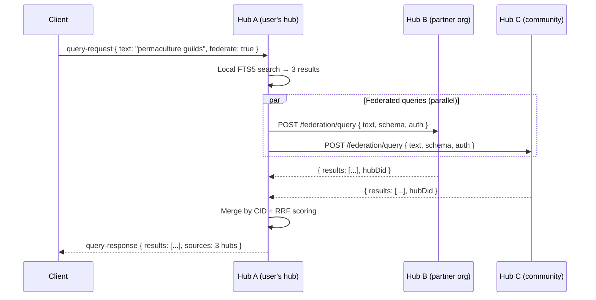

# 14: Hub Federation Search

> Hub-to-hub query protocol — cross-organization search without exposing raw data

**Dependencies:** `06-query-engine.md`, `09-node-sync-relay.md`, `11-schema-registry.md`, `13-peer-discovery.md`
**Modifies:** `packages/hub/src/services/federation.ts`, `packages/hub/src/routes/federation.ts`, `packages/hub/src/storage/`

## Codebase Status (Feb 2026)

> **Federation is entirely speculative — no code exists.** This depends on Phases 1-12 being complete and multiple hubs running in production.
>
> Relevant existing work:
>
> - [Exploration 0023](../explorations/0023_DECENTRALIZED_SEARCH.md) — Three-tier search design with hub federation as Tier 2/3
> - [Exploration 0042](../explorations/0042_UNIFIED_QUERY_API.md) — JSON-serializable query descriptors that can be forwarded between hubs
> - `@xnet/crypto` Ed25519 signing — for signed federation responses
> - `@xnet/identity` UCAN — for inter-hub delegation chains

## Overview

Each Hub maintains a complete index of its workspace data (via sync relay + FTS5). Hub Federation extends this so that hubs can query each other — enabling cross-organization discovery without exposing raw data. A user searching on Hub A can transparently get results from Hub B and Hub C, if those hubs have a federation agreement.

The canonical hub (`hub.xnet.io`) federates with all registered community hubs, acting as a global aggregator for public content.



## Design Decisions

| Decision      | Choice                                | Rationale                                                                                        |
| ------------- | ------------------------------------- | ------------------------------------------------------------------------------------------------ |
| Transport     | HTTP POST (hub-to-hub)                | Simpler than WebSocket for request/response. No persistent connection needed between hubs.       |
| Auth          | Hub-level UCAN (hub DID → hub DID)    | Each hub has its own DID. Federation agreement = UCAN delegation from Hub B to Hub A.            |
| Result format | `ScoredResult[]` with CIDs            | Content-addressed dedup across hubs. Score normalization for fair merging.                       |
| Trust model   | Explicit opt-in federation agreements | No hub can query another without prior agreement. Prevents spam/abuse.                           |
| Privacy       | Metadata-only by default              | Federated results return title/schema/snippet/CID, not full content. Content fetched separately. |
| Timeout       | 2s per hub, 5s total                  | Don't block the user waiting for slow hubs. Return partial results.                              |

## Implementation

### 1. Federation Configuration

```typescript
// packages/hub/src/services/federation.ts

export interface FederationPeer {
  /** Hub URL (e.g., "https://hub.orgB.com") */
  url: string
  /** Hub's DID (for verification) */
  hubDid: string
  /** What schemas this hub serves (or '*' for all) */
  schemas: string[] | '*'
  /** Trust level: 'full' returns snippets, 'metadata' returns title/schema only */
  trustLevel: 'full' | 'metadata'
  /** Maximum latency before we skip this hub */
  maxLatencyMs: number
  /** Rate limit: max queries per minute to this hub */
  rateLimit: number
  /** Is this peer currently healthy? (updated by health checks) */
  healthy: boolean
  /** Last successful query timestamp */
  lastSuccessAt: number | null
}

export interface FederationExpose {
  /** Which schemas are queryable by federated hubs */
  schemas: string[] | '*'
  /** Require UCAN from querying hub */
  requireAuth: boolean
  /** Max queries per minute per hub */
  rateLimit: number
  /** Max results returned per query */
  maxResults: number
}

export interface FederationConfig {
  /** Enable federation (default: false) */
  enabled: boolean
  /** This hub's DID (for signing responses) */
  hubDid: string
  /** Peer hubs to query */
  peers: FederationPeer[]
  /** What this hub exposes to others */
  expose: FederationExpose
  /** Timeout for individual hub queries */
  peerTimeoutMs: number
  /** Total timeout for all federated queries */
  totalTimeoutMs: number
}
```

### 2. Federation Query Protocol

```typescript
// packages/hub/src/services/federation.ts (continued)

/** Request sent from one hub to another */
export interface FederationQueryRequest {
  /** Query ID for correlation */
  queryId: string
  /** Full-text search query */
  text?: string
  /** Schema filter */
  schema?: string
  /** Structured property filters */
  filters?: Array<{
    field: string
    operator: 'eq' | 'contains' | 'gt' | 'lt'
    value: unknown
  }>
  /** Max results to return */
  limit: number
  /** UCAN token (hub-to-hub delegation) */
  auth: string
  /** Requesting hub's DID */
  fromHub: string
}

/** Response from a federated hub */
export interface FederationQueryResponse {
  queryId: string
  results: FederatedResult[]
  totalEstimate: number
  executionMs: number
  hubDid: string
  /** Signature over the response (proves this hub generated it) */
  signature: string
}

export interface FederatedResult {
  /** Node ID on the source hub */
  nodeId: string
  /** Content ID (for deduplication across hubs) */
  cid: string
  /** BM25 or hybrid score (normalized 0-1) */
  score: number
  /** Human-readable title */
  title: string
  /** Schema IRI */
  schema: string
  /** Match snippet (if trust level = 'full') */
  snippet?: string
  /** Author DID */
  author: string
  /** Last update timestamp */
  updatedAt: number
  /** Source hub URL (for content fetch) */
  sourceHub: string
}
```

### 3. Federation Service

```typescript
// packages/hub/src/services/federation.ts (continued)

import { verifyUCAN } from '../auth/ucan'
import type { HubStorage } from '../storage/interface'

export class FederationService {
  private rateLimiters = new Map<string, { count: number; resetAt: number }>()

  constructor(
    private config: FederationConfig,
    private storage: HubStorage,
    private queryService: QueryService
  ) {}

  /**
   * Execute a federated search: local + peer hubs in parallel.
   * Returns merged, deduplicated results.
   */
  async search(request: QueryRequest & { federate?: boolean }): Promise<QueryResponse> {
    const start = Date.now()
    const results: FederatedResult[] = []

    // 1. Local search (always)
    const localResponse = await this.queryService.handleQuery(request)
    results.push(
      ...localResponse.results.map((r) => ({
        ...r,
        sourceHub: 'local',
        score: r.score ?? 1
      }))
    )

    // 2. Federated search (if enabled and requested)
    if (this.config.enabled && request.federate !== false) {
      const fedResults = await this.queryPeers(request)
      results.push(...fedResults)
    }

    // 3. Deduplicate by CID
    const deduped = this.deduplicateByCid(results)

    // 4. Rank with Reciprocal Rank Fusion
    const ranked = this.reciprocalRankFusion(deduped)

    return {
      type: 'query-response',
      id: request.id,
      results: ranked.slice(0, request.limit ?? 20),
      total: ranked.length,
      took: Date.now() - start
    }
  }

  /**
   * Query all healthy peer hubs in parallel with timeout.
   */
  private async queryPeers(request: QueryRequest): Promise<FederatedResult[]> {
    const eligiblePeers = this.config.peers.filter((peer) => {
      if (!peer.healthy) return false
      if (peer.schemas !== '*' && request.filters?.schemaIri) {
        return peer.schemas.includes(request.filters.schemaIri)
      }
      return true
    })

    if (eligiblePeers.length === 0) return []

    // Race all peers against totalTimeoutMs
    const controller = new AbortController()
    const timeout = setTimeout(() => controller.abort(), this.config.totalTimeoutMs)

    try {
      const promises = eligiblePeers.map((peer) =>
        this.queryPeer(peer, request, controller.signal).catch(() => [] as FederatedResult[])
      )

      const settled = await Promise.allSettled(promises)
      return settled
        .filter((r) => r.status === 'fulfilled')
        .flatMap((r) => (r as PromiseFulfilledResult<FederatedResult[]>).value)
    } finally {
      clearTimeout(timeout)
    }
  }

  /**
   * Query a single peer hub via HTTP POST.
   */
  private async queryPeer(
    peer: FederationPeer,
    request: QueryRequest,
    signal: AbortSignal
  ): Promise<FederatedResult[]> {
    // Rate limiting
    if (!this.checkRateLimit(peer.url, peer.rateLimit)) {
      return []
    }

    const fedRequest: FederationQueryRequest = {
      queryId: request.id,
      text: request.query,
      schema: request.filters?.schemaIri,
      limit: Math.min(request.limit ?? 20, peer.trustLevel === 'full' ? 50 : 20),
      auth: await this.generateHubUCAN(peer.hubDid),
      fromHub: this.config.hubDid
    }

    const peerTimeout = setTimeout(() => {
      // Mark peer as slow (not unhealthy yet)
    }, peer.maxLatencyMs)

    try {
      const response = await fetch(`${peer.url}/federation/query`, {
        method: 'POST',
        headers: { 'Content-Type': 'application/json' },
        body: JSON.stringify(fedRequest),
        signal
      })

      clearTimeout(peerTimeout)

      if (!response.ok) {
        this.markPeerUnhealthy(peer)
        return []
      }

      const fedResponse: FederationQueryResponse = await response.json()

      // Verify response signature
      if (!this.verifyResponseSignature(fedResponse, peer.hubDid)) {
        this.markPeerUnhealthy(peer)
        return []
      }

      peer.lastSuccessAt = Date.now()
      peer.healthy = true

      return fedResponse.results
    } catch (error) {
      clearTimeout(peerTimeout)
      if ((error as Error).name !== 'AbortError') {
        this.markPeerUnhealthy(peer)
      }
      return []
    }
  }

  /**
   * Handle an incoming federated query from another hub.
   */
  async handleIncomingQuery(request: FederationQueryRequest): Promise<FederationQueryResponse> {
    const start = Date.now()

    // 1. Verify auth
    if (this.config.expose.requireAuth) {
      const valid = await verifyUCAN(request.auth, {
        expectedAudience: this.config.hubDid,
        requiredCapability: 'federation/query'
      })
      if (!valid) {
        throw new Error('Invalid federation UCAN')
      }
    }

    // 2. Rate limit incoming queries
    if (!this.checkRateLimit(request.fromHub, this.config.expose.rateLimit)) {
      throw new Error('Rate limited')
    }

    // 3. Check schema is exposed
    if (this.config.expose.schemas !== '*' && request.schema) {
      if (!this.config.expose.schemas.includes(request.schema)) {
        return {
          queryId: request.queryId,
          results: [],
          totalEstimate: 0,
          executionMs: 0,
          hubDid: this.config.hubDid,
          signature: ''
        }
      }
    }

    // 4. Execute local query
    const queryRequest: QueryRequest = {
      type: 'query-request',
      id: request.queryId,
      query: request.text ?? '',
      filters: { schemaIri: request.schema },
      limit: Math.min(request.limit, this.config.expose.maxResults)
    }

    const localResults = await this.queryService.handleQuery(queryRequest)

    // 5. Map to federated format
    const results: FederatedResult[] = localResults.results.map((r) => ({
      nodeId: r.docId,
      cid: r.cid ?? r.docId, // Fall back to docId if no CID
      score: r.score ?? 0,
      title: r.title,
      schema: r.schemaIri ?? '',
      snippet: r.snippet,
      author: r.ownerDid ?? '',
      updatedAt: r.updatedAt ?? 0,
      sourceHub: this.config.hubDid
    }))

    // 6. Sign response
    const response: FederationQueryResponse = {
      queryId: request.queryId,
      results,
      totalEstimate: localResults.total,
      executionMs: Date.now() - start,
      hubDid: this.config.hubDid,
      signature: '' // Signed below
    }
    response.signature = await this.signResponse(response)

    return response
  }

  /**
   * Deduplicate results by CID (same content = same hash).
   * Keep the result with the highest score.
   */
  private deduplicateByCid(results: FederatedResult[]): FederatedResult[] {
    const seen = new Map<string, FederatedResult>()
    for (const r of results) {
      const existing = seen.get(r.cid)
      if (!existing || r.score > existing.score) {
        seen.set(r.cid, r)
      }
    }
    return [...seen.values()]
  }

  /**
   * Reciprocal Rank Fusion: merge rankings from multiple sources.
   * RRF(d) = Σ 1/(k + rank_i(d))
   */
  private reciprocalRankFusion(results: FederatedResult[], k = 60): FederatedResult[] {
    // Group by source hub
    const bySource = new Map<string, FederatedResult[]>()
    for (const r of results) {
      const list = bySource.get(r.sourceHub) ?? []
      list.push(r)
      bySource.set(r.sourceHub, list)
    }

    // Sort each source's results by their original score
    for (const list of bySource.values()) {
      list.sort((a, b) => b.score - a.score)
    }

    // Compute RRF score for each result
    const rrfScores = new Map<string, number>()
    for (const [, list] of bySource) {
      for (let rank = 0; rank < list.length; rank++) {
        const current = rrfScores.get(list[rank].cid) ?? 0
        rrfScores.set(list[rank].cid, current + 1 / (k + rank + 1))
      }
    }

    // Sort by RRF score
    return results
      .map((r) => ({ ...r, score: rrfScores.get(r.cid) ?? 0 }))
      .sort((a, b) => b.score - a.score)
  }

  private checkRateLimit(key: string, maxPerMinute: number): boolean {
    const now = Date.now()
    const limiter = this.rateLimiters.get(key)
    if (!limiter || now > limiter.resetAt) {
      this.rateLimiters.set(key, { count: 1, resetAt: now + 60_000 })
      return true
    }
    if (limiter.count >= maxPerMinute) return false
    limiter.count++
    return true
  }

  private markPeerUnhealthy(peer: FederationPeer): void {
    peer.healthy = false
    // Re-check health after 60s
    setTimeout(() => {
      peer.healthy = true
    }, 60_000)
  }

  private async generateHubUCAN(audience: string): Promise<string> {
    // Generate a short-lived UCAN from this hub's DID to the target hub
    // Capability: federation/query, expiry: 5 minutes
    // Implementation depends on @xnet/identity
    return `ucan:${this.config.hubDid}:${audience}:federation/query`
  }

  private async verifyResponseSignature(
    response: FederationQueryResponse,
    expectedDid: string
  ): Promise<boolean> {
    // Verify Ed25519 signature over response body
    // Implementation depends on @xnet/crypto
    return response.hubDid === expectedDid && response.signature !== ''
  }

  private async signResponse(response: FederationQueryResponse): Promise<string> {
    // Sign response body with hub's Ed25519 key
    // Implementation depends on @xnet/crypto
    return `sig:${this.config.hubDid}:${Date.now()}`
  }
}
```

### 4. HTTP Routes

```typescript
// packages/hub/src/routes/federation.ts

import { Hono } from 'hono'
import type { FederationService } from '../services/federation'

export function createFederationRoutes(federation: FederationService) {
  const app = new Hono()

  /**
   * POST /federation/query
   * Handle incoming federated query from another hub.
   */
  app.post('/federation/query', async (c) => {
    try {
      const request = await c.req.json()
      const response = await federation.handleIncomingQuery(request)
      return c.json(response)
    } catch (error) {
      const message = error instanceof Error ? error.message : 'Unknown error'
      if (message === 'Rate limited') {
        return c.json({ error: message }, 429)
      }
      if (message === 'Invalid federation UCAN') {
        return c.json({ error: message }, 403)
      }
      return c.json({ error: message }, 500)
    }
  })

  /**
   * GET /federation/status
   * Return this hub's federation status and capabilities.
   */
  app.get('/federation/status', (c) => {
    return c.json({
      federation: true,
      hubDid: federation.config.hubDid,
      exposedSchemas: federation.config.expose.schemas,
      peerCount: federation.config.peers.filter((p) => p.healthy).length,
      rateLimit: federation.config.expose.rateLimit
    })
  })

  /**
   * POST /federation/register
   * Register a new peer hub for federation.
   * Requires admin UCAN.
   */
  app.post('/federation/register', async (c) => {
    const { url, hubDid, schemas, trustLevel } = await c.req.json()

    // TODO: Verify admin UCAN from request headers
    // TODO: Validate the peer hub is reachable (GET /federation/status)

    const peer: FederationPeer = {
      url,
      hubDid,
      schemas: schemas ?? '*',
      trustLevel: trustLevel ?? 'metadata',
      maxLatencyMs: 2000,
      rateLimit: 60,
      healthy: true,
      lastSuccessAt: null
    }

    federation.config.peers.push(peer)
    // TODO: Persist to storage

    return c.json({ registered: true, peer: { url, hubDid } })
  })

  return app
}
```

### 5. Storage: Federation Peers Table

```sql
-- Addition to packages/hub/src/storage/sqlite.ts schema

-- Registered federation peers
CREATE TABLE IF NOT EXISTS federation_peers (
  hub_did TEXT PRIMARY KEY,
  url TEXT NOT NULL,
  schemas TEXT NOT NULL DEFAULT '*',    -- JSON array or '*'
  trust_level TEXT NOT NULL DEFAULT 'metadata',
  max_latency_ms INTEGER DEFAULT 2000,
  rate_limit INTEGER DEFAULT 60,
  healthy INTEGER DEFAULT 1,
  last_success_at INTEGER,
  registered_at INTEGER NOT NULL,
  registered_by TEXT                    -- Admin DID who registered this peer
);

-- Federation query log (for analytics and rate limiting)
CREATE TABLE IF NOT EXISTS federation_query_log (
  id INTEGER PRIMARY KEY AUTOINCREMENT,
  query_id TEXT NOT NULL,
  from_hub TEXT NOT NULL,               -- Who queried us
  query_text TEXT,
  schema_filter TEXT,
  result_count INTEGER,
  execution_ms INTEGER,
  timestamp INTEGER NOT NULL
);

CREATE INDEX idx_fed_log_from ON federation_query_log(from_hub, timestamp);
```

### 6. WebSocket Integration

```typescript
// Extension to the existing signaling message handler

/**
 * Handle federated query requests over WebSocket.
 * Clients send { type: "query-request", ..., federate: true }
 * to include results from peer hubs.
 */
export function handleFederatedQuery(federation: FederationService, auth: AuthContext) {
  return {
    async handleMessage(data: any): Promise<object | null> {
      if (data.type === 'query-request' && data.federate) {
        if (!auth.can('query/read', '*')) {
          return { type: 'query-error', id: data.id, error: 'Unauthorized' }
        }
        return federation.search(data)
      }
      return null // Not a federated query, pass through
    }
  }
}
```

### 7. Hub Health Checks

```typescript
// packages/hub/src/services/federation-health.ts

/**
 * Periodic health checker for federation peers.
 * Pings each peer's /federation/status endpoint.
 */
export class FederationHealthChecker {
  private interval: ReturnType<typeof setInterval> | null = null

  constructor(
    private config: FederationConfig,
    private checkIntervalMs = 60_000
  ) {}

  start(): void {
    this.interval = setInterval(() => this.checkAll(), this.checkIntervalMs)
    this.checkAll() // Initial check
  }

  stop(): void {
    if (this.interval) {
      clearInterval(this.interval)
      this.interval = null
    }
  }

  private async checkAll(): Promise<void> {
    await Promise.allSettled(this.config.peers.map((peer) => this.checkPeer(peer)))
  }

  private async checkPeer(peer: FederationPeer): Promise<void> {
    try {
      const controller = new AbortController()
      const timeout = setTimeout(() => controller.abort(), 5000)

      const response = await fetch(`${peer.url}/federation/status`, {
        signal: controller.signal
      })
      clearTimeout(timeout)

      if (response.ok) {
        const status = await response.json()
        peer.healthy = status.federation === true
      } else {
        peer.healthy = false
      }
    } catch {
      peer.healthy = false
    }
  }
}
```

## Canonical Hub Specifics

The canonical hub (`hub.xnet.io`) has special federation behavior:

1. **Open registration**: Any hub can register for federation (POST /federation/register) without admin approval, subject to reputation scoring.
2. **Aggregator mode**: Queries to the canonical hub automatically federate to all healthy registered peers.
3. **Schema discovery**: The canonical hub maintains a registry of which schemas each peer hub serves, enabling schema-based routing.
4. **Reputation tracking**: Track response quality per peer (latency, result relevance via click-through signals). Demote low-quality peers.

```typescript
// Canonical hub configuration
const canonicalConfig: FederationConfig = {
  enabled: true,
  hubDid: 'did:key:z6Mk_canonical_hub_did',
  peers: [], // Dynamically populated via /federation/register
  expose: {
    schemas: '*', // Expose everything
    requireAuth: false, // Public queries allowed
    rateLimit: 120, // 2 queries/sec per hub
    maxResults: 100
  },
  peerTimeoutMs: 2000,
  totalTimeoutMs: 5000
}
```

## Configuration (Hub Operators)

```typescript
import { createHub } from '@xnet/hub'

const hub = await createHub({
  federation: {
    enabled: true,
    hubDid: 'did:key:z6MkYourHubDid',
    hubSigningKey: yourHubPrivateKey, // must match hubDid
    peers: [
      {
        url: 'https://partner-hub.example.com',
        hubDid: 'did:key:z6MkPartnerHub',
        schemas: '*',
        trustLevel: 'full',
        maxLatencyMs: 2000,
        rateLimit: 60,
        healthy: true,
        lastSuccessAt: null
      }
    ],
    expose: {
      schemas: '*',
      requireAuth: false,
      rateLimit: 60,
      maxResults: 50
    },
    peerTimeoutMs: 2000,
    totalTimeoutMs: 5000,
    openRegistration: false
  }
})

await hub.start()
```

## Tests

```typescript
// packages/hub/test/federation.test.ts

import { describe, it, expect, beforeAll, afterAll } from 'vitest'
import { createHub, type HubInstance } from '../src'

describe('Hub Federation', () => {
  let hubA: HubInstance
  let hubB: HubInstance
  const PORT_A = 14460
  const PORT_B = 14461

  beforeAll(async () => {
    // Start two hubs that will federate
    hubA = await createHub({
      port: PORT_A,
      auth: false,
      storage: 'memory',
      federation: {
        enabled: true,
        hubDid: 'did:key:hubA',
        peers: [
          {
            url: `http://localhost:${PORT_B}`,
            hubDid: 'did:key:hubB',
            schemas: '*',
            trustLevel: 'full',
            maxLatencyMs: 2000,
            rateLimit: 60,
            healthy: true,
            lastSuccessAt: null
          }
        ],
        expose: { schemas: '*', requireAuth: false, rateLimit: 60, maxResults: 50 },
        peerTimeoutMs: 2000,
        totalTimeoutMs: 5000
      }
    })

    hubB = await createHub({
      port: PORT_B,
      auth: false,
      storage: 'memory',
      federation: {
        enabled: true,
        hubDid: 'did:key:hubB',
        peers: [],
        expose: { schemas: '*', requireAuth: false, rateLimit: 60, maxResults: 50 },
        peerTimeoutMs: 2000,
        totalTimeoutMs: 5000
      }
    })

    await hubA.start()
    await hubB.start()
  })

  afterAll(async () => {
    await hubA.stop()
    await hubB.stop()
  })

  it('returns results from federated hub', async () => {
    // Index a document on Hub B
    // (via direct storage insertion for test simplicity)
    await hubB.storage.setDocMeta('fed-doc-1', {
      docId: 'fed-doc-1',
      ownerDid: 'did:key:bob',
      schemaIri: 'xnet://xnet.dev/Page',
      title: 'Permaculture Design Principles',
      createdAt: Date.now(),
      updatedAt: Date.now()
    })

    // Query Hub A with federation enabled
    const ws = await connect(PORT_A)
    const response = await sendAndWait(
      ws,
      {
        type: 'query-request',
        id: 'fed-q-1',
        query: 'Permaculture',
        federate: true
      },
      'query-response'
    )

    // Should include result from Hub B
    expect(response.results.length).toBeGreaterThanOrEqual(1)
    expect(response.results.some((r) => r.title.includes('Permaculture'))).toBe(true)

    ws.close()
  })

  it('deduplicates results by CID across hubs', async () => {
    // Same document on both hubs (same CID)
    const meta = {
      docId: 'shared-doc',
      ownerDid: 'did:key:alice',
      schemaIri: 'xnet://xnet.dev/Page',
      title: 'Shared Knowledge Base Entry',
      cid: 'cid:blake3:abc123',
      createdAt: Date.now(),
      updatedAt: Date.now()
    }
    await hubA.storage.setDocMeta('shared-doc', meta)
    await hubB.storage.setDocMeta('shared-doc', meta)

    const ws = await connect(PORT_A)
    const response = await sendAndWait(
      ws,
      {
        type: 'query-request',
        id: 'dedup-q',
        query: 'Knowledge Base',
        federate: true
      },
      'query-response'
    )

    // Should have exactly one result (deduplicated)
    const matches = response.results.filter((r) => r.cid === 'cid:blake3:abc123')
    expect(matches.length).toBe(1)

    ws.close()
  })

  it('respects schema filter for federation routing', async () => {
    await hubB.storage.setDocMeta('task-1', {
      docId: 'task-1',
      ownerDid: 'did:key:bob',
      schemaIri: 'xnet://xnet.dev/Task',
      title: 'Review soil samples',
      createdAt: Date.now(),
      updatedAt: Date.now()
    })

    const ws = await connect(PORT_A)
    const response = await sendAndWait(
      ws,
      {
        type: 'query-request',
        id: 'schema-q',
        query: 'soil',
        filters: { schemaIri: 'xnet://xnet.dev/Task' },
        federate: true
      },
      'query-response'
    )

    // All results should be Tasks
    expect(response.results.every((r) => r.schemaIri === 'xnet://xnet.dev/Task')).toBe(true)

    ws.close()
  })

  it('handles peer hub timeout gracefully', async () => {
    // Add a non-existent peer
    hubA.federation.config.peers.push({
      url: 'http://localhost:99999',
      hubDid: 'did:key:nonexistent',
      schemas: '*',
      trustLevel: 'metadata',
      maxLatencyMs: 500,
      rateLimit: 60,
      healthy: true,
      lastSuccessAt: null
    })

    const ws = await connect(PORT_A)
    const response = await sendAndWait(
      ws,
      {
        type: 'query-request',
        id: 'timeout-q',
        query: 'anything',
        federate: true
      },
      'query-response'
    )

    // Should still return (possibly empty), not throw
    expect(response.type).toBe('query-response')

    ws.close()
  })

  it('exposes federation status endpoint', async () => {
    const response = await fetch(`http://localhost:${PORT_A}/federation/status`)
    const status = await response.json()

    expect(status.federation).toBe(true)
    expect(status.hubDid).toBe('did:key:hubA')
    expect(status.peerCount).toBeGreaterThanOrEqual(1)
  })
})

// Test helpers
function connect(port: number): Promise<WebSocket> {
  return new Promise((resolve) => {
    const ws = new WebSocket(`ws://localhost:${port}`)
    ws.on('open', () => resolve(ws))
  })
}

function sendAndWait(ws: WebSocket, msg: object, matchType: string): Promise<any> {
  return new Promise((resolve) => {
    const handler = (raw: Buffer) => {
      const data = JSON.parse(raw.toString())
      if (data.type === matchType) {
        ws.off('message', handler)
        resolve(data)
      }
    }
    ws.on('message', handler)
    ws.send(JSON.stringify(msg))
  })
}
```

## Checklist

- [x] Implement `FederationService` with `search()` and `handleIncomingQuery()`
- [x] Add `/federation/query` HTTP endpoint (hub-to-hub)
- [x] Add `/federation/status` endpoint
- [x] Add `/federation/register` endpoint (peer registration)
- [x] Implement Reciprocal Rank Fusion scoring
- [x] Implement CID-based deduplication
- [x] Add `federation_peers` and `federation_query_log` tables to SQLite
- [x] Implement rate limiting per hub
- [x] Implement peer health checking
- [x] Add `federate: true` option to WebSocket query-request
- [x] Sign federation responses with hub DID
- [x] Verify incoming UCAN for federation queries
- [x] Handle timeouts gracefully (partial results)
- [x] Write federation tests (cross-hub query, dedup, schema filter, timeout)
- [x] Document federation configuration for hub operators

---

[← Previous: Peer Discovery](./13-peer-discovery.md) | [Back to README](./README.md) | [Next: Global Index Shards →](./15-global-index-shards.md)
