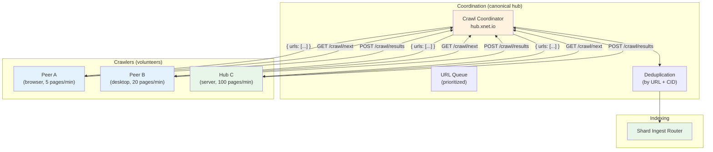

# 16: Crawl Coordination

> Distributed web crawling — any peer can contribute, the canonical hub coordinates

**Dependencies:** `14-hub-federation-search.md`, `15-global-index-shards.md`
**Modifies:** `packages/hub/src/services/crawl.ts`, `packages/hub/src/routes/crawl.ts`, `packages/hub/src/storage/`

## Codebase Status (Feb 2026)

> **Crawl coordination is entirely speculative — no code exists.** This is the most advanced feature in the hub plan, depending on global index shards (Phase 14) and a significant user base.
>
> Relevant existing work:
>
> - [Exploration 0023](../explorations/0023_DECENTRALIZED_SEARCH.md) — Crawl architecture with volunteer crawlers and reputation scoring
> - `@xnet/crypto` BLAKE3 — CID generation for crawled content deduplication
> - `@xnet/identity` UCAN — DID-authenticated crawler registration
>
> **Note:** The `CrawlStorage` interface referenced in this document is undefined — it needs to be added to the `HubStorage` interface or defined separately.

## Overview

For xNet to provide a competitive global search index (VISION.md's "decentralized Google"), it needs to crawl the web. Rather than running expensive centralized crawlers, xNet distributes crawl work across volunteer peers and hub operators. The canonical hub coordinates which URLs each crawler should visit, deduplicates results, and routes crawled pages to the correct index shards.

This is the "Brave Web Discovery Project" model applied to xNet: users optionally contribute crawl work from their devices, and hub operators contribute server-side crawling capacity.



## Design Decisions

| Decision           | Choice                                    | Rationale                                                      |
| ------------------ | ----------------------------------------- | -------------------------------------------------------------- |
| Coordination model | Centralized queue (canonical hub)         | Simplest. Avoids duplicate crawling. Can add P2P gossip later. |
| Crawler identity   | DID-authenticated                         | Track per-crawler quality. Revoke bad actors.                  |
| Crawl rate         | Per-domain rate limiting at coordinator   | Respect robots.txt, avoid abuse.                               |
| Content extraction | Crawler-side (returns text, not HTML)     | Reduces bandwidth. Hub doesn't need to parse HTML.             |
| Verification       | CID of crawled content                    | Multiple crawlers on same URL → same CID = verified.           |
| Priority           | PageRank-lite (link counting) + freshness | Prioritize popular/stale pages.                                |
| Scope              | Opt-in domains initially                  | Start small, expand as network grows.                          |

## Implementation

### 1. Crawl Types

```typescript
// packages/hub/src/services/crawl.ts

/** A URL assignment for a crawler */
export interface CrawlTask {
  /** Unique task ID */
  taskId: string
  /** URL to crawl */
  url: string
  /** Domain (for rate limiting) */
  domain: string
  /** Priority (higher = more important) */
  priority: number
  /** When this task was assigned */
  assignedAt: number
  /** Who it's assigned to */
  assignedTo: string // Crawler DID
  /** Maximum time to complete (ms) */
  deadlineMs: number
  /** How many times this URL has been crawled before */
  crawlCount: number
  /** Last known CID (for change detection) */
  previousCid?: string
}

/** Result submitted by a crawler */
export interface CrawlResult {
  /** Task ID (for correlation) */
  taskId: string
  /** URL that was crawled */
  url: string
  /** Content ID (BLAKE3 hash of extracted text) */
  cid: string
  /** Extracted page title */
  title: string
  /** Extracted text content (no HTML) */
  body: string
  /** Outbound links discovered */
  outLinks: string[]
  /** Language detected */
  language: string
  /** HTTP status code */
  statusCode: number
  /** Content-Type header */
  contentType: string
  /** Time to fetch + extract (ms) */
  crawlTimeMs: number
  /** robots.txt status */
  robotsAllowed: boolean
  /** Crawler DID (for attribution) */
  crawlerDid: string
  /** Timestamp */
  crawledAt: number
}

/** Crawler registration */
export interface CrawlerProfile {
  /** Crawler's DID */
  did: string
  /** Type: browser (limited), desktop (moderate), server (high capacity) */
  type: 'browser' | 'desktop' | 'server'
  /** Max pages per minute this crawler can handle */
  capacity: number
  /** Preferred languages (ISO 639-1) */
  languages: string[]
  /** Preferred domains (optional specialization) */
  domains?: string[]
  /** Reputation score (0-100, starts at 50) */
  reputation: number
  /** Total pages crawled */
  totalCrawled: number
  /** Registered at */
  registeredAt: number
}
```

### 2. Crawl Coordinator

```typescript
// packages/hub/src/services/crawl.ts (continued)

/**
 * The Crawl Coordinator manages the URL queue, assigns work
 * to registered crawlers, and routes results to the index.
 *
 * Only runs on the canonical hub (or designated crawl coordinators).
 */
export class CrawlCoordinator {
  private activeTasks = new Map<string, CrawlTask>()
  private domainLastCrawl = new Map<string, number>()
  private deadlineChecker: ReturnType<typeof setInterval> | null = null

  constructor(
    private storage: CrawlStorage,
    private shardIngest: ShardIngestRouter,
    private config: CrawlConfig
  ) {}

  /**
   * Start the coordinator: begin checking for expired tasks.
   */
  start(): void {
    this.deadlineChecker = setInterval(
      () => this.expireDeadTasks(),
      30_000 // Check every 30s
    )
  }

  stop(): void {
    if (this.deadlineChecker) {
      clearInterval(this.deadlineChecker)
    }
  }

  /**
   * Register a new crawler.
   */
  async registerCrawler(profile: CrawlerProfile): Promise<void> {
    await this.storage.upsertCrawler(profile)
  }

  /**
   * Assign crawl tasks to a crawler.
   * Respects: crawler capacity, domain rate limits, priority ordering.
   */
  async getNextTasks(crawlerDid: string, maxTasks: number): Promise<CrawlTask[]> {
    const crawler = await this.storage.getCrawler(crawlerDid)
    if (!crawler) throw new Error('Crawler not registered')

    // Limit batch size by crawler capacity
    const batchSize = Math.min(maxTasks, crawler.capacity, this.config.maxBatchSize)

    // Get highest-priority URLs not currently assigned
    const candidates = await this.storage.getQueuedUrls({
      limit: batchSize * 3, // Over-fetch to allow domain filtering
      excludeAssigned: true,
      languages: crawler.languages,
      domains: crawler.domains
    })

    // Filter by domain rate limit
    const tasks: CrawlTask[] = []
    const now = Date.now()

    for (const candidate of candidates) {
      if (tasks.length >= batchSize) break

      const lastCrawl = this.domainLastCrawl.get(candidate.domain) ?? 0
      const cooldown = this.getDomainCooldown(candidate.domain)

      if (now - lastCrawl < cooldown) continue // Too soon for this domain

      const task: CrawlTask = {
        taskId: crypto.randomUUID(),
        url: candidate.url,
        domain: candidate.domain,
        priority: candidate.priority,
        assignedAt: now,
        assignedTo: crawlerDid,
        deadlineMs: this.config.taskDeadlineMs,
        crawlCount: candidate.crawlCount,
        previousCid: candidate.lastCid
      }

      tasks.push(task)
      this.activeTasks.set(task.taskId, task)
      this.domainLastCrawl.set(candidate.domain, now)
    }

    // Mark as assigned in storage
    await this.storage.markAssigned(
      tasks.map((t) => t.taskId),
      crawlerDid
    )

    return tasks
  }

  /**
   * Receive crawl results from a crawler.
   * Validates, deduplicates, and routes to index shards.
   */
  async submitResults(results: CrawlResult[]): Promise<SubmitSummary> {
    let indexed = 0
    let skipped = 0
    let newLinks = 0

    for (const result of results) {
      // 1. Validate task exists and is assigned to this crawler
      const task = this.activeTasks.get(result.taskId)
      if (!task || task.assignedTo !== result.crawlerDid) {
        skipped++
        continue
      }

      // 2. Check robots.txt compliance
      if (!result.robotsAllowed) {
        await this.storage.markRobotsBlocked(result.url)
        this.activeTasks.delete(result.taskId)
        skipped++
        continue
      }

      // 3. Skip non-200 responses
      if (result.statusCode !== 200) {
        await this.storage.markFailed(result.url, result.statusCode)
        this.activeTasks.delete(result.taskId)
        skipped++
        continue
      }

      // 4. Deduplicate by CID (content unchanged since last crawl)
      if (result.cid === task.previousCid) {
        // Content unchanged — just update freshness timestamp
        await this.storage.markFresh(result.url, result.cid)
        this.activeTasks.delete(result.taskId)
        skipped++
        continue
      }

      // 5. Route to index shards
      await this.shardIngest.ingest({
        cid: result.cid,
        url: result.url,
        title: result.title,
        body: result.body,
        language: result.language,
        indexedAt: result.crawledAt
      })
      indexed++

      // 6. Add discovered outlinks to the queue
      const addedLinks = await this.addOutlinks(result.outLinks, result.url)
      newLinks += addedLinks

      // 7. Update URL state
      await this.storage.markCrawled(result.url, result.cid, result.crawledAt)
      this.activeTasks.delete(result.taskId)
    }

    // Update crawler reputation
    await this.updateCrawlerReputation(results[0]?.crawlerDid, indexed, skipped)

    return { indexed, skipped, newLinks }
  }

  /**
   * Seed the URL queue with initial URLs.
   * Called when bootstrapping the crawl system.
   */
  async seedUrls(urls: string[]): Promise<number> {
    let added = 0
    for (const url of urls) {
      const domain = new URL(url).hostname
      const exists = await this.storage.urlExists(url)
      if (!exists) {
        await this.storage.enqueueUrl({
          url,
          domain,
          priority: 50, // Default priority
          crawlCount: 0,
          addedAt: Date.now(),
          source: 'seed'
        })
        added++
      }
    }
    return added
  }

  /**
   * Add discovered outlinks to the queue (with lower priority).
   */
  private async addOutlinks(links: string[], sourceUrl: string): Promise<number> {
    let added = 0
    const sourceDomain = new URL(sourceUrl).hostname

    for (const link of links) {
      try {
        const parsed = new URL(link)

        // Skip non-HTTP
        if (!['http:', 'https:'].includes(parsed.protocol)) continue

        // Skip already-known URLs
        if (await this.storage.urlExists(link)) continue

        // Skip blocked domains
        if (this.config.blockedDomains.has(parsed.hostname)) continue

        // Determine priority (same-domain links get lower priority)
        const priority = parsed.hostname === sourceDomain ? 30 : 40

        await this.storage.enqueueUrl({
          url: link,
          domain: parsed.hostname,
          priority,
          crawlCount: 0,
          addedAt: Date.now(),
          source: sourceUrl
        })
        added++
      } catch {
        // Invalid URL, skip
      }
    }

    return Math.min(added, this.config.maxOutlinksPerPage)
  }

  /**
   * Expire tasks that exceeded their deadline.
   * Returns them to the queue for reassignment.
   */
  private async expireDeadTasks(): Promise<void> {
    const now = Date.now()
    for (const [taskId, task] of this.activeTasks) {
      if (now - task.assignedAt > task.deadlineMs) {
        this.activeTasks.delete(taskId)
        await this.storage.markUnassigned(task.url)
        // Penalize crawler reputation slightly
        await this.penalizeCrawler(task.assignedTo, 'timeout')
      }
    }
  }

  private getDomainCooldown(domain: string): number {
    // Respect polite crawl rate: default 1 page per 2 seconds per domain
    return this.config.domainCooldownMs
  }

  private async updateCrawlerReputation(
    crawlerDid: string | undefined,
    indexed: number,
    skipped: number
  ): Promise<void> {
    if (!crawlerDid) return
    const crawler = await this.storage.getCrawler(crawlerDid)
    if (!crawler) return

    // Good results improve reputation, bad results decrease it
    const successRate = indexed / Math.max(indexed + skipped, 1)
    const delta = (successRate - 0.5) * 2 // -1 to +1
    crawler.reputation = Math.max(0, Math.min(100, crawler.reputation + delta))
    crawler.totalCrawled += indexed

    await this.storage.upsertCrawler(crawler)
  }

  private async penalizeCrawler(did: string, reason: string): Promise<void> {
    const crawler = await this.storage.getCrawler(did)
    if (!crawler) return
    crawler.reputation = Math.max(0, crawler.reputation - 2)
    await this.storage.upsertCrawler(crawler)
  }
}

export interface CrawlConfig {
  /** Max URLs per batch assignment */
  maxBatchSize: number
  /** Task deadline before expiry (default: 60s) */
  taskDeadlineMs: number
  /** Minimum time between crawls of same domain (default: 2000ms) */
  domainCooldownMs: number
  /** Max outlinks to enqueue per page */
  maxOutlinksPerPage: number
  /** Domains to never crawl */
  blockedDomains: Set<string>
  /** Minimum crawler reputation to receive tasks */
  minReputation: number
}

interface SubmitSummary {
  indexed: number
  skipped: number
  newLinks: number
}
```

### 3. Client-Side Crawler

```typescript
// packages/hub/src/client/crawler-client.ts
// Reference implementation for a browser/desktop crawler

/**
 * Lightweight crawler that runs on user devices.
 * Fetches pages, extracts text, submits results to coordinator.
 *
 * Browser limitations:
 * - CORS prevents fetching most cross-origin pages
 * - Uses a CORS proxy or service worker for actual crawling
 * - Desktop/server crawlers don't have this limitation
 */
export class XNetCrawler {
  private running = false
  private interval: ReturnType<typeof setInterval> | null = null

  constructor(
    private coordinatorUrl: string,
    private crawlerDid: string,
    private config: {
      pagesPerMinute: number
      type: 'browser' | 'desktop' | 'server'
      languages: string[]
    }
  ) {}

  /**
   * Register with the coordinator and start crawling.
   */
  async start(): Promise<void> {
    // Register
    await fetch(`${this.coordinatorUrl}/crawl/register`, {
      method: 'POST',
      headers: { 'Content-Type': 'application/json' },
      body: JSON.stringify({
        did: this.crawlerDid,
        type: this.config.type,
        capacity: this.config.pagesPerMinute,
        languages: this.config.languages
      })
    })

    this.running = true
    this.crawlLoop()
  }

  stop(): void {
    this.running = false
    if (this.interval) clearInterval(this.interval)
  }

  private async crawlLoop(): Promise<void> {
    while (this.running) {
      try {
        // 1. Get next batch of URLs
        const response = await fetch(
          `${this.coordinatorUrl}/crawl/next?did=${this.crawlerDid}&max=5`
        )
        const tasks: CrawlTask[] = await response.json()

        if (tasks.length === 0) {
          // No work available, wait
          await this.sleep(10_000)
          continue
        }

        // 2. Crawl each URL
        const results: CrawlResult[] = []
        for (const task of tasks) {
          const result = await this.crawlUrl(task)
          if (result) results.push(result)

          // Rate limit: wait between pages
          await this.sleep(60_000 / this.config.pagesPerMinute)
        }

        // 3. Submit results
        if (results.length > 0) {
          await fetch(`${this.coordinatorUrl}/crawl/results`, {
            method: 'POST',
            headers: { 'Content-Type': 'application/json' },
            body: JSON.stringify({ results })
          })
        }
      } catch (error) {
        // Network error, wait and retry
        await this.sleep(30_000)
      }
    }
  }

  private async crawlUrl(task: CrawlTask): Promise<CrawlResult | null> {
    const start = Date.now()

    try {
      // Fetch the page
      const response = await fetch(task.url, {
        headers: { 'User-Agent': 'xNet-Crawler/1.0 (+https://xnet.dev/crawler)' },
        redirect: 'follow',
        signal: AbortSignal.timeout(10_000)
      })

      if (!response.ok) {
        return {
          taskId: task.taskId,
          url: task.url,
          cid: '',
          title: '',
          body: '',
          outLinks: [],
          language: 'en',
          statusCode: response.status,
          contentType: response.headers.get('content-type') ?? '',
          crawlTimeMs: Date.now() - start,
          robotsAllowed: true,
          crawlerDid: this.crawlerDid,
          crawledAt: Date.now()
        }
      }

      const html = await response.text()
      const extracted = this.extractContent(html, task.url)

      // Compute content CID
      const cid = await this.computeCid(extracted.body)

      return {
        taskId: task.taskId,
        url: task.url,
        cid,
        title: extracted.title,
        body: extracted.body,
        outLinks: extracted.links,
        language: extracted.language,
        statusCode: response.status,
        contentType: response.headers.get('content-type') ?? '',
        crawlTimeMs: Date.now() - start,
        robotsAllowed: true, // TODO: check robots.txt
        crawlerDid: this.crawlerDid,
        crawledAt: Date.now()
      }
    } catch {
      return null
    }
  }

  /**
   * Extract text content, title, and links from HTML.
   * Simplified — production would use a proper parser.
   */
  private extractContent(
    html: string,
    baseUrl: string
  ): {
    title: string
    body: string
    links: string[]
    language: string
  } {
    // Title extraction
    const titleMatch = html.match(/<title[^>]*>(.*?)<\/title>/i)
    const title = titleMatch?.[1]?.trim() ?? ''

    // Body text extraction (strip all tags)
    const body = html
      .replace(/<script[\s\S]*?<\/script>/gi, '')
      .replace(/<style[\s\S]*?<\/style>/gi, '')
      .replace(/<[^>]+>/g, ' ')
      .replace(/\s+/g, ' ')
      .trim()
      .slice(0, 50_000) // Cap at 50k chars

    // Link extraction
    const linkRegex = /href=["']([^"']+)["']/gi
    const links: string[] = []
    let match
    while ((match = linkRegex.exec(html)) !== null) {
      try {
        const resolved = new URL(match[1], baseUrl).href
        if (resolved.startsWith('http')) links.push(resolved)
      } catch {
        /* invalid URL */
      }
    }

    // Language detection (simplified: check html lang attribute)
    const langMatch = html.match(/<html[^>]*lang=["']([^"']+)["']/i)
    const language = langMatch?.[1]?.slice(0, 2) ?? 'en'

    return { title, body, links: links.slice(0, 100), language }
  }

  private async computeCid(content: string): Promise<string> {
    // BLAKE3 hash of content
    const encoder = new TextEncoder()
    const data = encoder.encode(content)
    // In production: use @xnet/crypto blake3()
    // Simplified: use Web Crypto SHA-256 as placeholder
    const hash = await crypto.subtle.digest('SHA-256', data)
    const hex = [...new Uint8Array(hash)].map((b) => b.toString(16).padStart(2, '0')).join('')
    return `cid:blake3:${hex.slice(0, 32)}`
  }

  private sleep(ms: number): Promise<void> {
    return new Promise((resolve) => setTimeout(resolve, ms))
  }
}
```

### 4. HTTP Routes

```typescript
// packages/hub/src/routes/crawl.ts

import { Hono } from 'hono'
import type { CrawlCoordinator } from '../services/crawl'

export function createCrawlRoutes(coordinator: CrawlCoordinator) {
  const app = new Hono()

  /**
   * POST /crawl/register
   * Register as a crawler.
   */
  app.post('/crawl/register', async (c) => {
    const profile = await c.req.json()
    await coordinator.registerCrawler({
      ...profile,
      reputation: 50,
      totalCrawled: 0,
      registeredAt: Date.now()
    })
    return c.json({ registered: true })
  })

  /**
   * GET /crawl/next
   * Get next batch of URLs to crawl.
   */
  app.get('/crawl/next', async (c) => {
    const did = c.req.query('did')
    const max = parseInt(c.req.query('max') ?? '5')

    if (!did) return c.json({ error: 'Missing did parameter' }, 400)

    try {
      const tasks = await coordinator.getNextTasks(did, max)
      return c.json(tasks)
    } catch (error) {
      return c.json({ error: (error as Error).message }, 400)
    }
  })

  /**
   * POST /crawl/results
   * Submit crawl results.
   */
  app.post('/crawl/results', async (c) => {
    const { results } = await c.req.json()
    const summary = await coordinator.submitResults(results)
    return c.json(summary)
  })

  /**
   * POST /crawl/seed
   * Seed the URL queue (admin only).
   */
  app.post('/crawl/seed', async (c) => {
    // TODO: Verify admin UCAN
    const { urls } = await c.req.json()
    const added = await coordinator.seedUrls(urls)
    return c.json({ added, total: urls.length })
  })

  /**
   * GET /crawl/stats
   * Crawl system statistics.
   */
  app.get('/crawl/stats', async (c) => {
    const stats = await coordinator.getStats()
    return c.json(stats)
  })

  return app
}
```

### 5. Storage: Crawl Tables

```sql
-- Addition to packages/hub/src/storage/sqlite.ts schema

-- URL queue (pages waiting to be crawled)
CREATE TABLE IF NOT EXISTS crawl_queue (
  url TEXT PRIMARY KEY,
  domain TEXT NOT NULL,
  priority INTEGER NOT NULL DEFAULT 50,
  crawl_count INTEGER DEFAULT 0,
  last_cid TEXT,                          -- CID from last successful crawl
  last_crawled_at INTEGER,
  status TEXT DEFAULT 'queued',           -- queued, assigned, crawled, failed, blocked
  assigned_to TEXT,                       -- Crawler DID
  assigned_at INTEGER,
  added_at INTEGER NOT NULL,
  source TEXT                             -- URL that linked to this one (or 'seed')
);

CREATE INDEX idx_crawl_priority ON crawl_queue(status, priority DESC);
CREATE INDEX idx_crawl_domain ON crawl_queue(domain);
CREATE INDEX idx_crawl_assigned ON crawl_queue(assigned_to, status);

-- Registered crawlers
CREATE TABLE IF NOT EXISTS crawlers (
  did TEXT PRIMARY KEY,
  type TEXT NOT NULL,                     -- 'browser', 'desktop', 'server'
  capacity INTEGER NOT NULL,
  languages TEXT NOT NULL DEFAULT '["en"]', -- JSON array
  domains TEXT,                            -- JSON array (optional specialization)
  reputation REAL DEFAULT 50.0,
  total_crawled INTEGER DEFAULT 0,
  registered_at INTEGER NOT NULL,
  last_active_at INTEGER
);

-- Crawl history (for analytics)
CREATE TABLE IF NOT EXISTS crawl_history (
  id INTEGER PRIMARY KEY AUTOINCREMENT,
  url TEXT NOT NULL,
  cid TEXT,
  crawler_did TEXT NOT NULL,
  status_code INTEGER,
  crawl_time_ms INTEGER,
  indexed INTEGER DEFAULT 0,              -- Was this result indexed?
  crawled_at INTEGER NOT NULL
);

CREATE INDEX idx_crawl_history_url ON crawl_history(url, crawled_at DESC);
CREATE INDEX idx_crawl_history_crawler ON crawl_history(crawler_did);

-- Domain metadata (robots.txt cache, rate limits)
CREATE TABLE IF NOT EXISTS crawl_domains (
  domain TEXT PRIMARY KEY,
  robots_txt TEXT,                         -- Cached robots.txt content
  robots_fetched_at INTEGER,
  crawl_delay_ms INTEGER DEFAULT 2000,    -- Parsed from robots.txt or default
  last_crawled_at INTEGER,
  total_pages INTEGER DEFAULT 0,
  blocked INTEGER DEFAULT 0               -- 1 if domain is blocked
);
```

### 6. Robots.txt Compliance

```typescript
// packages/hub/src/services/crawl-robots.ts

/**
 * Checks robots.txt compliance before crawling.
 * Caches robots.txt per domain for 24 hours.
 */
export class RobotsChecker {
  private cache = new Map<string, { rules: RobotsRules; fetchedAt: number }>()
  private TTL = 24 * 60 * 60 * 1000 // 24 hours

  constructor(private storage: CrawlStorage) {}

  /**
   * Check if a URL is allowed by robots.txt.
   */
  async isAllowed(url: string): Promise<boolean> {
    const parsed = new URL(url)
    const domain = parsed.hostname
    const path = parsed.pathname

    const rules = await this.getRules(domain)
    if (!rules) return true // No robots.txt = allow all

    return this.matchRules(rules, path)
  }

  /**
   * Get crawl delay for a domain (from robots.txt or default).
   */
  async getCrawlDelay(domain: string): Promise<number> {
    const rules = await this.getRules(domain)
    return rules?.crawlDelay ?? 2000
  }

  private async getRules(domain: string): Promise<RobotsRules | null> {
    // Check memory cache
    const cached = this.cache.get(domain)
    if (cached && Date.now() - cached.fetchedAt < this.TTL) {
      return cached.rules
    }

    // Check storage cache
    const stored = await this.storage.getDomainRobots(domain)
    if (stored && Date.now() - stored.fetchedAt < this.TTL) {
      const rules = this.parseRobotsTxt(stored.content)
      this.cache.set(domain, { rules, fetchedAt: stored.fetchedAt })
      return rules
    }

    // Fetch fresh
    try {
      const response = await fetch(`https://${domain}/robots.txt`, {
        signal: AbortSignal.timeout(5000)
      })
      if (response.ok) {
        const content = await response.text()
        const rules = this.parseRobotsTxt(content)
        const fetchedAt = Date.now()
        this.cache.set(domain, { rules, fetchedAt })
        await this.storage.setDomainRobots(domain, content, fetchedAt)
        return rules
      }
    } catch {
      /* fetch failed, assume allowed */
    }

    return null
  }

  private parseRobotsTxt(content: string): RobotsRules {
    const rules: RobotsRules = { disallow: [], allow: [], crawlDelay: 2000 }
    let inUserAgent = false

    for (const line of content.split('\n')) {
      const trimmed = line.trim().toLowerCase()

      if (trimmed.startsWith('user-agent:')) {
        const agent = trimmed.slice(11).trim()
        inUserAgent = agent === '*' || agent === 'xnet-crawler'
      } else if (inUserAgent) {
        if (trimmed.startsWith('disallow:')) {
          const path = trimmed.slice(9).trim()
          if (path) rules.disallow.push(path)
        } else if (trimmed.startsWith('allow:')) {
          const path = trimmed.slice(6).trim()
          if (path) rules.allow.push(path)
        } else if (trimmed.startsWith('crawl-delay:')) {
          const delay = parseInt(trimmed.slice(12).trim())
          if (!isNaN(delay)) rules.crawlDelay = delay * 1000
        }
      }
    }

    return rules
  }

  private matchRules(rules: RobotsRules, path: string): boolean {
    // Allow rules take precedence over disallow
    for (const pattern of rules.allow) {
      if (path.startsWith(pattern)) return true
    }
    for (const pattern of rules.disallow) {
      if (path.startsWith(pattern)) return false
    }
    return true // Default: allowed
  }
}

interface RobotsRules {
  disallow: string[]
  allow: string[]
  crawlDelay: number
}
```

## Revenue Model for Crawl

Crawling generates the global index that drives Tier 3 search revenue. The economics:

```
┌──────────────────────────────────────────────────────────────┐
│                    CRAWL ECONOMICS                              │
│                                                                │
│  COSTS (canonical hub pays)                                    │
│  • Storage for crawl queue + history: ~$5/mo per 10M URLs     │
│  • Bandwidth for coordinator API: minimal                      │
│  • Shard storage for indexed content: ~$10/mo per 1M pages    │
│                                                                │
│  REVENUE (from Tier 3 search)                                  │
│  • Free tier: metadata search (no full-text) → $0             │
│  • Paid tier: full-text global search → $5-15/mo/user         │
│  • API access: per-query pricing for apps → $0.001/query      │
│                                                                │
│  BREAK-EVEN ESTIMATE                                           │
│  • 1M indexed pages, 1000 paying users → self-sustaining      │
│  • 100M indexed pages, 10000 users → profitable               │
│                                                                │
│  VOLUNTEER INCENTIVES (crawlers)                               │
│  • Reputation → priority in search results                     │
│  • Free search tier upgrade for active crawlers                │
│  • Leaderboard / badges (gamification)                         │
│  • Future: token rewards when economic layer is added          │
│                                                                │
└──────────────────────────────────────────────────────────────┘
```

## Ethical Considerations

| Concern            | Mitigation                                                                      |
| ------------------ | ------------------------------------------------------------------------------- |
| Respect robots.txt | `RobotsChecker` fetches and caches robots.txt. Blocked paths are never crawled. |
| Rate limiting      | 1 page per 2 seconds per domain (default). Respects Crawl-delay directive.      |
| Identification     | User-Agent: `xNet-Crawler/1.0 (+https://xnet.dev/crawler)` with info page.      |
| Opt-out            | Domain operators can block `xnet-crawler` in robots.txt.                        |
| No scraping        | Extracted text is indexed for search, not republished.                          |
| Privacy            | Crawl queue is public URLs only. No authenticated/private content.              |
| DMCA               | Canonical hub operator handles takedown requests for Tier 3 index.              |

## Tests

```typescript
// packages/hub/test/crawl.test.ts

import { describe, it, expect, beforeAll, afterAll } from 'vitest'
import { CrawlCoordinator } from '../src/services/crawl'

describe('Crawl Coordination', () => {
  let coordinator: CrawlCoordinator

  beforeAll(async () => {
    coordinator = new CrawlCoordinator(memoryStorage(), mockShardIngest(), {
      maxBatchSize: 10,
      taskDeadlineMs: 5000,
      domainCooldownMs: 100, // Fast for tests
      maxOutlinksPerPage: 50,
      blockedDomains: new Set(['blocked.com']),
      minReputation: 10
    })
    coordinator.start()
  })

  afterAll(() => coordinator.stop())

  it('registers a crawler and assigns tasks', async () => {
    await coordinator.registerCrawler({
      did: 'did:key:crawler1',
      type: 'server',
      capacity: 10,
      languages: ['en'],
      reputation: 50,
      totalCrawled: 0,
      registeredAt: Date.now()
    })

    // Seed some URLs
    await coordinator.seedUrls(['https://example.com/page1', 'https://example.com/page2'])

    // Get tasks
    const tasks = await coordinator.getNextTasks('did:key:crawler1', 5)
    expect(tasks.length).toBe(2)
    expect(tasks[0].url).toContain('example.com')
  })

  it('respects domain rate limiting', async () => {
    await coordinator.seedUrls(['https://slow.com/a', 'https://slow.com/b', 'https://slow.com/c'])

    const tasks = await coordinator.getNextTasks('did:key:crawler1', 10)
    // Should only get 1 from slow.com due to cooldown
    const slowTasks = tasks.filter((t) => t.domain === 'slow.com')
    expect(slowTasks.length).toBe(1)
  })

  it('deduplicates by CID (unchanged content)', async () => {
    await coordinator.seedUrls(['https://static.com/page'])

    const tasks = await coordinator.getNextTasks('did:key:crawler1', 1)
    // First crawl
    await coordinator.submitResults([
      {
        taskId: tasks[0].taskId,
        url: 'https://static.com/page',
        cid: 'cid:blake3:abc',
        title: 'Static Page',
        body: 'Content that never changes',
        outLinks: [],
        language: 'en',
        statusCode: 200,
        contentType: 'text/html',
        crawlTimeMs: 100,
        robotsAllowed: true,
        crawlerDid: 'did:key:crawler1',
        crawledAt: Date.now()
      }
    ])

    // Re-crawl same page (same CID)
    const tasks2 = await coordinator.getNextTasks('did:key:crawler1', 1)
    const summary = await coordinator.submitResults([
      {
        ...tasks2[0],
        taskId: tasks2[0]?.taskId ?? '',
        url: 'https://static.com/page',
        cid: 'cid:blake3:abc', // Same as before
        title: 'Static Page',
        body: 'Content that never changes',
        outLinks: [],
        language: 'en',
        statusCode: 200,
        contentType: 'text/html',
        crawlTimeMs: 100,
        robotsAllowed: true,
        crawlerDid: 'did:key:crawler1',
        crawledAt: Date.now()
      }
    ])

    // Should be skipped (not re-indexed)
    expect(summary.skipped).toBe(1)
    expect(summary.indexed).toBe(0)
  })

  it('adds outlinks to the queue', async () => {
    await coordinator.seedUrls(['https://hub.com/start'])
    const tasks = await coordinator.getNextTasks('did:key:crawler1', 1)

    await coordinator.submitResults([
      {
        taskId: tasks[0].taskId,
        url: 'https://hub.com/start',
        cid: 'cid:blake3:start',
        title: 'Start Page',
        body: 'Links to other pages',
        outLinks: ['https://hub.com/about', 'https://hub.com/contact', 'https://external.com/page'],
        language: 'en',
        statusCode: 200,
        contentType: 'text/html',
        crawlTimeMs: 100,
        robotsAllowed: true,
        crawlerDid: 'did:key:crawler1',
        crawledAt: Date.now()
      }
    ])

    // New URLs should be in the queue
    const newTasks = await coordinator.getNextTasks('did:key:crawler1', 10)
    const urls = newTasks.map((t) => t.url)
    expect(urls).toContain('https://hub.com/about')
    expect(urls).toContain('https://external.com/page')
  })

  it('blocks domains in blocklist', async () => {
    await coordinator.seedUrls(['https://blocked.com/page'])

    const tasks = await coordinator.getNextTasks('did:key:crawler1', 10)
    const blockedTasks = tasks.filter((t) => t.domain === 'blocked.com')
    expect(blockedTasks.length).toBe(0)
  })

  it('expires dead tasks after deadline', async () => {
    // Use a short deadline for testing
    await coordinator.seedUrls(['https://timeout.com/slow'])
    const tasks = await coordinator.getNextTasks('did:key:crawler1', 1)

    // Wait for deadline
    await new Promise((resolve) => setTimeout(resolve, 6000))

    // Task should be back in queue (unassigned)
    const retried = await coordinator.getNextTasks('did:key:crawler1', 1)
    expect(retried.some((t) => t.url === 'https://timeout.com/slow')).toBe(true)
  }, 10_000)
})
```

## Checklist

- [ ] Implement `CrawlCoordinator` with task assignment and result processing
- [ ] Implement `XNetCrawler` client-side reference implementation
- [ ] Implement `RobotsChecker` with robots.txt parsing and caching
- [ ] Add `crawl_queue`, `crawlers`, `crawl_history`, `crawl_domains` tables
- [ ] Add `/crawl/register`, `/crawl/next`, `/crawl/results`, `/crawl/seed`, `/crawl/stats` endpoints
- [ ] Implement domain rate limiting (per-domain cooldown)
- [ ] Implement CID-based deduplication (skip unchanged content)
- [ ] Implement outlink extraction and queue addition
- [ ] Implement task expiry and reassignment
- [ ] Implement crawler reputation tracking
- [ ] Add User-Agent identification with info page
- [ ] Write crawl coordinator tests
- [ ] Document crawler opt-in for xNet app users (settings page)
- [ ] Seed initial URL list for bootstrap

---

[← Previous: Global Index Shards](./15-global-index-shards.md) | [Back to README](./README.md) | [Next: Railway Deployment →](./17-railway-deploy.md)
