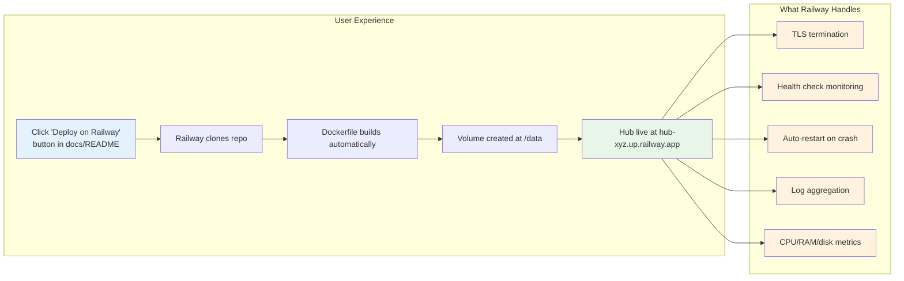
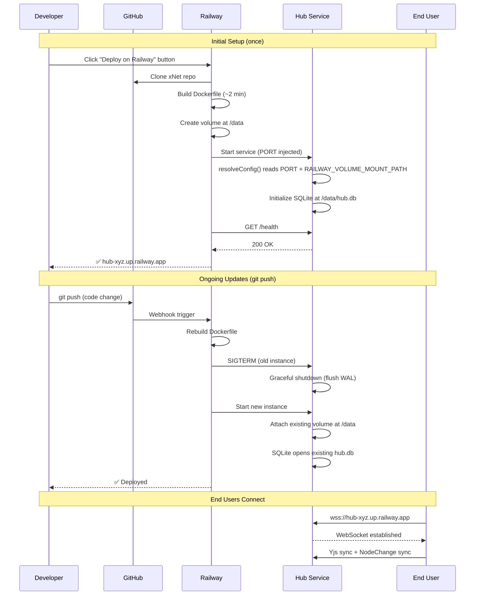

# 17: Railway Deployment (Default)

> One-click PaaS deployment via Railway — usage-based pricing, zero sysadmin, GitHub-integrated CI/CD

**Dependencies:** `07-docker-deploy.md`, `01-package-scaffold.md`
**Modifies:** `packages/hub/src/server.ts`, `packages/hub/src/cli.ts`, `packages/hub/railway.toml`, `packages/hub/Dockerfile`

## Codebase Status (Feb 2026)

> **Railway support does not exist yet.** The Hub is designed for VPS/Fly.io deployment (see `07-docker-deploy.md`). The server currently reads `--port` and `--data` CLI flags but does not respect the `PORT` or `RAILWAY_VOLUME_MOUNT_PATH` environment variables that Railway injects.
>
> Relevant existing work:
>
> - [Exploration 0049](../explorations/0049_HUB_RAILWAY_DEPLOYMENT.md) — Full Railway analysis: platform constraints, cost comparison, architecture compatibility, implementation plan
> - `packages/hub/src/server.ts` (150 LOC) — Hono HTTP + WS server, currently hardcodes port from CLI config
> - `packages/hub/src/cli.ts` (66 LOC) — Commander.js CLI, no env var fallback
> - `07-docker-deploy.md` — Docker + Fly.io deployment (existing step)

## Overview

Railway is a usage-based PaaS where you pay per-second for CPU, memory, and storage. For a personal or small-team Hub, Railway is significantly cheaper than a fixed-cost VPS ($0-2/mo vs $5/mo) and dramatically simpler to deploy — no SSH, no Docker knowledge, no TLS configuration. Git push deploys, automatic HTTPS, built-in metrics.

Railway becomes the **default recommended deployment method** for new Hub users, with VPS/Fly.io as options for power users or high-traffic Hubs.



### Cost Comparison

| Scenario                |         Railway (Hobby)         | VPS (Hetzner/DO) |  Fly.io   |
| ----------------------- | :-----------------------------: | :--------------: | :-------: |
| Solo dev (1 user)       |  **~$0/mo** (within $5 credit)  |  $4-5/mo fixed   | ~$3-5/mo  |
| Small team (3-5 users)  | **~$0-1/mo** (within $5 credit) |  $4-5/mo fixed   | ~$3-5/mo  |
| Active team (10+ users) |            ~$8-15/mo            |  $6-12/mo fixed  | ~$5-10/mo |

Railway is cheaper for the vast majority of personal and small-team Hubs.

## Design Decisions

| Decision                  | Choice                                                                   | Rationale                                                        |
| ------------------------- | ------------------------------------------------------------------------ | ---------------------------------------------------------------- |
| Default deployment target | Railway                                                                  | Simplest UX, cheapest for small Hubs, GitHub-integrated          |
| Port binding              | Read `PORT` env, fallback to CLI `--port`, then 4444                     | Railway injects `PORT`; VPS users use CLI flags                  |
| Data directory            | Read `RAILWAY_VOLUME_MOUNT_PATH`, then `HUB_DATA_DIR`, then CLI `--data` | Railway auto-sets volume path; backward-compatible               |
| Volume permissions        | Set `RAILWAY_RUN_UID=0` in Railway env                                   | Railway mounts volumes as root; simpler than chown in entrypoint |
| Config as code            | `railway.toml` in packages/hub/                                          | Declarative, version-controlled, auto-applied on deploy          |
| Template                  | Railway template with pre-configured volume + env                        | One-click deploy button in README and docs                       |
| Graceful shutdown         | SIGTERM handler flushes WAL + closes WS                                  | Railway sends SIGTERM with ~10s grace period                     |

## Implementation

### 1. Environment Variable Resolution

```typescript
// packages/hub/src/config.ts

/**
 * Resolve Hub configuration from environment variables, CLI flags,
 * and defaults. Environment variables take precedence over CLI flags
 * for platform compatibility (Railway, Fly.io, etc.).
 *
 * Resolution order (first wins):
 * 1. Railway-specific env vars (PORT, RAILWAY_VOLUME_MOUNT_PATH)
 * 2. Generic env vars (HUB_PORT, HUB_DATA_DIR)
 * 3. CLI flags (--port, --data)
 * 4. Defaults (4444, ./xnet-hub-data)
 */
export function resolveConfig(cliOptions: Partial<HubConfig>): HubConfig {
  const port = Number(process.env.PORT) || Number(process.env.HUB_PORT) || cliOptions.port || 4444

  const dataDir =
    process.env.RAILWAY_VOLUME_MOUNT_PATH ||
    process.env.HUB_DATA_DIR ||
    cliOptions.dataDir ||
    './xnet-hub-data'

  const logLevel =
    (process.env.HUB_LOG_LEVEL as HubConfig['logLevel']) || cliOptions.logLevel || 'info'

  return {
    port,
    dataDir,
    storage: cliOptions.storage ?? 'sqlite',
    auth: cliOptions.auth ?? true,
    maxMessageSize: cliOptions.maxMessageSize ?? 5 * 1024 * 1024,
    maxConnections: cliOptions.maxConnections ?? 1000,
    defaultQuota: cliOptions.defaultQuota ?? 1024 ** 3,
    logLevel
  }
}
```

### 2. Update CLI to Use resolveConfig

```typescript
// packages/hub/src/cli.ts (changes)

import { resolveConfig } from './config'

program
  .option('-p, --port <number>', 'Listen port (default: 4444)')
  .option('-d, --data <path>', 'Data directory')
  .option('--no-auth', 'Disable UCAN authentication')
  .option('--storage <type>', 'Storage backend: sqlite | memory', 'sqlite')
  .option('--max-connections <number>', 'Max WebSocket connections', '1000')
  .option('--log-level <level>', 'Log level: debug | info | warn | error', 'info')
  .action(async (opts) => {
    const config = resolveConfig({
      port: opts.port ? Number(opts.port) : undefined,
      dataDir: opts.data,
      auth: opts.auth,
      storage: opts.storage,
      maxConnections: opts.maxConnections ? Number(opts.maxConnections) : undefined,
      logLevel: opts.logLevel
    })

    const hub = await createHub(config)
    await hub.start()

    console.log(`[hub] Listening on port ${config.port}`)
    console.log(`[hub] Data directory: ${config.dataDir}`)
    console.log(`[hub] Storage: ${config.storage}`)
    console.log(`[hub] Auth: ${config.auth ? 'enabled' : 'disabled'}`)
  })
```

### 3. Update Server to Use Resolved Port

```typescript
// packages/hub/src/server.ts (change)

// Before:
// const port = config.port

// After:
const port = config.port // Already resolved by resolveConfig()
// No change needed in server.ts — config resolution happens in cli.ts/createHub()
```

### 4. Railway Config as Code

```toml
# packages/hub/railway.toml

[build]
builder = "dockerfile"
dockerfilePath = "Dockerfile"

[deploy]
startCommand = "node packages/hub/dist/cli.js"
healthcheckPath = "/health"
healthcheckTimeout = 10
restartPolicyType = "on_failure"
restartPolicyMaxRetries = 5
```

The `railway.toml` intentionally does NOT specify port or data directory — those come from Railway's injected environment variables (`PORT` and `RAILWAY_VOLUME_MOUNT_PATH`).

### 5. Dockerfile Adjustments for Railway

The existing Dockerfile from `07-docker-deploy.md` needs minor adjustments:

```dockerfile
# packages/hub/Dockerfile (additions/changes for Railway compatibility)

# ... existing multi-stage build ...

# Runtime stage additions:

# Railway mounts volumes as root. If running on Railway, the container
# runs as root (RAILWAY_RUN_UID=0). On VPS, we keep the node user.
# The entrypoint handles both cases.

# Remove USER node — Railway needs root for volume access
# USER node  # Commented out for Railway compatibility

# Create data directory (used on VPS; Railway provides its own mount)
RUN mkdir -p /data

ENV NODE_ENV=production

# Don't hardcode PORT — Railway injects it
# ENV HUB_PORT=4444  # Removed

EXPOSE 4444

HEALTHCHECK --interval=30s --timeout=5s --start-period=10s --retries=3 \
  CMD wget -qO- http://localhost:${PORT:-4444}/health || exit 1

# Use config resolution — reads PORT, RAILWAY_VOLUME_MOUNT_PATH, etc.
ENTRYPOINT ["node", "packages/hub/dist/cli.js"]
# No CMD args — let environment variables drive configuration
```

### 6. Railway Template Configuration

Create a Railway template that pre-configures everything for one-click deployment:

```json
// railway-template.json (submitted to Railway's template registry)
{
  "name": "xNet Hub",
  "description": "Local-first sync relay, encrypted backup, and search. Zero-knowledge by default.",
  "icon": "https://raw.githubusercontent.com/crs48/xNet/main/site/public/favicon.svg",
  "repo": "https://github.com/crs48/xNet",
  "services": [
    {
      "name": "hub",
      "source": {
        "repo": "https://github.com/crs48/xNet",
        "branch": "main"
      },
      "build": {
        "builder": "dockerfile",
        "dockerfilePath": "packages/hub/Dockerfile"
      },
      "deploy": {
        "healthcheckPath": "/health",
        "restartPolicyType": "on_failure"
      },
      "envVars": {
        "NODE_ENV": "production",
        "HUB_LOG_LEVEL": "info"
      },
      "volumes": [
        {
          "mountPath": "/data",
          "name": "hub-data"
        }
      ]
    }
  ]
}
```

### 7. Deploy Button for README / Docs

```markdown
<!-- Add to README.md and Hub docs -->

[](https://railway.app/template/xnet-hub)
```

When clicked, this:

1. Forks the repo into the user's Railway project
2. Builds the Dockerfile
3. Creates a persistent volume at `/data`
4. Starts the Hub with auto-detected `PORT` and `RAILWAY_VOLUME_MOUNT_PATH`
5. Provides a `*.up.railway.app` URL with automatic HTTPS

### 8. Graceful Shutdown (Railway-Specific)

Railway sends `SIGTERM` with a default grace period of ~10 seconds. The existing shutdown handler from `07-docker-deploy.md` works, but we should ensure it completes within that window:

```typescript
// packages/hub/src/lifecycle/shutdown.ts (addition)

/**
 * Railway-specific: Set a hard timeout to ensure we exit
 * within Railway's grace period even if persistence hangs.
 */
const RAILWAY_GRACE_MS = 8_000 // Leave 2s buffer before Railway kills us

const shutdown = async (signal: string) => {
  if (shutdownInProgress) return
  shutdownInProgress = true

  // Hard timeout: exit even if persistence is stuck
  const forceExitTimer = setTimeout(() => {
    logger.error('[shutdown] Force exit — persistence took too long')
    process.exit(1)
  }, RAILWAY_GRACE_MS)
  forceExitTimer.unref() // Don't keep process alive

  logger.info(`[shutdown] Received ${signal}, starting graceful shutdown...`)
  const start = Date.now()

  // ... existing shutdown logic (close HTTP, close WS, persist docs, close SQLite) ...

  clearTimeout(forceExitTimer)
  logger.info(`[shutdown] Complete in ${Date.now() - start}ms`)
  process.exit(0)
}
```

## Deployment Workflow



## Migration from VPS / Fly.io

Users with existing VPS or Fly.io deployments can migrate to Railway:

1. **Export data**: SSH into VPS, `tar czf hub-data.tar.gz /data/`
2. **Deploy on Railway**: Click button, wait for build
3. **Import data**: Use Railway CLI to copy data:
   ```bash
   railway login
   railway link
   railway volume cp hub-data.tar.gz hub-data:/
   railway exec tar xzf /data/hub-data.tar.gz -C /data/
   ```
4. **Update clients**: Change `hubUrl` from `wss://old-hub.example.com` to `wss://hub-xyz.up.railway.app`

No data format changes — SQLite database and blob files are directly portable.

## Tests

```typescript
// packages/hub/test/config.test.ts

import { describe, it, expect, beforeEach, afterEach } from 'vitest'
import { resolveConfig } from '../src/config'

describe('resolveConfig', () => {
  const originalEnv = { ...process.env }

  afterEach(() => {
    process.env = { ...originalEnv }
  })

  it('uses defaults when no env or CLI options provided', () => {
    const config = resolveConfig({})
    expect(config.port).toBe(4444)
    expect(config.dataDir).toBe('./xnet-hub-data')
  })

  it('reads PORT env var (Railway)', () => {
    process.env.PORT = '8080'
    const config = resolveConfig({ port: 4444 })
    expect(config.port).toBe(8080) // Env takes precedence over CLI
  })

  it('reads RAILWAY_VOLUME_MOUNT_PATH', () => {
    process.env.RAILWAY_VOLUME_MOUNT_PATH = '/railway-data'
    const config = resolveConfig({ dataDir: '/custom' })
    expect(config.dataDir).toBe('/railway-data') // Railway takes precedence
  })

  it('reads HUB_PORT when PORT is not set', () => {
    process.env.HUB_PORT = '5555'
    const config = resolveConfig({})
    expect(config.port).toBe(5555)
  })

  it('reads HUB_DATA_DIR when RAILWAY_VOLUME_MOUNT_PATH is not set', () => {
    process.env.HUB_DATA_DIR = '/hub-data'
    const config = resolveConfig({})
    expect(config.dataDir).toBe('/hub-data')
  })

  it('falls back to CLI options when no env vars set', () => {
    const config = resolveConfig({ port: 9999, dataDir: '/my-data' })
    expect(config.port).toBe(9999)
    expect(config.dataDir).toBe('/my-data')
  })

  it('PORT takes precedence over HUB_PORT', () => {
    process.env.PORT = '3000'
    process.env.HUB_PORT = '5000'
    const config = resolveConfig({})
    expect(config.port).toBe(3000)
  })

  it('RAILWAY_VOLUME_MOUNT_PATH takes precedence over HUB_DATA_DIR', () => {
    process.env.RAILWAY_VOLUME_MOUNT_PATH = '/railway'
    process.env.HUB_DATA_DIR = '/generic'
    const config = resolveConfig({})
    expect(config.dataDir).toBe('/railway')
  })
})

// packages/hub/test/railway-deploy.test.ts

import { describe, it, expect, beforeAll, afterAll } from 'vitest'
import { createHub, type HubInstance } from '../src'

describe('Railway Deployment Compatibility', () => {
  let hub: HubInstance

  beforeAll(async () => {
    // Simulate Railway environment
    process.env.PORT = '14450'
    process.env.RAILWAY_VOLUME_MOUNT_PATH = '/tmp/railway-test-data'

    hub = await createHub({
      auth: false,
      storage: 'memory'
    })
    await hub.start()
  })

  afterAll(async () => {
    await hub.stop()
    delete process.env.PORT
    delete process.env.RAILWAY_VOLUME_MOUNT_PATH
  })

  it('listens on PORT env var', async () => {
    const res = await fetch('http://localhost:14450/health')
    expect(res.status).toBe(200)
  })

  it('health check returns expected shape', async () => {
    const res = await fetch('http://localhost:14450/health')
    const body = await res.json()
    expect(body.status).toBe('ok')
    expect(body.uptime).toBeGreaterThan(0)
  })

  it('responds to WebSocket upgrade', async () => {
    const ws = new WebSocket('ws://localhost:14450')
    const opened = await new Promise<boolean>((resolve) => {
      ws.addEventListener('open', () => resolve(true))
      ws.addEventListener('error', () => resolve(false))
    })
    expect(opened).toBe(true)
    ws.close()
  })
})
```

## Checklist

- [ ] Create `resolveConfig()` with env var → CLI → default resolution chain
- [ ] Update `cli.ts` to use `resolveConfig()`
- [ ] Update `createHub()` to accept resolved config
- [ ] Add `railway.toml` to `packages/hub/`
- [ ] Adjust Dockerfile for Railway volume permissions (remove `USER node`)
- [ ] Add `RAILWAY_GRACE_MS` timeout to shutdown handler
- [ ] Healthcheck uses `${PORT:-4444}` in Dockerfile
- [ ] Create Railway template (submit to railway.app/templates)
- [ ] Add "Deploy on Railway" button to README.md
- [ ] Add "Deploy on Railway" button to site Hub docs
- [ ] Write `resolveConfig` unit tests
- [ ] Write Railway deployment integration tests
- [ ] Update landing page Hubs section to mention Railway
- [ ] Document migration from VPS/Fly.io to Railway

---

[← Previous: Crawl Coordination](./16-crawl-coordination.md) | [Back to README](./README.md) | [Next: Fly.io Deployment →](./18-flyio-deploy.md)
