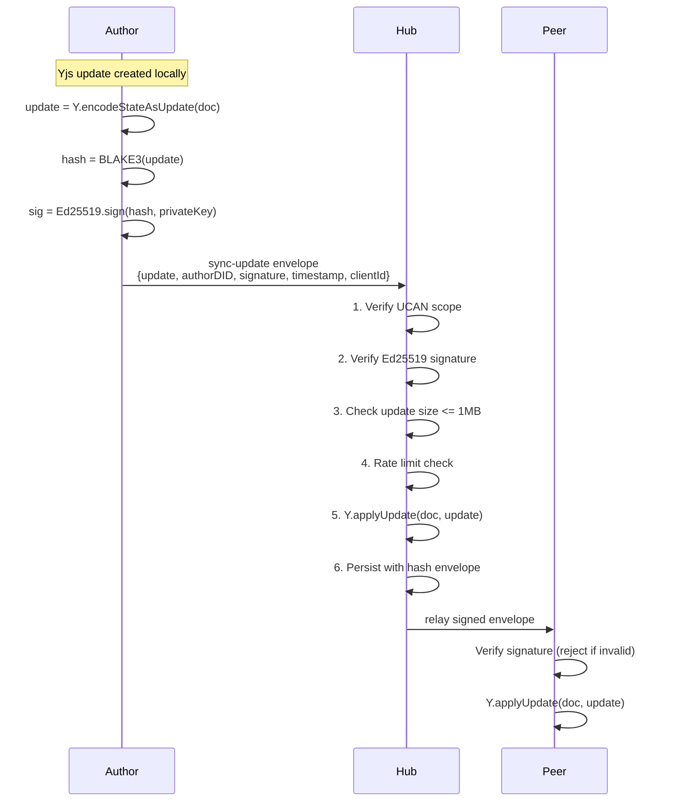
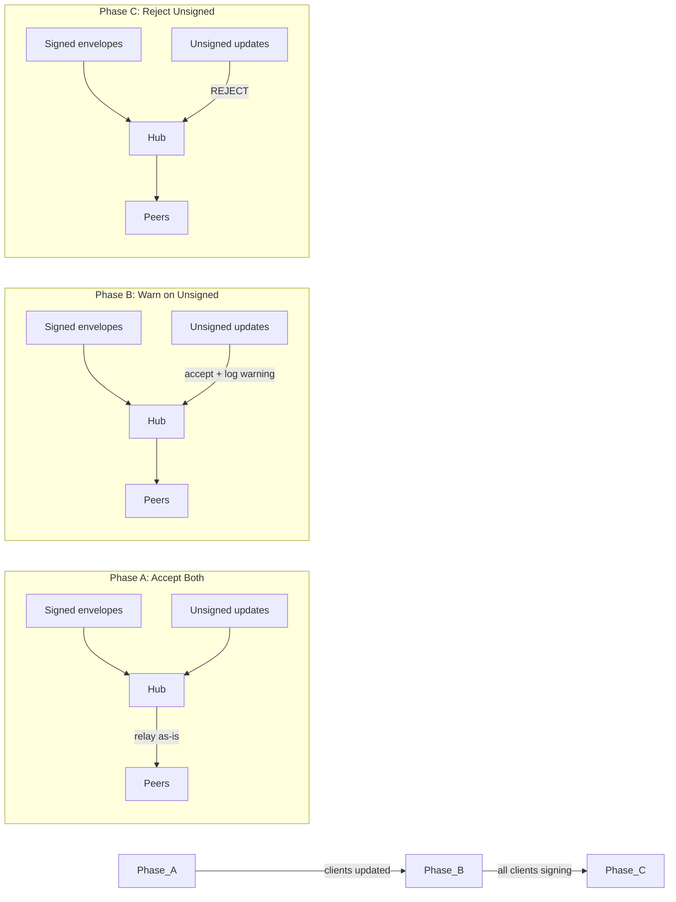

# Phase 16: Yjs Security (Days 27-29)

> Closes the security gap between signed NodeChanges and unsigned Yjs updates

## Context

The [Yjs Security Analysis](../explorations/YJS_SECURITY_ANALYSIS.md) identified that rich text updates have no signing, no hashing, and no author attribution — meaning an authorized-but-malicious peer can irreversibly corrupt documents, impersonate authors, or bypass NodeChange signatures via the MetaBridge.

This phase implements Tier 1 (immediate) and Tier 2 (defense-in-depth) mitigations within the hub and client sync layer.

## Architecture



## Data Structures

### SignedYjsEnvelope

```typescript
interface SignedYjsEnvelope {
  /** Raw Yjs update bytes (base64-encoded over the wire) */
  update: Uint8Array

  /** Author's DID (did:key:...) */
  authorDID: DID

  /** Ed25519 signature over BLAKE3(update) */
  signature: Uint8Array

  /** Wall clock timestamp (for ordering/debugging, not authoritative) */
  timestamp: number

  /** The Yjs clientID this author is using in this session */
  clientId: number
}
```

### Wire Format (WebSocket Messages)

```typescript
// Current format (insecure):
{ type: 'sync-update', room: string, data: Uint8Array }

// New format:
{ type: 'sync-update', room: string, envelope: SignedYjsEnvelope }

// Backward compat: hub accepts both during migration, but
// unsigned updates are rejected when `requireSignedUpdates: true` (default in production)
```

### Storage Envelope (at rest)

```typescript
interface PersistedYjsState {
  /** Full Y.Doc state (Y.encodeStateAsUpdate) */
  state: Uint8Array

  /** BLAKE3 hash of state (for tamper detection on load) */
  hash: string

  /** Last update timestamp */
  updatedAt: number

  /** Number of updates merged since last full snapshot */
  updateCount: number
}
```

## Implementation Tasks

### 16.1 Signed Envelope Protocol (Hub)

**File:** `packages/hub/src/services/yjs-security.ts`

```typescript
import { blake3 } from '@xnet/crypto'
import { verifySignature, resolveDidKey } from '@xnet/identity'

export interface YjsSecurityConfig {
  /** Reject unsigned updates (false for dev/migration) */
  requireSignedUpdates: boolean
  /** Max update size in bytes */
  maxUpdateSize: number // default: 1MB (1_048_576)
  /** Max updates per second per connection */
  maxUpdatesPerSecond: number // default: 30
}

export class YjsSecurityService {
  constructor(private config: YjsSecurityConfig) {}

  /**
   * Verify a signed Yjs envelope.
   * Returns { valid: true } or { valid: false, reason: string }
   */
  async verifyEnvelope(envelope: SignedYjsEnvelope): Promise<VerifyResult> {
    // 1. Size check (fast path reject)
    if (envelope.update.length > this.config.maxUpdateSize) {
      return { valid: false, reason: 'update_too_large' }
    }

    // 2. Compute BLAKE3 hash of the update bytes
    const hash = blake3(envelope.update)

    // 3. Resolve author's public key from DID
    const publicKey = resolveDidKey(envelope.authorDID)

    // 4. Verify Ed25519 signature over the hash
    const sigValid = await verifySignature(hash, envelope.signature, publicKey)
    if (!sigValid) {
      return { valid: false, reason: 'invalid_signature' }
    }

    return { valid: true }
  }
}
```

**Integration in RelayService:**

```typescript
// In relay.ts handleSyncUpdate():
async handleSyncUpdate(ws: WebSocket, msg: SyncUpdateMessage) {
  const { room, envelope } = msg

  // Tier 1: Verify signature
  if (envelope) {
    const result = await this.yjsSecurity.verifyEnvelope(envelope)
    if (!result.valid) {
      this.peerScorer.penalize(ws, result.reason)
      return // Drop the update
    }
  } else if (this.config.requireSignedUpdates) {
    this.peerScorer.penalize(ws, 'unsigned_update')
    return
  }

  // Rate limit check
  if (!this.rateLimiter.allowYjsUpdate(ws)) {
    this.peerScorer.penalize(ws, 'rate_exceeded')
    return
  }

  // Apply update (existing logic)
  const doc = await this.pool.getOrLoad(room)
  Y.applyUpdate(doc, envelope?.update ?? msg.data, 'relay')
  this.pool.markDirty(room)

  // Relay to other subscribers (with envelope intact)
  this.broadcast(room, ws, msg)
}
```

### 16.2 Client-Side Signing (WebSocketSyncProvider)

**File:** `packages/react/src/sync/WebSocketSyncProvider.ts`

Changes to existing provider:

```typescript
// New constructor option:
interface SyncProviderOptions {
  // ... existing options
  /** Identity keypair for signing Yjs updates */
  identity?: { did: DID; privateKey: Uint8Array }
  /** Whether to verify incoming signed envelopes */
  verifyIncoming?: boolean // default: true
}

// In _handleLocalUpdate(update: Uint8Array):
private async _handleLocalUpdate(update: Uint8Array) {
  if (this.identity) {
    const hash = blake3(update)
    const signature = await ed25519Sign(hash, this.identity.privateKey)
    const envelope: SignedYjsEnvelope = {
      update,
      authorDID: this.identity.did,
      signature,
      timestamp: Date.now(),
      clientId: this.doc.clientID
    }
    this.ws.send(encode({ type: 'sync-update', room: this.room, envelope }))
  } else {
    // Legacy unsigned (dev mode only)
    this.ws.send(encode({ type: 'sync-update', room: this.room, data: update }))
  }
}

// In _handleRemoteMessage(msg):
private async _handleRemoteMessage(msg: SyncUpdateMessage) {
  if (msg.envelope && this.verifyIncoming) {
    const hash = blake3(msg.envelope.update)
    const pubKey = resolveDidKey(msg.envelope.authorDID)
    const valid = await verifySignature(hash, msg.envelope.signature, pubKey)
    if (!valid) {
      console.warn('Rejected Yjs update: invalid signature from', msg.envelope.authorDID)
      return // Don't apply
    }
    Y.applyUpdate(this.doc, msg.envelope.update, msg.envelope.authorDID)
  } else {
    Y.applyUpdate(this.doc, msg.data, 'remote')
  }
}
```

### 16.3 MetaBridge Write-Only Fix

**File:** `packages/react/src/sync/meta-bridge.ts`

The MetaBridge currently observes Y.Doc meta map changes and writes them back to NodeStore — this allows Yjs corruption to poison the signed data layer. Fix: make it unidirectional.

```typescript
// BEFORE (vulnerable):
this.doc.getMap('meta').observe((event) => {
  for (const [key, change] of event.changes.keys) {
    if (change.action === 'update' || change.action === 'add') {
      // ⚠️ WRITES to NodeStore from unsigned Yjs data!
      this.nodeStore.setProperty(this.nodeId, key, this.doc.getMap('meta').get(key))
    }
  }
})

// AFTER (secure):
// Remove the Yjs→NodeStore observer entirely.
// Meta map is now write-only from NodeStore's perspective:
// - NodeStore changes → MetaBridge → Y.Doc meta map (for editor UI)
// - Y.Doc meta map changes are IGNORED (display only)

// The NodeStore→Yjs direction remains:
this.nodeStore.onChange(this.nodeId, (change) => {
  for (const [key, value] of Object.entries(change.payload.properties ?? {})) {
    this.doc.getMap('meta').set(key, value)
  }
})
```

### 16.4 Update Size Limits

Add enforcement at both client and hub:

**Client-side** (`WebSocketSyncProvider.ts`):

```typescript
const MAX_YJS_UPDATE_SIZE = 1_048_576 // 1MB

private _handleLocalUpdate(update: Uint8Array) {
  if (update.length > MAX_YJS_UPDATE_SIZE) {
    console.warn(`Yjs update too large (${update.length} bytes), chunking...`)
    // Chunk large initial syncs into smaller pieces
    this._sendChunked(update)
    return
  }
  // ... normal send
}
```

**Hub-side** (handled in YjsSecurityService.verifyEnvelope above)

### 16.5 Yjs Peer Scoring

**File:** `packages/hub/src/services/yjs-peer-scoring.ts`

```typescript
interface YjsPeerMetrics {
  updatesPerMinute: number
  averageUpdateSize: number
  invalidSignatures: number
  oversizedUpdates: number
  rejectedUpdates: number
}

export class YjsPeerScorer {
  private metrics = new Map<string, YjsPeerMetrics>()
  private readonly thresholds = {
    maxInvalidSignatures: 3, // 3 strikes → block
    maxOversizedUpdates: 5,
    maxUpdatesPerMinute: 300 // ~5/sec sustained
  }

  penalize(peerId: string, reason: string): void {
    const m = this.getMetrics(peerId)
    switch (reason) {
      case 'invalid_signature':
        m.invalidSignatures++
        if (m.invalidSignatures >= this.thresholds.maxInvalidSignatures) {
          this.blockPeer(peerId)
        }
        break
      case 'update_too_large':
        m.oversizedUpdates++
        break
      case 'rate_exceeded':
        // Already rate-limited, just track
        break
    }
  }
}
```

### 16.6 Hash-at-Rest for Persisted Yjs State

**File:** `packages/hub/src/storage/sqlite.ts` (extend existing adapter)

```sql
-- Add hash column to existing crdt_state table:
ALTER TABLE crdt_state ADD COLUMN state_hash TEXT;
ALTER TABLE crdt_state ADD COLUMN update_count INTEGER DEFAULT 0;
```

```typescript
// On persist:
async setDocState(docId: string, state: Uint8Array): Promise<void> {
  const hash = blake3Hex(state)
  this.db.prepare(`
    INSERT OR REPLACE INTO crdt_state (doc_id, state, state_hash, update_count, updated_at)
    VALUES (?, ?, ?, ?, ?)
  `).run(docId, state, hash, 0, Date.now())
}

// On load:
async getDocState(docId: string): Promise<Uint8Array | null> {
  const row = this.db.prepare('SELECT state, state_hash FROM crdt_state WHERE doc_id = ?').get(docId)
  if (!row) return null

  // Verify integrity
  if (row.state_hash && blake3Hex(row.state) !== row.state_hash) {
    throw new Error(`Document ${docId} state corrupted at rest (hash mismatch)`)
  }
  return row.state
}
```

## Configuration

```typescript
// In createHub() config:
interface HubConfig {
  // ... existing options

  yjs: {
    /** Require signed envelopes (default: true in production, false in anonymous mode) */
    requireSignedUpdates: boolean
    /** Max individual update size (default: 1MB) */
    maxUpdateSize: number
    /** Max updates per second per connection (default: 30) */
    maxUpdatesPerSecond: number
    /** Verify hash on load from storage (default: true) */
    verifyHashAtRest: boolean
  }
}
```

## Migration Strategy

The signed envelope is a **wire protocol change**. To avoid breaking existing clients:



1. **Phase A** (initial deploy): Hub accepts both signed and unsigned. Logs unsigned as warnings.
2. **Phase B** (after client update): Hub still accepts unsigned but peer scorer penalizes them.
3. **Phase C** (production cutover): `requireSignedUpdates: true` — unsigned rejected.

Anonymous mode (`--anonymous`) always stays in Phase A for local dev.

## Performance Impact

| Operation         | Cost            | At 5 updates/sec | Notes                     |
| ----------------- | --------------- | ---------------- | ------------------------- |
| BLAKE3 hash       | ~0.05ms per 1KB | 0.25ms/sec       | BLAKE3 is extremely fast  |
| Ed25519 sign      | ~0.1ms          | 0.5ms/sec        | Per update on client      |
| Ed25519 verify    | ~0.2ms          | 1.0ms/sec        | Per update on hub + peers |
| Envelope overhead | ~200 bytes      | 1KB/sec          | DID + sig + metadata      |
| Total per update  | ~0.3ms client   | Negligible       | No perceptible latency    |

Typical typing generates 1-5 Yjs updates/sec. Total overhead is <2ms/sec — invisible to users.

## Testing Strategy

```typescript
describe('YjsSecurityService', () => {
  it('accepts valid signed envelope', async () => { ... })
  it('rejects envelope with wrong signature', async () => { ... })
  it('rejects envelope exceeding size limit', async () => { ... })
  it('rejects unsigned update when requireSignedUpdates=true', async () => { ... })
  it('accepts unsigned update when requireSignedUpdates=false', async () => { ... })
  it('rate-limits excessive updates per connection', async () => { ... })
})

describe('WebSocketSyncProvider (signing)', () => {
  it('signs outgoing updates when identity is provided', async () => { ... })
  it('verifies incoming signed updates', async () => { ... })
  it('rejects incoming updates with invalid signatures', async () => { ... })
  it('sends unsigned when no identity (dev mode)', async () => { ... })
})

describe('MetaBridge (write-only)', () => {
  it('propagates NodeStore changes to Y.Doc meta map', () => { ... })
  it('does NOT propagate Y.Doc meta map changes to NodeStore', () => { ... })
  it('display-only reads from Y.Doc meta still work', () => { ... })
})

describe('Hash-at-rest', () => {
  it('stores BLAKE3 hash alongside Yjs state', async () => { ... })
  it('detects corruption on load (hash mismatch)', async () => { ... })
  it('loads normally when hash matches', async () => { ... })
})

describe('YjsPeerScorer', () => {
  it('blocks peer after 3 invalid signatures', () => { ... })
  it('tracks update rate and size metrics', () => { ... })
  it('does not penalize legitimate high-frequency edits', () => { ... })
})
```

## Success Criteria

- [ ] Signed Yjs envelopes verified on hub before `Y.applyUpdate()`
- [ ] Client signs all outgoing Yjs updates when identity is provided
- [ ] Incoming updates with invalid signatures are rejected (not applied)
- [ ] MetaBridge is unidirectional: NodeStore → Y.Doc only
- [ ] Updates exceeding 1MB are rejected at both client and hub
- [ ] Rate limiting prevents >30 updates/sec per connection
- [ ] Peer scorer blocks after 3 invalid signature attempts
- [ ] Persisted Yjs state includes BLAKE3 hash, verified on load
- [ ] Migration path: hub accepts unsigned in anonymous/dev mode
- [ ] Performance overhead <2ms/sec at typical typing speed

## Dependencies

| Package          | What's Needed                                  |
| ---------------- | ---------------------------------------------- |
| `@xnet/crypto`   | `blake3()`, `ed25519Sign()`, `ed25519Verify()` |
| `@xnet/identity` | `resolveDidKey()` (extract pubkey from DID)    |
| `@xnet/hub`      | RelayService, PeerScorer, storage adapter      |
| `@xnet/react`    | WebSocketSyncProvider, MetaBridge              |

## References

- [Yjs Security Analysis](../explorations/YJS_SECURITY_ANALYSIS.md) — Full threat model and tiered recommendations
- [Node Change Architecture](../explorations/NODE_CHANGE_ARCHITECTURE.md) — How the secure NodeChange path works
- [UCAN Auth (Phase 2)](./02-ucan-auth.md) — Room-level access control
- [Sync Relay (Phase 3)](./03-sync-relay.md) — Current relay implementation (blind apply)
- [Client Integration (Phase 7)](./08-client-integration.md) — UCAN in WebSocketSyncProvider
