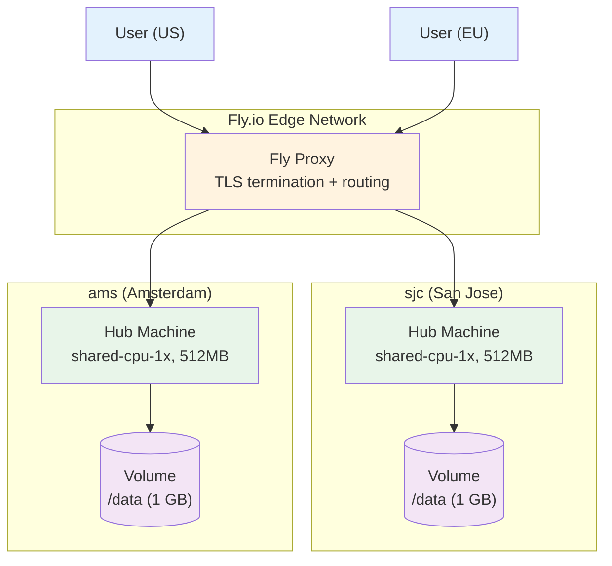
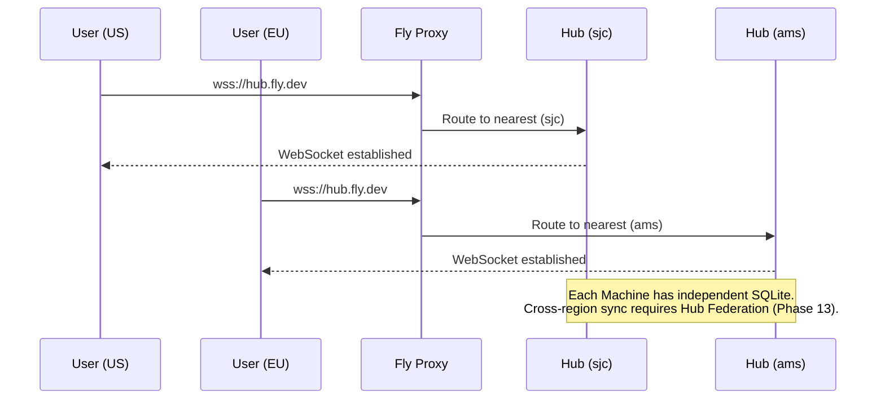
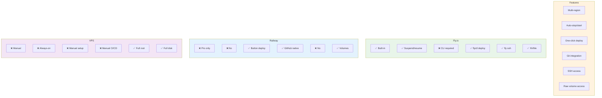

# 18: Fly.io Deployment

> Multi-region deployment with Fly Machines, auto-start/stop, and persistent volumes — ideal for latency-sensitive or geographically distributed teams

**Dependencies:** `07-docker-deploy.md`, `17-railway-deploy.md`
**Modifies:** `packages/hub/fly.toml`, `packages/hub/Dockerfile`, `packages/hub/src/config.ts`

## Codebase Status (Feb 2026)

> **A planned `fly.toml` exists in `07-docker-deploy.md` but has not been created as an actual file.** The signaling server is already deployed on Fly.io (`infrastructure/signaling/fly.toml`, app `xnet-signaling`, region `sjc`). The Hub will eventually replace the signaling server.
>
> Relevant existing work:
>
> - `infrastructure/signaling/fly.toml` (40 LOC) — Working Fly.io deployment config for the stateless signaling server
> - `infrastructure/signaling/Dockerfile` (24 LOC) — Multi-stage Node 20 Alpine build
> - `07-docker-deploy.md` — Docker + Fly.io deployment plan (Dockerfile, fly.toml draft, graceful shutdown, rate limiting, metrics)
> - `17-railway-deploy.md` — Railway deployment with `resolveConfig()` env var resolution (Hub already reads `PORT` env var after this step)
> - [Exploration 0049](../explorations/0049_HUB_RAILWAY_DEPLOYMENT.md) — Platform comparison (Railway vs VPS vs Fly.io)

## Overview

Fly.io is a platform that runs Docker containers as lightweight VMs ("Machines") in data centers worldwide. It's the best option when you need:

- **Multi-region deployment** — run Hub instances close to your users
- **Auto-start/stop** — Machines sleep when idle and wake on incoming requests (saves cost)
- **WebSocket-native proxy** — Fly's proxy handles TLS and connection routing
- **Persistent volumes** — per-Machine attached NVMe storage for SQLite

Fly.io is more hands-on than Railway but offers lower-level control and built-in multi-region support.



### Cost Comparison

Fly.io charges for Machine uptime + volumes + egress. For a Hub:

| Config                        | Always-on cost | With auto-stop |
| ----------------------------- | :------------: | :------------: |
| shared-cpu-1x, 256MB, 1GB vol |   ~$2.17/mo    | ~$0.50-1.50/mo |
| shared-cpu-1x, 512MB, 1GB vol |   ~$3.47/mo    |  ~$1-2.50/mo   |
| shared-cpu-1x, 1GB, 1GB vol   |   ~$6.07/mo    |    ~$2-4/mo    |

Plus egress at $0.02/GB (NA/EU), $0.04/GB (APAC), $0.12/GB (Africa/India).

**Note:** Fly.io's auto-start/stop feature can wake Machines on incoming HTTP/WebSocket requests, but **WebSocket connections will be dropped when the Machine stops**. Clients must handle reconnection. The Hub's existing reconnection logic (via ConnectionManager) handles this gracefully.

## Design Decisions

| Decision        | Choice                                     | Rationale                                                                |
| --------------- | ------------------------------------------ | ------------------------------------------------------------------------ |
| Machine size    | shared-cpu-1x, 512MB                       | Minimum viable for SQLite + Node.js; scales up easily                    |
| Region strategy | Single-region default, multi-region opt-in | Single region is simpler; multi-region requires separate volumes         |
| Volume size     | 1 GB initial                               | Sufficient for most personal Hubs; growable via `fly volumes extend`     |
| Auto-stop       | Enabled by default                         | Saves cost for low-traffic Hubs; acceptable reconnection latency (~2-3s) |
| Health checks   | HTTP at `/health`                          | Fly's proxy uses health checks for routing and auto-start decisions      |
| Metrics         | Prometheus at `/metrics`                   | Fly.io can scrape Prometheus endpoints natively                          |
| Fly Proxy       | HTTP service with WebSocket support        | Fly handles TLS and routes to nearest healthy Machine                    |

## Implementation

### 1. fly.toml Configuration

```toml
# packages/hub/fly.toml

app = "xnet-hub"
primary_region = "sjc"

[build]
  dockerfile = "Dockerfile"

[env]
  NODE_ENV = "production"
  HUB_LOG_LEVEL = "info"

[http_service]
  internal_port = 4444
  force_https = true
  auto_stop_machines = "suspend"
  auto_start_machines = true
  min_machines_running = 0

  [http_service.concurrency]
    type = "connections"
    hard_limit = 1000
    soft_limit = 800

[[vm]]
  size = "shared-cpu-1x"
  memory = "512mb"

[mounts]
  source = "xnet_hub_data"
  destination = "/data"

[checks]
  [checks.health]
    port = 4444
    type = "http"
    interval = "15s"
    timeout = "5s"
    path = "/health"
    method = "GET"

[metrics]
  port = 4444
  path = "/metrics"
```

Key differences from the draft in `07-docker-deploy.md`:

| Setting                | 07-docker-deploy draft | This version | Reason                                                                   |
| ---------------------- | ---------------------- | ------------ | ------------------------------------------------------------------------ |
| `auto_stop_machines`   | `false`                | `"suspend"`  | Cost savings — Machine suspends when idle, resumes on request (~2s wake) |
| `min_machines_running` | `1`                    | `0`          | Allow full suspension for low-traffic Hubs                               |
| `memory`               | `512mb`                | `512mb`      | Same — minimum for SQLite + Node.js                                      |

### 2. Fly.io-Specific Environment Variables

Fly.io injects several environment variables. The Hub's `resolveConfig()` from step 17 already handles `PORT`. Additional Fly-specific vars we can use:

```typescript
// packages/hub/src/config.ts (additions for Fly.io awareness)

export function resolveConfig(cliOptions: Partial<HubConfig>): HubConfig {
  // ... existing resolution from 17-railway-deploy.md ...

  // Fly.io provides FLY_REGION, FLY_MACHINE_ID, FLY_APP_NAME
  // These are informational — used for logging and health check response
  const flyRegion = process.env.FLY_REGION
  const flyMachineId = process.env.FLY_MACHINE_ID
  const flyAppName = process.env.FLY_APP_NAME

  return {
    ...baseConfig,
    // Metadata for health check / logging
    runtime: {
      platform: flyRegion ? 'fly' : process.env.RAILWAY_ENVIRONMENT ? 'railway' : 'standalone',
      region: flyRegion,
      machineId: flyMachineId,
      appName: flyAppName
    }
  }
}
```

### 3. Enhanced Health Check with Platform Info

```typescript
// packages/hub/src/server.ts (enhanced health endpoint)

app.get('/health', (c) => {
  const poolStats = pool.getStats()
  const rlStats = rateLimiter.getStats()

  return c.json({
    status: 'ok',
    uptime: process.uptime(),
    timestamp: Date.now(),
    version: VERSION,
    platform: config.runtime?.platform ?? 'standalone',
    region: config.runtime?.region ?? null,
    docs: {
      hot: poolStats.hot,
      warm: poolStats.warm,
      total: poolStats.total
    },
    connections: {
      active: rlStats.totalConnections,
      max: rlStats.maxConnections
    },
    memory: {
      rss: process.memoryUsage().rss,
      heapUsed: process.memoryUsage().heapUsed
    }
  })
})
```

### 4. Graceful Shutdown with Fly Suspend/Resume

When Fly.io suspends a Machine (via `auto_stop_machines = "suspend"`), it sends `SIGTERM`. The Machine has a grace period to clean up. On resume, the process restarts and the volume is re-attached.

The shutdown handler from `07-docker-deploy.md` already handles `SIGTERM`. One addition for Fly.io:

```typescript
// packages/hub/src/lifecycle/shutdown.ts (Fly.io addition)

// Fly.io sends SIGTERM when suspending. We need to flush SQLite WAL
// and close all connections quickly. Fly's default grace period is 5s
// for suspend, 10s for stop.
const GRACE_MS = process.env.FLY_MACHINE_ID ? 4_000 : 8_000

const forceExitTimer = setTimeout(() => {
  logger.error('[shutdown] Force exit — exceeded grace period')
  process.exit(1)
}, GRACE_MS)
forceExitTimer.unref()
```

### 5. Multi-Region Deployment

For teams with users across regions, Fly.io supports running multiple Machines with volumes in different regions. Each Machine has its own SQLite database — they do NOT share state directly.



**Important:** Multi-region Hub deployment is a Phase 13+ feature. Each region's Machine operates independently. For now, single-region is recommended. Multi-region becomes useful when Hub Federation (step 14) is implemented.

```bash
# Deploy to multiple regions
fly regions add ams  # Add Amsterdam
fly scale count 2    # One Machine per region
fly volumes create xnet_hub_data --region ams --size 1  # Volume per region
```

## Deployment Commands

```bash
# ─── First-Time Setup ─────────────────────────────────────

# Install Fly CLI
curl -L https://fly.io/install.sh | sh

# Login
fly auth login

# Launch app (creates app + first Machine)
cd packages/hub
fly launch --no-deploy

# Create persistent volume (1 GB in primary region)
fly volumes create xnet_hub_data --size 1 --region sjc

# Deploy
fly deploy

# Verify
fly status
fly logs


# ─── Day-to-Day Operations ───────────────────────────────

# View logs
fly logs

# Check health
curl https://xnet-hub.fly.dev/health

# SSH into running Machine
fly ssh console

# Check SQLite database
fly ssh console -C "ls -la /data/"

# Scale up memory
fly scale memory 1024

# Grow volume
fly volumes extend vol_abc123 --size 5

# Deploy update
fly deploy

# Rollback
fly releases rollback
```

## Fly.io vs Railway vs VPS



| Criteria              |           Fly.io           |            Railway             |              VPS               |
| --------------------- | :------------------------: | :----------------------------: | :----------------------------: |
| Best for              | Multi-region, auto-scaling | Simplest deploy, cheapest idle | Full control, predictable cost |
| Idle cost (solo)      |       ~$0.50-3.50/mo       |          ~$0-1.50/mo           |         $4-5/mo fixed          |
| Active cost (5 users) |        ~$3.50-6/mo         |            ~$3-5/mo            |         $4-5/mo fixed          |
| Deploy complexity     |        Medium (CLI)        |          Low (button)          |      High (SSH + Docker)       |
| Multi-region          |           Native           |         Pro plan only          |             Manual             |
| WebSocket support     |           Native           |             Native             |             Native             |
| SQLite + volumes      |            Yes             |              Yes               |              Yes               |
| Auto-TLS              |            Yes             |              Yes               |             Manual             |

## Tests

```typescript
// packages/hub/test/flyio-deploy.test.ts

import { describe, it, expect, afterEach } from 'vitest'
import { resolveConfig } from '../src/config'

describe('Fly.io Config Resolution', () => {
  const originalEnv = { ...process.env }

  afterEach(() => {
    process.env = { ...originalEnv }
  })

  it('detects Fly.io platform from FLY_REGION', () => {
    process.env.FLY_REGION = 'sjc'
    process.env.FLY_MACHINE_ID = 'machine123'
    process.env.FLY_APP_NAME = 'xnet-hub'
    const config = resolveConfig({})
    expect(config.runtime.platform).toBe('fly')
    expect(config.runtime.region).toBe('sjc')
    expect(config.runtime.machineId).toBe('machine123')
  })

  it('uses PORT=4444 as internal port on Fly', () => {
    // Fly.io sets internal_port in fly.toml, Hub listens on that port
    // PORT env var is not set by Fly — it uses internal_port from fly.toml
    const config = resolveConfig({ port: 4444 })
    expect(config.port).toBe(4444)
  })

  it('uses /data as dataDir for Fly volume mount', () => {
    process.env.HUB_DATA_DIR = '/data'
    const config = resolveConfig({})
    expect(config.dataDir).toBe('/data')
  })

  it('health check includes region info', async () => {
    // Integration test: start hub with Fly env vars, check /health
    process.env.FLY_REGION = 'ams'
    process.env.FLY_MACHINE_ID = 'test-machine'

    const { createHub } = await import('../src')
    const hub = await createHub({
      port: 14451,
      auth: false,
      storage: 'memory'
    })
    await hub.start()

    const res = await fetch('http://localhost:14451/health')
    const body = await res.json()
    expect(body.platform).toBe('fly')
    expect(body.region).toBe('ams')

    await hub.stop()
    delete process.env.FLY_REGION
    delete process.env.FLY_MACHINE_ID
  })
})
```

## Checklist

- [x] Create `fly.toml` in `packages/hub/` with suspend/resume config
- [x] Add Fly.io platform detection to `resolveConfig()` (`FLY_REGION`, `FLY_MACHINE_ID`)
- [x] Add `runtime` metadata to config (platform, region, machineId)
- [x] Include platform/region in `/health` response
- [x] Adjust shutdown grace period for Fly suspend (4s vs 8s)
- [ ] Verify Dockerfile works with `fly deploy`
- [ ] Test Machine suspend/resume cycle (SQLite WAL flush + reopen)
- [ ] Test WebSocket reconnection after Machine wake
- [x] Document single-region deployment commands
- [x] Document multi-region deployment (future, requires Hub Federation)
- [x] Write config resolution tests for Fly.io env vars
- [x] Write health check integration test with Fly metadata

---

[← Previous: Railway Deployment](./17-railway-deploy.md) | [Back to README](./README.md) | [Next: Hub Documentation →](./19-hub-docs.md)
