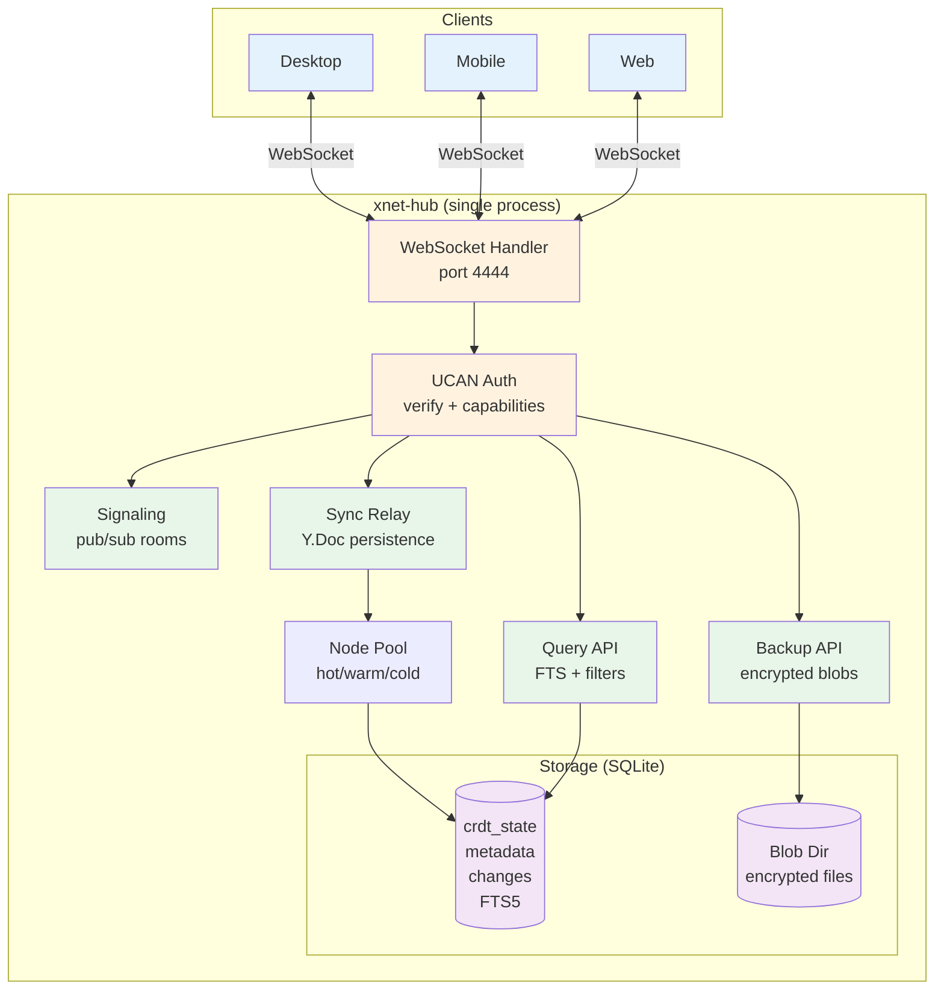

# xNet Implementation Plan - Step 03.8: Hub Phase 1 (VPS / Local Binary)

> Always-on relay, encrypted backup, and server-side queries in a single deployable process

## Executive Summary

The xNet Hub is a server that acts as an always-on sync peer for both rich text (Yjs) and structured data (NodeStore). It persists document state, provides encrypted backup, content-addressed file hosting, a schema registry, awareness persistence, peer discovery, and handles queries too large for mobile devices. It runs as a single process with embedded SQLite -- deployable via Docker or a local binary (`npx @xnet/hub`).

```typescript
// Start a hub (CLI or programmatic)
import { createHub } from '@xnet/hub'

const hub = await createHub({
  port: 4444,
  dataDir: './data',
  storage: 'sqlite' // or 'postgres' in Phase 2
})

await hub.start()
// Hub is now:
// - Signaling server (y-webrtc pub/sub)
// - Yjs sync relay (persists Y.Doc state)
// - Backup store (encrypted blobs)
// - Query endpoint (full-text search)
```

```bash
# Deploy to VPS
docker run -p 4444:4444 -v xnet-data:/data xnet/hub

# Or run locally (no Docker needed)
npx @xnet/hub --port 4444 --data ~/.xnet-hub
```

## Architecture Overview



## Architecture Decisions

| Decision               | Choice                              | Rationale                                  |
| ---------------------- | ----------------------------------- | ------------------------------------------ |
| Single process         | Node.js monolith                    | Simplest deploy, $5 VPS is enough          |
| Database               | SQLite (better-sqlite3)             | Zero-config, single-file backup, fast      |
| Blob storage           | Filesystem                          | Simple; S3 adapter is Phase 2              |
| Auth                   | UCAN tokens (existing)              | No new auth system, stateless              |
| Transport              | WebSocket (existing protocol)       | Zero client changes for signaling+relay    |
| HTTP framework         | Hono                                | Lightweight, typed, works on edge runtimes |
| CLI                    | Commander.js                        | Standard, minimal deps                     |
| Hub is a Yjs peer      | Participates in sync-step1/2/update | No protocol changes needed                 |
| Backup is opaque blobs | Server can't read content           | Zero-knowledge by default                  |

## Current State

| Component             | Status                                | Notes                                |
| --------------------- | ------------------------------------- | ------------------------------------ |
| Signaling server      | Exists in `infrastructure/signaling/` | Dumb relay, no persistence           |
| WebSocketSyncProvider | Working in `@xnet/react`              | Clients already relay through server |
| UCAN tokens           | Implemented in `@xnet/identity`       | Single-level verify works            |
| NodeStorageAdapter    | Interface defined in `@xnet/data`     | IndexedDB + Memory adapters exist    |
| Security layer        | Exists in `@xnet/network/security`    | Not wired into anything yet          |

## Implementation Phases

### Phase 1: Package Scaffold + Signaling (Day 1)

| Task | Document                                           | Description                                           |
| ---- | -------------------------------------------------- | ----------------------------------------------------- |
| 1.1  | [01-package-scaffold.md](./01-package-scaffold.md) | Create `packages/hub` with deps, tsconfig, Dockerfile |
| 1.2  | [01-package-scaffold.md](./01-package-scaffold.md) | CLI entry point with Commander.js                     |
| 1.3  | [01-package-scaffold.md](./01-package-scaffold.md) | Port signaling from `infrastructure/signaling/`       |

**Validation Gate:**

- [ ] `npx @xnet/hub` starts and shows "Hub listening on port 4444"
- [ ] Existing `WebSocketSyncProvider` connects without changes
- [ ] `/health` endpoint returns JSON status
- [ ] `infrastructure/signaling/` tests pass against new hub

### Phase 2: UCAN Authentication (Day 2)

| Task | Document                             | Description                            |
| ---- | ------------------------------------ | -------------------------------------- |
| 2.1  | [02-ucan-auth.md](./02-ucan-auth.md) | UCAN verification on WebSocket connect |
| 2.2  | [02-ucan-auth.md](./02-ucan-auth.md) | Room-level capability checks           |
| 2.3  | [02-ucan-auth.md](./02-ucan-auth.md) | Anonymous mode for dev/local use       |

**Validation Gate:**

- [ ] Connections without valid UCAN are rejected (unless anonymous mode)
- [ ] Room subscriptions require matching capability
- [ ] `--anonymous` flag disables auth (for local dev)

### Phase 3: Sync Relay (Days 3-4)

| Task | Document                                       | Description                                      |
| ---- | ---------------------------------------------- | ------------------------------------------------ |
| 3.1  | [03-sync-relay.md](./03-sync-relay.md)         | Hub as a Yjs peer (sync-step1/2/update handling) |
| 3.2  | [03-sync-relay.md](./03-sync-relay.md)         | Node Pool with LRU eviction (hot/warm/cold)      |
| 3.3  | [04-sqlite-storage.md](./04-sqlite-storage.md) | SQLite storage adapter for Y.Doc state           |
| 3.4  | [04-sqlite-storage.md](./04-sqlite-storage.md) | Debounced persistence (1s after last update)     |

**Validation Gate:**

- [ ] Hub responds to sync-step1 with its persisted state
- [ ] Client disconnects, reconnects, gets latest state from hub
- [ ] Two clients sync through hub even when not online simultaneously
- [ ] Idle docs evicted from memory, reloaded on next access
- [ ] SQLite database contains CRDT state after hub restart

### Phase 4: Encrypted Backup (Day 5)

| Task | Document                               | Description                                        |
| ---- | -------------------------------------- | -------------------------------------------------- |
| 4.1  | [05-backup-api.md](./05-backup-api.md) | HTTP endpoints for blob upload/download/list       |
| 4.2  | [05-backup-api.md](./05-backup-api.md) | UCAN-gated per-doc backup access                   |
| 4.3  | [05-backup-api.md](./05-backup-api.md) | Storage quota enforcement                          |
| 4.4  | [05-backup-api.md](./05-backup-api.md) | Filesystem blob store with content-addressed paths |

**Validation Gate:**

- [ ] `PUT /backup/:docId` stores encrypted blob
- [ ] `GET /backup/:docId` retrieves it
- [ ] `GET /backup` lists all backups for authenticated DID
- [ ] Uploads exceeding quota are rejected with 413
- [ ] Blobs are opaque on disk (not readable without client key)

### Phase 5: Query Engine (Day 6)

| Task | Document                                   | Description                               |
| ---- | ------------------------------------------ | ----------------------------------------- |
| 5.1  | [06-query-engine.md](./06-query-engine.md) | SQLite FTS5 index for searchable metadata |
| 5.2  | [06-query-engine.md](./06-query-engine.md) | Query protocol over WebSocket             |
| 5.3  | [06-query-engine.md](./06-query-engine.md) | Schema + property filter queries          |
| 5.4  | [06-query-engine.md](./06-query-engine.md) | User-controlled indexing opt-in           |

**Validation Gate:**

- [ ] Client sends query message, receives filtered results
- [ ] Full-text search returns ranked matches
- [ ] Only explicitly indexed data is searchable
- [ ] Queries without index permission return empty results

### Phase 6: Docker + Deploy (Day 7)

| Task | Document                                     | Description                                         |
| ---- | -------------------------------------------- | --------------------------------------------------- |
| 6.1  | [07-docker-deploy.md](./07-docker-deploy.md) | Multi-stage Dockerfile (build + runtime)            |
| 6.2  | [07-docker-deploy.md](./07-docker-deploy.md) | Health checks + Prometheus metrics                  |
| 6.3  | [07-docker-deploy.md](./07-docker-deploy.md) | fly.toml for Fly.io deployment                      |
| 6.4  | [07-docker-deploy.md](./07-docker-deploy.md) | Graceful shutdown (persist docs, close connections) |
| 6.5  | [07-docker-deploy.md](./07-docker-deploy.md) | Rate limiting + message size limits                 |

**Validation Gate:**

- [ ] `docker build` produces working image under 150MB
- [ ] Container starts, serves health check, accepts WebSocket connections
- [ ] `fly deploy` succeeds and hub is reachable via wss://
- [ ] SIGTERM triggers graceful shutdown (all docs persisted)
- [ ] Oversized messages (>5MB) are rejected

### Phase 7: Client Integration (Days 8-9)

| Task | Document                                               | Description                                     |
| ---- | ------------------------------------------------------ | ----------------------------------------------- |
| 7.1  | [08-client-integration.md](./08-client-integration.md) | Hub URL config in XNetProvider                  |
| 7.2  | [08-client-integration.md](./08-client-integration.md) | UCAN token on BSM ConnectionManager             |
| 7.3  | [08-client-integration.md](./08-client-integration.md) | AutoBackup attached to BSM NodePool             |
| 7.4  | [08-client-integration.md](./08-client-integration.md) | Hub search + status via BSM's single connection |

> **BSM Integration:** Hub client features layer onto the BSM's `ConnectionManager` (from [planStep03_3_1BgSync](../planStep03_3_1BgSync/README.md)). No separate WebSocket — auth, backup, search, and node sync all share the BSM's single connection.

**Validation Gate:**

- [ ] `XNetProvider` accepts `hubUrl` option (passed to BSM ConnectionManager)
- [ ] BSM ConnectionManager appends UCAN token to hub WebSocket URL
- [ ] AutoBackup watches BSM NodePool dirty/evict events
- [ ] UI shows hub connection status (reads BSM connection state)

### Phase 8: Node Sync Relay (Days 10-11)

| Task | Document                                         | Description                              |
| ---- | ------------------------------------------------ | ---------------------------------------- |
| 8.1  | [09-node-sync-relay.md](./09-node-sync-relay.md) | NodeChange persistence (append-only log) |
| 8.2  | [09-node-sync-relay.md](./09-node-sync-relay.md) | Delta sync protocol (since Lamport time) |
| 8.3  | [09-node-sync-relay.md](./09-node-sync-relay.md) | Broadcast + deduplication by hash        |
| 8.4  | [09-node-sync-relay.md](./09-node-sync-relay.md) | Client-side NodeStoreSyncProvider        |

**Validation Gate:**

- [ ] Structured data (tasks, properties) syncs through hub
- [ ] Two devices sync NodeChanges without being online simultaneously
- [ ] Duplicate changes (same hash) are not stored twice
- [ ] Delta sync returns only changes since requested Lamport time
- [ ] `getChangesSince(lamport)` added to `NodeStorageAdapter`

### Phase 9: File Storage (Day 12)

| Task | Document                                   | Description                                |
| ---- | ------------------------------------------ | ------------------------------------------ |
| 9.1  | [10-file-storage.md](./10-file-storage.md) | Content-addressed upload (PUT /files/:cid) |
| 9.2  | [10-file-storage.md](./10-file-storage.md) | BLAKE3 CID verification on upload          |
| 9.3  | [10-file-storage.md](./10-file-storage.md) | Download with immutable cache headers      |
| 9.4  | [10-file-storage.md](./10-file-storage.md) | Client-side useFileUpload hook             |

**Validation Gate:**

- [ ] `PUT /files/:cid` stores file, verifies hash matches
- [ ] `GET /files/:cid` returns file with correct Content-Type
- [ ] Duplicate uploads (same CID) are deduplicated
- [ ] Cache-Control: immutable set on responses
- [ ] Storage quota enforcement per user

### Phase 10: Schema Registry (Day 13)

| Task | Document                                         | Description                            |
| ---- | ------------------------------------------------ | -------------------------------------- |
| 10.1 | [11-schema-registry.md](./11-schema-registry.md) | Publish schemas (POST /schemas)        |
| 10.2 | [11-schema-registry.md](./11-schema-registry.md) | Resolve by IRI (GET /schemas/resolve/) |
| 10.3 | [11-schema-registry.md](./11-schema-registry.md) | Search/discover schemas                |
| 10.4 | [11-schema-registry.md](./11-schema-registry.md) | Remote resolver fallback in @xnet/data |

**Validation Gate:**

- [ ] Schema author can publish to their DID namespace
- [ ] Other users can resolve schemas by IRI
- [ ] Search finds schemas by keyword
- [ ] Namespace ownership enforced (can't publish to others' DIDs)
- [ ] `SchemaRegistry.setRemoteResolver()` queries hub as fallback

### Phase 11: Awareness Persistence (Day 14)

| Task | Document                                                     | Description                           |
| ---- | ------------------------------------------------------------ | ------------------------------------- |
| 11.1 | [12-awareness-persistence.md](./12-awareness-persistence.md) | Persist last-known awareness per user |
| 11.2 | [12-awareness-persistence.md](./12-awareness-persistence.md) | Send awareness-snapshot on room join  |
| 11.3 | [12-awareness-persistence.md](./12-awareness-persistence.md) | TTL-based cleanup of stale entries    |
| 11.4 | [12-awareness-persistence.md](./12-awareness-persistence.md) | Enhanced usePresence hook             |

**Validation Gate:**

- [ ] New subscriber gets awareness-snapshot with recent users
- [ ] Snapshot includes last-seen timestamps
- [ ] Stale entries cleaned up after TTL
- [ ] UI shows "Alice · last edited 2 hours ago"
- [ ] Empty rooms don't send snapshots

### Phase 12: Peer Discovery (Day 15)

| Task | Document                                       | Description                               |
| ---- | ---------------------------------------------- | ----------------------------------------- |
| 12.1 | [13-peer-discovery.md](./13-peer-discovery.md) | Peer registry (POST /dids/register)       |
| 12.2 | [13-peer-discovery.md](./13-peer-discovery.md) | DID resolution (GET /dids/:did)           |
| 12.3 | [13-peer-discovery.md](./13-peer-discovery.md) | Auto-register on WebSocket connect        |
| 12.4 | [13-peer-discovery.md](./13-peer-discovery.md) | DIDResolver implementation (replace stub) |

**Validation Gate:**

- [ ] Peers can register endpoints by DID
- [ ] Other peers can resolve DIDs to endpoints
- [ ] Auto-registration on authenticated WS connect
- [ ] `DIDResolver.resolve()` returns hub-registered endpoints (not null)
- [ ] Stale peers cleaned up after 7 days

### Phase 13: Hub Federation Search (Days 16-18)

| Task | Document                                                     | Description                               |
| ---- | ------------------------------------------------------------ | ----------------------------------------- |
| 13.1 | [14-hub-federation-search.md](./14-hub-federation-search.md) | FederationService with peer query routing |
| 13.2 | [14-hub-federation-search.md](./14-hub-federation-search.md) | /federation/query HTTP endpoint           |
| 13.3 | [14-hub-federation-search.md](./14-hub-federation-search.md) | Reciprocal Rank Fusion + CID dedup        |
| 13.4 | [14-hub-federation-search.md](./14-hub-federation-search.md) | Peer health checks + rate limiting        |
| 13.5 | [14-hub-federation-search.md](./14-hub-federation-search.md) | `federate: true` option in query-request  |

**Validation Gate:**

- [ ] Hub A queries Hub B and returns merged results
- [ ] Duplicate content (same CID) is deduplicated across hubs
- [ ] Schema filter routes to hubs that serve that schema
- [ ] Unresponsive hubs timeout gracefully (partial results returned)
- [ ] `/federation/status` shows hub capabilities and peer count
- [ ] Rate limiting prevents abuse between hubs

### Phase 14: Global Index Shards (Days 19-22)

| Task | Document                                                 | Description                                 |
| ---- | -------------------------------------------------------- | ------------------------------------------- |
| 14.1 | [15-global-index-shards.md](./15-global-index-shards.md) | ShardRegistry with consistent hashing       |
| 14.2 | [15-global-index-shards.md](./15-global-index-shards.md) | ShardIngestRouter (term extraction + route) |
| 14.3 | [15-global-index-shards.md](./15-global-index-shards.md) | ShardQueryRouter (parallel shard queries)   |
| 14.4 | [15-global-index-shards.md](./15-global-index-shards.md) | BM25 scoring across shards                  |
| 14.5 | [15-global-index-shards.md](./15-global-index-shards.md) | Shard rebalancing on hub join/leave         |

**Validation Gate:**

- [ ] Terms hash deterministically to the same shard
- [ ] Documents ingested to correct shard based on term hashing
- [ ] Multi-term queries route to multiple shards in parallel
- [ ] BM25 scoring produces relevant rankings across shards
- [ ] Replica fallback works when primary shard host is down
- [ ] `/shards/assignments` returns current shard topology

### Phase 15: Crawl Coordination (Days 23-26)

| Task | Document                                               | Description                                 |
| ---- | ------------------------------------------------------ | ------------------------------------------- |
| 15.1 | [16-crawl-coordination.md](./16-crawl-coordination.md) | CrawlCoordinator with URL queue             |
| 15.2 | [16-crawl-coordination.md](./16-crawl-coordination.md) | Crawler registration + task assignment      |
| 15.3 | [16-crawl-coordination.md](./16-crawl-coordination.md) | Result submission + shard ingestion         |
| 15.4 | [16-crawl-coordination.md](./16-crawl-coordination.md) | Robots.txt compliance                       |
| 15.5 | [16-crawl-coordination.md](./16-crawl-coordination.md) | Crawler reputation + domain rate limiting   |
| 15.6 | [16-crawl-coordination.md](./16-crawl-coordination.md) | XNetCrawler client reference implementation |

**Validation Gate:**

- [ ] Crawlers register and receive URL assignments
- [ ] Domain rate limiting prevents abuse (1 page/2s/domain)
- [ ] Robots.txt is fetched, parsed, and respected
- [ ] CID-based deduplication skips unchanged content
- [ ] Outlinks are extracted and added to queue
- [ ] Dead tasks expire and are reassigned
- [ ] Crawler reputation tracks quality over time

### Phase 16: Yjs Security

> **Moved to standalone plan:** [planStep04_1YjsSecurity](../planStep04_1YjsSecurity/README.md)
>
> Yjs security is a cross-cutting concern affecting both hub and client packages. The full 8-step implementation plan (signed envelopes, UCAN auth, size limits, MetaBridge isolation, hash-at-rest, peer scoring, clientID binding, hash chain integration) lives in its own plan step.

## Package Structure (Target)

```
packages/
  hub/
    src/
      index.ts                  # Programmatic API: createHub()
      cli.ts                    # CLI entry: npx @xnet/hub
      server.ts                 # Hono HTTP + WebSocket server
      services/
        signaling.ts            # Room pub/sub (ported from infrastructure/)
        relay.ts                # Yjs sync relay (hub as peer)
        node-relay.ts           # NodeChange event-sourced relay
        backup.ts               # Encrypted blob store
        files.ts                # Content-addressed file hosting
        query.ts                # FTS5 query engine
        schemas.ts              # Schema registry
        awareness.ts            # Presence persistence
        discovery.ts            # DID resolution + peer registry
        federation.ts           # Hub-to-hub federated search
        index-shards.ts         # Global index shard management
        shard-router.ts         # Query routing across shards
        shard-ingest.ts         # Document ingestion to shards
        crawl.ts                # Crawl coordination
        crawl-robots.ts         # Robots.txt compliance
        yjs-security.ts         # Signed envelope verification (see planStep04_1YjsSecurity)
        yjs-peer-scoring.ts     # Yjs-specific peer scoring (see planStep04_1YjsSecurity)
      routes/
        backup.ts               # /backup HTTP endpoints
        files.ts                # /files HTTP endpoints
        schemas.ts              # /schemas HTTP endpoints
        dids.ts                 # /dids HTTP endpoints
        federation.ts           # /federation HTTP endpoints
        shards.ts               # /shards HTTP endpoints
        crawl.ts                # /crawl HTTP endpoints
      storage/
        interface.ts            # HubStorage interface
        sqlite.ts               # SQLite adapter (better-sqlite3)
        memory.ts               # In-memory adapter (tests)
      auth/
        ucan.ts                 # UCAN verification middleware
        capabilities.ts         # Hub-specific capabilities
      pool/
        node-pool.ts            # Y.Doc memory management (LRU)
      client/
        crawler-client.ts       # Reference crawler implementation
      middleware/
        rate-limit.ts           # Per-connection rate limiting
        metrics.ts              # Prometheus metrics
      lifecycle/
        shutdown.ts             # Graceful shutdown handler
    bin/
      xnet-hub.ts               # CLI binary entry point
    test/
      signaling.test.ts         # Protocol tests
      relay.test.ts             # Sync relay tests
      node-relay.test.ts        # Node sync tests
      backup.test.ts            # Backup API tests
      files.test.ts             # File storage tests
      query.test.ts             # Query engine tests
      schemas.test.ts           # Schema registry tests
      awareness.test.ts         # Awareness persistence tests
      discovery.test.ts         # Peer discovery tests
      federation.test.ts        # Hub federation tests
      shards.test.ts            # Index shard tests
      crawl.test.ts             # Crawl coordination tests
      auth.test.ts              # UCAN auth tests
      deploy.test.ts            # Production readiness tests
      storage.test.ts           # Storage adapter tests
    Dockerfile
    fly.toml
    package.json
    tsconfig.json
```

## Platform Considerations

| Feature            | Local Binary                  | Docker                | Fly.io                 |
| ------------------ | ----------------------------- | --------------------- | ---------------------- |
| TLS                | User provides (reverse proxy) | User provides (Caddy) | Automatic              |
| Persistent storage | `--data` flag (filesystem)    | Volume mount          | Fly volume             |
| Blob storage       | Filesystem                    | Volume mount          | Fly volume / Tigris S3 |
| Auto-restart       | User manages (systemd)        | `--restart always`    | Built-in               |
| Metrics            | `/metrics` endpoint           | Same                  | Same                   |
| Cost               | Free (own hardware)           | Free (own hardware)   | ~$5/mo                 |

## Dependencies

| Dependency          | Package   | Purpose                             |
| ------------------- | --------- | ----------------------------------- |
| `hono`              | External  | HTTP server + routing               |
| `@hono/node-server` | External  | Node.js adapter for Hono            |
| `ws`                | External  | WebSocket server                    |
| `better-sqlite3`    | External  | SQLite database                     |
| `commander`         | External  | CLI argument parsing                |
| `yjs`               | External  | Y.Doc instances on server           |
| `y-protocols`       | External  | Yjs sync protocol encoding          |
| `@xnet/identity`    | Workspace | UCAN verification                   |
| `@xnet/crypto`      | Workspace | BLAKE3 hashing, Ed25519             |
| `@xnet/core`        | Workspace | ContentId, DID, types               |
| `@xnet/sync`        | Workspace | Change verification, Lamport clocks |
| `@xnet/data`        | Workspace | NodeChange types, schema types      |

## Success Criteria

1. **`npx @xnet/hub` starts a working hub** with zero configuration
2. **Existing clients sync through hub** without code changes (same WebSocket protocol)
3. **Hub persists Y.Doc state** across restarts (SQLite)
4. **Two clients sync without being online simultaneously** (hub bridges the gap)
5. **Encrypted backup** stores and retrieves opaque blobs
6. **Full-text search** returns results for indexed documents
7. **Docker image under 150MB**, starts in under 3 seconds
8. **Fly.io deploys** with `fly deploy` and serves wss:// connections
9. **Auth is optional** (anonymous mode for local dev, UCAN for production)
10. **Graceful shutdown** persists all in-memory state before exit
11. **Structured data (NodeChanges) syncs through hub** — not just rich text
12. **File attachments upload/download** by content-addressed CID
13. **Schema registry** resolves shared schemas by IRI from the network
14. **Awareness persistence** shows "who was here" after they disconnect
15. **DID resolution** finds peers by identity (replaces stub resolver)
16. **Hub federation** queries peer hubs and returns merged, deduplicated results
17. **Global index shards** distribute search across multiple hubs with BM25 scoring
18. **Crawl coordination** assigns URLs to volunteer crawlers and indexes results
19. **Yjs security** — see [planStep04_1YjsSecurity](../planStep04_1YjsSecurity/README.md)

## Reference Documents

- [Background Sync Manager Plan](../planStep03_3_1BgSync/README.md) — Client-side sync orchestrator (BSM subsumes HubConnection)
- [BSM Exploration](../explorations/BACKGROUND_SYNC_MANAGER.md) — Design decisions, platform considerations
- [Server Infrastructure Exploration](../explorations/SERVER_INFRASTRUCTURE.md) — Full research with 3 proposals
- [Decentralized Search Exploration](../explorations/DECENTRALIZED_SEARCH.md) — Three-tier search architecture + Hub integration
- [P2P Signaling Plan](../planStep03_2Signaling/README.md) — Current signaling architecture
- [Persistence Architecture](../explorations/PERSISTENCE_ARCHITECTURE.md) — Storage durability tiers
- [Telemetry & Network Security](../planStep03_1TelemetryAndNetworkSecurity/README.md) — Security layer design
- [Yjs Security Analysis](../explorations/YJS_SECURITY_ANALYSIS.md) — Threat model for unsigned rich text updates
- [Node Change Architecture](../explorations/NODE_CHANGE_ARCHITECTURE.md) — How signed structured data works

---

[Back to Main Plan](../plan/README.md) | [Start Implementation →](./01-package-scaffold.md)
