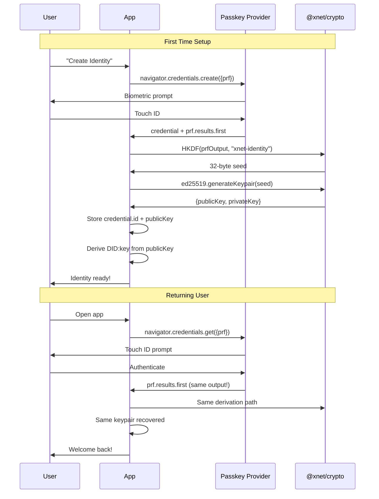

# 01: Passkey Authentication

> Biometric-protected identity with WebAuthn and PRF key derivation

**Duration:** 4 days
**Dependencies:** `@xnet/crypto` (Ed25519), `@xnet/identity` (DID:key)

## Overview

Passkeys provide the best balance of security and usability for xNet identity. Rather than just using passkeys to "unlock" a stored key (which could be extracted), we use the WebAuthn PRF (Pseudo-Random Function) extension to derive the Ed25519 private key directly from the passkey. This means the key literally cannot exist without biometric authentication.



## Why PRF Over Encrypted Storage?

| Approach                  | Security                    | Usability | Recovery     |
| ------------------------- | --------------------------- | --------- | ------------ |
| **Key in IndexedDB**      | Low - extractable           | Good      | Easy backup  |
| **Passkey-encrypted key** | Medium - key exists at rest | Good      | Passkey sync |
| **PRF-derived key**       | High - key never stored     | Best      | Passkey sync |

With PRF, the private key is computed on-demand from the passkey's output. Even if an attacker gains access to IndexedDB, there's no key to steal.

## Implementation

### 1. Types

```typescript
// packages/identity/src/passkey/types.ts

export interface PasskeyIdentity {
  /** The DID derived from the public key */
  did: DID

  /** Ed25519 public key (safe to store) */
  publicKey: Uint8Array

  /** WebAuthn credential ID (needed for authentication) */
  credentialId: Uint8Array

  /** When the identity was created */
  createdAt: number

  /** Relying party ID (usually the domain) */
  rpId: string
}

export interface PasskeyUnlockResult {
  /** Full identity with private key (ephemeral, don't persist!) */
  identity: Identity

  /** Public identity info (safe to persist) */
  passkey: PasskeyIdentity
}

export interface PasskeyCreateOptions {
  /** User-friendly name for the passkey (default: "xNet Identity") */
  displayName?: string

  /** Relying party ID (default: current hostname) */
  rpId?: string

  /** Require user verification (default: true) */
  userVerification?: 'required' | 'preferred' | 'discouraged'
}
```

### 2. PRF Extension Support Detection

```typescript
// packages/identity/src/passkey/support.ts

export interface PasskeySupport {
  /** Browser supports WebAuthn at all */
  webauthn: boolean

  /** Browser supports PRF extension */
  prf: boolean

  /** Platform authenticator available (Touch ID, Face ID, Windows Hello) */
  platform: boolean

  /** Passkey sync available (iCloud Keychain, Google Password Manager) */
  sync: boolean
}

export async function detectPasskeySupport(): Promise<PasskeySupport> {
  const support: PasskeySupport = {
    webauthn: false,
    prf: false,
    platform: false,
    sync: false
  }

  // Basic WebAuthn
  if (!window.PublicKeyCredential) {
    return support
  }
  support.webauthn = true

  // Platform authenticator
  try {
    support.platform = await PublicKeyCredential.isUserVerifyingPlatformAuthenticatorAvailable()
  } catch {
    support.platform = false
  }

  // PRF extension support (harder to detect without creating a credential)
  // We check for the extension in the browser's supported extensions list
  // Note: This is imperfect - actual support varies by authenticator
  support.prf = 'getClientExtensionResults' in PublicKeyCredential.prototype

  // Sync detection (heuristic based on platform)
  const ua = navigator.userAgent.toLowerCase()
  if (ua.includes('mac') || ua.includes('iphone') || ua.includes('ipad')) {
    support.sync = true // iCloud Keychain likely available
  } else if (ua.includes('android') || ua.includes('chrome')) {
    support.sync = true // Google Password Manager likely available
  }

  return support
}
```

### 3. Identity Creation with PRF

```typescript
// packages/identity/src/passkey/create.ts

import { blake3 } from '@xnet/crypto'
import { generateKeypair, publicKeyToDid } from '../keys'
import type { PasskeyIdentity, PasskeyCreateOptions, PasskeyUnlockResult } from './types'

// Salt for HKDF - constant, app-specific
const XNET_SALT = new TextEncoder().encode('xnet-identity-v1')

export async function createPasskeyIdentity(
  options: PasskeyCreateOptions = {}
): Promise<PasskeyUnlockResult> {
  const {
    displayName = 'xNet Identity',
    rpId = window.location.hostname,
    userVerification = 'required'
  } = options

  // Generate a random user ID (not the DID - we don't know it yet)
  const userId = crypto.getRandomValues(new Uint8Array(32))

  // PRF input - we use a constant since we want deterministic output
  const prfInput = new TextEncoder().encode('xnet-identity-key')

  const credential = (await navigator.credentials.create({
    publicKey: {
      challenge: crypto.getRandomValues(new Uint8Array(32)),
      rp: {
        id: rpId,
        name: 'xNet'
      },
      user: {
        id: userId,
        name: displayName,
        displayName
      },
      pubKeyCredParams: [
        { alg: -7, type: 'public-key' }, // ES256 (P-256)
        { alg: -257, type: 'public-key' } // RS256 (fallback)
      ],
      authenticatorSelection: {
        authenticatorAttachment: 'platform',
        residentKey: 'required',
        userVerification
      },
      extensions: {
        // @ts-expect-error - PRF extension not in TypeScript types yet
        prf: {
          eval: {
            first: prfInput
          }
        }
      }
    }
  })) as PublicKeyCredential | null

  if (!credential) {
    throw new Error('Passkey creation cancelled')
  }

  // Get PRF output
  const extensions = credential.getClientExtensionResults() as {
    prf?: { results?: { first?: ArrayBuffer } }
  }

  if (!extensions.prf?.results?.first) {
    throw new Error('PRF extension not supported by this authenticator')
  }

  const prfOutput = new Uint8Array(extensions.prf.results.first)

  // Derive Ed25519 seed using HKDF
  const seed = await deriveKeySeed(prfOutput)

  // Generate keypair
  const { publicKey, privateKey } = await generateKeypair(seed)
  const did = publicKeyToDid(publicKey)

  const passkeyIdentity: PasskeyIdentity = {
    did,
    publicKey,
    credentialId: new Uint8Array(credential.rawId),
    createdAt: Date.now(),
    rpId
  }

  return {
    identity: { did, publicKey, privateKey },
    passkey: passkeyIdentity
  }
}

async function deriveKeySeed(prfOutput: Uint8Array): Promise<Uint8Array> {
  // Use Web Crypto HKDF to derive a 32-byte seed
  const keyMaterial = await crypto.subtle.importKey('raw', prfOutput, 'HKDF', false, ['deriveBits'])

  const bits = await crypto.subtle.deriveBits(
    {
      name: 'HKDF',
      hash: 'SHA-256',
      salt: XNET_SALT,
      info: new TextEncoder().encode('ed25519-seed')
    },
    keyMaterial,
    256 // 32 bytes
  )

  return new Uint8Array(bits)
}
```

### 4. Identity Unlock (Returning User)

```typescript
// packages/identity/src/passkey/unlock.ts

import type { PasskeyIdentity, PasskeyUnlockResult } from './types'
import { generateKeypair, publicKeyToDid } from '../keys'

const XNET_SALT = new TextEncoder().encode('xnet-identity-v1')

export async function unlockPasskeyIdentity(stored: PasskeyIdentity): Promise<PasskeyUnlockResult> {
  const prfInput = new TextEncoder().encode('xnet-identity-key')

  const assertion = (await navigator.credentials.get({
    publicKey: {
      challenge: crypto.getRandomValues(new Uint8Array(32)),
      rpId: stored.rpId,
      allowCredentials: [
        {
          id: stored.credentialId,
          type: 'public-key'
        }
      ],
      userVerification: 'required',
      extensions: {
        // @ts-expect-error - PRF extension
        prf: {
          eval: {
            first: prfInput
          }
        }
      }
    }
  })) as PublicKeyCredential | null

  if (!assertion) {
    throw new Error('Authentication cancelled')
  }

  const extensions = assertion.getClientExtensionResults() as {
    prf?: { results?: { first?: ArrayBuffer } }
  }

  if (!extensions.prf?.results?.first) {
    throw new Error('PRF extension not available')
  }

  const prfOutput = new Uint8Array(extensions.prf.results.first)
  const seed = await deriveKeySeed(prfOutput)
  const { publicKey, privateKey } = await generateKeypair(seed)

  // Verify we got the same identity
  const did = publicKeyToDid(publicKey)
  if (did !== stored.did) {
    throw new Error('Identity mismatch - wrong passkey used')
  }

  return {
    identity: { did, publicKey, privateKey },
    passkey: stored
  }
}

async function deriveKeySeed(prfOutput: Uint8Array): Promise<Uint8Array> {
  const keyMaterial = await crypto.subtle.importKey('raw', prfOutput, 'HKDF', false, ['deriveBits'])

  const bits = await crypto.subtle.deriveBits(
    {
      name: 'HKDF',
      hash: 'SHA-256',
      salt: XNET_SALT,
      info: new TextEncoder().encode('ed25519-seed')
    },
    keyMaterial,
    256
  )

  return new Uint8Array(bits)
}
```

### 5. Fallback for Non-PRF Browsers

For browsers/authenticators that don't support PRF, we fall back to passkey-protected encrypted storage:

```typescript
// packages/identity/src/passkey/fallback.ts

import { encrypt, decrypt } from '@xnet/crypto'
import type { PasskeyIdentity } from './types'

interface FallbackStorage {
  /** Encrypted private key (AES-GCM) */
  encryptedKey: Uint8Array
  /** IV for decryption */
  iv: Uint8Array
  /** Salt for key derivation */
  salt: Uint8Array
}

export async function createFallbackIdentity(): Promise<{
  identity: Identity
  passkey: PasskeyIdentity
  fallbackStorage: FallbackStorage
}> {
  // Generate identity normally
  const { publicKey, privateKey } = await generateKeypair()
  const did = publicKeyToDid(publicKey)

  // Create passkey (without PRF)
  const credential = (await navigator.credentials.create({
    publicKey: {
      challenge: crypto.getRandomValues(new Uint8Array(32)),
      rp: { id: window.location.hostname, name: 'xNet' },
      user: {
        id: crypto.getRandomValues(new Uint8Array(32)),
        name: 'xNet Identity',
        displayName: 'xNet Identity'
      },
      pubKeyCredParams: [{ alg: -7, type: 'public-key' }],
      authenticatorSelection: {
        authenticatorAttachment: 'platform',
        residentKey: 'required',
        userVerification: 'required'
      }
    }
  })) as PublicKeyCredential | null

  if (!credential) {
    throw new Error('Passkey creation cancelled')
  }

  // Derive encryption key from passkey signature
  // (This is less secure than PRF but still requires biometric)
  const response = credential.response as AuthenticatorAttestationResponse
  const signature = new Uint8Array(response.attestationObject)

  const salt = crypto.getRandomValues(new Uint8Array(16))
  const encryptionKey = await deriveEncryptionKey(signature, salt)

  // Encrypt private key
  const iv = crypto.getRandomValues(new Uint8Array(12))
  const encryptedKey = await encrypt(privateKey, encryptionKey, iv)

  return {
    identity: { did, publicKey, privateKey },
    passkey: {
      did,
      publicKey,
      credentialId: new Uint8Array(credential.rawId),
      createdAt: Date.now(),
      rpId: window.location.hostname
    },
    fallbackStorage: { encryptedKey, iv, salt }
  }
}

async function deriveEncryptionKey(signature: Uint8Array, salt: Uint8Array): Promise<Uint8Array> {
  const keyMaterial = await crypto.subtle.importKey('raw', signature, 'HKDF', false, ['deriveBits'])

  const bits = await crypto.subtle.deriveBits(
    {
      name: 'HKDF',
      hash: 'SHA-256',
      salt,
      info: new TextEncoder().encode('xnet-fallback-encryption')
    },
    keyMaterial,
    256
  )

  return new Uint8Array(bits)
}
```

### 6. Unified API

```typescript
// packages/identity/src/passkey/index.ts

import { detectPasskeySupport } from './support'
import { createPasskeyIdentity, unlockPasskeyIdentity } from './prf'
import { createFallbackIdentity, unlockFallbackIdentity } from './fallback'
import { getStoredIdentity, storeIdentity } from './storage'

export interface IdentityManager {
  /** Check if identity exists */
  hasIdentity(): Promise<boolean>

  /** Create new identity (prompts for biometric) */
  create(): Promise<Identity>

  /** Unlock existing identity (prompts for biometric) */
  unlock(): Promise<Identity>

  /** Clear stored identity */
  clear(): Promise<void>
}

export function createIdentityManager(): IdentityManager {
  let cachedIdentity: Identity | null = null

  return {
    async hasIdentity() {
      const stored = await getStoredIdentity()
      return stored !== null
    },

    async create() {
      const support = await detectPasskeySupport()

      if (!support.webauthn || !support.platform) {
        throw new Error('Passkeys not supported on this device')
      }

      let result: PasskeyUnlockResult
      let fallback: FallbackStorage | undefined

      if (support.prf) {
        result = await createPasskeyIdentity()
      } else {
        const fallbackResult = await createFallbackIdentity()
        result = { identity: fallbackResult.identity, passkey: fallbackResult.passkey }
        fallback = fallbackResult.fallbackStorage
      }

      await storeIdentity(result.passkey, fallback)
      cachedIdentity = result.identity

      return result.identity
    },

    async unlock() {
      if (cachedIdentity) {
        return cachedIdentity
      }

      const stored = await getStoredIdentity()
      if (!stored) {
        throw new Error('No identity found')
      }

      let identity: Identity

      if (stored.fallback) {
        identity = await unlockFallbackIdentity(stored.passkey, stored.fallback)
      } else {
        const result = await unlockPasskeyIdentity(stored.passkey)
        identity = result.identity
      }

      cachedIdentity = identity
      return identity
    },

    async clear() {
      await clearStoredIdentity()
      cachedIdentity = null
    }
  }
}
```

### 7. React Hook

```typescript
// packages/react/src/hooks/useIdentity.ts

import { useState, useEffect, useCallback } from 'react'
import { createIdentityManager, type Identity } from '@xnet/identity'

export interface UseIdentityResult {
  /** Current identity (null if not unlocked) */
  identity: Identity | null

  /** Whether identity exists but is locked */
  isLocked: boolean

  /** Whether we're checking/unlocking */
  isLoading: boolean

  /** Any error that occurred */
  error: Error | null

  /** Create a new identity */
  create: () => Promise<void>

  /** Unlock existing identity */
  unlock: () => Promise<void>

  /** Clear identity */
  clear: () => Promise<void>
}

export function useIdentity(): UseIdentityResult {
  const [identity, setIdentity] = useState<Identity | null>(null)
  const [isLocked, setIsLocked] = useState(false)
  const [isLoading, setIsLoading] = useState(true)
  const [error, setError] = useState<Error | null>(null)

  const manager = useMemo(() => createIdentityManager(), [])

  // Check for existing identity on mount
  useEffect(() => {
    manager
      .hasIdentity()
      .then((has) => {
        setIsLocked(has)
        setIsLoading(false)
      })
      .catch((err) => {
        setError(err)
        setIsLoading(false)
      })
  }, [manager])

  const create = useCallback(async () => {
    setIsLoading(true)
    setError(null)
    try {
      const id = await manager.create()
      setIdentity(id)
      setIsLocked(false)
    } catch (err) {
      setError(err instanceof Error ? err : new Error(String(err)))
    } finally {
      setIsLoading(false)
    }
  }, [manager])

  const unlock = useCallback(async () => {
    setIsLoading(true)
    setError(null)
    try {
      const id = await manager.unlock()
      setIdentity(id)
      setIsLocked(false)
    } catch (err) {
      setError(err instanceof Error ? err : new Error(String(err)))
    } finally {
      setIsLoading(false)
    }
  }, [manager])

  const clear = useCallback(async () => {
    await manager.clear()
    setIdentity(null)
    setIsLocked(false)
  }, [manager])

  return { identity, isLocked, isLoading, error, create, unlock, clear }
}
```

## Electron Integration

On Electron, we need to bridge WebAuthn to the OS:

```typescript
// apps/electron/src/main/passkey.ts

import { ipcMain, systemPreferences } from 'electron'

// Electron doesn't support WebAuthn directly, but we can:
// 1. Use the system keychain for storage
// 2. Use Touch ID API directly on macOS
// 3. Use Windows Hello on Windows

ipcMain.handle('passkey:canUseTouchId', async () => {
  if (process.platform === 'darwin') {
    return systemPreferences.canPromptTouchID()
  }
  return false
})

ipcMain.handle('passkey:promptTouchId', async (_, reason: string) => {
  if (process.platform === 'darwin') {
    try {
      await systemPreferences.promptTouchID(reason)
      return { success: true }
    } catch (err) {
      return { success: false, error: err.message }
    }
  }
  return { success: false, error: 'Not supported' }
})
```

## Testing

```typescript
describe('PasskeyIdentity', () => {
  describe('createPasskeyIdentity', () => {
    it('creates identity with PRF-derived key', async () => {
      // Mock WebAuthn
      const mockCredential = createMockCredential({ prf: true })
      vi.spyOn(navigator.credentials, 'create').mockResolvedValue(mockCredential)

      const result = await createPasskeyIdentity()

      expect(result.identity.did).toMatch(/^did:key:z/)
      expect(result.identity.privateKey).toBeInstanceOf(Uint8Array)
      expect(result.passkey.credentialId).toEqual(mockCredential.rawId)
    })

    it('throws if PRF not supported', async () => {
      const mockCredential = createMockCredential({ prf: false })
      vi.spyOn(navigator.credentials, 'create').mockResolvedValue(mockCredential)

      await expect(createPasskeyIdentity()).rejects.toThrow('PRF extension not supported')
    })
  })

  describe('unlockPasskeyIdentity', () => {
    it('derives same key from same passkey', async () => {
      // Create identity
      const createMock = createMockCredential({ prf: true, prfOutput: FIXED_PRF })
      vi.spyOn(navigator.credentials, 'create').mockResolvedValue(createMock)
      const created = await createPasskeyIdentity()

      // Unlock identity
      const getMock = createMockAssertion({ prf: true, prfOutput: FIXED_PRF })
      vi.spyOn(navigator.credentials, 'get').mockResolvedValue(getMock)
      const unlocked = await unlockPasskeyIdentity(created.passkey)

      expect(unlocked.identity.did).toBe(created.identity.did)
      expect(unlocked.identity.privateKey).toEqual(created.identity.privateKey)
    })

    it('throws on identity mismatch', async () => {
      const stored: PasskeyIdentity = {
        did: 'did:key:z6Mk...',
        publicKey: new Uint8Array(32),
        credentialId: new Uint8Array(16),
        createdAt: Date.now(),
        rpId: 'localhost'
      }

      // Different PRF output = different key
      const getMock = createMockAssertion({ prf: true, prfOutput: DIFFERENT_PRF })
      vi.spyOn(navigator.credentials, 'get').mockResolvedValue(getMock)

      await expect(unlockPasskeyIdentity(stored)).rejects.toThrow('Identity mismatch')
    })
  })

  describe('detectPasskeySupport', () => {
    it('detects full support', async () => {
      mockFullPasskeySupport()
      const support = await detectPasskeySupport()

      expect(support.webauthn).toBe(true)
      expect(support.platform).toBe(true)
      expect(support.prf).toBe(true)
    })

    it('detects no WebAuthn', async () => {
      delete (window as any).PublicKeyCredential
      const support = await detectPasskeySupport()

      expect(support.webauthn).toBe(false)
    })
  })
})
```

## Validation Gate

- [ ] `createPasskeyIdentity()` creates credential with PRF extension
- [ ] `unlockPasskeyIdentity()` derives identical key from same passkey
- [ ] `detectPasskeySupport()` correctly identifies browser capabilities
- [ ] Fallback mode works for non-PRF authenticators
- [ ] React hook manages state correctly
- [ ] Electron integration uses native Touch ID
- [ ] Keys are never persisted - only derived on unlock

---

[Back to README](./README.md) | [Next: Onboarding Flow ->](./02-onboarding-flow.md)
