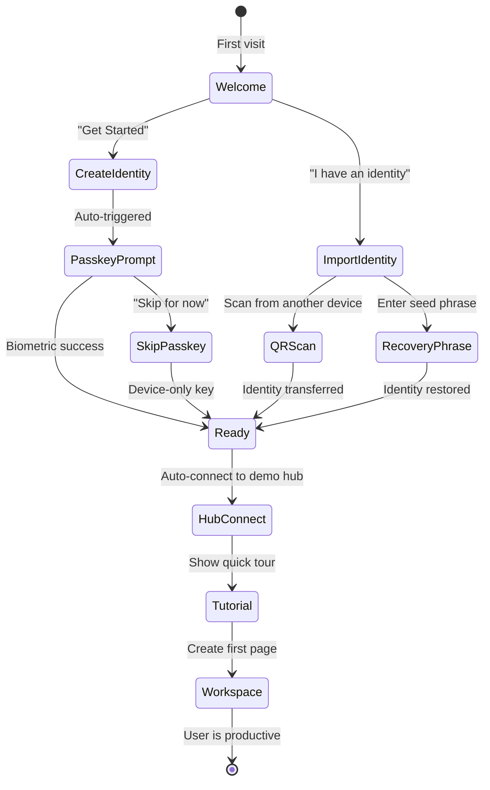

# 02: Onboarding Flow

> First-run experience that gets users productive in 60 seconds

**Duration:** 3 days
**Dependencies:** [01-passkey-auth.md](./01-passkey-auth.md)

## Overview

The onboarding flow is the user's first impression of xNet. It should feel effortless - no forms, no email verification, no passwords. Just biometric authentication and they're in.



## Screen Designs

### Welcome Screen

```
+--------------------------------------------------+
|                                                  |
|                    [Logo]                        |
|                                                  |
|              Welcome to xNet                     |
|                                                  |
|     Your private workspace that syncs           |
|     everywhere and belongs to you.              |
|                                                  |
|  +------------------------------------------+   |
|  |                                          |   |
|  |           [Get Started]                  |   |
|  |                                          |   |
|  +------------------------------------------+   |
|                                                  |
|        I already have an identity               |
|                                                  |
+--------------------------------------------------+
```

### Passkey Setup

```
+--------------------------------------------------+
|                                                  |
|                    [Lock Icon]                   |
|                                                  |
|           Secure your identity                   |
|                                                  |
|     Use Face ID / Touch ID to protect your      |
|     data. Your identity stays on your device.   |
|                                                  |
|  +------------------------------------------+   |
|  |                                          |   |
|  |      [Set up Face ID / Touch ID]         |   |
|  |                                          |   |
|  +------------------------------------------+   |
|                                                  |
|              Skip for now                        |
|                                                  |
|   (Not recommended - data won't sync to other   |
|    devices securely)                            |
|                                                  |
+--------------------------------------------------+
```

### Ready Screen

```
+--------------------------------------------------+
|                                                  |
|                    [Check Icon]                  |
|                                                  |
|              You're all set!                     |
|                                                  |
|     Your identity: did:key:z6Mk...xyz           |
|                                                  |
|     Connected to: hub.xnet.dev                  |
|                                                  |
|  +------------------------------------------+   |
|  |                                          |   |
|  |        [Create your first page]          |   |
|  |                                          |   |
|  +------------------------------------------+   |
|                                                  |
|           or explore sample content             |
|                                                  |
+--------------------------------------------------+
```

## Implementation

### 1. Onboarding State Machine

```typescript
// packages/react/src/onboarding/machine.ts

export type OnboardingState =
  | 'welcome'
  | 'create-identity'
  | 'passkey-prompt'
  | 'passkey-error'
  | 'skip-passkey'
  | 'import-identity'
  | 'qr-scan'
  | 'recovery-phrase'
  | 'connecting-hub'
  | 'ready'
  | 'tutorial'
  | 'complete'

export type OnboardingEvent =
  | { type: 'GET_STARTED' }
  | { type: 'IMPORT_EXISTING' }
  | { type: 'PASSKEY_SUCCESS'; identity: Identity }
  | { type: 'PASSKEY_FAILED'; error: Error }
  | { type: 'SKIP_PASSKEY' }
  | { type: 'SCAN_QR' }
  | { type: 'ENTER_PHRASE' }
  | { type: 'IDENTITY_IMPORTED'; identity: Identity }
  | { type: 'HUB_CONNECTED' }
  | { type: 'HUB_FAILED'; error: Error }
  | { type: 'SKIP_TUTORIAL' }
  | { type: 'TUTORIAL_COMPLETE' }

export interface OnboardingContext {
  identity: Identity | null
  hubUrl: string | null
  error: Error | null
}

export function createOnboardingMachine() {
  return {
    initial: 'welcome' as OnboardingState,
    context: {
      identity: null,
      hubUrl: null,
      error: null
    } as OnboardingContext,

    transitions: {
      welcome: {
        GET_STARTED: 'create-identity',
        IMPORT_EXISTING: 'import-identity'
      },
      'create-identity': {
        // Auto-transition to passkey-prompt
        PASSKEY_SUCCESS: 'connecting-hub',
        PASSKEY_FAILED: 'passkey-error'
      },
      'passkey-error': {
        SKIP_PASSKEY: 'skip-passkey',
        GET_STARTED: 'create-identity' // Retry
      },
      'skip-passkey': {
        PASSKEY_SUCCESS: 'connecting-hub' // Device-only key created
      },
      'import-identity': {
        SCAN_QR: 'qr-scan',
        ENTER_PHRASE: 'recovery-phrase'
      },
      'qr-scan': {
        IDENTITY_IMPORTED: 'connecting-hub'
      },
      'recovery-phrase': {
        IDENTITY_IMPORTED: 'connecting-hub'
      },
      'connecting-hub': {
        HUB_CONNECTED: 'ready',
        HUB_FAILED: 'ready' // Continue anyway, hub is optional
      },
      ready: {
        SKIP_TUTORIAL: 'complete',
        GET_STARTED: 'tutorial'
      },
      tutorial: {
        TUTORIAL_COMPLETE: 'complete'
      }
    }
  }
}
```

### 2. Onboarding Provider

```typescript
// packages/react/src/onboarding/OnboardingProvider.tsx

import { createContext, useContext, useReducer, useCallback, useEffect } from 'react'
import { useIdentity } from '../hooks/useIdentity'
import { useHub } from '../hooks/useHub'
import type { OnboardingState, OnboardingEvent, OnboardingContext } from './machine'

interface OnboardingProviderProps {
  children: React.ReactNode
  /** Default hub URL for new users */
  defaultHubUrl?: string
  /** Called when onboarding completes */
  onComplete?: (identity: Identity) => void
}

const OnboardingContext = createContext<{
  state: OnboardingState
  context: OnboardingContext
  send: (event: OnboardingEvent) => void
} | null>(null)

export function OnboardingProvider({
  children,
  defaultHubUrl = 'wss://hub.xnet.dev',
  onComplete
}: OnboardingProviderProps) {
  const identity = useIdentity()
  const hub = useHub()

  const [{ state, context }, dispatch] = useReducer(
    onboardingReducer,
    { state: 'welcome', context: { identity: null, hubUrl: defaultHubUrl, error: null } }
  )

  // Auto-advance based on identity state
  useEffect(() => {
    if (state === 'create-identity' && !identity.isLoading) {
      if (identity.identity) {
        dispatch({ type: 'PASSKEY_SUCCESS', identity: identity.identity })
      } else if (identity.error) {
        dispatch({ type: 'PASSKEY_FAILED', error: identity.error })
      }
    }
  }, [state, identity])

  // Auto-advance based on hub connection
  useEffect(() => {
    if (state === 'connecting-hub') {
      if (hub.isConnected) {
        dispatch({ type: 'HUB_CONNECTED' })
      } else if (hub.error) {
        dispatch({ type: 'HUB_FAILED', error: hub.error })
      }
    }
  }, [state, hub])

  // Notify completion
  useEffect(() => {
    if (state === 'complete' && context.identity && onComplete) {
      onComplete(context.identity)
    }
  }, [state, context.identity, onComplete])

  const send = useCallback((event: OnboardingEvent) => {
    // Side effects for certain events
    if (event.type === 'GET_STARTED' && state === 'welcome') {
      identity.create()
    }
    if (event.type === 'SKIP_PASSKEY') {
      identity.create({ useFallback: true })
    }
    dispatch(event)
  }, [state, identity])

  return (
    <OnboardingContext.Provider value={{ state, context, send }}>
      {children}
    </OnboardingContext.Provider>
  )
}

export function useOnboarding() {
  const ctx = useContext(OnboardingContext)
  if (!ctx) {
    throw new Error('useOnboarding must be used within OnboardingProvider')
  }
  return ctx
}
```

### 3. Screen Components

```typescript
// packages/react/src/onboarding/screens/WelcomeScreen.tsx

import { useOnboarding } from '../OnboardingProvider'

export function WelcomeScreen() {
  const { send } = useOnboarding()

  return (
    <div className="onboarding-screen welcome">
      <div className="logo">
        <XNetLogo size={64} />
      </div>

      <h1>Welcome to xNet</h1>

      <p className="subtitle">
        Your private workspace that syncs everywhere and belongs to you.
      </p>

      <button
        className="primary-button"
        onClick={() => send({ type: 'GET_STARTED' })}
      >
        Get Started
      </button>

      <button
        className="text-button"
        onClick={() => send({ type: 'IMPORT_EXISTING' })}
      >
        I already have an identity
      </button>
    </div>
  )
}

// packages/react/src/onboarding/screens/PasskeyPromptScreen.tsx

export function PasskeyPromptScreen() {
  const { send, context } = useOnboarding()
  const [isPrompting, setIsPrompting] = useState(false)

  useEffect(() => {
    // Auto-trigger passkey prompt
    setIsPrompting(true)
  }, [])

  return (
    <div className="onboarding-screen passkey-prompt">
      <div className="icon">
        <LockIcon size={48} />
      </div>

      <h1>Secure your identity</h1>

      <p>
        Use {getPlatformAuthName()} to protect your data.
        Your identity stays on your device.
      </p>

      {isPrompting && (
        <div className="prompt-indicator">
          <Spinner />
          <span>Waiting for {getPlatformAuthName()}...</span>
        </div>
      )}

      {context.error && (
        <div className="error-message">
          <p>Could not set up {getPlatformAuthName()}</p>
          <p className="error-detail">{context.error.message}</p>
        </div>
      )}

      <button
        className="text-button"
        onClick={() => send({ type: 'SKIP_PASSKEY' })}
      >
        Skip for now
      </button>

      <p className="warning">
        Not recommended - data won't sync securely to other devices
      </p>
    </div>
  )
}

function getPlatformAuthName(): string {
  const ua = navigator.userAgent.toLowerCase()
  if (ua.includes('mac') || ua.includes('iphone') || ua.includes('ipad')) {
    return 'Face ID / Touch ID'
  }
  if (ua.includes('windows')) {
    return 'Windows Hello'
  }
  if (ua.includes('android')) {
    return 'Fingerprint'
  }
  return 'Biometric authentication'
}

// packages/react/src/onboarding/screens/ReadyScreen.tsx

export function ReadyScreen() {
  const { send, context } = useOnboarding()

  return (
    <div className="onboarding-screen ready">
      <div className="icon success">
        <CheckIcon size={48} />
      </div>

      <h1>You're all set!</h1>

      <div className="identity-info">
        <label>Your identity</label>
        <code className="did">{truncateDid(context.identity!.did)}</code>
        <button className="copy-button" onClick={() => copyToClipboard(context.identity!.did)}>
          <CopyIcon size={16} />
        </button>
      </div>

      {context.hubUrl && (
        <div className="hub-info">
          <label>Connected to</label>
          <span>{new URL(context.hubUrl).hostname}</span>
        </div>
      )}

      <button
        className="primary-button"
        onClick={() => send({ type: 'GET_STARTED' })}
      >
        Create your first page
      </button>

      <button
        className="text-button"
        onClick={() => send({ type: 'SKIP_TUTORIAL' })}
      >
        Explore sample content
      </button>
    </div>
  )
}
```

### 4. Hub Connection UI

```typescript
// packages/react/src/onboarding/screens/HubConnectScreen.tsx

export function HubConnectScreen() {
  const { context } = useOnboarding()
  const [status, setStatus] = useState<'connecting' | 'connected' | 'failed'>('connecting')

  return (
    <div className="onboarding-screen hub-connect">
      <div className="icon">
        <CloudIcon size={48} />
      </div>

      <h1>Connecting to sync server</h1>

      {status === 'connecting' && (
        <>
          <Spinner />
          <p>Setting up secure connection...</p>
        </>
      )}

      {status === 'connected' && (
        <>
          <CheckIcon className="success" />
          <p>Connected to {new URL(context.hubUrl!).hostname}</p>
        </>
      )}

      {status === 'failed' && (
        <>
          <WarningIcon className="warning" />
          <p>Could not connect to sync server</p>
          <p className="detail">
            You can still use xNet offline. Your data will sync when connection is available.
          </p>
        </>
      )}
    </div>
  )
}
```

### 5. Quick-Start Templates

```typescript
// packages/react/src/onboarding/templates.ts

export interface QuickStartTemplate {
  id: string
  name: string
  description: string
  icon: string
  create: (store: NodeStore) => Promise<string> // Returns root node ID
}

export const quickStartTemplates: QuickStartTemplate[] = [
  {
    id: 'blank-page',
    name: 'Blank Page',
    description: 'Start from scratch',
    icon: 'file',
    create: async (store) => {
      const page = await store.createNode({
        schema: 'xnet://core/Page',
        properties: {
          title: { type: 'title', value: 'Untitled' },
          content: { type: 'rich-text', value: '' }
        }
      })
      return page.id
    }
  },
  {
    id: 'meeting-notes',
    name: 'Meeting Notes',
    description: 'Template for taking meeting notes',
    icon: 'users',
    create: async (store) => {
      const page = await store.createNode({
        schema: 'xnet://core/Page',
        properties: {
          title: { type: 'title', value: 'Meeting Notes' },
          content: {
            type: 'rich-text',
            value: `
## Attendees
- 

## Agenda
1. 

## Notes


## Action Items
- [ ] 
            `.trim()
          }
        }
      })
      return page.id
    }
  },
  {
    id: 'project-tracker',
    name: 'Project Tracker',
    description: 'Database for tracking tasks',
    icon: 'kanban',
    create: async (store) => {
      const database = await store.createNode({
        schema: 'xnet://core/Database',
        properties: {
          title: { type: 'title', value: 'Project Tasks' },
          schema: {
            type: 'json',
            value: {
              properties: [
                { name: 'Task', type: 'title' },
                { name: 'Status', type: 'select', options: ['To Do', 'In Progress', 'Done'] },
                { name: 'Priority', type: 'select', options: ['Low', 'Medium', 'High'] },
                { name: 'Due Date', type: 'date' }
              ]
            }
          }
        }
      })

      // Add sample rows
      await store.createNode({
        schema: 'xnet://core/DatabaseRow',
        parent: database.id,
        properties: {
          Task: { type: 'title', value: 'Welcome to xNet!' },
          Status: { type: 'select', value: 'Done' },
          Priority: { type: 'select', value: 'High' }
        }
      })

      return database.id
    }
  },
  {
    id: 'canvas',
    name: 'Whiteboard',
    description: 'Infinite canvas for visual thinking',
    icon: 'pen-tool',
    create: async (store) => {
      const canvas = await store.createNode({
        schema: 'xnet://core/Canvas',
        properties: {
          title: { type: 'title', value: 'Brainstorm' }
        }
      })
      return canvas.id
    }
  }
]
```

### 6. Tutorial Overlay

```typescript
// packages/react/src/onboarding/Tutorial.tsx

interface TutorialStep {
  target: string // CSS selector
  title: string
  content: string
  position: 'top' | 'bottom' | 'left' | 'right'
}

const tutorialSteps: TutorialStep[] = [
  {
    target: '.sidebar-nav',
    title: 'Navigation',
    content: 'Access your pages, databases, and canvases here.',
    position: 'right'
  },
  {
    target: '.editor-area',
    title: 'Rich Editor',
    content: 'Type "/" for commands. Use [[brackets]] to link pages.',
    position: 'bottom'
  },
  {
    target: '.sync-status',
    title: 'Sync Status',
    content: 'See when your changes are saved and synced.',
    position: 'left'
  },
  {
    target: '.share-button',
    title: 'Sharing',
    content: 'Share pages with others or generate public links.',
    position: 'bottom'
  }
]

export function TutorialOverlay({ onComplete }: { onComplete: () => void }) {
  const [step, setStep] = useState(0)
  const currentStep = tutorialSteps[step]

  const next = () => {
    if (step < tutorialSteps.length - 1) {
      setStep(step + 1)
    } else {
      onComplete()
    }
  }

  const skip = () => {
    onComplete()
  }

  return (
    <div className="tutorial-overlay">
      <Spotlight target={currentStep.target} />

      <Tooltip
        target={currentStep.target}
        position={currentStep.position}
      >
        <h3>{currentStep.title}</h3>
        <p>{currentStep.content}</p>

        <div className="tutorial-actions">
          <button onClick={skip}>Skip</button>
          <button onClick={next} className="primary">
            {step < tutorialSteps.length - 1 ? 'Next' : 'Done'}
          </button>
        </div>

        <div className="tutorial-progress">
          {tutorialSteps.map((_, i) => (
            <span key={i} className={i === step ? 'active' : ''} />
          ))}
        </div>
      </Tooltip>
    </div>
  )
}
```

## Styling

```css
/* packages/react/src/onboarding/onboarding.css */

.onboarding-screen {
  display: flex;
  flex-direction: column;
  align-items: center;
  justify-content: center;
  min-height: 100vh;
  padding: 2rem;
  text-align: center;
}

.onboarding-screen h1 {
  font-size: 1.75rem;
  font-weight: 600;
  margin: 1.5rem 0 0.5rem;
}

.onboarding-screen .subtitle {
  color: var(--text-secondary);
  margin-bottom: 2rem;
  max-width: 300px;
}

.onboarding-screen .primary-button {
  width: 100%;
  max-width: 300px;
  padding: 0.875rem 1.5rem;
  font-size: 1rem;
  font-weight: 500;
  background: var(--primary);
  color: white;
  border: none;
  border-radius: 8px;
  cursor: pointer;
  transition: background 0.15s;
}

.onboarding-screen .primary-button:hover {
  background: var(--primary-hover);
}

.onboarding-screen .text-button {
  background: none;
  border: none;
  color: var(--text-secondary);
  margin-top: 1rem;
  cursor: pointer;
}

.onboarding-screen .text-button:hover {
  color: var(--text-primary);
  text-decoration: underline;
}

.identity-info {
  display: flex;
  align-items: center;
  gap: 0.5rem;
  margin: 1rem 0;
  padding: 0.75rem 1rem;
  background: var(--surface-secondary);
  border-radius: 8px;
}

.identity-info .did {
  font-family: var(--font-mono);
  font-size: 0.875rem;
}

.tutorial-overlay {
  position: fixed;
  inset: 0;
  z-index: 1000;
  pointer-events: none;
}

.tutorial-overlay .spotlight {
  pointer-events: auto;
}
```

## Testing

```typescript
describe('Onboarding Flow', () => {
  it('completes full flow with passkey', async () => {
    render(<OnboardingProvider><OnboardingFlow /></OnboardingProvider>)

    // Welcome screen
    expect(screen.getByText('Welcome to xNet')).toBeInTheDocument()
    await userEvent.click(screen.getByText('Get Started'))

    // Passkey prompt (mocked)
    await waitFor(() => {
      expect(screen.getByText('Secure your identity')).toBeInTheDocument()
    })

    // Simulate passkey success
    mockPasskeySuccess()

    // Ready screen
    await waitFor(() => {
      expect(screen.getByText("You're all set!")).toBeInTheDocument()
    })
    expect(screen.getByText(/did:key:/)).toBeInTheDocument()
  })

  it('allows skipping passkey', async () => {
    render(<OnboardingProvider><OnboardingFlow /></OnboardingProvider>)

    await userEvent.click(screen.getByText('Get Started'))
    mockPasskeyFailure()

    await waitFor(() => {
      expect(screen.getByText('Skip for now')).toBeInTheDocument()
    })

    await userEvent.click(screen.getByText('Skip for now'))

    await waitFor(() => {
      expect(screen.getByText("You're all set!")).toBeInTheDocument()
    })
  })

  it('handles import existing identity', async () => {
    render(<OnboardingProvider><OnboardingFlow /></OnboardingProvider>)

    await userEvent.click(screen.getByText('I already have an identity'))

    expect(screen.getByText('Scan from another device')).toBeInTheDocument()
    expect(screen.getByText('Enter recovery phrase')).toBeInTheDocument()
  })
})
```

## Validation Gate

- [ ] Welcome screen displays with clear CTA
- [ ] Passkey prompt triggers automatically after "Get Started"
- [ ] Skip option available if passkey fails
- [ ] Ready screen shows DID and hub connection status
- [ ] Quick-start templates create valid content
- [ ] Tutorial overlay highlights key features
- [ ] Full flow completes in < 60 seconds
- [ ] Accessible with keyboard navigation

---

[Back to README](./README.md) | [Next: Cross-Device Sync ->](./03-cross-device-sync.md)
