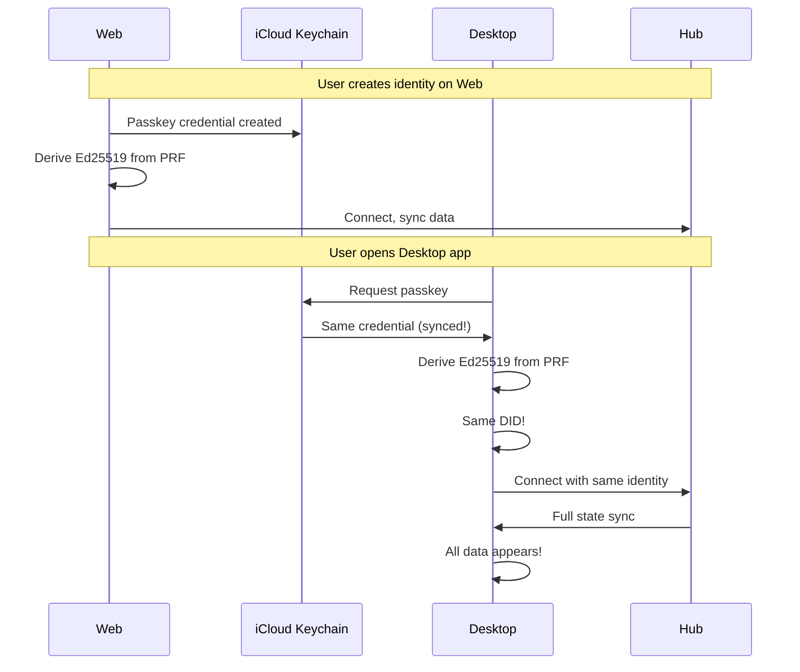

# 03: Cross-Device Sync

> Seamless identity and data synchronization across all devices

**Duration:** 4 days
**Dependencies:** [01-passkey-auth.md](./01-passkey-auth.md), [02-onboarding-flow.md](./02-onboarding-flow.md)

## Overview

The magic moment: a user creates their identity on the web, downloads the desktop app, authenticates with the same passkey, and all their data is already there. This requires:

1. **Passkey sync** - Apple/Google sync passkeys across devices automatically
2. **Identity derivation** - Same passkey = same Ed25519 key = same DID
3. **Hub-mediated sync** - Data flows through the hub to new devices
4. **Fallback linking** - QR code for devices without passkey sync



## Passkey Sync Ecosystems

| Platform             | Sync Provider           | Scope             |
| -------------------- | ----------------------- | ----------------- |
| macOS + iOS + iPadOS | iCloud Keychain         | Apple ID          |
| Android + Chrome     | Google Password Manager | Google Account    |
| Windows              | Microsoft Account       | Microsoft Account |
| Cross-platform       | 1Password, Bitwarden    | Account-based     |

**Key insight:** Users who stay within one ecosystem get automatic passkey sync. Cross-ecosystem requires QR code linking.

## Implementation

### 1. Cross-Device Identity Detection

```typescript
// packages/identity/src/passkey/discovery.ts

export interface DiscoveredPasskey {
  credentialId: Uint8Array
  rpId: string
  userHandle: Uint8Array
}

/**
 * Check if user has an existing xNet passkey (possibly from another device)
 * Uses conditional mediation (autofill UI)
 */
export async function discoverExistingPasskey(): Promise<DiscoveredPasskey | null> {
  if (!window.PublicKeyCredential?.isConditionalMediationAvailable) {
    return null
  }

  const available = await PublicKeyCredential.isConditionalMediationAvailable()
  if (!available) {
    return null
  }

  try {
    // This shows the passkey autofill UI if the user has one
    const credential = (await navigator.credentials.get({
      publicKey: {
        challenge: crypto.getRandomValues(new Uint8Array(32)),
        rpId: window.location.hostname,
        userVerification: 'required'
      },
      mediation: 'conditional'
    })) as PublicKeyCredential | null

    if (!credential) {
      return null
    }

    const response = credential.response as AuthenticatorAssertionResponse

    return {
      credentialId: new Uint8Array(credential.rawId),
      rpId: window.location.hostname,
      userHandle: new Uint8Array(response.userHandle!)
    }
  } catch {
    return null
  }
}
```

### 2. Smart Welcome Flow

```typescript
// packages/react/src/onboarding/SmartWelcome.tsx

import { useEffect, useState } from 'react'
import { discoverExistingPasskey } from '@xnet/identity'
import { useOnboarding } from './OnboardingProvider'

export function SmartWelcome() {
  const { send } = useOnboarding()
  const [checking, setChecking] = useState(true)
  const [hasExisting, setHasExisting] = useState(false)

  useEffect(() => {
    discoverExistingPasskey().then((passkey) => {
      setHasExisting(passkey !== null)
      setChecking(false)
    })
  }, [])

  if (checking) {
    return <LoadingScreen message="Checking for existing identity..." />
  }

  if (hasExisting) {
    return (
      <div className="onboarding-screen welcome-back">
        <div className="icon">
          <UserCheckIcon size={48} />
        </div>

        <h1>Welcome back!</h1>

        <p>
          We found your xNet identity. Use {getPlatformAuthName()} to sign in.
        </p>

        <button
          className="primary-button"
          onClick={() => send({ type: 'UNLOCK_EXISTING' })}
        >
          Sign in with {getPlatformAuthName()}
        </button>

        <button
          className="text-button"
          onClick={() => send({ type: 'CREATE_NEW' })}
        >
          Create a new identity instead
        </button>
      </div>
    )
  }

  return <WelcomeScreen />
}
```

### 3. Hub-Mediated Initial Sync

When a new device connects with an existing DID, the hub sends the full state:

```typescript
// packages/hub/src/services/initial-sync.ts

export class InitialSyncService {
  constructor(
    private storage: HubStorage,
    private relay: SyncRelayService
  ) {}

  async handleNewDevice(ws: WebSocket, did: DID, lastSyncTime?: number): Promise<void> {
    // Get all rooms this DID has access to
    const rooms = await this.storage.getRoomsForDid(did)

    // For each room, send full sync state
    for (const roomId of rooms) {
      const doc = await this.relay.getDocument(roomId)

      // Send full Y.Doc state
      const stateVector = Y.encodeStateVector(doc)
      const update = Y.encodeStateAsUpdate(doc)

      ws.send(
        encodeMessage({
          type: 'initial-sync',
          room: roomId,
          stateVector,
          update
        })
      )

      // Send structured data changes since last sync
      if (lastSyncTime) {
        const changes = await this.storage.getChangesSince(roomId, lastSyncTime)
        if (changes.length > 0) {
          ws.send(
            encodeMessage({
              type: 'node-changes',
              room: roomId,
              changes
            })
          )
        }
      }
    }

    // Send completion marker
    ws.send(
      encodeMessage({
        type: 'initial-sync-complete',
        roomCount: rooms.length
      })
    )
  }
}
```

### 4. Client-Side Sync Orchestration

```typescript
// packages/react/src/sync/InitialSyncManager.ts

export interface SyncProgress {
  phase: 'connecting' | 'syncing' | 'complete' | 'error'
  roomsTotal: number
  roomsSynced: number
  bytesReceived: number
}

export class InitialSyncManager {
  private progress: SyncProgress = {
    phase: 'connecting',
    roomsTotal: 0,
    roomsSynced: 0,
    bytesReceived: 0
  }

  private listeners = new Set<(progress: SyncProgress) => void>()

  constructor(
    private hubConnection: HubConnection,
    private store: NodeStore
  ) {
    this.setupHandlers()
  }

  onProgress(listener: (progress: SyncProgress) => void): () => void {
    this.listeners.add(listener)
    return () => this.listeners.delete(listener)
  }

  private setupHandlers() {
    this.hubConnection.on('initial-sync', async (msg) => {
      this.progress.phase = 'syncing'
      this.progress.bytesReceived += msg.update.byteLength

      // Apply Y.Doc state
      const doc = await this.store.getOrCreateDocument(msg.room)
      Y.applyUpdate(doc, msg.update)

      this.progress.roomsSynced++
      this.notify()
    })

    this.hubConnection.on('node-changes', async (msg) => {
      for (const change of msg.changes) {
        await this.store.applyChange(change)
      }
      this.progress.bytesReceived += JSON.stringify(msg.changes).length
      this.notify()
    })

    this.hubConnection.on('initial-sync-complete', (msg) => {
      this.progress.phase = 'complete'
      this.progress.roomsTotal = msg.roomCount
      this.notify()
    })
  }

  private notify() {
    for (const listener of this.listeners) {
      listener({ ...this.progress })
    }
  }
}
```

### 5. Sync Progress UI

```typescript
// packages/react/src/components/SyncProgressOverlay.tsx

export function SyncProgressOverlay({
  progress,
  onComplete
}: {
  progress: SyncProgress
  onComplete: () => void
}) {
  useEffect(() => {
    if (progress.phase === 'complete') {
      const timer = setTimeout(onComplete, 1500)
      return () => clearTimeout(timer)
    }
  }, [progress.phase, onComplete])

  return (
    <div className="sync-progress-overlay">
      <div className="sync-card">
        {progress.phase === 'connecting' && (
          <>
            <Spinner />
            <h2>Connecting to server...</h2>
          </>
        )}

        {progress.phase === 'syncing' && (
          <>
            <CloudDownloadIcon className="animate-pulse" />
            <h2>Syncing your data</h2>
            <div className="progress-bar">
              <div
                className="progress-fill"
                style={{
                  width: `${(progress.roomsSynced / Math.max(progress.roomsTotal, 1)) * 100}%`
                }}
              />
            </div>
            <p className="progress-text">
              {progress.roomsSynced} of {progress.roomsTotal} items
            </p>
            <p className="bytes-text">
              {formatBytes(progress.bytesReceived)} received
            </p>
          </>
        )}

        {progress.phase === 'complete' && (
          <>
            <CheckCircleIcon className="success" />
            <h2>All synced!</h2>
            <p>{progress.roomsTotal} items synchronized</p>
          </>
        )}

        {progress.phase === 'error' && (
          <>
            <AlertCircleIcon className="error" />
            <h2>Sync issue</h2>
            <p>Some data may not be up to date.</p>
            <button onClick={onComplete}>Continue anyway</button>
          </>
        )}
      </div>
    </div>
  )
}
```

### 6. QR Code Device Linking (Fallback)

For devices without passkey sync, use QR code to transfer identity:

```typescript
// packages/identity/src/linking/qr-link.ts

import { generateKeypair } from '../keys'
import { encrypt, decrypt } from '@xnet/crypto'

interface LinkSession {
  sessionId: string
  ephemeralPublicKey: Uint8Array
  ephemeralPrivateKey: Uint8Array
  expiresAt: number
}

interface LinkRequest {
  version: 1
  sessionId: string
  ephemeralPublicKey: string // base64
  hubUrl: string
  expiresAt: number
}

export async function createLinkSession(hubUrl: string): Promise<{
  session: LinkSession
  qrData: string
}> {
  const { publicKey, privateKey } = await generateKeypair()
  const sessionId = crypto.randomUUID()
  const expiresAt = Date.now() + 5 * 60 * 1000 // 5 minutes

  const session: LinkSession = {
    sessionId,
    ephemeralPublicKey: publicKey,
    ephemeralPrivateKey: privateKey,
    expiresAt
  }

  const request: LinkRequest = {
    version: 1,
    sessionId,
    ephemeralPublicKey: base64Encode(publicKey),
    hubUrl,
    expiresAt
  }

  // Encode as URL for easy QR scanning
  const qrData = `xnet://link?data=${base64Encode(JSON.stringify(request))}`

  return { session, qrData }
}

export async function acceptLinkRequest(qrData: string, identity: Identity): Promise<void> {
  const url = new URL(qrData)
  const data = JSON.parse(base64Decode(url.searchParams.get('data')!)) as LinkRequest

  if (data.expiresAt < Date.now()) {
    throw new Error('Link code expired')
  }

  // Connect to hub's linking endpoint
  const ws = new WebSocket(`${data.hubUrl}/link/${data.sessionId}`)

  // Derive shared secret
  const theirPublicKey = base64Decode(data.ephemeralPublicKey)
  const sharedSecret = await deriveSharedSecret(identity.privateKey, theirPublicKey)

  // Encrypt identity
  const iv = crypto.getRandomValues(new Uint8Array(12))
  const encryptedIdentity = await encrypt(
    JSON.stringify({
      did: identity.did,
      privateKey: base64Encode(identity.privateKey),
      publicKey: base64Encode(identity.publicKey)
    }),
    sharedSecret,
    iv
  )

  // Send encrypted identity
  ws.send(
    JSON.stringify({
      type: 'identity-transfer',
      iv: base64Encode(iv),
      ciphertext: base64Encode(encryptedIdentity)
    })
  )

  await new Promise<void>((resolve, reject) => {
    ws.onmessage = (event) => {
      const msg = JSON.parse(event.data)
      if (msg.type === 'transfer-complete') {
        resolve()
      } else if (msg.type === 'error') {
        reject(new Error(msg.message))
      }
    }
  })
}
```

### 7. QR Linking UI

```typescript
// packages/react/src/linking/QRLinkScreen.tsx

export function QRLinkScreen({ identity }: { identity: Identity }) {
  const [session, setSession] = useState<LinkSession | null>(null)
  const [qrData, setQrData] = useState<string | null>(null)
  const [status, setStatus] = useState<'generating' | 'waiting' | 'transferring' | 'complete'>('generating')

  useEffect(() => {
    createLinkSession(getHubUrl()).then(({ session, qrData }) => {
      setSession(session)
      setQrData(qrData)
      setStatus('waiting')

      // Listen for link request
      listenForLinkRequest(session, identity).then(() => {
        setStatus('complete')
      })
    })
  }, [identity])

  return (
    <div className="qr-link-screen">
      <h1>Link a new device</h1>

      {status === 'generating' && <Spinner />}

      {status === 'waiting' && qrData && (
        <>
          <div className="qr-container">
            <QRCode value={qrData} size={256} />
          </div>

          <p>Scan this code from your other device</p>

          <Countdown expiresAt={session!.expiresAt} onExpire={() => {
            // Regenerate
            setStatus('generating')
          }} />
        </>
      )}

      {status === 'transferring' && (
        <>
          <Spinner />
          <p>Transferring identity...</p>
        </>
      )}

      {status === 'complete' && (
        <>
          <CheckCircleIcon className="success" />
          <p>Device linked successfully!</p>
        </>
      )}
    </div>
  )
}

// QR Scanner on receiving device
export function QRScanScreen({ onIdentityReceived }: { onIdentityReceived: (identity: Identity) => void }) {
  const [scanning, setScanning] = useState(true)
  const [error, setError] = useState<string | null>(null)

  const handleScan = async (data: string) => {
    setScanning(false)

    try {
      const identity = await receiveLinkTransfer(data)
      onIdentityReceived(identity)
    } catch (err) {
      setError(err instanceof Error ? err.message : 'Failed to receive identity')
    }
  }

  return (
    <div className="qr-scan-screen">
      <h1>Scan QR Code</h1>

      {scanning && (
        <QRScanner onScan={handleScan} onError={(err) => setError(err.message)} />
      )}

      {error && (
        <div className="error">
          <p>{error}</p>
          <button onClick={() => { setScanning(true); setError(null) }}>
            Try again
          </button>
        </div>
      )}
    </div>
  )
}
```

### 8. Conflict-Free Data Merge

When data exists on multiple devices before sync:

```typescript
// packages/sync/src/merge.ts

export interface MergeResult {
  resolved: NodeChange[]
  conflicts: ConflictReport[]
}

export interface ConflictReport {
  nodeId: string
  property: string
  localValue: PropertyValue
  remoteValue: PropertyValue
  resolution: 'local' | 'remote' | 'merged'
}

/**
 * Merge changes from two sources.
 * Uses Lamport timestamps for LWW (Last-Writer-Wins).
 * Rich text uses Yjs CRDT (no conflicts possible).
 */
export function mergeChanges(local: NodeChange[], remote: NodeChange[]): MergeResult {
  const conflicts: ConflictReport[] = []
  const resolved: NodeChange[] = []

  // Group by node ID
  const localByNode = groupBy(local, (c) => c.nodeId)
  const remoteByNode = groupBy(remote, (c) => c.nodeId)

  const allNodeIds = new Set([...localByNode.keys(), ...remoteByNode.keys()])

  for (const nodeId of allNodeIds) {
    const localChanges = localByNode.get(nodeId) ?? []
    const remoteChanges = remoteByNode.get(nodeId) ?? []

    // Merge by property
    const localByProp = new Map<string, NodeChange>()
    const remoteByProp = new Map<string, NodeChange>()

    for (const change of localChanges) {
      for (const prop of Object.keys(change.properties ?? {})) {
        const existing = localByProp.get(prop)
        if (!existing || change.lamport > existing.lamport) {
          localByProp.set(prop, change)
        }
      }
    }

    for (const change of remoteChanges) {
      for (const prop of Object.keys(change.properties ?? {})) {
        const existing = remoteByProp.get(prop)
        if (!existing || change.lamport > existing.lamport) {
          remoteByProp.set(prop, change)
        }
      }
    }

    // Resolve per property
    const allProps = new Set([...localByProp.keys(), ...remoteByProp.keys()])

    for (const prop of allProps) {
      const localChange = localByProp.get(prop)
      const remoteChange = remoteByProp.get(prop)

      if (!localChange && remoteChange) {
        resolved.push(remoteChange)
      } else if (localChange && !remoteChange) {
        resolved.push(localChange)
      } else if (localChange && remoteChange) {
        // Both have changes - LWW by Lamport
        if (localChange.lamport > remoteChange.lamport) {
          resolved.push(localChange)
          conflicts.push({
            nodeId,
            property: prop,
            localValue: localChange.properties![prop],
            remoteValue: remoteChange.properties![prop],
            resolution: 'local'
          })
        } else if (remoteChange.lamport > localChange.lamport) {
          resolved.push(remoteChange)
          conflicts.push({
            nodeId,
            property: prop,
            localValue: localChange.properties![prop],
            remoteValue: remoteChange.properties![prop],
            resolution: 'remote'
          })
        } else {
          // Same Lamport - tie-break by DID (deterministic)
          const winner = localChange.authorDid < remoteChange.authorDid ? localChange : remoteChange
          resolved.push(winner)
          conflicts.push({
            nodeId,
            property: prop,
            localValue: localChange.properties![prop],
            remoteValue: remoteChange.properties![prop],
            resolution: winner === localChange ? 'local' : 'remote'
          })
        }
      }
    }
  }

  return { resolved, conflicts }
}
```

## Testing

```typescript
describe('Cross-Device Sync', () => {
  describe('Passkey Discovery', () => {
    it('discovers existing passkey from another device', async () => {
      mockConditionalMediation(existingCredential)

      const discovered = await discoverExistingPasskey()

      expect(discovered).not.toBeNull()
      expect(discovered!.credentialId).toEqual(existingCredential.rawId)
    })

    it('returns null when no passkey exists', async () => {
      mockConditionalMediation(null)

      const discovered = await discoverExistingPasskey()

      expect(discovered).toBeNull()
    })
  })

  describe('Initial Sync', () => {
    it('receives full state on new device', async () => {
      const hub = createMockHub()
      const manager = new InitialSyncManager(hub, store)

      let finalProgress: SyncProgress | null = null
      manager.onProgress((p) => {
        finalProgress = p
      })

      hub.simulateInitialSync([
        { room: 'room1', update: mockYjsState },
        { room: 'room2', update: mockYjsState }
      ])
      hub.simulateComplete({ roomCount: 2 })

      expect(finalProgress!.phase).toBe('complete')
      expect(finalProgress!.roomsSynced).toBe(2)
    })
  })

  describe('QR Linking', () => {
    it('generates valid QR code', async () => {
      const { qrData } = await createLinkSession('wss://hub.xnet.dev')

      expect(qrData).toMatch(/^xnet:\/\/link\?data=/)
      const parsed = parseQRData(qrData)
      expect(parsed.version).toBe(1)
      expect(parsed.expiresAt).toBeGreaterThan(Date.now())
    })

    it('transfers identity securely', async () => {
      const sender = await createIdentity()
      const { session, qrData } = await createLinkSession('wss://hub.xnet.dev')

      // Simulate receiver
      const receivedIdentity = await acceptLinkRequest(qrData, sender)

      expect(receivedIdentity.did).toBe(sender.did)
    })
  })

  describe('Merge', () => {
    it('resolves by Lamport timestamp', () => {
      const local = [createChange({ nodeId: 'n1', lamport: 5, properties: { title: 'Local' } })]
      const remote = [createChange({ nodeId: 'n1', lamport: 10, properties: { title: 'Remote' } })]

      const { resolved, conflicts } = mergeChanges(local, remote)

      expect(resolved[0].properties!.title).toBe('Remote')
      expect(conflicts[0].resolution).toBe('remote')
    })

    it('tie-breaks by DID', () => {
      const local = [
        createChange({
          nodeId: 'n1',
          lamport: 5,
          authorDid: 'did:key:a',
          properties: { title: 'A' }
        })
      ]
      const remote = [
        createChange({
          nodeId: 'n1',
          lamport: 5,
          authorDid: 'did:key:b',
          properties: { title: 'B' }
        })
      ]

      const { resolved } = mergeChanges(local, remote)

      expect(resolved[0].properties!.title).toBe('A') // 'a' < 'b'
    })
  })
})
```

## Validation Gate

- [ ] Existing passkey discovered automatically on new device
- [ ] Same passkey = same DID across devices
- [ ] Initial sync receives full hub state
- [ ] Sync progress UI shows accurate status
- [ ] QR linking works for cross-ecosystem devices
- [ ] Data merges correctly (no data loss)
- [ ] Works offline (sync resumes when connected)

---

[Back to README](./README.md) | [Next: Sharing & Permissions ->](./04-sharing-permissions.md)
