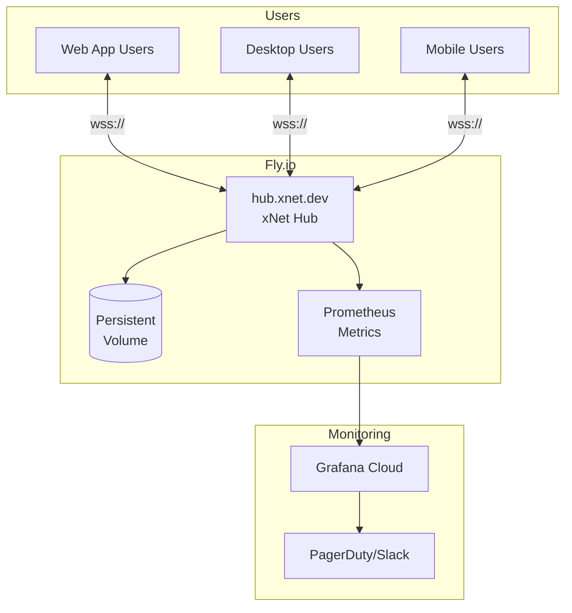

# 07: Demo Hub Deployment

> Public hub at hub.xnet.dev for users to try xNet without self-hosting

**Duration:** 3 days
**Dependencies:** Hub package from planStep03_8HubPhase1VPS

## Overview

The demo hub serves two purposes:

1. **Try before you commit**: New users can use xNet immediately without setup
2. **Default sync target**: Desktop/mobile apps connect here by default



## Implementation

### 1. Fly.io Configuration

```toml
# apps/hub-deploy/fly.toml

app = "xnet-hub"
primary_region = "sjc"

[build]
  dockerfile = "../../packages/hub/Dockerfile"

[env]
  NODE_ENV = "production"
  LOG_LEVEL = "info"
  PORT = "4444"
  DATA_DIR = "/data"
  AUTH_MODE = "ucan"
  MAX_CONNECTIONS = "5000"
  DEFAULT_QUOTA = "104857600" # 100MB per user
  RATE_LIMIT_MESSAGES = "100"
  RATE_LIMIT_WINDOW = "60000"

[http_service]
  internal_port = 4444
  force_https = true
  auto_stop_machines = false
  auto_start_machines = true
  min_machines_running = 1

  [http_service.concurrency]
    type = "connections"
    hard_limit = 2500
    soft_limit = 2000

[[vm]]
  cpu_kind = "shared"
  cpus = 2
  memory_mb = 2048

[mounts]
  source = "xnet_hub_data"
  destination = "/data"

[checks]
  [checks.health]
    port = 4444
    type = "http"
    interval = "15s"
    timeout = "5s"
    grace_period = "10s"
    method = "GET"
    path = "/health"

[metrics]
  port = 4444
  path = "/metrics"
```

### 2. Deploy Script

```bash
#!/bin/bash
# apps/hub-deploy/deploy.sh

set -e

echo "Deploying xNet Hub to Fly.io..."

# Ensure we're logged in
fly auth whoami || fly auth login

# Create app if it doesn't exist
fly apps create xnet-hub --org xnet 2>/dev/null || true

# Create volume if it doesn't exist
fly volumes create xnet_hub_data --region sjc --size 10 2>/dev/null || true

# Set secrets
fly secrets set \
  --app xnet-hub \
  REVOCATION_CHECK_URL="https://api.xnet.dev/revocations" \
  2>/dev/null || true

# Deploy
fly deploy --app xnet-hub

# Scale to 2 machines for availability
fly scale count 2 --app xnet-hub

echo "Deployment complete!"
echo "Hub URL: https://xnet-hub.fly.dev"
```

### 3. Custom Domain Setup

```bash
# Add custom domain
fly certs create hub.xnet.dev --app xnet-hub

# DNS: Add CNAME record
# hub.xnet.dev -> xnet-hub.fly.dev
```

### 4. Hub Dockerfile (Production)

```dockerfile
# packages/hub/Dockerfile

# Build stage
FROM node:20-alpine AS builder

WORKDIR /app

# Install pnpm
RUN corepack enable && corepack prepare pnpm@9 --activate

# Copy workspace files
COPY pnpm-lock.yaml pnpm-workspace.yaml ./
COPY packages/hub/package.json ./packages/hub/
COPY packages/core/package.json ./packages/core/
COPY packages/crypto/package.json ./packages/crypto/
COPY packages/identity/package.json ./packages/identity/
COPY packages/sync/package.json ./packages/sync/
COPY packages/data/package.json ./packages/data/

# Install dependencies
RUN pnpm install --frozen-lockfile

# Copy source
COPY packages/ ./packages/

# Build
RUN pnpm --filter @xnet/hub build

# Runtime stage
FROM node:20-alpine

WORKDIR /app

# Install production dependencies only
RUN corepack enable && corepack prepare pnpm@9 --activate

COPY --from=builder /app/pnpm-lock.yaml /app/pnpm-workspace.yaml ./
COPY --from=builder /app/packages/hub/package.json ./packages/hub/
COPY --from=builder /app/packages/hub/dist ./packages/hub/dist
COPY --from=builder /app/packages/core/dist ./packages/core/dist
COPY --from=builder /app/packages/crypto/dist ./packages/crypto/dist
COPY --from=builder /app/packages/identity/dist ./packages/identity/dist
COPY --from=builder /app/packages/sync/dist ./packages/sync/dist
COPY --from=builder /app/packages/data/dist ./packages/data/dist

# Install production dependencies
RUN pnpm install --prod --frozen-lockfile

# Create data directory
RUN mkdir -p /data && chown -R node:node /data

USER node

EXPOSE 4444

ENV NODE_ENV=production
ENV DATA_DIR=/data

CMD ["node", "packages/hub/dist/cli.js"]
```

### 5. Rate Limiting Configuration

```typescript
// packages/hub/src/middleware/rate-limit.ts

export interface RateLimitConfig {
  /** Max WebSocket messages per window */
  messagesPerWindow: number

  /** Window size in ms */
  windowMs: number

  /** Max connections per IP */
  connectionsPerIp: number

  /** Max storage per DID (bytes) */
  storageQuota: number

  /** Burst allowance (multiplier for short bursts) */
  burstMultiplier: number
}

export const DEMO_HUB_LIMITS: RateLimitConfig = {
  messagesPerWindow: 100,
  windowMs: 60_000, // 1 minute
  connectionsPerIp: 10,
  storageQuota: 100 * 1024 * 1024, // 100MB
  burstMultiplier: 3
}

export class RateLimiter {
  private windows = new Map<string, { count: number; resetAt: number }>()
  private connections = new Map<string, Set<WebSocket>>()

  constructor(private config: RateLimitConfig) {}

  checkMessage(clientId: string): { allowed: boolean; retryAfter?: number } {
    const now = Date.now()
    const window = this.windows.get(clientId)

    if (!window || now > window.resetAt) {
      this.windows.set(clientId, {
        count: 1,
        resetAt: now + this.config.windowMs
      })
      return { allowed: true }
    }

    // Allow burst
    const limit = this.config.messagesPerWindow * this.config.burstMultiplier

    if (window.count >= limit) {
      return {
        allowed: false,
        retryAfter: Math.ceil((window.resetAt - now) / 1000)
      }
    }

    window.count++
    return { allowed: true }
  }

  checkConnection(ip: string, ws: WebSocket): { allowed: boolean } {
    const existing = this.connections.get(ip) ?? new Set()

    if (existing.size >= this.config.connectionsPerIp) {
      return { allowed: false }
    }

    existing.add(ws)
    this.connections.set(ip, existing)

    ws.on('close', () => {
      existing.delete(ws)
      if (existing.size === 0) {
        this.connections.delete(ip)
      }
    })

    return { allowed: true }
  }
}
```

### 6. Usage Quota Enforcement

```typescript
// packages/hub/src/services/quota.ts

export class QuotaService {
  constructor(
    private storage: HubStorage,
    private defaultQuota: number
  ) {}

  async checkQuota(
    did: DID,
    additionalBytes: number
  ): Promise<{
    allowed: boolean
    used: number
    limit: number
    remaining: number
  }> {
    const used = await this.storage.getStorageUsed(did)
    const limit = await this.getQuotaLimit(did)
    const remaining = limit - used

    return {
      allowed: additionalBytes <= remaining,
      used,
      limit,
      remaining: Math.max(0, remaining)
    }
  }

  async getQuotaLimit(did: DID): Promise<number> {
    // Could be customized per-user in the future
    return this.defaultQuota
  }

  async getUsageStats(did: DID): Promise<{
    documents: number
    totalBytes: number
    byType: Record<string, number>
  }> {
    return this.storage.getUsageStats(did)
  }
}
```

### 7. Monitoring Setup

```typescript
// packages/hub/src/middleware/metrics.ts

import { Registry, Counter, Gauge, Histogram } from 'prom-client'

export function createMetrics() {
  const registry = new Registry()

  const metrics = {
    connections: new Gauge({
      name: 'xnet_hub_connections_active',
      help: 'Number of active WebSocket connections',
      registers: [registry]
    }),

    rooms: new Gauge({
      name: 'xnet_hub_rooms_active',
      help: 'Number of active sync rooms',
      registers: [registry]
    }),

    messages: new Counter({
      name: 'xnet_hub_messages_total',
      help: 'Total messages processed',
      labelNames: ['type'],
      registers: [registry]
    }),

    messageLatency: new Histogram({
      name: 'xnet_hub_message_latency_ms',
      help: 'Message processing latency in milliseconds',
      buckets: [1, 5, 10, 25, 50, 100, 250, 500, 1000],
      registers: [registry]
    }),

    storageBytes: new Gauge({
      name: 'xnet_hub_storage_bytes',
      help: 'Total storage used in bytes',
      registers: [registry]
    }),

    rateLimitHits: new Counter({
      name: 'xnet_hub_rate_limit_hits_total',
      help: 'Number of rate limit violations',
      registers: [registry]
    }),

    authFailures: new Counter({
      name: 'xnet_hub_auth_failures_total',
      help: 'Number of authentication failures',
      labelNames: ['reason'],
      registers: [registry]
    })
  }

  return { registry, metrics }
}
```

### 8. Alert Configuration

```yaml
# apps/hub-deploy/alerts.yml
# For Grafana Cloud Alerting

groups:
  - name: xnet-hub
    rules:
      - alert: HighConnectionCount
        expr: xnet_hub_connections_active > 4000
        for: 5m
        labels:
          severity: warning
        annotations:
          summary: 'High connection count on xNet Hub'
          description: '{{ $value }} connections (threshold: 4000)'

      - alert: HighErrorRate
        expr: rate(xnet_hub_auth_failures_total[5m]) > 10
        for: 2m
        labels:
          severity: warning
        annotations:
          summary: 'High authentication failure rate'
          description: '{{ $value }} failures per second'

      - alert: HighLatency
        expr: histogram_quantile(0.95, rate(xnet_hub_message_latency_ms_bucket[5m])) > 500
        for: 5m
        labels:
          severity: warning
        annotations:
          summary: 'High message latency'
          description: 'p95 latency is {{ $value }}ms'

      - alert: HubDown
        expr: up{job="xnet-hub"} == 0
        for: 1m
        labels:
          severity: critical
        annotations:
          summary: 'xNet Hub is down'
          description: 'Hub has been unreachable for 1 minute'

      - alert: StorageNearFull
        expr: xnet_hub_storage_bytes / (10 * 1024 * 1024 * 1024) > 0.8
        for: 10m
        labels:
          severity: warning
        annotations:
          summary: 'Hub storage over 80%'
          description: 'Storage at {{ $value | humanizePercentage }}'
```

### 9. Health Check Endpoint

```typescript
// packages/hub/src/routes/health.ts

export function healthRoutes(app: Hono, hub: HubInstance) {
  app.get('/health', (c) => {
    const uptime = process.uptime()
    const memory = process.memoryUsage()

    return c.json({
      status: 'ok',
      version: hub.version,
      uptime: Math.floor(uptime),
      connections: hub.getConnectionCount(),
      rooms: hub.getRoomCount(),
      memory: {
        heapUsed: memory.heapUsed,
        heapTotal: memory.heapTotal,
        rss: memory.rss
      },
      timestamp: Date.now()
    })
  })

  // Detailed health for internal monitoring
  app.get('/health/detailed', async (c) => {
    const storage = await hub.storage.healthCheck()
    const uptime = process.uptime()

    return c.json({
      status: storage.ok ? 'ok' : 'degraded',
      checks: {
        storage: storage.ok ? 'ok' : 'error',
        memory: process.memoryUsage().heapUsed < 1.5 * 1024 * 1024 * 1024 ? 'ok' : 'warning'
      },
      storage: {
        ok: storage.ok,
        latencyMs: storage.latencyMs,
        sizeBytes: storage.sizeBytes
      },
      uptime: Math.floor(uptime),
      version: hub.version
    })
  })
}
```

### 10. Graceful Degradation

```typescript
// packages/hub/src/services/circuit-breaker.ts

export class CircuitBreaker {
  private failures = 0
  private lastFailure = 0
  private state: 'closed' | 'open' | 'half-open' = 'closed'

  constructor(
    private readonly threshold: number = 5,
    private readonly timeout: number = 30000
  ) {}

  async execute<T>(fn: () => Promise<T>): Promise<T> {
    if (this.state === 'open') {
      if (Date.now() - this.lastFailure > this.timeout) {
        this.state = 'half-open'
      } else {
        throw new Error('Circuit breaker is open')
      }
    }

    try {
      const result = await fn()
      this.onSuccess()
      return result
    } catch (error) {
      this.onFailure()
      throw error
    }
  }

  private onSuccess() {
    this.failures = 0
    this.state = 'closed'
  }

  private onFailure() {
    this.failures++
    this.lastFailure = Date.now()

    if (this.failures >= this.threshold) {
      this.state = 'open'
    }
  }

  getState() {
    return this.state
  }
}
```

## Testing

```typescript
describe('Demo Hub', () => {
  it('accepts WebSocket connections', async () => {
    const ws = new WebSocket('wss://hub.xnet.dev')
    await new Promise((resolve) => (ws.onopen = resolve))
    expect(ws.readyState).toBe(WebSocket.OPEN)
    ws.close()
  })

  it('health endpoint returns ok', async () => {
    const res = await fetch('https://hub.xnet.dev/health')
    const json = await res.json()
    expect(json.status).toBe('ok')
  })

  it('enforces rate limits', async () => {
    const ws = new WebSocket('wss://hub.xnet.dev')
    await new Promise((resolve) => (ws.onopen = resolve))

    // Send many messages quickly
    for (let i = 0; i < 500; i++) {
      ws.send(JSON.stringify({ type: 'ping' }))
    }

    // Should receive rate limit response
    const response = await new Promise((resolve) => {
      ws.onmessage = (e) => resolve(JSON.parse(e.data))
    })

    expect(response.type).toBe('error')
    expect(response.code).toBe('RATE_LIMITED')
  })
})
```

## Validation Gate

- [ ] Hub deploys to Fly.io successfully
- [ ] WebSocket connections work via wss://hub.xnet.dev
- [ ] TLS certificate is valid
- [ ] Health endpoint returns status
- [ ] Metrics endpoint exposes Prometheus metrics
- [ ] Rate limiting prevents abuse
- [ ] Storage quota enforced per user
- [ ] Graceful shutdown persists data

---

[Back to README](./README.md) | [Next: Self-Hosted Hub Guide ->](./08-self-hosted-hub.md)
