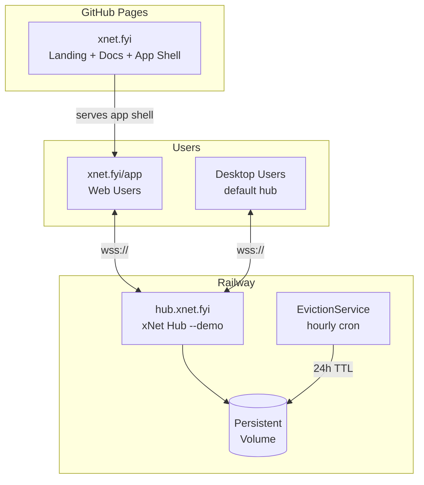

# 07: Demo Hub Deployment

> Public demo hub at hub.xnet.fyi on Railway for users to try xNet instantly

**Duration:** 3 days
**Dependencies:** Hub package from planStep03_8HubPhase1VPS, [Exploration 0051](../explorations/0051_DEMO_HUB_ON_RAILWAY.md)

## Overview

The demo hub serves two purposes:

1. **Try before you commit**: New users at `xnet.fyi/app` authenticate with Touch ID and start using xNet immediately
2. **Default sync target**: Web app connects to `hub.xnet.fyi` by default; desktop app defaults here until user configures their own hub

The demo hub uses **standard UCAN authentication** (same as production) — passkeys are required, there is no anonymous mode. Demo mode only changes quotas and enables auto-eviction.



## Key Constraints (from Exploration 0051)

| Constraint       | Value                            |
| ---------------- | -------------------------------- |
| Storage per user | 10 MB                            |
| Max documents    | 50                               |
| Max blob size    | 2 MB                             |
| Inactivity TTL   | 24 hours                         |
| Eviction check   | Hourly cron                      |
| Auth             | Standard UCAN (passkey required) |
| Cost             | ~$0/mo (Railway Hobby $5 credit) |

## Implementation

### 1. Railway Configuration

The `railway.toml` already exists at `packages/hub/railway.toml`. Railway auto-deploys from `main` — no GitHub Actions or deploy scripts needed. See [09-hub-cd.md](./09-hub-cd.md) for details.

The existing `railway.toml` needs one addition for demo mode — the `--demo` flag in the start command:

```toml
# packages/hub/railway.toml

[build]
  builder = "dockerfile"
  dockerfilePath = "Dockerfile"

[deploy]
  startCommand = "node packages/hub/dist/cli.js --demo"
  healthcheckPath = "/health"
  healthcheckTimeout = 10
  restartPolicyType = "on_failure"
  restartPolicyMaxRetries = 5
```

Environment variables (set in Railway dashboard):

```bash
NODE_ENV=production
HUB_PORT=4444
HUB_MODE=demo                     # Enables demo overrides
LOG_LEVEL=info

# Demo overrides (applied when HUB_MODE=demo)
DEMO_QUOTA=10485760               # 10 MB per user
DEMO_MAX_DOCS=50
DEMO_MAX_BLOB=2097152             # 2 MB
DEMO_EVICTION_TTL=86400000        # 24 hours in ms
DEMO_EVICTION_INTERVAL=3600000    # 1 hour in ms
```

### 2. Demo Mode Flag

The `--demo` CLI flag (or `HUB_MODE=demo` env var) applies demo-specific quotas and enables the EvictionService. All other behavior (auth, sync, backup) is identical to production.

```typescript
// packages/hub/src/config.ts (additions)

export interface DemoOverrides {
  /** Storage quota per user (bytes) */
  quota: number
  /** Max documents per user */
  maxDocs: number
  /** Max blob size (bytes) */
  maxBlob: number
  /** Inactivity TTL before eviction (ms) */
  evictionTtl: number
  /** How often to run eviction check (ms) */
  evictionInterval: number
}

export const DEMO_DEFAULTS: DemoOverrides = {
  quota: 10 * 1024 * 1024, // 10 MB
  maxDocs: 50,
  maxBlob: 2 * 1024 * 1024, // 2 MB
  evictionTtl: 24 * 60 * 60 * 1000, // 24 hours
  evictionInterval: 60 * 60 * 1000 // 1 hour
}

export function getDemoOverrides(): DemoOverrides | null {
  if (process.env.HUB_MODE !== 'demo') return null

  return {
    quota: Number(process.env.DEMO_QUOTA) || DEMO_DEFAULTS.quota,
    maxDocs: Number(process.env.DEMO_MAX_DOCS) || DEMO_DEFAULTS.maxDocs,
    maxBlob: Number(process.env.DEMO_MAX_BLOB) || DEMO_DEFAULTS.maxBlob,
    evictionTtl: Number(process.env.DEMO_EVICTION_TTL) || DEMO_DEFAULTS.evictionTtl,
    evictionInterval: Number(process.env.DEMO_EVICTION_INTERVAL) || DEMO_DEFAULTS.evictionInterval
  }
}
```

### 3. Eviction Service

Tracks last activity per DID and evicts data after inactivity TTL:

```typescript
// packages/hub/src/services/eviction.ts

export class EvictionService {
  private timer: ReturnType<typeof setInterval> | null = null

  constructor(
    private storage: HubStorage,
    private config: DemoOverrides
  ) {}

  start(): void {
    // Run immediately, then on interval
    this.evict()
    this.timer = setInterval(() => this.evict(), this.config.evictionInterval)
    console.log(
      `[eviction] Started with TTL=${this.config.evictionTtl}ms, interval=${this.config.evictionInterval}ms`
    )
  }

  stop(): void {
    if (this.timer) {
      clearInterval(this.timer)
      this.timer = null
    }
  }

  /** Record activity for a DID (called on every authenticated message) */
  async touch(did: DID): Promise<void> {
    await this.storage.upsertActivity(did, Date.now())
  }

  private async evict(): Promise<void> {
    const cutoff = Date.now() - this.config.evictionTtl
    const stale = await this.storage.getInactiveDids(cutoff)

    if (stale.length === 0) return

    console.log(
      `[eviction] Evicting ${stale.length} inactive users (cutoff: ${new Date(cutoff).toISOString()})`
    )

    for (const did of stale) {
      await this.storage.deleteUserData(did)
      await this.storage.deleteActivity(did)
      console.log(`[eviction] Evicted: ${did.slice(0, 20)}...`)
    }
  }
}
```

Activity tracking table:

```sql
-- did_activity table (SQLite)
CREATE TABLE IF NOT EXISTS did_activity (
  did TEXT PRIMARY KEY,
  last_active_at INTEGER NOT NULL,
  created_at INTEGER NOT NULL DEFAULT (strftime('%s', 'now') * 1000)
);

CREATE INDEX idx_did_activity_last_active ON did_activity(last_active_at);
```

### 4. Demo-Aware Quota Enforcement

```typescript
// packages/hub/src/services/quota.ts (updated)

export class QuotaService {
  constructor(
    private storage: HubStorage,
    private defaultQuota: number,
    private demoOverrides: DemoOverrides | null
  ) {}

  async checkQuota(
    did: DID,
    additionalBytes: number
  ): Promise<{
    allowed: boolean
    used: number
    limit: number
    remaining: number
    isDemo: boolean
  }> {
    const used = await this.storage.getStorageUsed(did)
    const limit = this.demoOverrides?.quota ?? this.defaultQuota
    const remaining = limit - used

    return {
      allowed: additionalBytes <= remaining,
      used,
      limit,
      remaining: Math.max(0, remaining),
      isDemo: this.demoOverrides !== null
    }
  }

  async checkDocCount(did: DID): Promise<{ allowed: boolean; count: number; limit: number }> {
    if (!this.demoOverrides) return { allowed: true, count: 0, limit: Infinity }

    const count = await this.storage.getDocCount(did)
    return {
      allowed: count < this.demoOverrides.maxDocs,
      count,
      limit: this.demoOverrides.maxDocs
    }
  }

  async checkBlobSize(size: number): Promise<{ allowed: boolean; limit: number }> {
    if (!this.demoOverrides) return { allowed: true, limit: Infinity }

    return {
      allowed: size <= this.demoOverrides.maxBlob,
      limit: this.demoOverrides.maxBlob
    }
  }
}
```

### 5. Demo Status in Hub Handshake

When a client connects, the hub includes demo status in the handshake response so the UI can show appropriate banners:

```typescript
// packages/hub/src/services/connection.ts (handshake addition)

interface HubHandshakeResponse {
  version: string
  did: DID
  isDemo: boolean
  demoLimits?: {
    quotaBytes: number
    maxDocs: number
    evictionTtlMs: number
  }
}

// Client receives this on connect and can show:
// - "Demo mode — data expires after 24h of inactivity"
// - Quota usage bar
// - "Download desktop app" graduation CTA
```

### 6. Deployment

Railway auto-deploys on every push to `main`. No deploy script, no CI job, no tokens. See [09-hub-cd.md](./09-hub-cd.md) for the full CD pipeline details.

Rollback: one click in the Railway dashboard on a previous deployment.

### 7. Custom Domain Setup

```bash
# In Railway dashboard:
# 1. Add custom domain: hub.xnet.fyi
# 2. Railway provides a CNAME target

# DNS: Add CNAME record
# hub.xnet.fyi -> <railway-provided-target>.up.railway.app
```

### 8. Health Check Endpoint

```typescript
// packages/hub/src/routes/health.ts

export function healthRoutes(app: Hono, hub: HubInstance) {
  app.get('/health', (c) => {
    const uptime = process.uptime()
    const memory = process.memoryUsage()
    const demo = getDemoOverrides()

    return c.json({
      status: 'ok',
      version: hub.version,
      mode: demo ? 'demo' : 'production',
      uptime: Math.floor(uptime),
      connections: hub.getConnectionCount(),
      rooms: hub.getRoomCount(),
      memory: {
        heapUsed: memory.heapUsed,
        heapTotal: memory.heapTotal,
        rss: memory.rss
      },
      ...(demo && {
        demo: {
          quota: demo.quota,
          evictionTtl: demo.evictionTtl,
          maxDocs: demo.maxDocs
        }
      }),
      timestamp: Date.now()
    })
  })
}
```

### 9. Rate Limiting (Existing)

The hub already has rate limiting (`packages/hub/src/middleware/rate-limit.ts`), quota enforcement (BackupService), and platform detection (Fly.io/Railway/local). Demo mode simply uses tighter limits:

```typescript
export const DEMO_HUB_LIMITS: RateLimitConfig = {
  messagesPerWindow: 100,
  windowMs: 60_000,
  connectionsPerIp: 10,
  storageQuota: 10 * 1024 * 1024, // 10MB (not 100MB)
  burstMultiplier: 3
}
```

### 10. Monitoring

Railway provides built-in metrics, logs, and alerting via the dashboard. For additional monitoring:

```typescript
// packages/hub/src/middleware/metrics.ts (same as production)

// Key metrics to watch in Railway dashboard:
// - Memory usage (stay under 512MB for Hobby plan)
// - CPU usage
// - Network egress
// - Volume disk usage
// - Response times
```

## Cost Analysis

| Resource  | Railway Hobby Plan                            |
| --------- | --------------------------------------------- |
| Compute   | $5/mo credit (covers ~720h of small instance) |
| Volume    | 1 GB included                                 |
| Egress    | 100 GB/mo included                            |
| **Total** | **~$0/mo** (within free credit)               |

## Testing

```typescript
describe('Demo Hub', () => {
  it('accepts WebSocket connections with UCAN auth', async () => {
    const identity = await createPasskeyIdentity()
    const ucan = await createUcan({ issuer: identity })
    const ws = new WebSocket('wss://hub.xnet.fyi')

    ws.onopen = () => {
      ws.send(JSON.stringify({ type: 'auth', token: ucan }))
    }

    const response = await waitForMessage(ws)
    expect(response.type).toBe('auth-success')
    expect(response.isDemo).toBe(true)
    ws.close()
  })

  it('health endpoint returns demo mode', async () => {
    const res = await fetch('https://hub.xnet.fyi/health')
    const json = await res.json()
    expect(json.status).toBe('ok')
    expect(json.mode).toBe('demo')
    expect(json.demo.quota).toBe(10 * 1024 * 1024)
  })

  it('enforces demo quota (10MB)', async () => {
    const identity = await createTestIdentity()
    const hub = await connectToHub('wss://hub.xnet.fyi', identity)

    // Try to store more than 10MB
    const largeData = new Uint8Array(11 * 1024 * 1024)
    const result = await hub.store(largeData)

    expect(result.error).toBe('QUOTA_EXCEEDED')
  })

  it('enforces rate limits', async () => {
    const ws = new WebSocket('wss://hub.xnet.fyi')
    await new Promise((resolve) => (ws.onopen = resolve))

    // Send many messages quickly
    for (let i = 0; i < 500; i++) {
      ws.send(JSON.stringify({ type: 'ping' }))
    }

    const response = await new Promise((resolve) => {
      ws.onmessage = (e) => resolve(JSON.parse(e.data))
    })

    expect(response.type).toBe('error')
    expect(response.code).toBe('RATE_LIMITED')
  })

  it('evicts inactive users after TTL', async () => {
    const storage = createMockStorage()
    const eviction = new EvictionService(storage, {
      ...DEMO_DEFAULTS,
      evictionTtl: 100 // 100ms for testing
    })

    await storage.upsertActivity('did:key:stale', Date.now() - 200)
    await storage.upsertActivity('did:key:active', Date.now())

    await eviction.evict()

    expect(await storage.hasUserData('did:key:stale')).toBe(false)
    expect(await storage.hasUserData('did:key:active')).toBe(true)
  })
})
```

## Validation Gate

- [ ] Hub deploys to Railway successfully with `--demo` flag
- [ ] WebSocket connections work via `wss://hub.xnet.fyi`
- [ ] TLS certificate is valid (Railway auto-provisions)
- [ ] **Standard UCAN auth required** — no anonymous connections
- [ ] Health endpoint returns `mode: "demo"` with quota info
- [ ] 10 MB quota enforced per user
- [ ] 50 document limit enforced
- [ ] 2 MB blob size limit enforced
- [ ] EvictionService removes data after 24h inactivity
- [ ] Rate limiting prevents abuse
- [ ] Demo status sent in handshake (client shows banner)
- [ ] Cost stays within Railway Hobby $5 credit

---

[Back to README](./README.md) | [Next: Self-Hosted Hub Guide ->](./08-self-hosted-hub.md)
