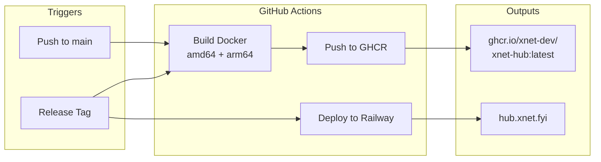

# 09: Hub CD Pipeline

> Automated Docker builds and deployments for the hub

**Duration:** 2 days
**Dependencies:** Hub package, Demo hub deployment

## Overview

When changes are pushed to the hub package, GitHub Actions builds multi-architecture Docker images and publishes them to GitHub Container Registry. Tagged releases auto-deploy to the demo hub on Railway.



## Implementation

### 1. GitHub Actions Workflow

```yaml
# .github/workflows/hub-release.yml

name: Hub Release

on:
  push:
    branches: [main]
    paths:
      - 'packages/hub/**'
      - 'packages/core/**'
      - 'packages/crypto/**'
      - 'packages/identity/**'
      - 'packages/sync/**'
      - 'packages/data/**'
      - '.github/workflows/hub-release.yml'
  release:
    types: [published]
  workflow_dispatch:

env:
  REGISTRY: ghcr.io
  IMAGE_NAME: xnet-dev/xnet-hub

jobs:
  build:
    runs-on: ubuntu-latest
    permissions:
      contents: read
      packages: write
    outputs:
      version: ${{ steps.meta.outputs.version }}

    steps:
      - uses: actions/checkout@v4

      - name: Set up QEMU
        uses: docker/setup-qemu-action@v3

      - name: Set up Docker Buildx
        uses: docker/setup-buildx-action@v3

      - name: Log in to Container Registry
        uses: docker/login-action@v3
        with:
          registry: ${{ env.REGISTRY }}
          username: ${{ github.actor }}
          password: ${{ secrets.GITHUB_TOKEN }}

      - name: Extract metadata
        id: meta
        uses: docker/metadata-action@v5
        with:
          images: ${{ env.REGISTRY }}/${{ env.IMAGE_NAME }}
          tags: |
            type=ref,event=branch
            type=semver,pattern={{version}}
            type=semver,pattern={{major}}.{{minor}}
            type=sha,prefix=

      - name: Build and push
        uses: docker/build-push-action@v5
        with:
          context: .
          file: packages/hub/Dockerfile
          platforms: linux/amd64,linux/arm64
          push: true
          tags: ${{ steps.meta.outputs.tags }}
          labels: ${{ steps.meta.outputs.labels }}
          cache-from: type=gha
          cache-to: type=gha,mode=max

      - name: Generate SBOM
        uses: anchore/sbom-action@v0
        with:
          image: ${{ env.REGISTRY }}/${{ env.IMAGE_NAME }}:${{ steps.meta.outputs.version }}

  deploy:
    needs: build
    if: github.event_name == 'release'
    runs-on: ubuntu-latest
    environment: production

    steps:
      - uses: actions/checkout@v4

      - name: Install Railway CLI
        run: npm i -g @railway/cli

      - name: Deploy to Railway
        run: |
          railway up --service xnet-hub
        env:
          RAILWAY_TOKEN: ${{ secrets.RAILWAY_TOKEN }}

      - name: Verify deployment
        run: |
          sleep 30
          curl -sf https://hub.xnet.fyi/health | jq .
          if [ $? -ne 0 ]; then
            echo "Health check failed!"
            exit 1
          fi

      - name: Notify Slack
        if: success()
        uses: slackapi/slack-github-action@v1
        with:
          payload: |
            {
              "text": "xNet Hub deployed: v${{ needs.build.outputs.version }}",
              "blocks": [
                {
                  "type": "section",
                  "text": {
                    "type": "mrkdwn",
                    "text": "*xNet Hub Deployed*\nVersion: `${{ needs.build.outputs.version }}`\nEnvironment: Production (Railway)\n<https://hub.xnet.fyi/health|Health Check>"
                  }
                }
              ]
            }
        env:
          SLACK_WEBHOOK_URL: ${{ secrets.SLACK_WEBHOOK_URL }}

  security-scan:
    needs: build
    runs-on: ubuntu-latest
    permissions:
      security-events: write

    steps:
      - name: Run Trivy vulnerability scanner
        uses: aquasecurity/trivy-action@master
        with:
          image-ref: ${{ env.REGISTRY }}/${{ env.IMAGE_NAME }}:${{ needs.build.outputs.version }}
          format: 'sarif'
          output: 'trivy-results.sarif'

      - name: Upload Trivy scan results
        uses: github/codeql-action/upload-sarif@v3
        with:
          sarif_file: 'trivy-results.sarif'
```

### 2. Version Management

```typescript
// scripts/bump-hub-version.ts

import { readFileSync, writeFileSync } from 'fs'
import { execSync } from 'child_process'

type BumpType = 'major' | 'minor' | 'patch'

function bumpVersion(type: BumpType) {
  const pkgPath = 'packages/hub/package.json'
  const pkg = JSON.parse(readFileSync(pkgPath, 'utf-8'))

  const [major, minor, patch] = pkg.version.split('.').map(Number)

  let newVersion: string
  switch (type) {
    case 'major':
      newVersion = `${major + 1}.0.0`
      break
    case 'minor':
      newVersion = `${major}.${minor + 1}.0`
      break
    case 'patch':
      newVersion = `${major}.${minor}.${patch + 1}`
      break
  }

  pkg.version = newVersion
  writeFileSync(pkgPath, JSON.stringify(pkg, null, 2) + '\n')

  // Generate changelog entry
  const changelog = generateChangelog(newVersion)
  prependToChangelog(changelog)

  // Commit and tag
  execSync(`git add packages/hub/package.json CHANGELOG.md`)
  execSync(`git commit -m "chore(hub): release v${newVersion}"`)
  execSync(`git tag hub-v${newVersion}`)

  console.log(`
Hub version bumped to ${newVersion}

Next steps:
  git push && git push --tags

This will trigger:
  1. Docker build and push to GHCR
  2. Deployment to hub.xnet.dev
`)
}

function generateChangelog(version: string): string {
  const lastTag = execSync('git describe --tags --abbrev=0 --match "hub-v*"').toString().trim()

  const commits = execSync(
    `git log ${lastTag}..HEAD --pretty=format:"- %s" -- packages/hub packages/core packages/crypto packages/identity packages/sync packages/data`
  ).toString()

  return `
## Hub v${version} (${new Date().toISOString().split('T')[0]})

${commits || '- No changes'}
`
}

function prependToChangelog(entry: string) {
  const path = 'CHANGELOG.md'
  const existing = readFileSync(path, 'utf-8')
  const [header, ...rest] = existing.split('\n## ')

  writeFileSync(path, header + entry + '\n## ' + rest.join('\n## '))
}

// CLI
const type = process.argv[2] as BumpType
if (!['major', 'minor', 'patch'].includes(type)) {
  console.error('Usage: tsx scripts/bump-hub-version.ts [major|minor|patch]')
  process.exit(1)
}

bumpVersion(type)
```

### 3. Release Workflow

```yaml
# .github/workflows/hub-create-release.yml

name: Create Hub Release

on:
  workflow_dispatch:
    inputs:
      version_bump:
        description: 'Version bump type'
        required: true
        type: choice
        options:
          - patch
          - minor
          - major
      prerelease:
        description: 'Mark as prerelease'
        required: false
        type: boolean
        default: false

jobs:
  release:
    runs-on: ubuntu-latest
    permissions:
      contents: write

    steps:
      - uses: actions/checkout@v4
        with:
          fetch-depth: 0
          token: ${{ secrets.RELEASE_TOKEN }}

      - uses: pnpm/action-setup@v3
        with:
          version: 9

      - uses: actions/setup-node@v4
        with:
          node-version: 20

      - name: Configure git
        run: |
          git config user.name "github-actions[bot]"
          git config user.email "github-actions[bot]@users.noreply.github.com"

      - name: Bump version
        run: |
          pnpm tsx scripts/bump-hub-version.ts ${{ inputs.version_bump }}

      - name: Push changes
        run: |
          git push
          git push --tags

      - name: Get version
        id: version
        run: |
          VERSION=$(node -p "require('./packages/hub/package.json').version")
          echo "version=$VERSION" >> $GITHUB_OUTPUT

      - name: Create GitHub Release
        env:
          GH_TOKEN: ${{ secrets.GITHUB_TOKEN }}
        run: |
          gh release create "hub-v${{ steps.version.outputs.version }}" \
            --title "Hub v${{ steps.version.outputs.version }}" \
            --generate-notes \
            ${{ inputs.prerelease && '--prerelease' || '' }}
```

### 4. Multi-Stage Dockerfile (Optimized)

```dockerfile
# packages/hub/Dockerfile

# ============================================
# Build stage
# ============================================
FROM --platform=$BUILDPLATFORM node:20-alpine AS builder

WORKDIR /app

# Install pnpm
RUN corepack enable && corepack prepare pnpm@9 --activate

# Copy package files for dependency caching
COPY pnpm-lock.yaml pnpm-workspace.yaml ./
COPY packages/hub/package.json ./packages/hub/
COPY packages/core/package.json ./packages/core/
COPY packages/crypto/package.json ./packages/crypto/
COPY packages/identity/package.json ./packages/identity/
COPY packages/sync/package.json ./packages/sync/
COPY packages/data/package.json ./packages/data/

# Install dependencies
RUN --mount=type=cache,id=pnpm,target=/root/.local/share/pnpm/store \
    pnpm install --frozen-lockfile

# Copy source code
COPY packages/ ./packages/
COPY tsconfig.base.json ./

# Build all packages
RUN pnpm --filter @xnet/hub... build

# ============================================
# Production dependencies stage
# ============================================
FROM node:20-alpine AS deps

WORKDIR /app

RUN corepack enable && corepack prepare pnpm@9 --activate

COPY pnpm-lock.yaml pnpm-workspace.yaml ./
COPY packages/hub/package.json ./packages/hub/
COPY packages/core/package.json ./packages/core/
COPY packages/crypto/package.json ./packages/crypto/
COPY packages/identity/package.json ./packages/identity/
COPY packages/sync/package.json ./packages/sync/
COPY packages/data/package.json ./packages/data/

RUN --mount=type=cache,id=pnpm,target=/root/.local/share/pnpm/store \
    pnpm install --frozen-lockfile --prod

# ============================================
# Runtime stage
# ============================================
FROM node:20-alpine AS runtime

# Security: run as non-root
RUN addgroup -g 1001 -S xnet && \
    adduser -u 1001 -S xnet -G xnet

WORKDIR /app

# Copy production dependencies
COPY --from=deps /app/node_modules ./node_modules
COPY --from=deps /app/packages/*/node_modules ./packages/

# Copy built code
COPY --from=builder /app/packages/hub/dist ./packages/hub/dist
COPY --from=builder /app/packages/core/dist ./packages/core/dist
COPY --from=builder /app/packages/crypto/dist ./packages/crypto/dist
COPY --from=builder /app/packages/identity/dist ./packages/identity/dist
COPY --from=builder /app/packages/sync/dist ./packages/sync/dist
COPY --from=builder /app/packages/data/dist ./packages/data/dist

# Copy package.json files for module resolution
COPY --from=builder /app/packages/hub/package.json ./packages/hub/
COPY --from=builder /app/packages/core/package.json ./packages/core/
COPY --from=builder /app/packages/crypto/package.json ./packages/crypto/
COPY --from=builder /app/packages/identity/package.json ./packages/identity/
COPY --from=builder /app/packages/sync/package.json ./packages/sync/
COPY --from=builder /app/packages/data/package.json ./packages/data/

# Create data directory
RUN mkdir -p /data && chown -R xnet:xnet /data

USER xnet

EXPOSE 4444

ENV NODE_ENV=production
ENV DATA_DIR=/data

HEALTHCHECK --interval=30s --timeout=10s --start-period=10s --retries=3 \
    CMD wget -q --spider http://localhost:4444/health || exit 1

CMD ["node", "packages/hub/dist/cli.js"]
```

### 5. Canary Deployments

```yaml
# .github/workflows/hub-canary.yml

name: Hub Canary Deployment

on:
  push:
    branches: [main]
    paths:
      - 'packages/hub/**'

jobs:
  canary:
    runs-on: ubuntu-latest
    environment: canary

    steps:
      - uses: actions/checkout@v4

      - name: Install Railway CLI
        run: npm i -g @railway/cli

      - name: Deploy to canary
        run: railway up --service xnet-hub-canary
        env:
          RAILWAY_TOKEN: ${{ secrets.RAILWAY_TOKEN }}

      - name: Run smoke tests
        run: |
          # Test WebSocket connection
          npm install -g wscat
          echo '{"type":"ping"}' | wscat -c wss://canary.hub.xnet.fyi -w 5

      - name: Promote to production
        if: success()
        run: |
          echo "Canary tests passed. Ready for production."
          # Optionally auto-promote after N hours of stability
```

## Testing

```typescript
describe('Hub CD Pipeline', () => {
  describe('Docker Build', () => {
    it('builds successfully for amd64', async () => {
      const { exitCode } = await exec(
        'docker build -t test-hub-amd64 --platform linux/amd64 -f packages/hub/Dockerfile .'
      )
      expect(exitCode).toBe(0)
    })

    it('builds successfully for arm64', async () => {
      const { exitCode } = await exec(
        'docker build -t test-hub-arm64 --platform linux/arm64 -f packages/hub/Dockerfile .'
      )
      expect(exitCode).toBe(0)
    })

    it('image size is under 200MB', async () => {
      const { stdout } = await exec('docker images test-hub-amd64 --format "{{.Size}}"')
      const size = parseSize(stdout.trim())
      expect(size).toBeLessThan(200 * 1024 * 1024)
    })
  })

  describe('Version Management', () => {
    it('generates correct version bump', () => {
      expect(bumpVersion('1.2.3', 'patch')).toBe('1.2.4')
      expect(bumpVersion('1.2.3', 'minor')).toBe('1.3.0')
      expect(bumpVersion('1.2.3', 'major')).toBe('2.0.0')
    })
  })
})
```

## Validation Gate

- [ ] Docker image builds for amd64 and arm64
- [ ] Image pushed to ghcr.io/xnet-dev/xnet-hub
- [ ] Tagged releases auto-deploy to `hub.xnet.fyi` via Railway
- [ ] Health check passes after deployment
- [ ] SBOM generated for each release
- [ ] Security scan runs and reports vulnerabilities
- [ ] Canary deployment tests new code before production

---

[Back to README](./README.md) | [Next: Expo Polish ->](./10-expo-polish.md)
