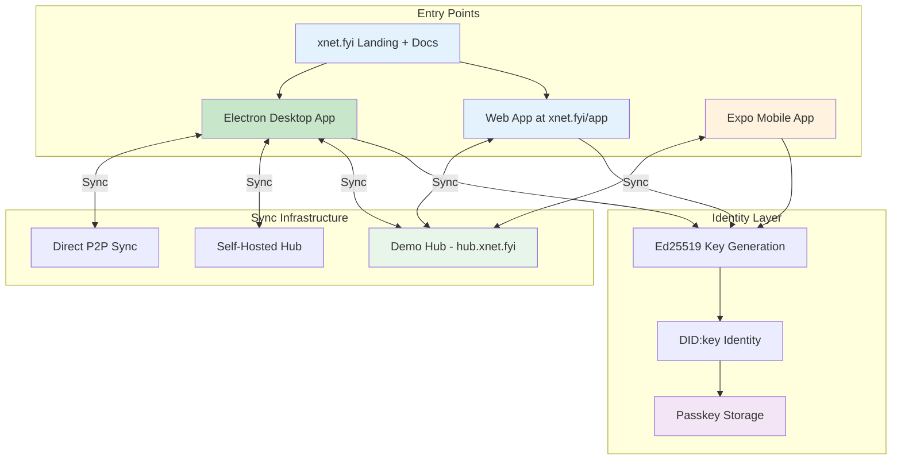
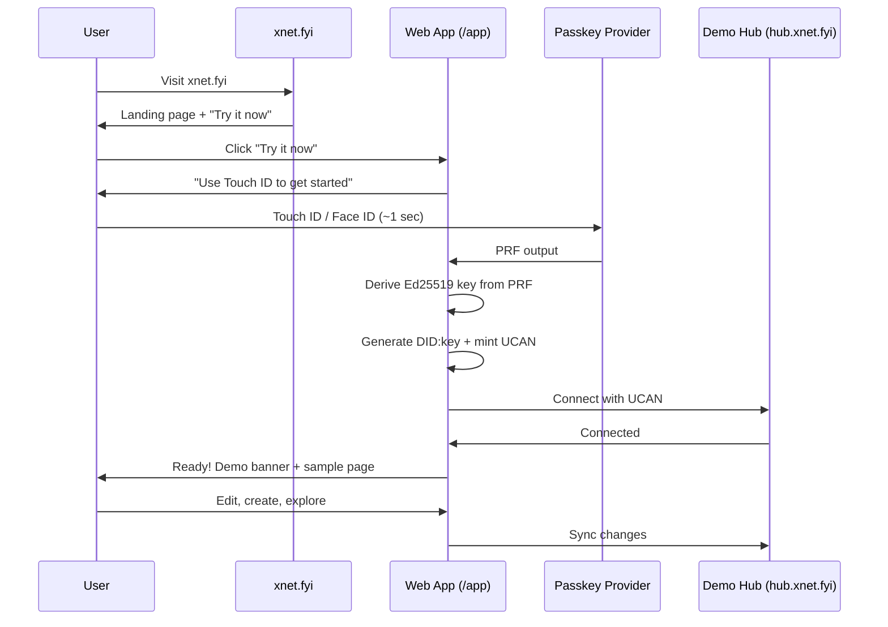
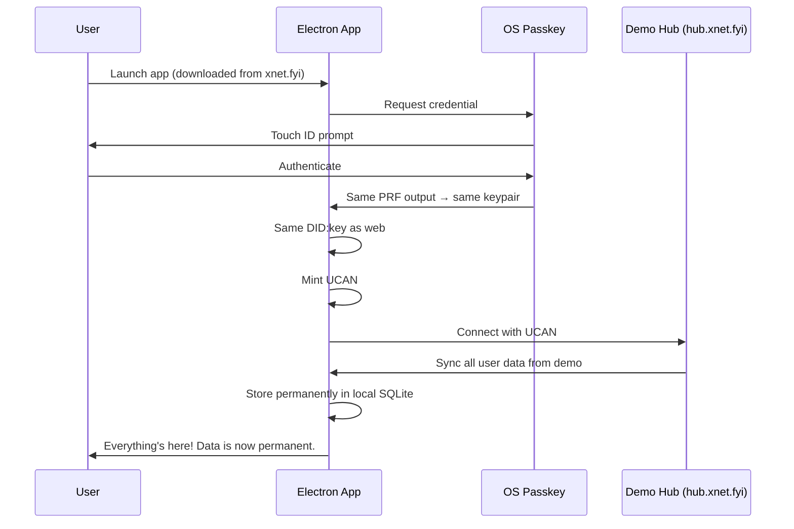

# xNet Implementation Plan - Step 03.91: Onboarding & Polish

> Release-ready onboarding: passkey auth, seamless sync, and deployment pipelines

## Executive Summary

This plan takes xNet from "working prototype" to "releasable product" by focusing on three interconnected goals: frictionless identity with passkey-protected keys, seamless multi-device sync via hubs, and automated deployment pipelines for both the Electron desktop app and self-hosted hub infrastructure.

The user journey we're building:

```
1. Visit xnet.fyi (landing page on GitHub Pages)
2. Click "Try it now" → xnet.fyi/app
3. Tap Touch ID / Face ID (~1 second) → identity created
4. Create pages, databases, canvases (synced via demo Hub)
5. Share with others via link
6. Download desktop app → same passkey → data syncs instantly
7. Optionally: deploy your own Hub on Railway or VPS
```



## Architecture Decisions

| Decision             | Choice                     | Rationale                                                        |
| -------------------- | -------------------------- | ---------------------------------------------------------------- |
| Primary auth         | Passkeys (WebAuthn)        | Biometric unlock, no passwords, cross-device via iCloud/Google   |
| Key storage          | Passkey PRF extension      | Keys derived from passkey, not just protected by it              |
| Auth model           | Passkey-first, required    | Same auth code for demo + production, no anonymous mode          |
| Desktop distribution | GitHub Releases CD         | Auto-updates, code signing, cross-platform                       |
| Demo hub             | Railway                    | Usage-based pricing (~$0/mo with Hobby credit), one-click deploy |
| Demo domain          | xnet.fyi                   | GH Pages for site/app, Railway for Hub at hub.xnet.fyi           |
| Demo data policy     | 10 MB quota, 24h eviction  | Sandbox feel, natural graduation path to desktop/self-hosted     |
| Self-hosted docs     | VPS/Railway guide + Docker | Low barrier, multiple deployment options                         |
| Static site          | Astro + Starlight          | Fast, modern, good DX, already built at site/                    |

## Current State

| Component       | Status  | Notes                                               |
| --------------- | ------- | --------------------------------------------------- |
| Identity system | Partial | Ed25519/DID:key works, passkey integration missing  |
| Hub             | Partial | Signaling + relay works, needs demo mode + eviction |
| Electron app    | Working | Needs CD pipeline, auto-update, code signing        |
| Web app         | Working | Needs passkey auth, Hub connection, demo UX         |
| Expo app        | Working | Lower priority, compile-your-own for now            |
| Static site     | Working | Landing page + docs at site/, needs xnet.fyi domain |

## Implementation Phases

### Phase 1: Passkey Authentication (Days 1-4)

| Task | Document                                   | Description                       |
| ---- | ------------------------------------------ | --------------------------------- |
| 1.1  | [01-passkey-auth.md](./01-passkey-auth.md) | WebAuthn credential creation flow |
| 1.2  | [01-passkey-auth.md](./01-passkey-auth.md) | PRF extension for key derivation  |
| 1.3  | [01-passkey-auth.md](./01-passkey-auth.md) | Fallback for non-PRF browsers     |
| 1.4  | [01-passkey-auth.md](./01-passkey-auth.md) | Identity unlock flow              |

**Validation Gate:**

- [ ] New user creates identity via passkey on first visit (required, not optional)
- [ ] Returning user unlocks with biometric (Face ID / Touch ID / Windows Hello)
- [ ] Keys are derived from passkey PRF, not stored in plain IndexedDB
- [ ] Works in Chrome 116+, Safari 18+, Edge 116+ (PRF required)

### Phase 2: Onboarding Flow (Days 5-7)

| Task | Document                                         | Description              |
| ---- | ------------------------------------------------ | ------------------------ |
| 2.1  | [02-onboarding-flow.md](./02-onboarding-flow.md) | First-run welcome screen |
| 2.2  | [02-onboarding-flow.md](./02-onboarding-flow.md) | Identity creation wizard |
| 2.3  | [02-onboarding-flow.md](./02-onboarding-flow.md) | Hub connection setup     |
| 2.4  | [02-onboarding-flow.md](./02-onboarding-flow.md) | Quick-start templates    |

**Validation Gate:**

- [ ] New user goes from landing to working in < 10 seconds (one biometric tap)
- [ ] Passkey is required — no skip option, no anonymous mode
- [ ] Demo Hub connection is automatic after passkey creation
- [ ] User sees sample content to understand features

### Phase 3: Cross-Device Sync (Days 8-11)

| Task | Document                                             | Description                                 |
| ---- | ---------------------------------------------------- | ------------------------------------------- |
| 3.1  | [03-cross-device-sync.md](./03-cross-device-sync.md) | Passkey sync across devices (iCloud/Google) |
| 3.2  | [03-cross-device-sync.md](./03-cross-device-sync.md) | QR code device linking (fallback)           |
| 3.3  | [03-cross-device-sync.md](./03-cross-device-sync.md) | Hub-mediated initial sync                   |
| 3.4  | [03-cross-device-sync.md](./03-cross-device-sync.md) | Conflict-free data merge                    |

**Validation Gate:**

- [ ] User on web creates data, opens desktop app, data appears
- [ ] Passkey-synced identity works across Apple/Google ecosystems
- [ ] QR code linking works for devices without passkey sync
- [ ] No data loss during cross-device sync

### Phase 4: Sharing & Permissions (Days 12-14)

| Task | Document                                                 | Description               |
| ---- | -------------------------------------------------------- | ------------------------- |
| 4.1  | [04-sharing-permissions.md](./04-sharing-permissions.md) | Share link generation     |
| 4.2  | [04-sharing-permissions.md](./04-sharing-permissions.md) | UCAN-based access control |
| 4.3  | [04-sharing-permissions.md](./04-sharing-permissions.md) | Permission revocation     |
| 4.4  | [04-sharing-permissions.md](./04-sharing-permissions.md) | Collaborator presence UI  |

**Validation Gate:**

- [ ] User can share a page/database via link
- [ ] Recipient can view/edit based on permissions
- [ ] Owner can revoke access at any time
- [ ] Active collaborators shown in real-time

### Phase 5: Electron CD Pipeline (Days 15-18)

| Task | Document                                 | Description                       |
| ---- | ---------------------------------------- | --------------------------------- |
| 5.1  | [05-electron-cd.md](./05-electron-cd.md) | GitHub Actions workflow           |
| 5.2  | [05-electron-cd.md](./05-electron-cd.md) | Code signing (macOS, Windows)     |
| 5.3  | [05-electron-cd.md](./05-electron-cd.md) | Auto-update with electron-updater |
| 5.4  | [05-electron-cd.md](./05-electron-cd.md) | Release notes generation          |

**Validation Gate:**

- [ ] Push to main triggers build for macOS (Intel + ARM), Windows, Linux
- [ ] macOS app is notarized (no Gatekeeper warning)
- [ ] Windows app is signed (no SmartScreen warning)
- [ ] Users get update prompts automatically

### Phase 6: Static Site (Days 19-22)

| Task | Document                                 | Description                           |
| ---- | ---------------------------------------- | ------------------------------------- |
| 6.1  | [06-static-site.md](./06-static-site.md) | Astro project setup                   |
| 6.2  | [06-static-site.md](./06-static-site.md) | Landing page with hero                |
| 6.3  | [06-static-site.md](./06-static-site.md) | Documentation pages                   |
| 6.4  | [06-static-site.md](./06-static-site.md) | Download page with platform detection |

**Validation Gate:**

- [ ] xnet.fyi shows landing page (GitHub Pages with custom domain)
- [ ] Download links point to latest GitHub releases
- [ ] Docs explain features, self-hosting, API
- [ ] "Try it now" links to xnet.fyi/app (demo with passkey + Hub)

### Phase 7: Demo Hub Deployment (Days 23-25)

| Task | Document                           | Description                          |
| ---- | ---------------------------------- | ------------------------------------ |
| 7.1  | [07-demo-hub.md](./07-demo-hub.md) | Railway deployment (hub.xnet.fyi)    |
| 7.2  | [07-demo-hub.md](./07-demo-hub.md) | Demo mode: 10 MB quota, 24h eviction |
| 7.3  | [07-demo-hub.md](./07-demo-hub.md) | Monitoring and alerts                |
| 7.4  | [07-demo-hub.md](./07-demo-hub.md) | Standard UCAN auth (passkey-first)   |

**Validation Gate:**

- [ ] hub.xnet.fyi accepts WebSocket connections (Railway)
- [ ] TLS works (wss://) with custom domain
- [ ] Demo quotas enforced (10 MB per DID, 24h eviction)
- [ ] Rate limiting prevents abuse, standard UCAN auth

### Phase 8: Self-Hosted Hub Guide (Days 26-28)

| Task | Document                                         | Description                  |
| ---- | ------------------------------------------------ | ---------------------------- |
| 8.1  | [08-self-hosted-hub.md](./08-self-hosted-hub.md) | VPS setup documentation      |
| 8.2  | [08-self-hosted-hub.md](./08-self-hosted-hub.md) | Docker Compose configuration |
| 8.3  | [08-self-hosted-hub.md](./08-self-hosted-hub.md) | Caddy reverse proxy config   |
| 8.4  | [08-self-hosted-hub.md](./08-self-hosted-hub.md) | Automated install script     |

**Validation Gate:**

- [ ] User can follow docs to deploy hub on DigitalOcean/Hetzner/etc
- [ ] Docker image published to GitHub Container Registry
- [ ] One-liner install script works
- [ ] HTTPS works with automatic Let's Encrypt

### Phase 9: Hub CD Pipeline (Days 29-30)

| Task | Document                       | Description                      |
| ---- | ------------------------------ | -------------------------------- |
| 9.1  | [09-hub-cd.md](./09-hub-cd.md) | GitHub Actions for Docker build  |
| 9.2  | [09-hub-cd.md](./09-hub-cd.md) | Multi-arch images (amd64, arm64) |
| 9.3  | [09-hub-cd.md](./09-hub-cd.md) | Automated Railway/Fly.io deploys |
| 9.4  | [09-hub-cd.md](./09-hub-cd.md) | Version tagging strategy         |

**Validation Gate:**

- [ ] Push to main builds and publishes Docker image
- [ ] Image works on both x86 and ARM VPS
- [ ] Demo Hub auto-deploys to Railway on release
- [ ] Semantic versioning for hub releases

### Phase 10: Expo Polish (Days 31-32)

| Task | Document                                 | Description                       |
| ---- | ---------------------------------------- | --------------------------------- |
| 10.1 | [10-expo-polish.md](./10-expo-polish.md) | Build instructions documentation  |
| 10.2 | [10-expo-polish.md](./10-expo-polish.md) | EAS Build configuration           |
| 10.3 | [10-expo-polish.md](./10-expo-polish.md) | TestFlight/Internal testing setup |
| 10.4 | [10-expo-polish.md](./10-expo-polish.md) | Known limitations documentation   |

**Validation Gate:**

- [ ] Developer can build and run Expo app locally
- [ ] EAS Build produces installable IPA/APK
- [ ] Docs explain it's "compile your own" for now
- [ ] Core features work (pages, sync)

### Phase 11: Final Polish (Days 33-35)

| Task | Document                                   | Description                  |
| ---- | ------------------------------------------ | ---------------------------- |
| 11.1 | [11-final-polish.md](./11-final-polish.md) | Error handling audit         |
| 11.2 | [11-final-polish.md](./11-final-polish.md) | Loading states and skeletons |
| 11.3 | [11-final-polish.md](./11-final-polish.md) | Offline indicators           |
| 11.4 | [11-final-polish.md](./11-final-polish.md) | Accessibility audit (a11y)   |

**Validation Gate:**

- [ ] No unhandled promise rejections in console
- [ ] All async operations show loading state
- [ ] Offline mode clearly indicated
- [ ] Screen reader can navigate core flows

## User Journey (Detailed)

### New User on Web



### Returning User on Desktop



## Package Changes

| Package          | Changes                                               |
| ---------------- | ----------------------------------------------------- |
| `@xnet/identity` | Add passkey storage, PRF key derivation, unlock flow  |
| `@xnet/react`    | Add onboarding components, share dialogs, presence UI |
| `@xnet/hub`      | Add rate limiting, monitoring endpoints, usage quotas |
| `apps/electron`  | Add auto-update, code signing, passkey integration    |
| `apps/web`       | Add onboarding wizard, hub config UI                  |
| `site/`          | Add @astrojs/react, /app route, demo UX components    |

## Dependencies

| Dependency                | Package        | Purpose                      |
| ------------------------- | -------------- | ---------------------------- |
| `@simplewebauthn/browser` | @xnet/identity | WebAuthn client-side         |
| `@simplewebauthn/server`  | @xnet/hub      | WebAuthn server verification |
| `@astrojs/react`          | site/          | React islands for /app route |
| `electron-updater`        | apps/electron  | Auto-updates                 |
| `electron-builder`        | apps/electron  | Packaging + signing          |

## Success Criteria

1. **Instant onboarding** — New user productive in < 10 seconds (one biometric tap)
2. **Passkey-first** — No anonymous mode, no skip option. Same auth code for demo + production.
3. **Full demo experience** — Sync, sharing, collab all work on xnet.fyi/app via demo Hub
4. **Seamless cross-device** — Data appears instantly on new device after same passkey auth
5. **Secure by default** — Keys derived from passkey PRF, never stored in plaintext
6. **Natural graduation** — Demo (10 MB, 24h TTL) → Desktop app or self-hosted Hub
7. **Self-hostable** — Anyone can run their own Hub via Railway (1-click) or VPS (15 min)
8. **Auto-updating desktop** — Users always on latest version
9. **Professional distribution** — No security warnings on any platform
10. **Accessible** — Core flows work with screen readers

## Risk Mitigation

| Risk                             | Mitigation                                                                                               |
| -------------------------------- | -------------------------------------------------------------------------------------------------------- |
| Passkey PRF not widely supported | Require modern browsers (Chrome 116+, Safari 18+, Edge 116+). Show clear error for unsupported browsers. |
| No anonymous fallback            | Acceptable tradeoff — passkey support is widespread in 2026. Users without it can use the desktop app.   |
| Code signing costs               | Apple Developer ($99/yr), Windows can use self-signed initially                                          |
| Demo hub abuse                   | Passkey creation is OS-rate-limited. Plus: quotas, eviction, rate limits.                                |
| Demo data loss                   | Local IndexedDB is the source of truth. Hub eviction only removes the relay copy.                        |
| Complex self-hosting             | Railway 1-click deploy as default, VPS guide for power users                                             |

## Timeline Summary

| Phase             | Duration | Milestone                          |
| ----------------- | -------- | ---------------------------------- |
| Passkey Auth      | 4 days   | Identity system production-ready   |
| Onboarding        | 3 days   | New user flow polished             |
| Cross-Device      | 4 days   | Multi-device sync working          |
| Sharing           | 3 days   | Collaboration features complete    |
| Electron CD       | 4 days   | Desktop distribution automated     |
| Static Site       | 4 days   | Public website live                |
| Demo Hub          | 3 days   | hub.xnet.fyi operational (Railway) |
| Self-Hosted Guide | 3 days   | Documentation complete             |
| Hub CD            | 2 days   | Hub releases automated             |
| Expo Polish       | 2 days   | Mobile documented                  |
| Final Polish      | 3 days   | Release candidate ready            |

**Total: ~35 days (7 weeks)**

## Reference Documents

- [Identity & Authentication Plan](../plan/13-identity-authentication.md) - Detailed passkey architecture
- [Hub Phase 1 Plan](../planStep03_8HubPhase1VPS/README.md) - Hub implementation details
- [Yjs Security Plan](../planStep03_4_1YjsSecurity/README.md) - Secure sync foundation
- [Background Sync Manager](../planStep03_3_1BgSync/README.md) - Client sync architecture
- [Exploration 0049: Hub on Railway](../explorations/0049_HUB_RAILWAY_DEPLOYMENT.md) - Railway as deployment target
- [Exploration 0050: Web App on GitHub Pages](../explorations/0050_WEB_APP_ON_GITHUB_PAGES.md) - Static demo feasibility
- [Exploration 0051: Demo Hub on Railway](../explorations/0051_DEMO_HUB_ON_RAILWAY.md) - Full demo architecture (passkey-first, eviction, xnet.fyi)

---

[Back to Main Plan](../plan/README.md) | [Start Implementation ->](./01-passkey-auth.md)
