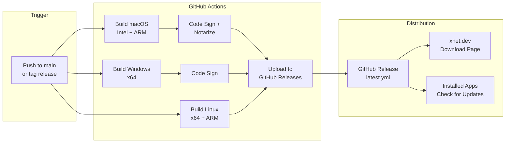

# 05: Electron CD Pipeline

> Automated builds, code signing, and auto-updates for the desktop app

**Duration:** 4 days
**Dependencies:** Existing Electron app in `apps/electron`

## Overview

When code is pushed to main, GitHub Actions builds the Electron app for macOS (Intel + ARM), Windows, and Linux. The builds are code-signed, uploaded to GitHub Releases, and users receive automatic update prompts.



## Implementation

### 1. GitHub Actions Workflow

```yaml
# .github/workflows/electron-release.yml

name: Electron Release

on:
  push:
    branches: [main]
    paths:
      - 'apps/electron/**'
      - 'packages/**'
      - 'pnpm-lock.yaml'
  workflow_dispatch:
    inputs:
      release_type:
        description: 'Release type'
        required: true
        default: 'draft'
        type: choice
        options:
          - draft
          - prerelease
          - release

concurrency:
  group: electron-release-${{ github.ref }}
  cancel-in-progress: true

jobs:
  version:
    runs-on: ubuntu-latest
    outputs:
      version: ${{ steps.version.outputs.version }}
      should_release: ${{ steps.check.outputs.should_release }}
    steps:
      - uses: actions/checkout@v4

      - name: Get version from package.json
        id: version
        run: |
          VERSION=$(node -p "require('./apps/electron/package.json').version")
          echo "version=$VERSION" >> $GITHUB_OUTPUT

      - name: Check if release exists
        id: check
        run: |
          if gh release view "v${{ steps.version.outputs.version }}" &>/dev/null; then
            echo "should_release=false" >> $GITHUB_OUTPUT
          else
            echo "should_release=true" >> $GITHUB_OUTPUT
          fi
        env:
          GH_TOKEN: ${{ secrets.GITHUB_TOKEN }}

  build-macos:
    needs: version
    if: needs.version.outputs.should_release == 'true'
    runs-on: macos-latest
    strategy:
      matrix:
        arch: [x64, arm64]
    steps:
      - uses: actions/checkout@v4

      - uses: pnpm/action-setup@v3
        with:
          version: 9

      - uses: actions/setup-node@v4
        with:
          node-version: 20
          cache: 'pnpm'

      - name: Install dependencies
        run: pnpm install --frozen-lockfile

      - name: Build packages
        run: pnpm build

      - name: Import code signing certificates
        env:
          APPLE_CERTIFICATE: ${{ secrets.APPLE_CERTIFICATE }}
          APPLE_CERTIFICATE_PASSWORD: ${{ secrets.APPLE_CERTIFICATE_PASSWORD }}
          KEYCHAIN_PASSWORD: ${{ secrets.KEYCHAIN_PASSWORD }}
        run: |
          # Create keychain
          security create-keychain -p "$KEYCHAIN_PASSWORD" build.keychain
          security default-keychain -s build.keychain
          security unlock-keychain -p "$KEYCHAIN_PASSWORD" build.keychain

          # Import certificate
          echo "$APPLE_CERTIFICATE" | base64 --decode > certificate.p12
          security import certificate.p12 -k build.keychain -P "$APPLE_CERTIFICATE_PASSWORD" -T /usr/bin/codesign
          security set-key-partition-list -S apple-tool:,apple:,codesign: -s -k "$KEYCHAIN_PASSWORD" build.keychain

      - name: Build Electron app
        env:
          APPLE_ID: ${{ secrets.APPLE_ID }}
          APPLE_ID_PASSWORD: ${{ secrets.APPLE_ID_PASSWORD }}
          APPLE_TEAM_ID: ${{ secrets.APPLE_TEAM_ID }}
          CSC_LINK: ${{ secrets.APPLE_CERTIFICATE }}
          CSC_KEY_PASSWORD: ${{ secrets.APPLE_CERTIFICATE_PASSWORD }}
        run: |
          cd apps/electron
          pnpm electron-builder --mac --${{ matrix.arch }} --publish never

      - name: Notarize app
        env:
          APPLE_ID: ${{ secrets.APPLE_ID }}
          APPLE_ID_PASSWORD: ${{ secrets.APPLE_ID_PASSWORD }}
          APPLE_TEAM_ID: ${{ secrets.APPLE_TEAM_ID }}
        run: |
          cd apps/electron/dist
          DMG_FILE=$(ls *.dmg | head -1)
          xcrun notarytool submit "$DMG_FILE" \
            --apple-id "$APPLE_ID" \
            --password "$APPLE_ID_PASSWORD" \
            --team-id "$APPLE_TEAM_ID" \
            --wait
          xcrun stapler staple "$DMG_FILE"

      - name: Upload artifacts
        uses: actions/upload-artifact@v4
        with:
          name: macos-${{ matrix.arch }}
          path: |
            apps/electron/dist/*.dmg
            apps/electron/dist/*.zip
            apps/electron/dist/latest-mac.yml

  build-windows:
    needs: version
    if: needs.version.outputs.should_release == 'true'
    runs-on: windows-latest
    steps:
      - uses: actions/checkout@v4

      - uses: pnpm/action-setup@v3
        with:
          version: 9

      - uses: actions/setup-node@v4
        with:
          node-version: 20
          cache: 'pnpm'

      - name: Install dependencies
        run: pnpm install --frozen-lockfile

      - name: Build packages
        run: pnpm build

      - name: Build Electron app
        env:
          CSC_LINK: ${{ secrets.WINDOWS_CERTIFICATE }}
          CSC_KEY_PASSWORD: ${{ secrets.WINDOWS_CERTIFICATE_PASSWORD }}
        run: |
          cd apps/electron
          pnpm electron-builder --win --x64 --publish never

      - name: Upload artifacts
        uses: actions/upload-artifact@v4
        with:
          name: windows-x64
          path: |
            apps/electron/dist/*.exe
            apps/electron/dist/latest.yml

  build-linux:
    needs: version
    if: needs.version.outputs.should_release == 'true'
    runs-on: ubuntu-latest
    strategy:
      matrix:
        arch: [x64, arm64]
    steps:
      - uses: actions/checkout@v4

      - uses: pnpm/action-setup@v3
        with:
          version: 9

      - uses: actions/setup-node@v4
        with:
          node-version: 20
          cache: 'pnpm'

      - name: Install dependencies
        run: pnpm install --frozen-lockfile

      - name: Build packages
        run: pnpm build

      - name: Build Electron app
        run: |
          cd apps/electron
          pnpm electron-builder --linux --${{ matrix.arch }} --publish never

      - name: Upload artifacts
        uses: actions/upload-artifact@v4
        with:
          name: linux-${{ matrix.arch }}
          path: |
            apps/electron/dist/*.AppImage
            apps/electron/dist/*.deb
            apps/electron/dist/latest-linux.yml

  release:
    needs: [version, build-macos, build-windows, build-linux]
    runs-on: ubuntu-latest
    steps:
      - uses: actions/checkout@v4

      - name: Download all artifacts
        uses: actions/download-artifact@v4
        with:
          path: artifacts

      - name: Generate release notes
        id: notes
        run: |
          # Get commits since last release
          LAST_TAG=$(git describe --tags --abbrev=0 2>/dev/null || echo "")
          if [ -n "$LAST_TAG" ]; then
            COMMITS=$(git log $LAST_TAG..HEAD --pretty=format:"- %s" -- apps/electron packages)
          else
            COMMITS=$(git log --pretty=format:"- %s" -20 -- apps/electron packages)
          fi

          cat << EOF > release-notes.md
          ## What's New

          $COMMITS

          ## Downloads

          | Platform | Download |
          |----------|----------|
          | macOS (Apple Silicon) | [xNet-${{ needs.version.outputs.version }}-arm64.dmg](https://github.com/${{ github.repository }}/releases/download/v${{ needs.version.outputs.version }}/xNet-${{ needs.version.outputs.version }}-arm64.dmg) |
          | macOS (Intel) | [xNet-${{ needs.version.outputs.version }}-x64.dmg](https://github.com/${{ github.repository }}/releases/download/v${{ needs.version.outputs.version }}/xNet-${{ needs.version.outputs.version }}-x64.dmg) |
          | Windows | [xNet-${{ needs.version.outputs.version }}-Setup.exe](https://github.com/${{ github.repository }}/releases/download/v${{ needs.version.outputs.version }}/xNet-${{ needs.version.outputs.version }}-Setup.exe) |
          | Linux (AppImage) | [xNet-${{ needs.version.outputs.version }}.AppImage](https://github.com/${{ github.repository }}/releases/download/v${{ needs.version.outputs.version }}/xNet-${{ needs.version.outputs.version }}.AppImage) |
          | Linux (Debian) | [xNet-${{ needs.version.outputs.version }}.deb](https://github.com/${{ github.repository }}/releases/download/v${{ needs.version.outputs.version }}/xNet-${{ needs.version.outputs.version }}.deb) |
          EOF

      - name: Create release
        env:
          GH_TOKEN: ${{ secrets.GITHUB_TOKEN }}
        run: |
          gh release create "v${{ needs.version.outputs.version }}" \
            --title "xNet v${{ needs.version.outputs.version }}" \
            --notes-file release-notes.md \
            ${{ github.event.inputs.release_type == 'draft' && '--draft' || '' }} \
            ${{ github.event.inputs.release_type == 'prerelease' && '--prerelease' || '' }} \
            artifacts/**/*
```

### 2. electron-builder Configuration

```json
// apps/electron/electron-builder.json5
{
  "appId": "dev.xnet.app",
  "productName": "xNet",
  "copyright": "Copyright 2024 xNet Contributors",

  "directories": {
    "output": "dist",
    "buildResources": "build"
  },

  "files": ["out/**/*", "package.json"],

  "mac": {
    "category": "public.app-category.productivity",
    "icon": "build/icon.icns",
    "hardenedRuntime": true,
    "gatekeeperAssess": false,
    "entitlements": "build/entitlements.mac.plist",
    "entitlementsInherit": "build/entitlements.mac.plist",
    "target": [
      {
        "target": "dmg",
        "arch": ["x64", "arm64"]
      },
      {
        "target": "zip",
        "arch": ["x64", "arm64"]
      }
    ]
  },

  "dmg": {
    "contents": [
      {
        "x": 130,
        "y": 220
      },
      {
        "x": 410,
        "y": 220,
        "type": "link",
        "path": "/Applications"
      }
    ]
  },

  "win": {
    "icon": "build/icon.ico",
    "target": [
      {
        "target": "nsis",
        "arch": ["x64"]
      }
    ],
    "signingHashAlgorithms": ["sha256"],
    "certificateSubjectName": "xNet"
  },

  "nsis": {
    "oneClick": false,
    "perMachine": false,
    "allowToChangeInstallationDirectory": true,
    "deleteAppDataOnUninstall": false
  },

  "linux": {
    "icon": "build/icon.png",
    "category": "Office",
    "target": [
      {
        "target": "AppImage",
        "arch": ["x64", "arm64"]
      },
      {
        "target": "deb",
        "arch": ["x64", "arm64"]
      }
    ]
  },

  "publish": {
    "provider": "github",
    "owner": "xnet-dev",
    "repo": "xnet"
  }
}
```

### 3. macOS Entitlements

```xml
<!-- apps/electron/build/entitlements.mac.plist -->
<?xml version="1.0" encoding="UTF-8"?>
<!DOCTYPE plist PUBLIC "-//Apple//DTD PLIST 1.0//EN" "http://www.apple.com/DTDs/PropertyList-1.0.dtd">
<plist version="1.0">
<dict>
    <key>com.apple.security.cs.allow-jit</key>
    <true/>
    <key>com.apple.security.cs.allow-unsigned-executable-memory</key>
    <true/>
    <key>com.apple.security.cs.disable-library-validation</key>
    <true/>
    <key>com.apple.security.network.client</key>
    <true/>
    <key>com.apple.security.files.user-selected.read-write</key>
    <true/>
    <key>com.apple.security.device.usb</key>
    <true/>
    <key>com.apple.security.keychain-access-groups</key>
    <array>
        <string>$(AppIdentifierPrefix)dev.xnet.app</string>
    </array>
</dict>
</plist>
```

### 4. Auto-Update Implementation

```typescript
// apps/electron/src/main/updater.ts

import { autoUpdater } from 'electron-updater'
import { BrowserWindow, dialog, app } from 'electron'
import log from 'electron-log'

// Configure logging
autoUpdater.logger = log
log.transports.file.level = 'info'

// Disable auto download - we want to ask the user first
autoUpdater.autoDownload = false
autoUpdater.autoInstallOnAppQuit = true

export function initAutoUpdater(mainWindow: BrowserWindow) {
  // Check for updates on startup (after a delay)
  setTimeout(() => {
    autoUpdater.checkForUpdates()
  }, 10000)

  // Check for updates every 4 hours
  setInterval(
    () => {
      autoUpdater.checkForUpdates()
    },
    4 * 60 * 60 * 1000
  )

  // Update available
  autoUpdater.on('update-available', (info) => {
    log.info('Update available:', info.version)

    // Notify renderer
    mainWindow.webContents.send('update-available', {
      version: info.version,
      releaseNotes: info.releaseNotes
    })

    // Or show native dialog
    dialog
      .showMessageBox(mainWindow, {
        type: 'info',
        title: 'Update Available',
        message: `Version ${info.version} is available.`,
        detail: 'Would you like to download and install it now?',
        buttons: ['Download', 'Later'],
        defaultId: 0
      })
      .then(({ response }) => {
        if (response === 0) {
          autoUpdater.downloadUpdate()
        }
      })
  })

  // Download progress
  autoUpdater.on('download-progress', (progress) => {
    mainWindow.webContents.send('update-progress', {
      percent: progress.percent,
      transferred: progress.transferred,
      total: progress.total
    })

    // Update dock badge on macOS
    if (process.platform === 'darwin') {
      app.dock.setBadge(`${Math.round(progress.percent)}%`)
    }
  })

  // Download complete
  autoUpdater.on('update-downloaded', (info) => {
    log.info('Update downloaded:', info.version)

    if (process.platform === 'darwin') {
      app.dock.setBadge('')
    }

    mainWindow.webContents.send('update-ready', {
      version: info.version
    })

    dialog
      .showMessageBox(mainWindow, {
        type: 'info',
        title: 'Update Ready',
        message: `Version ${info.version} has been downloaded.`,
        detail: 'The update will be installed when you quit the app. Restart now?',
        buttons: ['Restart', 'Later'],
        defaultId: 0
      })
      .then(({ response }) => {
        if (response === 0) {
          autoUpdater.quitAndInstall()
        }
      })
  })

  // Error
  autoUpdater.on('error', (err) => {
    log.error('Update error:', err)
    mainWindow.webContents.send('update-error', {
      message: err.message
    })
  })
}

// IPC handlers for manual update control
import { ipcMain } from 'electron'

ipcMain.handle('check-for-updates', async () => {
  const result = await autoUpdater.checkForUpdates()
  return result?.updateInfo
})

ipcMain.handle('download-update', () => {
  autoUpdater.downloadUpdate()
})

ipcMain.handle('install-update', () => {
  autoUpdater.quitAndInstall()
})
```

### 5. Update UI Component

```typescript
// apps/electron/src/renderer/components/UpdateNotification.tsx

import { useState, useEffect } from 'react'

interface UpdateInfo {
  version: string
  releaseNotes?: string
}

interface UpdateProgress {
  percent: number
  transferred: number
  total: number
}

export function UpdateNotification() {
  const [available, setAvailable] = useState<UpdateInfo | null>(null)
  const [progress, setProgress] = useState<UpdateProgress | null>(null)
  const [ready, setReady] = useState(false)

  useEffect(() => {
    window.electron.on('update-available', (_e, info: UpdateInfo) => {
      setAvailable(info)
    })

    window.electron.on('update-progress', (_e, prog: UpdateProgress) => {
      setProgress(prog)
    })

    window.electron.on('update-ready', () => {
      setReady(true)
      setProgress(null)
    })

    return () => {
      window.electron.removeAllListeners('update-available')
      window.electron.removeAllListeners('update-progress')
      window.electron.removeAllListeners('update-ready')
    }
  }, [])

  if (!available && !progress && !ready) {
    return null
  }

  return (
    <div className="update-notification">
      {available && !progress && !ready && (
        <div className="update-available">
          <span>Version {available.version} is available</span>
          <button onClick={() => window.electron.invoke('download-update')}>
            Download
          </button>
          <button onClick={() => setAvailable(null)}>Later</button>
        </div>
      )}

      {progress && (
        <div className="update-progress">
          <span>Downloading update...</span>
          <div className="progress-bar">
            <div
              className="progress-fill"
              style={{ width: `${progress.percent}%` }}
            />
          </div>
          <span>{Math.round(progress.percent)}%</span>
        </div>
      )}

      {ready && (
        <div className="update-ready">
          <span>Update ready to install</span>
          <button onClick={() => window.electron.invoke('install-update')}>
            Restart Now
          </button>
        </div>
      )}
    </div>
  )
}
```

### 6. Version Bump Script

```bash
#!/bin/bash
# scripts/bump-version.sh

# Usage: ./scripts/bump-version.sh [major|minor|patch]

TYPE=${1:-patch}

cd apps/electron

# Bump version
npm version $TYPE --no-git-tag-version

# Get new version
VERSION=$(node -p "require('./package.json').version")

# Update root package.json (optional)
cd ../..
npm version $VERSION --no-git-tag-version --allow-same-version

# Commit and tag
git add .
git commit -m "chore: bump version to $VERSION"
git tag "v$VERSION"

echo "Version bumped to $VERSION"
echo "Run 'git push && git push --tags' to trigger release"
```

## Required Secrets

| Secret                         | Description                            |
| ------------------------------ | -------------------------------------- |
| `APPLE_CERTIFICATE`            | Base64-encoded .p12 file               |
| `APPLE_CERTIFICATE_PASSWORD`   | Password for the .p12 file             |
| `APPLE_ID`                     | Apple Developer account email          |
| `APPLE_ID_PASSWORD`            | App-specific password for notarization |
| `APPLE_TEAM_ID`                | Apple Developer Team ID                |
| `WINDOWS_CERTIFICATE`          | Base64-encoded .pfx file               |
| `WINDOWS_CERTIFICATE_PASSWORD` | Password for the .pfx file             |

## Obtaining Code Signing Certificates

### macOS

1. Join Apple Developer Program ($99/year)
2. Create "Developer ID Application" certificate in Xcode
3. Export as .p12 from Keychain Access
4. Base64 encode: `base64 -i certificate.p12 | pbcopy`

### Windows

1. Purchase EV code signing certificate ($300-500/year) from DigiCert, Sectigo, etc.
2. Or use Azure SignTool with Azure Key Vault
3. Export as .pfx

## Testing

```typescript
describe('Auto-updater', () => {
  it('checks for updates on startup', async () => {
    const checkSpy = vi.spyOn(autoUpdater, 'checkForUpdates')

    initAutoUpdater(mockWindow)
    await new Promise((r) => setTimeout(r, 11000))

    expect(checkSpy).toHaveBeenCalled()
  })

  it('notifies renderer of available update', async () => {
    const sendSpy = vi.spyOn(mockWindow.webContents, 'send')

    autoUpdater.emit('update-available', { version: '1.2.0' })

    expect(sendSpy).toHaveBeenCalledWith('update-available', {
      version: '1.2.0',
      releaseNotes: undefined
    })
  })
})
```

## Validation Gate

- [x] GitHub Actions builds on push to main
- [x] macOS builds are code-signed and notarized
- [x] Windows builds are code-signed (no SmartScreen)
- [x] Linux builds produce AppImage and .deb
- [x] Release artifacts uploaded to GitHub Releases
- [x] Auto-updater detects new versions
- [x] Update download shows progress
- [x] "Restart to update" installs and relaunches

---

[Back to README](./README.md) | [Next: Static Site ->](./06-static-site.md)
