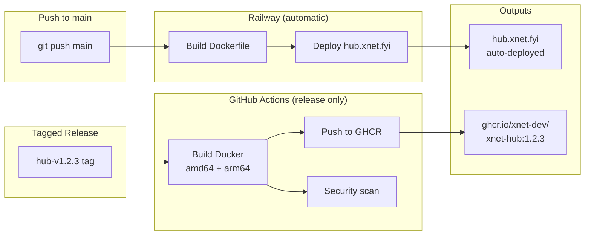

# 09: Hub CD Pipeline

> Automated Docker images for self-hosters; Railway auto-deploys the demo hub

**Duration:** 2 days
**Dependencies:** Hub package, Demo hub deployment

## Overview

The demo hub at `hub.xnet.fyi` deploys automatically via **Railway's native auto-deploy** — no GitHub Actions involved. Railway watches the `main` branch, detects the `railway.toml` and `Dockerfile` in `packages/hub/`, builds, and deploys on every push. Zero config in CI, zero GH Action costs.

GitHub Actions is only used for **tagged releases** to build multi-arch Docker images and push them to GHCR — this serves self-hosters who pull `ghcr.io/xnet-dev/xnet-hub`.



## Railway Auto-Deploy (Demo Hub)

Railway handles the entire demo hub lifecycle with zero CI configuration:

### How It Works

1. Connect the GitHub repo to Railway (one-time setup in dashboard)
2. Set **root directory** to the repo root (the Dockerfile needs monorepo context)
3. Railway detects `packages/hub/railway.toml` → uses `packages/hub/Dockerfile`
4. On every push to `main`, Railway rebuilds and redeploys automatically
5. Health check at `/health` verifies the deploy succeeded

### What Already Exists

| File                         | Purpose                                                   |
| ---------------------------- | --------------------------------------------------------- |
| `packages/hub/railway.toml`  | Build config, health check, restart policy                |
| `packages/hub/Dockerfile`    | Multi-stage build (node:22-alpine)                        |
| `packages/hub/src/config.ts` | Detects `RAILWAY_VOLUME_MOUNT_PATH`, `RAILWAY_PROJECT_ID` |

### Railway Dashboard Setup

```
Project:        xnet-hub
Service:        xnet-hub
Root Directory: /                           (repo root — Dockerfile needs monorepo context)
Branch:         main
Auto-deploy:    ON

Environment Variables:
  NODE_ENV=production
  HUB_MODE=demo
  HUB_PORT=4444

Volume:
  Mount path: /data
  Size: 1 GB

Custom Domain:
  hub.xnet.fyi → <railway-target>.up.railway.app
```

No `RAILWAY_TOKEN` secret needed in GitHub. No deploy step in CI. Railway does it all.

### Rollback

If a deploy breaks, roll back in the Railway dashboard (one click on previous deployment). Railway keeps deployment history automatically.

## GitHub Actions (GHCR Images for Self-Hosters)

This workflow only runs on **tagged releases** — not on every push. It builds multi-arch images so self-hosters can `docker pull ghcr.io/xnet-dev/xnet-hub:latest`.

### 1. Release Image Workflow

```yaml
# .github/workflows/hub-release.yml

name: Hub Release Image

on:
  release:
    types: [published]
  workflow_dispatch:

env:
  REGISTRY: ghcr.io
  IMAGE_NAME: xnet-dev/xnet-hub

jobs:
  build:
    runs-on: ubuntu-latest
    permissions:
      contents: read
      packages: write
    outputs:
      version: ${{ steps.meta.outputs.version }}

    steps:
      - uses: actions/checkout@v4

      - name: Set up QEMU
        uses: docker/setup-qemu-action@v3

      - name: Set up Docker Buildx
        uses: docker/setup-buildx-action@v3

      - name: Log in to Container Registry
        uses: docker/login-action@v3
        with:
          registry: ${{ env.REGISTRY }}
          username: ${{ github.actor }}
          password: ${{ secrets.GITHUB_TOKEN }}

      - name: Extract metadata
        id: meta
        uses: docker/metadata-action@v5
        with:
          images: ${{ env.REGISTRY }}/${{ env.IMAGE_NAME }}
          tags: |
            type=semver,pattern={{version}}
            type=semver,pattern={{major}}.{{minor}}
            type=raw,value=latest

      - name: Build and push
        uses: docker/build-push-action@v5
        with:
          context: .
          file: packages/hub/Dockerfile
          platforms: linux/amd64,linux/arm64
          push: true
          tags: ${{ steps.meta.outputs.tags }}
          labels: ${{ steps.meta.outputs.labels }}
          cache-from: type=gha
          cache-to: type=gha,mode=max

      - name: Generate SBOM
        uses: anchore/sbom-action@v0
        with:
          image: ${{ env.REGISTRY }}/${{ env.IMAGE_NAME }}:${{ steps.meta.outputs.version }}

  security-scan:
    needs: build
    runs-on: ubuntu-latest
    permissions:
      security-events: write

    steps:
      - name: Run Trivy vulnerability scanner
        uses: aquasecurity/trivy-action@master
        with:
          image-ref: ${{ env.REGISTRY }}/${{ env.IMAGE_NAME }}:${{ needs.build.outputs.version }}
          format: 'sarif'
          output: 'trivy-results.sarif'

      - name: Upload Trivy scan results
        uses: github/codeql-action/upload-sarif@v3
        with:
          sarif_file: 'trivy-results.sarif'
```

Key differences from the previous version:

- **No deploy job** — Railway handles demo hub deployment
- **No `on: push` trigger** — only runs on published releases (saves GH Action minutes)
- **No `RAILWAY_TOKEN` secret** — no CI-to-Railway communication needed
- **No canary workflow** — Railway has preview environments if we need that later

### 2. Version Management

```typescript
// scripts/bump-hub-version.ts

import { readFileSync, writeFileSync } from 'fs'
import { execSync } from 'child_process'

type BumpType = 'major' | 'minor' | 'patch'

function bumpVersion(type: BumpType) {
  const pkgPath = 'packages/hub/package.json'
  const pkg = JSON.parse(readFileSync(pkgPath, 'utf-8'))

  const [major, minor, patch] = pkg.version.split('.').map(Number)

  let newVersion: string
  switch (type) {
    case 'major':
      newVersion = `${major + 1}.0.0`
      break
    case 'minor':
      newVersion = `${major}.${minor + 1}.0`
      break
    case 'patch':
      newVersion = `${major}.${minor}.${patch + 1}`
      break
  }

  pkg.version = newVersion
  writeFileSync(pkgPath, JSON.stringify(pkg, null, 2) + '\n')

  // Generate changelog entry
  const changelog = generateChangelog(newVersion)
  prependToChangelog(changelog)

  // Commit and tag
  execSync(`git add packages/hub/package.json CHANGELOG.md`)
  execSync(`git commit -m "chore(hub): release v${newVersion}"`)
  execSync(`git tag hub-v${newVersion}`)

  console.log(`
Hub version bumped to ${newVersion}

Next steps:
  git push && git push --tags

This will trigger:
  1. Railway auto-deploys demo hub (from main push)
  2. GitHub Actions builds + pushes Docker image to GHCR (from tag)
`)
}

function generateChangelog(version: string): string {
  const lastTag = execSync('git describe --tags --abbrev=0 --match "hub-v*"').toString().trim()

  const commits = execSync(
    `git log ${lastTag}..HEAD --pretty=format:"- %s" -- packages/hub packages/core packages/crypto packages/identity packages/sync packages/data`
  ).toString()

  return `
## Hub v${version} (${new Date().toISOString().split('T')[0]})

${commits || '- No changes'}
`
}

function prependToChangelog(entry: string) {
  const path = 'CHANGELOG.md'
  const existing = readFileSync(path, 'utf-8')
  const [header, ...rest] = existing.split('\n## ')

  writeFileSync(path, header + entry + '\n## ' + rest.join('\n## '))
}

// CLI
const type = process.argv[2] as BumpType
if (!['major', 'minor', 'patch'].includes(type)) {
  console.error('Usage: tsx scripts/bump-hub-version.ts [major|minor|patch]')
  process.exit(1)
}

bumpVersion(type)
```

### 3. Release Workflow (Manual Trigger)

```yaml
# .github/workflows/hub-create-release.yml

name: Create Hub Release

on:
  workflow_dispatch:
    inputs:
      version_bump:
        description: 'Version bump type'
        required: true
        type: choice
        options:
          - patch
          - minor
          - major
      prerelease:
        description: 'Mark as prerelease'
        required: false
        type: boolean
        default: false

jobs:
  release:
    runs-on: ubuntu-latest
    permissions:
      contents: write

    steps:
      - uses: actions/checkout@v4
        with:
          fetch-depth: 0
          token: ${{ secrets.RELEASE_TOKEN }}

      - uses: pnpm/action-setup@v3
        with:
          version: 9

      - uses: actions/setup-node@v4
        with:
          node-version: 20

      - name: Configure git
        run: |
          git config user.name "github-actions[bot]"
          git config user.email "github-actions[bot]@users.noreply.github.com"

      - name: Bump version
        run: |
          pnpm tsx scripts/bump-hub-version.ts ${{ inputs.version_bump }}

      - name: Push changes
        run: |
          git push
          git push --tags

      - name: Get version
        id: version
        run: |
          VERSION=$(node -p "require('./packages/hub/package.json').version")
          echo "version=$VERSION" >> $GITHUB_OUTPUT

      - name: Create GitHub Release
        env:
          GH_TOKEN: ${{ secrets.GITHUB_TOKEN }}
        run: |
          gh release create "hub-v${{ steps.version.outputs.version }}" \
            --title "Hub v${{ steps.version.outputs.version }}" \
            --generate-notes \
            ${{ inputs.prerelease && '--prerelease' || '' }}
```

## Deployment Flow Summary

| Event                                       | What Happens                                            | Cost              |
| ------------------------------------------- | ------------------------------------------------------- | ----------------- |
| Push to `main` touching `packages/hub/`     | Railway auto-builds + deploys demo hub                  | $0 (Railway)      |
| Push to `main` NOT touching `packages/hub/` | Nothing                                                 | $0                |
| Manual "Create Hub Release" workflow        | Bumps version, creates tag + GH release                 | ~1 min GH Actions |
| GH Release published                        | Builds multi-arch Docker, pushes to GHCR, security scan | ~5 min GH Actions |

**Total GH Actions cost:** Only on releases (maybe monthly). Day-to-day development deploys are free via Railway.

## Testing

```typescript
describe('Hub CD Pipeline', () => {
  describe('Docker Build', () => {
    it('builds successfully for amd64', async () => {
      const { exitCode } = await exec(
        'docker build -t test-hub-amd64 --platform linux/amd64 -f packages/hub/Dockerfile .'
      )
      expect(exitCode).toBe(0)
    })

    it('builds successfully for arm64', async () => {
      const { exitCode } = await exec(
        'docker build -t test-hub-arm64 --platform linux/arm64 -f packages/hub/Dockerfile .'
      )
      expect(exitCode).toBe(0)
    })

    it('image size is under 200MB', async () => {
      const { stdout } = await exec('docker images test-hub-amd64 --format "{{.Size}}"')
      const size = parseSize(stdout.trim())
      expect(size).toBeLessThan(200 * 1024 * 1024)
    })
  })

  describe('Version Management', () => {
    it('generates correct version bump', () => {
      expect(bumpVersion('1.2.3', 'patch')).toBe('1.2.4')
      expect(bumpVersion('1.2.3', 'minor')).toBe('1.3.0')
      expect(bumpVersion('1.2.3', 'major')).toBe('2.0.0')
    })
  })
})
```

## Validation Gate

- [x] Railway auto-deploys `hub.xnet.fyi` on push to `main`
- [x] Health check passes after Railway deploy
- [x] Rollback works via Railway dashboard
- [x] Docker image builds for amd64 and arm64 on tagged release
- [x] Image pushed to `ghcr.io/xnet-dev/xnet-hub` on tagged release
- [x] SBOM generated for each release
- [x] Security scan runs and reports vulnerabilities
- [x] **No GH Actions run on regular pushes** (only on releases)

---

[Back to README](./README.md) | [Next: Expo Polish ->](./10-expo-polish.md)
