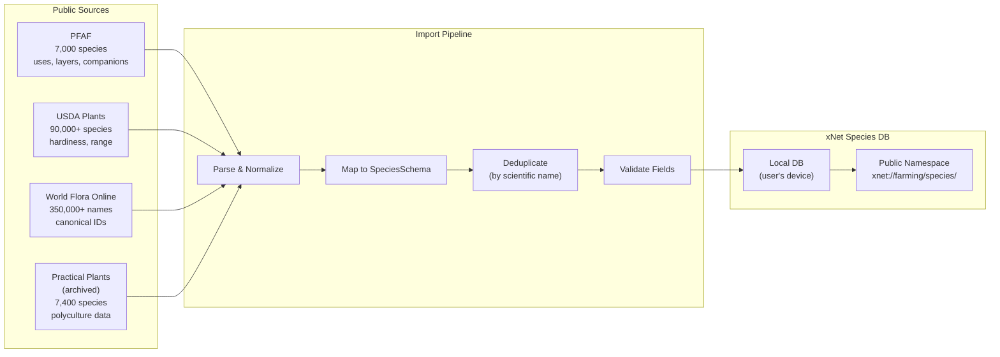

# 02: Species Database

> Seed the species database from public sources, build the import pipeline, and enable community contributions.

**Dependencies:** Step 01 (SpeciesSchema, CompanionRelationSchema)

## Overview

A regenerative farming tool is only as useful as its plant knowledge. This step seeds the database with 5,000+ species from public sources (PFAF, USDA Plants), builds import/export pipelines, and establishes the foundation for community-contributed species data.



## Implementation

### 1. Import Pipeline

```typescript
// packages/farming/src/import/pipeline.ts

export interface RawSpeciesRecord {
  scientificName: string
  commonNames: Record<string, string> // lang → name
  family?: string
  layer?: string
  functions?: string[]
  hardinessMin?: number
  hardinessMax?: number
  height?: number
  spread?: number
  waterNeeds?: string
  sunNeeds?: string
  edibleParts?: string[]
  propagation?: string[]
  uses?: string[]
  companions?: string[]
  antagonists?: string[]
  source: 'pfaf' | 'usda' | 'wfo' | 'practical_plants' | 'community'
  sourceId?: string
}

export class SpeciesImporter {
  constructor(private store: NodeStore) {}

  /** Import a batch of raw species records */
  async importBatch(records: RawSpeciesRecord[]): Promise<ImportResult> {
    const deduplicated = this.deduplicateByScientificName(records)
    const results: ImportResult = {
      total: deduplicated.length,
      created: 0,
      updated: 0,
      skipped: 0,
      errors: []
    }

    for (const record of deduplicated) {
      try {
        const existing = await this.findByScientificName(record.scientificName)
        if (existing) {
          await this.mergeRecord(existing, record)
          results.updated++
        } else {
          await this.createSpecies(record)
          results.created++
        }
      } catch (err) {
        results.errors.push({ record: record.scientificName, error: String(err) })
      }
    }

    return results
  }

  /** Map raw record to SpeciesSchema properties */
  private async createSpecies(record: RawSpeciesRecord): Promise<NodeId> {
    return this.store.create(SpeciesSchema, {
      commonName: record.commonNames['en'] ?? record.scientificName,
      scientificName: record.scientificName,
      family: record.family,
      forestLayer: this.mapLayer(record.layer),
      functions: this.mapFunctions(record.functions ?? []),
      hardinessMin: record.hardinessMin,
      hardinessMax: record.hardinessMax,
      matureHeight: record.height,
      spread: record.spread,
      waterNeeds: this.mapWaterNeeds(record.waterNeeds),
      sunNeeds: this.mapSunNeeds(record.sunNeeds),
      edibleParts: record.edibleParts,
      propagation: record.propagation,
      wfoId: record.source === 'wfo' ? record.sourceId : undefined,
      // Multilingual names as language-suffixed properties
      ...this.buildMultilingualNames(record.commonNames)
    })
  }

  /** Merge new data into existing species (don't overwrite user edits) */
  private async mergeRecord(existingId: NodeId, record: RawSpeciesRecord): Promise<void> {
    const existing = await this.store.get(existingId)
    const updates: Record<string, unknown> = {}

    // Only fill in missing fields, don't overwrite
    if (!existing.family && record.family) updates.family = record.family
    if (!existing.hardinessMin && record.hardinessMin) updates.hardinessMin = record.hardinessMin
    if (!existing.hardinessMax && record.hardinessMax) updates.hardinessMax = record.hardinessMax
    if (!existing.wfoId && record.sourceId) updates.wfoId = record.sourceId

    if (Object.keys(updates).length > 0) {
      await this.store.update(existingId, updates)
    }
  }

  private deduplicateByScientificName(records: RawSpeciesRecord[]): RawSpeciesRecord[] {
    const seen = new Map<string, RawSpeciesRecord>()
    for (const record of records) {
      const key = record.scientificName.toLowerCase().trim()
      if (!seen.has(key)) {
        seen.set(key, record)
      } else {
        // Merge: prefer record with more data
        const existing = seen.get(key)!
        seen.set(key, this.mergeRawRecords(existing, record))
      }
    }
    return [...seen.values()]
  }

  private buildMultilingualNames(names: Record<string, string>): Record<string, string> {
    const props: Record<string, string> = {}
    for (const [lang, name] of Object.entries(names)) {
      if (lang !== 'en') {
        props[`commonName:${lang}`] = name
      }
    }
    return props
  }

  private mapLayer(layer?: string): string | undefined {
    const mapping: Record<string, string> = {
      'tall tree': 'canopy',
      canopy: 'canopy',
      'small tree': 'understory',
      understory: 'understory',
      shrub: 'shrub',
      herbaceous: 'herbaceous',
      perennial: 'herbaceous',
      'ground cover': 'groundcover',
      groundcover: 'groundcover',
      climber: 'vine',
      vine: 'vine',
      root: 'root',
      tuber: 'root',
      fungal: 'mycelial',
      mushroom: 'mycelial'
    }
    return layer ? mapping[layer.toLowerCase()] : undefined
  }

  private mapFunctions(fns: string[]): string[] {
    const mapping: Record<string, string> = {
      'nitrogen fixer': 'nitrogen_fixer',
      'n-fixer': 'nitrogen_fixer',
      'dynamic accumulator': 'dynamic_accumulator',
      'bee plant': 'pollinator_attractor',
      pollinator: 'pollinator_attractor',
      'pest repellent': 'pest_confuser',
      insectary: 'pest_confuser',
      'ground cover': 'ground_cover',
      windbreak: 'windbreak',
      hedge: 'windbreak',
      shade: 'shade_provider',
      edible: 'food_human',
      food: 'food_human',
      fodder: 'food_animal',
      forage: 'food_animal',
      medicinal: 'medicine',
      fiber: 'fiber',
      dye: 'fiber',
      fuel: 'fuel',
      biomass: 'fuel',
      mulch: 'soil_builder',
      compost: 'soil_builder'
    }
    return fns.map((f) => mapping[f.toLowerCase()] ?? f).filter(Boolean)
  }

  private mapWaterNeeds(needs?: string): string | undefined {
    if (!needs) return undefined
    const n = needs.toLowerCase()
    if (n.includes('dry') || n.includes('xeric')) return 'xeric'
    if (n.includes('low')) return 'low'
    if (n.includes('moderate') || n.includes('medium')) return 'moderate'
    if (n.includes('high') || n.includes('wet')) return 'high'
    if (n.includes('aquatic')) return 'aquatic'
    return 'moderate'
  }

  private mapSunNeeds(needs?: string): string | undefined {
    if (!needs) return undefined
    const n = needs.toLowerCase()
    if (n.includes('full sun')) return 'full_sun'
    if (n.includes('shade') && n.includes('part')) return 'part_shade'
    if (n.includes('shade')) return 'full_shade'
    return 'full_sun'
  }
}
```

### 2. PFAF Parser

```typescript
// packages/farming/src/import/pfaf.ts

export class PFAFParser {
  /** Parse PFAF CSV/database dump into RawSpeciesRecord[] */
  async parse(data: string): Promise<RawSpeciesRecord[]> {
    const rows = parseCSV(data)
    return rows.map((row) => ({
      scientificName: row['Latin Name'] ?? '',
      commonNames: { en: row['Common Name'] ?? '' },
      family: row['Family'],
      layer: this.parseHabit(row['Habit']),
      height: parseFloat(row['Height']) || undefined,
      spread: parseFloat(row['Width']) || undefined,
      hardinessMin: this.parseHardiness(row['Hardiness']),
      functions: this.parseFunctions(row),
      edibleParts: this.parseEdible(row['Edible Parts']),
      waterNeeds: row['Moisture'],
      sunNeeds: row['Shade'],
      source: 'pfaf' as const,
      sourceId: row['PFAF ID']
    }))
  }

  private parseHabit(habit?: string): string | undefined {
    if (!habit) return undefined
    if (habit.includes('Tree')) return habit.includes('small') ? 'small tree' : 'tall tree'
    if (habit.includes('Shrub')) return 'shrub'
    if (habit.includes('Climber')) return 'climber'
    if (habit.includes('Perennial')) return 'herbaceous'
    return undefined
  }

  private parseFunctions(row: Record<string, string>): string[] {
    const fns: string[] = []
    if (row['Nitrogen Fixer'] === 'Y') fns.push('nitrogen fixer')
    if (row['Dynamic Accumulator'] === 'Y') fns.push('dynamic accumulator')
    if (row['Edible Rating'] && parseInt(row['Edible Rating']) >= 3) fns.push('food')
    if (row['Medicinal Rating'] && parseInt(row['Medicinal Rating']) >= 3) fns.push('medicinal')
    return fns
  }

  private parseHardiness(h?: string): number | undefined {
    // PFAF uses UK hardiness; approximate USDA mapping
    const match = h?.match(/H(\d)/)
    if (!match) return undefined
    const ukZone = parseInt(match[1])
    return Math.max(1, ukZone + 3) // rough UK→USDA conversion
  }

  private parseEdible(parts?: string): string[] {
    if (!parts) return []
    return parts.split(',').map((p) => p.trim().toLowerCase())
  }
}
```

### 3. Companion Planting Import

```typescript
// packages/farming/src/import/companions.ts

export class CompanionImporter {
  constructor(private store: NodeStore) {}

  /** Import companion planting data */
  async importRelations(
    relations: Array<{
      speciesA: string // scientific name
      speciesB: string
      type: 'beneficial' | 'antagonistic'
      mechanism?: string
      source: string
      confidence: string
    }>
  ): Promise<{ created: number; skipped: number }> {
    let created = 0,
      skipped = 0

    for (const rel of relations) {
      const [idA, idB] = await Promise.all([
        this.findSpeciesByName(rel.speciesA),
        this.findSpeciesByName(rel.speciesB)
      ])

      if (!idA || !idB) {
        skipped++
        continue
      }

      // Check if relation already exists
      const existing = await this.findExistingRelation(idA, idB)
      if (existing) {
        skipped++
        continue
      }

      await this.store.create(CompanionRelationSchema, {
        speciesA: idA,
        speciesB: idB,
        relationship: rel.type,
        mechanism: rel.mechanism,
        source: rel.source,
        confidence: rel.confidence
      })
      created++
    }

    return { created, skipped }
  }
}
```

### 4. Seed Script

```typescript
// packages/farming/src/import/seed.ts

/**
 * Run once on first install to populate species database.
 * Bundled data is ~2MB compressed (5,000 species + 1,000 companion relations).
 */
export async function seedSpeciesDatabase(store: NodeStore): Promise<void> {
  const importer = new SpeciesImporter(store)

  // 1. Import core permaculture species (curated subset)
  const coreSpecies = await import('./data/core-species.json')
  await importer.importBatch(coreSpecies.default)

  // 2. Import companion planting relations
  const companionImporter = new CompanionImporter(store)
  const companions = await import('./data/companions.json')
  await companionImporter.importRelations(companions.default)
}
```

### 5. Community Contributions

```typescript
// packages/farming/src/species/contribute.ts

export interface SpeciesContribution {
  species: Partial<RawSpeciesRecord>
  contributorDID: DID
  contributedAt: number
  status: 'pending' | 'accepted' | 'rejected'
}

/**
 * When a user adds or edits a species, it's available locally immediately.
 * If they opt-in to the public namespace, it syncs to peers.
 * Quality is tracked via the confidence rating on companion relations
 * and the contributor's reputation (how many of their contributions
 * have been independently verified).
 */
export function contributeToPublicNamespace(
  nodeId: NodeId,
  publicStore: NodeStore // public namespace store
): Promise<void> {
  // Copy species node to public namespace
  // Strips any private notes, keeps botanical data
  // Other peers receive it via normal P2P sync
}
```

## Data Files

Bundled JSON files (compiled from public sources, redistributable):

| File                | Records            | Size (compressed) | Source             |
| ------------------- | ------------------ | ----------------- | ------------------ |
| `core-species.json` | 5,000 species      | ~1.5 MB           | PFAF + USDA subset |
| `companions.json`   | 1,000 relations    | ~100 KB           | PFAF + community   |
| `families.json`     | 500 plant families | ~50 KB            | APG IV             |

## Testing

```typescript
describe('SpeciesImporter', () => {
  it('imports a batch of raw records into SpeciesSchema nodes')
  it('deduplicates by scientific name (case-insensitive)')
  it('merges new data into existing species without overwriting')
  it('maps PFAF layer names to SpeciesSchema forestLayer options')
  it('maps function keywords to multiSelect IDs')
  it('builds multilingual name properties from commonNames record')
  it('handles missing optional fields gracefully')
})

describe('PFAFParser', () => {
  it('parses PFAF CSV format into RawSpeciesRecord[]')
  it('extracts nitrogen fixer and dynamic accumulator flags')
  it('converts UK hardiness zones to approximate USDA')
  it('handles rows with missing data')
})

describe('CompanionImporter', () => {
  it('creates CompanionRelation between two existing species')
  it('skips relations where either species is not found')
  it('skips duplicate relations')
})

describe('seedSpeciesDatabase', () => {
  it('populates 5,000+ species on first run')
  it('is idempotent (second run creates no duplicates)')
  it('creates companion relations between seeded species')
})
```

## Checklist

- [ ] Build `SpeciesImporter` with deduplication and merge logic
- [ ] Build `PFAFParser` for PFAF CSV format
- [ ] Build field mapping functions (layer, functions, water, sun)
- [ ] Build `CompanionImporter` with bidirectional lookups
- [ ] Curate core-species.json (5,000 permaculture-relevant species)
- [ ] Curate companions.json (1,000 companion planting relations)
- [ ] Build multilingual name support (property-level lang suffixes)
- [ ] Build `seedSpeciesDatabase` first-run script
- [ ] Add World Flora Online ID cross-references where available
- [ ] Build community contribution flow (local → public namespace)
- [ ] Write unit tests for all importers and parsers
- [ ] Test import idempotency (no duplicates on re-run)

---

[Back to README](./README.md) | [Previous: Farming Schemas](./01-farming-schemas.md) | [Next: Guild Designer](./03-guild-designer.md)
