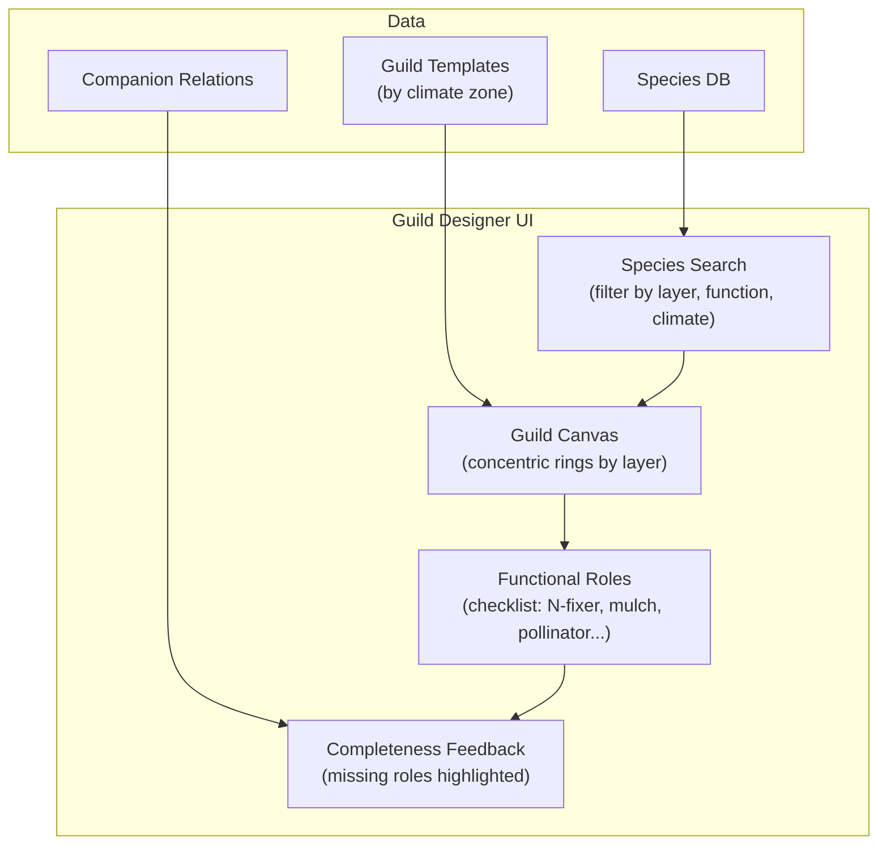

# 03: Guild Designer

> Interactive polyculture composition tool: assemble species into functional guilds with visual feedback.

**Dependencies:** Step 01 (GuildSchema, GuildMemberSchema, SpeciesSchema), Step 02 (Species database)

## Overview

A guild is a group of plants that support each other — a central tree surrounded by nitrogen fixers, ground covers, pest repellents, and nutrient accumulators. The Guild Designer lets users compose these polycultures visually, get feedback on missing functional roles, and save/share proven designs.



## Implementation

### 1. Guild Completeness Analysis

```typescript
// packages/farming/src/guilds/analysis.ts

export interface GuildAnalysis {
  /** All functional roles and which species fill them */
  roles: Record<GuildRole, GuildMemberWithSpecies[]>
  /** Roles with no species assigned */
  missingRoles: GuildRole[]
  /** Roles considered essential for a functioning guild */
  essentialMissing: GuildRole[]
  /** Companion conflicts within the guild */
  conflicts: CompanionConflict[]
  /** Companion synergies within the guild */
  synergies: CompanionSynergy[]
  /** Overall completeness score (0-100) */
  score: number
}

export interface CompanionConflict {
  speciesA: { id: NodeId; name: string }
  speciesB: { id: NodeId; name: string }
  mechanism: string
}

export interface CompanionSynergy {
  speciesA: { id: NodeId; name: string }
  speciesB: { id: NodeId; name: string }
  mechanism: string
}

const ESSENTIAL_ROLES: GuildRole[] = ['nitrogen_fixer', 'ground_cover', 'pollinator']

export async function analyzeGuild(guildId: NodeId, store: NodeStore): Promise<GuildAnalysis> {
  const members = await store.query(GuildMemberSchema, {
    where: { guildId }
  })

  // Load species for each member
  const membersWithSpecies = await Promise.all(
    members.map(async (m) => ({
      ...m,
      species: await store.get(m.species)
    }))
  )

  // Map roles
  const roles: Record<string, GuildMemberWithSpecies[]> = {}
  for (const member of membersWithSpecies) {
    if (!roles[member.role]) roles[member.role] = []
    roles[member.role].push(member)
  }

  // Find missing roles
  const allRoles: GuildRole[] = [
    'central',
    'nitrogen_fixer',
    'mulch',
    'pollinator',
    'pest_repellent',
    'ground_cover',
    'nutrient_accumulator',
    'structural'
  ]
  const filledRoles = new Set(Object.keys(roles))
  const missingRoles = allRoles.filter((r) => !filledRoles.has(r))
  const essentialMissing = ESSENTIAL_ROLES.filter((r) => !filledRoles.has(r))

  // Check companion relations
  const conflicts: CompanionConflict[] = []
  const synergies: CompanionSynergy[] = []

  for (let i = 0; i < membersWithSpecies.length; i++) {
    for (let j = i + 1; j < membersWithSpecies.length; j++) {
      const relation = await findCompanionRelation(
        membersWithSpecies[i].species.id,
        membersWithSpecies[j].species.id,
        store
      )
      if (relation?.relationship === 'antagonistic') {
        conflicts.push({
          speciesA: {
            id: membersWithSpecies[i].species.id,
            name: membersWithSpecies[i].species.commonName
          },
          speciesB: {
            id: membersWithSpecies[j].species.id,
            name: membersWithSpecies[j].species.commonName
          },
          mechanism: relation.mechanism ?? 'Unknown'
        })
      } else if (relation?.relationship === 'beneficial') {
        synergies.push({
          speciesA: {
            id: membersWithSpecies[i].species.id,
            name: membersWithSpecies[i].species.commonName
          },
          speciesB: {
            id: membersWithSpecies[j].species.id,
            name: membersWithSpecies[j].species.commonName
          },
          mechanism: relation.mechanism ?? 'Unknown'
        })
      }
    }
  }

  // Score: 100 = all roles filled, no conflicts, has synergies
  const roleScore = ((allRoles.length - missingRoles.length) / allRoles.length) * 60
  const conflictPenalty = conflicts.length * 10
  const synergyBonus = Math.min(synergies.length * 5, 20)
  const score = Math.max(0, Math.min(100, roleScore - conflictPenalty + synergyBonus + 20))

  return { roles, missingRoles, essentialMissing, conflicts, synergies, score }
}
```

### 2. Guild Suggestions

```typescript
// packages/farming/src/guilds/suggestions.ts

export interface GuildSuggestion {
  species: NodeState // the suggested species
  role: GuildRole // what role it would fill
  reasons: string[] // why this species fits
  score: number // 0-100 relevance
}

/** Suggest species to fill missing roles in a guild */
export async function suggestForGuild(
  guildId: NodeId,
  options: {
    climate?: string
    hardinessZone?: number
    maxSuggestions?: number
  },
  store: NodeStore
): Promise<GuildSuggestion[]> {
  const analysis = await analyzeGuild(guildId, store)
  if (analysis.missingRoles.length === 0) return []

  const suggestions: GuildSuggestion[] = []

  for (const role of analysis.missingRoles) {
    // Find species that serve this function
    const candidates = await store.query(SpeciesSchema, {
      where: {
        functions: { contains: roleFunctionMap[role] }
      }
    })

    // Filter by climate compatibility
    const compatible = candidates.filter((sp) => {
      if (options.hardinessZone) {
        if (sp.hardinessMin && sp.hardinessMin > options.hardinessZone) return false
        if (sp.hardinessMax && sp.hardinessMax < options.hardinessZone) return false
      }
      return true
    })

    // Score by: companion synergies with existing members, layer diversity
    for (const species of compatible.slice(0, 5)) {
      const reasons: string[] = [`Fills ${role} role`]
      let score = 50

      // Bonus: beneficial companions with existing members
      for (const member of Object.values(analysis.roles).flat()) {
        const rel = await findCompanionRelation(species.id, member.species.id, store)
        if (rel?.relationship === 'beneficial') {
          reasons.push(`Beneficial companion to ${member.species.commonName}`)
          score += 15
        }
      }

      // Bonus: layer diversity
      const existingLayers = new Set(
        Object.values(analysis.roles)
          .flat()
          .map((m) => m.species.forestLayer)
      )
      if (!existingLayers.has(species.forestLayer)) {
        reasons.push(`Adds ${species.forestLayer} layer diversity`)
        score += 10
      }

      suggestions.push({ species, role, reasons, score: Math.min(100, score) })
    }
  }

  return suggestions.sort((a, b) => b.score - a.score).slice(0, options.maxSuggestions ?? 10)
}
```

### 3. Guild Templates

```typescript
// packages/farming/src/guilds/templates.ts

export interface GuildTemplate {
  name: string
  climate: string[]
  centralSpecies: string // scientific name
  members: Array<{
    scientificName: string
    role: GuildRole
    quantity: number
    notes?: string
  }>
  spacing: number // meters
  yearsToEstablish: number
  source: string
  description: string
}

/** Built-in guild templates by climate zone */
export const GUILD_TEMPLATES: GuildTemplate[] = [
  {
    name: 'Apple Guild (Temperate)',
    climate: ['temperate', 'continental'],
    centralSpecies: 'Malus domestica',
    members: [
      {
        scientificName: 'Trifolium repens',
        role: 'nitrogen_fixer',
        quantity: 20,
        notes: 'Living mulch beneath canopy'
      },
      {
        scientificName: 'Symphytum officinale',
        role: 'nutrient_accumulator',
        quantity: 5,
        notes: 'Chop-and-drop mulch'
      },
      {
        scientificName: 'Allium schoenoprasum',
        role: 'pest_repellent',
        quantity: 10,
        notes: 'Apple scab deterrent'
      },
      {
        scientificName: 'Tropaeolum majus',
        role: 'pest_repellent',
        quantity: 8,
        notes: 'Aphid trap crop'
      },
      {
        scientificName: 'Lavandula angustifolia',
        role: 'pollinator',
        quantity: 3,
        notes: 'Early-season pollinator support'
      },
      {
        scientificName: 'Fragaria vesca',
        role: 'ground_cover',
        quantity: 15,
        notes: 'Edible ground cover'
      }
    ],
    spacing: 8,
    yearsToEstablish: 3,
    source: "Gaia's Garden (Toby Hemenway)",
    description: 'Classic temperate fruit tree guild with pest management and soil building'
  },
  {
    name: 'Banana Circle (Tropical)',
    climate: ['tropical', 'subtropical'],
    centralSpecies: 'Musa acuminata',
    members: [
      {
        scientificName: 'Ipomoea batatas',
        role: 'ground_cover',
        quantity: 8,
        notes: 'Sweet potato ground cover'
      },
      {
        scientificName: 'Cajanus cajan',
        role: 'nitrogen_fixer',
        quantity: 3,
        notes: 'Pigeon pea windbreak'
      },
      {
        scientificName: 'Curcuma longa',
        role: 'pest_repellent',
        quantity: 6,
        notes: 'Turmeric in partial shade'
      },
      {
        scientificName: 'Zingiber officinale',
        role: 'mulch',
        quantity: 6,
        notes: 'Ginger in banana shade'
      },
      {
        scientificName: 'Carica papaya',
        role: 'central',
        quantity: 1,
        notes: 'Fast-growing companion'
      },
      {
        scientificName: 'Arachis pintoi',
        role: 'nitrogen_fixer',
        quantity: 10,
        notes: 'Perennial peanut ground cover'
      }
    ],
    spacing: 4,
    yearsToEstablish: 1,
    source: 'Tropical Permaculture Guidebook',
    description: 'Fast-establishing tropical guild with greywater processing capability'
  }
  // ... more templates for mediterranean, arid, boreal, etc.
]

/** Instantiate a template into actual Guild + GuildMember nodes */
export async function instantiateTemplate(
  template: GuildTemplate,
  siteId: NodeId,
  store: NodeStore
): Promise<NodeId> {
  // Find or create species nodes for each member
  const centralId = await findOrCreateSpecies(template.centralSpecies, store)

  const guildId = await store.create(GuildSchema, {
    name: template.name,
    centralSpecies: centralId,
    climate: template.climate[0],
    spacing: template.spacing,
    yearsToEstablish: template.yearsToEstablish,
    source: template.source
  })

  for (const member of template.members) {
    const speciesId = await findOrCreateSpecies(member.scientificName, store)
    await store.create(GuildMemberSchema, {
      guildId,
      species: speciesId,
      role: member.role,
      quantity: member.quantity,
      placementNotes: member.notes
    })
  }

  return guildId
}
```

### 4. Guild Designer Component

```typescript
// packages/farming/src/views/GuildDesigner.tsx

export interface GuildDesignerProps {
  guildId?: NodeId          // edit existing guild
  siteId: NodeId            // for climate context
  onSave?: (guildId: NodeId) => void
}

export function GuildDesigner({ guildId, siteId, onSave }: GuildDesignerProps) {
  const [analysis, setAnalysis] = useState<GuildAnalysis | null>(null)
  const [suggestions, setSuggestions] = useState<GuildSuggestion[]>([])

  // Concentric ring layout:
  // Center: central species
  // Ring 1: understory/shrub layer
  // Ring 2: herbaceous/ground cover
  // Ring 3: vine/root additions
  return (
    <div className="guild-designer">
      <div className="guild-canvas">
        <GuildRingLayout guildId={guildId} analysis={analysis} />
      </div>

      <div className="guild-sidebar">
        <RoleChecklist analysis={analysis} />
        <ConflictWarnings conflicts={analysis?.conflicts ?? []} />
        <SynergyHighlights synergies={analysis?.synergies ?? []} />
        <SpeciesSearch onAdd={handleAddMember} />
        <SuggestionsList suggestions={suggestions} onAdd={handleAddSuggested} />
      </div>

      <div className="guild-footer">
        <ScoreBadge score={analysis?.score ?? 0} />
        <TemplateSelector climate={siteClimate} onSelect={handleApplyTemplate} />
      </div>
    </div>
  )
}
```

## Testing

```typescript
describe('analyzeGuild', () => {
  it('identifies filled and missing functional roles')
  it('detects companion conflicts between members')
  it('detects companion synergies between members')
  it('scores 100 for a complete guild with no conflicts')
  it('penalizes score for antagonistic relations')
  it('marks essential roles (N-fixer, ground cover, pollinator) separately')
})

describe('suggestForGuild', () => {
  it('suggests species for each missing role')
  it('filters by hardiness zone compatibility')
  it('ranks species with companion synergies higher')
  it('rewards layer diversity in suggestions')
  it('limits to maxSuggestions results')
})

describe('instantiateTemplate', () => {
  it('creates Guild node from template')
  it('creates GuildMember nodes for each template member')
  it('finds existing species by scientific name')
  it('creates species nodes when not found in DB')
})
```

## Checklist

- [ ] Implement `analyzeGuild` with role mapping and scoring
- [ ] Implement companion conflict/synergy detection within guilds
- [ ] Implement `suggestForGuild` with climate filtering and scoring
- [ ] Create 10+ guild templates (2+ per climate zone)
- [ ] Implement `instantiateTemplate` for one-click guild creation
- [ ] Build `GuildDesigner` component with concentric ring layout
- [ ] Build role checklist with fill indicators
- [ ] Build species search with layer/function/climate filters
- [ ] Build suggestion list with add-to-guild action
- [ ] Show conflict warnings and synergy highlights in sidebar
- [ ] Build template selector filtered by site climate
- [ ] Write unit tests for analysis, suggestions, and templates

---

[Back to README](./README.md) | [Previous: Species Database](./02-species-database.md) | [Next: Soil Health](./04-soil-health.md)
