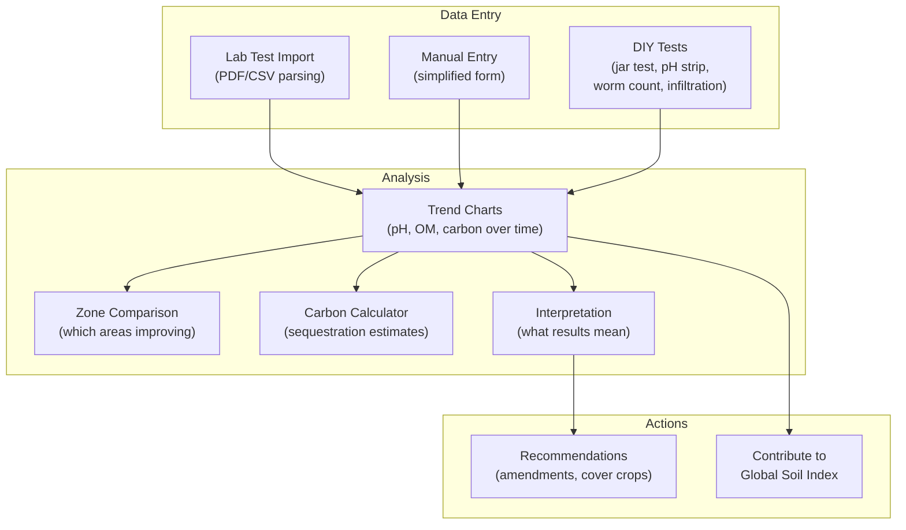

# 04: Soil Health

> Soil test entry, trend visualization, carbon tracking, and interpretation guides.

**Dependencies:** Step 01 (SoilTestSchema, SiteSchema, ZoneSchema)

## Overview

Soil is the foundation of regenerative farming. This step builds the tools to track soil health over time, visualize trends, estimate carbon sequestration, and help farmers interpret results — even without lab access.



## Implementation

### 1. Simplified Entry Mode (DIY Tests)

```typescript
// packages/farming/src/soil/diy-tests.ts

/**
 * Not every farmer has lab access. These DIY tests give
 * approximate values using household materials.
 */
export interface DIYTestGuide {
  id: string
  name: string
  equipment: string[]
  steps: string[]
  resultMapping: (observation: string) => Partial<SoilTestProperties>
}

export const DIY_TESTS: DIYTestGuide[] = [
  {
    id: 'jar_test',
    name: 'Jar Test (Texture)',
    equipment: ['Glass jar with lid', 'Water', 'Soil sample', 'Ruler'],
    steps: [
      'Fill jar 1/3 with soil, add water to 2/3',
      'Shake vigorously for 2 minutes',
      'Let settle: sand (1 min), silt (4 hrs), clay (24 hrs)',
      'Measure each layer thickness'
    ],
    resultMapping: (obs) => {
      // Parse sand/silt/clay percentages from layer measurements
      return { texture: inferTextureFromPercentages(obs) }
    }
  },
  {
    id: 'ph_strip',
    name: 'pH Strip Test',
    equipment: ['pH test strips (garden variety)', 'Distilled water', 'Soil sample'],
    steps: [
      'Mix soil and distilled water 1:1',
      'Let settle 5 minutes',
      'Dip strip in liquid, compare to color chart'
    ],
    resultMapping: (obs) => ({ ph: parseFloat(obs) || undefined })
  },
  {
    id: 'earthworm_count',
    name: 'Earthworm Count',
    equipment: ['Shovel', 'Tray or sheet'],
    steps: [
      'Dig 30cm x 30cm x 30cm cube of soil',
      'Place on tray, break apart gently',
      'Count all earthworms',
      'Multiply by 11 for per-m² estimate'
    ],
    resultMapping: (obs) => ({ earthwormCount: parseInt(obs) * 11 || undefined })
  },
  {
    id: 'infiltration',
    name: 'Infiltration Rate',
    equipment: ['Tin can (both ends removed)', 'Ruler', 'Timer', 'Water'],
    steps: [
      'Push can 5cm into soil',
      'Pour water to 10cm mark inside can',
      'Time how long it takes to drain',
      'Calculate mm/hr'
    ],
    resultMapping: (obs) => ({ infiltrationRate: parseFloat(obs) || undefined })
  },
  {
    id: 'aggregate_stability',
    name: 'Aggregate Stability (Slake Test)',
    equipment: ['Wire mesh/sieve', 'Glass of water', 'Soil clod'],
    steps: [
      'Take a dry soil clod (walnut-sized)',
      'Place on mesh over water glass',
      'Submerge slowly — observe if it holds together or falls apart',
      'Rate: holds firm (good), partially slakes (fair), dissolves (poor)'
    ],
    resultMapping: (obs) => {
      const map: Record<string, number> = { good: 80, fair: 50, poor: 20 }
      return { aggregateStability: map[obs.toLowerCase()] }
    }
  }
]
```

### 2. Carbon Sequestration Calculator

```typescript
// packages/farming/src/soil/carbon.ts

export interface CarbonEstimate {
  totalCarbonTonnes: number // current stock (tonnes C/ha)
  deltaFromBaseline: number // change since first test
  annualRate: number // tonnes C/ha/year
  co2Equivalent: number // tonnes CO₂e sequestered
  confidenceLevel: 'measured' | 'estimated' | 'projected'
}

/**
 * Estimate carbon sequestration from soil test organic matter readings.
 *
 * Conversion: Organic Matter % → Soil Organic Carbon
 * SOC (%) = OM (%) × 0.58 (Van Bemmelen factor)
 * SOC (tonnes/ha) = SOC% × bulk_density × depth × 100
 */
export function calculateCarbon(
  tests: SoilTestNode[],
  siteArea: number // hectares
): CarbonEstimate {
  if (tests.length === 0) {
    return {
      totalCarbonTonnes: 0,
      deltaFromBaseline: 0,
      annualRate: 0,
      co2Equivalent: 0,
      confidenceLevel: 'projected'
    }
  }

  const sorted = tests.sort((a, b) => a.testDate - b.testDate)
  const latest = sorted[sorted.length - 1]
  const first = sorted[0]

  // If direct totalCarbon measurement exists, use it
  if (latest.totalCarbon) {
    const delta = first.totalCarbon ? latest.totalCarbon - first.totalCarbon : 0
    const years = (latest.testDate - first.testDate) / (365.25 * 24 * 60 * 60 * 1000)
    const annualRate = years > 0 ? delta / years : 0

    return {
      totalCarbonTonnes: latest.totalCarbon * siteArea,
      deltaFromBaseline: delta * siteArea,
      annualRate: annualRate * siteArea,
      co2Equivalent: delta * siteArea * 3.67, // C → CO₂ conversion
      confidenceLevel: 'measured'
    }
  }

  // Estimate from organic matter
  if (latest.organicMatter) {
    const depth = latest.depth ?? 30 // default 30cm
    const bulkDensity = latest.bulkDensity ?? 1.3 // default g/cm³
    const socPercent = latest.organicMatter * 0.58 // Van Bemmelen
    const socTonnesHa = socPercent * bulkDensity * (depth / 100) * 100

    let delta = 0
    let annualRate = 0
    if (first.organicMatter && first !== latest) {
      const firstSOC =
        first.organicMatter * 0.58 * (first.bulkDensity ?? 1.3) * ((first.depth ?? 30) / 100) * 100
      delta = socTonnesHa - firstSOC
      const years = (latest.testDate - first.testDate) / (365.25 * 24 * 60 * 60 * 1000)
      annualRate = years > 0 ? delta / years : 0
    }

    return {
      totalCarbonTonnes: socTonnesHa * siteArea,
      deltaFromBaseline: delta * siteArea,
      annualRate: annualRate * siteArea,
      co2Equivalent: delta * siteArea * 3.67,
      confidenceLevel: 'estimated'
    }
  }

  return {
    totalCarbonTonnes: 0,
    deltaFromBaseline: 0,
    annualRate: 0,
    co2Equivalent: 0,
    confidenceLevel: 'projected'
  }
}
```

### 3. Soil Interpretation

```typescript
// packages/farming/src/soil/interpretation.ts

export interface SoilInterpretation {
  property: string
  value: number
  rating: 'very_low' | 'low' | 'moderate' | 'high' | 'very_high' | 'optimal'
  explanation: string
  recommendations: string[]
}

const INTERPRETATION_RANGES: Record<
  string,
  Array<{
    max: number
    rating: string
    explanation: string
    recommendations: string[]
  }>
> = {
  ph: [
    {
      max: 5.0,
      rating: 'very_low',
      explanation: 'Very acidic — most nutrients unavailable',
      recommendations: ['Add wood ash or lime', 'Plant acid-tolerant species (blueberry, azalea)']
    },
    {
      max: 5.5,
      rating: 'low',
      explanation: 'Acidic — some nutrient lockup',
      recommendations: ['Light lime application', 'Add compost to buffer']
    },
    {
      max: 6.5,
      rating: 'optimal',
      explanation: 'Slightly acidic — ideal for most plants',
      recommendations: ['Maintain with regular organic matter additions']
    },
    {
      max: 7.5,
      rating: 'optimal',
      explanation: 'Neutral — excellent availability',
      recommendations: ['Continue current practices']
    },
    {
      max: 8.0,
      rating: 'high',
      explanation: 'Alkaline — iron/manganese may be limited',
      recommendations: ['Add sulfur or acidic mulch', 'Use iron-tolerant species']
    },
    {
      max: 14,
      rating: 'very_high',
      explanation: 'Very alkaline — severe nutrient lockup',
      recommendations: [
        'Heavy sulfur amendment',
        'Acidic compost teas',
        'Consider raised beds with imported soil'
      ]
    }
  ],
  organicMatter: [
    {
      max: 1,
      rating: 'very_low',
      explanation: 'Depleted soil — low biology, poor structure',
      recommendations: [
        'Heavy mulching',
        'Cover crops',
        'Compost application (10+ tonnes/ha)',
        'Avoid tillage'
      ]
    },
    {
      max: 2,
      rating: 'low',
      explanation: 'Below average — building needed',
      recommendations: ['Regular compost', 'Chop-and-drop mulching', 'Diverse cover crop mixes']
    },
    {
      max: 4,
      rating: 'moderate',
      explanation: 'Adequate for most crops',
      recommendations: ['Maintain with annual mulch/compost', 'Continue no-till practices']
    },
    {
      max: 6,
      rating: 'high',
      explanation: 'Excellent — rich biological activity',
      recommendations: [
        'Reduce inputs, soil is self-sustaining',
        'Focus on diversity over amendments'
      ]
    },
    {
      max: 100,
      rating: 'very_high',
      explanation: 'Outstanding — forest soil quality',
      recommendations: ['Minimal intervention', 'This is the goal — document what works!']
    }
  ],
  earthwormCount: [
    {
      max: 50,
      rating: 'very_low',
      explanation: 'Very few worms — soil may be compacted, toxic, or too dry',
      recommendations: [
        'Add organic matter',
        'Reduce compaction',
        'Check for chemical contamination'
      ]
    },
    {
      max: 150,
      rating: 'low',
      explanation: 'Below average — biology still establishing',
      recommendations: ['Mulch heavily', 'Avoid disturbance', 'Add diverse organic inputs']
    },
    {
      max: 300,
      rating: 'moderate',
      explanation: 'Healthy population',
      recommendations: ['Continue current practices']
    },
    {
      max: 500,
      rating: 'high',
      explanation: 'Excellent — very active soil biology',
      recommendations: ['Soil is thriving — share your methods!']
    },
    {
      max: 99999,
      rating: 'very_high',
      explanation: 'Outstanding worm activity',
      recommendations: ['Document and share as a case study']
    }
  ]
}

export function interpretSoilTest(test: SoilTestNode): SoilInterpretation[] {
  const interpretations: SoilInterpretation[] = []

  for (const [property, ranges] of Object.entries(INTERPRETATION_RANGES)) {
    const value = test[property as keyof SoilTestNode]
    if (typeof value !== 'number') continue

    const range = ranges.find((r) => value <= r.max)
    if (range) {
      interpretations.push({
        property,
        value,
        rating: range.rating as SoilInterpretation['rating'],
        explanation: range.explanation,
        recommendations: range.recommendations
      })
    }
  }

  return interpretations
}
```

### 4. Soil Health Chart Component

```typescript
// packages/farming/src/views/SoilChart.tsx

export interface SoilChartProps {
  siteId: NodeId
  zoneId?: NodeId
  metrics?: ('ph' | 'organicMatter' | 'earthwormCount' | 'carbon')[]
}

export function SoilChart({ siteId, zoneId, metrics = ['organicMatter', 'ph'] }: SoilChartProps) {
  const { data: tests } = useQuery(SoilTestSchema, {
    where: { siteId, ...(zoneId ? { zoneId } : {}) },
    sort: [{ field: 'testDate', direction: 'asc' }]
  })

  const carbonEstimate = useMemo(
    () => calculateCarbon(tests, siteArea),
    [tests, siteArea]
  )

  return (
    <div className="soil-chart">
      <div className="soil-chart-header">
        <h3>Soil Health Trends</h3>
        <CarbonBadge estimate={carbonEstimate} />
      </div>

      <LineChart data={tests} xKey="testDate" lines={metrics} />

      <div className="soil-interpretation">
        {tests.length > 0 && (
          <InterpretationPanel test={tests[tests.length - 1]} />
        )}
      </div>

      <div className="soil-actions">
        <button onClick={openDIYGuide}>DIY Test Guide</button>
        <button onClick={openNewTest}>Log Lab Results</button>
        {carbonEstimate.deltaFromBaseline > 0 && (
          <button onClick={contributeToSoilIndex}>
            Share to Global Soil Index
          </button>
        )}
      </div>
    </div>
  )
}
```

## Testing

```typescript
describe('calculateCarbon', () => {
  it('calculates from direct totalCarbon measurements')
  it('estimates from organic matter percentage using Van Bemmelen')
  it('uses default bulk density when not measured')
  it('calculates annual rate from multiple tests over time')
  it('converts to CO₂ equivalent (× 3.67)')
  it('returns zero for single test (no delta)')
  it('sets confidence level based on data source')
})

describe('interpretSoilTest', () => {
  it('rates pH 6.5 as optimal')
  it('rates organic matter 1% as very_low with amendment recommendations')
  it('rates earthworm count 400/m² as high')
  it('handles missing properties gracefully')
})

describe('DIY Tests', () => {
  it('maps jar test observations to texture categories')
  it('maps pH strip reading to number')
  it('multiplies earthworm count by 11 for per-m² estimate')
})
```

## Checklist

- [ ] Implement DIY test guides (5 tests: jar, pH, worm, infiltration, slake)
- [ ] Build simplified data entry form (fewer fields than full lab test)
- [ ] Implement carbon sequestration calculator (Van Bemmelen + direct)
- [ ] Build soil interpretation engine with ranges for pH, OM, worms, etc.
- [ ] Build `SoilChart` component with multi-metric line charts
- [ ] Build `CarbonBadge` showing sequestration estimate
- [ ] Build `InterpretationPanel` with ratings and recommendations
- [ ] Build DIY test guide walkthrough UI (step-by-step with illustrations)
- [ ] Add zone comparison view (side-by-side charts for different zones)
- [ ] Build "Contribute to Global Soil Index" action (anonymized)
- [ ] Write tests for carbon calculations and interpretation ranges

---

[Back to README](./README.md) | [Previous: Guild Designer](./03-guild-designer.md) | [Next: Water Management](./05-water-management.md)
