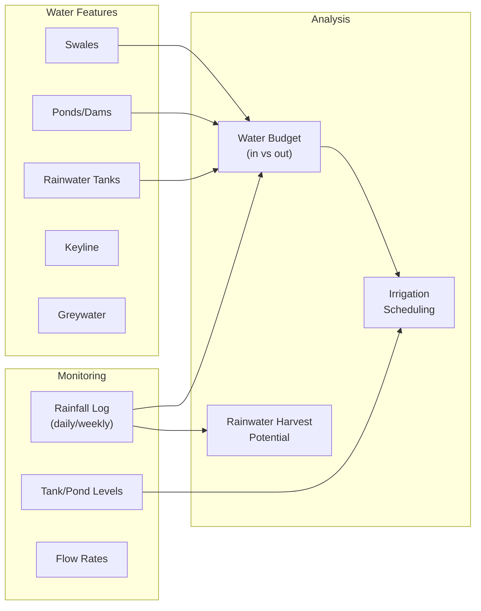

# 05: Water Management

> Track water features, rainfall logging, and irrigation scheduling for whole-site water design.

**Dependencies:** Step 01 (WaterFeatureSchema, WeatherLogSchema, SiteSchema)

## Overview

Water is the most critical resource in permaculture design. This step builds tools to map water features (swales, ponds, keylines), log rainfall, track water budgets, and plan irrigation — all offline-first.



## Implementation

### 1. Water Budget Calculator

```typescript
// packages/farming/src/water/budget.ts

export interface WaterBudget {
  period: { start: number; end: number }
  inputs: {
    rainfall: number // liters (area × mm)
    irrigation: number // liters
    greywater: number // liters
    spring: number // liters
  }
  storage: {
    tankCapacity: number // liters
    pondCapacity: number // liters
    swaleCapacity: number // liters (estimated infiltration)
    currentLevel: number // liters (estimated)
  }
  outputs: {
    evapotranspiration: number // liters (estimated from climate)
    runoff: number // liters (estimated)
    usage: number // liters (irrigation applied)
  }
  balance: number // inputs - outputs
  daysOfReserve: number // storage / daily usage
}

export function calculateWaterBudget(
  site: SiteNode,
  features: WaterFeatureNode[],
  weatherLogs: WeatherLogNode[],
  period: { start: number; end: number }
): WaterBudget {
  const areaM2 = (site.area ?? 1) * 10000 // hectares to m²
  const periodDays = (period.end - period.start) / (24 * 60 * 60 * 1000)

  // Calculate rainfall input
  const periodLogs = weatherLogs.filter((l) => l.logDate >= period.start && l.logDate <= period.end)
  const totalRainfallMm = periodLogs.reduce((sum, l) => sum + (l.rainfall ?? 0), 0)
  const rainfallLiters = totalRainfallMm * areaM2 // 1mm on 1m² = 1 liter

  // Storage capacity from features
  const tanks = features.filter((f) => f.type === 'rainwater_tank')
  const ponds = features.filter((f) => f.type === 'pond')
  const swales = features.filter((f) => f.type === 'swale')

  const tankCapacity = tanks.reduce((sum, t) => sum + (t.capacity ?? 0), 0)
  const pondCapacity = ponds.reduce((sum, p) => sum + (p.capacity ?? 0), 0)
  const swaleCapacity = swales.reduce((sum, s) => sum + estimateSwaleCapacity(s), 0)

  // Estimate ET based on climate (simplified Hargreaves)
  const avgTemp =
    periodLogs.reduce((sum, l) => {
      return sum + ((l.tempHigh ?? 25) + (l.tempLow ?? 15)) / 2
    }, 0) / Math.max(periodLogs.length, 1)
  const dailyET = estimateDailyET(avgTemp, site.elevation ?? 0) // mm/day
  const totalET = dailyET * periodDays * areaM2

  return {
    period,
    inputs: {
      rainfall: rainfallLiters,
      irrigation: 0, // tracked separately
      greywater: features
        .filter((f) => f.type === 'greywater')
        .reduce((s, f) => s + (f.flowRate ?? 0) * periodDays * 60, 0),
      spring: features
        .filter((f) => f.type === 'spring')
        .reduce((s, f) => s + (f.flowRate ?? 0) * periodDays * 1440, 0)
    },
    storage: {
      tankCapacity,
      pondCapacity,
      swaleCapacity,
      currentLevel: tankCapacity * 0.7 // estimate, would be tracked
    },
    outputs: {
      evapotranspiration: totalET,
      runoff: Math.max(0, rainfallLiters - totalET - swaleCapacity) * 0.3,
      usage: 0
    },
    balance: rainfallLiters - totalET,
    daysOfReserve: (tankCapacity + pondCapacity) / (dailyET * areaM2)
  }
}
```

### 2. Rainfall Logging (Quick Entry)

```typescript
// packages/farming/src/water/rainfall.tsx

export function RainfallLogger({ siteId }: { siteId: NodeId }) {
  const { create } = useMutate()
  const [amount, setAmount] = useState('')

  const logRainfall = async () => {
    await create(WeatherLogSchema, {
      siteId,
      logDate: new Date().toISOString(),
      rainfall: parseFloat(amount)
    })
    setAmount('')
  }

  // Large tap-friendly button for quick logging
  return (
    <div className="rainfall-logger">
      <input
        type="number"
        value={amount}
        onChange={e => setAmount(e.target.value)}
        placeholder="mm"
        className="rainfall-input"
      />
      <button onClick={logRainfall} className="rainfall-button">
        Log Rain
      </button>
    </div>
  )
}
```

### 3. Water Map View

```typescript
// packages/farming/src/views/WaterMap.tsx

export function WaterMap({ siteId }: { siteId: NodeId }) {
  const { data: features } = useQuery(WaterFeatureSchema, { where: { siteId } })
  const budget = useWaterBudget(siteId)

  return (
    <div className="water-map">
      <div className="water-features-list">
        {features.map(f => (
          <WaterFeatureCard
            key={f.id}
            feature={f}
            fillLevel={estimateFillLevel(f, budget)}
          />
        ))}
      </div>

      <div className="water-summary">
        <WaterBudgetSummary budget={budget} />
        <ReserveDaysIndicator days={budget?.daysOfReserve ?? 0} />
      </div>
    </div>
  )
}
```

## Checklist

- [ ] Implement water budget calculator (inputs, storage, outputs, balance)
- [ ] Build quick rainfall logging UI (large buttons, minimal fields)
- [ ] Implement ET estimation (simplified Hargreaves method)
- [ ] Build water feature list view with capacity/status indicators
- [ ] Build water budget summary component (reserve days, balance)
- [ ] Calculate rainwater harvest potential (roof area × rainfall)
- [ ] Estimate swale infiltration capacity from dimensions
- [ ] Add frost event logging to weather log quick entry
- [ ] Build monthly rainfall chart (bar chart by month)
- [ ] Write tests for water budget calculations

---

[Back to README](./README.md) | [Previous: Soil Health](./04-soil-health.md) | [Next: Planting & Harvest](./06-planting-harvest.md)
