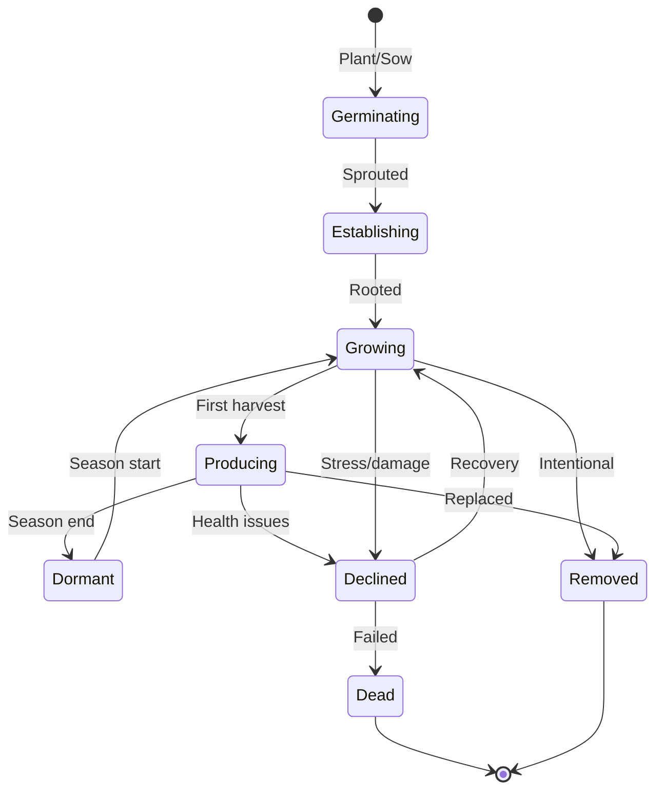

# 06: Planting & Harvest

> Track plant lifecycles from seed to harvest, log yields, and analyze productivity over seasons.

**Dependencies:** Step 01 (PlantingSchema, HarvestSchema, SpeciesSchema)

## Overview

Every planting has a lifecycle. This step builds the tools to track what's planted where, how it's doing, what it produces, and how yields compare across species, zones, and seasons.



## Implementation

### 1. Planting Lifecycle Manager

```typescript
// packages/farming/src/planting/lifecycle.ts

export interface PlantingTimeline {
  plantingId: NodeId
  species: { id: NodeId; commonName: string }
  plantDate: number
  currentStatus: PlantingStatus
  statusHistory: Array<{ status: PlantingStatus; date: number }>
  daysSincePlanting: number
  expectedProductionStart: number | null // based on species.yearsToProduction
  totalHarvests: number
  totalYield: { quantity: number; unit: string }
}

export async function getPlantingTimeline(
  plantingId: NodeId,
  store: NodeStore
): Promise<PlantingTimeline> {
  const planting = await store.get(plantingId)
  const species = await store.get(planting.species)
  const harvests = await store.query(HarvestSchema, {
    where: { plantingId }
  })

  const now = Date.now()
  const daysSincePlanting = Math.floor((now - planting.plantDate) / (24 * 60 * 60 * 1000))

  const expectedProductionStart = species.yearsToProduction
    ? planting.plantDate + species.yearsToProduction * 365.25 * 24 * 60 * 60 * 1000
    : null

  const totalYield = harvests.reduce(
    (acc, h) => ({ quantity: acc.quantity + (h.quantity ?? 0), unit: h.unit ?? 'kg' }),
    { quantity: 0, unit: 'kg' }
  )

  return {
    plantingId,
    species: { id: species.id, commonName: species.commonName },
    plantDate: planting.plantDate,
    currentStatus: planting.status,
    statusHistory: [], // built from change history (event-sourced)
    daysSincePlanting,
    expectedProductionStart,
    totalHarvests: harvests.length,
    totalYield
  }
}
```

### 2. Harvest Quick Logger

```typescript
// packages/farming/src/views/HarvestLogger.tsx

/**
 * Designed for field use: large buttons, minimal typing.
 * Farmer selects planting (or species), enters weight, done.
 */
export function HarvestLogger({ siteId }: { siteId: NodeId }) {
  const { data: plantings } = useQuery(PlantingSchema, {
    where: { siteId, status: 'producing' }
  })
  const { create } = useMutate()

  const [selected, setSelected] = useState<NodeId | null>(null)
  const [quantity, setQuantity] = useState('')
  const [unit, setUnit] = useState<'kg' | 'count' | 'bunches' | 'liters'>('kg')

  const logHarvest = async () => {
    if (!selected || !quantity) return
    await create(HarvestSchema, {
      plantingId: selected,
      harvestDate: new Date().toISOString(),
      quantity: parseFloat(quantity),
      unit,
      quality: 'good',
      destination: 'home'
    })
    setQuantity('')
  }

  return (
    <div className="harvest-logger">
      <div className="planting-grid">
        {plantings.map(p => (
          <PlantingButton
            key={p.id}
            planting={p}
            selected={selected === p.id}
            onSelect={() => setSelected(p.id)}
          />
        ))}
      </div>

      <div className="harvest-entry">
        <input type="number" value={quantity} onChange={e => setQuantity(e.target.value)} placeholder="Amount" />
        <UnitSelector value={unit} onChange={setUnit} />
        <button onClick={logHarvest} disabled={!selected || !quantity}>Log Harvest</button>
      </div>
    </div>
  )
}
```

### 3. Yield Analytics

```typescript
// packages/farming/src/planting/analytics.ts

export interface YieldSummary {
  species: string
  totalHarvests: number
  totalQuantity: number
  unit: string
  averagePerHarvest: number
  bestMonth: number // 0-11
  productivityPerPlant: number
  firstHarvestDays: number // days from planting to first harvest
}

export async function getYieldSummary(
  siteId: NodeId,
  options: { season?: number; zoneId?: NodeId; speciesId?: NodeId },
  store: NodeStore
): Promise<YieldSummary[]> {
  const plantings = await store.query(PlantingSchema, {
    where: { siteId, ...(options.zoneId ? { zoneId: options.zoneId } : {}) }
  })

  const summaryBySpecies = new Map<NodeId, YieldSummary>()

  for (const planting of plantings) {
    const harvests = await store.query(HarvestSchema, {
      where: { plantingId: planting.id }
    })

    if (harvests.length === 0) continue

    const species = await store.get(planting.species)
    const existing = summaryBySpecies.get(planting.species) ?? {
      species: species.commonName,
      totalHarvests: 0,
      totalQuantity: 0,
      unit: harvests[0].unit ?? 'kg',
      averagePerHarvest: 0,
      bestMonth: 0,
      productivityPerPlant: 0,
      firstHarvestDays: 0
    }

    existing.totalHarvests += harvests.length
    existing.totalQuantity += harvests.reduce((s, h) => s + (h.quantity ?? 0), 0)
    existing.averagePerHarvest = existing.totalQuantity / existing.totalHarvests

    // Best month
    const monthCounts = new Array(12).fill(0)
    for (const h of harvests) {
      const month = new Date(h.harvestDate).getMonth()
      monthCounts[month] += h.quantity ?? 0
    }
    existing.bestMonth = monthCounts.indexOf(Math.max(...monthCounts))

    // First harvest days
    const firstHarvest = harvests.sort((a, b) => a.harvestDate - b.harvestDate)[0]
    existing.firstHarvestDays = Math.floor(
      (firstHarvest.harvestDate - planting.plantDate) / (24 * 60 * 60 * 1000)
    )

    existing.productivityPerPlant = existing.totalQuantity / (planting.quantity ?? 1)

    summaryBySpecies.set(planting.species, existing)
  }

  return [...summaryBySpecies.values()].sort((a, b) => b.totalQuantity - a.totalQuantity)
}
```

## Checklist

- [ ] Implement planting lifecycle state tracking
- [ ] Build status transition UI (tap to advance status)
- [ ] Build harvest quick-logger (field-friendly, large buttons)
- [ ] Implement yield analytics (by species, zone, season)
- [ ] Build yield comparison chart (bar chart by species)
- [ ] Build monthly harvest calendar (what's producing when)
- [ ] Calculate days-to-first-harvest vs species expectation
- [ ] Build planting list with status indicators and last harvest
- [ ] Add batch planting creation (multiple plants at once)
- [ ] Write tests for lifecycle and analytics

---

[Back to README](./README.md) | [Previous: Water Management](./05-water-management.md) | [Next: Forest Map View](./07-forest-map-view.md)
