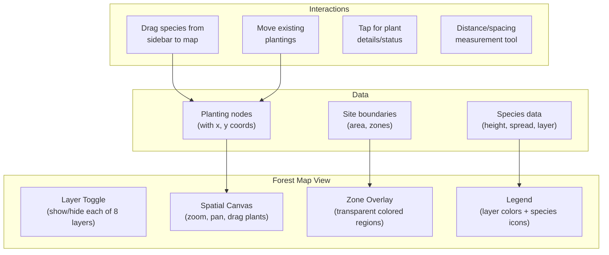

# 07: Forest Map View

> Spatial visualization of plantings by forest layer, with drag-and-drop placement and zone overlays.

**Dependencies:** Step 01 (all schemas), Step 06 (PlantingSchema data), `@xnet/views` (view registry)

## Overview

The Forest Map is the signature view for food forest management. It shows a top-down spatial view of the site with plantings positioned by their physical location, colored/sized by forest layer, and filterable by zone, species, or status.



## Implementation

### 1. Spatial Position Storage

Plantings need x,y coordinates for map placement. Extend the PlantingSchema or store position separately:

```typescript
// packages/farming/src/schemas/planting-position.ts

export const PlantingPositionSchema = defineSchema({
  name: 'PlantingPosition',
  namespace: 'xnet://farming/',
  properties: {
    plantingId: relation({ schema: PlantingSchema }),
    x: number({ required: true }), // meters from site origin
    y: number({ required: true }), // meters from site origin
    canopyRadius: number() // current spread (meters)
  }
})
```

### 2. Layer Rendering

```typescript
// packages/farming/src/views/forest-map/layers.ts

export const LAYER_CONFIG: Record<ForestLayer, LayerStyle> = {
  canopy: { color: '#2d5016', opacity: 0.3, minScale: 0.1, zIndex: 1, label: 'Canopy' },
  understory: { color: '#4a7c23', opacity: 0.4, minScale: 0.2, zIndex: 2, label: 'Understory' },
  shrub: { color: '#6ba030', opacity: 0.5, minScale: 0.3, zIndex: 3, label: 'Shrub' },
  herbaceous: { color: '#8bc43f', opacity: 0.6, minScale: 0.5, zIndex: 4, label: 'Herbaceous' },
  groundcover: { color: '#a8d84f', opacity: 0.7, minScale: 0.8, zIndex: 5, label: 'Ground Cover' },
  vine: { color: '#7b4fba', opacity: 0.5, minScale: 0.3, zIndex: 6, label: 'Vine' },
  root: { color: '#c47030', opacity: 0.4, minScale: 0.5, zIndex: 7, label: 'Root' },
  mycelial: { color: '#f5e6c8', opacity: 0.3, minScale: 0.7, zIndex: 0, label: 'Mycelial' }
}

export interface PlantingMarker {
  id: NodeId
  x: number
  y: number
  radius: number // current canopy radius (meters)
  matureRadius: number // full-grown radius
  layer: ForestLayer
  species: string
  status: PlantingStatus
  color: string
}

export function buildMarkers(
  plantings: PlantingNode[],
  positions: PlantingPositionNode[],
  species: SpeciesNode[]
): PlantingMarker[] {
  const posMap = new Map(positions.map((p) => [p.plantingId, p]))
  const specMap = new Map(species.map((s) => [s.id, s]))

  return plantings
    .filter((p) => posMap.has(p.id))
    .map((p) => {
      const pos = posMap.get(p.id)!
      const spec = specMap.get(p.species)!
      const layer = spec?.forestLayer ?? 'herbaceous'
      const age = (Date.now() - p.plantDate) / (365.25 * 24 * 60 * 60 * 1000)
      const maturity = Math.min(1, age / (spec?.yearsToProduction ?? 5))

      return {
        id: p.id,
        x: pos.x,
        y: pos.y,
        radius: ((spec?.spread ?? 2) / 2) * maturity,
        matureRadius: (spec?.spread ?? 2) / 2,
        layer,
        species: spec?.commonName ?? 'Unknown',
        status: p.status,
        color: LAYER_CONFIG[layer].color
      }
    })
}
```

### 3. Forest Map Component

```typescript
// packages/farming/src/views/ForestMap.tsx

export interface ForestMapProps {
  siteId: NodeId
  zoneId?: NodeId
  editable?: boolean
}

export function ForestMap({ siteId, zoneId, editable = true }: ForestMapProps) {
  const [visibleLayers, setVisibleLayers] = useState<Set<ForestLayer>>(
    new Set(Object.keys(LAYER_CONFIG) as ForestLayer[])
  )
  const [selectedPlanting, setSelectedPlanting] = useState<NodeId | null>(null)
  const [zoom, setZoom] = useState(1)
  const [pan, setPan] = useState({ x: 0, y: 0 })

  const markers = useForestMapMarkers(siteId, zoneId)
  const visibleMarkers = markers.filter(m => visibleLayers.has(m.layer))

  return (
    <div className="forest-map">
      <div className="forest-map-toolbar">
        <LayerToggle layers={LAYER_CONFIG} visible={visibleLayers} onChange={setVisibleLayers} />
        <ZoomControls zoom={zoom} onZoom={setZoom} />
        {editable && <PlacementMode onDrop={handlePlacePlanting} />}
      </div>

      <div className="forest-map-canvas" style={{ transform: `scale(${zoom}) translate(${pan.x}px, ${pan.y}px)` }}>
        {/* Zone overlays */}
        <ZoneOverlays siteId={siteId} />

        {/* Planting markers */}
        {visibleMarkers.map(marker => (
          <PlantingCircle
            key={marker.id}
            marker={marker}
            selected={selectedPlanting === marker.id}
            onClick={() => setSelectedPlanting(marker.id)}
            onDrag={editable ? (x, y) => handleMovePlanting(marker.id, x, y) : undefined}
          />
        ))}

        {/* Mature canopy projection (ghost circles) */}
        {visibleMarkers.map(marker => marker.radius < marker.matureRadius && (
          <MatureProjection key={`proj-${marker.id}`} marker={marker} />
        ))}
      </div>

      {/* Species sidebar for drag-to-place */}
      {editable && (
        <div className="forest-map-sidebar">
          <SpeciesSearchPanel
            onSelect={(speciesId) => setPlacingSpecies(speciesId)}
            filterByLayer={[...visibleLayers]}
          />
        </div>
      )}

      {/* Detail panel */}
      {selectedPlanting && (
        <PlantingDetailPanel
          plantingId={selectedPlanting}
          onClose={() => setSelectedPlanting(null)}
        />
      )}
    </div>
  )
}
```

### 4. Spacing Validation

```typescript
// packages/farming/src/views/forest-map/spacing.ts

export interface SpacingWarning {
  plantingA: NodeId
  plantingB: NodeId
  distance: number // meters between centers
  minRecommended: number // sum of mature radii
  severity: 'info' | 'warning' | 'error'
}

export function checkSpacing(markers: PlantingMarker[]): SpacingWarning[] {
  const warnings: SpacingWarning[] = []

  for (let i = 0; i < markers.length; i++) {
    for (let j = i + 1; j < markers.length; j++) {
      const a = markers[i],
        b = markers[j]
      const distance = Math.sqrt((a.x - b.x) ** 2 + (a.y - b.y) ** 2)
      const minDistance = a.matureRadius + b.matureRadius

      if (distance < minDistance * 0.5) {
        warnings.push({
          plantingA: a.id,
          plantingB: b.id,
          distance,
          minRecommended: minDistance,
          severity: 'error'
        })
      } else if (distance < minDistance * 0.8) {
        warnings.push({
          plantingA: a.id,
          plantingB: b.id,
          distance,
          minRecommended: minDistance,
          severity: 'warning'
        })
      }
    }
  }

  return warnings
}
```

## Checklist

- [ ] Define PlantingPositionSchema for spatial coordinates
- [ ] Implement marker builder (layer colors, maturity-based radius)
- [ ] Build canvas with pan/zoom (touch-friendly for mobile)
- [ ] Implement layer toggle (show/hide each of 8 layers)
- [ ] Build planting circles with layer-colored fills
- [ ] Build mature canopy projections (ghost circles showing final size)
- [ ] Implement drag-to-place from species sidebar
- [ ] Implement drag-to-move existing plantings
- [ ] Build zone overlay rendering (transparent colored regions)
- [ ] Implement spacing validation with warnings
- [ ] Build planting detail panel (tap for info/status/harvests)
- [ ] Add measurement tool (distance between two points)
- [ ] Performance: virtualize markers for sites with 500+ plantings
- [ ] Write tests for marker building and spacing validation

---

[Back to README](./README.md) | [Previous: Planting & Harvest](./06-planting-harvest.md) | [Next: Season Calendar](./08-season-calendar.md)
