# 08: Season Calendar

> Visual planting windows by species and climate zone, with phenology tracking and harvest predictions.

**Dependencies:** Step 01 (SpeciesSchema, PlantingSchema), Step 02 (Species database), Step 06 (Harvest data)

## Overview

The Season Calendar shows what to plant and harvest each month, customized to the user's climate zone. It combines species data (hardiness, growth speed) with local observations (actual bloom dates, frost dates) to give increasingly accurate guidance.

```mermaid
gantt
    title Season Calendar (Temperate, Zone 7)
    dateFormat MM
    axisFormat %b

    section Trees
    Prune dormant trees         :01, 2M
    Plant bare-root trees       :02, 2M
    Graft fruit trees           :03, 2M

    section Perennials
    Divide perennials           :03, 2M
    Plant comfrey/herbs         :04, 3M
    Cut-back & mulch            :10, 2M

    section Annuals (in guild gaps)
    Start seeds indoors         :02, 2M
    Direct sow hardy            :03, 3M
    Plant warm-season           :05, 2M
    Succession sow              :04, 4M

    section Harvest
    Spring greens               :04, 2M
    Berries & stone fruit       :06, 3M
    Apples & pears              :08, 3M
    Nuts                        :09, 2M
    Root storage crops          :10, 2M
```



## Implementation

### 1. Planting Window Calculator

```typescript
// packages/farming/src/calendar/windows.ts

export interface PlantingWindow {
  speciesId: NodeId
  speciesName: string
  activity: 'sow_indoor' | 'direct_sow' | 'transplant' | 'plant' | 'harvest' | 'prune' | 'divide'
  startMonth: number // 0-11
  endMonth: number // 0-11
  notes: string
  source: 'database' | 'local_observation' | 'community'
}

/**
 * Generate planting windows for a species based on climate zone.
 * Uses species data + hardiness zone to determine safe windows.
 */
export function calculatePlantingWindows(
  species: SpeciesNode,
  site: SiteNode,
  localObservations?: ObservationNode[]
): PlantingWindow[] {
  const windows: PlantingWindow[] = []
  const zone = parseHardinessZone(site.hardinessZone)
  const hemisphere = (site.location?.lat ?? 0) >= 0 ? 'north' : 'south'

  // Determine last frost / first frost from observations or defaults
  const lastFrost = getLastFrostMonth(zone, hemisphere, localObservations)
  const firstFrost = getFirstFrostMonth(zone, hemisphere, localObservations)

  if (species.forestLayer === 'canopy' || species.forestLayer === 'understory') {
    // Trees: plant in dormant season
    windows.push({
      speciesId: species.id,
      speciesName: species.commonName,
      activity: 'plant',
      startMonth: hemisphere === 'north' ? 1 : 7, // Feb or Aug
      endMonth: hemisphere === 'north' ? 3 : 9, // Apr or Oct
      notes: 'Plant bare-root during dormancy',
      source: 'database'
    })

    windows.push({
      speciesId: species.id,
      speciesName: species.commonName,
      activity: 'prune',
      startMonth: hemisphere === 'north' ? 0 : 6,
      endMonth: hemisphere === 'north' ? 1 : 7,
      notes: 'Prune while dormant, before bud break',
      source: 'database'
    })
  }

  if (species.forestLayer === 'herbaceous' || species.forestLayer === 'groundcover') {
    // Herbaceous: plant after last frost
    windows.push({
      speciesId: species.id,
      speciesName: species.commonName,
      activity: 'plant',
      startMonth: lastFrost + 1,
      endMonth: Math.min(lastFrost + 3, firstFrost - 1),
      notes: 'Plant after last frost date',
      source: 'database'
    })

    if (species.propagation?.includes('division')) {
      windows.push({
        speciesId: species.id,
        speciesName: species.commonName,
        activity: 'divide',
        startMonth: hemisphere === 'north' ? 2 : 8,
        endMonth: hemisphere === 'north' ? 3 : 9,
        notes: 'Divide established clumps in early spring',
        source: 'database'
      })
    }
  }

  // Harvest window (based on yearsToProduction and growth cycle)
  if (species.edibleParts && species.edibleParts.length > 0) {
    const harvestStart = estimateHarvestStart(species, zone, hemisphere)
    const harvestEnd = estimateHarvestEnd(species, zone, hemisphere)
    windows.push({
      speciesId: species.id,
      speciesName: species.commonName,
      activity: 'harvest',
      startMonth: harvestStart,
      endMonth: harvestEnd,
      notes: `Harvest: ${species.edibleParts.join(', ')}`,
      source: 'database'
    })
  }

  return windows
}
```

### 2. Phenology Tracking

```typescript
// packages/farming/src/calendar/phenology.ts

export type PhenologyEvent =
  | 'first_leaf' // bud break / leaf out
  | 'first_bloom' // first flower opens
  | 'full_bloom' // peak flowering
  | 'fruit_set' // flowers become fruit
  | 'first_ripe' // first ripe fruit
  | 'leaf_drop' // autumn senescence
  | 'dormancy' // fully dormant

/**
 * Track phenology observations to build local calendar accuracy.
 * Over time, the system learns when things actually happen at this site
 * rather than relying on generic zone data.
 */
export function buildPhenologyCalendar(
  observations: ObservationNode[],
  plantings: PlantingNode[]
): Map<NodeId, PhenologyEvent[]> {
  const phenologyObs = observations.filter((o) => o.category === 'phenology')

  // Group by planting/species and build average dates per event
  const calendar = new Map<NodeId, PhenologyEvent[]>()

  for (const obs of phenologyObs) {
    if (!obs.plantingId) continue
    const events = calendar.get(obs.plantingId) ?? []
    events.push({
      event: parsePhenologyEvent(obs.species ?? ''),
      date: obs.observationDate,
      year: new Date(obs.observationDate).getFullYear()
    })
    calendar.set(obs.plantingId, events)
  }

  return calendar
}

/**
 * With 3+ years of phenology data, predict dates for next season.
 * Uses simple averaging with trend detection.
 */
export function predictPhenologyDates(
  historicalEvents: Array<{ event: PhenologyEvent; date: number; year: number }>
): Map<PhenologyEvent, { predictedDayOfYear: number; confidence: number }> {
  const byEvent = new Map<PhenologyEvent, number[]>()

  for (const entry of historicalEvents) {
    const dayOfYear = getDayOfYear(entry.date)
    if (!byEvent.has(entry.event)) byEvent.set(entry.event, [])
    byEvent.get(entry.event)!.push(dayOfYear)
  }

  const predictions = new Map<PhenologyEvent, { predictedDayOfYear: number; confidence: number }>()
  for (const [event, days] of byEvent) {
    const avg = days.reduce((s, d) => s + d, 0) / days.length
    const variance = days.reduce((s, d) => s + (d - avg) ** 2, 0) / days.length
    predictions.set(event, {
      predictedDayOfYear: Math.round(avg),
      confidence: Math.max(0, 100 - Math.sqrt(variance) * 5) // lower variance = higher confidence
    })
  }

  return predictions
}
```

### 3. Season Calendar Component

```typescript
// packages/farming/src/views/SeasonCalendar.tsx

export function SeasonCalendar({ siteId }: { siteId: NodeId }) {
  const { data: plantings } = useQuery(PlantingSchema, { where: { siteId } })
  const { data: site } = useQuery(SiteSchema, siteId)
  const windows = usePlantingWindows(siteId)

  const months = ['Jan','Feb','Mar','Apr','May','Jun','Jul','Aug','Sep','Oct','Nov','Dec']

  return (
    <div className="season-calendar">
      <div className="calendar-header">
        {months.map((m, i) => <div key={i} className="month-label">{m}</div>)}
      </div>

      <div className="calendar-body">
        {windows.map(w => (
          <CalendarRow key={`${w.speciesId}-${w.activity}`} window={w} />
        ))}
      </div>

      <div className="calendar-legend">
        <LegendItem color="green" label="Plant/Sow" />
        <LegendItem color="orange" label="Harvest" />
        <LegendItem color="blue" label="Prune/Maintain" />
        <LegendItem color="purple" label="Divide/Propagate" />
      </div>

      <div className="calendar-today">
        <TodayIndicator />
        <ThisMonthTasks windows={windows} />
      </div>
    </div>
  )
}
```

## Checklist

- [ ] Implement planting window calculator (species + zone → months)
- [ ] Handle hemisphere differences (north vs south seasons)
- [ ] Calculate frost dates from zone or local observations
- [ ] Build phenology tracking (link observations to phenology events)
- [ ] Build phenology prediction (3+ years → predicted dates)
- [ ] Build Season Calendar component (Gantt-style monthly bars)
- [ ] Build "This Month" task list (what to plant/harvest/prune now)
- [ ] Color-code activities (plant, harvest, prune, divide)
- [ ] Add "Today" indicator line on calendar
- [ ] Filter by species, layer, or activity type
- [ ] Export calendar as printable PDF (for farmers without devices)
- [ ] Write tests for window calculations and phenology predictions

---

[Back to README](./README.md) | [Previous: Forest Map View](./07-forest-map-view.md) | [Next: Knowledge Sharing](./09-knowledge-sharing.md)
