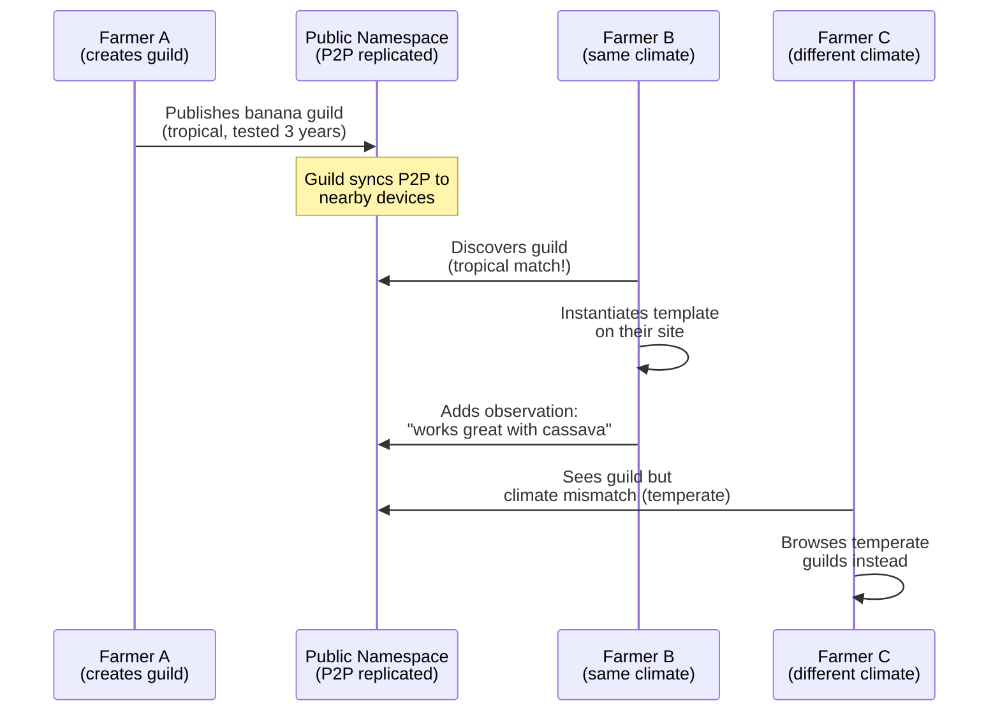

# 09: Knowledge Sharing

> Public namespaces for species and guilds, P2P sync for farmer-to-farmer knowledge transfer, confidence ratings.

**Dependencies:** Steps 01-02 (schemas + species DB), `@xnet/sync` (P2P sync), `@xnet/network` (libp2p)

## Overview

The most powerful feature of xNet for farming is knowledge sharing without centralized infrastructure. Farmers share species data, guild designs, and soil observations directly between devices — at markets, co-op meetings, or whenever briefly in range.



## Implementation

### 1. Public Namespace Manager

```typescript
// packages/farming/src/sharing/namespace.ts

export interface PublicNamespace {
  id: string // e.g., 'xnet://farming/species/'
  name: string
  description: string
  syncEnabled: boolean
  lastSync: number
  nodeCount: number
}

export const FARMING_NAMESPACES: PublicNamespace[] = [
  {
    id: 'xnet://farming/species/',
    name: 'Global Species Database',
    description: 'Community-maintained plant species with growing info, layers, and functions',
    syncEnabled: false, // opt-in
    lastSync: 0,
    nodeCount: 0
  },
  {
    id: 'xnet://farming/guilds/',
    name: 'Guild Library',
    description: 'Proven polyculture designs organized by climate zone',
    syncEnabled: false,
    lastSync: 0,
    nodeCount: 0
  },
  {
    id: 'xnet://farming/companions/',
    name: 'Companion Planting Database',
    description: 'Beneficial and antagonistic plant relationships with evidence ratings',
    syncEnabled: false,
    lastSync: 0,
    nodeCount: 0
  }
]

export class PublicNamespaceManager {
  constructor(
    private localStore: NodeStore,
    private publicStore: NodeStore, // separate store for public data
    private syncProvider: SyncProvider
  ) {}

  /** Enable sync for a namespace (opt-in) */
  async enableSync(namespaceId: string): Promise<void> {
    await this.syncProvider.joinRoom(namespaceId)
  }

  /** Publish a local node to a public namespace */
  async publish(nodeId: NodeId, namespaceId: string): Promise<void> {
    const node = await this.localStore.get(nodeId)
    if (!node) throw new Error('Node not found')

    // Strip private fields, keep botanical/structural data
    const publicData = this.sanitizeForPublic(node)
    await this.publicStore.create(node.schemaId, publicData)
  }

  /** Discover nodes in a public namespace */
  async discover(
    namespaceId: string,
    filters?: {
      climate?: string
      layer?: string
      functions?: string[]
    }
  ): Promise<NodeState[]> {
    return this.publicStore.query(this.getSchemaForNamespace(namespaceId), {
      where: filters
    })
  }

  private sanitizeForPublic(node: NodeState): Record<string, unknown> {
    const { id, ...props } = node
    // Remove any fields that might contain personal info
    delete props['notes'] // keep document body but not private notes property
    return props
  }
}
```

### 2. Confidence Rating System

```typescript
// packages/farming/src/sharing/confidence.ts

export interface ConfidenceVote {
  nodeId: NodeId // the species/companion/guild being rated
  voterDID: DID
  vote: 'confirm' | 'dispute' | 'unsure'
  evidence?: string // optional explanation
  votedAt: number
}

export const ConfidenceVoteSchema = defineSchema({
  name: 'ConfidenceVote',
  namespace: 'xnet://farming/',
  properties: {
    targetNode: relation({ schema: undefined }), // any schema
    vote: select({
      options: [
        { id: 'confirm', name: 'Confirmed (works for me too)' },
        { id: 'dispute', name: "Disputed (didn't work for me)" },
        { id: 'unsure', name: "Unsure (haven't tried)" }
      ] as const
    }),
    climate: text(), // voter's climate zone
    evidence: text(),
    photo: file()
  }
})

export interface AggregatedConfidence {
  nodeId: NodeId
  totalVotes: number
  confirms: number
  disputes: number
  score: number // 0-100
  climateBreakdown: Record<string, { confirms: number; disputes: number }>
}

export function aggregateConfidence(votes: ConfidenceVote[]): AggregatedConfidence {
  const confirms = votes.filter((v) => v.vote === 'confirm').length
  const disputes = votes.filter((v) => v.vote === 'dispute').length
  const total = confirms + disputes

  const climateBreakdown: Record<string, { confirms: number; disputes: number }> = {}
  for (const vote of votes) {
    if (!vote.climate) continue
    if (!climateBreakdown[vote.climate])
      climateBreakdown[vote.climate] = { confirms: 0, disputes: 0 }
    if (vote.vote === 'confirm') climateBreakdown[vote.climate].confirms++
    if (vote.vote === 'dispute') climateBreakdown[vote.climate].disputes++
  }

  return {
    nodeId: votes[0]?.nodeId ?? '',
    totalVotes: total,
    confirms,
    disputes,
    score: total > 0 ? Math.round((confirms / total) * 100) : 50,
    climateBreakdown
  }
}
```

### 3. Sync Optimization for Low Bandwidth

```typescript
// packages/farming/src/sharing/sync-strategy.ts

/**
 * Farming data sync needs to work on 2G connections and
 * phone-to-phone Bluetooth. Optimize for minimal payload.
 */
export interface FarmingSyncConfig {
  /** Only sync species in user's hardiness zone ± 2 */
  filterByClimateProximity: boolean
  /** Skip photo attachments during P2P sync (too large) */
  excludePhotos: boolean
  /** Batch size for low-bandwidth connections */
  batchSize: number
  /** Priority: species > guilds > companions (most useful first) */
  priorityOrder: string[]
}

export const LOW_BANDWIDTH_CONFIG: FarmingSyncConfig = {
  filterByClimateProximity: true,
  excludePhotos: true,
  batchSize: 50,
  priorityOrder: ['Species', 'Guild', 'CompanionRelation', 'ConfidenceVote']
}

export const FULL_SYNC_CONFIG: FarmingSyncConfig = {
  filterByClimateProximity: false,
  excludePhotos: false,
  batchSize: 200,
  priorityOrder: ['Species', 'Guild', 'CompanionRelation', 'ConfidenceVote']
}
```

### 4. Knowledge Sharing UI

```typescript
// packages/farming/src/views/KnowledgeHub.tsx

export function KnowledgeHub({ siteId }: { siteId: NodeId }) {
  const [tab, setTab] = useState<'discover' | 'contribute' | 'sync'>('discover')
  const namespaces = usePublicNamespaces()

  return (
    <div className="knowledge-hub">
      <Tabs value={tab} onChange={setTab}>
        <Tab value="discover">Discover</Tab>
        <Tab value="contribute">Contribute</Tab>
        <Tab value="sync">Sync Status</Tab>
      </Tabs>

      {tab === 'discover' && (
        <DiscoverPanel
          climate={siteClimate}
          onInstantiateGuild={handleInstantiateGuild}
          onImportSpecies={handleImportSpecies}
        />
      )}

      {tab === 'contribute' && (
        <ContributePanel
          siteId={siteId}
          onPublish={handlePublish}
        />
      )}

      {tab === 'sync' && (
        <SyncStatusPanel namespaces={namespaces} />
      )}
    </div>
  )
}
```

## Checklist

- [ ] Implement PublicNamespaceManager (join, publish, discover)
- [ ] Define ConfidenceVoteSchema for community ratings
- [ ] Implement confidence aggregation with climate breakdown
- [ ] Build namespace opt-in UI (choose which to sync)
- [ ] Build discover panel with climate-filtered browsing
- [ ] Build contribute panel (select nodes to publish)
- [ ] Implement low-bandwidth sync config (no photos, batched, priority-ordered)
- [ ] Build sync status panel (last sync time, node counts, peer count)
- [ ] Build confidence badge component (shows score + vote count)
- [ ] Build "Confirm/Dispute" voting UI on species/guild detail views
- [ ] Test P2P sync of public namespace nodes between two devices
- [ ] Test climate-based filtering reduces sync payload

---

[Back to README](./README.md) | [Previous: Season Calendar](./08-season-calendar.md) | [Next: Accessibility](./10-accessibility.md)
