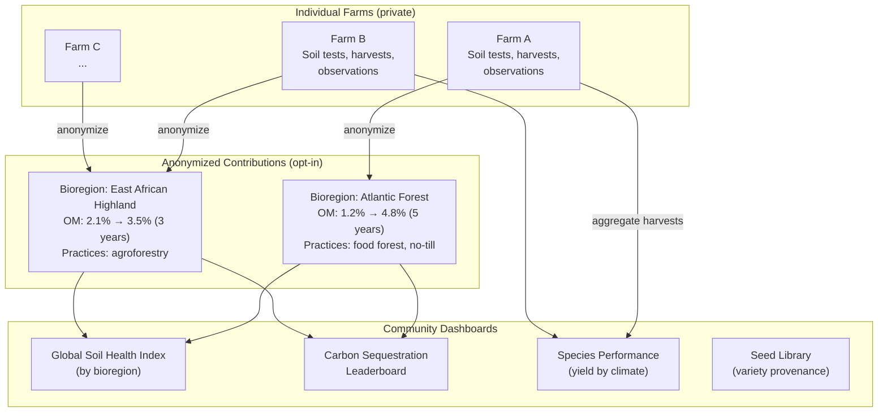

# 12: Community & Scale

> Global Soil Health Index, carbon sequestration dashboards, seed library management, and bioregion aggregation.

**Dependencies:** Steps 04 (soil), 06 (harvest), 09 (knowledge sharing)

## Overview

As more farmers use xNet, aggregated anonymized data becomes enormously valuable — a living map of soil health, a global species performance database, and carbon sequestration tracking. This step builds the community-scale features that emerge from many individual farms contributing data.



## Implementation

### 1. Anonymized Soil Contribution

```typescript
// packages/farming/src/community/soil-contribution.ts

export interface AnonymizedSoilContribution {
  // Location stripped to bioregion level (no GPS)
  bioregion: string
  climate: string
  elevation: 'low' | 'mid' | 'high' // coarse only

  // Soil data
  yearsRegenerating: number
  organicMatterStart: number // % at first test
  organicMatterCurrent: number // % at latest test
  carbonDelta: number // tonnes/ha change
  phRange: [number, number] // min, max over time

  // Practices (what worked)
  practices: string[] // e.g., ['food_forest', 'chop_and_drop', 'no_till']
  primarySpecies: string[] // scientific names of main plantings

  // Metadata
  contributorDID: DID // for deduplication, not display
  contributedAt: number
  testCount: number // how many tests inform this
}

export const SoilContributionSchema = defineSchema({
  name: 'SoilContribution',
  namespace: 'xnet://farming/soil-index/',
  properties: {
    bioregion: text({ required: true }),
    climate: text({ required: true }),
    elevation: select({
      options: [
        { id: 'low', name: 'Low (<500m)' },
        { id: 'mid', name: 'Mid (500-1500m)' },
        { id: 'high', name: 'High (>1500m)' }
      ] as const
    }),
    yearsRegenerating: number(),
    organicMatterStart: number(),
    organicMatterCurrent: number(),
    carbonDelta: number(),
    practices: multiSelect({
      options: [
        { id: 'food_forest', name: 'Food Forest' },
        { id: 'agroforestry', name: 'Agroforestry' },
        { id: 'no_till', name: 'No-Till' },
        { id: 'cover_crop', name: 'Cover Cropping' },
        { id: 'chop_and_drop', name: 'Chop & Drop Mulch' },
        { id: 'composting', name: 'Composting' },
        { id: 'biochar', name: 'Biochar' },
        { id: 'keyline', name: 'Keyline Design' },
        { id: 'holistic_grazing', name: 'Holistic Grazing' },
        { id: 'silvopasture', name: 'Silvopasture' }
      ] as const
    }),
    testCount: number()
  }
})

/**
 * Generate an anonymized contribution from a site's soil test history.
 * Strips GPS, uses bioregion lookup, and only includes aggregate trends.
 */
export async function generateContribution(
  siteId: NodeId,
  store: NodeStore
): Promise<AnonymizedSoilContribution | null> {
  const site = await store.get(siteId)
  const tests = await store.query(SoilTestSchema, {
    where: { siteId },
    sort: [{ field: 'testDate', direction: 'asc' }]
  })

  if (tests.length < 2) return null // need at least 2 tests for trends

  const first = tests[0]
  const latest = tests[tests.length - 1]

  if (!first.organicMatter || !latest.organicMatter) return null

  const bioregion = lookupBioregion(site.location) // GPS → bioregion name
  const years = (latest.testDate - first.testDate) / (365.25 * 24 * 60 * 60 * 1000)

  return {
    bioregion,
    climate: site.climate ?? 'unknown',
    elevation: categorizeElevation(site.elevation),
    yearsRegenerating: Math.round(years),
    organicMatterStart: first.organicMatter,
    organicMatterCurrent: latest.organicMatter,
    carbonDelta: calculateCarbonDelta(first, latest, site.area ?? 1),
    phRange: [Math.min(...tests.map((t) => t.ph ?? 7)), Math.max(...tests.map((t) => t.ph ?? 7))],
    practices: inferPractices(site, store),
    primarySpecies: await getTopSpecies(siteId, store),
    contributorDID: store.authorDID,
    contributedAt: Date.now(),
    testCount: tests.length
  }
}
```

### 2. Bioregion Dashboard

```typescript
// packages/farming/src/views/BioregionDashboard.tsx

export function BioregionDashboard({ bioregion }: { bioregion?: string }) {
  const contributions = usePublicQuery(SoilContributionSchema, {
    where: bioregion ? { bioregion } : undefined
  })

  const aggregated = useMemo(() => aggregateContributions(contributions), [contributions])

  return (
    <div className="bioregion-dashboard">
      <h2>{bioregion ?? 'Global'} Soil Health</h2>

      <div className="dashboard-stats">
        <StatCard label="Contributing Farms" value={aggregated.farmCount} />
        <StatCard label="Avg OM Improvement" value={`${aggregated.avgOMDelta.toFixed(1)}%`} />
        <StatCard label="Total Carbon Sequestered" value={`${aggregated.totalCarbon.toFixed(0)} tonnes`} />
        <StatCard label="Avg Years Regenerating" value={aggregated.avgYears.toFixed(1)} />
      </div>

      <div className="practices-chart">
        <h3>Most Effective Practices</h3>
        <PracticeEffectivenessChart data={aggregated.practicesByOMGain} />
      </div>

      <div className="progress-over-time">
        <h3>OM% Improvement by Years Regenerating</h3>
        <ScatterPlot
          data={contributions.map(c => ({
            x: c.yearsRegenerating,
            y: c.organicMatterCurrent - c.organicMatterStart
          }))}
          xLabel="Years"
          yLabel="OM% Gained"
        />
      </div>

      <BioregionMap
        contributions={contributions}
        selectedBioregion={bioregion}
        onSelectBioregion={setBioregion}
      />
    </div>
  )
}
```

### 3. Seed Library

```typescript
// packages/farming/src/community/seed-library.ts

export const SeedVarietySchema = defineSchema({
  name: 'SeedVariety',
  namespace: 'xnet://farming/',
  document: 'yjs', // growing notes, flavor descriptions
  properties: {
    species: relation({ schema: SpeciesSchema }),
    varietyName: text({ required: true }),
    provenance: text(), // where this variety originated
    yearsSaved: number(), // how many generations seed-saved
    adaptedTo: text(), // climate/soil it's adapted to
    traits: multiSelect({
      options: [
        { id: 'drought_tolerant', name: 'Drought Tolerant' },
        { id: 'cold_hardy', name: 'Cold Hardy' },
        { id: 'disease_resistant', name: 'Disease Resistant' },
        { id: 'early_maturing', name: 'Early Maturing' },
        { id: 'high_yield', name: 'High Yield' },
        { id: 'good_flavor', name: 'Good Flavor' },
        { id: 'long_storage', name: 'Long Storage' },
        { id: 'open_pollinated', name: 'Open Pollinated' },
        { id: 'heirloom', name: 'Heirloom' }
      ] as const
    }),
    daysToMaturity: number(),
    seedSaveMethod: select({
      options: [
        { id: 'dry', name: 'Dry Processing' },
        { id: 'wet', name: 'Wet/Ferment Processing' },
        { id: 'thresh', name: 'Thresh & Winnow' },
        { id: 'pod', name: 'Dry in Pod/Head' }
      ] as const
    }),
    photo: file()
  }
})

export const SeedSwapSchema = defineSchema({
  name: 'SeedSwap',
  namespace: 'xnet://farming/',
  properties: {
    variety: relation({ schema: SeedVarietySchema }),
    fromFarmer: text(), // DID or name
    toFarmer: text(),
    quantity: text(), // "50 seeds", "1 packet"
    swapDate: date({ required: true }),
    location: text(), // "Saturday market", "PDC workshop"
    notes: text()
  }
})
```

### 4. Carbon Leaderboard

```typescript
// packages/farming/src/views/CarbonLeaderboard.tsx

export function CarbonLeaderboard() {
  const contributions = usePublicQuery(SoilContributionSchema)

  const ranked = useMemo(() =>
    contributions
      .filter(c => c.carbonDelta > 0)
      .sort((a, b) => b.carbonDelta - a.carbonDelta)
      .slice(0, 50),
    [contributions]
  )

  const totalSequestered = contributions.reduce((s, c) => s + Math.max(0, c.carbonDelta), 0)

  return (
    <div className="carbon-leaderboard">
      <div className="carbon-total">
        <h2>Community Carbon Sequestration</h2>
        <div className="big-number">{totalSequestered.toFixed(0)}</div>
        <div className="unit">tonnes CO₂e sequestered</div>
      </div>

      <div className="leaderboard-list">
        {ranked.map((c, i) => (
          <div key={i} className="leaderboard-entry">
            <span className="rank">#{i + 1}</span>
            <span className="bioregion">{c.bioregion}</span>
            <span className="delta">+{c.carbonDelta.toFixed(1)} t/ha</span>
            <span className="years">{c.yearsRegenerating} years</span>
            <span className="practices">{c.practices.join(', ')}</span>
          </div>
        ))}
      </div>
    </div>
  )
}
```

### 5. Species Performance Aggregation

```typescript
// packages/farming/src/community/species-performance.ts

export interface SpeciesPerformance {
  speciesId: NodeId
  scientificName: string
  commonName: string
  climate: string
  farmCount: number // how many farms growing this
  avgYieldPerPlant: number // kg/plant/year
  avgDaysToFirstHarvest: number
  successRate: number // % of plantings that reached 'producing'
  bestCompanions: string[] // species often grown together successfully
}

/**
 * Aggregate yield data across farms (from public harvest contributions)
 * to show which species perform best in each climate.
 */
export async function getSpeciesPerformance(
  climate: string,
  store: NodeStore
): Promise<SpeciesPerformance[]> {
  // Query public harvest/planting data
  // Aggregate by species + climate
  // Calculate success rates and avg yields
  // Return sorted by success rate
}
```

## Checklist

- [ ] Implement anonymized soil contribution generator (GPS → bioregion)
- [ ] Define SoilContributionSchema for public namespace
- [ ] Build "Contribute" button with privacy preview (show what's shared)
- [ ] Implement bioregion lookup from GPS coordinates
- [ ] Build BioregionDashboard (stats, practice effectiveness, scatter plot)
- [ ] Define SeedVarietySchema and SeedSwapSchema
- [ ] Build seed library UI (browse varieties, log swaps)
- [ ] Build Carbon Leaderboard (community total + ranked list)
- [ ] Implement species performance aggregation
- [ ] Build species performance view (best species for my climate)
- [ ] Build practice effectiveness chart (which practices improve OM fastest)
- [ ] Privacy: ensure no individual farm is identifiable from contributions
- [ ] Write tests for anonymization (GPS stripping, bioregion mapping)
- [ ] Write tests for aggregation calculations

---

[Back to README](./README.md) | [Previous: AI Integrations](./11-ai-integrations.md)
