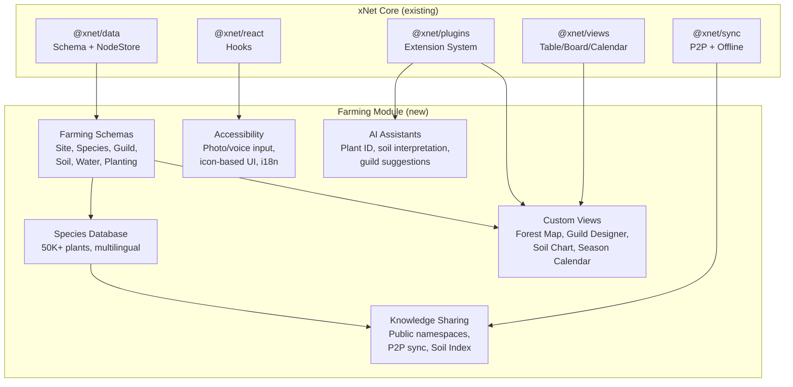
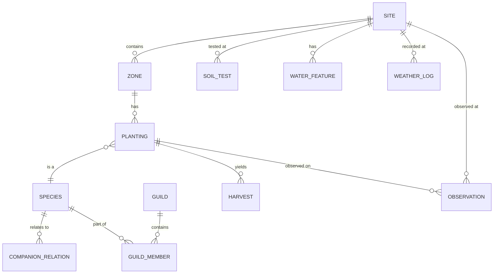

# xNet Implementation Plan - Step 04: Global Farming ERP

> A decentralized, offline-first ERP for food forests, permaculture, and soil regeneration — accessible to every farmer on Earth.

## Executive Summary

xNet becomes the data backbone for regenerative agriculture. Farmers own their data, share knowledge P2P without internet, and collectively build a global plant database and soil health index. The system works from a subsistence farmer's phone at a market to a research station aggregating regional data.

```typescript
// What this plan builds:
const site = await create(SiteSchema, {
  name: 'Sitio Esperança',
  climate: 'subtropical',
  area: 2.5, // hectares
  hardinessZone: '10b'
})

const guild = await create(GuildSchema, {
  name: 'Banana-Cacao Understory',
  centralSpecies: bananaId,
  climate: 'tropical'
})

// Syncs to other farmers at market — no internet needed
// Contributes anonymized soil data to global health index
// Species database grows through community P2P contributions
```

## Architecture Overview



## Architecture Decisions

| Decision          | Choice                                  | Rationale                                                          |
| ----------------- | --------------------------------------- | ------------------------------------------------------------------ |
| Module packaging  | Plugin (Layer 2 Extension)              | Ships independently, hot-reloads, uses existing plugin infra       |
| Schema namespace  | `xnet://farming/`                       | Globally unique, discoverable, aligns with public namespace vision |
| Species IDs       | Internal + World Flora Online cross-ref | No dependency on external service availability                     |
| Soil data sharing | Opt-in, anonymized to bioregion         | Privacy-preserving but globally useful                             |
| Photo storage     | Local + optional pinning                | Photos don't P2P sync by default (too large), available on-device  |
| Multilingual      | Property-level lang suffixes            | `commonName:sw`, `commonName:hi` — no schema changes needed        |
| Offline-first     | Full functionality without network      | Core requirement — farmers work in fields                          |
| AI integration    | MCP tools (optional)                    | Works without AI; AI enhances when available                       |

## Implementation Phases

### Phase 1: Foundation (Steps 01-02)

Core schemas and the species database seed.

| Task | Document                                           | Description                                                                               | Est. Time |
| ---- | -------------------------------------------------- | ----------------------------------------------------------------------------------------- | --------- |
| 1.1  | [01-farming-schemas.md](./01-farming-schemas.md)   | All core schemas: Site, Zone, Species, Guild, Soil, Water, Planting, Harvest, Observation | 2 weeks   |
| 1.2  | [02-species-database.md](./02-species-database.md) | Species DB seed from PFAF/USDA, import pipeline, community contributions                  | 2 weeks   |

**Validation Gate:**

- [ ] All schemas register and create/query nodes correctly
- [ ] Species database seeded with 5,000+ species (name, layer, functions, hardiness)
- [ ] Companion planting relations queryable by species pair
- [ ] Existing Table/Board/Calendar views work with farming schemas

### Phase 2: Polycultures & Soil (Steps 03-05)

Guild design and soil/water tracking systems.

| Task | Document                                           | Description                                                        | Est. Time |
| ---- | -------------------------------------------------- | ------------------------------------------------------------------ | --------- |
| 2.1  | [03-guild-designer.md](./03-guild-designer.md)     | Guild composition UI, functional role assignment, template library | 3 weeks   |
| 2.2  | [04-soil-health.md](./04-soil-health.md)           | Soil test entry, trend charts, carbon tracking, interpretation     | 2 weeks   |
| 2.3  | [05-water-management.md](./05-water-management.md) | Water feature tracking, rainfall logs, irrigation scheduling       | 2 weeks   |

**Validation Gate:**

- [ ] Guild Designer composes species into functional roles with visual feedback
- [ ] Soil health charts show trends over multiple tests (pH, OM, carbon)
- [ ] Water features display on site overview with capacity/flow data
- [ ] Carbon sequestration estimates calculated from soil test deltas

### Phase 3: Lifecycle & Views (Steps 06-08)

Planting lifecycle and custom spatial/temporal views.

| Task | Document                                           | Description                                               | Est. Time |
| ---- | -------------------------------------------------- | --------------------------------------------------------- | --------- |
| 3.1  | [06-planting-harvest.md](./06-planting-harvest.md) | Planting lifecycle, harvest logging, yield analytics      | 2 weeks   |
| 3.2  | [07-forest-map-view.md](./07-forest-map-view.md)   | Spatial view: drag plants by layer, zone visualization    | 4 weeks   |
| 3.3  | [08-season-calendar.md](./08-season-calendar.md)   | Planting windows by species + climate, phenology tracking | 2 weeks   |

**Validation Gate:**

- [ ] Planting status transitions (germinating → producing → dormant) tracked over time
- [ ] Harvest totals aggregate by species, season, zone
- [ ] Forest Map shows all 8 layers with spatial placement
- [ ] Season Calendar displays planting/harvest windows for user's climate zone
- [ ] Drag-and-drop species placement in Forest Map persists correctly

### Phase 4: Knowledge Sharing (Step 09)

P2P sync of community knowledge.

| Task | Document                                             | Description                                                   | Est. Time |
| ---- | ---------------------------------------------------- | ------------------------------------------------------------- | --------- |
| 4.1  | [09-knowledge-sharing.md](./09-knowledge-sharing.md) | Public namespaces, P2P species/guild sync, confidence ratings | 3 weeks   |

**Validation Gate:**

- [ ] Public species namespace syncs between devices (phone-to-phone, no internet)
- [ ] Guild templates discoverable by climate zone
- [ ] Companion planting confidence ratings aggregate across contributors
- [ ] Delta compression keeps sync payload small for low-bandwidth

### Phase 5: Accessibility (Step 10)

Making it usable for every farmer globally.

| Task | Document                                     | Description                                                                    | Est. Time |
| ---- | -------------------------------------------- | ------------------------------------------------------------------------------ | --------- |
| 5.1  | [10-accessibility.md](./10-accessibility.md) | Multilingual schemas, icon-based UI, voice/photo input, progressive complexity | 3 weeks   |

**Validation Gate:**

- [ ] UI navigable with icons only (no text required for basic operations)
- [ ] Species names display in user's language (fallback to scientific name)
- [ ] Photo capture workflow: take photo → attach to observation/planting
- [ ] Voice note recording attached to observations
- [ ] Progressive disclosure: beginner mode hides advanced fields

### Phase 6: AI & Community (Steps 11-12)

AI assistance and community-scale features.

| Task | Document                                         | Description                                                                   | Est. Time |
| ---- | ------------------------------------------------ | ----------------------------------------------------------------------------- | --------- |
| 6.1  | [11-ai-integrations.md](./11-ai-integrations.md) | Plant/pest ID from photo, soil interpretation, guild suggestions (MCP)        | 3 weeks   |
| 6.2  | [12-community-scale.md](./12-community-scale.md) | Global Soil Health Index, carbon tracking, seed library, bioregion dashboards | 3 weeks   |

**Validation Gate:**

- [ ] Photo → plant ID returns top-3 species matches with confidence
- [ ] Soil test interpretation explains results in plain language
- [ ] Guild suggestions consider user's climate, existing plantings, and goals
- [ ] Anonymized soil contributions visible on bioregion aggregate view
- [ ] Seed library tracks varieties, provenance, and swap events
- [ ] Carbon sequestration dashboard shows site-level and regional trends

## Data Model



## Platform Considerations

| Feature            | Web/PWA        | Electron              | Mobile (Expo)         |
| ------------------ | -------------- | --------------------- | --------------------- |
| All schemas + CRUD | Full           | Full                  | Full                  |
| Species database   | Full           | Full                  | Full (local)          |
| Guild Designer     | Full           | Full                  | Simplified            |
| Forest Map View    | Full           | Full                  | View-only             |
| Season Calendar    | Full           | Full                  | Full                  |
| Soil Charts        | Full           | Full                  | Simplified            |
| P2P sync           | WebRTC         | WebRTC + local        | Bluetooth/WiFi Direct |
| Photo capture      | File picker    | File picker           | Native camera         |
| Voice notes        | MediaRecorder  | MediaRecorder         | Expo Audio            |
| AI (plant ID)      | MCP (online)   | MCP (local or online) | MCP (online)          |
| Offline            | Service Worker | Full                  | Full                  |

## Dependencies

| Dependency                    | Purpose                               | New?                    |
| ----------------------------- | ------------------------------------- | ----------------------- |
| `@xnet/data`                  | Schema registration, NodeStore        | Existing                |
| `@xnet/sync`                  | P2P sync, public namespaces           | Existing                |
| `@xnet/views`                 | Table/Board/Calendar base views       | Existing                |
| `@xnet/plugins`               | Module registration, extension points | Existing (planStep03_5) |
| `@xnet/react`                 | Hooks for all UI                      | Existing                |
| `@xnet/editor`                | Rich text notes on species/sites      | Existing                |
| Chart library (recharts/visx) | Soil trend charts, yield graphs       | New (peer dep)          |
| Spatial layout library        | Forest Map drag-drop                  | New (peer dep)          |

## Success Criteria

1. A farmer with no internet can log plantings, harvests, and soil tests on their phone
2. Two farmers can sync species/guild data phone-to-phone at a market
3. A beginner can navigate the app with icons and photos (no text literacy required)
4. Species database contains 5,000+ species with multilingual names
5. Soil health trends visible over 3+ tests with carbon sequestration estimates
6. Guild Designer produces valid polyculture designs for any climate zone
7. Forest Map shows all 8 layers with spatial relationships
8. Season Calendar adapts to user's hardiness zone automatically
9. AI plant ID works from a single photo with >80% top-3 accuracy
10. Global Soil Health Index aggregates 100+ anonymized contributions by bioregion

## Reference Documents

- [Regenerative Farming Exploration](../explorations/REGENERATIVE_FARMING_ERP.md) — Full research and design exploration
- [Plugin Architecture](../planStep03_5Plugins/README.md) — How this module integrates
- [ERP Framework](../planStep03ERP/README.md) — General ERP module system
- [Data Model](../planStep02_1DataModelConsolidation/README.md) — Schema-first architecture
- [Vision](../VISION.md) — Micro-to-macro data sovereignty

---

[Back to docs/](../) | [Start Implementation](./01-farming-schemas.md)
