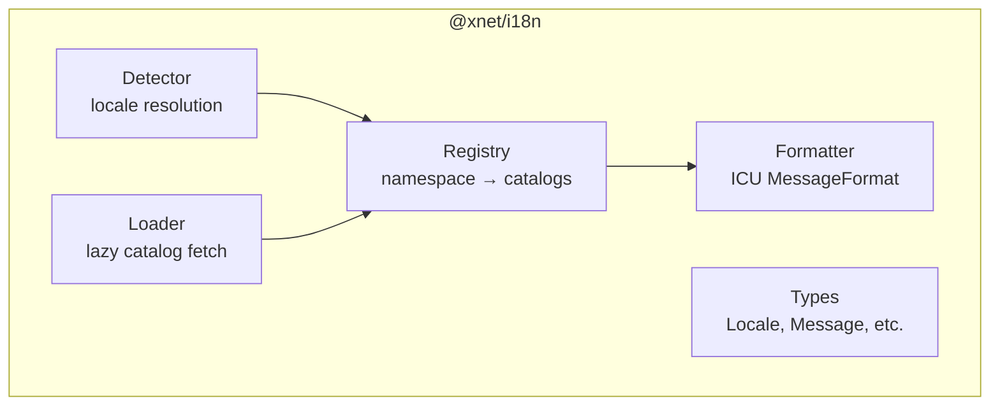
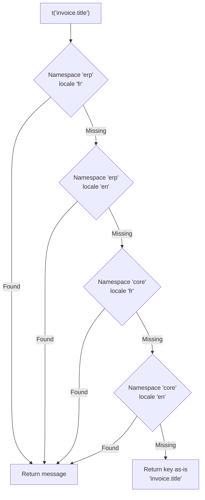

# 01: @xnet/i18n Package

> Core i18n infrastructure: registry, formatter, locale detection, catalog loading

**Duration:** 2-3 days  
**Dependencies:** `@xnet/core`

## Overview

The `@xnet/i18n` package provides the platform-agnostic i18n runtime. It manages namespace registries, formats ICU messages, detects locales, and lazily loads translation catalogs.



## Package Structure

```
packages/i18n/
  src/
    index.ts              # Public API exports
    registry.ts           # Namespace registry
    formatter.ts          # ICU MessageFormat formatting
    detector.ts           # Locale detection strategies
    loader.ts             # Catalog loading (sync/async)
    types.ts              # Core types
  locales/
    en.json               # English (source locale)
    fr.json
    de.json
    es.json
    ja.json
    zh-CN.json
    pt.json
    ko.json
    it.json
    ru.json
  package.json
  tsconfig.json
  vitest.config.ts
```

## Core Types

```typescript
// types.ts

/** BCP 47 locale tag */
export type Locale = string // e.g., 'en', 'fr-FR', 'zh-CN'

/** ICU MessageFormat string */
export type ICUMessage = string

/** A flat catalog of key → ICU message */
export type MessageCatalog = Record<string, ICUMessage>

/** Namespace identifier */
export type Namespace = string

/** Interpolation values for ICU formatting */
export type MessageValues = Record<string, string | number | boolean | Date>

/** Locale resolution priority */
export interface LocaleResolution {
  /** User's explicit preference (synced across devices) */
  userPreference?: Locale
  /** Device-local override */
  deviceOverride?: Locale
  /** Browser/OS detected locale */
  systemLocale: Locale
  /** Fallback if nothing else matches */
  defaultLocale: Locale
}
```

## Namespace Registry

```typescript
// registry.ts

export interface I18nRegistryOptions {
  /** Default/fallback locale (usually 'en') */
  defaultLocale: Locale
  /** Currently active locale */
  locale: Locale
  /** Called when locale changes */
  onLocaleChange?: (locale: Locale) => void
}

export class I18nRegistry {
  private namespaces = new Map<Namespace, Map<Locale, MessageCatalog>>()
  private locale: Locale
  private defaultLocale: Locale

  constructor(options: I18nRegistryOptions) {
    /* ... */
  }

  /** Register a catalog for a namespace + locale */
  register(namespace: Namespace, locale: Locale, catalog: MessageCatalog): void

  /** Unregister a namespace (e.g., when plugin unloads) */
  unregister(namespace: Namespace): void

  /** Get available locales for a namespace */
  getLocales(namespace: Namespace): Locale[]

  /** Get all registered namespaces */
  getNamespaces(): Namespace[]

  /** Resolve a message key with fallback chain */
  resolve(namespace: Namespace, key: string): ICUMessage | null
  // Fallback: locale → defaultLocale → 'core' namespace → null

  /** Change active locale */
  setLocale(locale: Locale): void

  /** Get active locale */
  getLocale(): Locale
}
```

### Fallback Chain



## ICU Formatter

Uses the `intl-messageformat` package (FormatJS) for parsing and formatting ICU messages. This is the lightweight standalone formatter (~4 KB gzip), not the full react-intl.

```typescript
// formatter.ts
import IntlMessageFormat from 'intl-messageformat'

export class I18nFormatter {
  private cache = new Map<string, IntlMessageFormat>()

  /** Format an ICU message with interpolation values */
  format(message: ICUMessage, locale: Locale, values?: MessageValues): string {
    const cacheKey = `${locale}:${message}`
    let fmt = this.cache.get(cacheKey)
    if (!fmt) {
      fmt = new IntlMessageFormat(message, locale)
      this.cache.set(cacheKey, fmt)
    }
    return fmt.format(values) as string
  }

  /** Clear the format cache (e.g., on locale change) */
  clearCache(): void {
    this.cache.clear()
  }
}
```

### ICU Message Examples

```json
{
  "greeting": "Hello, {name}!",
  "items.count": "{count, plural, one {# item} other {# items}}",
  "order.status": "{status, select, pending {Pending} shipped {Shipped} delivered {Delivered} other {Unknown}}",
  "last.updated": "Updated {date, date, medium} at {date, time, short}",
  "file.size": "{size, number, ::compact-short} bytes"
}
```

## Locale Detection

```typescript
// detector.ts

export interface DetectorOptions {
  /** Check user preference from storage */
  getUserPreference?: () => Locale | null
  /** Check device-local override */
  getDeviceOverride?: () => Locale | null
  /** Supported locales (will pick closest match) */
  supportedLocales: Locale[]
  /** Default fallback */
  defaultLocale: Locale
}

export class LocaleDetector {
  constructor(private options: DetectorOptions) {}

  /** Detect the best locale using priority chain */
  detect(): Locale {
    // 1. Device-local override (highest priority)
    const deviceOverride = this.options.getDeviceOverride?.()
    if (deviceOverride && this.isSupported(deviceOverride)) return deviceOverride

    // 2. User's synced preference
    const userPref = this.options.getUserPreference?.()
    if (userPref && this.isSupported(userPref)) return userPref

    // 3. System/browser locale
    const systemLocale = this.getSystemLocale()
    if (systemLocale && this.isSupported(systemLocale)) return systemLocale

    // 4. Best match from system locale list
    const bestMatch = this.findBestMatch()
    if (bestMatch) return bestMatch

    // 5. Default
    return this.options.defaultLocale
  }

  private getSystemLocale(): Locale | null {
    if (typeof navigator !== 'undefined') return navigator.language
    if (typeof process !== 'undefined') return process.env.LANG?.split('.')[0] ?? null
    return null
  }

  private isSupported(locale: Locale): boolean {
    return (
      this.options.supportedLocales.includes(locale) ||
      this.options.supportedLocales.includes(locale.split('-')[0])
    )
  }

  private findBestMatch(): Locale | null {
    // Use Intl.LocaleMatcher-style matching (language → region → script)
    if (typeof navigator === 'undefined') return null
    for (const navLocale of navigator.languages) {
      const lang = navLocale.split('-')[0]
      const match = this.options.supportedLocales.find((s) => s === navLocale || s === lang)
      if (match) return match
    }
    return null
  }
}
```

## Catalog Loader

```typescript
// loader.ts

export type CatalogFetcher = (namespace: Namespace, locale: Locale) => Promise<MessageCatalog>

export class CatalogLoader {
  private loaded = new Set<string>()
  private loading = new Map<string, Promise<MessageCatalog>>()

  constructor(
    private registry: I18nRegistry,
    private fetcher: CatalogFetcher
  ) {}

  /** Load a catalog for a namespace + locale (deduped) */
  async load(namespace: Namespace, locale: Locale): Promise<void> {
    const key = `${namespace}:${locale}`
    if (this.loaded.has(key)) return

    if (!this.loading.has(key)) {
      const promise = this.fetcher(namespace, locale).then((catalog) => {
        this.registry.register(namespace, locale, catalog)
        this.loaded.add(key)
        this.loading.delete(key)
        return catalog
      })
      this.loading.set(key, promise)
    }

    await this.loading.get(key)
  }

  /** Preload catalogs for multiple namespaces */
  async preload(namespaces: Namespace[], locale: Locale): Promise<void> {
    await Promise.all(namespaces.map((ns) => this.load(ns, locale)))
  }

  /** Check if a catalog is loaded */
  isLoaded(namespace: Namespace, locale: Locale): boolean {
    return this.loaded.has(`${namespace}:${locale}`)
  }
}
```

## Public API

```typescript
// index.ts

export { I18nRegistry, type I18nRegistryOptions } from './registry'
export { I18nFormatter } from './formatter'
export { LocaleDetector, type DetectorOptions } from './detector'
export { CatalogLoader, type CatalogFetcher } from './loader'
export type {
  Locale,
  ICUMessage,
  MessageCatalog,
  Namespace,
  MessageValues,
  LocaleResolution
} from './types'

/** Convenience: create a fully-configured i18n instance */
export function createI18n(options: {
  defaultLocale: Locale
  supportedLocales: Locale[]
  catalogs?: Record<Namespace, Record<Locale, MessageCatalog>>
}) {
  const registry = new I18nRegistry({
    defaultLocale: options.defaultLocale,
    locale: options.defaultLocale
  })
  const formatter = new I18nFormatter()

  // Pre-register any provided catalogs
  if (options.catalogs) {
    for (const [ns, locales] of Object.entries(options.catalogs)) {
      for (const [locale, catalog] of Object.entries(locales)) {
        registry.register(ns, locale, catalog)
      }
    }
  }

  return { registry, formatter }
}
```

## Tests

```typescript
describe('I18nRegistry', () => {
  it('should resolve message from registered catalog')
  it('should fall back to default locale when message missing')
  it('should fall back to core namespace when plugin key missing')
  it('should return key as-is when no message found anywhere')
  it('should update resolved messages when locale changes')
  it('should support unregistering namespaces')
})

describe('I18nFormatter', () => {
  it('should format simple interpolation: {name}')
  it('should format plurals: {count, plural, ...}')
  it('should format select: {status, select, ...}')
  it('should format dates: {date, date, medium}')
  it('should format numbers: {size, number}')
  it('should cache parsed messages for performance')
})

describe('LocaleDetector', () => {
  it('should prefer device override over user preference')
  it('should prefer user preference over system locale')
  it('should find best match from navigator.languages')
  it('should fall back to default locale')
  it('should match base language when exact locale unavailable')
})

describe('CatalogLoader', () => {
  it('should load catalog and register with registry')
  it('should deduplicate concurrent loads')
  it('should not reload already-loaded catalogs')
  it('should preload multiple namespaces in parallel')
})
```

## Dependencies

```json
{
  "dependencies": {
    "@xnet/core": "workspace:*",
    "intl-messageformat": "^10.7.0"
  }
}
```

## Acceptance Criteria

- [ ] Registry resolves messages with full fallback chain
- [ ] Formatter handles all ICU MessageFormat types (plural, select, date, number)
- [ ] Detector works in browser, Electron, and Node environments
- [ ] Loader deduplicates and caches catalog fetches
- [ ] All tests pass with >90% coverage
- [ ] Package size < 8 KB gzip (excluding catalogs)
