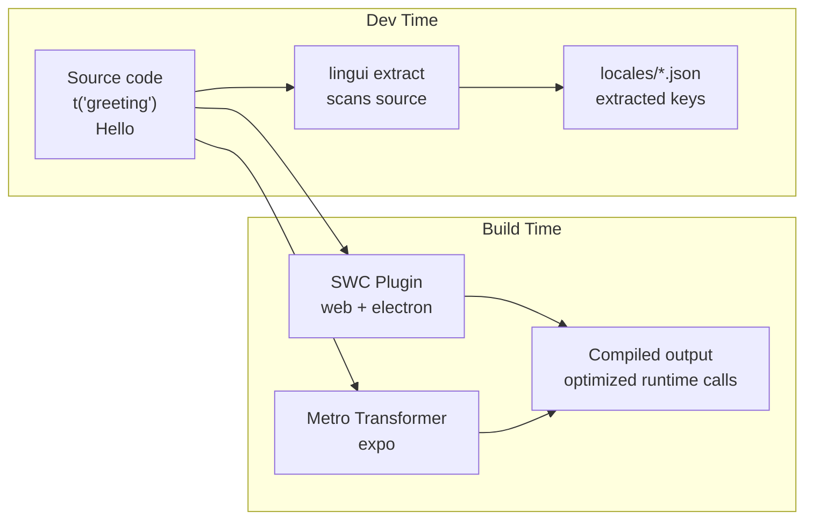
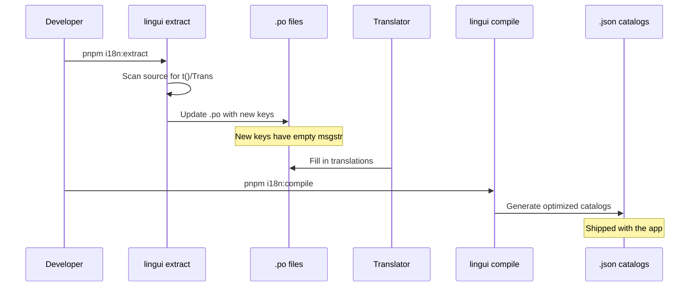

# 02: Lingui Compiler Setup

> Configure Lingui's compile-time macros, catalog extraction, and per-platform build integration

**Duration:** 1-2 days  
**Dependencies:** Step 01 (`@xnet/i18n`)

## Overview

Lingui provides compile-time transformation of `<Trans>` and `t` macros into optimized runtime calls. This step sets up the Lingui toolchain for all three platforms.



## Lingui Configuration

```typescript
// lingui.config.ts (monorepo root)
import type { LinguiConfig } from '@lingui/conf'

const config: LinguiConfig = {
  locales: ['en', 'fr', 'de', 'es', 'ja', 'zh-CN', 'pt', 'ko', 'it', 'ru'],
  sourceLocale: 'en',
  catalogs: [
    {
      // Core app strings
      path: 'packages/i18n/locales/{locale}',
      include: [
        'apps/web/src/**',
        'apps/electron/src/**',
        'packages/react/src/**',
        'packages/ui/src/**'
      ]
    },
    {
      // Editor strings
      path: 'packages/editor/locales/{locale}',
      include: ['packages/editor/src/**']
    },
    {
      // Views strings
      path: 'packages/views/locales/{locale}',
      include: ['packages/views/src/**']
    }
  ],
  format: 'po', // Use PO for translator tooling
  compileNamespace: 'es', // ESM output
  orderBy: 'messageId'
}

export default config
```

## Platform-Specific Build Setup

### Web + Electron (SWC Plugin)

```typescript
// vite.config.ts (apps/web)
import { defineConfig } from 'vite'
import react from '@vitejs/plugin-react-swc'
import { linguiPlugin } from '@lingui/swc-plugin'

export default defineConfig({
  plugins: [
    react({
      plugins: [['@lingui/swc-plugin', {}]]
    })
  ]
})
```

### Mobile (Expo / Metro)

```javascript
// metro.config.js (apps/expo)
const { getDefaultConfig } = require('expo/metro-config')

const config = getDefaultConfig(__dirname)

config.transformer = {
  ...config.transformer,
  babelTransformerPath: require.resolve('@lingui/metro-transformer/babel')
}

module.exports = config
```

## Catalog Format

Lingui catalogs use PO format for translator tooling compatibility, compiled to JSON for runtime:

```po
# packages/i18n/locales/fr.po
msgid "Save"
msgstr "Enregistrer"

msgid "Cancel"
msgstr "Annuler"

msgid "{count, plural, one {# item} other {# items}}"
msgstr "{count, plural, one {# élément} other {# éléments}}"
```

Compiled to optimized JSON:

```json
// packages/i18n/locales/fr.json (compiled)
{
  "Save": "Enregistrer",
  "Cancel": "Annuler",
  "{count, plural, one {# item} other {# items}}": "{count, plural, one {# élément} other {# éléments}}"
}
```

## Scripts

```json
// package.json (root)
{
  "scripts": {
    "i18n:extract": "lingui extract",
    "i18n:compile": "lingui compile",
    "i18n:check": "lingui extract --clean && lingui compile --strict"
  }
}
```

### Extraction Workflow



## Macro Usage

```tsx
// Using the t macro (returns string)
import { t } from '@lingui/core/macro'

const label = t`Save changes`
const greeting = t`Hello, ${name}!`
const count = t`${items.length} items selected`

// Using the Trans component (returns JSX, supports rich text)
import { Trans } from '@lingui/react/macro'

function Banner() {
  return (
    <p>
      <Trans>
        Welcome to <strong>xNet</strong>. You have {count} unread messages.
      </Trans>
    </p>
  )
}

// Plural
import { Plural } from '@lingui/react/macro'

function ItemCount({ count }: { count: number }) {
  return <Plural value={count} one="# item" other="# items" />
}
```

## Dependencies to Install

```bash
# Core
pnpm add -w @lingui/core @lingui/react

# Dev tooling
pnpm add -wD @lingui/cli @lingui/conf @lingui/swc-plugin

# Expo
pnpm add --filter @xnet/expo @lingui/metro-transformer
```

## CI Integration

Add to CI pipeline to catch missing translations:

```yaml
# .github/workflows/i18n.yml
- name: Check i18n
  run: |
    pnpm i18n:extract --clean
    pnpm i18n:compile --strict
    git diff --exit-code packages/*/locales/
```

The `--strict` flag fails if any locale has missing translations. The `git diff` catches uncommitted extraction changes.

## Acceptance Criteria

- [ ] `lingui extract` finds all `t`/`Trans` usage across apps and packages
- [ ] `lingui compile` produces optimized JSON catalogs
- [ ] SWC plugin transforms macros in web/electron builds
- [ ] Metro transformer works for Expo builds
- [ ] CI catches missing translations
- [ ] English (source) catalog has all extracted keys
