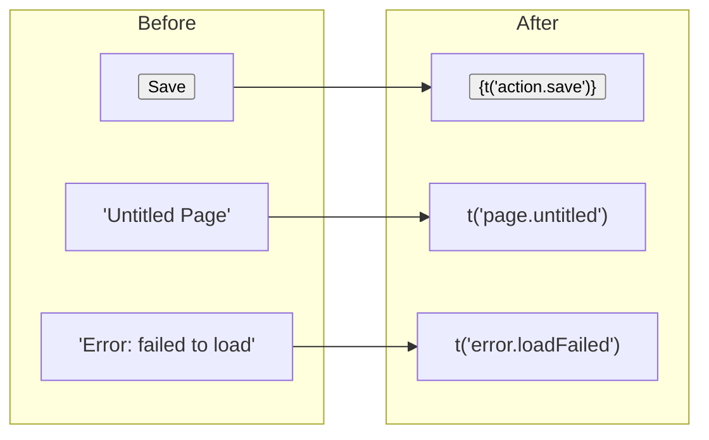

# 04: String Extraction

> Replace all hardcoded English strings across apps and packages with i18n calls

**Duration:** 3-4 days  
**Dependencies:** Step 03 (React integration working)

## Overview

Systematically extract every user-visible English string from the codebase and replace with `t()` or `<Trans>` calls. This is the most labor-intensive step but is mostly mechanical.



## Scope

### Apps

| Location                      | Approximate Strings | Namespace |
| ----------------------------- | ------------------- | --------- |
| `apps/web/src/`               | ~80-120 strings     | `core`    |
| `apps/electron/src/renderer/` | ~40-60 strings      | `core`    |
| `apps/expo/src/`              | ~30-50 strings      | `core`    |

### Packages

| Location                 | Approximate Strings | Namespace  |
| ------------------------ | ------------------- | ---------- |
| `packages/editor/src/`   | ~40-60 strings      | `editor`   |
| `packages/ui/src/`       | ~20-30 strings      | `core`     |
| `packages/views/src/`    | ~20-30 strings      | `views`    |
| `packages/devtools/src/` | ~30-40 strings      | `devtools` |

## Key Categories

### 1. UI Labels & Actions

```tsx
// Before
<button>New Page</button>
<span>Search...</span>
<h2>Settings</h2>

// After
<button>{t('action.newPage')}</button>
<span>{t('search.placeholder')}</span>
<h2>{t('settings.title')}</h2>
```

### 2. Plurals & Counts

```tsx
// Before
<p>{pages.length} pages</p>
<span>{count === 1 ? '1 item' : `${count} items`}</span>

// After
<p>{t('pages.count', { count: pages.length })}</p>
<span>{t('items.count', { count })}</span>

// Catalog entry (ICU)
// "pages.count": "{count, plural, one {# page} other {# pages}}"
// "items.count": "{count, plural, one {# item} other {# items}}"
```

### 3. Error Messages

```tsx
// Before
throw new Error('Document not found')
console.error('Failed to save:', error.message)
toast.error('Network connection lost')

// After (only user-facing errors get translated)
toast.error(t('error.networkLost'))
// Internal errors stay in English (developer-facing)
```

### 4. Date & Time Formatting

```tsx
// Before
<span>{new Date(updatedAt).toLocaleDateString()}</span>

// After (use ICU date formatting)
<span>{t('time.updated', { date: new Date(updatedAt) })}</span>

// Catalog: "time.updated": "Updated {date, date, medium}"
```

### 5. Confirmation Dialogs

```tsx
// Before
if (confirm('Are you sure you want to delete this page?')) { ... }

// After
if (confirm(t('confirm.deletePage'))) { ... }
```

## Key Naming Convention

Follow a hierarchical dot-notation pattern:

```
{area}.{context}.{action/description}
```

Examples:

| Key                     | English Value                              |
| ----------------------- | ------------------------------------------ |
| `action.save`           | Save                                       |
| `action.cancel`         | Cancel                                     |
| `action.delete`         | Delete                                     |
| `sidebar.newPage`       | New Page                                   |
| `sidebar.newDatabase`   | New Database                               |
| `editor.toolbar.bold`   | Bold                                       |
| `editor.toolbar.italic` | Italic                                     |
| `settings.title`        | Settings                                   |
| `settings.language`     | Language                                   |
| `search.placeholder`    | Search...                                  |
| `search.noResults`      | No results found                           |
| `error.networkLost`     | Network connection lost                    |
| `error.saveFailed`      | Failed to save changes                     |
| `confirm.deletePage`    | Are you sure you want to delete this page? |
| `time.justNow`          | Just now                                   |
| `time.updated`          | Updated {date, date, medium}               |

## What NOT to Translate

- Internal error messages (developer-facing)
- Console logs
- Schema names / IRIs
- Test strings
- Code comments
- URL paths
- CSS class names

## Process

1. **Scan** — Run `lingui extract` to see what's already marked
2. **Package-by-package** — Start with `packages/ui/` (smallest), then `packages/editor/`, then apps
3. **Extract** — Replace strings with `t()` calls, run `lingui extract` to generate catalog entries
4. **Verify** — English catalog should have all keys, app should render identically
5. **Repeat** — Move to next package/app

## Verification

```bash
# After extraction, the app should look identical
pnpm dev  # Visual check — all text renders from catalogs

# No untranslated strings should remain in JSX
# (grep for common patterns that suggest hardcoded text)
rg '"[A-Z][a-z]' --include '*.tsx' apps/ packages/ | grep -v 'import\|const\|type\|//'
```

## Acceptance Criteria

- [ ] All user-visible strings in `apps/web/` use `t()` or `<Trans>`
- [ ] All user-visible strings in `apps/electron/` use `t()` or `<Trans>`
- [ ] All user-visible strings in `packages/editor/` use `t()`
- [ ] All user-visible strings in `packages/ui/` use `t()`
- [ ] `lingui extract` produces complete English catalog
- [ ] App renders identically before/after extraction (visual regression)
- [ ] Key naming follows consistent convention
