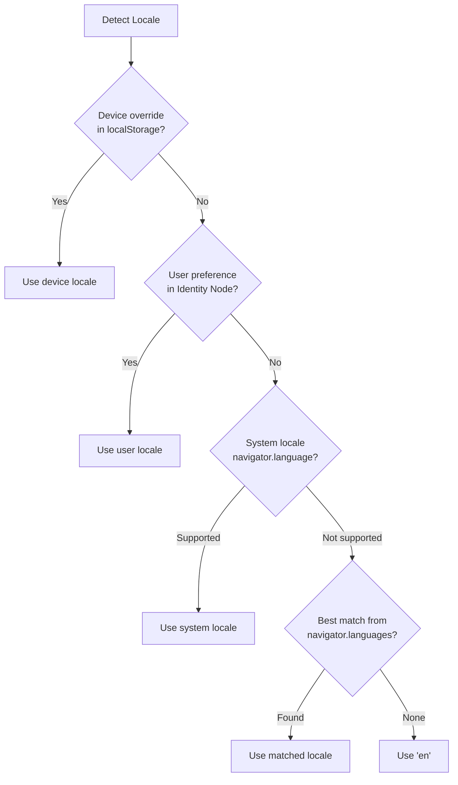
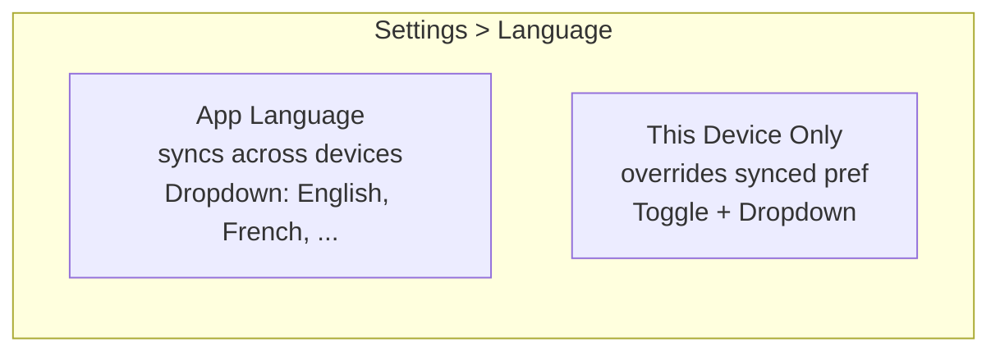

# 06: Locale Detection & Preferences

> Multi-layer locale resolution with device-local override and synced user preference

**Duration:** 1-2 days  
**Dependencies:** Steps 01, 03, `@xnet/data`

## Overview

Locale selection follows a priority chain: device-local override → synced user preference → system detection → default. The user's preference syncs across devices but each device can override locally.



## Settings UI



### Language Settings Component

```tsx
import { useTranslation, useLocale, useChangeLocale } from '@xnet/react/i18n'
import { useMutate, useQuery } from '@xnet/react'

function LanguageSettings() {
  const { t } = useTranslation()
  const locale = useLocale()
  const changeLocale = useChangeLocale()
  const { mutate } = useMutate()
  const { data: userPrefs } = useQuery(UserPrefsSchema, { limit: 1 })

  const deviceOverride = localStorage.getItem('xnet:locale-override')
  const [useDeviceOverride, setUseDeviceOverride] = useState(!!deviceOverride)

  const handleLocaleChange = async (newLocale: string) => {
    changeLocale(newLocale)

    if (!useDeviceOverride) {
      // Sync to Identity Node (propagates to other devices)
      await mutate.update(UserPrefsSchema, userPrefs[0]?.id, { locale: newLocale })
    } else {
      // Store locally only
      localStorage.setItem('xnet:locale-override', newLocale)
    }
  }

  return (
    <section>
      <h3>{t('settings.language')}</h3>

      <label>{t('settings.appLanguage')}</label>
      <select value={locale} onChange={(e) => handleLocaleChange(e.target.value)}>
        {SUPPORTED_LOCALES.map((loc) => (
          <option key={loc.code} value={loc.code}>
            {loc.name}
          </option>
        ))}
      </select>

      <label>
        <input
          type="checkbox"
          checked={useDeviceOverride}
          onChange={(e) => {
            setUseDeviceOverride(e.target.checked)
            if (!e.target.checked) {
              localStorage.removeItem('xnet:locale-override')
            }
          }}
        />
        {t('settings.deviceOverride')}
      </label>
      <p className="hint">{t('settings.deviceOverrideHint')}</p>
    </section>
  )
}

const SUPPORTED_LOCALES = [
  { code: 'en', name: 'English' },
  { code: 'fr', name: 'Français' },
  { code: 'de', name: 'Deutsch' },
  { code: 'es', name: 'Español' },
  { code: 'ja', name: '日本語' },
  { code: 'zh-CN', name: '简体中文' },
  { code: 'pt', name: 'Português' },
  { code: 'ko', name: '한국어' },
  { code: 'it', name: 'Italiano' },
  { code: 'ru', name: 'Русский' }
]
```

## User Preferences Schema

```typescript
// packages/data/src/schemas/user-preferences.ts
import { defineSchema, text, select } from '@xnet/data'

export const UserPrefsSchema = defineSchema({
  name: 'UserPreferences',
  namespace: 'xnet://xnet.dev/',
  properties: {
    locale: text(), // BCP 47 locale tag, e.g., 'fr-FR'
    theme: select({
      options: [
        { id: 'light', name: 'Light' },
        { id: 'dark', name: 'Dark' },
        { id: 'system', name: 'System' }
      ] as const
    })
  }
})
```

## Platform-Specific Detection

### Web (PWA)

```typescript
function detectWebLocale(): string | null {
  return navigator.language ?? navigator.languages[0] ?? null
}
```

### Electron

```typescript
// Main process
import { app } from 'electron'
const systemLocale = app.getLocale() // e.g., 'en-US'

// Send to renderer via IPC
ipcMain.handle('get-system-locale', () => app.getLocale())
```

### Mobile (Expo)

```typescript
import * as Localization from 'expo-localization'
const systemLocale = Localization.locale // e.g., 'fr-FR'
const systemLocales = Localization.locales // ['fr-FR', 'en-US']
```

## Integration with I18nProvider

```tsx
// apps/web/src/main.tsx
const userLocale = userPrefsNode?.properties.locale
const deviceLocale = localStorage.getItem('xnet:locale-override')

<I18nProvider config={{
  supportedLocales: ['en', 'fr', 'de', 'es', 'ja', 'zh-CN', 'pt', 'ko', 'it', 'ru'],
  defaultLocale: 'en',
  userLocale: userLocale ?? undefined,
  deviceLocale: deviceLocale ?? undefined,
  // ...
}}>
```

## Acceptance Criteria

- [ ] Locale detected from system on first launch
- [ ] User can change language in Settings
- [ ] Language preference syncs to other devices (via UserPreferences Node)
- [ ] Device-local override works (doesn't sync)
- [ ] Locale change triggers full UI re-render with new translations
- [ ] Expo uses `expo-localization` for system locale
- [ ] Electron uses `app.getLocale()` for system locale
