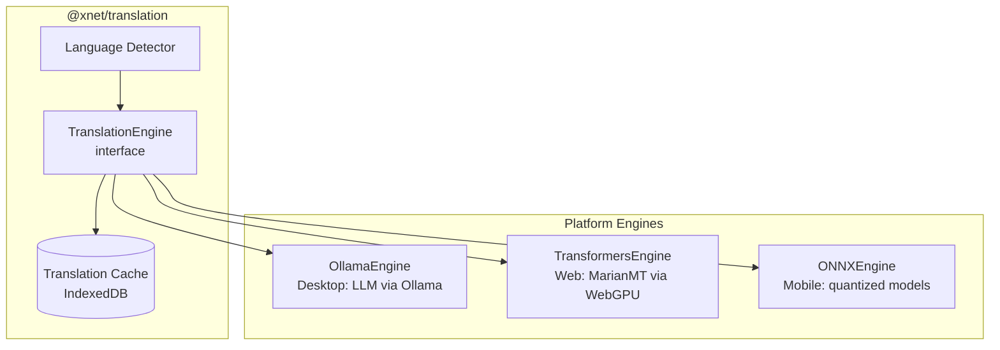
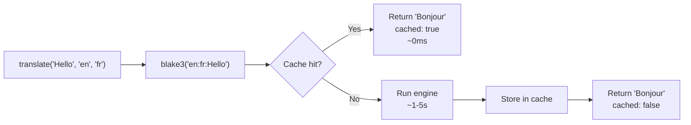

# 07: AI Translation Engine

> Local offline translation using platform-appropriate models with content-addressed caching

**Duration:** 4-5 days  
**Dependencies:** `@xnet/core`

## Overview

The `@xnet/translation` package provides a platform-agnostic interface for translating user content using local AI models. No cloud APIs — everything runs on-device.



## Package Structure

```
packages/translation/
  src/
    index.ts                # Public API
    types.ts                # TranslationEngine interface, request/result types
    engine.ts               # Engine orchestrator (picks platform engine)
    cache.ts                # Content-addressed translation cache
    detect.ts               # Language detection
    engines/
      ollama.ts             # Ollama/llama.cpp integration
      transformers.ts       # Transformers.js (browser)
      onnx-mobile.ts        # ONNX Runtime Mobile (React Native)
  package.json
  tsconfig.json
  vitest.config.ts
```

## Core Types

```typescript
// types.ts

export interface TranslationRequest {
  /** Text to translate */
  text: string
  /** Source language (BCP 47 or auto-detect) */
  sourceLang: string | 'auto'
  /** Target language (BCP 47) */
  targetLang: string
  /** Optional context for better quality (surrounding text) */
  context?: string
  /** Hint about content type */
  contentType?: 'title' | 'paragraph' | 'ui-label' | 'rich-text'
}

export interface TranslationResult {
  /** Translated text */
  translated: string
  /** Source language (detected if 'auto' was requested) */
  detectedSourceLang: string
  /** Model that produced the translation */
  model: string
  /** Whether this came from cache */
  cached: boolean
  /** Translation confidence (0-1, if available) */
  confidence?: number
}

export interface TranslationEngine {
  /** Translate text */
  translate(request: TranslationRequest): Promise<TranslationResult>
  /** Check if engine is available on this platform */
  isAvailable(): Promise<boolean>
  /** Estimated model download size in bytes (0 if already downloaded) */
  estimateDownloadSize(sourceLang: string, targetLang: string): Promise<number>
  /** Download required model (with progress callback) */
  downloadModel(
    sourceLang: string,
    targetLang: string,
    onProgress?: (loaded: number, total: number) => void
  ): Promise<void>
  /** Get engine name */
  getName(): string
}

export interface TranslationEngineOptions {
  /** Preferred engine (auto-selects if not specified) */
  preferredEngine?: 'ollama' | 'transformers' | 'onnx'
  /** Ollama base URL (default: http://localhost:11434) */
  ollamaBaseUrl?: string
  /** Model name for Ollama (default: 'qwen2.5:7b') */
  ollamaModel?: string
  /** Cache adapter */
  cache?: TranslationCache
}
```

## Translation Cache

Content-addressed caching using BLAKE3 hashes. Same text + same language pair = instant cache hit.

```typescript
// cache.ts
import { blake3 } from '@xnet/crypto'

export interface CachedTranslation {
  translated: string
  model: string
  timestamp: number
  sourceLang: string
  targetLang: string
}

export interface TranslationCache {
  get(key: string): Promise<CachedTranslation | null>
  set(key: string, value: CachedTranslation): Promise<void>
  has(key: string): Promise<boolean>
  clear(): Promise<void>
  size(): Promise<number>
}

/** Generate cache key from translation request */
export function cacheKey(text: string, sourceLang: string, targetLang: string): string {
  const input = `${sourceLang}:${targetLang}:${text}`
  return blake3(input)
}

/** IndexedDB-backed translation cache */
export class IndexedDBTranslationCache implements TranslationCache {
  private db: IDBDatabase | null = null
  private readonly dbName: string
  private readonly storeName = 'translations'

  constructor(dbName = 'xnet-translation-cache') {
    this.dbName = dbName
  }

  async open(): Promise<void> {
    /* ... */
  }
  async get(key: string): Promise<CachedTranslation | null> {
    /* ... */
  }
  async set(key: string, value: CachedTranslation): Promise<void> {
    /* ... */
  }
  async has(key: string): Promise<boolean> {
    /* ... */
  }
  async clear(): Promise<void> {
    /* ... */
  }
  async size(): Promise<number> {
    /* ... */
  }
}
```

### Cache Flow



## Ollama Engine (Desktop)

```typescript
// engines/ollama.ts

export class OllamaTranslationEngine implements TranslationEngine {
  private baseUrl: string
  private model: string

  constructor(options?: { baseUrl?: string; model?: string }) {
    this.baseUrl = options?.baseUrl ?? 'http://localhost:11434'
    this.model = options?.model ?? 'qwen2.5:7b'
  }

  async isAvailable(): Promise<boolean> {
    try {
      const res = await fetch(`${this.baseUrl}/api/tags`)
      return res.ok
    } catch {
      return false
    }
  }

  async translate(request: TranslationRequest): Promise<TranslationResult> {
    const prompt = this.buildPrompt(request)

    const response = await fetch(`${this.baseUrl}/api/generate`, {
      method: 'POST',
      headers: { 'Content-Type': 'application/json' },
      body: JSON.stringify({
        model: this.model,
        prompt,
        stream: false,
        options: { temperature: 0.1 } // Low temperature for consistent translations
      })
    })

    const data = await response.json()
    const translated = this.parseResponse(data.response)

    return {
      translated,
      detectedSourceLang: request.sourceLang === 'auto' ? 'en' : request.sourceLang,
      model: this.model,
      cached: false
    }
  }

  private buildPrompt(request: TranslationRequest): string {
    const langNames = { en: 'English', fr: 'French', de: 'German', es: 'Spanish' /* ... */ }
    const src = langNames[request.sourceLang] ?? request.sourceLang
    const tgt = langNames[request.targetLang] ?? request.targetLang

    if (request.contentType === 'title' || request.contentType === 'ui-label') {
      return `Translate the following ${src} text to ${tgt}. Return only the translation, nothing else.\n\n${request.text}`
    }

    return `Translate the following ${src} text to ${tgt}. Preserve formatting and tone. Return only the translation.\n\n${request.text}`
  }

  private parseResponse(raw: string): string {
    // Strip any wrapping quotes or "Translation:" prefixes the model might add
    return raw
      .replace(/^["']|["']$/g, '')
      .replace(/^Translation:\s*/i, '')
      .trim()
  }

  getName(): string {
    return `ollama:${this.model}`
  }

  async estimateDownloadSize(): Promise<number> {
    return 0
  } // Ollama manages its own models
  async downloadModel(): Promise<void> {
    /* Ollama pull handled externally */
  }
}
```

## Transformers.js Engine (Web)

```typescript
// engines/transformers.ts
import type { TranslationPipeline } from '@huggingface/transformers'

export class TransformersTranslationEngine implements TranslationEngine {
  private pipeline: TranslationPipeline | null = null
  private modelId: string

  constructor(options?: { modelId?: string }) {
    this.modelId = options?.modelId ?? 'Xenova/opus-mt-{src}-{tgt}'
  }

  async isAvailable(): Promise<boolean> {
    // Check for WebGPU or WASM support
    return typeof navigator !== 'undefined' && 'gpu' in navigator
  }

  async translate(request: TranslationRequest): Promise<TranslationResult> {
    if (!this.pipeline) {
      const { pipeline } = await import('@huggingface/transformers')
      const modelId = this.resolveModelId(request.sourceLang, request.targetLang)
      this.pipeline = (await pipeline('translation', modelId, {
        device: 'webgpu', // Falls back to WASM if WebGPU unavailable
        dtype: 'q8' // Quantized for speed
      })) as TranslationPipeline
    }

    const result = await this.pipeline(request.text, {
      src_lang: request.sourceLang,
      tgt_lang: request.targetLang
    })

    const translated = Array.isArray(result) ? result[0].translation_text : result.translation_text

    return {
      translated,
      detectedSourceLang: request.sourceLang,
      model: this.modelId,
      cached: false
    }
  }

  private resolveModelId(src: string, tgt: string): string {
    // Map to Helsinki-NLP Opus-MT models
    return `Xenova/opus-mt-${src}-${tgt}`
  }

  getName(): string {
    return `transformers:${this.modelId}`
  }

  async estimateDownloadSize(src: string, tgt: string): Promise<number> {
    // Opus-MT models are typically ~300 MB
    return 300 * 1024 * 1024
  }

  async downloadModel(
    src: string,
    tgt: string,
    onProgress?: (loaded: number, total: number) => void
  ): Promise<void> {
    // Transformers.js handles download + caching internally
    const { pipeline } = await import('@huggingface/transformers')
    this.pipeline = (await pipeline('translation', this.resolveModelId(src, tgt), {
      device: 'webgpu',
      dtype: 'q8',
      progress_callback: onProgress
        ? (p: any) => {
            if (p.loaded && p.total) onProgress(p.loaded, p.total)
          }
        : undefined
    })) as TranslationPipeline
  }
}
```

## Engine Orchestrator

```typescript
// engine.ts

export class TranslationOrchestrator {
  private engines: TranslationEngine[] = []
  private cache: TranslationCache

  constructor(options: TranslationEngineOptions = {}) {
    this.cache = options.cache ?? new IndexedDBTranslationCache()

    // Register engines in priority order
    if (options.preferredEngine === 'ollama' || !options.preferredEngine) {
      this.engines.push(
        new OllamaTranslationEngine({
          baseUrl: options.ollamaBaseUrl,
          model: options.ollamaModel
        })
      )
    }
    if (options.preferredEngine === 'transformers' || !options.preferredEngine) {
      this.engines.push(new TransformersTranslationEngine())
    }
  }

  async translate(request: TranslationRequest): Promise<TranslationResult> {
    // 1. Check cache
    const key = cacheKey(request.text, request.sourceLang, request.targetLang)
    const cached = await this.cache.get(key)
    if (cached) {
      return {
        translated: cached.translated,
        detectedSourceLang: cached.sourceLang,
        model: cached.model,
        cached: true
      }
    }

    // 2. Find available engine
    const engine = await this.findAvailableEngine()
    if (!engine) {
      throw new Error('No translation engine available. Install Ollama or enable WebGPU.')
    }

    // 3. Translate
    const result = await engine.translate(request)

    // 4. Cache result
    await this.cache.set(key, {
      translated: result.translated,
      model: result.model,
      timestamp: Date.now(),
      sourceLang: result.detectedSourceLang,
      targetLang: request.targetLang
    })

    return result
  }

  private async findAvailableEngine(): Promise<TranslationEngine | null> {
    for (const engine of this.engines) {
      if (await engine.isAvailable()) return engine
    }
    return null
  }

  /** Get available engine info */
  async getStatus(): Promise<{ available: boolean; engine: string | null; cacheSize: number }> {
    const engine = await this.findAvailableEngine()
    const cacheSize = await this.cache.size()
    return {
      available: !!engine,
      engine: engine?.getName() ?? null,
      cacheSize
    }
  }
}
```

## Model Comparison

| Model               | Platform         | Size (quantized) | Languages | Quality   | Speed       |
| ------------------- | ---------------- | ---------------- | --------- | --------- | ----------- |
| Qwen 2.5 7B         | Desktop (Ollama) | ~4 GB (Q4)       | All major | Excellent | ~40 tok/s   |
| NLLB-200-600M       | Desktop/Web      | ~600 MB (Q4)     | 200       | Good      | ~10 tok/s   |
| Opus-MT (per pair)  | Web/Mobile       | ~300 MB (Q8)     | Per pair  | Good      | ~5-10 tok/s |
| MarianMT (per pair) | Mobile           | ~150 MB (Q4)     | Per pair  | Good      | ~15 tok/s   |

## Dependencies

```json
{
  "dependencies": {
    "@xnet/core": "workspace:*",
    "@xnet/crypto": "workspace:*"
  },
  "optionalDependencies": {
    "@huggingface/transformers": "^3.0.0"
  }
}
```

Transformers.js is optional — only loaded on web when the user triggers a translation.

## Tests

```typescript
describe('TranslationOrchestrator', () => {
  it('should return cached translation on cache hit')
  it('should call engine on cache miss and cache result')
  it('should try engines in priority order')
  it('should throw when no engine available')
})

describe('IndexedDBTranslationCache', () => {
  it('should store and retrieve translations by hash key')
  it('should return null for missing keys')
  it('should report correct cache size')
  it('should clear all entries')
})

describe('OllamaTranslationEngine', () => {
  it('should detect Ollama availability via /api/tags')
  it('should format translation prompt correctly')
  it('should parse model response, stripping artifacts')
  it('should use low temperature for consistency')
})

describe('TransformersTranslationEngine', () => {
  it('should detect WebGPU availability')
  it('should load correct model for language pair')
  it('should translate text via pipeline')
  it('should report download size estimate')
})
```

## Acceptance Criteria

- [ ] Orchestrator checks cache before calling engine
- [ ] Ollama engine works when Ollama is running locally
- [ ] Transformers.js engine loads and runs MarianMT/Opus-MT in browser
- [ ] Cache is content-addressed (same input = same key)
- [ ] Cache persists across sessions (IndexedDB)
- [ ] Engine availability detection works reliably
- [ ] Model download shows progress
- [ ] Translation produces reasonable quality for top 10 languages
