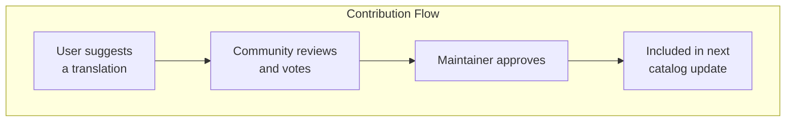
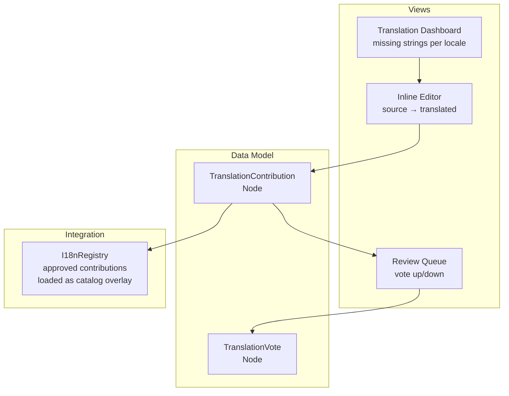
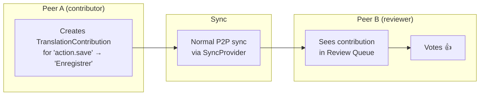

# 10: Community Translations

> Crowdsourcing UI translations from users with a suggest/review/approve workflow

**Duration:** 2-3 days  
**Dependencies:** Steps 01-06

## Overview

Allow xNet users to contribute translations for the app UI — suggest translations, review others' suggestions, and approve them for inclusion. This extends the existing i18n infrastructure with a collaborative layer.



## Architecture

Community translations are stored as Nodes, synced via the existing P2P infrastructure. This means contributions can be made offline and sync when connected.



## Schemas

```typescript
// Translation contribution (a suggested translation for a UI string)
const TranslationContributionSchema = defineSchema({
  name: 'TranslationContribution',
  namespace: 'xnet://xnet.dev/',
  properties: {
    /** The message key being translated */
    messageKey: text({ required: true }),
    /** Namespace (core, editor, plugin:xxx) */
    namespace: text({ required: true }),
    /** Target locale */
    locale: text({ required: true }),
    /** The suggested translation (ICU MessageFormat) */
    translation: text({ required: true }),
    /** Status */
    status: select({
      options: [
        { id: 'pending', name: 'Pending Review' },
        { id: 'approved', name: 'Approved' },
        { id: 'rejected', name: 'Rejected' }
      ] as const
    }),
    /** Net votes (upvotes - downvotes) */
    votes: number(),
    /** Optional note from contributor */
    note: text()
  }
})

// Vote on a translation contribution
const TranslationVoteSchema = defineSchema({
  name: 'TranslationVote',
  namespace: 'xnet://xnet.dev/',
  properties: {
    /** The contribution being voted on */
    contributionId: text({ required: true }),
    /** Vote direction */
    vote: select({
      options: [
        { id: 'up', name: 'Approve' },
        { id: 'down', name: 'Reject' }
      ] as const
    })
  }
})
```

## Translation Dashboard

Shows translation coverage per locale and allows inline contribution:

```tsx
function TranslationDashboard() {
  const { t } = useTranslation()
  const [selectedLocale, setSelectedLocale] = useState('fr')
  const { registry } = useI18nContext()

  // Get all keys from source locale
  const sourceKeys = Object.keys(registry.getCatalog('core', 'en') ?? {})
  const targetCatalog = registry.getCatalog('core', selectedLocale) ?? {}

  const missingKeys = sourceKeys.filter((key) => !targetCatalog[key])
  const coverage = (((sourceKeys.length - missingKeys.length) / sourceKeys.length) * 100).toFixed(1)

  return (
    <div className="translation-dashboard">
      <header>
        <h2>{t('community.title')}</h2>
        <LocaleSelector value={selectedLocale} onChange={setSelectedLocale} />
        <span className="coverage">
          {coverage}% {t('community.coverage')}
        </span>
      </header>

      <section>
        <h3>{t('community.missing', { count: missingKeys.length })}</h3>
        {missingKeys.map((key) => (
          <TranslationRow
            key={key}
            messageKey={key}
            namespace="core"
            locale={selectedLocale}
            sourceText={registry.resolve('core', key) ?? key}
          />
        ))}
      </section>
    </div>
  )
}
```

## Inline Translation Editor

```tsx
function TranslationRow({ messageKey, namespace, locale, sourceText }: Props) {
  const { t } = useTranslation()
  const [draft, setDraft] = useState('')
  const [isSubmitting, setIsSubmitting] = useState(false)
  const { mutate } = useMutate()

  // Check for existing contributions
  const { data: contributions } = useQuery(TranslationContributionSchema, {
    where: { messageKey, namespace, locale }
  })

  const submit = async () => {
    setIsSubmitting(true)
    await mutate.create(TranslationContributionSchema, {
      messageKey,
      namespace,
      locale,
      translation: draft,
      status: 'pending',
      votes: 0
    })
    setDraft('')
    setIsSubmitting(false)
  }

  return (
    <div className="translation-row">
      <div className="source">
        <code>{messageKey}</code>
        <span>{sourceText}</span>
      </div>

      {contributions.length > 0 && (
        <div className="existing">
          {contributions.map((c) => (
            <ContributionCard key={c.id} contribution={c} />
          ))}
        </div>
      )}

      <div className="contribute">
        <input
          value={draft}
          onChange={(e) => setDraft(e.target.value)}
          placeholder={t('community.suggestPlaceholder')}
        />
        <button onClick={submit} disabled={!draft || isSubmitting}>
          {t('community.suggest')}
        </button>
      </div>
    </div>
  )
}
```

## Review & Voting

```tsx
function ContributionCard({ contribution }: { contribution: FlatNode<...> }) {
  const { t } = useTranslation()
  const { mutate } = useMutate()
  const { data: myVote } = useQuery(TranslationVoteSchema, {
    where: { contributionId: contribution.id }
  })

  const vote = async (direction: 'up' | 'down') => {
    if (myVote.length > 0) {
      await mutate.update(TranslationVoteSchema, myVote[0].id, { vote: direction })
    } else {
      await mutate.create(TranslationVoteSchema, {
        contributionId: contribution.id,
        vote: direction
      })
    }
  }

  return (
    <div className="contribution-card">
      <span className="translation">{contribution.translation}</span>
      <span className="votes">{contribution.votes}</span>
      <button onClick={() => vote('up')}>👍</button>
      <button onClick={() => vote('down')}>👎</button>
      <span className="status">{contribution.status}</span>
      {contribution.note && <p className="note">{contribution.note}</p>}
    </div>
  )
}
```

## Approved Contributions → Catalog Overlay

Approved contributions are loaded as a catalog overlay on top of the shipped translations:

```typescript
// Load community translations as an overlay
async function loadCommunityTranslations(registry: I18nRegistry, locale: string) {
  const approved = await store.list({
    schemaId: TranslationContributionSchema._schemaId,
    where: { locale, status: 'approved' }
  })

  const catalog: Record<string, string> = {}
  for (const contrib of approved) {
    catalog[contrib.properties.messageKey] = contrib.properties.translation
  }

  // Register as a high-priority overlay
  registry.register(`community:${locale}`, locale, catalog)
}
```

## P2P Sync of Contributions

Since contributions are Nodes, they sync naturally:



## Moderation

For the initial version, the app maintainer (or a configured set of DIDs) can approve translations:

```typescript
// Simple allowlist of maintainer DIDs
const MAINTAINER_DIDS = [
  'did:key:z6Mkh...', // Project owner
  'did:key:z6Mkf...' // Trusted translator
]

function canApprove(userDid: string): boolean {
  return MAINTAINER_DIDS.includes(userDid)
}
```

Future: Use UCAN delegation to grant translation approval capabilities.

## Acceptance Criteria

- [ ] Translation Dashboard shows coverage per locale
- [ ] Users can suggest translations for missing keys
- [ ] Users can vote on existing contributions
- [ ] Maintainers can approve/reject contributions
- [ ] Approved contributions are loaded as catalog overlays
- [ ] Contributions sync across peers
- [ ] Coverage percentage updates in real-time
- [ ] ICU MessageFormat validation on submitted translations
