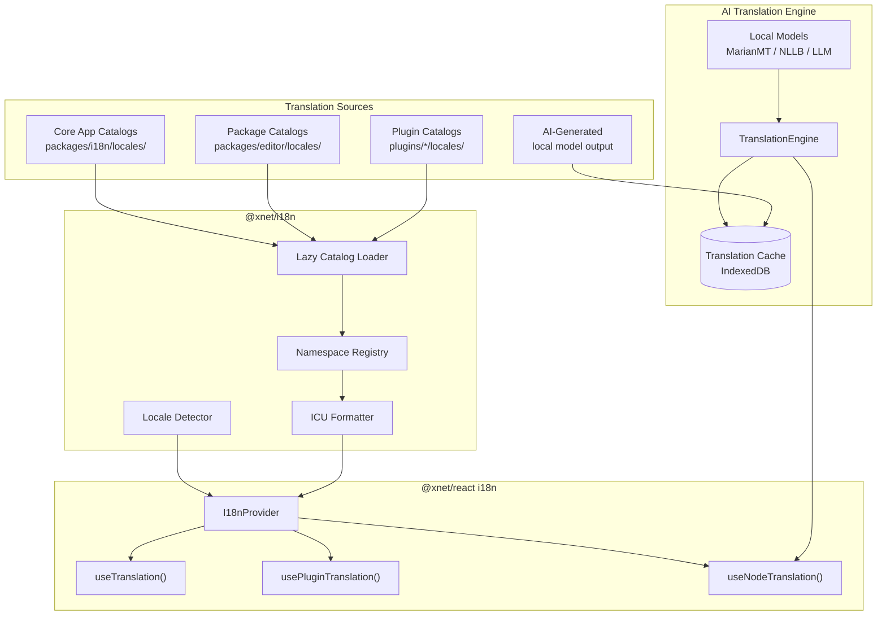

# xNet Implementation Plan - Step 04.1: Internationalization

> Full i18n for all apps, plugin-extensible translations, and offline AI-powered content translation

## Executive Summary

This plan adds internationalization to xNet — from UI chrome (menus, buttons, labels) to user-generated content (Node titles, rich text). The key insight is that **UI translations are static code artifacts** (shipped with the app), while **content translations are user data** (stored as Node properties, synced via CRDT).

```typescript
// UI translations — static, from catalogs
const { t } = useTranslation('editor')
t('toolbar.bold') // "Gras" in French

// Plugin translations — isolated namespace
const { t } = usePluginTranslation('erp')
t('invoice.title') // "Facture" in French

// Content translation — AI-powered, stored on Node
const { title, translate, isTranslating } = useNodeTranslation(nodeId, 'fr')
await translate() // Runs local model, stores result
```

## Design Principles

| Principle             | Implementation                                                   |
| --------------------- | ---------------------------------------------------------------- |
| **Type-safe**         | Compile-time key checking, missing interpolation args are errors |
| **ICU standard**      | ICU MessageFormat for plurals, gender, dates, numbers            |
| **Plugin-extensible** | Each plugin ships its own translations, isolated by namespace    |
| **Offline-first**     | AI translation runs locally — no cloud APIs required             |
| **Platform-agnostic** | Same i18n system for web, desktop, and mobile                    |
| **User-sovereign**    | Locale preference syncs optionally; device can override          |

## Architecture Overview



## Package Map

```
packages/
  i18n/                       # @xnet/i18n — core i18n infrastructure
    src/
      index.ts                # Public API
      registry.ts             # Namespace catalog registry
      formatter.ts            # ICU MessageFormat wrapper
      detector.ts             # Locale detection (browser/OS/user pref)
      loader.ts               # Lazy catalog loader
      types.ts                # Shared types
    locales/                  # Core app translations
      en.json
      fr.json
      de.json
      es.json
      ja.json
      zh.json
      ...

  react/
    src/
      i18n/
        I18nProvider.tsx       # Context provider
        useTranslation.ts     # Core namespace hook
        usePluginTranslation.ts  # Plugin namespace hook
        useNodeTranslation.ts # AI content translation hook
        Trans.tsx             # Rich-text translation component

  translation/                # @xnet/translation — AI translation engine
    src/
      index.ts
      engine.ts               # Platform-agnostic interface
      engines/
        ollama.ts             # Desktop: Ollama/llama.cpp
        transformers.ts       # Web: Transformers.js (WebGPU/WASM)
        onnx-mobile.ts        # Mobile: ONNX Runtime
      cache.ts                # Content-addressed cache (IndexedDB)
      detect.ts               # Language detection
```

## Implementation Steps

| #   | Task                                  | Duration | Dependencies                 |
| --- | ------------------------------------- | -------- | ---------------------------- |
| 01  | [@xnet/i18n package](#01)             | 2-3 days | `@xnet/core`                 |
| 02  | [Lingui compiler setup](#02)          | 1-2 days | Step 01                      |
| 03  | [React integration](#03)              | 2-3 days | Steps 01-02, `@xnet/react`   |
| 04  | [String extraction](#04)              | 3-4 days | Step 03                      |
| 05  | [Plugin namespaces](#05)              | 2-3 days | Steps 01, 03                 |
| 06  | [Locale detection & preferences](#06) | 1-2 days | Steps 01, 03, `@xnet/data`   |
| 07  | [AI translation engine](#07)          | 4-5 days | `@xnet/core`                 |
| 08  | [Multilingual Node content](#08)      | 2-3 days | Steps 03, 07, `@xnet/data`   |
| 09  | [Translation UX](#09)                 | 2-3 days | Steps 07, 08, `@xnet/editor` |
| 10  | [Community translations](#10)         | 2-3 days | Steps 01-06                  |

**Total estimated duration:** 22-31 days

## Key Decisions

| Decision              | Choice                            | Why                                                         |
| --------------------- | --------------------------------- | ----------------------------------------------------------- |
| Library               | Lingui                            | ICU native, compile-time macros, Metro support, active dev  |
| Message format        | ICU MessageFormat                 | Industry standard, translator tooling, plurals/gender/dates |
| Plugin isolation      | Namespace per plugin ID           | WordPress-proven, no collisions, lazy-loadable              |
| Locale preference     | Device-local + synced user pref   | Different devices may want different locales                |
| Content translations  | Node properties                   | Translations belong to the content, sync naturally          |
| AI models             | Tiered by platform                | Desktop=LLM, Web=MarianMT, Mobile=quantized MarianMT        |
| Rich text translation | Separate Y.XmlFragment per locale | Independent CRDT editing, no cross-locale conflicts         |
| Translation cache     | Content-addressed (blake3 hash)   | Deduplication, instant repeat lookups                       |

## Initial Language Support

Top 10 languages (~75% of internet users):

| Language             | Code  | Script     | RTL |
| -------------------- | ----- | ---------- | --- |
| English              | en    | Latin      | No  |
| Chinese (Simplified) | zh-CN | Han        | No  |
| Spanish              | es    | Latin      | No  |
| French               | fr    | Latin      | No  |
| German               | de    | Latin      | No  |
| Japanese             | ja    | Kana/Kanji | No  |
| Portuguese           | pt    | Latin      | No  |
| Korean               | ko    | Hangul     | No  |
| Italian              | it    | Latin      | No  |
| Russian              | ru    | Cyrillic   | No  |

RTL languages (Arabic, Hebrew, Persian) planned for Phase 2 — requires CSS logical properties migration.
