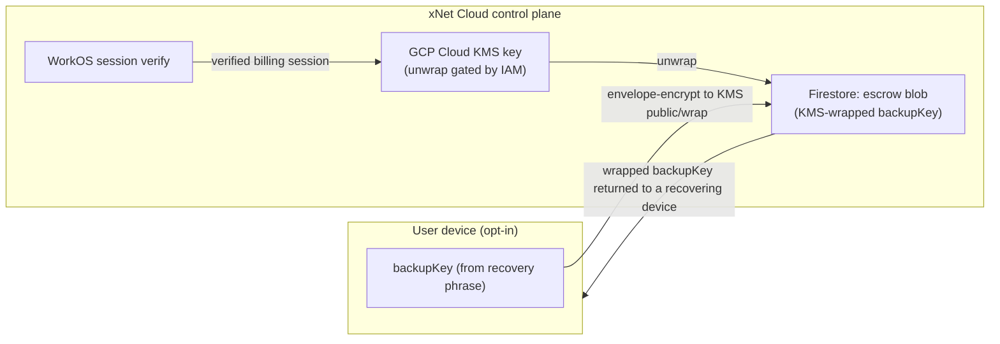

# P3.1 — Optional Account Recovery Escrow: Design Note

> **Status:** Design note — for a go/no-go decision. The privacy-preserving _engine_
> (the "B" variant: cloud can't read alone) is built (PR #335:
> [`@xnetjs/identity` escrow](../../packages/identity/src/escrow.ts) +
> [`@xnetjs/cloud/escrow`](../../packages/cloud/src/escrow/index.ts)); this note now
> frames the **product** decision around _non-coercibility_ — how to recover users
> without holding a key we could be compelled to use.
> **Parent:** [exploration 0243](../explorations/0243_[_]_ACCOUNT_VALIDATION_AND_RECOVERY_BINDING_THE_PAYER_TO_THE_PASSKEY.md), item **P3.1**.
> **Date:** 2026-06-28 (rev. with the Apple / non-coercible framing)

## Why this needs a decision, not just a checkbox

Everything else in 0243 is _non-custodial_: a lost passkey is recoverable only by
something the **user** holds — a recovery phrase (Phase 1), a synced passkey (P1.4), or
(future) another of their devices (Phase 2 ledger). xNet Cloud never holds anything that
can decrypt the user's data.

P3.1 deliberately breaks that for users who ask for it: it lets xNet Cloud reconstruct a
user's data-decryption capability after a verified billing (WorkOS) login, so they can
recover **without** having kept a phrase. That convenience has a hard cost — **it
collapses the security of the user's data down to the security of their WorkOS login.**
This note exists so we choose that tradeoff deliberately, pick the mitigations, and write
honest consent copy — before any escrow code ships.

## What exactly would be escrowed

Not the passkey, and not the raw phrase. The minimum that enables recovery is a key that
can re-derive the user's **X25519 data-decryption key** (the recipient key everything is
sealed to). Concretely: wrap the recovery-phrase-derived **backup key** (already in
`@xnetjs/identity` `seed-recovery.ts` as `bundle.backupKey`) and store the wrapped blob.
Recovering it reconstructs the same DID + X25519 → the user decrypts their own data,
exactly as the phrase path does today — but with the secret held by the cloud instead of
the user.

## Where the wrapped key lives (proposed)

The cloud runs on GCP (explorations 0174/0196). The natural primitives:

- **At rest:** the `backupKey` is envelope-encrypted under a **Cloud KMS** key and the
  ciphertext stored per-tenant in Firestore. The control plane never stores the plaintext.
- **Release:** the unwrap (KMS `decrypt`) is performed by the control plane **only** after
  it has verified a live WorkOS session for the tenant's `billingUserId`, then the
  plaintext `backupKey` is returned to the recovering device over TLS and never persisted
  there.

## What a verified WorkOS session unlocks — and the blast radius

A verified WorkOS session → unwrap → `backupKey` → the user's data-decryption key. So:

> **Anyone who can complete a WorkOS login for the account can decrypt that account's
> data.** That includes the legitimate user, **and** an attacker who phishes the email /
> SSO, performs a SIM-swap on an SMS factor, or coerces the provider — and xNet itself, or
> anyone who compromises the control plane's KMS IAM.

This is the entire point (recoverability) and the entire risk (custodial access). The
mitigations below shrink the blast radius; they do not remove it.

## What would Apple do? Non-coercible recovery

Apple's design goal is precisely the one we want: **be unable to decrypt a user's data
even under legal coercion.** They get there two ways, and we should copy the structure.

**1. Hold no key at all — Advanced Data Protection (ADP).** With ADP on, the keys for
~25 iCloud data categories live only on the user's devices; **Apple has no key and
cannot recover the data.** Recovery is entirely user-held: the **device passcode**, a
**28-character recovery key**, or a **recovery contact** — a trusted person whose device
can mint a recovery code but who never sees the data. Lose all of them and you're locked
out, by design. Coercion is moot because there is nothing to compel Apple to produce.

**2. If you must escrow, make the HSM non-coercible — iCloud Keychain escrow.** For the
(non-ADP) keychain escrow, Apple stores the escrow record but guards it with an **HSM
cluster** so that even Apple can't open it:

- The user proves knowledge of their iCloud Security Code via **SRP** (Secure Remote
  Password) — **the code is never sent to Apple**, so there's nothing to seize or compel.
- The HSM allows **only ~10 attempts**, then **destroys the escrow record** — so a short
  secret can't be brute-forced, even by the operator.
- The policy is in **HSM firmware whose administrative access cards were destroyed**; any
  attempt to change the firmware or read the key **erases the key**. Apple has provably
  removed its own ability to change the rules.

The pattern in both: **the cloud never holds a key it can use without a user secret it
doesn't know, and the check on that secret is rate-limited + self-destructing in
hardware the operator can't reconfigure.** A subpoena can compel Apple to _try_; it
can't make the math or the HSM cooperate.

### What this means for xNet (good news: we mostly already have it)

The ADP path maps directly onto primitives **already shipped** in 0243:

| Apple (ADP)            | xNet equivalent                                                                                | Status                             |
| ---------------------- | ---------------------------------------------------------------------------------------------- | ---------------------------------- |
| 28-char recovery key   | **Recovery phrase** (`recoverable.ts`)                                                         | shipped (Phase 1, #320/#322/#324)  |
| Recovery contact       | **Shamir social recovery** — `createRecoveryShares` / `recoverFromShares` (`seed-recovery.ts`) | code shipped; **UI not yet wired** |
| Device passcode unlock | **passkey** unlock / synced-passkey recovery                                                   | shipped (#333)                     |

So the **non-coercible answer for xNet is the ADP answer: hold no recoverable key in the
cloud.** A user who wants "I don't have to keep a long phrase" recovery is served by
**social recovery (guardians)** — the recovery-contact analogue — which we already have
the crypto for and only need to surface in the UI. That keeps the cloud zero-knowledge.

If, and only if, we still want a cloud-stored escrow (e.g. for managed/enterprise where
the user keeps nothing), it must be built the **Apple-HSM way**, not the naive way:

- Replace the plain PIN-derived key (the engine's current `hkdf(pin)`) with a
  **zero-knowledge proof of the PIN (SRP / OPAQUE)** so the cloud never receives it.
- Hold the unwrap key in a **real HSM/KMS that enforces a hard attempt limit and
  destroys the escrow after N failures** (GCP Cloud HSM / Cloud KMS with an
  import-job + attestation; or a dedicated rate-limiting enclave), with **immutable,
  attested access policy** so we can't be compelled to lift the limit.
- Without those, a short PIN + a coercible KMS is _not_ Apple-grade — a compelled
  operator who can KMS-unwrap could brute-force a 4-digit PIN offline. The engine's PIN
  factor is necessary but **not sufficient** on its own; the HSM rate-limit + ZK-PIN is
  what makes it non-coercible.

## Mitigations (pick a subset; A is the baseline, B+C strongly recommended)

| #     | Mitigation                                                                                                                | Effect                                                                       | Cost                                                                |
| ----- | ------------------------------------------------------------------------------------------------------------------------- | ---------------------------------------------------------------------------- | ------------------------------------------------------------------- |
| **A** | KMS-wrapped at rest + release only on verified WorkOS session                                                             | Baseline; nothing in Firestore is usable without KMS IAM                     | none beyond build                                                   |
| **B** | **Second factor the cloud never sees** — escrow is wrapped with `KMS ⊕ user-held escrow PIN/key`; recovery needs both     | Cloud alone (or a stolen WorkOS session) can't decrypt                       | user must keep a PIN — partial return of the "keep a secret" burden |
| **C** | **Delay + notify** — escrow release starts a timer (e.g. 72 h) and notifies every known device/email; the user can cancel | Defeats silent account-takeover; user sees + aborts an unauthorized recovery | recovery isn't instant                                              |
| **D** | **Step-up auth** on the WorkOS session before release (re-auth / WebAuthn)                                                | Raises the bar beyond a cached session cookie                                | extra prompt                                                        |
| **E** | **Audit + rate-limit** every escrow read; surface in the dashboard                                                        | Detection + forensics                                                        | logging                                                             |

Recommendation: **A + C + D + E by default, and offer B** for users who want
cloud-can't-read-alone. (B is the only option that keeps the cloud from being a single
point of compromise; C is the cheapest strong defense against account takeover and mirrors
Apple's Advanced-Data-Protection recovery-contact delay.)

## Consent UX (non-negotiable if we build it)

- **Off by default.** Never auto-enabled; never a nudge during onboarding.
- A dedicated Settings flow, separate from "Save recovery phrase", with copy that states
  plainly: _"Turning this on lets xNet Cloud restore your data from your login alone. That
  means we — and anyone who takes over your billing login — could access your data. This
  is the opposite of the privacy guarantee xNet normally gives you."_
- Require an explicit typed confirmation (not just a checkbox) to enable, and show the
  enabled state prominently with a one-click disable that deletes the escrow blob.
- Honour the humane-pattern lint (no dark patterns; the safe choice is the default).

## Proposed implementation surface (if approved)

- `@xnetjs/cloud`: an `EscrowStore` port (`putWrapped`, `getWrapped`, `delete`) + a KMS
  wrap/unwrap adapter (GCP KMS in prod, an in-memory fake for tests). Pure logic for the
  optional B-factor combine.
- `apps/cloud`: `POST /account/escrow` (enable, with the wrapped blob), `DELETE`
  (disable), and a gated `POST /account/escrow/recover` that verifies the WorkOS session,
  enforces delay/step-up, and returns the blob. Audit every call.
- `@xnetjs/identity`: a helper to produce/consume the escrow blob from a `DerivedKeyBundle`
  (reusing `createKeyBackup`/`recoverFromBackup`), plus the optional B-factor combine.
- Web: the consent + enable/disable + "recover via my login" flows.
- Tests: escrow unreachable without a verified session; absent unless explicitly enabled;
  disable deletes the blob; B-factor required when configured; delay/notify enforced.

## Open questions for the go/no-go

1. **Do we want the cloud to _ever_ be able to read data?** If "no, never" (the Apple-ADP
   stance), don't build custodial escrow at all — satisfy the "recover without a phrase"
   need with **Shamir social recovery** (the recovery-contact analogue, crypto already
   shipped) and a printed recovery key. Cloud stays zero-knowledge.
2. **Enterprise vs. consumer.** Escrow is most defensible for _managed_ (enterprise/admin)
   accounts where an org already trusts an admin. Should P3.1 be enterprise-only?
3. **Jurisdiction / legal.** Holding a recoverable key changes our exposure to legal
   process. Worth a counsel note before enabling in production.
4. **Default mitigations.** Confirm A+C+D+E as the floor, and whether B is required (not
   just offered).

## Recommendation (revised: be like Apple — don't be coercible)

**Default to the ADP answer: the cloud holds no recoverable key.** For users who don't
want to keep a recovery phrase, give them the **recovery-contact analogue we already have
the crypto for — Shamir social recovery** (`createRecoveryShares` / `recoverFromShares`).
Wiring that guardian UI is the highest-value, zero-knowledge next step, and it makes xNet
non-coercible by construction: there is nothing in the cloud to compel.

**Do _not_ ship the naive custodial escrow** (cloud unwraps from a login alone). That is
exactly the coercible design Apple avoids — a subpoena to xNet (or a compromised WorkOS
account) yields the data.

**Only build cloud escrow if a managed/enterprise need is concrete, and then build it the
Apple-HSM way:** a zero-knowledge PIN proof (SRP/OPAQUE) so the cloud never sees the
secret, plus an HSM/KMS that **rate-limits and self-destructs** the escrow after a few
failures under an **immutable, attested policy**, plus C+D+E (delay+notify, step-up,
audit), opt-in, off by default, with counsel sign-off. The engine shipped in #335 is the
necessary PIN-factor _foundation_ but is **not** Apple-grade until the ZK-PIN + HSM
rate-limit are in place — a plain KMS unwrap of an `hkdf(PIN)` blob is brute-forceable by
a compelled operator.

So, concretely, the path I'd take: **(1)** wire Shamir social recovery into the UI (the
real "recover without a phrase, cloud stays zero-knowledge" feature), **(2)** leave the
custodial escrow unbuilt unless an enterprise customer needs it, and **(3)** if they do,
implement the ZK-PIN + rate-limiting-HSM design above rather than the plain engine.
Decide open-question #1 first; "never" → (1)+(2), and P3.1's checkbox is satisfied by
social recovery rather than custodial escrow.

## References

- Apple Platform Security — [Escrow security for iCloud Keychain](https://support.apple.com/guide/security/escrow-security-for-icloud-keychain-sec3e341e75d/web)
  (HSM cluster, SRP, ~10-attempt limit + record destruction, destroyed admin cards).
- Apple — [Use Advanced Data Protection for your iCloud data](https://support.apple.com/en-us/108756)
  and [iCloud data security overview](https://support.apple.com/en-us/102651) (Apple holds
  no keys under ADP; recovery via device passcode / recovery key / recovery contact).
- Apple — [Set up a recovery key](https://support.apple.com/en-us/109345) and
  [Account recovery contact security](https://support.apple.com/guide/security/account-recovery-contact-security-secafa525057/web).
- xNet primitives that already match the ADP model:
  [`seed-recovery.ts`](../../packages/identity/src/seed-recovery.ts) (Shamir
  `createRecoveryShares`/`recoverFromShares`) and
  [`recoverable.ts`](../../packages/identity/src/recoverable.ts) (recovery phrase).
