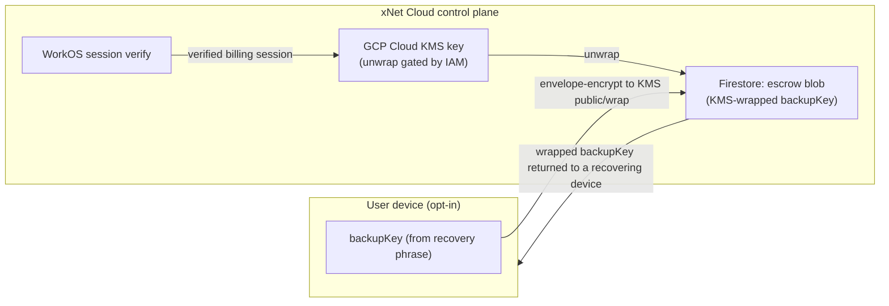

# P3.1 — Optional Account Recovery Escrow: Design Note

> **Status:** Design note (no code) — for a go/no-go decision before implementation.
> **Parent:** [exploration 0243](../explorations/0243_[_]_ACCOUNT_VALIDATION_AND_RECOVERY_BINDING_THE_PAYER_TO_THE_PASSKEY.md), item **P3.1**.
> **Date:** 2026-06-28

## Why this needs a decision, not just a checkbox

Everything else in 0243 is _non-custodial_: a lost passkey is recoverable only by
something the **user** holds — a recovery phrase (Phase 1), a synced passkey (P1.4), or
(future) another of their devices (Phase 2 ledger). xNet Cloud never holds anything that
can decrypt the user's data.

P3.1 deliberately breaks that for users who ask for it: it lets xNet Cloud reconstruct a
user's data-decryption capability after a verified billing (WorkOS) login, so they can
recover **without** having kept a phrase. That convenience has a hard cost — **it
collapses the security of the user's data down to the security of their WorkOS login.**
This note exists so we choose that tradeoff deliberately, pick the mitigations, and write
honest consent copy — before any escrow code ships.

## What exactly would be escrowed

Not the passkey, and not the raw phrase. The minimum that enables recovery is a key that
can re-derive the user's **X25519 data-decryption key** (the recipient key everything is
sealed to). Concretely: wrap the recovery-phrase-derived **backup key** (already in
`@xnetjs/identity` `seed-recovery.ts` as `bundle.backupKey`) and store the wrapped blob.
Recovering it reconstructs the same DID + X25519 → the user decrypts their own data,
exactly as the phrase path does today — but with the secret held by the cloud instead of
the user.

## Where the wrapped key lives (proposed)

The cloud runs on GCP (explorations 0174/0196). The natural primitives:

- **At rest:** the `backupKey` is envelope-encrypted under a **Cloud KMS** key and the
  ciphertext stored per-tenant in Firestore. The control plane never stores the plaintext.
- **Release:** the unwrap (KMS `decrypt`) is performed by the control plane **only** after
  it has verified a live WorkOS session for the tenant's `billingUserId`, then the
  plaintext `backupKey` is returned to the recovering device over TLS and never persisted
  there.

## What a verified WorkOS session unlocks — and the blast radius

A verified WorkOS session → unwrap → `backupKey` → the user's data-decryption key. So:

> **Anyone who can complete a WorkOS login for the account can decrypt that account's
> data.** That includes the legitimate user, **and** an attacker who phishes the email /
> SSO, performs a SIM-swap on an SMS factor, or coerces the provider — and xNet itself, or
> anyone who compromises the control plane's KMS IAM.

This is the entire point (recoverability) and the entire risk (custodial access). The
mitigations below shrink the blast radius; they do not remove it.

## Mitigations (pick a subset; A is the baseline, B+C strongly recommended)

| #     | Mitigation                                                                                                                | Effect                                                                       | Cost                                                                |
| ----- | ------------------------------------------------------------------------------------------------------------------------- | ---------------------------------------------------------------------------- | ------------------------------------------------------------------- |
| **A** | KMS-wrapped at rest + release only on verified WorkOS session                                                             | Baseline; nothing in Firestore is usable without KMS IAM                     | none beyond build                                                   |
| **B** | **Second factor the cloud never sees** — escrow is wrapped with `KMS ⊕ user-held escrow PIN/key`; recovery needs both     | Cloud alone (or a stolen WorkOS session) can't decrypt                       | user must keep a PIN — partial return of the "keep a secret" burden |
| **C** | **Delay + notify** — escrow release starts a timer (e.g. 72 h) and notifies every known device/email; the user can cancel | Defeats silent account-takeover; user sees + aborts an unauthorized recovery | recovery isn't instant                                              |
| **D** | **Step-up auth** on the WorkOS session before release (re-auth / WebAuthn)                                                | Raises the bar beyond a cached session cookie                                | extra prompt                                                        |
| **E** | **Audit + rate-limit** every escrow read; surface in the dashboard                                                        | Detection + forensics                                                        | logging                                                             |

Recommendation: **A + C + D + E by default, and offer B** for users who want
cloud-can't-read-alone. (B is the only option that keeps the cloud from being a single
point of compromise; C is the cheapest strong defense against account takeover and mirrors
Apple's Advanced-Data-Protection recovery-contact delay.)

## Consent UX (non-negotiable if we build it)

- **Off by default.** Never auto-enabled; never a nudge during onboarding.
- A dedicated Settings flow, separate from "Save recovery phrase", with copy that states
  plainly: _"Turning this on lets xNet Cloud restore your data from your login alone. That
  means we — and anyone who takes over your billing login — could access your data. This
  is the opposite of the privacy guarantee xNet normally gives you."_
- Require an explicit typed confirmation (not just a checkbox) to enable, and show the
  enabled state prominently with a one-click disable that deletes the escrow blob.
- Honour the humane-pattern lint (no dark patterns; the safe choice is the default).

## Proposed implementation surface (if approved)

- `@xnetjs/cloud`: an `EscrowStore` port (`putWrapped`, `getWrapped`, `delete`) + a KMS
  wrap/unwrap adapter (GCP KMS in prod, an in-memory fake for tests). Pure logic for the
  optional B-factor combine.
- `apps/cloud`: `POST /account/escrow` (enable, with the wrapped blob), `DELETE`
  (disable), and a gated `POST /account/escrow/recover` that verifies the WorkOS session,
  enforces delay/step-up, and returns the blob. Audit every call.
- `@xnetjs/identity`: a helper to produce/consume the escrow blob from a `DerivedKeyBundle`
  (reusing `createKeyBackup`/`recoverFromBackup`), plus the optional B-factor combine.
- Web: the consent + enable/disable + "recover via my login" flows.
- Tests: escrow unreachable without a verified session; absent unless explicitly enabled;
  disable deletes the blob; B-factor required when configured; delay/notify enforced.

## Open questions for the go/no-go

1. **Do we want the cloud to _ever_ be able to read data?** If "no, never", ship only
   option **B** (cloud-can't-read-alone) or don't build P3.1 at all.
2. **Enterprise vs. consumer.** Escrow is most defensible for _managed_ (enterprise/admin)
   accounts where an org already trusts an admin. Should P3.1 be enterprise-only?
3. **Jurisdiction / legal.** Holding a recoverable key changes our exposure to legal
   process. Worth a counsel note before enabling in production.
4. **Default mitigations.** Confirm A+C+D+E as the floor, and whether B is required (not
   just offered).

## Recommendation

Building P3.1 is reasonable **only** as: opt-in, off by default, with **B** offered and
**C+D+E** enforced, scoped first to enterprise/managed accounts, and with counsel sign-off
on the custody change. If the answer to open question #1 is "the cloud must never be able
to read user data," then P3.1 should ship as **B-only** (a user-held second factor the
cloud never sees) — which is barely "escrow" at all and arguably belongs as a Phase-1
social/hardware recovery method instead. Decide #1 first; everything else follows.
