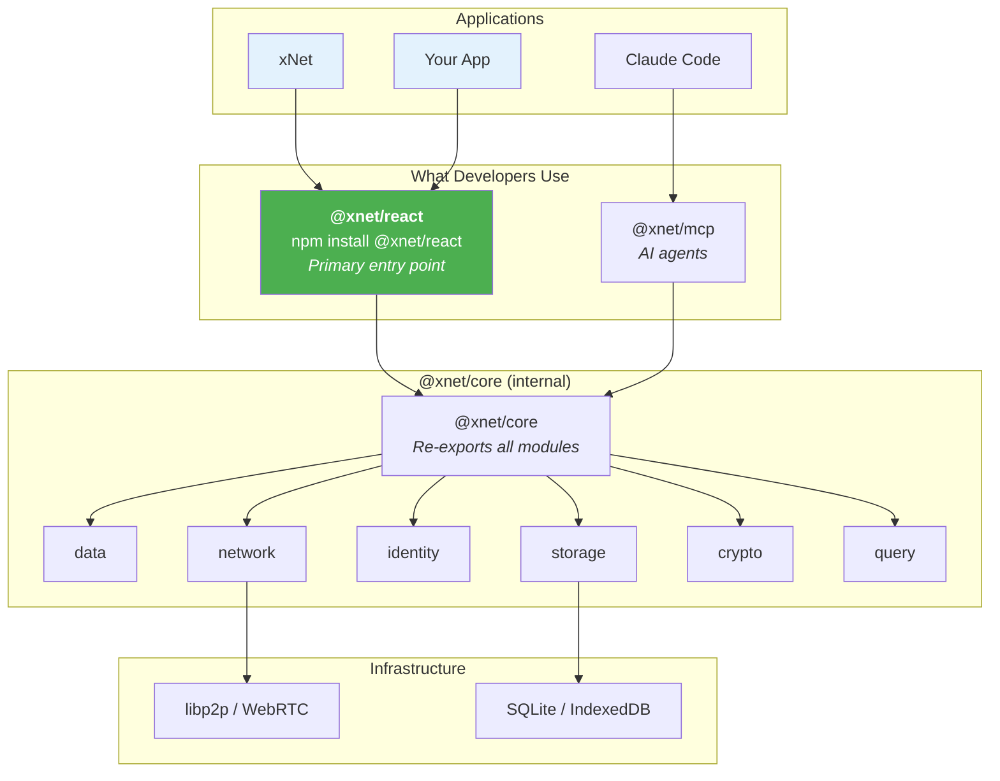
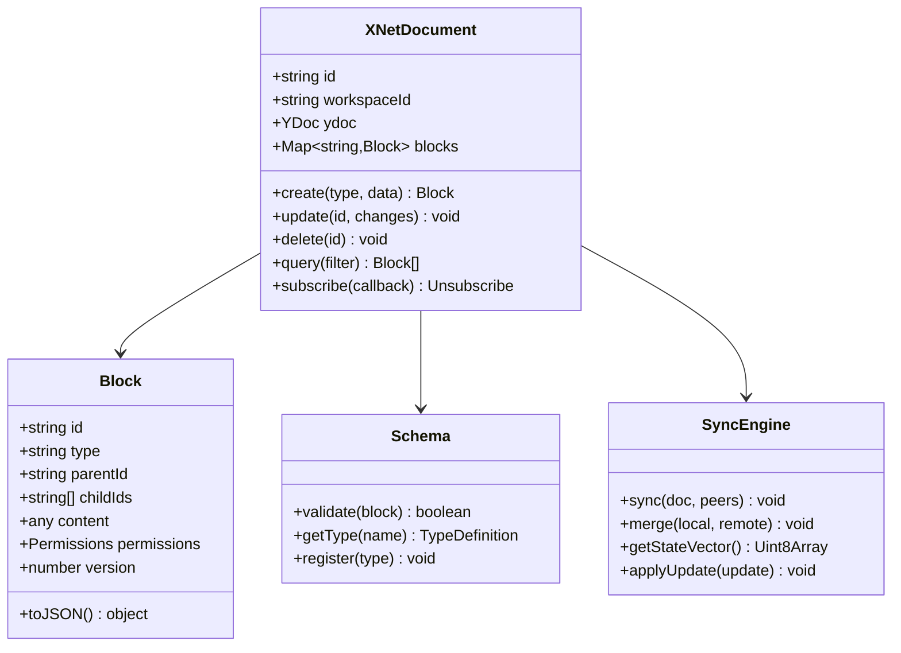
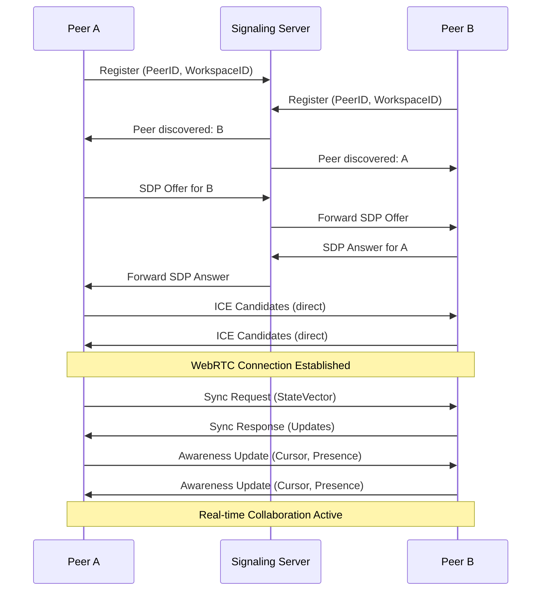
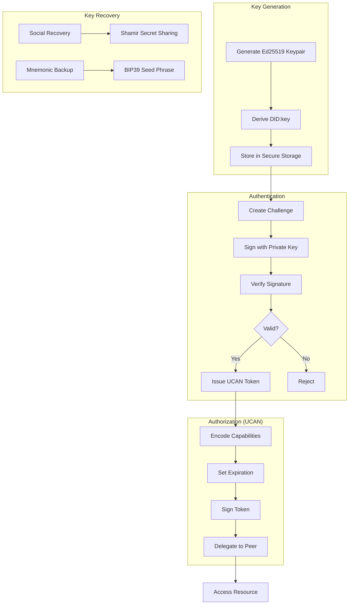
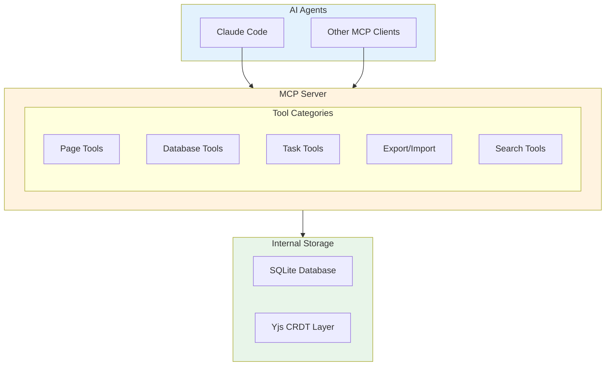
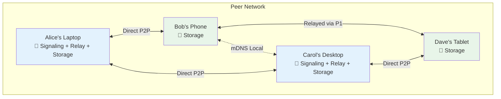
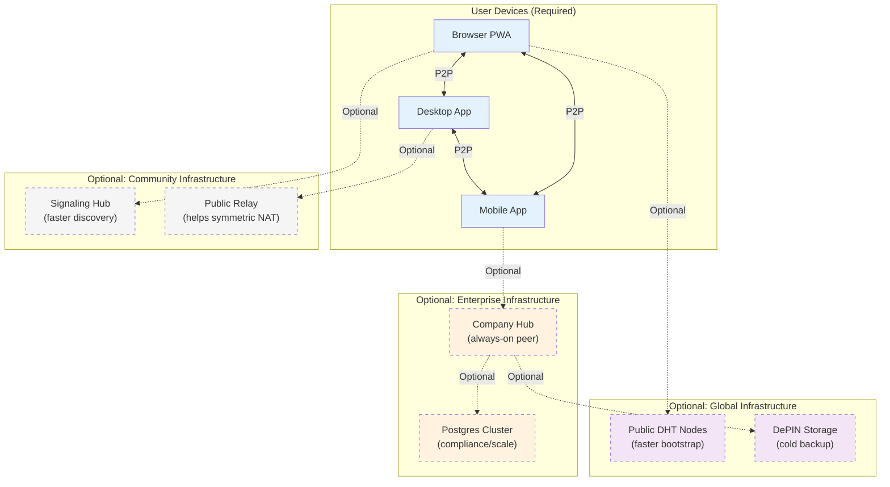

# 01: xNet Core Platform

> The foundational SDK and infrastructure for decentralized applications

[← Back to Plan Overview](./README.md)

---

## Overview

xNet is the foundational infrastructure that powers xNet and future decentralized applications. It must be developed **in parallel** with xNet, with xNet serving as the primary driver and validator of xNet's capabilities.

---

## Platform Architecture



**Key insight:** `@xnet/react` is the primary interface. It provides reactive hooks that replace data fetching libraries (like TanStack Query) and handle persistent/synced state. Use `useState` or a small Zustand store for ephemeral UI state. Most apps just need:

```bash
npm install @xnet/react
```

---

## Package Structure

### Primary Packages (What Users Install)

| Package         | Use Case                                     | Install                   |
| --------------- | -------------------------------------------- | ------------------------- |
| **@xnet/react** | React apps (recommended)                     | `npm install @xnet/react` |
| **@xnet/core**  | Non-React apps, Node.js, custom integrations | `npm install @xnet/core`  |

Most developers only need `@xnet/react`. It includes everything.

```
xnet/
├── packages/
│   │
│   │  ┌─────────────────────────────────────────────────────────┐
│   │  │  PRIMARY INTERFACE - Most users only need this         │
│   │  └─────────────────────────────────────────────────────────┘
│   │
│   ├── react/                    # @xnet/react - THE entry point for React
│   │   ├── src/
│   │   │   ├── provider.tsx      # <XNetProvider> - wrap your app
│   │   │   ├── hooks/
│   │   │   │   ├── useQuery.ts   # Reactive queries (replaces data fetching)
│   │   │   │   ├── useDocument.ts # Single doc subscription
│   │   │   │   ├── useMutation.ts # Write operations (replaces setState)
│   │   │   │   ├── useSync.ts    # Sync status
│   │   │   │   └── usePresence.ts # Real-time awareness
│   │   │   ├── cache.ts          # Query cache + invalidation
│   │   │   └── subscriptions.ts  # Reactive subscription manager
│   │   └── package.json          # depends on @xnet/core
│   │
│   │  ┌─────────────────────────────────────────────────────────┐
│   │  │  CORE - Internal modules (bundled into @xnet/core)     │
│   │  └─────────────────────────────────────────────────────────┘
│   │
│   ├── core/                     # @xnet/core - Unified core (re-exports all)
│   │   ├── src/
│   │   │   ├── client.ts         # XNetClient class
│   │   │   ├── database.ts       # Database operations
│   │   │   ├── workspace.ts      # Workspace management
│   │   │   └── index.ts          # Re-exports everything
│   │   └── package.json
│   │
│   │  ┌─────────────────────────────────────────────────────────┐
│   │  │  INTERNAL MODULES - Implementation details             │
│   │  └─────────────────────────────────────────────────────────┘
│   │
│   ├── data/                     # CRDT & Data Model
│   │   ├── src/
│   │   │   ├── document.ts       # CRDT document wrapper
│   │   │   ├── schema.ts         # JSON-LD schema definitions
│   │   │   ├── types.ts          # Block types (Page, Task, etc.)
│   │   │   ├── operations.ts     # CRDT operations
│   │   │   └── validation.ts     # Schema validation
│   │   └── package.json
│   │
│   ├── network/                  # P2P Layer
│   │   ├── src/
│   │   │   ├── node.ts           # libp2p node setup
│   │   │   ├── protocols/        # Custom protocols
│   │   │   │   ├── sync.ts       # Document sync protocol
│   │   │   │   ├── presence.ts   # Presence/awareness
│   │   │   │   └── discovery.ts  # Peer discovery
│   │   │   ├── transports/       # Transport adapters
│   │   │   │   ├── webrtc.ts
│   │   │   │   ├── websocket.ts
│   │   │   │   └── webtransport.ts
│   │   │   └── relay.ts          # Relay node support
│   │   └── package.json
│   │
│   ├── identity/                 # DID/Auth
│   │   ├── src/
│   │   │   ├── did.ts            # DID generation/resolution
│   │   │   ├── keys.ts           # Key management
│   │   │   ├── ucan.ts           # UCAN tokens
│   │   │   ├── session.ts        # Session management
│   │   │   └── recovery.ts       # Key recovery
│   │   └── package.json
│   │
│   ├── storage/                  # Persistence
│   │   ├── src/
│   │   │   ├── adapters/
│   │   │   │   ├── indexeddb.ts  # Browser storage
│   │   │   │   ├── sqlite.ts     # Desktop/mobile
│   │   │   │   └── memory.ts     # Testing
│   │   │   ├── blob.ts           # Binary blob storage
│   │   │   ├── backup.ts         # Export/import
│   │   │   └── sync.ts           # Storage sync
│   │   └── package.json
│   │
│   ├── crypto/                   # Security
│   │   ├── src/
│   │   │   ├── symmetric.ts      # AES-GCM encryption
│   │   │   ├── asymmetric.ts     # X25519/Ed25519
│   │   │   ├── signing.ts        # Digital signatures
│   │   │   ├── hashing.ts        # Content addressing
│   │   │   └── zk.ts             # zk-SNARK helpers (future)
│   │   └── package.json
│   │
│   ├── query/                    # Query Engine
│   │   ├── src/
│   │   │   ├── parser.ts         # SQL-like query parser
│   │   │   ├── executor.ts       # Local query execution
│   │   │   ├── federation.ts     # Distributed queries
│   │   │   ├── indexing.ts       # Index management
│   │   │   └── fulltext.ts       # Full-text search
│   │   └── package.json
│   │
│   └── vectors/                  # AI/Embeddings (optional)
│       ├── src/
│       │   ├── index.ts          # HNSW vector index
│       │   ├── embeddings.ts     # On-device embeddings
│       │   └── similarity.ts     # Similarity search
│       └── package.json
│
├── apps/
│   └── mcp/                      # @xnet/mcp - AI Access Layer
│       ├── src/
│       │   ├── index.ts          # MCP server entry point
│       │   ├── server.ts         # MCP server setup
│       │   ├── tools/
│       │   │   ├── pages.ts      # Page CRUD operations
│       │   │   ├── databases.ts  # Database queries
│       │   │   ├── tasks.ts      # Task operations
│       │   │   ├── search.ts     # Search tools
│       │   │   └── export.ts     # Export/import
│       │   └── converters/
│       │       ├── markdown.ts   # ProseMirror ↔ Markdown
│       │       └── json.ts       # Export formatting
│       └── package.json
│
├── infrastructure/
│   ├── signaling-server/         # WebRTC signaling
│   ├── relay-node/               # libp2p relay
│   ├── bootstrap-node/           # DHT bootstrap
│   └── storage-node/             # DePIN storage node
│
└── tools/
    ├── cli/                      # xnet CLI tool
    └── devtools/                 # Browser devtools extension
```

---

## Core Module Specifications

### @xnet/data - CRDT Engine

The data layer manages all document state using CRDTs for conflict-free synchronization.



**Key Responsibilities:**

- CRDT document lifecycle management
- JSON-LD schema validation
- Block hierarchy and relationships
- Change subscription and notifications

---

### @xnet/network - P2P Layer

Handles all peer-to-peer communication using libp2p and WebRTC.



**Key Responsibilities:**

- Peer discovery and connection management
- Document synchronization protocol
- Presence and awareness (cursors, online status)
- NAT traversal and relay fallback

---

### @xnet/identity - Self-Sovereign Identity

Manages decentralized identity using DIDs and UCAN tokens.



**Key Responsibilities:**

- DID generation and resolution (did:key method)
- Key pair management and secure storage
- UCAN token creation and verification
- Key recovery mechanisms

---

### @xnet/storage - Persistence

Provides durable storage across platforms with multiple backend adapters.

| Backend   | Platform       | Durability | Use Case              |
| --------- | -------------- | ---------- | --------------------- |
| SQLite    | Desktop/Mobile | High       | Primary storage       |
| OPFS      | Web (Modern)   | Medium     | Better than IndexedDB |
| IndexedDB | Web (Legacy)   | Low        | Fallback              |
| Memory    | Testing        | None       | Unit tests            |

**See also:** [Persistence Architecture](../PERSISTENCE_ARCHITECTURE.md)

---

### @xnet/crypto - Encryption

Handles all cryptographic operations for security.

| Operation             | Algorithm   | Use Case            |
| --------------------- | ----------- | ------------------- |
| Symmetric Encryption  | AES-256-GCM | Document content    |
| Asymmetric Encryption | X25519      | Key exchange        |
| Digital Signatures    | Ed25519     | Authentication      |
| Hashing               | BLAKE3      | Content addressing  |
| Key Derivation        | Argon2id    | Password-based keys |

---

### @xnet/query - Query Engine

SQL-like query interface over CRDT documents.

**Supported Operations:**

- Filter by property values
- Full-text search
- Sorting and pagination
- Aggregate functions
- Federated queries across peers (future)

---

### @xnet/vectors - AI/Embeddings

On-device vector search for semantic capabilities.

| Feature      | Implementation         |
| ------------ | ---------------------- |
| Vector Index | HNSW algorithm         |
| Embeddings   | TensorFlow.js / MiniLM |
| Similarity   | Cosine distance        |

---

### @xnet/mcp - AI Access Layer

MCP (Model Context Protocol) server enabling AI agents to interact with xNet data.



| Tool Category | Operations                           | Use Case               |
| ------------- | ------------------------------------ | ---------------------- |
| **Pages**     | list, get, create, update, delete    | Wiki page management   |
| **Databases** | schema, query, create_record, update | Structured data access |
| **Tasks**     | list, create, update                 | Task management        |
| **Search**    | search, get_backlinks                | Content discovery      |
| **Export**    | export_workspace, import_file        | Backup and interop     |

**Key Design Decisions:**

- **MCP-only access**: AI interacts via tools, not files
- **Markdown content**: Page content exposed as Markdown for AI readability
- **Export for portability**: On-demand export to Markdown/JSON for backups
- **Local-first**: MCP server runs locally, no auth needed for single-user

**See also:** [AI & MCP Interface](./09-ai-mcp-interface.md) for full tool specifications.

---

## Infrastructure: Fully P2P by Design

**Core Principle**: xNet requires **zero central infrastructure**. Laptops and smartphones are sufficient. Datacenters are optional optimizations for institutions with scale needs.

### Pure P2P Mode (No Servers)



Every peer can serve infrastructure roles:

| Role          | Any Peer Can Do It | How                                               |
| ------------- | ------------------ | ------------------------------------------------- |
| **Signaling** | Yes                | Relay SDP offers through DHT or other peers       |
| **Bootstrap** | Yes                | Cache known peers, share peer lists               |
| **Relay**     | Yes                | libp2p circuit relay (any peer with public IP)    |
| **Storage**   | Yes                | Local storage is primary; peers backup each other |

### How Each Layer Works Without Servers

#### 1. Discovery (No Bootstrap Server Needed)

```typescript
interface PeerDiscovery {
  // Local network - works immediately, no internet needed
  mdns: {
    enabled: true
    serviceName: '_xnet._tcp.local'
  }

  // Cached peers from previous sessions
  cachedPeers: PeerInfo[]

  // Manual peer exchange (QR code, link, paste)
  manualAdd(multiaddr: string): Promise<void>

  // DHT - once connected to ANY peer, find more
  dht: {
    enabled: true
    // No hardcoded bootstrap - use cached or discovered peers
    bootstrap: 'from-cache' | 'from-mdns' | 'manual'
  }

  // Pubsub for workspace announcements
  pubsub: {
    topic: `xnet/workspace/${workspaceId}`
  }
}
```

**Discovery flow**:

1. Check local network (mDNS) → instant for same WiFi
2. Try cached peers from last session
3. If no cached peers, user shares a peer address (QR/link)
4. Once connected to 1 peer, DHT finds more

#### 2. Signaling (No Signaling Server Needed)

Traditional WebRTC needs a server to exchange SDP offers. xNet alternatives:

```typescript
interface P2PSignaling {
  // Option 1: DHT-based signaling
  dht: {
    // Store SDP offer at DHT key derived from peer IDs
    putOffer(targetPeerId: string, sdp: RTCSessionDescription): Promise<void>
    getOffer(fromPeerId: string): Promise<RTCSessionDescription | null>
  }

  // Option 2: Relay through mutual peer
  relay: {
    // Ask a connected peer to forward signaling messages
    sendVia(relayPeer: PeerId, target: PeerId, message: SignalingMessage): Promise<void>
  }

  // Option 3: Out-of-band (QR code, copy-paste)
  outOfBand: {
    exportOffer(): string // Base64 encoded SDP
    importAnswer(answer: string): Promise<void>
  }

  // Option 4: Local network broadcast
  localBroadcast: {
    announceOffer(workspaceId: string, sdp: RTCSessionDescription): void
  }
}
```

#### 3. NAT Traversal (No TURN Server Needed)

```typescript
interface NATTraversal {
  // Most connections work with STUN (free, stateless)
  stun: {
    servers: [
      'stun:stun.l.google.com:19302', // Public STUN (free)
      'stun:stun.cloudflare.com:3478'
    ]
  }

  // For symmetric NAT: any peer with public IP can relay
  circuitRelay: {
    // Peers automatically volunteer if they have public IP
    autoRelay: true
    // Limit relay bandwidth per peer
    maxRelayBandwidth: '1MB/s'
  }

  // Hole punching success rate by NAT type
  // Full Cone: 95%+
  // Restricted: 80%+
  // Port Restricted: 60%+
  // Symmetric: 10% (needs relay)
}
```

#### 4. Storage (Local-First, Peer Backup)

```typescript
interface P2PStorage {
  // Primary: local device
  local: {
    adapter: 'sqlite' | 'indexeddb' | 'opfs'
    quota: 'unlimited' // User's device
  }

  // Secondary: replicate to peers
  peerBackup: {
    enabled: true
    replicationFactor: 3 // Store on 3 peers minimum
    encryption: 'e2e' // Peers can't read your data
  }

  // Optional: cloud/DePIN for institutions
  cloud?: CloudBackupConfig
}
```

### Hybrid Mode (Optional Infrastructure)

Institutions can add infrastructure for performance, not for functionality:



### When to Add Infrastructure

| Scenario                  | Pure P2P Works?     | Optional Infra Helps?    |
| ------------------------- | ------------------- | ------------------------ |
| Same WiFi collaboration   | Yes (mDNS)          | No                       |
| Friends across internet   | Yes (cached peers)  | Signaling hub (faster)   |
| Team with mixed NAT types | Mostly (hole punch) | Relay node (reliability) |
| Enterprise compliance     | Yes                 | Postgres (audit logs)    |
| Always-available sync     | Needs 1 peer online | Company hub (24/7 peer)  |
| 100TB+ datasets           | No                  | Datacenter storage       |
| Global search             | No                  | Search index cluster     |

### Component Roles

| Component            | Required? | Who Runs It        | Purpose                          |
| -------------------- | --------- | ------------------ | -------------------------------- |
| **User Device**      | Yes       | Everyone           | Primary node, storage, can relay |
| **Signaling Hub**    | No        | Community/Company  | Faster WebRTC handshake          |
| **Relay Node**       | No        | Volunteers/Company | Help symmetric NAT users         |
| **Always-On Peer**   | No        | Company            | 24/7 availability                |
| **Postgres Cluster** | No        | Enterprise         | Compliance, scale                |
| **Search Index**     | No        | Large orgs         | Cross-workspace search           |
| **DePIN Storage**    | No        | Network            | Immutable backups                |

---

## SDK Usage Example

```typescript
import { XNet } from '@xnet/sdk'

// Initialize xNet client
const xnet = new XNet({
  identity: await XNet.createIdentity(), // or load existing
  storage: 'indexeddb',
  signaling: ['wss://signal1.xnet.io', 'wss://signal2.xnet.io']
})

// Create or join a workspace
const workspace = await xnet.workspace.create({
  name: 'My Team Workspace',
  encryption: 'e2e' // end-to-end encrypted
})

// Create a document
const doc = await workspace.document.create({
  type: 'Page',
  content: {
    title: 'Welcome',
    body: { type: 'doc', content: [] }
  }
})

// Subscribe to real-time updates
doc.subscribe((changes) => {
  console.log('Document updated:', changes)
})

// Invite collaborators
const invite = await workspace.createInvite({
  permissions: ['read', 'write'],
  expiresIn: '7d'
})
console.log('Share this link:', invite.url)

// Query documents
const pages = await workspace.query({
  type: 'Page',
  where: { 'content.title': { $contains: 'Welcome' } },
  orderBy: { updatedAt: 'desc' },
  limit: 10
})
```

---

## Next Steps

- [Development Timeline](./02-development-timeline.md) - When to build each package
- [Phase 1: Wiki & Tasks](./03-phase-1-wiki-tasks.md) - First xNet features
- [Appendix: Code Samples](./08-appendix-code-samples.md) - Detailed implementations

---

[← Back to Plan Overview](./README.md) | [Next: Development Timeline →](./02-development-timeline.md)
