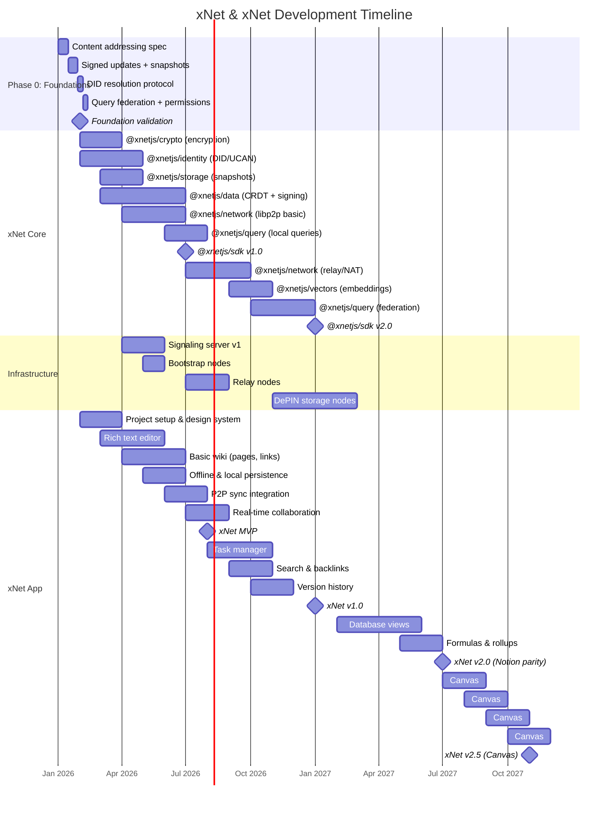
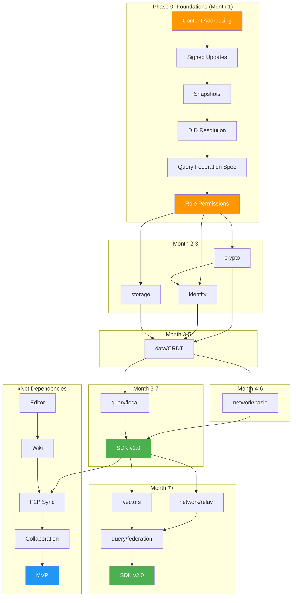
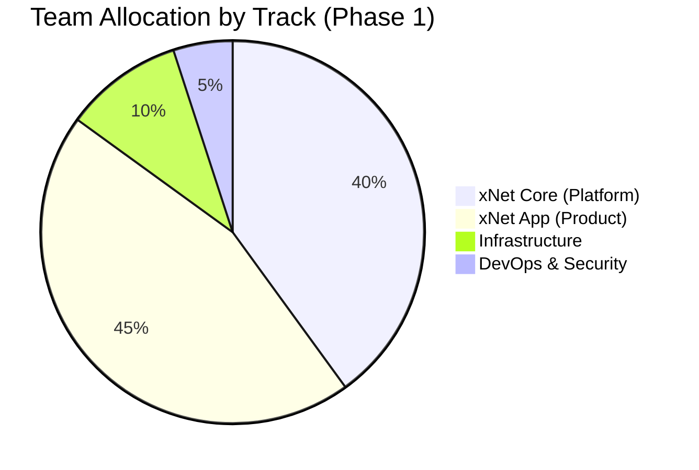

# 02: Development Timeline

> Parallel development tracks, dependencies, and milestones

[← Back to Plan Overview](./README.md) | [Previous: xNet Core Platform](./01-xnet-core-platform.md)

---

## Overview

xNet and xNet are developed in parallel with carefully mapped dependencies. The xNet SDK provides the foundation, while xNet drives requirements and validates capabilities.

**Critical:** Phase 0 (Foundations) must complete before Phase 1 implementation begins. This 4-week investment prevents 9+ months of rework later. See [Foundation Requirements](./17-foundation-requirements.md).

---

## Parallel Development Tracks

---

## Dependency Map

Understanding dependencies is critical for parallel development. **Phase 0 foundations must complete before any package implementation begins.**

### Dependency Rules

0. **Phase 0 Foundations** - Must complete before any package work begins (see [Foundation Requirements](./17-foundation-requirements.md))
1. **@xnetjs/crypto** depends on content addressing spec from Phase 0
2. **@xnetjs/identity** depends on crypto + DID resolution spec
3. **@xnetjs/storage** depends on snapshot spec from Phase 0
4. **@xnetjs/data** depends on crypto, identity, storage, and signed update spec
5. **@xnetjs/network** depends on data for sync protocol
6. **@xnetjs/query** depends on data + query federation spec
7. **@xnetjs/sdk** bundles everything for v1.0 release

---

## Team Allocation

| Track               | Engineers | Focus                                 |
| ------------------- | --------- | ------------------------------------- |
| **xNet Core**       | 3-4       | SDK packages, protocols, cryptography |
| **xNet App**        | 4-5       | UI components, features, UX           |
| **Infrastructure**  | 1         | Signaling, relay, bootstrap nodes     |
| **DevOps/Security** | 1         | CI/CD, audits, monitoring             |

### Team Structure by Phase

| Phase        | Total Team | xNet | xNet | Infra | DevOps |
| ------------ | ---------- | ---- | ---- | ----- | ------ |
| 1 (0-12 mo)  | 8-10       | 3-4  | 4-5  | 1     | 1      |
| 2 (12-24 mo) | 12-15      | 3-4  | 7-9  | 1     | 1      |
| 3 (24+ mo)   | 20+        | 5+   | 12+  | 2     | 2      |

---

## Integration Milestones

Critical checkpoints where xNet capabilities enable xNet features.

| Milestone | xNet Dependency     | xNet Feature                    | Target   |
| --------- | ------------------- | ------------------------------- | -------- |
| **M0**    | Phase 0 Foundations | Specs validated, ready to build | Month 1  |
| **M1**    | @xnetjs/storage     | Offline persistence             | Month 4  |
| **M2**    | @xnetjs/data        | CRDT-based documents            | Month 5  |
| **M3**    | @xnetjs/identity    | User accounts, workspaces       | Month 5  |
| **M4**    | @xnetjs/network     | P2P document sync               | Month 6  |
| **M5**    | @xnetjs/crypto      | E2E encryption                  | Month 7  |
| **M6**    | @xnetjs/sdk v1.0    | **xNet MVP**                    | Month 8  |
| **M7**    | @xnetjs/query       | Full-text search                | Month 9  |
| **M8**    | @xnetjs/vectors     | Semantic search                 | Month 11 |
| **M9**    | @xnetjs/sdk v2.0    | **xNet v1.0**                   | Month 13 |
| **M10**   | @xnetjs/data        | Database views, formulas        | Month 19 |
| **M11**   | @xnetjs/sdk v2.1    | **xNet v2.0** (Notion parity)   | Month 19 |
| **M12**   | @xnetjs/canvas      | Spatial indexing, auto-layout   | Month 21 |
| **M13**   | @xnetjs/sdk v2.5    | **xNet v2.5** (Infinite Canvas) | Month 23 |

---

## Sprint Breakdown

2-week sprint cadence with clear deliverables.

### Phase 0: Foundation Sprints (Weeks 1-4)

| Sprint | Duration  | Focus                      | Deliverable                                      |
| ------ | --------- | -------------------------- | ------------------------------------------------ |
| 0-1    | Weeks 1-2 | Content Addressing         | BLAKE3 hashing, Merkle trees, CID format         |
| 0-2    | Weeks 3-4 | Signed Updates + Snapshots | SignedUpdate type, snapshot strategy, compaction |
| -      | Week 4    | **Foundation Validation**  | All specs validated, ready for implementation    |

> **Gate:** Phase 0 must pass validation criteria in [Foundation Requirements](./17-foundation-requirements.md) before Phase 1 begins.

### Phase 1: xNet Core Sprints (Weeks 5-40)

| Sprint | Duration    | Package          | Deliverable                              |
| ------ | ----------- | ---------------- | ---------------------------------------- |
| 1-2    | Weeks 5-8   | @xnetjs/crypto   | Symmetric/asymmetric encryption, signing |
| 3-4    | Weeks 9-12  | @xnetjs/identity | DID generation, key management           |
| 5-6    | Weeks 13-16 | @xnetjs/storage  | IndexedDB adapter, blob storage          |
| 7-10   | Weeks 17-24 | @xnetjs/data     | CRDT engine, schema validation           |
| 11-14  | Weeks 25-32 | @xnetjs/network  | libp2p node, WebRTC transport            |
| 15-16  | Weeks 33-36 | @xnetjs/query    | Local query engine, FTS                  |
| 17-18  | Weeks 37-40 | @xnetjs/sdk      | SDK v1.0 integration                     |

### Phase 1: xNet App Sprints (Weeks 5-52)

| Sprint | Duration    | Feature  | Deliverable                          |
| ------ | ----------- | -------- | ------------------------------------ |
| 1-2    | Weeks 5-8   | Setup    | Project structure, design system     |
| 3-5    | Weeks 9-14  | Editor   | Rich text with Tiptap, markdown      |
| 6-8    | Weeks 15-20 | Wiki     | Page hierarchy, wikilinks, backlinks |
| 9-10   | Weeks 21-24 | Offline  | Local persistence integration        |
| 11-12  | Weeks 25-28 | Sync     | P2P sync integration                 |
| 13-14  | Weeks 29-32 | Collab   | Real-time collaboration, presence    |
| -      | Week 32     | **MVP**  | Internal release                     |
| 15-17  | Weeks 33-38 | Tasks    | Task manager, Kanban boards          |
| 18-19  | Weeks 39-42 | Search   | Full-text search, backlinks panel    |
| 20-22  | Weeks 43-48 | History  | Version history, restore             |
| 23-24  | Weeks 49-52 | Polish   | Bug fixes, performance, testing      |
| -      | Week 52     | **v1.0** | Public release                       |

---

## Infrastructure Timeline

| Component           | Start    | Duration | Priority      |
| ------------------- | -------- | -------- | ------------- |
| Signaling Server v1 | Month 4  | 2 months | Critical (P0) |
| Bootstrap Nodes     | Month 5  | 1 month  | Critical (P0) |
| Relay Nodes         | Month 7  | 2 months | High (P1)     |
| DePIN Storage       | Month 11 | 4 months | Medium (P2)   |

### Signaling Server Requirements

- **Scale**: 10k concurrent connections initially
- **Redundancy**: 3 geographic regions
- **Protocol**: WebSocket with fallback to HTTP long-polling
- **Monitoring**: Connection metrics, latency tracking

---

## Risk Checkpoints

| Month | Checkpoint                | Risk Assessment                                                                                             |
| ----- | ------------------------- | ----------------------------------------------------------------------------------------------------------- |
| 1     | **Foundation Validation** | Do specs meet all validation criteria? See [17-foundation-requirements.md](./17-foundation-requirements.md) |
| 3     | Crypto + Identity         | Can we generate/manage keys securely?                                                                       |
| 5     | CRDT Engine               | Does Yjs meet our performance needs?                                                                        |
| 6     | P2P Networking            | Can we establish connections reliably?                                                                      |
| 7     | SDK v1.0                  | Is the API usable for xNet?                                                                                 |
| 8     | MVP                       | Does the core experience work offline?                                                                      |
| 11    | Sync at Scale             | How does P2P perform with 10+ peers?                                                                        |
| 13    | v1.0 Release              | Are we production-ready?                                                                                    |

---

## Next Steps

1. **Complete Phase 0 Foundations** - See [Foundation Requirements](./17-foundation-requirements.md)
2. [Phase 1: Wiki & Tasks](./03-phase-1-wiki-tasks.md) - Detailed Phase 1 implementation
3. [Engineering Practices](./06-engineering-practices.md) - Sprint processes and CI/CD

---

[← Previous: xNet Core Platform](./01-xnet-core-platform.md) | [Next: Phase 1 →](./03-phase-1-wiki-tasks.md)
