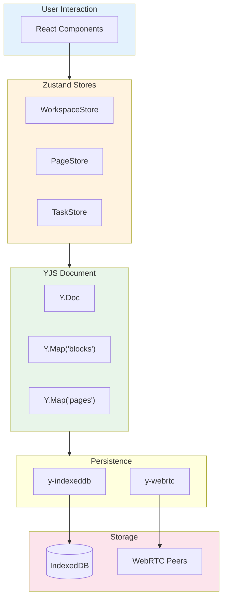

# 08: Appendix - Code Samples

> Reference implementations and technical specifications

[← Back to Plan Overview](./README.md) | [Previous: Monetization](./07-monetization-adoption.md)

---

## Overview

This appendix contains detailed code samples, architecture diagrams, and technical specifications referenced throughout the implementation plan.

---

## Block Schema

Core data model for all content in xNet. Designed for forward-compatibility with versioning built in from day 1.

**See also**: [Versioning Strategy](./11-versioning-strategy.md) for design principles.

```typescript
// packages/core/src/schema/block.ts

import { z } from 'zod'

// ============================================
// PERMISSION SCHEMA (Extensible from day 1)
// ============================================
// Supports future: roles, conditions, time-limits
export const PermissionEntrySchema = z.object({
  principalId: z.string(),
  principalType: z.enum(['user', 'role', 'group', 'anyone']),
  capabilities: z.array(z.enum(['read', 'write', 'admin', 'share'])),

  // Reserved for future conditions (time-limited, IP-based, etc.)
  conditions: z
    .object({
      expiresAt: z.string().datetime().optional()
    })
    .passthrough()
    .optional(),

  metadata: z.record(z.unknown()).optional()
})

export const PermissionsSchema = z.object({
  version: z.number().default(1),
  entries: z.array(PermissionEntrySchema),

  // Legacy format support (for migration from v0)
  __legacyFormat: z
    .object({
      read: z.array(z.string()),
      write: z.array(z.string()),
      admin: z.array(z.string())
    })
    .optional()
})

// ============================================
// BLOCK SCHEMA (Core, versioned)
// ============================================
export const BlockSchema = z
  .object({
    '@id': z.string().uuid(),
    '@type': z.string(),
    '@context': z.string().optional(),

    createdAt: z.string().datetime(),
    updatedAt: z.string().datetime(),
    createdBy: z.string(), // DID

    parent: z.string().uuid().nullable(),
    children: z.array(z.string().uuid()),

    permissions: PermissionsSchema,

    version: z.number(),

    // ============================================
    // VERSIONING FIELDS (Required from day 1)
    // ============================================
    __schemaVersion: z.number().default(1),

    // Reserved for future extensions (plugins, custom fields)
    __extensions: z.record(z.unknown()).optional(),

    // Track deprecated fields during migrations
    __deprecated: z.record(z.unknown()).optional(),

    // Feature flags for progressive rollout
    __features: z.array(z.string()).optional()
  })
  .passthrough() // Allow unknown fields to pass through

// ============================================
// PAGE SCHEMA
// ============================================
export const PageSchema = BlockSchema.extend({
  '@type': z.literal('Page'),

  title: z.string(),
  icon: z.string().optional(),
  cover: z.string().optional(),

  body: z.any(), // ProseMirror document

  tags: z.array(z.string()),
  aliases: z.array(z.string()),

  links: z.object({
    outgoing: z.array(z.string().uuid()),
    incoming: z.array(z.string().uuid())
  })
})

// ============================================
// TASK SCHEMA
// ============================================
export const TaskSchema = BlockSchema.extend({
  '@type': z.literal('Task'),

  title: z.string(),
  description: z.any(), // ProseMirror document

  status: z.enum(['todo', 'in_progress', 'done', 'cancelled']),
  priority: z.enum(['low', 'medium', 'high', 'urgent']),

  dueDate: z.string().datetime().nullable(),
  startDate: z.string().datetime().nullable(),

  assignees: z.array(z.string()), // DIDs
  labels: z.array(z.string()),

  checklist: z.array(
    z.object({
      id: z.string().uuid(),
      text: z.string(),
      completed: z.boolean()
    })
  ),

  linkedPages: z.array(z.string().uuid())
})

export type Block = z.infer<typeof BlockSchema>
export type Page = z.infer<typeof PageSchema>
export type Task = z.infer<typeof TaskSchema>

// ============================================
// DOCUMENT METADATA (Required in every Y.Doc)
// ============================================
export interface DocumentMetadata {
  schemaVersion: number
  formatVersion: string
  createdAt: string
  migrations: Array<{
    from: number
    to: number
    appliedAt: string
    appliedBy: string
  }>
  features: string[]
  minClientVersion?: string
}

export function initializeDocument(ydoc: Y.Doc): void {
  const meta = ydoc.getMap('__meta')
  meta.set('schemaVersion', 1)
  meta.set('formatVersion', '1.0.0')
  meta.set('createdAt', new Date().toISOString())
  meta.set('migrations', [])
  meta.set('features', [])
}
```

---

## CRDT Block Implementation

Basic CRDT wrapper using Yjs.

```typescript
// packages/core/src/crdt/block.ts

import * as Y from 'yjs'

export class CRDTBlock<T extends Record<string, any>> {
  private ymap: Y.Map<any>

  constructor(ydoc: Y.Doc, blockId: string, initialData?: T) {
    this.ymap = ydoc.getMap(`block:${blockId}`)

    if (initialData) {
      ydoc.transact(() => {
        for (const [key, value] of Object.entries(initialData)) {
          this.ymap.set(key, value)
        }
      })
    }
  }

  get<K extends keyof T>(key: K): T[K] {
    return this.ymap.get(key as string)
  }

  set<K extends keyof T>(key: K, value: T[K]): void {
    this.ymap.set(key as string, value)
  }

  update(updates: Partial<T>): void {
    this.ymap.doc?.transact(() => {
      for (const [key, value] of Object.entries(updates)) {
        this.ymap.set(key, value)
      }
    })
  }

  toJSON(): T {
    return this.ymap.toJSON() as T
  }

  observe(callback: (changes: Map<string, any>) => void): () => void {
    const handler = (event: Y.YMapEvent<any>) => {
      callback(event.changes.keys)
    }
    this.ymap.observe(handler)
    return () => this.ymap.unobserve(handler)
  }
}

// Usage
interface PageData {
  '@id': string
  '@type': 'Page'
  title: string
  content: any
  updatedAt: string
}

const ydoc = new Y.Doc()
const page = new CRDTBlock<PageData>(ydoc, 'page-123', {
  '@id': 'page-123',
  '@type': 'Page',
  title: 'My First Page',
  content: { type: 'doc', content: [] },
  updatedAt: new Date().toISOString()
})

// Observe changes
page.observe((changes) => {
  console.log('Page changed:', changes)
})

// Update page
page.set('title', 'Updated Title')
```

---

## Tiptap Wikilink Extension

Custom ProseMirror extension for `[[wikilink]]` syntax.

```typescript
// packages/editor/src/extensions/wikilink.ts

import { Node, mergeAttributes } from '@tiptap/core'
import { Plugin, PluginKey } from '@tiptap/pm/state'
import { Decoration, DecorationSet } from '@tiptap/pm/view'

export interface WikilinkOptions {
  onNavigate: (pageTitle: string) => void
  onSearch: (query: string) => Promise<string[]>
}

export const Wikilink = Node.create<WikilinkOptions>({
  name: 'wikilink',
  group: 'inline',
  inline: true,
  atom: true,

  addOptions() {
    return {
      onNavigate: () => {},
      onSearch: async () => []
    }
  },

  addAttributes() {
    return {
      title: {
        default: null,
        parseHTML: (element) => element.getAttribute('data-title'),
        renderHTML: (attributes) => ({ 'data-title': attributes.title })
      },
      pageId: {
        default: null,
        parseHTML: (element) => element.getAttribute('data-page-id'),
        renderHTML: (attributes) => ({ 'data-page-id': attributes.pageId })
      }
    }
  },

  parseHTML() {
    return [{ tag: 'span[data-wikilink]' }]
  },

  renderHTML({ HTMLAttributes }) {
    return [
      'span',
      mergeAttributes(HTMLAttributes, {
        'data-wikilink': '',
        class: 'wikilink'
      }),
      `[[${HTMLAttributes.title}]]`
    ]
  },

  addProseMirrorPlugins() {
    const options = this.options

    return [
      new Plugin({
        key: new PluginKey('wikilinkInput'),
        props: {
          handleTextInput(view, from, to, text) {
            // Detect [[ input to trigger autocomplete
            const { state } = view
            const $from = state.doc.resolve(from)
            const textBefore = $from.parent.textBetween(
              Math.max(0, $from.parentOffset - 1),
              $from.parentOffset,
              null,
              '\ufffc'
            )

            if (textBefore === '[' && text === '[') {
              // Show autocomplete popup
              // Implementation depends on your UI framework
              return false
            }

            return false
          }
        }
      })
    ]
  },

  addNodeView() {
    return ({ node, HTMLAttributes }) => {
      const dom = document.createElement('span')
      dom.className = 'wikilink'
      dom.textContent = `[[${node.attrs.title}]]`
      dom.setAttribute('data-wikilink', '')

      dom.addEventListener('click', (e) => {
        e.preventDefault()
        this.options.onNavigate(node.attrs.title)
      })

      return { dom }
    }
  }
})
```

---

## libp2p Configuration

P2P node setup for browser environment.

```typescript
// packages/network/src/node.ts

import { createLibp2p } from 'libp2p'
import { webRTC, webRTCDirect } from '@libp2p/webrtc'
import { webSockets } from '@libp2p/websockets'
import { noise } from '@chainsafe/libp2p-noise'
import { yamux } from '@chainsafe/libp2p-yamux'
import { bootstrap } from '@libp2p/bootstrap'
import { kadDHT } from '@libp2p/kad-dht'
import { gossipsub } from '@chainsafe/libp2p-gossipsub'
import { circuitRelayTransport } from '@libp2p/circuit-relay-v2'
import { identify } from '@libp2p/identify'

export async function createNode(config: NodeConfig) {
  const node = await createLibp2p({
    addresses: {
      listen: ['/webrtc']
    },
    transports: [webSockets(), webRTC(), webRTCDirect(), circuitRelayTransport()],
    connectionEncrypters: [noise()], // Note: plural form in libp2p v3.0.0+
    streamMuxers: [yamux()],
    peerDiscovery: [
      bootstrap({
        list: config.bootstrapNodes
      })
    ],
    services: {
      identify: identify(), // Required for GossipSub and DHT
      dht: kadDHT({
        clientMode: true
      }),
      pubsub: gossipsub({
        emitSelf: false,
        gossipIncoming: true,
        fallbackToFloodsub: true
      })
    }
  })

  await node.start()

  // Subscribe to workspace topic
  node.services.pubsub.subscribe(`workspace:${config.workspaceId}`)

  node.services.pubsub.addEventListener('message', (event) => {
    if (event.detail.topic === `workspace:${config.workspaceId}`) {
      config.onMessage(event.detail.data)
    }
  })

  return {
    node,
    broadcast: (data: Uint8Array) => {
      node.services.pubsub.publish(`workspace:${config.workspaceId}`, data)
    },
    stop: () => node.stop()
  }
}

interface NodeConfig {
  workspaceId: string
  bootstrapNodes: string[]
  onMessage: (data: Uint8Array) => void
}
```

---

## P2P Connection Manager

WebRTC connection handling.

```typescript
// packages/network/src/connection-manager.ts

export class ConnectionManager {
  private connections: Map<string, RTCPeerConnection> = new Map()
  private dataChannels: Map<string, RTCDataChannel> = new Map()

  async connect(peerId: string, signalingChannel: SignalingChannel): Promise<void> {
    const pc = new RTCPeerConnection({
      iceServers: [
        { urls: 'stun:stun.l.google.com:19302' },
        { urls: 'stun:stun1.l.google.com:19302' }
      ]
    })

    this.connections.set(peerId, pc)

    // Create data channel
    const dc = pc.createDataChannel('xnet', { ordered: true })

    dc.onopen = () => {
      console.log(`Connected to ${peerId}`)
      this.dataChannels.set(peerId, dc)
    }

    dc.onmessage = (event) => {
      this.handleMessage(peerId, event.data)
    }

    // ICE candidate handling
    pc.onicecandidate = (event) => {
      if (event.candidate) {
        signalingChannel.send(peerId, {
          type: 'ice-candidate',
          candidate: event.candidate
        })
      }
    }

    // Create and send offer
    const offer = await pc.createOffer()
    await pc.setLocalDescription(offer)

    signalingChannel.send(peerId, {
      type: 'offer',
      sdp: offer.sdp
    })

    // Handle answer
    signalingChannel.onMessage(peerId, async (message) => {
      if (message.type === 'answer') {
        await pc.setRemoteDescription({
          type: 'answer',
          sdp: message.sdp
        })
      } else if (message.type === 'ice-candidate') {
        await pc.addIceCandidate(message.candidate)
      }
    })
  }

  send(peerId: string, data: any): void {
    const dc = this.dataChannels.get(peerId)
    if (dc?.readyState === 'open') {
      dc.send(JSON.stringify(data))
    }
  }

  broadcast(data: any): void {
    const message = JSON.stringify(data)
    for (const dc of this.dataChannels.values()) {
      if (dc.readyState === 'open') {
        dc.send(message)
      }
    }
  }

  private handleMessage(peerId: string, data: string): void {
    const message = JSON.parse(data)
    console.log(`Message from ${peerId}:`, message)
  }
}

interface SignalingChannel {
  send(peerId: string, message: any): void
  onMessage(peerId: string, handler: (message: any) => void): void
}
```

---

## Search Index

Full-text search with Lunr.js.

```typescript
// packages/core/src/search/index.ts

import lunr from 'lunr'

export class SearchIndex {
  private index: lunr.Index | null = null
  private documents: Map<string, SearchDocument> = new Map()
  private dirty = false

  constructor() {
    this.rebuild()
  }

  add(doc: SearchDocument): void {
    this.documents.set(doc.id, doc)
    this.dirty = true
  }

  remove(id: string): void {
    this.documents.delete(id)
    this.dirty = true
  }

  update(doc: SearchDocument): void {
    this.documents.set(doc.id, doc)
    this.dirty = true
  }

  search(query: string, options?: SearchOptions): SearchResult[] {
    if (this.dirty) {
      this.rebuild()
    }

    if (!this.index) return []

    try {
      const results = this.index.search(query)

      return results.slice(0, options?.limit ?? 20).map((result) => ({
        id: result.ref,
        score: result.score,
        document: this.documents.get(result.ref)!,
        matches: result.matchData.metadata
      }))
    } catch (e) {
      // Handle invalid queries gracefully
      return []
    }
  }

  private rebuild(): void {
    const docs = Array.from(this.documents.values())

    this.index = lunr(function () {
      this.ref('id')

      // Field weights
      this.field('title', { boost: 10 })
      this.field('body', { boost: 5 })
      this.field('tags', { boost: 3 })

      // Add documents
      for (const doc of docs) {
        this.add(doc)
      }
    })

    this.dirty = false
  }
}

interface SearchDocument {
  id: string
  title: string
  body: string
  tags: string[]
}

interface SearchOptions {
  limit?: number
  filters?: Record<string, any>
}

interface SearchResult {
  id: string
  score: number
  document: SearchDocument
  matches: any
}
```

---

## Encryption Layer

Cryptographic operations with libsodium.

```typescript
// packages/crypto/src/encryption.ts

import _sodium from 'libsodium-wrappers'

let sodium: typeof _sodium

export async function initCrypto(): Promise<void> {
  await _sodium.ready
  sodium = _sodium
}

// Symmetric encryption (AES-256-GCM equivalent via XChaCha20-Poly1305)
export function encryptSymmetric(plaintext: Uint8Array, key: Uint8Array): Uint8Array {
  const nonce = sodium.randombytes_buf(sodium.crypto_secretbox_NONCEBYTES)
  const ciphertext = sodium.crypto_secretbox_easy(plaintext, nonce, key)

  // Prepend nonce to ciphertext
  const result = new Uint8Array(nonce.length + ciphertext.length)
  result.set(nonce)
  result.set(ciphertext, nonce.length)

  return result
}

export function decryptSymmetric(ciphertextWithNonce: Uint8Array, key: Uint8Array): Uint8Array {
  const nonce = ciphertextWithNonce.slice(0, sodium.crypto_secretbox_NONCEBYTES)
  const ciphertext = ciphertextWithNonce.slice(sodium.crypto_secretbox_NONCEBYTES)

  return sodium.crypto_secretbox_open_easy(ciphertext, nonce, key)
}

// Key pair generation (Ed25519)
export function generateKeyPair(): KeyPair {
  const keyPair = sodium.crypto_sign_keypair()
  return {
    publicKey: keyPair.publicKey,
    privateKey: keyPair.privateKey
  }
}

// Digital signature
export function sign(message: Uint8Array, privateKey: Uint8Array): Uint8Array {
  return sodium.crypto_sign_detached(message, privateKey)
}

export function verify(message: Uint8Array, signature: Uint8Array, publicKey: Uint8Array): boolean {
  return sodium.crypto_sign_verify_detached(signature, message, publicKey)
}

// Key exchange (X25519)
export function deriveSharedKey(myPrivateKey: Uint8Array, theirPublicKey: Uint8Array): Uint8Array {
  // Convert Ed25519 keys to X25519 for key exchange
  const myX25519Private = sodium.crypto_sign_ed25519_sk_to_curve25519(myPrivateKey)
  const theirX25519Public = sodium.crypto_sign_ed25519_pk_to_curve25519(theirPublicKey)

  return sodium.crypto_scalarmult(myX25519Private, theirX25519Public)
}

// Password-based key derivation (Argon2id)
export function deriveKeyFromPassword(password: string, salt: Uint8Array): Uint8Array {
  return sodium.crypto_pwhash(
    sodium.crypto_secretbox_KEYBYTES,
    password,
    salt,
    sodium.crypto_pwhash_OPSLIMIT_INTERACTIVE,
    sodium.crypto_pwhash_MEMLIMIT_INTERACTIVE,
    sodium.crypto_pwhash_ALG_ARGON2ID13
  )
}

// Generate random salt
export function generateSalt(): Uint8Array {
  return sodium.randombytes_buf(sodium.crypto_pwhash_SALTBYTES)
}

// Generate symmetric key
export function generateSymmetricKey(): Uint8Array {
  return sodium.crypto_secretbox_keygen()
}

interface KeyPair {
  publicKey: Uint8Array
  privateKey: Uint8Array
}
```

---

## Database Schema

Full property type system for databases.

```typescript
// packages/core/src/schema/database.ts

import { z } from 'zod'
import { BlockSchema } from './block'

export const SelectOptionSchema = z.object({
  id: z.string().uuid(),
  name: z.string(),
  color: z.string()
})

export const PropertyDefinitionSchema = z.discriminatedUnion('type', [
  z.object({
    type: z.literal('text'),
    config: z.object({
      maxLength: z.number().optional()
    })
  }),
  z.object({
    type: z.literal('number'),
    config: z.object({
      format: z.enum(['number', 'percent', 'currency', 'progress']),
      currency: z.string().optional(),
      min: z.number().optional(),
      max: z.number().optional()
    })
  }),
  z.object({
    type: z.literal('select'),
    config: z.object({
      options: z.array(SelectOptionSchema)
    })
  }),
  z.object({
    type: z.literal('multi_select'),
    config: z.object({
      options: z.array(SelectOptionSchema)
    })
  }),
  z.object({
    type: z.literal('date'),
    config: z.object({
      includeTime: z.boolean(),
      dateFormat: z.string(),
      timeFormat: z.enum(['12h', '24h'])
    })
  }),
  z.object({
    type: z.literal('relation'),
    config: z.object({
      targetDatabaseId: z.string().uuid(),
      isReciprocal: z.boolean(),
      reciprocalPropertyId: z.string().uuid().optional()
    })
  }),
  z.object({
    type: z.literal('formula'),
    config: z.object({
      expression: z.string(),
      returnType: z.enum(['text', 'number', 'date', 'boolean'])
    })
  }),
  z.object({
    type: z.literal('rollup'),
    config: z.object({
      relationPropertyId: z.string().uuid(),
      targetPropertyId: z.string().uuid(),
      aggregation: z.enum([
        'count',
        'count_values',
        'count_unique',
        'sum',
        'average',
        'median',
        'min',
        'max',
        'range',
        'show_original',
        'show_unique',
        'percent_empty',
        'percent_not_empty'
      ])
    })
  }),
  z.object({
    type: z.literal('checkbox'),
    config: z.object({})
  }),
  z.object({
    type: z.literal('url'),
    config: z.object({})
  }),
  z.object({
    type: z.literal('email'),
    config: z.object({})
  }),
  z.object({
    type: z.literal('phone'),
    config: z.object({})
  }),
  z.object({
    type: z.literal('person'),
    config: z.object({})
  }),
  z.object({
    type: z.literal('file'),
    config: z.object({
      maxSize: z.number().optional()
    })
  }),
  z.object({
    type: z.literal('created_time'),
    config: z.object({})
  }),
  z.object({
    type: z.literal('last_edited_time'),
    config: z.object({})
  }),
  z.object({
    type: z.literal('created_by'),
    config: z.object({})
  })
])

export const ViewSchema = z.object({
  id: z.string().uuid(),
  name: z.string(),
  type: z.enum(['table', 'board', 'gallery', 'timeline', 'calendar', 'list']),

  properties: z.array(
    z.object({
      id: z.string().uuid(),
      visible: z.boolean(),
      width: z.number().optional()
    })
  ),

  filter: z
    .object({
      operator: z.enum(['and', 'or']),
      conditions: z.array(
        z.object({
          propertyId: z.string().uuid(),
          operator: z.string(),
          value: z.any()
        })
      )
    })
    .optional(),

  sorts: z.array(
    z.object({
      propertyId: z.string().uuid(),
      direction: z.enum(['asc', 'desc'])
    })
  ),

  config: z.record(z.any())
})

export const DatabaseSchema = BlockSchema.extend({
  '@type': z.literal('Database'),

  schema: z.object({
    properties: z.record(z.string().uuid(), PropertyDefinitionSchema),
    titlePropertyId: z.string().uuid()
  }),

  views: z.array(ViewSchema),
  defaultView: z.string().uuid()
})

export const DatabaseItemSchema = BlockSchema.extend({
  '@type': z.literal('DatabaseItem'),
  databaseId: z.string().uuid(),
  properties: z.record(z.string().uuid(), z.any())
})

export type PropertyDefinition = z.infer<typeof PropertyDefinitionSchema>
export type View = z.infer<typeof ViewSchema>
export type Database = z.infer<typeof DatabaseSchema>
export type DatabaseItem = z.infer<typeof DatabaseItemSchema>
```

---

## Formula Engine

Complete formula parser and evaluator.

```typescript
// packages/core/src/database/formula-engine.ts

type FormulaValue = string | number | boolean | Date | null

interface FormulaContext {
  item: any
  getProperty: (name: string) => FormulaValue
  getRelated: (relationProp: string) => any[]
}

enum TokenType {
  Number = 'NUMBER',
  String = 'STRING',
  Boolean = 'BOOLEAN',
  Identifier = 'IDENTIFIER',
  Operator = 'OPERATOR',
  Function = 'FUNCTION',
  LeftParen = 'LPAREN',
  RightParen = 'RPAREN',
  Comma = 'COMMA',
  Property = 'PROPERTY'
}

interface Token {
  type: TokenType
  value: string | number | boolean
  position: number
}

// Built-in functions
const FORMULA_FUNCTIONS: Record<string, (...args: FormulaValue[]) => FormulaValue> = {
  // Math
  abs: (n) => Math.abs(Number(n)),
  ceil: (n) => Math.ceil(Number(n)),
  floor: (n) => Math.floor(Number(n)),
  round: (n, decimals = 0) => {
    const factor = Math.pow(10, Number(decimals))
    return Math.round(Number(n) * factor) / factor
  },
  min: (...args) => Math.min(...args.map(Number)),
  max: (...args) => Math.max(...args.map(Number)),
  sum: (...args) => args.reduce((a, b) => Number(a) + Number(b), 0),

  // String
  concat: (...args) => args.join(''),
  lower: (s) => String(s).toLowerCase(),
  upper: (s) => String(s).toUpperCase(),
  length: (s) => String(s).length,
  contains: (s, sub) => String(s).includes(String(sub)),
  replace: (s, from, to) => String(s).replace(String(from), String(to)),
  slice: (s, start, end) => String(s).slice(Number(start), end ? Number(end) : undefined),

  // Date
  now: () => new Date(),
  today: () => {
    const d = new Date()
    d.setHours(0, 0, 0, 0)
    return d
  },
  dateAdd: (date, amount, unit) => {
    const d = new Date(date as Date)
    const amt = Number(amount)
    switch (unit) {
      case 'days':
        d.setDate(d.getDate() + amt)
        break
      case 'weeks':
        d.setDate(d.getDate() + amt * 7)
        break
      case 'months':
        d.setMonth(d.getMonth() + amt)
        break
      case 'years':
        d.setFullYear(d.getFullYear() + amt)
        break
    }
    return d
  },
  dateBetween: (start, end, unit) => {
    const s = new Date(start as Date).getTime()
    const e = new Date(end as Date).getTime()
    const diff = e - s
    switch (unit) {
      case 'days':
        return Math.floor(diff / (1000 * 60 * 60 * 24))
      case 'weeks':
        return Math.floor(diff / (1000 * 60 * 60 * 24 * 7))
      case 'months':
        return Math.floor(diff / (1000 * 60 * 60 * 24 * 30))
      case 'years':
        return Math.floor(diff / (1000 * 60 * 60 * 24 * 365))
      default:
        return diff
    }
  },
  formatDate: (date, _format) => {
    return new Date(date as Date).toLocaleDateString()
  },

  // Logic
  if: (condition, then, else_) => (condition ? then : else_),
  and: (...args) => args.every(Boolean),
  or: (...args) => args.some(Boolean),
  not: (a) => !a,
  empty: (a) => a === null || a === undefined || a === '',

  // Type conversion
  toNumber: (v) => Number(v),
  toString: (v) => String(v)
}

interface ASTNode {
  type: 'literal' | 'property' | 'function' | 'binary' | 'unary'
  value?: FormulaValue
  name?: string
  args?: ASTNode[]
  operator?: string
  left?: ASTNode
  right?: ASTNode
  operand?: ASTNode
}

export class FormulaEngine {
  evaluate(expression: string, context: FormulaContext): FormulaValue {
    const tokens = this.tokenize(expression)
    const ast = this.parse(tokens)
    return this.evaluateAST(ast, context)
  }

  private tokenize(expression: string): Token[] {
    const tokens: Token[] = []
    let pos = 0

    while (pos < expression.length) {
      const char = expression[pos]

      if (/\s/.test(char)) {
        pos++
        continue
      }

      if (/\d/.test(char)) {
        let num = ''
        while (pos < expression.length && /[\d.]/.test(expression[pos])) {
          num += expression[pos++]
        }
        tokens.push({ type: TokenType.Number, value: parseFloat(num), position: pos })
        continue
      }

      if (char === '"' || char === "'") {
        const quote = char
        let str = ''
        pos++
        while (pos < expression.length && expression[pos] !== quote) {
          if (expression[pos] === '\\') pos++
          str += expression[pos++]
        }
        pos++
        tokens.push({ type: TokenType.String, value: str, position: pos })
        continue
      }

      if (expression.slice(pos, pos + 4) === 'prop') {
        pos += 4
        while (expression[pos] !== '"' && expression[pos] !== "'") pos++
        const quote = expression[pos++]
        let propName = ''
        while (expression[pos] !== quote) propName += expression[pos++]
        pos += 2 // closing quote and paren
        tokens.push({ type: TokenType.Property, value: propName, position: pos })
        continue
      }

      if (/[a-zA-Z_]/.test(char)) {
        let ident = ''
        while (pos < expression.length && /[a-zA-Z0-9_]/.test(expression[pos])) {
          ident += expression[pos++]
        }
        if (ident === 'true' || ident === 'false') {
          tokens.push({ type: TokenType.Boolean, value: ident === 'true', position: pos })
        } else if (FORMULA_FUNCTIONS[ident.toLowerCase()]) {
          tokens.push({ type: TokenType.Function, value: ident.toLowerCase(), position: pos })
        } else {
          tokens.push({ type: TokenType.Identifier, value: ident, position: pos })
        }
        continue
      }

      const operators = ['==', '!=', '>=', '<=', '&&', '||', '+', '-', '*', '/', '%', '>', '<', '!']
      const op = operators.find((o) => expression.slice(pos, pos + o.length) === o)
      if (op) {
        tokens.push({ type: TokenType.Operator, value: op, position: pos })
        pos += op.length
        continue
      }

      if (char === '(') {
        tokens.push({ type: TokenType.LeftParen, value: '(', position: pos++ })
        continue
      }
      if (char === ')') {
        tokens.push({ type: TokenType.RightParen, value: ')', position: pos++ })
        continue
      }
      if (char === ',') {
        tokens.push({ type: TokenType.Comma, value: ',', position: pos++ })
        continue
      }

      throw new Error(`Unexpected character: ${char} at position ${pos}`)
    }

    return tokens
  }

  private parse(tokens: Token[]): ASTNode {
    let pos = 0

    const parseExpression = (): ASTNode => parseOr()

    const parseOr = (): ASTNode => {
      let left = parseAnd()
      while (pos < tokens.length && tokens[pos].value === '||') {
        pos++
        left = { type: 'binary', operator: '||', left, right: parseAnd() }
      }
      return left
    }

    const parseAnd = (): ASTNode => {
      let left = parseComparison()
      while (pos < tokens.length && tokens[pos].value === '&&') {
        pos++
        left = { type: 'binary', operator: '&&', left, right: parseComparison() }
      }
      return left
    }

    const parseComparison = (): ASTNode => {
      let left = parseAdditive()
      const compOps = ['==', '!=', '>', '<', '>=', '<=']
      while (pos < tokens.length && compOps.includes(tokens[pos].value as string)) {
        const op = tokens[pos++].value as string
        left = { type: 'binary', operator: op, left, right: parseAdditive() }
      }
      return left
    }

    const parseAdditive = (): ASTNode => {
      let left = parseMultiplicative()
      while (pos < tokens.length && ['+', '-'].includes(tokens[pos].value as string)) {
        const op = tokens[pos++].value as string
        left = { type: 'binary', operator: op, left, right: parseMultiplicative() }
      }
      return left
    }

    const parseMultiplicative = (): ASTNode => {
      let left = parseUnary()
      while (pos < tokens.length && ['*', '/', '%'].includes(tokens[pos].value as string)) {
        const op = tokens[pos++].value as string
        left = { type: 'binary', operator: op, left, right: parseUnary() }
      }
      return left
    }

    const parseUnary = (): ASTNode => {
      if (tokens[pos]?.value === '!' || tokens[pos]?.value === '-') {
        const op = tokens[pos++].value as string
        return { type: 'unary', operator: op, operand: parseUnary() }
      }
      return parsePrimary()
    }

    const parsePrimary = (): ASTNode => {
      const token = tokens[pos]

      if (
        token.type === TokenType.Number ||
        token.type === TokenType.String ||
        token.type === TokenType.Boolean
      ) {
        pos++
        return { type: 'literal', value: token.value as FormulaValue }
      }

      if (token.type === TokenType.Property) {
        pos++
        return { type: 'property', name: token.value as string }
      }

      if (token.type === TokenType.Function) {
        const funcName = token.value as string
        pos++ // function name
        pos++ // opening paren
        const args: ASTNode[] = []
        while (tokens[pos].type !== TokenType.RightParen) {
          args.push(parseExpression())
          if (tokens[pos].type === TokenType.Comma) pos++
        }
        pos++ // closing paren
        return { type: 'function', name: funcName, args }
      }

      if (token.type === TokenType.LeftParen) {
        pos++
        const expr = parseExpression()
        pos++
        return expr
      }

      throw new Error(`Unexpected token: ${token.type}`)
    }

    return parseExpression()
  }

  private evaluateAST(node: ASTNode, context: FormulaContext): FormulaValue {
    switch (node.type) {
      case 'literal':
        return node.value!

      case 'property':
        return context.getProperty(node.name!)

      case 'function': {
        const args = node.args!.map((arg) => this.evaluateAST(arg, context))
        const func = FORMULA_FUNCTIONS[node.name!]
        if (!func) throw new Error(`Unknown function: ${node.name}`)
        return func(...args)
      }

      case 'binary': {
        const left = this.evaluateAST(node.left!, context)
        const right = this.evaluateAST(node.right!, context)
        switch (node.operator) {
          case '+':
            return Number(left) + Number(right)
          case '-':
            return Number(left) - Number(right)
          case '*':
            return Number(left) * Number(right)
          case '/':
            return Number(left) / Number(right)
          case '%':
            return Number(left) % Number(right)
          case '==':
            return left === right
          case '!=':
            return left !== right
          case '>':
            return Number(left) > Number(right)
          case '<':
            return Number(left) < Number(right)
          case '>=':
            return Number(left) >= Number(right)
          case '<=':
            return Number(left) <= Number(right)
          case '&&':
            return Boolean(left) && Boolean(right)
          case '||':
            return Boolean(left) || Boolean(right)
          default:
            throw new Error(`Unknown operator: ${node.operator}`)
        }
      }

      case 'unary': {
        const operand = this.evaluateAST(node.operand!, context)
        switch (node.operator) {
          case '!':
            return !operand
          case '-':
            return -Number(operand)
          default:
            throw new Error(`Unknown operator: ${node.operator}`)
        }
      }

      default:
        throw new Error(`Unknown node type`)
    }
  }
}
```

---

## Table View Component

React component using TanStack Table with virtual scrolling.

```typescript
// packages/app/src/features/database/components/TableView.tsx

import React, { useMemo } from 'react';
import {
  useReactTable,
  getCoreRowModel,
  getSortedRowModel,
  getFilteredRowModel,
  flexRender,
  ColumnDef,
  SortingState,
} from '@tanstack/react-table';
import { useVirtualizer } from '@tanstack/react-virtual';

interface TableViewProps {
  database: Database;
  items: DatabaseItem[];
  view: View;
  onItemUpdate: (itemId: string, propertyId: string, value: any) => void;
  onPropertyAdd: () => void;
  onPropertyUpdate: (propertyId: string, updates: any) => void;
}

export function TableView({
  database,
  items,
  view,
  onItemUpdate,
  onPropertyAdd,
  onPropertyUpdate,
}: TableViewProps) {
  const [sorting, setSorting] = React.useState<SortingState>(
    view.sorts.map(s => ({ id: s.propertyId, desc: s.direction === 'desc' }))
  );

  const columns = useMemo<ColumnDef<DatabaseItem>[]>(() => {
    const visibleProps = view.properties.filter(p => p.visible);

    return visibleProps.map(viewProp => {
      const propDef = database.schema.properties[viewProp.id];

      return {
        id: viewProp.id,
        accessorFn: (row) => row.properties[viewProp.id],
        header: ({ column }) => (
          <PropertyHeader
            property={propDef}
            propertyId={viewProp.id}
            column={column}
            onUpdate={(updates) => onPropertyUpdate(viewProp.id, updates)}
          />
        ),
        cell: ({ row, getValue }) => (
          <PropertyCell
            property={propDef}
            value={getValue()}
            onChange={(value) => onItemUpdate(row.original['@id'], viewProp.id, value)}
          />
        ),
        size: viewProp.width || 200,
        minSize: 100,
        maxSize: 500,
      };
    });
  }, [database.schema, view.properties, onItemUpdate, onPropertyUpdate]);

  const table = useReactTable({
    data: items,
    columns,
    state: { sorting },
    onSortingChange: setSorting,
    getCoreRowModel: getCoreRowModel(),
    getSortedRowModel: getSortedRowModel(),
    getFilteredRowModel: getFilteredRowModel(),
  });

  const parentRef = React.useRef<HTMLDivElement>(null);
  const { rows } = table.getRowModel();

  const virtualizer = useVirtualizer({
    count: rows.length,
    getScrollElement: () => parentRef.current,
    estimateSize: () => 36,
    overscan: 10,
  });

  const virtualRows = virtualizer.getVirtualItems();

  return (
    <div className="database-table-container">
      <div ref={parentRef} className="database-table-scroll">
        <table className="database-table">
          <thead>
            {table.getHeaderGroups().map(headerGroup => (
              <tr key={headerGroup.id}>
                {headerGroup.headers.map(header => (
                  <th
                    key={header.id}
                    style={{ width: header.getSize() }}
                    className="database-table-header"
                  >
                    {flexRender(header.column.columnDef.header, header.getContext())}
                  </th>
                ))}
                <th className="database-table-header-add">
                  <button onClick={onPropertyAdd}>+</button>
                </th>
              </tr>
            ))}
          </thead>
          <tbody style={{ height: `${virtualizer.getTotalSize()}px`, position: 'relative' }}>
            {virtualRows.map(virtualRow => {
              const row = rows[virtualRow.index];
              return (
                <tr
                  key={row.id}
                  style={{
                    position: 'absolute',
                    top: 0,
                    transform: `translateY(${virtualRow.start}px)`,
                    height: `${virtualRow.size}px`,
                  }}
                  className="database-table-row"
                >
                  {row.getVisibleCells().map(cell => (
                    <td
                      key={cell.id}
                      style={{ width: cell.column.getSize() }}
                      className="database-table-cell"
                    >
                      {flexRender(cell.column.columnDef.cell, cell.getContext())}
                    </td>
                  ))}
                </tr>
              );
            })}
          </tbody>
        </table>
      </div>
    </div>
  );
}
```

---

## Vector Index

HNSW-based vector search.

```typescript
// packages/core/src/vector/index.ts

export class VectorIndex {
  private vectors: Map<string, Float32Array> = new Map()
  private metadata: Map<string, Record<string, any>> = new Map()
  private dimension: number

  constructor(dimension: number = 384) {
    this.dimension = dimension
  }

  add(id: string, vector: Float32Array, meta?: Record<string, any>): void {
    if (vector.length !== this.dimension) {
      throw new Error(`Dimension mismatch: expected ${this.dimension}, got ${vector.length}`)
    }
    this.vectors.set(id, vector)
    if (meta) this.metadata.set(id, meta)
  }

  search(query: Float32Array, k: number = 10): SearchResult[] {
    const results: SearchResult[] = []

    for (const [id, vector] of this.vectors) {
      const score = this.cosineSimilarity(query, vector)
      results.push({ id, score, metadata: this.metadata.get(id) })
    }

    return results.sort((a, b) => b.score - a.score).slice(0, k)
  }

  remove(id: string): void {
    this.vectors.delete(id)
    this.metadata.delete(id)
  }

  private cosineSimilarity(a: Float32Array, b: Float32Array): number {
    let dotProduct = 0
    let normA = 0
    let normB = 0

    for (let i = 0; i < a.length; i++) {
      dotProduct += a[i] * b[i]
      normA += a[i] * a[i]
      normB += b[i] * b[i]
    }

    return dotProduct / (Math.sqrt(normA) * Math.sqrt(normB))
  }

  serialize(): { vectors: Record<string, number[]>; metadata: Record<string, any> } {
    const vectors: Record<string, number[]> = {}
    for (const [id, vec] of this.vectors) {
      vectors[id] = Array.from(vec)
    }
    return {
      vectors,
      metadata: Object.fromEntries(this.metadata)
    }
  }

  static deserialize(data: {
    vectors: Record<string, number[]>
    metadata: Record<string, any>
  }): VectorIndex {
    const dimension = Object.values(data.vectors)[0]?.length || 384
    const index = new VectorIndex(dimension)

    for (const [id, vec] of Object.entries(data.vectors)) {
      index.vectors.set(id, new Float32Array(vec))
    }
    for (const [id, meta] of Object.entries(data.metadata)) {
      index.metadata.set(id, meta)
    }

    return index
  }
}

interface SearchResult {
  id: string
  score: number
  metadata?: Record<string, any>
}
```

---

## Key Dependencies

| Package                 | Version | Purpose                                                    |
| ----------------------- | ------- | ---------------------------------------------------------- |
| react                   | ^18.3.0 | UI framework                                               |
| typescript              | ^5.4.0  | Type safety                                                |
| yjs                     | ^13.6.0 | CRDT implementation                                        |
| @tiptap/core            | ^2.4.0  | Rich text editor                                           |
| libp2p                  | ^3.0.0  | P2P networking (note: v3.0 has breaking changes from v1.x) |
| @tanstack/react-table   | ^8.15.0 | Table/grid component                                       |
| @tanstack/react-virtual | ^3.2.0  | Virtual scrolling                                          |
| @dnd-kit/core           | ^6.1.0  | Drag and drop                                              |
| zustand                 | ^4.5.0  | State management                                           |
| zod                     | ^3.22.0 | Schema validation                                          |
| lunr                    | ^2.3.9  | Full-text search                                           |
| libsodium-wrappers      | ^0.7.13 | Cryptography                                               |
| date-fns                | ^3.3.0  | Date utilities                                             |
| tailwindcss             | ^3.4.0  | Styling                                                    |
| vite                    | ^5.2.0  | Build tool                                                 |
| vitest                  | ^1.4.0  | Testing                                                    |
| playwright              | ^1.42.0 | E2E testing                                                |

---

## Architecture Diagrams

### Data Flow



---

[← Previous: Monetization](./07-monetization-adoption.md) | [Back to Plan Overview →](./README.md)
