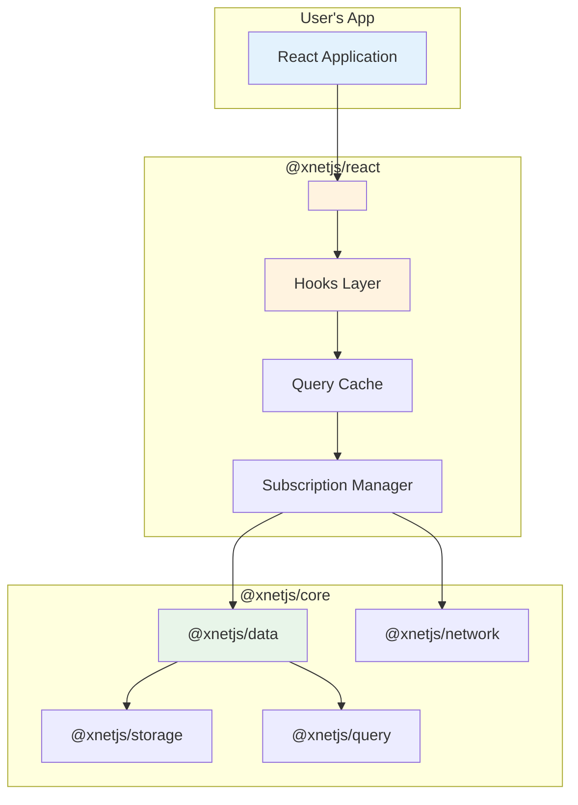
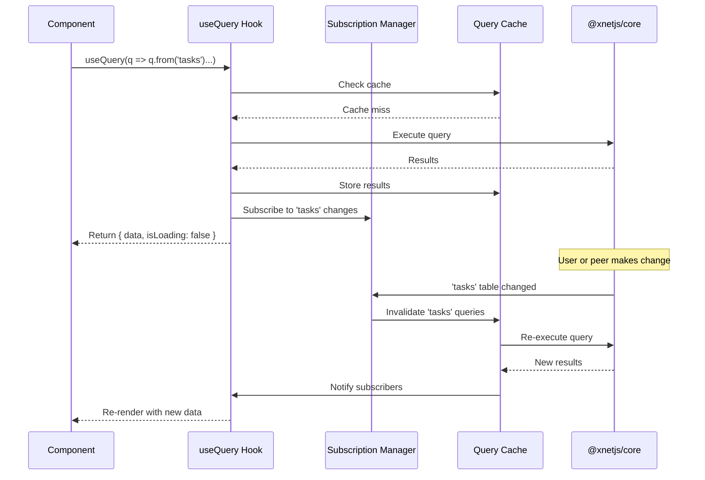
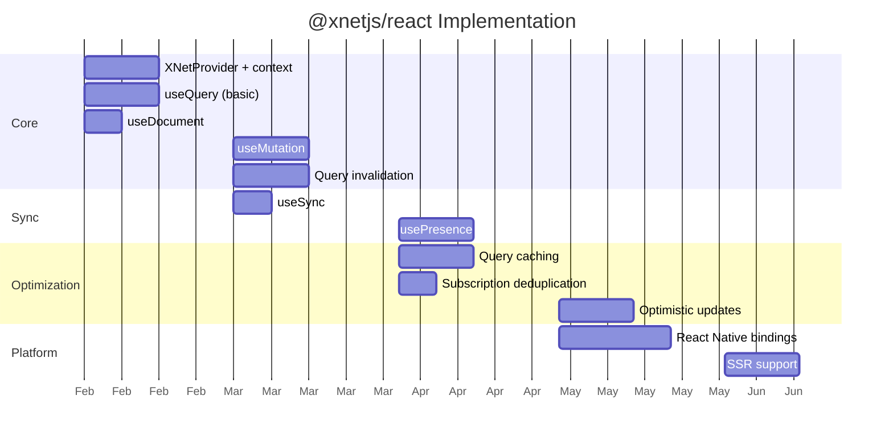

# 12: React Integration

> The primary way to use xNet — reactive hooks that replace Zustand

[← Back to Plan Overview](./README.md)

---

## Overview

`@xnetjs/react` is **the primary interface** for building apps with xNet. One package gives you:

- **Reactive database** — queries that auto-update when data changes
- **P2P sync** — real-time collaboration without a backend
- **State management** — replaces Zustand/Redux for persistent data
- **Presence** — cursors, online status, live collaboration

```bash
npm install @xnetjs/react   # Handles data state. Use useState for UI state.
```

### What It Replaces (and What It Doesn't)

**@xnetjs/react handles:**
| Use Case | Before | After |
|----------|--------|-------|
| Persistent data (tasks, docs) | Zustand + fetch | `useQuery()` |
| Write operations | Zustand actions | `useMutation()` |
| Server sync | Manual fetch/post | Automatic P2P |
| Offline data | You build it | Built-in |
| Real-time collab | WebSocket + custom | `usePresence()` |

**You still need React state for:**
| Use Case | Solution |
|----------|----------|
| Modal open/closed | `useState` |
| Current selection | `useState` |
| Form input values | `useState` / react-hook-form |
| Hover/focus states | `useState` |
| Complex UI state machines | Zustand or `useReducer` |

**Bottom line:** @xnetjs/react replaces Zustand for _data that should persist or sync_. For ephemeral UI state, use `useState` or keep a small Zustand store.

### Design Goals

| Goal             | Description                            |
| ---------------- | -------------------------------------- |
| **Zero config**  | Works out of the box, no backend setup |
| **Familiar API** | Hooks that feel like TanStack Query    |
| **Data layer**   | Handles persistent/synced state        |
| **Full offline** | Everything works without internet      |

---

## Package Structure

```
@xnetjs/react         → Primary interface (what you install)
  └── @xnetjs/core    → Bundled automatically (CRDT, sync, storage, query)

@xnetjs/react-native  → Optional: Native background sync for mobile
```

Most apps only need `@xnetjs/react`.



### Installation

```bash
# Primary installation - this is all most users need
npm install @xnetjs/react

# Automatically installs @xnetjs/core as dependency
```

For React Native with background sync:

```bash
npm install @xnetjs/react @xnetjs/react-native
```

---

## Core API

### Provider Setup

```tsx
import { XNetProvider } from '@xnetjs/react'

function App() {
  return (
    <XNetProvider
      database="my-app"
      sync={{
        enabled: true,
        peers: 'auto' // Auto-discover via DHT
        // peers: ['wss://...'], // Or specify signaling servers
      }}
      storage="sqlite" // 'sqlite' | 'indexeddb' | 'opfs'
    >
      <MyApp />
    </XNetProvider>
  )
}
```

**Provider Options:**

| Option         | Type                                | Default     | Description             |
| -------------- | ----------------------------------- | ----------- | ----------------------- |
| `database`     | `string`                            | Required    | Database/workspace name |
| `sync.enabled` | `boolean`                           | `true`      | Enable P2P sync         |
| `sync.peers`   | `'auto' \| string[]`                | `'auto'`    | Peer discovery mode     |
| `storage`      | `'sqlite' \| 'indexeddb' \| 'opfs'` | Auto-detect | Storage backend         |
| `encryption`   | `'e2e' \| 'none'`                   | `'e2e'`     | Encryption mode         |

---

### Hooks API

#### `useQuery` - Reactive Queries

```tsx
import { useQuery } from '@xnetjs/react'

function TaskList({ projectId }) {
  // Automatically re-renders when matching data changes
  const tasks = useQuery((q) =>
    q
      .from('tasks')
      .where('projectId', '==', projectId)
      .where('status', '!=', 'done')
      .orderBy('createdAt', 'desc')
      .limit(50)
  )

  if (tasks.isLoading) return <Spinner />
  if (tasks.error) return <Error error={tasks.error} />

  return (
    <ul>
      {tasks.data.map((task) => (
        <TaskItem key={task.id} task={task} />
      ))}
    </ul>
  )
}
```

**Query Builder API:**

```tsx
q.from('collection') // Collection/table name
  .where('field', op, value) // Filter (==, !=, >, <, >=, <=, contains, in)
  .orderBy('field', 'asc') // Sort
  .limit(n) // Limit results
  .offset(n) // Skip results
  .select(['field1', 'field2']) // Select specific fields
```

**Return Type:**

```tsx
interface QueryResult<T> {
  data: T[]
  isLoading: boolean
  error: Error | null
  refetch: () => void
}
```

---

#### `useDocument` - Single Document Subscription

```tsx
import { useDocument } from '@xnetjs/react'

function ProjectHeader({ projectId }) {
  const project = useDocument('projects', projectId)

  if (project.isLoading) return <Skeleton />
  if (!project.data) return <NotFound />

  return (
    <header>
      <h1>{project.data.name}</h1>
      <p>{project.data.description}</p>
    </header>
  )
}
```

**Return Type:**

```tsx
interface DocumentResult<T> {
  data: T | null
  isLoading: boolean
  error: Error | null
}
```

---

#### `useMutation` - Write Operations

```tsx
import { useMutation } from '@xnetjs/react'

function CreateTaskButton({ projectId }) {
  const createTask = useMutation(
    (tx, task: NewTask) =>
      tx.insert('tasks', {
        ...task,
        projectId,
        status: 'todo',
        createdAt: Date.now()
      }),
    {
      optimistic: true, // Instant UI update, syncs in background
      onSuccess: (task) => console.log('Created:', task.id),
      onError: (err) => toast.error('Failed to create task')
    }
  )

  return (
    <button
      onClick={() => createTask.mutate({ title: 'New Task' })}
      disabled={createTask.isPending}
    >
      {createTask.isPending ? 'Creating...' : 'Add Task'}
    </button>
  )
}
```

**Mutation Operations:**

```tsx
// Insert
tx.insert('collection', data)

// Update
tx.update('collection', id, changes)

// Delete
tx.delete('collection', id)

// Batch operations
tx.batch([
  { op: 'insert', collection: 'tasks', data: {...} },
  { op: 'update', collection: 'projects', id: '...', changes: {...} },
])
```

**Return Type:**

```tsx
interface MutationResult<TData, TVariables> {
  mutate: (variables: TVariables) => void
  mutateAsync: (variables: TVariables) => Promise<TData>
  isPending: boolean
  isSuccess: boolean
  isError: boolean
  error: Error | null
  data: TData | null
  reset: () => void
}
```

---

#### `useSync` - Sync Status

```tsx
import { useSync } from '@xnetjs/react'

function SyncIndicator() {
  const sync = useSync()

  return (
    <div className="sync-status">
      <StatusDot status={sync.status} />
      <span>
        {sync.status === 'synced' && 'All changes saved'}
        {sync.status === 'syncing' && `Syncing ${sync.pendingChanges} changes...`}
        {sync.status === 'offline' && 'Working offline'}
        {sync.status === 'error' && 'Sync error'}
      </span>
      <PeerCount count={sync.peers.length} />
    </div>
  )
}
```

**Return Type:**

```tsx
interface SyncStatus {
  status: 'synced' | 'syncing' | 'offline' | 'error'
  pendingChanges: number
  lastSyncedAt: Date | null
  peers: PeerInfo[]
  error: Error | null
}

interface PeerInfo {
  id: string
  name?: string
  connectedAt: Date
}
```

---

#### `usePresence` - Real-time Awareness

```tsx
import { usePresence } from '@xnetjs/react'

function CollaborativeCursors() {
  const { self, others, updatePresence } = usePresence()

  // Update own presence on mouse move
  useEffect(() => {
    const handler = (e: MouseEvent) => {
      updatePresence({
        cursor: { x: e.clientX, y: e.clientY },
        lastActiveAt: Date.now()
      })
    }
    window.addEventListener('mousemove', handler)
    return () => window.removeEventListener('mousemove', handler)
  }, [updatePresence])

  return (
    <>
      {others.map((user) => (
        <Cursor key={user.id} position={user.presence.cursor} name={user.name} color={user.color} />
      ))}
    </>
  )
}
```

**Return Type:**

```tsx
interface PresenceHook<T> {
  self: { id: string; presence: T }
  others: Array<{
    id: string
    name?: string
    color: string
    presence: T
  }>
  updatePresence: (presence: Partial<T>) => void
}
```

---

#### `useXNet` - Direct Access

```tsx
import { useXNet } from '@xnetjs/react'

function AdvancedFeature() {
  const xnet = useXNet()

  // Direct access to core APIs when needed
  const handleExport = async () => {
    const data = await xnet.export({ format: 'json' })
    download(data)
  }

  return <button onClick={handleExport}>Export Data</button>
}
```

---

## Architecture

### Reactivity System



### Query Invalidation Strategy

When data changes, the system needs to know which queries to re-run:

```typescript
// Internal: Track which tables each query touches
interface QuerySubscription {
  queryKey: string
  tables: Set<string> // Tables this query reads from
  callback: () => void // Re-run and notify
}

// On any write to 'tasks' table:
// 1. Find all subscriptions where tables.has('tasks')
// 2. Re-execute those queries
// 3. Diff results, only re-render if changed
```

**Optimization Levels:**

| Level | Strategy                 | Performance | Complexity |
| ----- | ------------------------ | ----------- | ---------- |
| 1     | Table-level invalidation | Good        | Simple     |
| 2     | Query fingerprinting     | Better      | Medium     |
| 3     | Row-level subscriptions  | Best        | Complex    |

Start with Level 1, optimize to Level 2/3 based on real usage patterns.

---

## Reducing Zustand Usage

`@xnetjs/react` handles the data layer, so Zustand stores get much smaller:

### Before (Zustand)

```tsx
// store.ts
const useStore = create((set, get) => ({
  tasks: [],
  isLoading: false,

  fetchTasks: async (projectId) => {
    set({ isLoading: true })
    const tasks = await api.getTasks(projectId)
    set({ tasks, isLoading: false })
  },

  createTask: async (task) => {
    const newTask = await api.createTask(task)
    set({ tasks: [...get().tasks, newTask] })
  },

  updateTask: async (id, changes) => {
    await api.updateTask(id, changes)
    set({
      tasks: get().tasks.map((t) => (t.id === id ? { ...t, ...changes } : t))
    })
  }
}))

// component.tsx
function TaskList({ projectId }) {
  const { tasks, isLoading, fetchTasks } = useStore()

  useEffect(() => {
    fetchTasks(projectId)
  }, [projectId])

  if (isLoading) return <Spinner />
  return (
    <ul>
      {tasks.map((t) => (
        <Task key={t.id} task={t} />
      ))}
    </ul>
  )
}
```

### After (@xnetjs/react)

```tsx
// component.tsx - No store needed!
function TaskList({ projectId }) {
  const tasks = useQuery((q) => q.from('tasks').where('projectId', '==', projectId))

  const createTask = useMutation((tx, task) => tx.insert('tasks', { ...task, projectId }))

  if (tasks.isLoading) return <Spinner />

  return (
    <ul>
      {tasks.data.map((t) => (
        <Task key={t.id} task={t} />
      ))}
      <button onClick={() => createTask.mutate({ title: 'New' })}>Add Task</button>
    </ul>
  )
}
```

### What Goes Where

| Use Case                             | @xnetjs/react | useState | Zustand |
| ------------------------------------ | ------------- | -------- | ------- |
| Tasks, documents, user data          | ✓             |          |         |
| Real-time synced data                | ✓             |          |         |
| Modal open/closed                    |               | ✓        |         |
| Current selection                    |               | ✓        | maybe   |
| Form inputs                          |               | ✓        |         |
| Complex UI state (multi-step wizard) |               |          | ✓       |
| Derived state across components      |               |          | ✓       |

**Typical result:** Your Zustand store shrinks from "everything" to just UI orchestration. Data fetching, caching, sync, and persistence all move to @xnetjs/react.

---

## Implementation Plan

### Phase 1: Core Hooks



### Milestones

| Milestone | Target  | Deliverable                                |
| --------- | ------- | ------------------------------------------ |
| **Alpha** | Month 2 | useQuery, useDocument, useMutation working |
| **Beta**  | Month 4 | Full hook suite, optimistic updates        |
| **1.0**   | Month 6 | Production-ready, React Native support     |

---

## API Reference Summary

| Hook                            | Purpose                      | Returns                             |
| ------------------------------- | ---------------------------- | ----------------------------------- |
| `useQuery(queryFn)`             | Reactive collection query    | `{ data, isLoading, error }`        |
| `useDocument(collection, id)`   | Single document subscription | `{ data, isLoading, error }`        |
| `useMutation(mutationFn, opts)` | Write operations             | `{ mutate, isPending, error }`      |
| `useSync()`                     | Sync status and peer info    | `{ status, peers, pendingChanges }` |
| `usePresence<T>()`              | Real-time presence/awareness | `{ self, others, updatePresence }`  |
| `useXNet()`                     | Direct core access           | `XNetClient` instance               |

---

## Migration from xWiki

To remove Zustand from xWiki and use `@xnetjs/react`:

1. **Wrap app in provider**

   ```tsx
   // app.tsx
   <XNetProvider database="xwiki">
     <App />
   </XNetProvider>
   ```

2. **Replace store queries with hooks**

   ```tsx
   // Before
   const pages = useStore((s) => s.pages)
   // After
   const pages = useQuery((q) => q.from('pages'))
   ```

3. **Replace store mutations**

   ```tsx
   // Before
   useStore.getState().createPage(data)
   // After
   const createPage = useMutation((tx, d) => tx.insert('pages', d))
   createPage.mutate(data)
   ```

4. **Keep useState for UI state**
   ```tsx
   const [sidebarOpen, setSidebarOpen] = useState(false)
   ```

---

## Comparison to Alternatives

| Feature                  | @xnetjs/react | TanStack Query | Convex | Replicache |
| ------------------------ | ------------- | -------------- | ------ | ---------- |
| Reactive queries         | Yes           | Yes            | Yes    | Yes        |
| P2P sync                 | **Yes**       | No             | No     | No         |
| Offline-first            | **Yes**       | Partial        | No     | Yes        |
| Local-first              | **Yes**       | No             | No     | Yes        |
| No backend required      | **Yes**       | No             | No     | No         |
| Real-time presence       | **Yes**       | No             | Yes    | Manual     |
| CRDT conflict resolution | **Yes**       | N/A            | Server | Yes        |
| Bundle size              | ~50KB         | ~40KB          | ~100KB | ~50KB      |

**xNet's differentiation:** Full P2P + local-first + reactive in one package, with no required backend infrastructure.

---

## Next Steps

- [xNet Core Platform](./01-xnet-core-platform.md) - Core package architecture
- [Appendix: Code Samples](./08-appendix-code-samples.md) - Implementation details
- [AI & MCP Interface](./09-ai-mcp-interface.md) - AI agent integration

---

[← Back to Plan Overview](./README.md) | [Previous: Versioning Strategy](./11-versioning-strategy.md)
