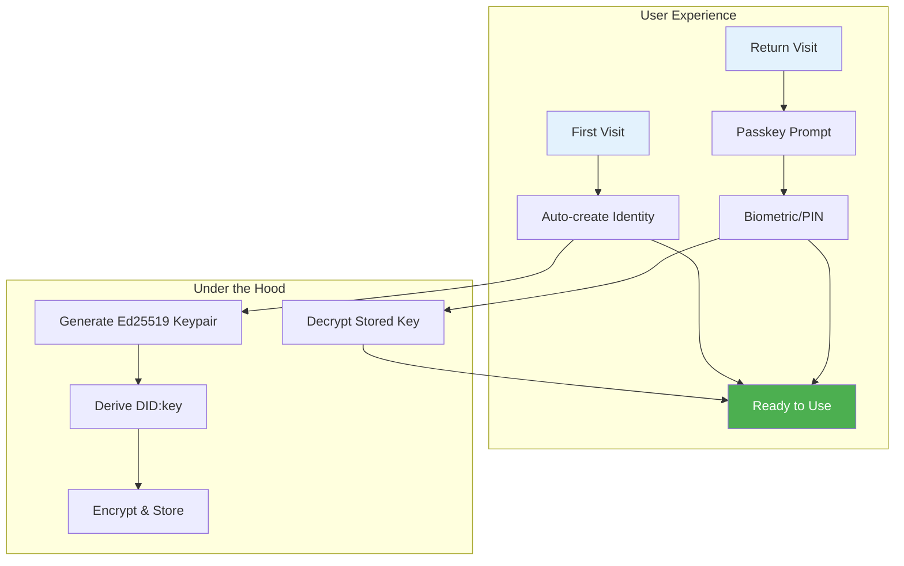

# 13: Identity & Authentication

> Zero-friction identity with passkey protection

[← Back to Plan Overview](./README.md)

---

## Overview

xNet identity should be **invisible to start, secure when needed**. No signup forms, no passwords, no email verification. Just open the app and go.

### Design Principles

| Principle                | Implementation                         |
| ------------------------ | -------------------------------------- |
| **Zero friction**        | Auto-generate identity on first use    |
| **No accounts**          | Identity is a keypair, not a username  |
| **Biometric unlock**     | Passkeys protect access on return      |
| **Progressive security** | Add backup/recovery when user is ready |
| **Local-first**          | Keys stored on device, not a server    |

---

## Architecture



### Key Components

| Component         | Technology             | Purpose                        |
| ----------------- | ---------------------- | ------------------------------ |
| **Identity**      | Ed25519 keypair        | Sign, encrypt, prove ownership |
| **Identifier**    | DID:key                | Portable, self-certifying ID   |
| **Protection**    | Passkey (WebAuthn)     | Biometric unlock               |
| **Storage**       | IndexedDB + encryption | Persist across sessions        |
| **Authorization** | UCAN tokens            | Delegatable permissions        |

---

## How Passkeys Fit

Passkeys (WebAuthn/FIDO2) are designed for server authentication, but we use them differently:

### Traditional Passkey Flow (Server Auth)

```
User → Passkey → Server verifies → Access granted
```

### xNet Passkey Flow (Local Protection)

```
User → Passkey → Decrypt local key → Identity unlocked
```

**Why this works:**

- Passkey provides biometric/PIN gate
- Passkey signature derives a decryption key
- Decryption key unlocks the stored Ed25519 identity
- No server involved

```typescript
// Passkey protects access to stored identity
async function unlockIdentity(): Promise<Identity> {
  // 1. Trigger passkey (Touch ID, Face ID, Windows Hello)
  const assertion = await navigator.credentials.get({
    publicKey: {
      challenge: crypto.getRandomValues(new Uint8Array(32)),
      rpId: location.hostname,
      userVerification: 'required'
    }
  })

  // 2. Derive decryption key from passkey signature
  const decryptionKey = await crypto.subtle.deriveKey(
    { name: 'HKDF', hash: 'SHA-256', salt, info: 'xnet-identity' },
    await crypto.subtle.importKey('raw', assertion.response.signature, 'HKDF', false, [
      'deriveKey'
    ]),
    { name: 'AES-GCM', length: 256 },
    false,
    ['decrypt']
  )

  // 3. Decrypt stored identity
  const encryptedIdentity = await storage.get('identity')
  const identityBytes = await crypto.subtle.decrypt(
    { name: 'AES-GCM', iv: encryptedIdentity.iv },
    decryptionKey,
    encryptedIdentity.data
  )

  return Identity.fromBytes(identityBytes)
}
```

---

## User Flows

### First Visit (New User)

```
┌─────────────────────────────────────────────────────────┐
│                                                         │
│   Welcome to xNet                                       │
│                                                         │
│   ┌─────────────────────────────────────────────────┐   │
│   │                                                 │   │
│   │        [Get Started]                            │   │
│   │                                                 │   │
│   │   or "I have an existing identity"              │   │
│   │                                                 │   │
│   └─────────────────────────────────────────────────┘   │
│                                                         │
└─────────────────────────────────────────────────────────┘
                           │
                           ▼
┌─────────────────────────────────────────────────────────┐
│                                                         │
│   Secure your identity                                  │
│                                                         │
│   ┌─────────────────────────────────────────────────┐   │
│   │                                                 │   │
│   │        🔐 Set up Face ID / Touch ID             │   │
│   │                                                 │   │
│   │   This protects your data on this device        │   │
│   │                                                 │   │
│   └─────────────────────────────────────────────────┘   │
│                                                         │
│   [ Skip for now ]                                      │
│                                                         │
└─────────────────────────────────────────────────────────┘
                           │
                           ▼
                    Ready to use!
```

**Behind the scenes:**

1. Generate Ed25519 keypair
2. Derive DID:key from public key
3. Create passkey (optional but recommended)
4. Encrypt private key with passkey-derived key (or device key if skipped)
5. Store in IndexedDB

### Return Visit

```
┌─────────────────────────────────────────────────────────┐
│                                                         │
│                     🔐                                  │
│                                                         │
│            Unlock with Face ID                          │
│                                                         │
│                  [ Cancel ]                             │
│                                                         │
└─────────────────────────────────────────────────────────┘
```

One biometric prompt, then they're in.

### Link New Device

```
Device A (has identity):

┌─────────────────────────────────────────────────────────┐
│                                                         │
│   Link a new device                                     │
│                                                         │
│   ┌─────────────────────────────────────────────────┐   │
│   │                                                 │   │
│   │         ████████████████████                    │   │
│   │         ████████████████████                    │   │
│   │         ████  QR CODE   ████                    │   │
│   │         ████████████████████                    │   │
│   │         ████████████████████                    │   │
│   │                                                 │   │
│   └─────────────────────────────────────────────────┘   │
│                                                         │
│   Scan this from your other device                      │
│   Code expires in 5:00                                  │
│                                                         │
└─────────────────────────────────────────────────────────┘

Device B (new):

┌─────────────────────────────────────────────────────────┐
│                                                         │
│   I already have an identity                            │
│                                                         │
│   ┌─────────────────────────────────────────────────┐   │
│   │                                                 │   │
│   │         📷 Scan QR Code                         │   │
│   │                                                 │   │
│   └─────────────────────────────────────────────────┘   │
│                                                         │
│   ┌─────────────────────────────────────────────────┐   │
│   │                                                 │   │
│   │         📝 Enter Recovery Phrase                │   │
│   │                                                 │   │
│   └─────────────────────────────────────────────────┘   │
│                                                         │
└─────────────────────────────────────────────────────────┘
```

**QR code contains:**

- Temporary session ID
- Public key for encrypted channel
- Expiration timestamp

**Link process:**

1. Device A shows QR with session info
2. Device B scans, establishes encrypted channel (Noise protocol)
3. Device A prompts: "Allow [Device B] to access your identity?"
4. User confirms on Device A (biometric)
5. Identity transferred encrypted over P2P channel
6. Device B creates its own passkey to protect the key locally

---

## Identity Model

### DID:key Format

```
did:key:z6MkhaXgBZDvotDkL5257faiztiGiC2QtKLGpbnnEGta2doK
        └──────────────────────────────────────────────────┘
                    Base58 encoded Ed25519 public key
```

**Benefits:**

- Self-certifying (no registry needed)
- Portable (works anywhere)
- Deterministic (same key = same DID)

### Key Derivation

```typescript
interface Identity {
  // Core keypair
  privateKey: Uint8Array // Ed25519 (signing)
  publicKey: Uint8Array

  // Derived keys
  did: string // did:key:z6Mk...
  encryptionKey: {
    // X25519 (encryption)
    privateKey: Uint8Array
    publicKey: Uint8Array
  }
}

// Derivation from seed
function createIdentity(seed?: Uint8Array): Identity {
  seed ??= crypto.getRandomValues(new Uint8Array(32))

  const signingKey = ed25519.generateKeyPair(seed)
  const encryptionKey = x25519.generateKeyPair(hkdf(seed, 'xnet-encryption'))

  return {
    privateKey: signingKey.privateKey,
    publicKey: signingKey.publicKey,
    did: `did:key:${base58btc.encode(signingKey.publicKey)}`,
    encryptionKey
  }
}
```

---

## Storage & Protection

### Browser (IndexedDB)

```typescript
interface StoredIdentity {
  version: 1
  did: string // Public, unencrypted
  publicKey: Uint8Array // Public, unencrypted
  encryptedPrivateKey: {
    ciphertext: Uint8Array // AES-GCM encrypted
    iv: Uint8Array
    salt: Uint8Array // For key derivation
  }
  passkey?: {
    credentialId: Uint8Array // Passkey identifier
    rpId: string // Relying party
  }
  createdAt: number
  lastUsedAt: number
}
```

### Desktop (OS Keychain)

On Electron/Tauri, prefer OS secure storage:

| Platform | Storage                   |
| -------- | ------------------------- |
| macOS    | Keychain Services         |
| Windows  | Credential Manager        |
| Linux    | libsecret / GNOME Keyring |

```typescript
// Tauri example
import { Store } from 'tauri-plugin-store'

const secureStore = new Store('.identity.dat')
await secureStore.set('privateKey', encryptedKey)
```

### Mobile (Secure Enclave)

On React Native, use hardware-backed storage:

| Platform | Storage                    |
| -------- | -------------------------- |
| iOS      | Secure Enclave + Keychain  |
| Android  | StrongBox / TEE + Keystore |

---

## Authorization (UCAN)

Once identity exists, use UCAN tokens for permissions:

```typescript
// Grant read access to a workspace
const token = await identity.createUCAN({
  audience: collaboratorDID, // Who receives permission
  capabilities: [
    {
      resource: `xnet://workspace/${workspaceId}`,
      action: 'read'
    }
  ],
  expiration: Date.now() + 7 * 24 * 60 * 60 * 1000 // 7 days
})

// Collaborator uses token to prove access
const proof = await verifyUCAN(token)
if (proof.allows('read', workspaceId)) {
  // Grant access
}
```

**UCAN Benefits:**

- No server needed to verify permissions
- Tokens can be delegated (A → B → C)
- Offline verification
- Expiring, revocable

---

## Recovery Options

### Option 1: Seed Phrase (Power Users)

```
┌─────────────────────────────────────────────────────────┐
│                                                         │
│   Back up your identity                                 │
│                                                         │
│   Write down these 12 words in order:                   │
│                                                         │
│   ┌─────────────────────────────────────────────────┐   │
│   │                                                 │   │
│   │   1. abandon    7. family                       │   │
│   │   2. ability    8. fashion                      │   │
│   │   3. able       9. father                       │   │
│   │   4. about     10. feature                      │   │
│   │   5. above     11. february                     │   │
│   │   6. absent    12. federal                      │   │
│   │                                                 │   │
│   └─────────────────────────────────────────────────┘   │
│                                                         │
│   ⚠️  Anyone with these words can access your data     │
│                                                         │
│   [ I've written them down ]                            │
│                                                         │
└─────────────────────────────────────────────────────────┘
```

**Implementation:**

```typescript
// BIP39 mnemonic
import { generateMnemonic, mnemonicToSeed } from '@scure/bip39'
import { wordlist } from '@scure/bip39/wordlists/english'

function exportSeedPhrase(identity: Identity): string {
  return generateMnemonic(wordlist, 128) // 12 words
}

function importFromSeedPhrase(phrase: string): Identity {
  const seed = mnemonicToSeed(phrase)
  return createIdentity(seed.slice(0, 32))
}
```

### Option 2: Encrypted Backup File

```
┌─────────────────────────────────────────────────────────┐
│                                                         │
│   Export identity backup                                │
│                                                         │
│   Create a password to protect your backup:             │
│                                                         │
│   ┌─────────────────────────────────────────────────┐   │
│   │  ••••••••••••••                                 │   │
│   └─────────────────────────────────────────────────┘   │
│                                                         │
│   ┌─────────────────────────────────────────────────┐   │
│   │  ••••••••••••••  (confirm)                      │   │
│   └─────────────────────────────────────────────────┘   │
│                                                         │
│   [ Download xnet-identity.backup ]                     │
│                                                         │
└─────────────────────────────────────────────────────────┘
```

**File format:**

```typescript
interface IdentityBackup {
  version: 1
  did: string
  encrypted: {
    ciphertext: Uint8Array // Argon2 + AES-GCM
    salt: Uint8Array
    nonce: Uint8Array
    params: {
      algorithm: 'argon2id'
      memory: 65536
      iterations: 3
      parallelism: 4
    }
  }
}
```

### Option 3: Social Recovery (Future)

Split key among trusted contacts using Shamir's Secret Sharing:

```
Your identity is split into 5 shares.
Any 3 shares can recover your identity.

Share 1 → Alice (sister)
Share 2 → Bob (friend)
Share 3 → Carol (coworker)
Share 4 → Your email (encrypted)
Share 5 → Printed paper backup
```

**Not for v1** - complex to implement and explain to users.

---

## Implementation Phases

### Phase 1: Basic Identity (MVP)

```typescript
// What ships first
const identity = await XNet.createIdentity() // Auto-generate
await identity.save() // Store locally

// On return
const identity = await XNet.loadIdentity() // Load from storage
```

- Auto-generated Ed25519 keypair
- DID:key format
- Encrypted storage in IndexedDB
- No passkey yet (device-bound encryption)

### Phase 2: Passkey Protection

```typescript
// Setup passkey
await identity.setupPasskey()

// Unlock with passkey
const identity = await XNet.unlockWithPasskey()
```

- Passkey creation on setup
- Biometric unlock on return
- Falls back to device key if passkey unavailable

### Phase 3: Multi-Device

```typescript
// On existing device
const linkCode = await identity.createLinkCode()

// On new device
await XNet.linkDevice(linkCode)
```

- QR code device linking
- Encrypted P2P key transfer
- Each device gets its own passkey

### Phase 4: Recovery

```typescript
// Export
const phrase = identity.exportSeedPhrase()
const backup = await identity.exportEncrypted(password)

// Import
const identity = await XNet.importFromSeedPhrase(phrase)
const identity = await XNet.importFromBackup(file, password)
```

- Seed phrase export
- Encrypted file backup
- Recovery flow in onboarding

---

## Security Considerations

| Threat                   | Mitigation                                   |
| ------------------------ | -------------------------------------------- |
| Device theft             | Passkey required to decrypt key              |
| Malicious site           | Keys never leave origin (same-origin policy) |
| Browser extension attack | Passkey requires user gesture                |
| Phishing                 | DID is self-certifying, no DNS dependency    |
| Key extraction           | Use OS secure storage where available        |
| Quantum computing        | Ed25519 → migrate to post-quantum when ready |

### What We Don't Protect Against

- **Compromised device**: If malware has root access, all bets are off
- **User sharing seed phrase**: Can't fix social engineering
- **Lost device + no backup**: Data is gone (by design - we can't recover it either)

---

## API Reference

```typescript
// @xnetjs/identity

// Create new identity
function createIdentity(): Promise<Identity>

// Load existing identity
function loadIdentity(): Promise<Identity | null>

// Passkey operations
function setupPasskey(): Promise<void>
function unlockWithPasskey(): Promise<Identity>
function hasPasskey(): Promise<boolean>

// Device linking
function createLinkCode(): Promise<LinkCode>
function linkDevice(code: LinkCode): Promise<Identity>

// Recovery
function exportSeedPhrase(): string
function exportEncrypted(password: string): Promise<Uint8Array>
function importFromSeedPhrase(phrase: string): Promise<Identity>
function importFromBackup(data: Uint8Array, password: string): Promise<Identity>

// UCAN
function createUCAN(options: UCANOptions): Promise<string>
function verifyUCAN(token: string): Promise<UCANProof>
```

---

## Summary

| Phase | Feature                 | User Experience              |
| ----- | ----------------------- | ---------------------------- |
| **1** | Auto-generated identity | "Just works" - no signup     |
| **2** | Passkey protection      | Touch ID / Face ID to unlock |
| **3** | Device linking          | QR code to add devices       |
| **4** | Recovery options        | Seed phrase or backup file   |

**The goal:** Feel as simple as "Sign in with Google" while being fully self-sovereign.

---

[← Back to Plan Overview](./README.md) | [Previous: React Integration](./12-react-integration.md)
