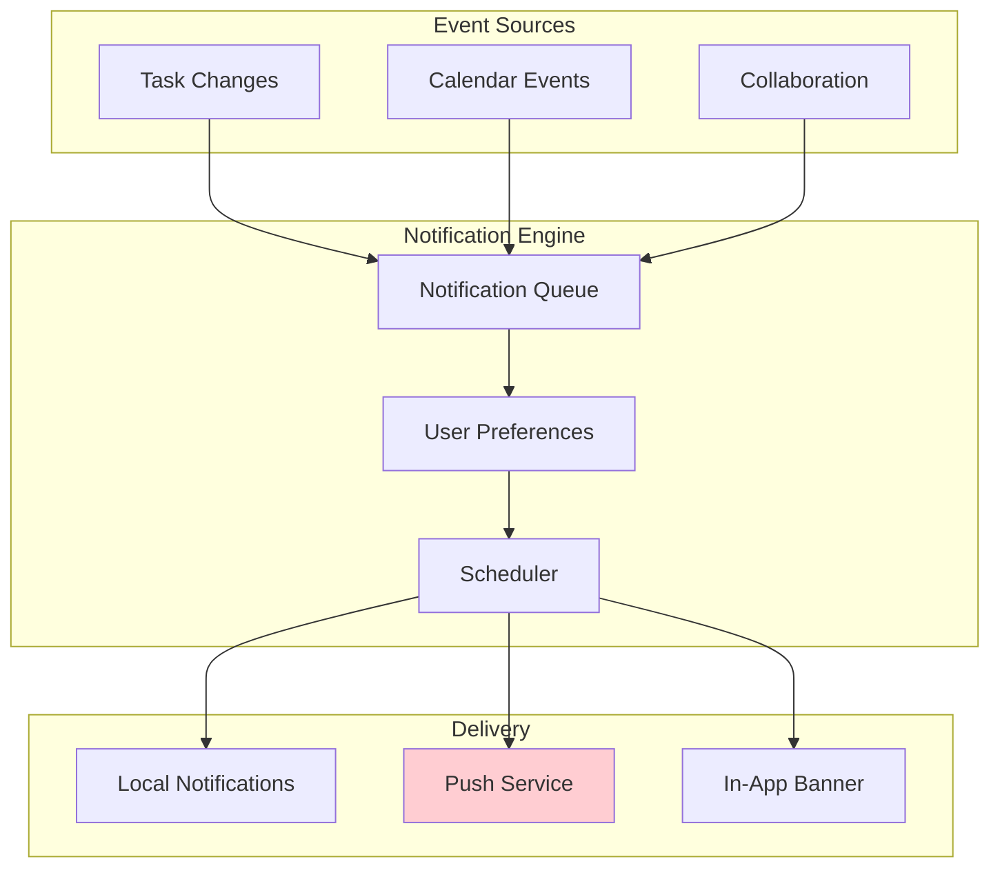
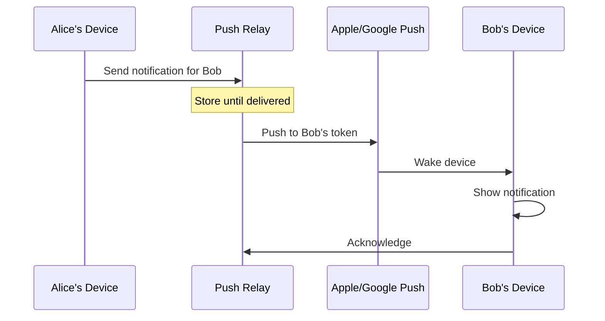
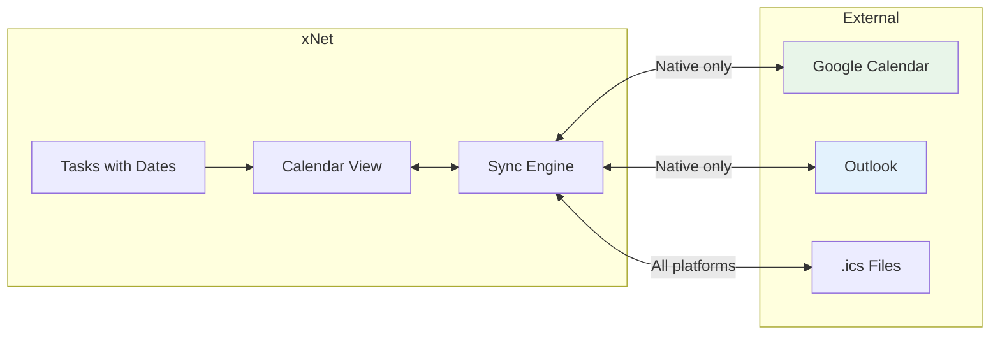
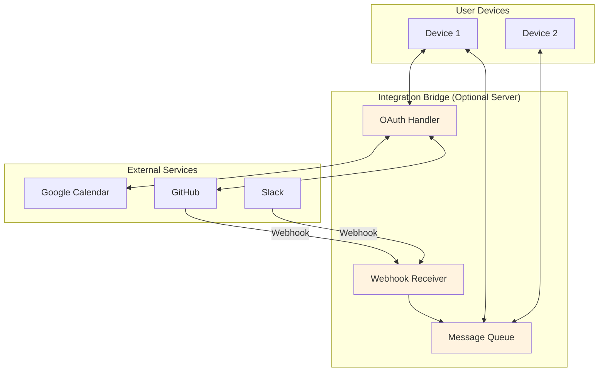
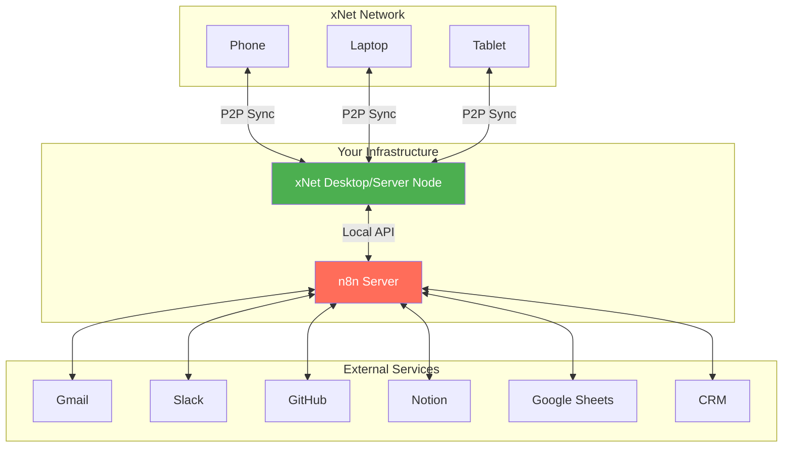
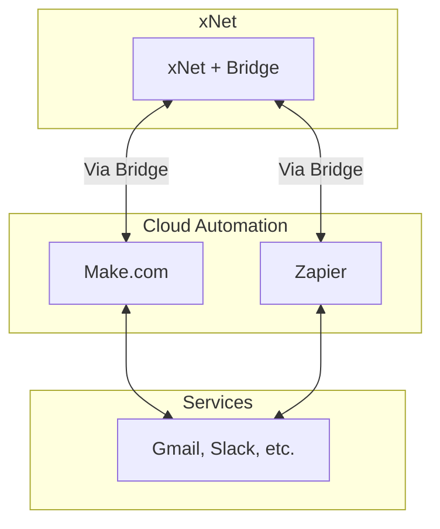

# 14: Notifications, Calendar & External Integrations

> Connecting a P2P system to the outside world

[← Back to Plan Overview](./README.md)

---

## The Challenge

xNet is P2P and local-first. But users need:

- **Notifications** when they're not in the app (due dates, assignments)
- **Calendar sync** with Google Calendar, Outlook, etc.
- **Webhooks** from external services (GitHub, Slack, etc.)

All of these traditionally require a server. How do we handle this?

### Platform Capabilities

| Feature             | PWA                      | Native (iOS/Android) | Desktop (Electron/Tauri) |
| ------------------- | ------------------------ | -------------------- | ------------------------ |
| Local notifications | Limited                  | Full                 | Full                     |
| Push notifications  | Requires server          | Requires server      | N/A                      |
| Background sync     | Service worker (limited) | Full                 | Full                     |
| OAuth flows         | Needs redirect server    | Can handle locally   | Can handle locally       |
| Scheduled tasks     | No                       | Yes                  | Yes                      |
| Calendar API access | CORS issues              | Native SDK           | Direct API               |

**Reality:** Some features will be native-only. PWA gets a degraded experience.

---

## Notifications

### Types of Notifications

| Type          | Example                     | Timing             |
| ------------- | --------------------------- | ------------------ |
| **Immediate** | "Alice assigned you a task" | When event happens |
| **Scheduled** | "Task X is due in 1 hour"   | Specific time      |
| **Digest**    | "You have 3 overdue tasks"  | Daily/weekly       |

### Architecture



### Local Notifications (No Server)

Works on native apps and desktop. App schedules notification locally.

```typescript
// Schedule a due date reminder
async function scheduleDueReminder(task: Task) {
  if (!task.dueDate) return

  const reminderTime = task.dueDate - 60 * 60 * 1000 // 1 hour before

  if (Platform.isNative) {
    await Notifications.schedule({
      id: `task-${task.id}-due`,
      title: 'Task due soon',
      body: task.title,
      scheduledAt: new Date(reminderTime),
      data: { taskId: task.id }
    })
  }
}

// React Native (expo-notifications)
import * as Notifications from 'expo-notifications'

await Notifications.scheduleNotificationAsync({
  content: {
    title: 'Task due soon',
    body: task.title
  },
  trigger: { date: new Date(reminderTime) }
})
```

### Push Notifications (Requires Server)

For notifications when app is closed and no scheduled reminder exists (e.g., "Alice just assigned you a task").

**The problem:** P2P means Alice's device needs to notify Bob's device, but Bob might be offline.

**Solution: Lightweight relay server**



**What the relay stores:**

- Recipient's push token (encrypted)
- Notification payload (encrypted, relay can't read)
- Nothing else - no messages, no data

```typescript
// Relay is minimal
interface PushRelay {
  // Register device
  register(did: string, pushToken: EncryptedToken): Promise<void>

  // Send notification (encrypted payload)
  send(recipientDID: string, encryptedPayload: Uint8Array): Promise<void>
}

// Sender encrypts notification for recipient
const payload = await encrypt(
  {
    title: 'New task assigned',
    body: task.title,
    data: { taskId: task.id }
  },
  recipientPublicKey
)

await pushRelay.send(recipientDID, payload)
```

### PWA Limitations

| Feature                       | PWA Support                            |
| ----------------------------- | -------------------------------------- |
| In-app notifications          | Yes                                    |
| Local scheduled notifications | No (requires app open)                 |
| Push notifications            | Yes, but needs service worker + server |
| Background sync               | Limited (service worker)               |

**PWA strategy:**

- Show in-app notifications when app is open
- Prompt users to install native app for full notifications
- Use email digest as fallback (requires email integration)

### Notification Preferences

```typescript
interface NotificationPreferences {
  // Channels
  inApp: boolean
  push: boolean
  email: boolean

  // Types
  taskAssigned: boolean
  taskDue: boolean
  mentions: boolean
  comments: boolean

  // Timing
  dueDateReminder: '15min' | '1hour' | '1day' | 'none'
  digestFrequency: 'realtime' | 'daily' | 'weekly' | 'none'

  // Quiet hours
  quietHours?: {
    start: string // "22:00"
    end: string // "08:00"
    timezone: string
  }
}
```

---

## Calendar

### Calendar View

Native calendar view in xNet for tasks with due dates:

```
┌─────────────────────────────────────────────────────────────────┐
│  ◀  January 2026  ▶                              Week │ Month  │
├─────────────────────────────────────────────────────────────────┤
│  Mon    Tue    Wed    Thu    Fri    Sat    Sun                  │
│                 1      2      3      4      5                   │
│                               ┌──┐                              │
│                               │2 │                              │
│                               └──┘                              │
│   6      7      8      9     10     11     12                   │
│  ┌──┐                 ┌──┐                                      │
│  │1 │                 │3 │                                      │
│  └──┘                 └──┘                                      │
│  13     14     15     16     17     18     19                   │
│         ┌──┐                        ┌──┐                        │
│         │1 │                        │2 │                        │
│         └──┘                        └──┘                        │
└─────────────────────────────────────────────────────────────────┘

Tasks on Jan 10:
┌─────────────────────────────────────────────────────────────────┐
│ ● Ship v1.0 release                              Due: 5:00 PM   │
│ ● Review PR #234                                 Due: EOD       │
│ ● Weekly team sync                               2:00 - 3:00 PM │
└─────────────────────────────────────────────────────────────────┘
```

**Data model:**

```typescript
interface CalendarEvent {
  id: string
  title: string
  type: 'task' | 'event' | 'external'

  // Timing
  startDate?: Date // For events with duration
  endDate?: Date
  dueDate?: Date // For tasks
  allDay: boolean

  // Links
  taskId?: string // If linked to task
  externalId?: string // If synced from Google/Outlook
  externalSource?: 'google' | 'outlook' | 'ical'

  // Recurrence
  recurrence?: {
    frequency: 'daily' | 'weekly' | 'monthly' | 'yearly'
    interval: number
    until?: Date
    exceptions?: Date[]
  }
}
```

### Google Calendar Sync

**The OAuth challenge:** Google OAuth requires a redirect URL, typically a server endpoint.

**Solutions by platform:**

#### Native Apps (iOS/Android)

Can use native OAuth libraries that handle redirect locally:

```typescript
// React Native with expo-auth-session
import * as Google from 'expo-auth-session/providers/google'

const [request, response, promptAsync] = Google.useAuthRequest({
  clientId: 'YOUR_CLIENT_ID',
  scopes: ['https://www.googleapis.com/auth/calendar']
})

// OAuth flow happens in-app, no server needed
const { accessToken } = response.authentication

// Sync directly to Google Calendar API
await syncToGoogleCalendar(accessToken, events)
```

#### Desktop (Electron/Tauri)

Can spawn local HTTP server for OAuth redirect:

```typescript
// Electron: local redirect server
const server = http.createServer((req, res) => {
  const code = new URL(req.url, 'http://localhost').searchParams.get('code')
  exchangeCodeForToken(code)
  res.end('You can close this window')
  server.close()
})

server.listen(8234) // Random port

// Open OAuth URL
shell.openExternal(`https://accounts.google.com/oauth?redirect_uri=http://localhost:8234&...`)
```

#### PWA (Limited)

Options:

1. **OAuth proxy server** - Small server that handles OAuth redirect, returns token to PWA
2. **No sync** - PWA just doesn't get Google Calendar sync
3. **Manual import/export** - User downloads .ics file, uploads to xNet

**Recommended:** PWA gets manual .ics import/export. Native gets full sync.

### Sync Architecture



### Sync Logic

```typescript
interface CalendarSync {
  // Setup
  connect(provider: 'google' | 'outlook'): Promise<void>
  disconnect(provider: string): Promise<void>

  // Sync
  pull(): Promise<CalendarEvent[]> // Get external events
  push(events: CalendarEvent[]): Promise<void> // Send xNet events

  // Conflict resolution
  onConflict: (local: CalendarEvent, remote: CalendarEvent) => CalendarEvent
}

// Two-way sync
async function syncCalendar() {
  // Pull external events
  const remoteEvents = await googleCalendar.pull()

  // Merge with local
  for (const remote of remoteEvents) {
    const local = await db.calendar.get(remote.externalId)
    if (!local) {
      await db.calendar.insert({ ...remote, externalSource: 'google' })
    } else if (remote.updatedAt > local.syncedAt) {
      await db.calendar.update(local.id, remote)
    }
  }

  // Push local changes
  const localChanges = await db.calendar.getUnsyncedChanges()
  await googleCalendar.push(localChanges)
}
```

### Conflict Resolution

| Scenario                      | Resolution                                         |
| ----------------------------- | -------------------------------------------------- |
| Same event edited both places | Last-write-wins based on timestamp                 |
| Event deleted externally      | Mark deleted in xNet, show in "Recently Deleted"   |
| Event deleted in xNet         | Delete from external calendar                      |
| New event in external         | Import to xNet                                     |
| New event in xNet             | Create in external (if "sync to calendar" enabled) |

---

## External Integrations Pattern

### The General Problem

P2P apps can't receive webhooks or make authenticated API calls easily. Here's a pattern for external integrations:



### Integration Bridge

A minimal server that only handles:

1. **OAuth redirects** - Get tokens, pass to client
2. **Webhook ingestion** - Receive webhooks, queue for clients
3. **Nothing else** - No data storage, no business logic

```typescript
// Integration bridge is stateless and minimal
interface IntegrationBridge {
  // OAuth
  getOAuthURL(provider: string, state: string): string
  handleOAuthCallback(code: string): Promise<{ accessToken: string; refreshToken: string }>

  // Webhooks
  registerWebhook(provider: string, userDID: string): Promise<string> // Returns webhook URL
  pollWebhooks(userDID: string): Promise<WebhookEvent[]> // Client polls for events
}
```

### What Requires the Bridge vs What Doesn't

| Integration          | Native App | PWA        | Requires Bridge         |
| -------------------- | ---------- | ---------- | ----------------------- |
| Google Calendar sync | Direct     | No         | No (native) / Yes (PWA) |
| GitHub webhooks      | Via bridge | Via bridge | Yes                     |
| Slack notifications  | Via bridge | Via bridge | Yes                     |
| .ics import/export   | Direct     | Direct     | No                      |
| Email sending        | Via bridge | Via bridge | Yes                     |
| Push notifications   | Via relay  | Via relay  | Yes                     |

### Self-Hosted Bridge Option

For privacy-conscious users, the bridge can be self-hosted:

```yaml
# docker-compose.yml
services:
  xnet-bridge:
    image: xnet/integration-bridge
    environment:
      - GOOGLE_CLIENT_ID=...
      - GOOGLE_CLIENT_SECRET=...
      - GITHUB_WEBHOOK_SECRET=...
    ports:
      - '8080:8080'
```

---

## ERP Integration Points

For Canvas and ERP modules, notifications are critical:

### Task Notifications

| Event                     | Notification    | Priority |
| ------------------------- | --------------- | -------- |
| Task assigned to me       | Immediate push  | High     |
| Task I'm watching updated | In-app + digest | Medium   |
| Task due in 1 hour        | Scheduled local | High     |
| Task overdue              | Push + badge    | High     |
| Comment on my task        | Push            | Medium   |
| Mentioned in comment      | Push            | Medium   |

### Workflow Notifications

| Event                   | Notification     |
| ----------------------- | ---------------- |
| Approval requested      | Push             |
| Approval granted/denied | Push             |
| Workflow step completed | In-app           |
| Workflow blocked        | Push to assignee |

### Calendar Integration for ERP

```typescript
// Sync ERP events to calendar
interface ERPCalendarIntegration {
  // Project milestones
  syncMilestones(projectId: string): Promise<void>

  // Sprint dates
  syncSprints(projectId: string): Promise<void>

  // Resource allocation
  syncResourceCalendar(userId: string): Promise<void>

  // Leave/PTO
  syncTimeOff(teamId: string): Promise<void>
}
```

---

## Implementation Phases

### Phase 1: Local Notifications (MVP)

- In-app notification banner
- Local scheduled reminders (native only)
- Notification preferences UI

```typescript
// MVP API
const notifications = useNotifications()

notifications.show({
  title: 'Task assigned',
  body: 'Alice assigned you "Review PR"',
  action: () => navigate(`/tasks/${taskId}`)
})

// For native
notifications.schedule({
  title: 'Due soon',
  body: task.title,
  at: task.dueDate - 3600000
})
```

### Phase 2: Push Notifications

- Push notification relay server
- Background sync for native apps
- Push token registration

### Phase 3: Calendar View

- Month/week/day views
- Drag to reschedule
- Filter by project/tag

### Phase 4: External Calendar Sync

- Google Calendar (native)
- Outlook Calendar (native)
- .ics import/export (all platforms)

### Phase 5: Integration Bridge

- OAuth proxy for PWA
- Webhook receiver
- GitHub, Slack, etc.

---

## Platform Feature Matrix

| Feature                       | PWA     | iOS | Android | Desktop |
| ----------------------------- | ------- | --- | ------- | ------- |
| In-app notifications          | ✓       | ✓   | ✓       | ✓       |
| Local scheduled notifications | ✗       | ✓   | ✓       | ✓       |
| Push notifications            | ✓\*     | ✓   | ✓       | ✗       |
| Calendar view                 | ✓       | ✓   | ✓       | ✓       |
| Google Calendar sync          | ✗\*\*   | ✓   | ✓       | ✓       |
| .ics import/export            | ✓       | ✓   | ✓       | ✓       |
| Background sync               | Limited | ✓   | ✓       | ✓       |

\* Requires server + service worker
\*\* Could work with OAuth proxy, but complex

---

## Workflow Automation (n8n, Make, Zapier)

The real power comes from connecting xNet to the broader automation ecosystem. Since n8n is self-hosted, it fits perfectly with xNet's philosophy.

### Architecture: xNet + n8n



**How it works:**

1. Run an always-on xNet node (desktop app or server)
2. xNet exposes a local HTTP API
3. n8n connects to that API on localhost or local network
4. n8n handles all external service connections

### xNet Local API

xNet exposes a REST/GraphQL API for automation tools:

```typescript
// Local API server (runs alongside xNet)
interface XNetLocalAPI {
  // Base URL: http://localhost:3741 or http://xnet.local:3741

  // Authentication
  // Uses UCAN tokens - n8n stores token in credentials
  headers: {
    Authorization: 'Bearer <UCAN token>'
  }
}
```

#### API Endpoints

```yaml
# Tasks
GET    /api/tasks                    # List tasks
GET    /api/tasks/:id                # Get task
POST   /api/tasks                    # Create task
PATCH  /api/tasks/:id                # Update task
DELETE /api/tasks/:id                # Delete task

# Pages
GET    /api/pages                    # List pages
GET    /api/pages/:id                # Get page (markdown)
POST   /api/pages                    # Create page
PATCH  /api/pages/:id                # Update page
DELETE /api/pages/:id                # Delete page

# Databases
GET    /api/databases                # List databases
GET    /api/databases/:id/query      # Query database
POST   /api/databases/:id/rows       # Create row
PATCH  /api/databases/:id/rows/:row  # Update row

# Events (for webhooks)
GET    /api/events                   # Poll for events
POST   /api/webhooks                 # Register webhook callback
DELETE /api/webhooks/:id             # Unregister webhook

# Search
GET    /api/search?q=...             # Full-text search
```

#### Webhook Events (Outbound)

xNet can notify n8n when things happen:

```typescript
interface XNetEvent {
  id: string
  type: 'task.created' | 'task.updated' | 'task.completed' |
        'page.created' | 'page.updated' |
        'database.row.created' | 'database.row.updated' |
        'comment.created' | 'mention'
  timestamp: number
  data: any
  workspace: string
}

// n8n registers a webhook
POST /api/webhooks
{
  "url": "http://localhost:5678/webhook/xnet",
  "events": ["task.created", "task.completed"],
  "secret": "shared-secret-for-verification"
}

// xNet POSTs to n8n when events occur
POST http://localhost:5678/webhook/xnet
{
  "event": "task.completed",
  "data": { "id": "task-123", "title": "Review PR" },
  "signature": "hmac-sha256-signature"
}
```

### n8n Workflow Examples

#### 1. Email to Task

```
┌─────────────┐    ┌─────────────┐    ┌─────────────┐
│   Gmail     │───▶│    n8n      │───▶│   xNet      │
│  (trigger)  │    │ (transform) │    │ (create)    │
└─────────────┘    └─────────────┘    └─────────────┘

Trigger: New email with label "todo"
Action: Create task in xNet with email subject as title
```

```json
// n8n workflow JSON
{
  "nodes": [
    {
      "name": "Gmail Trigger",
      "type": "n8n-nodes-base.gmailTrigger",
      "parameters": {
        "filters": { "labelIds": ["Label_todo"] }
      }
    },
    {
      "name": "Create xNet Task",
      "type": "n8n-nodes-base.httpRequest",
      "parameters": {
        "method": "POST",
        "url": "http://localhost:3741/api/tasks",
        "body": {
          "title": "={{ $json.subject }}",
          "description": "={{ $json.snippet }}",
          "metadata": { "emailId": "={{ $json.id }}" }
        }
      }
    }
  ]
}
```

#### 2. Task Completed → Slack Notification

```
┌─────────────┐    ┌─────────────┐    ┌─────────────┐
│   xNet      │───▶│    n8n      │───▶│   Slack     │
│  (webhook)  │    │  (format)   │    │  (post)     │
└─────────────┘    └─────────────┘    └─────────────┘

Trigger: Task marked complete in xNet
Action: Post to #team-updates Slack channel
```

#### 3. GitHub Issue → xNet Task (Two-way Sync)

```
┌─────────────┐    ┌─────────────┐    ┌─────────────┐
│   GitHub    │◀──▶│    n8n      │◀──▶│   xNet      │
│   Issues    │    │   (sync)    │    │   Tasks     │
└─────────────┘    └─────────────┘    └─────────────┘

- New GitHub issue → Create xNet task
- xNet task completed → Close GitHub issue
- Comment on either → Sync to other
```

#### 4. Daily Digest Email

```
┌─────────────┐    ┌─────────────┐    ┌─────────────┐
│   Cron      │───▶│   xNet      │───▶│   Email     │
│  (8am)      │    │  (query)    │    │  (send)     │
└─────────────┘    └─────────────┘    └─────────────┘

- Query xNet for tasks due today
- Query for overdue tasks
- Format and send email digest
```

#### 5. CRM Integration

```
┌─────────────┐    ┌─────────────┐    ┌─────────────┐
│   xNet      │◀──▶│    n8n      │◀──▶│  Salesforce │
│  Database   │    │   (sync)    │    │  Contacts   │
└─────────────┘    └─────────────┘    └─────────────┘

- Sync contacts between xNet database and CRM
- Update xNet when deal closes in CRM
- Create CRM activity when task completed in xNet
```

### xNet n8n Node (Custom)

For better DX, we can publish a custom n8n node:

```typescript
// @xnetjs/n8n-node
// Installable in n8n as community node

export class XNetNode implements INodeType {
  description: INodeTypeDescription = {
    displayName: 'xNet',
    name: 'xnet',
    icon: 'file:xnet.svg',
    group: ['transform'],
    version: 1,
    description: 'Interact with xNet',
    inputs: ['main'],
    outputs: ['main'],
    credentials: [
      {
        name: 'xnetApi',
        required: true
      }
    ],
    properties: [
      {
        displayName: 'Operation',
        name: 'operation',
        type: 'options',
        options: [
          { name: 'Create Task', value: 'createTask' },
          { name: 'Update Task', value: 'updateTask' },
          { name: 'Query Database', value: 'queryDatabase' },
          { name: 'Create Page', value: 'createPage' },
          { name: 'Search', value: 'search' }
        ]
      }
      // ... operation-specific fields
    ]
  }

  async execute(this: IExecuteFunctions): Promise<INodeExecutionData[][]> {
    const operation = this.getNodeParameter('operation', 0)
    const credentials = await this.getCredentials('xnetApi')

    // Execute operation against xNet local API
    // ...
  }
}
```

### Deployment Options

#### Option 1: Same Machine (Simplest)

```
┌────────────────────────────────────────┐
│            Your Computer               │
│  ┌──────────────┐  ┌──────────────┐   │
│  │ xNet Desktop │◀─▶│   n8n        │   │
│  │ :3741        │  │   :5678      │   │
│  └──────────────┘  └──────────────┘   │
└────────────────────────────────────────┘
```

Both run on your laptop/desktop. Simple localhost communication.

#### Option 2: Home Server / NAS

```
┌────────────────────────────────────────┐
│         Home Server / NAS              │
│  ┌──────────────┐  ┌──────────────┐   │
│  │ xNet Server  │◀─▶│   n8n        │   │
│  │  (Docker)    │  │  (Docker)    │   │
│  └──────────────┘  └──────────────┘   │
└────────────────────────────────────────┘
        ▲
        │ P2P sync
        ▼
┌──────────────┐
│ Your Devices │
└──────────────┘
```

Run both on a Synology NAS, Raspberry Pi, or home server.

#### Option 3: Cloud VPS (Self-Hosted)

```
┌────────────────────────────────────────┐
│         VPS (DigitalOcean, etc.)       │
│  ┌──────────────┐  ┌──────────────┐   │
│  │ xNet Server  │◀─▶│   n8n        │   │
│  └──────────────┘  └──────────────┘   │
└────────────────────────────────────────┘
        ▲
        │ P2P sync (encrypted)
        ▼
┌──────────────┐
│ Your Devices │
└──────────────┘
```

Always-on node in the cloud. You control the server.

### Docker Compose Setup

```yaml
# docker-compose.yml
version: '3.8'

services:
  xnet:
    image: xnet/server:latest
    ports:
      - '3741:3741' # Local API
      - '4001:4001' # libp2p
    volumes:
      - xnet-data:/data
    environment:
      - XNET_API_ENABLED=true
      - XNET_API_TOKEN=${XNET_API_TOKEN}

  n8n:
    image: n8nio/n8n
    ports:
      - '5678:5678'
    volumes:
      - n8n-data:/home/node/.n8n
    environment:
      - N8N_BASIC_AUTH_ACTIVE=true
      - N8N_BASIC_AUTH_USER=${N8N_USER}
      - N8N_BASIC_AUTH_PASSWORD=${N8N_PASSWORD}
    depends_on:
      - xnet

volumes:
  xnet-data:
  n8n-data:
```

### Security Considerations

| Concern                | Mitigation                                                               |
| ---------------------- | ------------------------------------------------------------------------ |
| API exposed to network | Bind to localhost by default; require explicit config for network access |
| Unauthorized access    | UCAN token authentication required                                       |
| n8n credentials        | Stored encrypted in n8n; never touch xNet                                |
| Webhook spoofing       | HMAC signature verification                                              |
| Data in transit        | TLS for any non-localhost connections                                    |

### Alternative: Make.com / Zapier

For users who don't want to self-host n8n:



The Integration Bridge (from earlier section) can expose xNet to cloud automation platforms. Less private than n8n, but more convenient for some users.

### Comparison

| Platform         | Self-Hosted | Privacy | Ease of Use | Cost     |
| ---------------- | ----------- | ------- | ----------- | -------- |
| **n8n**          | Yes         | High    | Medium      | Free     |
| **Make.com**     | No          | Medium  | High        | Freemium |
| **Zapier**       | No          | Medium  | High        | Paid     |
| **Node-RED**     | Yes         | High    | Low         | Free     |
| **Activepieces** | Yes         | High    | High        | Free     |

**Recommendation:** Promote n8n as primary option (self-hosted, matches xNet philosophy), but support cloud platforms via bridge for convenience.

### Implementation Phases

#### Phase 1: Local API

- REST API on localhost
- UCAN authentication
- Basic CRUD operations

#### Phase 2: Webhooks

- Outbound webhook notifications
- Event subscriptions
- HMAC verification

#### Phase 3: n8n Node

- Custom n8n community node
- Credentials management
- Pre-built operations

#### Phase 4: Templates

- Workflow templates for common patterns
- One-click import to n8n
- Documentation and tutorials

---

## Summary

| Component                     | Server Required?        | PWA Support   |
| ----------------------------- | ----------------------- | ------------- |
| In-app notifications          | No                      | Yes           |
| Local scheduled notifications | No                      | No            |
| Push notifications            | Yes (relay)             | Yes           |
| Calendar view                 | No                      | Yes           |
| Google Calendar sync          | No (native) / Yes (PWA) | Limited       |
| Webhook integrations          | Yes (bridge)            | Yes           |
| n8n / Workflow automation     | No (local API)          | N/A (desktop) |

**Key takeaway:** Native apps get the full experience. PWA users should be encouraged to install the native app for notifications and calendar sync. For workflow automation, run xNet desktop + n8n on the same machine or a home server.

---

[← Back to Plan Overview](./README.md) | [Previous: Identity & Authentication](./13-identity-authentication.md)
