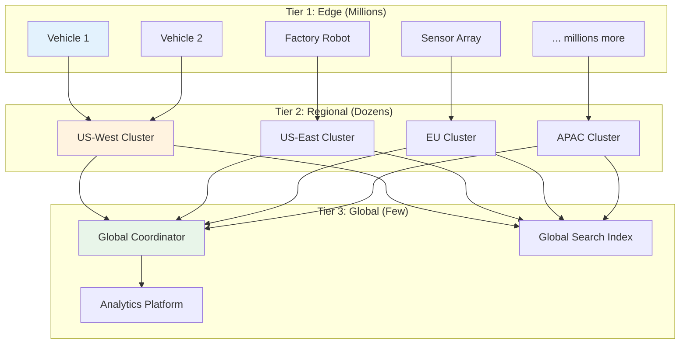
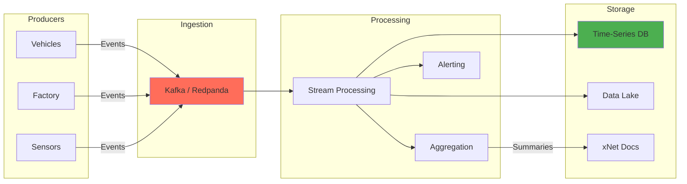

# 15: Enterprise Scale Architecture

> From personal notes to Tesla-scale industrial telemetry

[← Back to Plan Overview](./README.md)

---

## The Scale Challenge

**Personal xNet:**

- 1-10 devices
- Thousands of documents
- Dozens of writes/second
- Megabytes of data

**Tesla-scale xNet:**

- Millions of edge devices (vehicles, factory robots, sensors)
- Billions of events per day
- Hundreds of thousands of writes per second
- Petabytes of data
- Global distribution
- Regulatory compliance

The architecture that works for personal use **will not work** at this scale. But we can design foundations today that enable scaling tomorrow.

---

## What Breaks at Scale

| Component            | Works at Small Scale    | Breaks Because                          |
| -------------------- | ----------------------- | --------------------------------------- |
| **CRDTs**            | Conflict-free sync      | Tombstone accumulation, memory overhead |
| **P2P Mesh**         | Direct peer connections | O(n²) connections impossible            |
| **Single SQLite**    | Fast local queries      | Can't fit petabytes                     |
| **Full replication** | Every peer has all data | Too much data to replicate              |
| **WebRTC**           | Browser-to-browser      | Can't handle 100k+ connections          |

---

## Tiered Architecture

For enterprise scale, xNet needs a tiered architecture:



### Tier 1: Edge Nodes

- Lightweight xNet agents on devices
- Local buffering when disconnected
- Batch upload to regional cluster
- Edge computing for real-time decisions

```typescript
interface EdgeNode {
  // Lightweight - runs on embedded devices
  bufferSize: '100MB' // Local buffer for offline
  uploadBatch: 1000 // Events per batch
  uploadInterval: '1s' // Or when buffer full
  localRetention: '24h' // Keep recent data for local queries

  // Protocols
  upstream: 'regional-cluster' // Where to send data
  protocol: 'xnet-stream' // Efficient binary protocol
}
```

### Tier 2: Regional Clusters

- Receive data from thousands of edge nodes
- Time-series storage for telemetry
- Real-time stream processing
- Regional queries and dashboards
- Replicate summaries to global

```typescript
interface RegionalCluster {
  // Capacity
  ingestRate: '100k events/sec'
  storage: '100TB - 1PB'
  retention: '90 days hot, 1 year warm'

  // Components
  ingest: 'Kafka / Redpanda'
  timeseries: 'TimescaleDB / ClickHouse'
  streaming: 'Flink / Kafka Streams'
  cache: 'Redis Cluster'

  // xNet integration
  xnetBridge: true // Sync with xNet protocol
  crdtSupport: 'selective' // Only for collaborative docs
}
```

### Tier 3: Global Coordination

- Metadata and routing
- Cross-region queries
- Global aggregations
- Compliance and audit
- Disaster recovery

```typescript
interface GlobalTier {
  // Not for raw telemetry - only aggregates and metadata
  metadata: 'CockroachDB / Spanner'
  search: 'Elasticsearch cluster'
  analytics: 'Snowflake / BigQuery / Databricks'

  // xNet features
  workspaceRegistry: true // Which workspace lives where
  identityProvider: true // DID resolution, key recovery
  federationCoordinator: true // Cross-org collaboration
}
```

---

## Event Streaming Architecture

For high-throughput telemetry, replace CRDTs with event sourcing:



### Event Schema

```typescript
// High-volume telemetry events
interface TelemetryEvent {
  // Identity
  eventId: string              // UUID or ULID
  sourceId: string             // Device/vehicle ID
  sourceType: 'vehicle' | 'robot' | 'sensor' | 'worker'

  // Timing
  timestamp: number            // Microsecond precision
  ingestTime: number           // When received by cluster

  // Location
  region: string               // Geographic region
  facility?: string            // Factory, warehouse
  location?: GeoPoint          // GPS coordinates

  // Payload
  eventType: string            // 'bolt_torqued', 'temperature_reading', etc.
  data: Record<string, any>    // Event-specific data

  // Lineage
  correlationId?: string       // For tracing related events
  causationId?: string         // What triggered this event
}

// Example: Bolt torqued event
{
  eventId: '01ARZ3NDEKTSV4RRFFQ69G5FAV',
  sourceId: 'robot-arm-7',
  sourceType: 'robot',
  timestamp: 1706123456789012,
  region: 'us-west',
  facility: 'fremont-factory',
  eventType: 'bolt_torqued',
  data: {
    vin: '5YJ3E1EA1NF123456',
    position: 'front-left-wheel',
    targetTorque: 150,
    actualTorque: 149.8,
    tool: 'torque-wrench-42',
    operator: 'did:key:z6Mk...',
  },
  correlationId: 'assembly-batch-789',
}
```

### xNet Integration Points

xNet doesn't replace Kafka/Flink for telemetry. Instead:

| Data Type      | Storage        | xNet Role               |
| -------------- | -------------- | ----------------------- |
| Raw telemetry  | Time-series DB | None (too high volume)  |
| Aggregations   | xNet document  | Sync summaries to users |
| Incidents      | xNet task      | Create task from alert  |
| Reports        | xNet page      | Collaborative analysis  |
| Configurations | xNet database  | Sync config to edge     |

```typescript
// Stream processor creates xNet tasks from alerts
async function onAnomaly(event: TelemetryEvent, anomaly: Anomaly) {
  await xnet.tasks.create({
    title: `Anomaly detected: ${anomaly.type}`,
    description: `
      Vehicle: ${event.data.vin}
      Metric: ${anomaly.metric}
      Expected: ${anomaly.expected}
      Actual: ${anomaly.actual}
    `,
    priority: anomaly.severity,
    assignee: await getOnCallEngineer(event.facility),
    metadata: {
      eventId: event.eventId,
      correlationId: event.correlationId
    }
  })
}
```

---

## Data Partitioning

### By Time

```
telemetry/
├── 2026/
│   ├── 01/
│   │   ├── 15/
│   │   │   ├── hour_00.parquet
│   │   │   ├── hour_01.parquet
│   │   │   └── ...
```

### By Source

```
vehicles/
├── model_s/
│   ├── vin_5YJ3E1EA1NF123456/
│   └── vin_5YJ3E1EA1NF123457/
├── model_3/
├── model_x/
└── model_y/
```

### By Region (for compliance)

```
regions/
├── us-west/          # US data stays in US
├── eu-central/       # EU data stays in EU (GDPR)
├── cn-east/          # China data stays in China
└── ...
```

---

## Query Patterns at Scale

### Real-time Dashboards

```typescript
// Streaming aggregation - not xNet
const dashboard = {
  // Updated every second
  vehiclesOnline: 847293,
  eventsPerSecond: 234567,
  alertsActive: 12,

  // Powered by
  source: 'kafka-streams + redis'
}
```

### Historical Analysis

```typescript
// Query across petabytes - data lake
const query = `
  SELECT
    date_trunc('hour', timestamp) as hour,
    avg(data.actualTorque) as avg_torque,
    stddev(data.actualTorque) as torque_variance
  FROM telemetry
  WHERE eventType = 'bolt_torqued'
    AND timestamp > now() - interval '30 days'
  GROUP BY 1
  ORDER BY 1
`
// Powered by: Snowflake, BigQuery, Databricks, ClickHouse
```

### Collaborative Analysis

```typescript
// This IS xNet's domain
const investigation = await xnet.pages.create({
  title: 'Torque Variance Investigation - Jan 2026',
  content: `
    ## Hypothesis
    Increased torque variance correlates with supplier change.

    ## Data
    [Embed: Dashboard Link]
    [Embed: Query Results]

    ## Discussion
    @alice What do you think about the correlation?
  `,
  workspace: 'quality-engineering'
})
```

---

## What to Build Now (Foundations)

### 1. Protocol Versioning

Design protocols that can evolve:

```typescript
interface XNetMessage {
  version: number // Protocol version
  type: string // Message type
  payload: Uint8Array // Version-specific payload
  extensions?: Record<string, any> // Forward-compatible
}

// Version negotiation
const capabilities = {
  protocolVersions: [1, 2, 3],
  features: ['crdt', 'streaming', 'federation'],
  maxBatchSize: 10000
}
```

### 2. Workspace Tiers

Not all workspaces are equal:

```typescript
interface WorkspaceConfig {
  tier: 'personal' | 'team' | 'enterprise' | 'industrial'

  // Different tiers get different capabilities
  capabilities: {
    personal: {
      maxDocuments: 10000
      maxPeers: 10
      sync: 'p2p'
    }
    enterprise: {
      maxDocuments: 'unlimited'
      maxPeers: 10000
      sync: 'hybrid' // P2P + server assist
      compliance: true
      audit: true
    }
    industrial: {
      sync: 'streaming' // Event streaming, not CRDT
      ingestRate: '100k/sec'
      storage: 'tiered'
    }
  }
}
```

### 3. Storage Abstraction

Already doing this - ensure it's extensible:

```typescript
interface StorageBackend {
  // Current: SQLite, IndexedDB
  // Future: TimescaleDB, ClickHouse, S3, etc.

  // Core operations
  get(key: string): Promise<any>
  set(key: string, value: any): Promise<void>
  query(q: Query): Promise<any[]>

  // Streaming operations (for industrial tier)
  append?(stream: string, events: Event[]): Promise<void>
  subscribe?(stream: string, handler: EventHandler): Unsubscribe

  // Batch operations (for high throughput)
  batchWrite?(operations: WriteOp[]): Promise<void>
}
```

### 4. Event Schema Registry

Define schemas that can evolve:

```typescript
// Schema registry for enterprise
interface SchemaRegistry {
  register(schema: Schema): Promise<SchemaId>
  get(id: SchemaId): Promise<Schema>
  evolve(id: SchemaId, newSchema: Schema): Promise<SchemaId>
  validate(event: any, schemaId: SchemaId): boolean
}

// Schemas support evolution
const schemaV1 = {
  name: 'bolt_torqued',
  version: 1,
  fields: [
    { name: 'vin', type: 'string', required: true },
    { name: 'targetTorque', type: 'float', required: true },
    { name: 'actualTorque', type: 'float', required: true }
  ]
}

const schemaV2 = {
  name: 'bolt_torqued',
  version: 2,
  fields: [
    ...schemaV1.fields,
    { name: 'humidity', type: 'float', required: false } // New optional field
  ]
}
```

### 5. Federation Protocol

Allow workspaces to span organizations:

```typescript
interface FederationProtocol {
  // Discovery
  discoverWorkspace(id: string): Promise<WorkspaceInfo>

  // Trust
  establishTrust(org: OrgId, capabilities: string[]): Promise<TrustToken>

  // Sync
  syncAcrossOrgs(doc: DocId, orgs: OrgId[]): Promise<void>

  // Query
  federatedQuery(query: Query, scope: OrgId[]): Promise<Results>
}
```

### 6. Audit Log

Enterprise needs complete audit trail:

```typescript
interface AuditLog {
  // Append-only, tamper-evident
  append(entry: AuditEntry): Promise<void>

  // Query
  query(filter: AuditFilter): Promise<AuditEntry[]>

  // Compliance
  export(range: TimeRange, format: 'json' | 'csv'): Promise<Blob>

  // Verification
  verify(range: TimeRange): Promise<VerificationResult>
}

interface AuditEntry {
  timestamp: number
  actor: DID // Who did it
  action: string // What they did
  resource: string // What they did it to
  details: Record<string, any>
  previousHash: string // Chain for tamper detection
  hash: string
}
```

---

## Migration Path

### Phase 1: Current (Personal/Team)

```
User devices ←→ P2P sync ←→ User devices
```

- CRDTs for conflict resolution
- Full replication
- Works great for <100 users, <100k documents

### Phase 2: Hybrid (Small Enterprise)

```
User devices ←→ Sync server ←→ User devices
                    ↓
              Database cluster
```

- Optional sync server for reliability
- Server assists P2P, doesn't replace it
- Works for 100-10k users

### Phase 3: Enterprise

```
User devices ←→ Regional cluster ←→ Global coordinator
Edge devices →                   →
```

- Regional clusters for scale
- Event streaming for telemetry
- CRDTs only for collaborative documents
- Works for 10k-100k users

### Phase 4: Industrial

```
Millions of edge devices
         ↓
Regional ingestion clusters (Kafka)
         ↓
Stream processing (Flink)
         ↓
Time-series + Data lake
         ↓
xNet for human collaboration layer
```

- Separate paths for telemetry vs collaboration
- xNet handles the human layer
- Specialized systems for machine data

---

## Technology Choices by Scale

| Scale      | Storage          | Sync      | Processing  | xNet Role           |
| ---------- | ---------------- | --------- | ----------- | ------------------- |
| Personal   | SQLite           | P2P CRDT  | None        | Everything          |
| Team       | SQLite/Postgres  | P2P CRDT  | None        | Everything          |
| Enterprise | Postgres cluster | Hybrid    | Basic       | Primary             |
| Industrial | TimescaleDB + S3 | Streaming | Kafka/Flink | Collaboration layer |

---

## Cost Estimation

### Tesla-Scale Infrastructure

| Component         | Specification        | Monthly Cost        |
| ----------------- | -------------------- | ------------------- |
| **Ingestion**     | Kafka (100k msg/sec) | $20,000             |
| **Time-Series**   | TimescaleDB (100TB)  | $30,000             |
| **Data Lake**     | S3 (1PB)             | $23,000             |
| **Processing**    | Flink cluster        | $15,000             |
| **Analytics**     | Snowflake            | $50,000+            |
| **xNet Clusters** | Regional nodes       | $10,000             |
| **Global**        | Coordination         | $5,000              |
| **Total**         |                      | **~$150,000/month** |

This is 10-100x cheaper than building custom, and uses xNet for the collaboration layer.

---

## What NOT to Build

| Capability           | Build? | Instead Use                       |
| -------------------- | ------ | --------------------------------- |
| Time-series database | No     | TimescaleDB, InfluxDB, ClickHouse |
| Stream processing    | No     | Kafka Streams, Flink, Spark       |
| Data lake            | No     | S3, Delta Lake, Iceberg           |
| ML training          | No     | Databricks, SageMaker, Vertex AI  |
| BI dashboards        | No     | Grafana, Superset, Tableau        |

**xNet's role at enterprise scale:**

- Collaborative documents and analysis
- Task/project management
- Configuration management (sync to edge)
- Human-in-the-loop workflows
- Cross-team/cross-org coordination

---

## Summary: What to Do Today

### Immediate (No Extra Work)

1. **Keep storage abstract** - Already doing this
2. **Use standard protocols** - libp2p, CRDTs are right choices
3. **Design for offline** - Local-first is correct foundation

### Near-Term (Add to Roadmap)

1. **Protocol versioning** - Add version negotiation
2. **Workspace tiers** - Different configs for different scales
3. **Audit logging** - Append-only, verifiable
4. **Schema registry** - For structured data evolution

### Future (Enterprise Phase)

1. **Sync server option** - Hybrid P2P + server
2. **Regional clusters** - For geographic distribution
3. **Event streaming bridge** - Connect to Kafka/Flink
4. **Federation** - Cross-organization workspaces

### Don't Build (Use Existing)

1. Time-series databases
2. Stream processing engines
3. Data lakes
4. ML platforms

---

## Architecture Decision Records

### ADR-001: CRDTs for Collaboration, Events for Telemetry

**Context:** CRDTs don't scale to millions of events/second.

**Decision:** Use CRDTs for human-collaborative documents. Use event streaming for machine telemetry.

**Consequences:**

- Two sync mechanisms to maintain
- Clear separation of concerns
- Each optimized for its use case

### ADR-002: Tiered Architecture

**Context:** Can't have millions of devices in a P2P mesh.

**Decision:** Implement tiers: Edge → Regional → Global.

**Consequences:**

- More infrastructure complexity
- Clear scalability path
- Geographic compliance possible

### ADR-003: xNet as Collaboration Layer

**Context:** xNet can't replace Kafka/Snowflake for industrial data.

**Decision:** Position xNet as the human collaboration layer that integrates with data infrastructure.

**Consequences:**

- Clear product positioning
- Integration work required
- Leverages existing tools

---

[← Back to Plan Overview](./README.md) | [Previous: Notifications & Integrations](./14-notifications-integrations.md)
