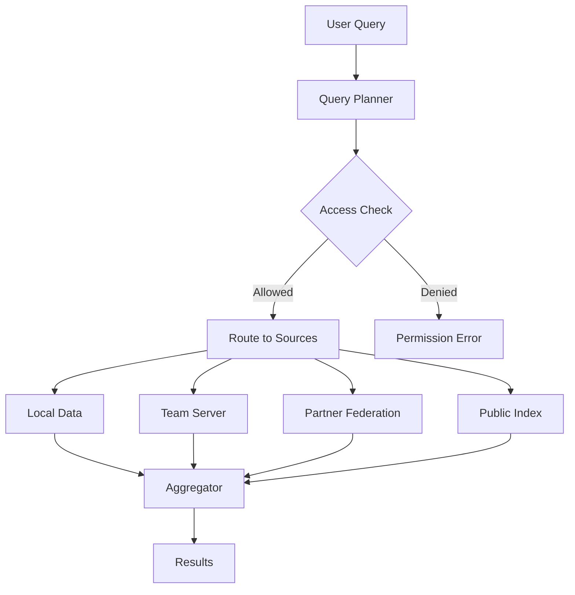

# 16: Global Data Network Vision

> The long-term architecture for a planetary-scale P2P data system

[← Back to Plan Overview](./README.md)

---

## The Vision

xNet becomes the **data layer for the internet** — a global, decentralized system where:

- **Anyone can build** applications on shared data infrastructure
- **Query any data** you have access to, regardless of where it lives
- **Infinite scaling** through intelligent federation of reads and writes
- **Economic incentives** align storage providers, compute providers, and users
- **Private deployments** can connect to the public network or run isolated

```
┌─────────────────────────────────────────────────────────────────────────┐
│                        GLOBAL xNET NAMESPACE                            │
│                                                                         │
│   ┌──────────┐  ┌──────────┐  ┌──────────┐  ┌──────────┐              │
│   │ Personal │  │  Teams   │  │Enterprise│  │  Public  │              │
│   │  Spaces  │  │  Spaces  │  │  Spaces  │  │ Datasets │              │
│   └──────────┘  └──────────┘  └──────────┘  └──────────┘              │
│         │            │              │             │                    │
│         └────────────┴──────────────┴─────────────┘                    │
│                              │                                          │
│                    ┌─────────▼─────────┐                               │
│                    │  Federated Query  │                               │
│                    │      Engine       │                               │
│                    └─────────┬─────────┘                               │
│                              │                                          │
│         ┌────────────────────┼────────────────────┐                    │
│         │                    │                    │                    │
│   ┌─────▼─────┐        ┌─────▼─────┐        ┌─────▼─────┐             │
│   │  Storage  │        │  Compute  │        │ Validation│             │
│   │ Providers │        │ Providers │        │   Nodes   │             │
│   └───────────┘        └───────────┘        └───────────┘             │
│                                                                         │
└─────────────────────────────────────────────────────────────────────────┘
```

---

## Core Principles

### 1. Data Sovereignty

You own your data. Always.

```
Your Data → Your Keys → Your Rules

- Data encrypted by default
- Access controlled by UCAN capability tokens
- Portable between providers
- Exit anytime with full export
```

### 2. Location Independence

Data has a global address, not a physical location.

```
xnet://did:key:z6Mk.../workspace/documents/report-2026

This address works whether the data is:
- On your laptop
- On a friend's phone
- On a storage provider in Singapore
- Replicated across 50 nodes
```

### 3. Access-Based Visibility

See everything you're allowed to see. Nothing more.

```typescript
// Your view of the global namespace
const myView = await xnet.query(`
  SELECT * FROM global
  WHERE hasAccess(currentUser, resource)
`)

// Returns data from:
// - Your personal spaces
// - Teams you're in
// - Public datasets you've subscribed to
// - Federated queries to partner organizations
```

### 4. Economic Alignment

Providers are paid. Users pay (or earn). Incentives align.

```
Storage Provider: "I'll store 1TB for 0.001 XNT/month"
Compute Provider: "I'll run queries for 0.0001 XNT/query"
User: "I'll pay for what I use"
Validator: "I'll verify proofs for 0.00001 XNT/proof"
```

---

## Global Namespace

### Content Addressing

Every piece of data has a unique, verifiable address:

```
xnet://<owner-did>/<workspace>/<path>

Examples:
xnet://did:key:z6MkhaXg.../personal/notes/2026-01-20
xnet://did:key:z6MkwTeb.../acme-corp/projects/apollo/tasks
xnet://did:key:z6MkPublic.../datasets/weather/2026
```

### Namespace Hierarchy

```
Global Namespace
├── did:key:z6MkAlice...          # Alice's namespace
│   ├── personal/                  # Private
│   ├── shared/                    # Shared with specific people
│   └── public/                    # World-readable
│
├── did:key:z6MkAcmeCorp...       # Organization namespace
│   ├── internal/                  # Employees only
│   ├── partners/                  # Federated with partners
│   └── public/                    # Public datasets
│
├── did:key:z6MkPublicGoods...    # Public goods
│   ├── datasets/                  # Open data
│   ├── schemas/                   # Shared schemas
│   └── indexes/                   # Public indexes
```

### Resolution

```typescript
// Resolve a global address
const resolution = await xnet.resolve('xnet://did:key:z6Mk.../workspace/doc')

// Returns
{
  // Where the data actually lives
  locations: [
    { provider: 'storage-node-1.xnet.io', region: 'us-west' },
    { provider: 'ipfs://Qm...', type: 'ipfs' },
    { provider: 'peer:12D3KooW...', type: 'p2p' },
  ],

  // Access requirements
  access: {
    type: 'ucan',
    required: ['read'],
    issuer: 'did:key:z6Mk...',
  },

  // Data metadata
  metadata: {
    schema: 'xnet://schemas/document/v2',
    size: 15234,
    updated: '2026-01-20T10:30:00Z',
    replicas: 3,
  },
}
```

---

## Federated Query Engine

### Query Across the Network

```typescript
// Query your data + team data + public data in one query
const results = await xnet.query(`
  SELECT
    t.title,
    t.assignee,
    p.name as project,
    org.name as organization
  FROM tasks t
  JOIN projects p ON t.projectId = p.id
  JOIN organizations org ON p.orgId = org.id
  WHERE t.status = 'active'
    AND t.dueDate < now() + interval '7 days'
  ORDER BY t.dueDate
`)

// Query planner automatically:
// 1. Identifies which data sources are needed
// 2. Checks access permissions for each
// 3. Routes sub-queries to appropriate nodes
// 4. Aggregates results
// 5. Returns unified result set
```

### Query Planning



### Query Routing Intelligence

```typescript
interface QueryRouter {
  // Analyze query to determine sources
  plan(query: Query): QueryPlan

  // Optimize for latency, cost, or thoroughness
  optimize(plan: QueryPlan, strategy: 'fast' | 'cheap' | 'complete'): QueryPlan

  // Execute across federation
  execute(plan: QueryPlan): AsyncIterator<Result>
}

interface QueryPlan {
  // Sub-queries to execute
  subqueries: {
    target: DataSource
    query: Query
    estimatedCost: Cost
    estimatedLatency: Duration
  }[]

  // How to combine results
  aggregation: AggregationStrategy

  // Total estimates
  totalCost: Cost
  totalLatency: Duration
}
```

---

## Economic Layer

### Token Economics (XNT)

```
┌─────────────────────────────────────────────────────────────────┐
│                      XNT TOKEN FLOW                             │
│                                                                 │
│  Users                    Network                  Providers    │
│    │                         │                         │        │
│    │──── Pay for storage ────▶────────────────────────▶│        │
│    │──── Pay for compute ────▶────────────────────────▶│        │
│    │──── Pay for bandwidth ──▶────────────────────────▶│        │
│    │                         │                         │        │
│    │◀─── Earn for providing ─◀─────────────────────────│        │
│    │◀─── Earn for validating ◀─────────────────────────│        │
│    │◀─── Earn for curation ──◀─────────────────────────│        │
│                                                                 │
└─────────────────────────────────────────────────────────────────┘
```

### Provider Types

#### Storage Providers

```typescript
interface StorageProvider {
  // Offer storage capacity
  capacity: '10TB'
  pricePerGBMonth: 0.001 // XNT
  regions: ['us-west', 'eu-central']
  replicationFactor: 3
  uptime: '99.9%'

  // Prove storage
  submitProof(challenge: Challenge): Proof
}

// Storage market
const offers = await xnet.storage.market.list({
  minCapacity: '100GB',
  maxPrice: 0.002,
  regions: ['us-west']
})

// Select and pay
await xnet.storage.allocate({
  provider: offers[0].id,
  size: '100GB',
  duration: '1 year',
  payment: { token: 'XNT', amount: 1.2 }
})
```

#### Compute Providers

```typescript
interface ComputeProvider {
  // Offer compute capacity
  capabilities: ['query', 'aggregation', 'ml-inference']
  pricePerQuery: 0.0001 // XNT
  maxConcurrency: 1000
  regions: ['us-west']

  // Execute queries
  execute(query: Query): Promise<Results>
}

// Query with payment
const results = await xnet.query(q, {
  payment: { maxCost: 0.01, token: 'XNT' },
  routing: 'cheapest' // or 'fastest'
})
```

#### Validation Nodes

```typescript
interface ValidationNode {
  // Verify proofs and maintain consensus
  stake: 10000 // XNT staked
  role: 'validator'

  // Responsibilities
  verifyStorageProofs(): Promise<void>
  participateInConsensus(): Promise<void>
  slashMisbehavior(proof: MisbehaviorProof): Promise<void>
}
```

### Payment Channels

For micropayments without on-chain transactions:

```typescript
// Open payment channel
const channel = await xnet.payments.openChannel({
  provider: 'storage-node-1.xnet.io',
  deposit: 10, // XNT
  duration: '30 days'
})

// Micropayments flow off-chain
await channel.pay(0.0001) // Pay for a query
await channel.pay(0.0001) // Pay for another query
// ... thousands of micropayments

// Settle on-chain periodically or at close
await channel.close()
```

---

## Validation & Consensus

### What Needs Consensus

| Data Type              | Consensus Needed? | Why                    |
| ---------------------- | ----------------- | ---------------------- |
| Personal documents     | No                | Owner is authority     |
| Team documents         | No                | CRDT + team admin      |
| Public datasets        | Maybe             | Depends on trust model |
| Financial transactions | Yes               | Prevent double-spend   |
| Storage proofs         | Yes               | Verify providers       |
| Namespace registration | Yes               | Prevent squatting      |

### Proof of Storage

Storage providers must prove they're actually storing data:

```typescript
interface StorageProof {
  // Challenge: "Prove you have block 47 of document X"
  challenge: {
    documentId: string
    blockIndex: number
    randomSeed: Uint8Array
  }

  // Response: Merkle proof + data sample
  response: {
    merkleProof: MerkleProof
    dataSample: Uint8Array
    signature: Signature
  }
}

// Verification
const isValid = await verifyStorageProof(proof)
if (!isValid) {
  await slashProvider(proof.provider, proof)
}
```

### Lightweight Consensus

Not everything needs full blockchain consensus. Use lightweight alternatives:

```typescript
interface ConsensusLayers {
  // Layer 1: Personal (no consensus)
  personal: {
    authority: 'owner'
    conflict: 'last-write-wins'
  }

  // Layer 2: Collaborative (CRDT)
  collaborative: {
    authority: 'participants'
    conflict: 'crdt-merge'
  }

  // Layer 3: Organizational (admin)
  organizational: {
    authority: 'org-admins'
    conflict: 'admin-resolution'
  }

  // Layer 4: Network (consensus)
  network: {
    authority: 'validators'
    conflict: 'bft-consensus'
    // Only for: payments, proofs, namespace
  }
}
```

---

## Private ↔ Public Bridge

### Private Deployments

Enterprises can run xNet privately:

```
┌─────────────────────────────────────────────────────────────────┐
│                    ENTERPRISE DATA CENTER                       │
│                                                                 │
│   ┌──────────────────────────────────────────────────────┐     │
│   │              Private xNet Cluster                     │     │
│   │                                                       │     │
│   │   ┌─────────┐  ┌─────────┐  ┌─────────┐            │     │
│   │   │ Node 1  │  │ Node 2  │  │ Node 3  │            │     │
│   │   └─────────┘  └─────────┘  └─────────┘            │     │
│   │                                                       │     │
│   │   Internal namespace: xnet://acme.internal/...       │     │
│   │                                                       │     │
│   └──────────────────────────────────────────────────────┘     │
│                              │                                  │
│                              │ Optional                         │
│                              ▼                                  │
│   ┌──────────────────────────────────────────────────────┐     │
│   │              Federation Gateway                       │     │
│   │   - Selective sync to public network                 │     │
│   │   - Query federation with partners                   │     │
│   │   - Public dataset subscriptions                     │     │
│   └──────────────────────────────────────────────────────┘     │
│                                                                 │
└─────────────────────────────────────────────────────────────────┘
                              │
                              ▼
                    ┌─────────────────┐
                    │  Global xNet    │
                    │    Network      │
                    └─────────────────┘
```

### Federation Modes

```typescript
interface FederationConfig {
  mode: 'isolated' | 'selective' | 'full'

  isolated: {
    // No connection to public network
    publicAccess: false
    externalQueries: false
  }

  selective: {
    // Specific data syncs to/from public
    publicAccess: true
    allowedNamespaces: ['public/*', 'partners/*']
    blockedNamespaces: ['internal/*', 'hr/*']
  }

  full: {
    // Full participation in public network
    publicAccess: true
    provideStorage: true
    provideCompute: true
    earnRewards: true
  }
}
```

### Cross-Organization Queries

```typescript
// Acme queries data from partner (with permission)
const results = await xnet.federatedQuery({
  query: `
    SELECT * FROM partner.inventory
    WHERE productId IN (SELECT productId FROM orders)
  `,

  // Federation agreement
  agreement: {
    partner: 'did:key:z6MkPartner...',
    capability: 'ucan://...', // Pre-negotiated access
    payment: { perQuery: 0.01, token: 'XNT' }
  }
})
```

---

## Migration Path

### Phase 1: Local-First (Current)

```
Devices ←→ P2P Sync ←→ Devices

- Personal and team use
- No global namespace yet
- No economic layer
```

### Phase 2: Federated

```
Workspaces ←→ Federation ←→ Partner Workspaces

- Cross-organization queries
- Optional sync servers
- No payments yet
```

### Phase 3: Global Namespace

```
Local ←→ Global Resolution ←→ Any Data

- Content-addressed data
- Global namespace registry
- Basic storage providers
```

### Phase 4: Economic Layer

```
Users ←→ Markets ←→ Providers

- Token payments
- Storage/compute markets
- Validation and proofs
```

### Phase 5: Full Network

```
Everything ←→ Everything

- Infinite scaling
- Global queries
- Aligned incentives
- Private ↔ public bridge
```

---

## Technical Components

### Required Infrastructure

| Component              | Purpose                   | Technology Options         |
| ---------------------- | ------------------------- | -------------------------- |
| **Namespace Registry** | Global name resolution    | DHT, blockchain, or hybrid |
| **Query Router**       | Federated query planning  | Custom, built on libp2p    |
| **Storage Market**     | Match users and providers | Smart contracts or L2      |
| **Payment Channels**   | Micropayments             | State channels, L2 rollups |
| **Proof System**       | Verify storage/compute    | zk-SNARKs, Merkle proofs   |
| **Consensus**          | Critical operations       | BFT, PoS, or delegated     |

### Integration with Existing Networks

```typescript
interface NetworkBridges {
  // Storage networks
  ipfs: {
    // Pin xNet data to IPFS
    pin(cid: string): Promise<void>
    // Import from IPFS
    import(cid: string): Promise<XNetRef>
  }

  filecoin: {
    // Long-term archival storage
    archive(data: Blob, duration: Duration): Promise<Deal>
  }

  arweave: {
    // Permanent storage
    permastore(data: Blob): Promise<TxId>
  }

  // Payment networks
  ethereum: {
    // Bridge XNT ↔ ETH
    bridge(amount: number, direction: 'in' | 'out'): Promise<TxId>
  }

  // Identity networks
  ens: {
    // Resolve ENS → xNet namespace
    resolve(name: string): Promise<XNetNamespace>
  }
}
```

---

## Comparison to Existing Systems

| System        | Strengths               | xNet Difference                        |
| ------------- | ----------------------- | -------------------------------------- |
| **IPFS**      | Content addressing, P2P | + Mutable data, queries, collaboration |
| **Filecoin**  | Incentivized storage    | + Application layer, not just storage  |
| **Ceramic**   | Mutable streams         | + Richer data model, better UX         |
| **The Graph** | Blockchain indexing     | + General data, not just blockchain    |
| **Solid**     | Data pods               | + P2P, economic layer, scaling         |
| **Gun.js**    | Real-time P2P           | + Enterprise features, economics       |

**xNet's unique position:** Full-stack data platform from personal notes to industrial telemetry, with economic alignment and enterprise-grade features.

---

## Governance

### Protocol Governance

```typescript
interface Governance {
  // Protocol upgrades
  proposeUpgrade(proposal: Proposal): Promise<ProposalId>
  vote(proposalId: ProposalId, vote: 'yes' | 'no'): Promise<void>
  executeUpgrade(proposalId: ProposalId): Promise<void>

  // Voting power
  // Based on: stake, usage, contribution
  votingPower(did: DID): number

  // Councils
  councils: {
    technical: DID[] // Protocol decisions
    economic: DID[] // Token/incentive decisions
    community: DID[] // Social/policy decisions
  }
}
```

### Namespace Governance

```typescript
interface NamespaceGovernance {
  // Reserve namespaces for public goods
  reserved: ['schemas', 'datasets', 'indexes', 'governance']

  // Dispute resolution
  disputeNamespace(claim: NamespaceClaim): Promise<DisputeId>
  resolveDispute(disputeId: DisputeId, resolution: Resolution): Promise<void>

  // Anti-squatting
  requireActivity(namespace: string, period: Duration): boolean
  reclaimInactive(namespace: string): Promise<void>
}
```

---

## Example: Distributed Search Engine

One concrete example of what this enables — a Google-scale search engine with no central operator:

```
┌─────────────────────────────────────────────────────────────────────────┐
│                    DISTRIBUTED SEARCH ENGINE                            │
│                                                                         │
│   Crawlers (Everyone contributes)                                       │
│   ┌─────────┐ ┌─────────┐ ┌─────────┐ ┌─────────┐                      │
│   │ Alice's │ │  Bob's  │ │ Carol's │ │  ...    │                      │
│   │ Laptop  │ │ Desktop │ │  Phone  │ │ millions│                      │
│   │ crawls  │ │ crawls  │ │ crawls  │ │         │                      │
│   │ 10 sites│ │ 50 sites│ │ 5 sites │ │         │                      │
│   └────┬────┘ └────┬────┘ └────┬────┘ └────┬────┘                      │
│        │           │           │           │                            │
│        └───────────┴───────────┴───────────┘                            │
│                         │                                               │
│                         ▼                                               │
│   ┌─────────────────────────────────────────────────────────────────┐  │
│   │                    GLOBAL INDEX                                  │  │
│   │                                                                  │  │
│   │   xnet://public/search-index/web                                │  │
│   │                                                                  │  │
│   │   - Billions of pages indexed                                   │  │
│   │   - Distributed across storage providers                        │  │
│   │   - Anyone can query (pay per query or free tier)               │  │
│   │   - Crawlers earn XNT for contributing                          │  │
│   │                                                                  │  │
│   └─────────────────────────────────────────────────────────────────┘  │
│                         │                                               │
│                         ▼                                               │
│   ┌─────────────────────────────────────────────────────────────────┐  │
│   │                    QUERY LAYER                                   │  │
│   │                                                                  │  │
│   │   User: "best local-first databases 2026"                       │  │
│   │                                                                  │  │
│   │   → Query routed to nearest index shards                        │  │
│   │   → Results aggregated from multiple providers                  │  │
│   │   → Ranked by open algorithm (not corporate black box)          │  │
│   │   → No tracking, no filter bubble                               │  │
│   │                                                                  │  │
│   └─────────────────────────────────────────────────────────────────┘  │
│                                                                         │
└─────────────────────────────────────────────────────────────────────────┘
```

### How It Works

```typescript
// Anyone can run a crawler
const crawler = new XNetCrawler({
  // Crawl assignment (avoid duplicates)
  assignment: await xnet.crawl.getAssignment(), // "crawl these 100 domains"

  // Contribute to global index
  onPage: async (page) => {
    const indexed = await indexPage(page)
    await xnet.index.contribute({
      namespace: 'xnet://public/search-index/web',
      data: indexed,
      proof: generateCrawlProof(page) // Prove you actually crawled it
    })
  },

  // Earn for contributing
  rewards: {
    perPage: 0.00001, // XNT per page indexed
    qualityBonus: true // More for fresh, unique content
  }
})

// Anyone can query
const results = await xnet.search({
  index: 'xnet://public/search-index/web',
  query: 'best local-first databases 2026',
  options: {
    freshness: '30 days',
    exclude: ['spam-domain.com']
  }
})

// Results come from the distributed index
// No Google, no tracking, no central point of control
```

### Economics

```
Crawlers earn:
  - 0.00001 XNT per page indexed
  - Bonus for fresh content
  - Bonus for unique/rare domains

Storage providers earn:
  - Store index shards
  - Paid based on queries served

Query providers earn:
  - Run query nodes
  - Paid per query executed

Users pay:
  - Free tier: limited queries, slower
  - Paid tier: unlimited, fast
  - Or run your own node: free
```

### Why This Beats Google

| Aspect                  | Google              | xNet Search                |
| ----------------------- | ------------------- | -------------------------- |
| Who controls ranking?   | Google (opaque)     | Open algorithm (auditable) |
| Who tracks users?       | Google              | Nobody                     |
| Who profits?            | Google shareholders | Contributors               |
| Can be censored?        | Yes (one company)   | No (distributed)           |
| Can you verify results? | No                  | Yes (provable indexing)    |
| Can you run your own?   | No                  | Yes                        |

### Other Distributed Indexes

The same pattern works for:

- **Academic papers** — Distributed Sci-Hub
- **Code search** — Distributed GitHub code search
- **Product catalog** — Distributed Amazon
- **Maps** — Distributed OpenStreetMap with live updates
- **Social graph** — Distributed social network index
- **DNS alternative** — Distributed name resolution

```typescript
// Anyone can create a public index
await xnet.index.create({
  namespace: 'xnet://public/indexes/academic-papers',
  schema: academicPaperSchema,
  contribution: 'open', // Anyone can add
  governance: 'dao' // Community governed
})
```

---

## What This Enables

### For Individuals

- Own your data forever
- Query across all your apps
- Earn from your data (if you choose)
- Switch providers anytime

### For Teams

- Collaborate without vendor lock-in
- Query across team + personal + public
- Pay only for what you use
- Self-host or use providers

### For Enterprises

- Run private or hybrid
- Federate with partners
- Compliance and audit
- Scale infinitely

### For Developers

- Build on shared infrastructure
- Access global datasets
- Monetize data products
- No backend to maintain

### For Society

- Public datasets accessible to all
- Research data preserved
- Incentives for data curation
- Reduced platform monopolies

---

## Summary

| Layer          | What It Does                     | Status       |
| -------------- | -------------------------------- | ------------ |
| **Data**       | CRDT documents, schemas, queries | Building now |
| **Identity**   | DIDs, UCANs, access control      | Building now |
| **Network**    | P2P sync, federation             | Building now |
| **Namespace**  | Global addressing, resolution    | Future       |
| **Markets**    | Storage, compute providers       | Future       |
| **Payments**   | Tokens, micropayments            | Future       |
| **Validation** | Proofs, consensus                | Future       |
| **Governance** | Protocol upgrades, disputes      | Future       |

**The path:** Build the foundation right (data, identity, network), then layer on economics and global namespace when ready.

---

## Inspiration & Prior Art

- **IPFS/Filecoin** — Content addressing, incentivized storage
- **Ceramic Network** — Mutable data streams
- **Solid Project** — Data pods, user ownership
- **The Graph** — Decentralized indexing
- **Arweave** — Permanent storage
- **Urbit** — Personal servers, identity
- **ATProtocol** — Federated social data
- **Gun.js** — Real-time P2P database

xNet synthesizes the best ideas from these projects into a coherent, user-friendly platform.

---

[← Back to Plan Overview](./README.md) | [Previous: Enterprise Scale](./15-enterprise-scale.md)
