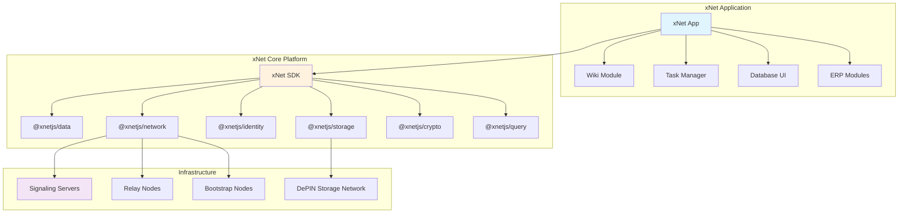
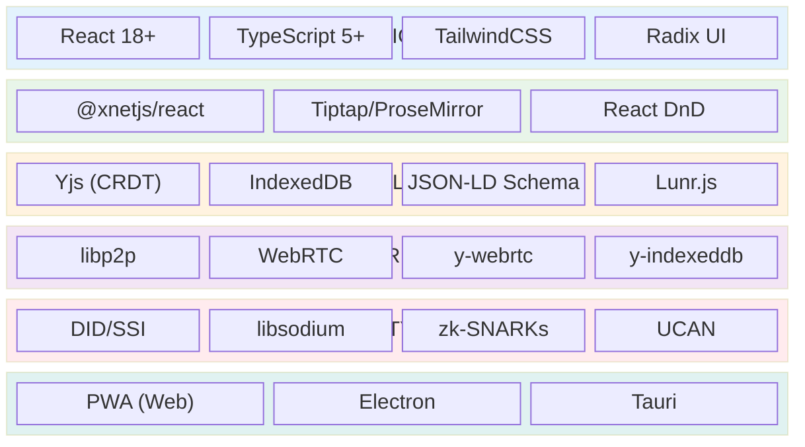
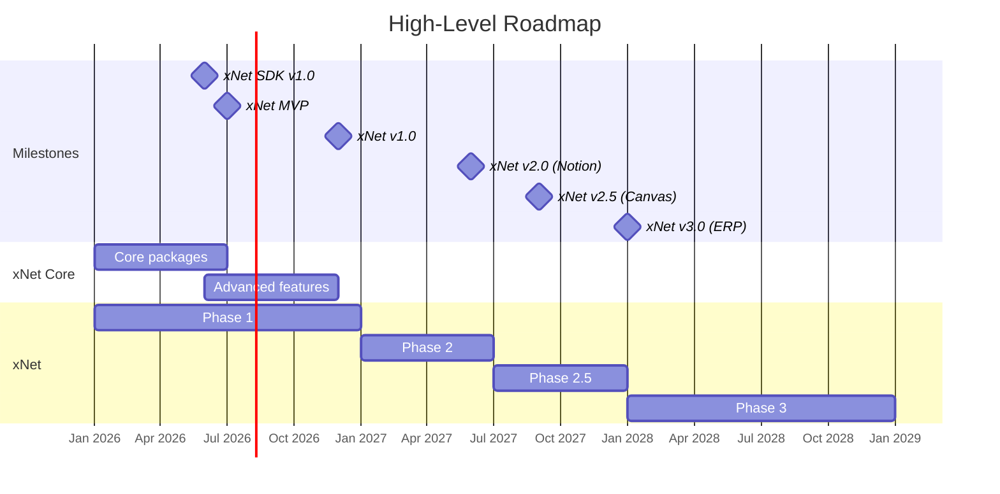
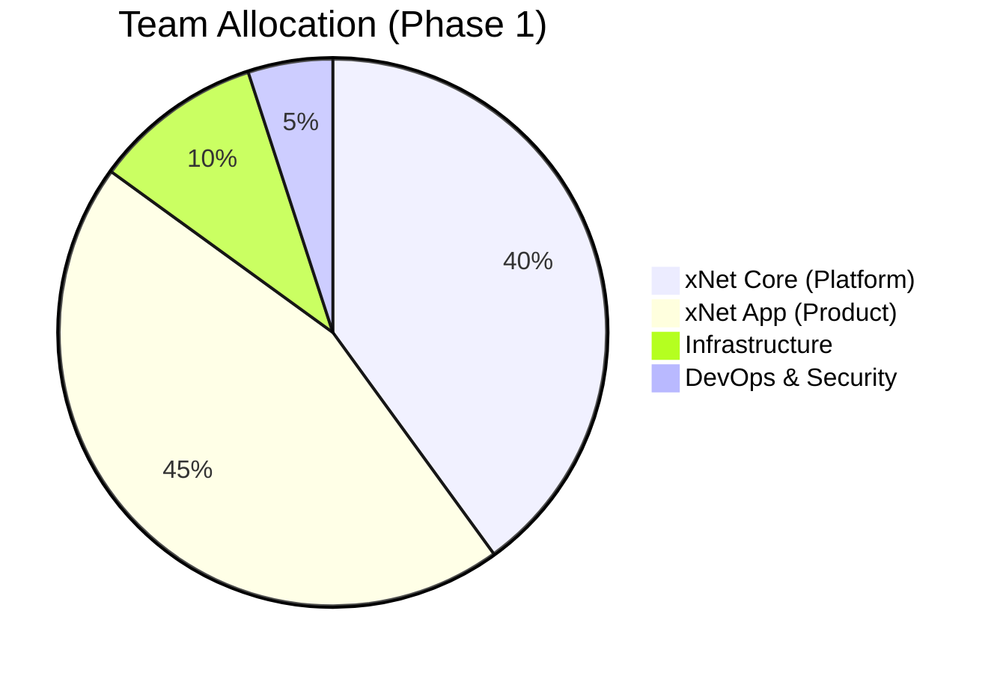

# xNet & xNet Implementation Plan

> Building the Decentralized Internet and Its Flagship Productivity App

**Version**: 2.0 | **Last Updated**: January 2026

---

## Overview

This plan covers the parallel development of two interconnected projects:

| Project  | Description                           | Role                 |
| -------- | ------------------------------------- | -------------------- |
| **xNet** | Decentralized internet infrastructure | Platform/SDK         |
| **xNet** | Collaborative productivity app        | Flagship application |

---

## Plan Documents

| #   | Document                                                           | Description                                                                    |
| --- | ------------------------------------------------------------------ | ------------------------------------------------------------------------------ |
| 1   | [xNet Core Platform](./01-xnet-core-platform.md)                   | SDK architecture, packages, infrastructure                                     |
| 2   | [Development Timeline](./02-development-timeline.md)               | Parallel tracks, Gantt chart, milestones                                       |
| 3   | [Phase 1: Wiki & Tasks](./03-phase-1-wiki-tasks.md)                | MVP features, technical implementation                                         |
| 4   | [Phase 2: Database UI](./04-phase-2-database-ui.md)                | Notion-like databases, views, formulas                                         |
| 5   | [Phase 3: ERP Platform](./05-phase-3-erp.md)                       | Modules, workflows, plugins                                                    |
| 6   | [Engineering Practices](./06-engineering-practices.md)             | Security, testing, CI/CD, contributing                                         |
| 7   | [Monetization & Adoption](./07-monetization-adoption.md)           | Revenue model, growth strategy                                                 |
| 8   | [Appendix: Code Samples](./08-appendix-code-samples.md)            | Reference implementations                                                      |
| 9   | [AI & MCP Interface](./09-ai-mcp-interface.md)                     | MCP tools for AI agent access, export/import                                   |
| 10  | [Scaling Architecture](./10-scaling-architecture.md)               | Federation, global namespaces, canvas, backups                                 |
| 11  | [Versioning Strategy](./11-versioning-strategy.md)                 | Forward-compatibility, no-migration design                                     |
| 12  | [React Integration](./12-react-integration.md)                     | @xnetjs/react hooks, reactive queries, reducing Zustand                        |
| 13  | [Identity & Authentication](./13-identity-authentication.md)       | Passkeys, DID:key, zero-friction onboarding                                    |
| 14  | [Notifications & Integrations](./14-notifications-integrations.md) | Push notifications, calendar sync, n8n workflows                               |
| 15  | [Enterprise Scale](./15-enterprise-scale.md)                       | Tiered architecture, event streaming, Tesla-scale planning                     |
| 16  | [Global Data Network](./16-global-data-network.md)                 | Long-term vision: planetary P2P data layer, economics, federation              |
| 17  | [Foundation Requirements](./17-foundation-requirements.md)         | Critical foundations needed NOW: content addressing, snapshots, signed updates |

**Related Documentation:**

- [Persistence & Durability Architecture](../PERSISTENCE_ARCHITECTURE.md)

---

## Vision

**xNet** is a fully decentralized internet architecture designed for mass adoption—enabling applications where data is local-first, stored on user devices, with P2P syncing and no central servers.

**xNet** is the flagship application built on xNet—a local-first, peer-to-peer collaborative productivity platform that evolves from a simple wiki and task manager into a fully customizable ERP system.

### Why Decentralized?

| Aspect          | Traditional Apps    | xNet                           |
| --------------- | ------------------- | ------------------------------ |
| Data Storage    | Centralized servers | Local-first, user devices      |
| Privacy         | Vendor has access   | E2E encrypted, user-controlled |
| Offline Support | Limited             | Full functionality             |
| Vendor Lock-in  | High                | Zero (open formats)            |
| Customization   | Limited             | Fully extensible               |
| Cost            | Recurring SaaS fees | Free/self-hosted               |

---

## Technology Stack

### Key Technology Choices

| Choice                 | Rationale                                                                      |
| ---------------------- | ------------------------------------------------------------------------------ |
| **React + TypeScript** | Industry standard, massive ecosystem, strong typing                            |
| **@xnetjs/react**      | Reactive hooks for data + sync; handles persistent state (Zustand for UI only) |
| **Tiptap/ProseMirror** | Battle-tested, excellent Yjs integration, rich plugins                         |
| **Yjs**                | Best CRDT for text, mature WebRTC integration, small bundle                    |
| **libp2p**             | Standard for decentralized networking (IPFS/Filecoin)                          |
| **Tauri**              | 10x smaller than Electron, better security, native performance                 |

---

## Roadmap Overview

| Phase         | Duration     | Goal                | Key Deliverable     |
| ------------- | ------------ | ------------------- | ------------------- |
| **Phase 1**   | Months 0-12  | Core productivity   | Wiki + Task Manager |
| **Phase 2**   | Months 12-18 | Database platform   | Notion-like UI      |
| **Phase 2.5** | Months 18-24 | Visual workspace    | Infinite Canvas     |
| **Phase 3**   | Months 24+   | Enterprise platform | Open-source ERP     |

---

## Team Structure

### Initial Team (5-10 developers)

| Role                      | Count | Focus                                |
| ------------------------- | ----- | ------------------------------------ |
| Tech Lead / Architect     | 1     | System design, P2P infrastructure    |
| Senior Frontend Engineers | 2     | React components, editor integration |
| Backend/P2P Engineers     | 2     | libp2p, sync protocols, storage      |
| Full-Stack Engineers      | 2-3   | Features end-to-end                  |
| DevOps / Security         | 1     | CI/CD, security audits               |
| Product / UX Designer     | 1     | User research, design system         |

### Team Allocation by Track

---

## Budget Estimates

| Category                 | Phase 1 (12 mo)   | Phase 2 (12 mo)   | Phase 3 (12+ mo) |
| ------------------------ | ----------------- | ----------------- | ---------------- |
| Personnel (avg $150k/yr) | $1.2M - $1.5M     | $1.8M - $2.4M     | $3M+             |
| Infrastructure & Tools   | $50k              | $100k             | $200k            |
| Security Audits          | $50k              | $100k             | $150k            |
| Marketing & Community    | $100k             | $200k             | $500k            |
| Contingency (15%)        | $210k             | $360k             | $580k            |
| **Total**                | **$1.6M - $1.9M** | **$2.6M - $3.2M** | **$4.4M+**       |

---

## Success Metrics

| Phase | Primary Metric         | Target  |
| ----- | ---------------------- | ------- |
| 1     | Monthly Active Users   | 50,000  |
| 2     | Daily Active Users     | 100,000 |
| 3     | Enterprise Deployments | 500+    |

### Key Performance Indicators

- **User Retention**: 40%+ monthly retention
- **P2P Sync Success Rate**: >99% message delivery
- **Offline Capability**: 100% features available offline
- **Sync Latency**: <500ms for real-time collaboration
- **Data Durability**: Zero data loss incidents

---

## Performance Specifications

### Expected Metrics

| Metric                  | Target   | Notes                             |
| ----------------------- | -------- | --------------------------------- |
| **Local read latency**  | <10ms    | Near-instant, no network          |
| **Local write latency** | <50ms    | CRDT update + IndexedDB           |
| **P2P sync latency**    | 50-300ms | Depends on network, peer location |
| **Offline capability**  | 100%     | All features work offline         |
| **Time to interactive** | <2s      | With cached data                  |

### System Limits

| Resource                   | Limit               | Constraint                                                        |
| -------------------------- | ------------------- | ----------------------------------------------------------------- |
| **Max local storage**      | 10GB (browser)      | Firefox: min(10% disk, 10GB); persistent mode: 50% disk up to 8TB |
| **Max local storage**      | Unlimited (desktop) | Tauri/Electron use native filesystem                              |
| **Max single document**    | ~100k words         | ProseMirror performance degrades beyond this                      |
| **Max blob size**          | 100MB recommended   | Larger files should use streaming                                 |
| **Max concurrent editors** | 20-30 (P2P mesh)    | y-webrtc limit; use relay for more                                |
| **Max P2P connections**    | 4-6 direct          | Mesh topology limit; beyond this use hub                          |
| **Max canvas nodes**       | 100,000+            | With R-tree spatial indexing and LOD                              |

### Local-First Performance Advantages

| Scenario                    | Traditional SaaS | xNet (Local-First)  |
| --------------------------- | ---------------- | ------------------- |
| **Read latency**            | 100-500ms        | <10ms               |
| **Write latency**           | 200-1000ms       | <50ms               |
| **Offline editing**         | Not possible     | Full functionality  |
| **Search**                  | 200-500ms        | <50ms (local index) |
| **Page load**               | 1-3s             | <500ms (cached)     |
| **Server cost (10k users)** | $500-2000/mo     | $80/mo (sync only)  |

### Potential Performance Issues

| Issue                           | Cause                                    | Mitigation                                      |
| ------------------------------- | ---------------------------------------- | ----------------------------------------------- |
| **CRDT tombstone accumulation** | Deleted content leaves markers           | Periodic garbage collection when all peers sync |
| **Large document lag**          | ProseMirror DOM overhead                 | Pagination, lazy loading of sections            |
| **IndexedDB write slowness**    | Transaction overhead (~2s for 1k writes) | Batch writes, use OPFS for 4x speedup           |
| **Memory pressure (browser)**   | Large Yjs documents in memory            | Unload inactive documents, use persistence      |
| **WebRTC connection storms**    | Many peers joining simultaneously        | Staggered connection, connection pooling        |
| **Symmetric NAT failures**      | ~10% of connections need relay           | Auto-fallback to circuit relay peers            |
| **Chrome large doc slowdown**   | Browser rendering, not JS                | Virtualize long documents, collapse sections    |
| **Sync conflicts on reconnect** | Large offline edit sets                  | Progressive sync, conflict UI for major changes |

### Architecture Performance Benefits

| Benefit                           | How It Works                                        |
| --------------------------------- | --------------------------------------------------- |
| **Zero loading spinners**         | Data already local; UI renders immediately          |
| **Instant search**                | Lunr.js index stored locally; no network round-trip |
| **Resilient to backend outages**  | Network not on critical path; sync when available   |
| **Low server costs**              | Server only coordinates; doesn't store/compute      |
| **Geographic latency eliminated** | No round-trip to distant datacenter                 |
| **Scales with device power**      | Modern phones/laptops are powerful; use them        |

### Benchmarks to Track

| Benchmark               | Method                    | Target                  |
| ----------------------- | ------------------------- | ----------------------- |
| **Document open time**  | Cold start to interactive | <500ms for 10k word doc |
| **Typing latency**      | Keypress to render        | <16ms (60fps)           |
| **Sync throughput**     | Updates per second        | >100 ops/sec            |
| **Search performance**  | Query to results          | <100ms for 10k docs     |
| **Canvas pan/zoom**     | Frame time                | <16ms (60fps)           |
| **Memory per document** | Heap size                 | <50MB for 10k word doc  |

---

## Quick Links

- **Repository Structure**: See [01-xnet-core-platform.md](./01-xnet-core-platform.md#package-structure)
- **Development Timeline**: See [02-development-timeline.md](./02-development-timeline.md)
- **Getting Started**: See [06-engineering-practices.md](./06-engineering-practices.md#development-setup)
- **Contributing**: See [06-engineering-practices.md](./06-engineering-practices.md#contribution-guidelines)

---

_Document Version: 2.0 | Last Updated: January 2026_
