# 16: Development Timeline

> Implementation schedule and milestone tracking for xNet MVP

## Overview

This document provides a clear roadmap for implementing xNet from scratch. Follow these phases in order - each builds on the previous.

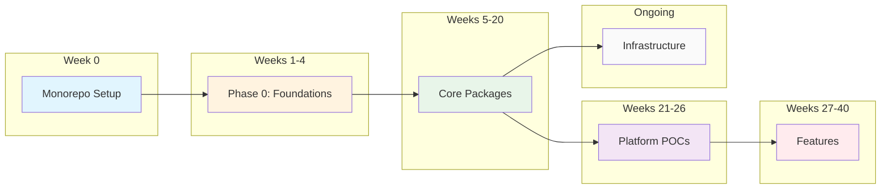

---

## Phase 0: Setup & Foundations (Weeks 0-4)

**Goal:** Establish project structure and critical design decisions before writing implementation code.

### Week 0: Monorepo Setup

```mermaid
gantt
    title Week 0: Monorepo Setup
    dateFormat  X
    axisFormat %d

    section Tasks
    Initialize pnpm workspace     :a1, 0, 1d
    Configure TypeScript          :a2, after a1, 1d
    Setup Vitest                  :a3, after a1, 1d
    Configure Turbo               :a4, after a2, 1d
    Setup ESLint/Prettier         :a5, after a2, 1d
    Create package scaffolds      :a6, after a4, 1d
    Setup GitHub CI               :a7, after a6, 1d
```

**Deliverables:**

- [ ] `pnpm install` works
- [ ] `pnpm build` runs (even if packages are empty)
- [ ] `pnpm test` runs
- [ ] CI pipeline passes
- [ ] All package directories exist with package.json

**Reference:** [00-monorepo-setup.md](./00-monorepo-setup.md)

---

### Weeks 1-4: Phase 0 Foundations

These specifications MUST be completed before implementation begins. They prevent costly rework later.

```mermaid
gantt
    title Weeks 1-4: Foundations
    dateFormat  X
    axisFormat Week %W

    section Week 1
    Content addressing spec       :f1, 0, 7d
    BLAKE3 hashing impl          :f2, 0, 7d
    Merkle tree design           :f3, 3, 4d

    section Week 2
    SignedUpdate type            :f4, 7, 7d
    Snapshot strategy            :f5, 7, 7d
    Compaction design            :f6, 10, 4d

    section Week 3
    DID resolution protocol      :f7, 14, 7d
    Bootstrap strategy           :f8, 14, 7d

    section Week 4
    Query federation spec        :f9, 21, 7d
    Role-based permissions       :f10, 21, 7d
    Foundation validation        :milestone, 28, 0d
```

**Validation Gate:** Before proceeding, verify:

- [ ] Can hash 1MB in <10ms
- [ ] Can create/load snapshots
- [ ] Signed updates verify correctly
- [ ] DID resolution strategy documented
- [ ] Permission model handles groups

**Reference:** [01-phase0-foundations.md](./01-phase0-foundations.md)

---

## Phase 1: Core Packages (Weeks 5-20)

**Goal:** Build the @xnetjs/\* packages with full test coverage.

### Package Build Order

Build packages in this exact order due to dependencies:

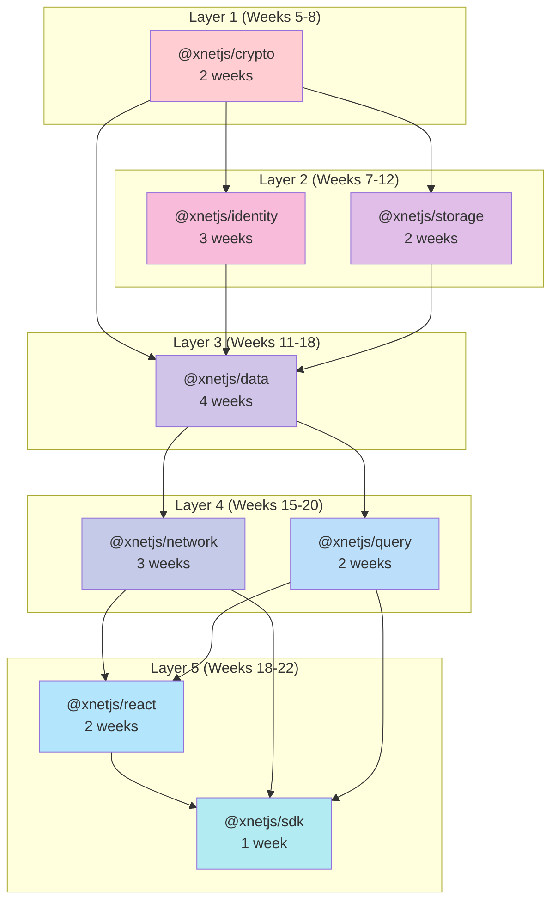

### Detailed Package Schedule

```mermaid
gantt
    title Core Packages Timeline
    dateFormat  X
    axisFormat Week %W

    section @xnetjs/crypto
    Hashing (BLAKE3)             :c1, 0, 3d
    Symmetric encryption         :c2, 3, 3d
    Asymmetric (X25519)          :c3, 6, 3d
    Signing (Ed25519)            :c4, 9, 3d
    Tests & docs                 :c5, 12, 2d

    section @xnetjs/identity
    DID:key generation           :i1, 7, 4d
    Key derivation               :i2, 11, 3d
    UCAN tokens                  :i3, 14, 5d
    Passkey storage              :i4, 19, 3d
    Tests & docs                 :i5, 22, 2d

    section @xnetjs/storage
    Storage interface            :s1, 7, 2d
    IndexedDB adapter            :s2, 9, 4d
    Memory adapter               :s3, 13, 2d
    Snapshot manager             :s4, 15, 4d
    Tests & docs                 :s5, 19, 2d

    section @xnetjs/data
    Document types               :d1, 21, 3d
    Yjs integration              :d2, 24, 5d
    Signed updates               :d3, 29, 5d
    Block registry               :d4, 34, 4d
    Awareness/presence           :d5, 38, 3d
    Tests & docs                 :d6, 41, 3d

    section @xnetjs/network
    libp2p node                  :n1, 35, 5d
    Sync protocol                :n2, 40, 5d
    y-webrtc provider            :n3, 45, 4d
    DID resolution               :n4, 49, 4d
    Tests & docs                 :n5, 53, 3d

    section @xnetjs/query
    Local query engine           :q1, 42, 4d
    Search index                 :q2, 46, 4d
    Federation (basic)           :q3, 50, 4d
    Tests & docs                 :q4, 54, 2d

    section @xnetjs/react
    XNet context                 :r1, 49, 3d
    useDocument hook             :r2, 52, 3d
    useQuery hook                :r3, 55, 3d
    useSync/usePresence          :r4, 58, 3d
    Tests & docs                 :r5, 61, 2d

    section @xnetjs/sdk
    Client class                 :k1, 56, 4d
    Presets                      :k2, 60, 2d
    Integration tests            :k3, 62, 2d
```

### Per-Package Checklist

Complete each package before moving to the next:

#### @xnetjs/crypto

- [ ] `hash()` - BLAKE3 hashing
- [ ] `encrypt()`/`decrypt()` - XChaCha20-Poly1305
- [ ] `generateKeyPair()` - X25519
- [ ] `sign()`/`verify()` - Ed25519
- [ ] > 95% test coverage
- [ ] Performance benchmarks pass

#### @xnetjs/identity

- [ ] `createDID()` - DID:key generation
- [ ] `parseDID()` - DID parsing
- [ ] `createUCAN()` - Token creation
- [ ] `verifyUCAN()` - Token verification
- [ ] > 85% test coverage

#### @xnetjs/storage

- [ ] `IndexedDBAdapter` - Browser storage
- [ ] `MemoryAdapter` - Test storage
- [ ] `SnapshotManager` - Snapshot creation/loading
- [ ] > 80% test coverage

#### @xnetjs/data

- [ ] `createDocument()` - Document creation
- [ ] `signUpdate()` - Update signing
- [ ] `verifyUpdate()` - Update verification
- [ ] Block registry with types
- [ ] Awareness for presence
- [ ] > 80% test coverage

#### @xnetjs/network

- [ ] `createNode()` - libp2p node
- [ ] `createSyncProtocol()` - Sync protocol
- [ ] y-webrtc integration
- [ ] DID resolver
- [ ] > 70% test coverage

#### @xnetjs/query

- [ ] `createLocalQueryEngine()` - Local queries
- [ ] `createSearchIndex()` - Full-text search
- [ ] Federation router (basic)
- [ ] > 85% test coverage

#### @xnetjs/react

- [ ] `XNetProvider` - Context provider
- [ ] `useDocument()` - Document hook
- [ ] `useQuery()` - Query hook
- [ ] `useSync()` - Sync status
- [ ] `usePresence()` - User presence
- [ ] > 75% test coverage

#### @xnetjs/sdk

- [ ] `createXNetClient()` - Unified client
- [ ] Browser preset
- [ ] Integration tests pass
- [ ] > 80% test coverage

**References:** [02-xnet-crypto.md](./02-xnet-crypto.md) through [09-xnet-sdk.md](./09-xnet-sdk.md)

---

## Phase 2: Platform POCs (Weeks 21-26)

**Goal:** Prove the SDK works on all target platforms.

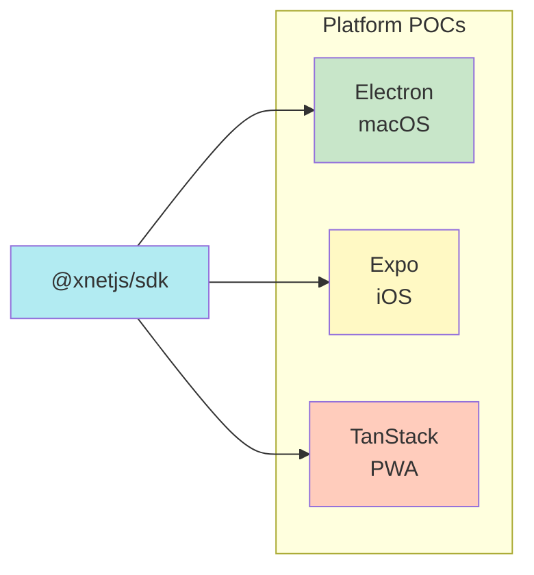

### Platform Priority Order

1. **Web (TanStack PWA)** - Fastest iteration, easiest debugging
2. **Electron (macOS)** - Desktop with SQLite
3. **Expo (iOS)** - Mobile with native storage

### POC Requirements

Each platform must demonstrate:

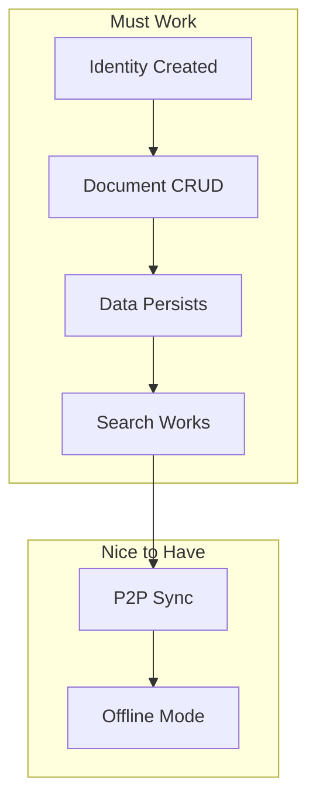

### Platform Schedule

```mermaid
gantt
    title Platform POC Timeline
    dateFormat  X
    axisFormat Week %W

    section Web (TanStack)
    Vite + TanStack setup        :w1, 0, 2d
    XNetProvider integration     :w2, 2, 2d
    Basic routing                :w3, 4, 2d
    Document list/view           :w4, 6, 3d
    PWA setup                    :w5, 9, 2d
    Validation                   :w6, 11, 2d

    section Electron
    Electron-vite setup          :e1, 7, 2d
    SQLite adapter               :e2, 9, 3d
    IPC handlers                 :e3, 12, 3d
    Basic UI                     :e4, 15, 3d
    macOS build                  :e5, 18, 2d
    Validation                   :e6, 20, 2d

    section Expo
    Expo project setup           :x1, 14, 2d
    expo-sqlite adapter          :x2, 16, 3d
    Navigation setup             :x3, 19, 2d
    Basic screens                :x4, 21, 3d
    iOS build                    :x5, 24, 2d
    Validation                   :x6, 26, 2d
```

### Validation Checklist

#### Web POC

- [ ] App loads in browser
- [ ] Can create/edit documents
- [ ] Data persists in IndexedDB
- [ ] Works offline (PWA)
- [ ] Search returns results

#### Electron POC

- [ ] App builds for macOS (Intel + ARM)
- [ ] Can create/edit documents
- [ ] Data persists in SQLite
- [ ] Window chrome looks native

#### Expo POC

- [ ] App runs on iOS simulator
- [ ] Can create/edit documents
- [ ] Data persists in SQLite
- [ ] Navigation works

**References:** [10-platform-electron.md](./10-platform-electron.md), [11-platform-expo.md](./11-platform-expo.md), [12-platform-web.md](./12-platform-web.md)

---

## Phase 3: Features (Weeks 27-40)

**Goal:** Build the actual xNet application features.

### Feature Dependency Graph

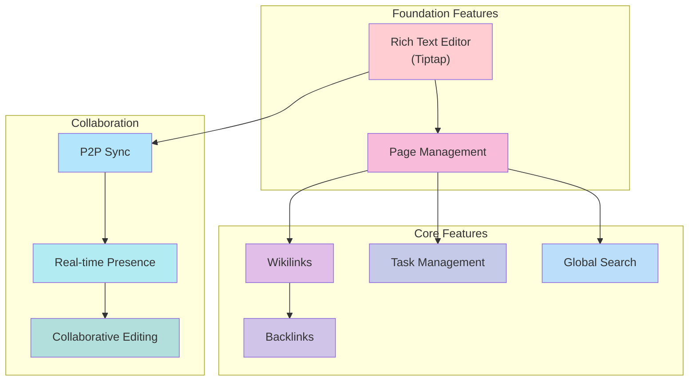

### Feature Schedule

```mermaid
gantt
    title Feature Implementation Timeline
    dateFormat  X
    axisFormat Week %W

    section Editor
    Tiptap setup                 :f1, 0, 3d
    Basic formatting             :f2, 3, 4d
    Code blocks                  :f3, 7, 3d
    Lists & todos                :f4, 10, 3d

    section Pages
    Page CRUD                    :p1, 7, 4d
    Page hierarchy               :p2, 11, 3d
    Page icons/covers            :p3, 14, 2d

    section Wikilinks
    [[text]] detection           :w1, 14, 3d
    Link rendering               :w2, 17, 2d
    Page creation from link      :w3, 19, 2d

    section Backlinks
    Link indexing                :b1, 21, 3d
    Backlinks panel              :b2, 24, 3d
    Context snippets             :b3, 27, 2d

    section Tasks
    Task item extension          :t1, 28, 4d
    Due dates                    :t2, 32, 2d
    Task list view               :t3, 34, 3d

    section Search
    Cmd+K modal                  :s1, 35, 3d
    Result ranking               :s2, 38, 2d
    Filters                      :s3, 40, 2d

    section Collaboration
    y-webrtc setup               :c1, 35, 4d
    Cursor sync                  :c2, 39, 3d
    Presence avatars             :c3, 42, 2d
```

### Feature Checklist

#### Rich Text Editor

- [ ] Bold, italic, underline
- [ ] Headings (H1-H3)
- [ ] Bullet & numbered lists
- [ ] Code blocks with syntax
- [ ] Block quotes
- [ ] Horizontal rules
- [ ] Undo/redo

#### Page Management

- [ ] Create page
- [ ] Edit page title
- [ ] Delete page
- [ ] Page hierarchy (parent/child)
- [ ] Page icons
- [ ] Page covers

#### Wikilinks

- [ ] `[[text]]` creates link
- [ ] Click navigates
- [ ] Autocomplete suggestions
- [ ] Create page from link

#### Backlinks

- [ ] Index all links
- [ ] Show backlinks panel
- [ ] Context snippets
- [ ] Click to navigate

#### Task Management

- [ ] Checkbox tasks
- [ ] Due dates
- [ ] Priority levels
- [ ] Task list view
- [ ] Filter by status

#### Search

- [ ] Cmd+K opens search
- [ ] Debounced search
- [ ] Results with snippets
- [ ] Click to navigate

#### Collaboration

- [ ] Documents sync via P2P
- [ ] Cursor positions visible
- [ ] Presence avatars
- [ ] Conflict-free editing

**Reference:** [13-xnet-features.md](./13-xnet-features.md)

---

## Phase 4: Infrastructure (Ongoing)

**Goal:** Deploy supporting infrastructure for production P2P.

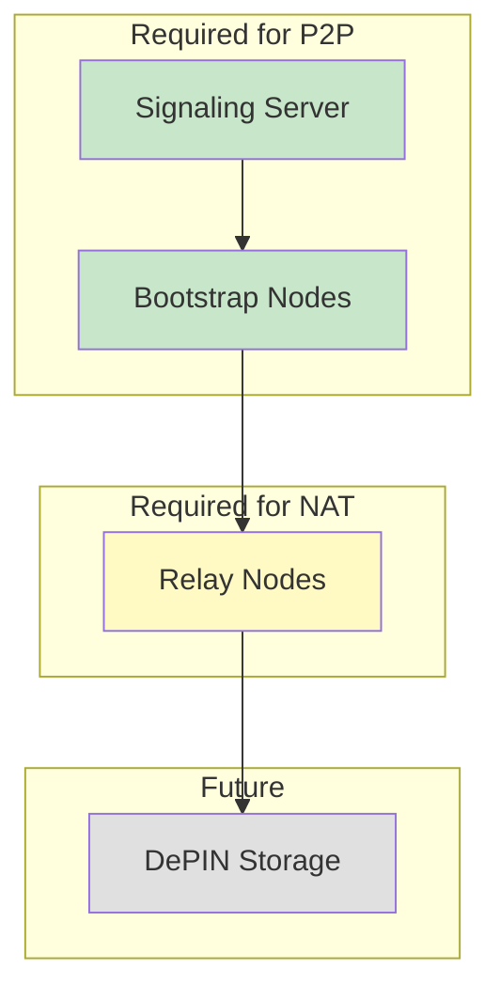

### Infrastructure Priority

| Priority | Component        | When Needed        |
| -------- | ---------------- | ------------------ |
| P0       | Signaling Server | Before P2P testing |
| P0       | Bootstrap Nodes  | Before P2P testing |
| P1       | Relay Nodes      | Before production  |
| P2       | DePIN Storage    | Phase 2+           |

### Deployment Order

1. **Local Development** - Run signaling locally
2. **Staging** - Deploy 1 of each to fly.io
3. **Production** - Deploy 3 of each across regions

**Reference:** [15-infrastructure.md](./15-infrastructure.md)

---

## Complete Timeline Overview

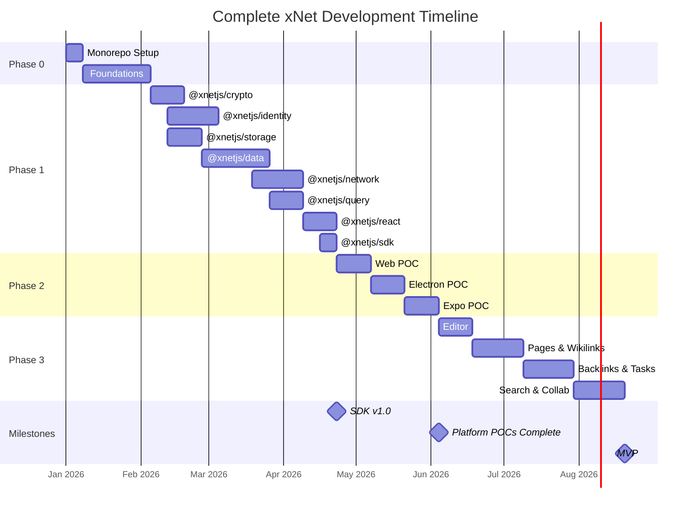

---

## Quick Start Checklist

For an AI agent starting fresh:

### Day 1

- [ ] Read CLAUDE.md
- [ ] Read this document (16-timeline.md)
- [ ] Run through 00-monorepo-setup.md

### Week 1

- [ ] Complete monorepo setup
- [ ] Start 01-phase0-foundations.md
- [ ] Implement content addressing

### Week 2-4

- [ ] Complete all Phase 0 foundations
- [ ] Validate all foundation requirements

### Week 5+

- [ ] Follow package order exactly
- [ ] Complete each package fully before moving on
- [ ] Run tests continuously

---

## Decision Points

### When to Pause and Assess

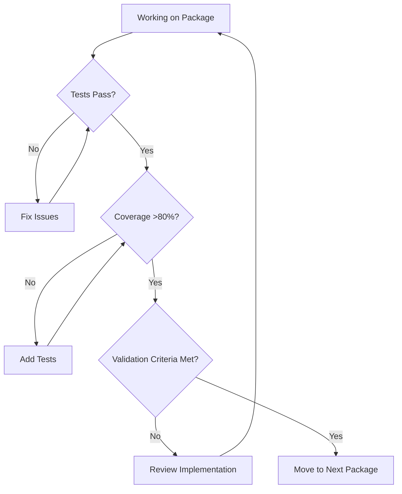

### When to Ask for Help

- Architecture decisions not covered in specs
- Performance issues that can't be resolved
- Platform-specific bugs
- Security concerns

---

## Summary

| Phase | Duration | Goal                | Success Criteria              |
| ----- | -------- | ------------------- | ----------------------------- |
| 0     | 5 weeks  | Setup + Foundations | All specs validated           |
| 1     | 16 weeks | Core Packages       | All packages at >80% coverage |
| 2     | 6 weeks  | Platform POCs       | All 3 platforms working       |
| 3     | 14 weeks | Features            | MVP feature-complete          |
| 4     | Ongoing  | Infrastructure      | P2P works in production       |

**Total to MVP: ~40 weeks**

---

[← Back to README](./README.md) | [Next Steps (Future Vision) →](./17-next-steps.md)
