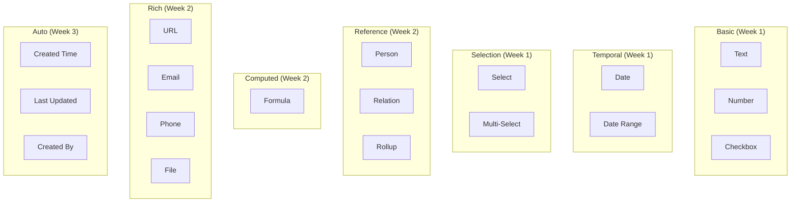

# 01: Property Types

> Implementing all 16 property types (COMPLETE - see @xnetjs/data)

**Status:** COMPLETE - implemented in `@xnetjs/data/schema/properties/`
**Duration:** 3 weeks (completed)
**Dependencies:** @xnetjs/sync (Lamport timestamps), @xnetjs/storage

## Overview

The property type system is implemented in `@xnetjs/data`. Each property type has:

- Schema definition helper (e.g., `text()`, `select()`)
- TypeScript type inference
- Validation rules (at create/update time)
- Default values

> **Note:** Display/Editor components and Filter/Sort UI are part of `@xnetjs/views` (Phase 2).
> This document describes the reference implementation for those components.

## Property Type Categories



## Current Implementation

Properties are defined in `@xnetjs/data/schema/properties/` using helper functions:

```typescript
// packages/data/src/schema/properties/index.ts
export {
  text,
  number,
  checkbox, // Basic
  date,
  dateRange, // Temporal
  select,
  multiSelect, // Selection
  person,
  relation, // References
  url,
  email,
  phone,
  file, // Rich
  created,
  updated,
  createdBy // Auto
}

// Usage in schema definition
const TaskSchema = defineSchema({
  name: 'Task',
  namespace: 'xnet://xnet.dev/',
  properties: {
    title: text({ required: true }),
    status: select({ options: ['todo', 'in-progress', 'done'] as const })
  }
})
```

## View Layer Interface (Phase 2)

For `@xnetjs/views`, each property type needs display/editor components:

### Base Interface

```typescript
// packages/views/src/properties/types.ts (TO BUILD)

export interface PropertyHandler<T = unknown> {
  type: PropertyType

  // Validation
  validate(value: unknown, config: PropertyConfig): ValidationResult
  coerce(value: unknown, config: PropertyConfig): T | null

  // Display
  format(value: T, config: PropertyConfig): string
  render(value: T, config: PropertyConfig): ReactNode

  // Editor
  Editor: React.FC<PropertyEditorProps<T>>

  // Filtering
  filterOperators: FilterOperator[]
  applyFilter(value: T, operator: FilterOperator, filterValue: unknown): boolean

  // Sorting
  compare(a: T, b: T, config: PropertyConfig): number

  // Serialization
  serialize(value: T): unknown
  deserialize(data: unknown): T
}

export interface PropertyEditorProps<T> {
  value: T | null
  config: PropertyConfig
  onChange: (value: T | null) => void
  onBlur?: () => void
  autoFocus?: boolean
  disabled?: boolean
}

export interface ValidationResult {
  valid: boolean
  error?: string
}
```

### Property Handler Registry

```typescript
// packages/views/src/properties/registry.ts (TO BUILD)

import { textProperty } from './text'
import { numberProperty } from './number'
import { checkboxProperty } from './checkbox'
// ... import all property handlers

const propertyRegistry = new Map<PropertyType, PropertyHandler>([
  ['text', textProperty],
  ['number', numberProperty],
  ['checkbox', checkboxProperty],
  ['date', dateProperty],
  ['dateRange', dateRangeProperty],
  ['select', selectProperty],
  ['multiSelect', multiSelectProperty],
  ['person', personProperty],
  ['relation', relationProperty],
  // Note: rollup removed - compute at query time, don't store
  ['formula', formulaProperty],
  ['url', urlProperty],
  ['email', emailProperty],
  ['phone', phoneProperty],
  ['file', fileProperty],
  ['created', createdProperty],
  ['updated', updatedProperty],
  ['createdBy', createdByProperty]
])

export function getPropertyHandler(type: PropertyType): PropertyHandler {
  const handler = propertyRegistry.get(type)
  if (!handler) {
    throw new Error(`Unknown property type: ${type}`)
  }
  return handler
}
```

---

## Property Implementations

### 1. Text Property

```typescript
// packages/views/src/properties/text.ts (TO BUILD)

export interface TextConfig {
  maxLength?: number
  richText?: boolean
}

export const textProperty: PropertyHandler<string> = {
  type: 'text',

  validate(value, config: TextConfig) {
    if (typeof value !== 'string') {
      return { valid: false, error: 'Must be a string' }
    }
    if (config.maxLength && value.length > config.maxLength) {
      return { valid: false, error: `Max length is ${config.maxLength}` }
    }
    return { valid: true }
  },

  coerce(value) {
    if (value === null || value === undefined) return null
    return String(value)
  },

  format(value) {
    return value || ''
  },

  render(value) {
    return <span className="property-text">{value}</span>
  },

  Editor: ({ value, onChange, onBlur, autoFocus }) => (
    <input
      type="text"
      value={value || ''}
      onChange={(e) => onChange(e.target.value || null)}
      onBlur={onBlur}
      autoFocus={autoFocus}
      className="property-editor-text"
    />
  ),

  filterOperators: [
    'equals', 'notEquals', 'contains', 'notContains',
    'startsWith', 'endsWith', 'isEmpty', 'isNotEmpty'
  ],

  applyFilter(value, operator, filterValue) {
    const v = value?.toLowerCase() || ''
    const f = String(filterValue).toLowerCase()

    switch (operator) {
      case 'equals': return v === f
      case 'notEquals': return v !== f
      case 'contains': return v.includes(f)
      case 'notContains': return !v.includes(f)
      case 'startsWith': return v.startsWith(f)
      case 'endsWith': return v.endsWith(f)
      case 'isEmpty': return !value
      case 'isNotEmpty': return !!value
      default: return true
    }
  },

  compare(a, b) {
    return (a || '').localeCompare(b || '')
  },

  serialize(value) { return value },
  deserialize(data) { return data as string },
}
```

### 2. Number Property

```typescript
// packages/views/src/properties/number.ts (TO BUILD)

export interface NumberConfig {
  format: 'number' | 'percent' | 'currency' | 'progress'
  precision?: number
  min?: number
  max?: number
  currency?: string  // ISO 4217 code
}

export const numberProperty: PropertyHandler<number> = {
  type: 'number',

  validate(value, config: NumberConfig) {
    if (typeof value !== 'number' || isNaN(value)) {
      return { valid: false, error: 'Must be a number' }
    }
    if (config.min !== undefined && value < config.min) {
      return { valid: false, error: `Minimum value is ${config.min}` }
    }
    if (config.max !== undefined && value > config.max) {
      return { valid: false, error: `Maximum value is ${config.max}` }
    }
    return { valid: true }
  },

  coerce(value) {
    if (value === null || value === undefined || value === '') return null
    const num = Number(value)
    return isNaN(num) ? null : num
  },

  format(value, config: NumberConfig) {
    if (value === null || value === undefined) return ''

    switch (config.format) {
      case 'percent':
        return `${(value * 100).toFixed(config.precision ?? 0)}%`
      case 'currency':
        return new Intl.NumberFormat(undefined, {
          style: 'currency',
          currency: config.currency || 'USD'
        }).format(value)
      case 'progress':
        return `${Math.round(value)}%`
      default:
        return value.toFixed(config.precision ?? 0)
    }
  },

  render(value, config: NumberConfig) {
    if (config.format === 'progress') {
      return (
        <div className="property-progress">
          <div
            className="property-progress-bar"
            style={{ width: `${Math.min(100, Math.max(0, value || 0))}%` }}
          />
          <span>{this.format(value, config)}</span>
        </div>
      )
    }
    return <span className="property-number">{this.format(value, config)}</span>
  },

  Editor: ({ value, onChange, config, onBlur, autoFocus }) => (
    <input
      type="number"
      value={value ?? ''}
      onChange={(e) => onChange(e.target.value ? Number(e.target.value) : null)}
      onBlur={onBlur}
      autoFocus={autoFocus}
      min={config.min}
      max={config.max}
      step={config.precision ? Math.pow(10, -config.precision) : 1}
      className="property-editor-number"
    />
  ),

  filterOperators: [
    'equals', 'notEquals', 'greaterThan', 'lessThan',
    'greaterOrEqual', 'lessOrEqual', 'isEmpty', 'isNotEmpty'
  ],

  applyFilter(value, operator, filterValue) {
    const f = Number(filterValue)

    switch (operator) {
      case 'equals': return value === f
      case 'notEquals': return value !== f
      case 'greaterThan': return value !== null && value > f
      case 'lessThan': return value !== null && value < f
      case 'greaterOrEqual': return value !== null && value >= f
      case 'lessOrEqual': return value !== null && value <= f
      case 'isEmpty': return value === null
      case 'isNotEmpty': return value !== null
      default: return true
    }
  },

  compare(a, b) {
    if (a === null && b === null) return 0
    if (a === null) return 1
    if (b === null) return -1
    return a - b
  },

  serialize(value) { return value },
  deserialize(data) { return data as number },
}
```

### 3. Checkbox Property

```typescript
// packages/views/src/properties/checkbox.ts (TO BUILD)

export const checkboxProperty: PropertyHandler<boolean> = {
  type: 'checkbox',

  validate(value) {
    if (typeof value !== 'boolean') {
      return { valid: false, error: 'Must be a boolean' }
    }
    return { valid: true }
  },

  coerce(value) {
    if (value === null || value === undefined) return false
    return Boolean(value)
  },

  format(value) {
    return value ? 'Yes' : 'No'
  },

  render(value) {
    return (
      <span className={`property-checkbox ${value ? 'checked' : ''}`}>
        {value ? '☑' : '☐'}
      </span>
    )
  },

  Editor: ({ value, onChange }) => (
    <input
      type="checkbox"
      checked={value || false}
      onChange={(e) => onChange(e.target.checked)}
      className="property-editor-checkbox"
    />
  ),

  filterOperators: ['equals'],

  applyFilter(value, operator, filterValue) {
    return value === Boolean(filterValue)
  },

  compare(a, b) {
    return (a ? 1 : 0) - (b ? 1 : 0)
  },

  serialize(value) { return value },
  deserialize(data) { return Boolean(data) },
}
```

### 4. Date Property

```typescript
// packages/views/src/properties/date.ts (TO BUILD)

export interface DateConfig {
  includeTime: boolean
  dateFormat?: string  // e.g., 'MMM D, YYYY'
  timeFormat?: '12h' | '24h'
}

export const dateProperty: PropertyHandler<number> = {
  type: 'date',

  validate(value) {
    if (typeof value !== 'number' || isNaN(value)) {
      return { valid: false, error: 'Must be a valid timestamp' }
    }
    return { valid: true }
  },

  coerce(value) {
    if (value === null || value === undefined) return null
    if (typeof value === 'number') return value
    if (typeof value === 'string') {
      const parsed = Date.parse(value)
      return isNaN(parsed) ? null : parsed
    }
    if (value instanceof Date) return value.getTime()
    return null
  },

  format(value, config: DateConfig) {
    if (!value) return ''
    const date = new Date(value)
    // Use Intl.DateTimeFormat for localized formatting
    const options: Intl.DateTimeFormatOptions = {
      year: 'numeric',
      month: 'short',
      day: 'numeric',
      ...(config.includeTime && {
        hour: 'numeric',
        minute: '2-digit',
        hour12: config.timeFormat !== '24h'
      })
    }
    return new Intl.DateTimeFormat(undefined, options).format(date)
  },

  render(value, config) {
    return <span className="property-date">{this.format(value, config)}</span>
  },

  Editor: ({ value, onChange, config, onBlur }) => {
    const inputType = config.includeTime ? 'datetime-local' : 'date'
    const inputValue = value
      ? new Date(value).toISOString().slice(0, config.includeTime ? 16 : 10)
      : ''

    return (
      <input
        type={inputType}
        value={inputValue}
        onChange={(e) => {
          const parsed = Date.parse(e.target.value)
          onChange(isNaN(parsed) ? null : parsed)
        }}
        onBlur={onBlur}
        className="property-editor-date"
      />
    )
  },

  filterOperators: [
    'equals', 'before', 'after', 'onOrBefore', 'onOrAfter',
    'between', 'isEmpty', 'isNotEmpty',
    'isRelative'  // "in the last 7 days", etc.
  ],

  applyFilter(value, operator, filterValue) {
    if (operator === 'isEmpty') return value === null
    if (operator === 'isNotEmpty') return value !== null
    if (value === null) return false

    const f = Number(filterValue)
    switch (operator) {
      case 'equals': return isSameDay(value, f)
      case 'before': return value < f
      case 'after': return value > f
      case 'onOrBefore': return value <= endOfDay(f)
      case 'onOrAfter': return value >= startOfDay(f)
      default: return true
    }
  },

  compare(a, b) {
    if (a === null && b === null) return 0
    if (a === null) return 1
    if (b === null) return -1
    return a - b
  },

  serialize(value) { return value },
  deserialize(data) { return data as number },
}

// Helper functions
function isSameDay(a: number, b: number): boolean {
  const dateA = new Date(a)
  const dateB = new Date(b)
  return dateA.toDateString() === dateB.toDateString()
}

function startOfDay(ts: number): number {
  const date = new Date(ts)
  date.setHours(0, 0, 0, 0)
  return date.getTime()
}

function endOfDay(ts: number): number {
  const date = new Date(ts)
  date.setHours(23, 59, 59, 999)
  return date.getTime()
}
```

### 5. Select Property

```typescript
// packages/views/src/properties/select.ts (TO BUILD)

export interface SelectOption {
  id: string
  name: string
  color: string  // Tailwind color name or hex
}

export interface SelectConfig {
  options: SelectOption[]
}

export const selectProperty: PropertyHandler<string> = {
  type: 'select',

  validate(value, config: SelectConfig) {
    if (value === null) return { valid: true }
    const optionIds = config.options.map(o => o.id)
    if (!optionIds.includes(value)) {
      return { valid: false, error: 'Invalid option' }
    }
    return { valid: true }
  },

  coerce(value) {
    if (value === null || value === undefined || value === '') return null
    return String(value)
  },

  format(value, config: SelectConfig) {
    if (!value) return ''
    const option = config.options.find(o => o.id === value)
    return option?.name || ''
  },

  render(value, config: SelectConfig) {
    if (!value) return null
    const option = config.options.find(o => o.id === value)
    if (!option) return null

    return (
      <span
        className="property-select-tag"
        style={{ backgroundColor: option.color }}
      >
        {option.name}
      </span>
    )
  },

  Editor: ({ value, onChange, config }) => (
    <SelectEditor
      value={value}
      options={config.options}
      onChange={onChange}
      allowCreate={true}
    />
  ),

  filterOperators: ['equals', 'notEquals', 'isEmpty', 'isNotEmpty'],

  applyFilter(value, operator, filterValue) {
    switch (operator) {
      case 'equals': return value === filterValue
      case 'notEquals': return value !== filterValue
      case 'isEmpty': return value === null
      case 'isNotEmpty': return value !== null
      default: return true
    }
  },

  compare(a, b, config: SelectConfig) {
    // Sort by option order in config
    const indexA = config.options.findIndex(o => o.id === a)
    const indexB = config.options.findIndex(o => o.id === b)
    return indexA - indexB
  },

  serialize(value) { return value },
  deserialize(data) { return data as string },
}
```

### 6. Multi-Select Property

```typescript
// packages/views/src/properties/multi-select.ts (TO BUILD)

export const multiSelectProperty: PropertyHandler<string[]> = {
  type: 'multiSelect',

  validate(value, config: SelectConfig) {
    if (!Array.isArray(value)) {
      return { valid: false, error: 'Must be an array' }
    }
    const optionIds = config.options.map(o => o.id)
    for (const v of value) {
      if (!optionIds.includes(v)) {
        return { valid: false, error: `Invalid option: ${v}` }
      }
    }
    return { valid: true }
  },

  coerce(value) {
    if (value === null || value === undefined) return []
    if (Array.isArray(value)) return value.map(String)
    return [String(value)]
  },

  format(value, config: SelectConfig) {
    if (!value?.length) return ''
    return value
      .map(v => config.options.find(o => o.id === v)?.name)
      .filter(Boolean)
      .join(', ')
  },

  render(value, config: SelectConfig) {
    if (!value?.length) return null

    return (
      <div className="property-multi-select">
        {value.map(v => {
          const option = config.options.find(o => o.id === v)
          if (!option) return null
          return (
            <span
              key={v}
              className="property-select-tag"
              style={{ backgroundColor: option.color }}
            >
              {option.name}
            </span>
          )
        })}
      </div>
    )
  },

  Editor: ({ value, onChange, config }) => (
    <MultiSelectEditor
      value={value || []}
      options={config.options}
      onChange={onChange}
      allowCreate={true}
    />
  ),

  filterOperators: ['contains', 'notContains', 'containsAll', 'isEmpty', 'isNotEmpty'],

  applyFilter(value, operator, filterValue) {
    const values = value || []
    const filters = Array.isArray(filterValue) ? filterValue : [filterValue]

    switch (operator) {
      case 'contains': return filters.some(f => values.includes(f))
      case 'notContains': return !filters.some(f => values.includes(f))
      case 'containsAll': return filters.every(f => values.includes(f))
      case 'isEmpty': return values.length === 0
      case 'isNotEmpty': return values.length > 0
      default: return true
    }
  },

  compare(a, b) {
    return (a?.length || 0) - (b?.length || 0)
  },

  serialize(value) { return value },
  deserialize(data) { return data as string[] },
}
```

### 7. Person Property

```typescript
// packages/views/src/properties/person.ts (TO BUILD)

export interface PersonConfig {
  allowMultiple: boolean
}

export const personProperty: PropertyHandler<string[]> = {
  type: 'person',

  validate(value, config: PersonConfig) {
    if (!Array.isArray(value)) {
      return { valid: false, error: 'Must be an array of DIDs' }
    }
    if (!config.allowMultiple && value.length > 1) {
      return { valid: false, error: 'Only one person allowed' }
    }
    // Validate DID format
    for (const did of value) {
      if (!did.startsWith('did:key:')) {
        return { valid: false, error: `Invalid DID: ${did}` }
      }
    }
    return { valid: true }
  },

  coerce(value) {
    if (value === null || value === undefined) return []
    if (Array.isArray(value)) return value
    return [value]
  },

  format(value) {
    // Would need user lookup in real implementation
    return value?.join(', ') || ''
  },

  render(value) {
    if (!value?.length) return null

    return (
      <div className="property-person">
        {value.map(did => (
          <PersonAvatar key={did} did={did} />
        ))}
      </div>
    )
  },

  Editor: ({ value, onChange, config }) => (
    <PersonPicker
      value={value || []}
      onChange={onChange}
      multiple={config.allowMultiple}
    />
  ),

  filterOperators: ['contains', 'notContains', 'isEmpty', 'isNotEmpty'],

  applyFilter(value, operator, filterValue) {
    const values = value || []

    switch (operator) {
      case 'contains': return values.includes(filterValue as string)
      case 'notContains': return !values.includes(filterValue as string)
      case 'isEmpty': return values.length === 0
      case 'isNotEmpty': return values.length > 0
      default: return true
    }
  },

  compare(a, b) {
    return (a?.length || 0) - (b?.length || 0)
  },

  serialize(value) { return value },
  deserialize(data) { return data as string[] },
}
```

### 8. Relation Property

```typescript
// packages/views/src/properties/relation.ts (TO BUILD)

export interface RelationConfig {
  targetDatabaseId: string
  bidirectional: boolean
  reversePropertyId?: string
  reversePropertyName?: string
}

export const relationProperty: PropertyHandler<string[]> = {
  type: 'relation',

  validate(value) {
    if (!Array.isArray(value)) {
      return { valid: false, error: 'Must be an array of item IDs' }
    }
    return { valid: true }
  },

  coerce(value) {
    if (value === null || value === undefined) return []
    if (Array.isArray(value)) return value
    return [value]
  },

  format(value) {
    return `${value?.length || 0} linked items`
  },

  render(value, config) {
    if (!value?.length) return null

    return (
      <div className="property-relation">
        {value.map(itemId => (
          <RelationChip
            key={itemId}
            itemId={itemId}
            databaseId={config.targetDatabaseId}
          />
        ))}
      </div>
    )
  },

  Editor: ({ value, onChange, config }) => (
    <RelationEditor
      value={value || []}
      onChange={onChange}
      targetDatabaseId={config.targetDatabaseId}
    />
  ),

  filterOperators: ['contains', 'notContains', 'isEmpty', 'isNotEmpty'],

  applyFilter(value, operator, filterValue) {
    const values = value || []

    switch (operator) {
      case 'contains': return values.includes(filterValue as string)
      case 'notContains': return !values.includes(filterValue as string)
      case 'isEmpty': return values.length === 0
      case 'isNotEmpty': return values.length > 0
      default: return true
    }
  },

  compare(a, b) {
    return (a?.length || 0) - (b?.length || 0)
  },

  serialize(value) { return value },
  deserialize(data) { return data as string[] },
}
```

### 9. Rollup (Computed at Query Time)

> **Note:** Rollup values are NOT stored - they are computed at read time by the query layer.
> This avoids storing derived data and keeps the data model clean.

Rollup aggregations are handled by `@xnetjs/query` when displaying views:

```typescript
// Rollup computed in view layer, not stored in NodeStore
type RollupAggregation =
  | 'count'
  | 'countAll'
  | 'countValues'
  | 'countUnique'
  | 'sum'
  | 'average'
  | 'min'
  | 'max'
  | 'median'
  | 'range'
  | 'showOriginal'
  | 'showUnique'
  | 'allTrue'
  | 'anyTrue'
  | 'noneTrue'
```

### 10. Formula Property

See [07-formula-engine.md](./07-formula-engine.md) for full formula implementation.

> **Note:** Like rollup, formula values are computed at read time, not stored.

```typescript
// packages/views/src/properties/formula.ts (TO BUILD)

export interface FormulaConfig {
  expression: string
  returnType: 'text' | 'number' | 'boolean' | 'date'
}

export const formulaProperty: PropertyHandler<unknown> = {
  type: 'formula',

  validate() {
    return { valid: true }  // Computed value
  },

  coerce(value) {
    return value
  },

  format(value, config: FormulaConfig) {
    if (value === null || value === undefined) return ''

    switch (config.returnType) {
      case 'number':
        return typeof value === 'number' ? value.toString() : ''
      case 'boolean':
        return value ? 'Yes' : 'No'
      case 'date':
        return typeof value === 'number'
          ? new Date(value).toLocaleDateString()
          : ''
      default:
        return String(value)
    }
  },

  render(value, config) {
    return <span className="property-formula">{this.format(value, config)}</span>
  },

  Editor: () => (
    <span className="property-computed">Computed value</span>
  ),

  // Filter operators depend on return type
  filterOperators: ['equals', 'notEquals', 'contains', 'isEmpty'],

  applyFilter(value, operator, filterValue) {
    switch (operator) {
      case 'equals': return value === filterValue
      case 'notEquals': return value !== filterValue
      case 'contains': return String(value).includes(String(filterValue))
      case 'isEmpty': return value === null || value === undefined || value === ''
      default: return true
    }
  },

  compare(a, b) {
    if (typeof a === 'number' && typeof b === 'number') return a - b
    return String(a).localeCompare(String(b))
  },

  serialize(value) { return value },
  deserialize(data) { return data },
}
```

### 11-14. URL, Email, Phone, File Properties

```typescript
// packages/views/src/properties/url.ts (TO BUILD)

export const urlProperty: PropertyHandler<string> = {
  type: 'url',

  validate(value) {
    if (!value) return { valid: true }
    try {
      new URL(value)
      return { valid: true }
    } catch {
      return { valid: false, error: 'Invalid URL' }
    }
  },

  coerce(value) {
    if (!value) return null
    return String(value)
  },

  format(value) {
    if (!value) return ''
    try {
      return new URL(value).hostname
    } catch {
      return value
    }
  },

  render(value) {
    if (!value) return null
    return (
      <a href={value} target="_blank" rel="noopener" className="property-url">
        {this.format(value)}
      </a>
    )
  },

  Editor: ({ value, onChange, onBlur }) => (
    <input
      type="url"
      value={value || ''}
      onChange={(e) => onChange(e.target.value || null)}
      onBlur={onBlur}
      placeholder="https://..."
      className="property-editor-url"
    />
  ),

  filterOperators: ['contains', 'notContains', 'isEmpty', 'isNotEmpty'],

  applyFilter(value, operator, filterValue) {
    switch (operator) {
      case 'contains': return value?.includes(String(filterValue)) || false
      case 'notContains': return !value?.includes(String(filterValue))
      case 'isEmpty': return !value
      case 'isNotEmpty': return !!value
      default: return true
    }
  },

  compare(a, b) {
    return (a || '').localeCompare(b || '')
  },

  serialize(value) { return value },
  deserialize(data) { return data as string },
}

// Email and Phone are similar with appropriate validation
// File property requires blob storage integration
```

### 15-16. Auto Properties (Created, Updated, CreatedBy)

> **Note:** Auto properties are handled by NodeStore automatically.
> `created`, `updated`, and `createdBy` are set on the Node metadata.

```typescript
// packages/views/src/properties/auto.ts (TO BUILD - display only)

export const createdProperty: PropertyHandler<number> = {
  type: 'created',

  validate() {
    return { valid: true }  // Auto-managed
  },

  coerce(value) {
    return value as number
  },

  format(value) {
    if (!value) return ''
    return new Intl.DateTimeFormat(undefined, {
      dateStyle: 'medium',
      timeStyle: 'short'
    }).format(new Date(value))
  },

  render(value) {
    return <span className="property-auto">{this.format(value)}</span>
  },

  Editor: ({ value }) => (
    <span className="property-readonly">{this.format(value)}</span>
  ),

  filterOperators: ['before', 'after', 'between'],

  applyFilter(value, operator, filterValue) {
    if (!value) return false
    const f = Number(filterValue)

    switch (operator) {
      case 'before': return value < f
      case 'after': return value > f
      default: return true
    }
  },

  compare(a, b) {
    return (a || 0) - (b || 0)
  },

  serialize(value) { return value },
  deserialize(data) { return data as number },
}

// updatedProperty is identical to createdProperty
// createdByProperty returns DID and renders as PersonAvatar
```

---

## Tests

```typescript
// packages/views/test/properties/text.test.ts (TO BUILD)

import { describe, it, expect } from 'vitest'
import { textProperty } from '../../src/properties/text'

describe('textProperty', () => {
  describe('validate', () => {
    it('accepts strings', () => {
      expect(textProperty.validate('hello', {}).valid).toBe(true)
    })

    it('rejects non-strings', () => {
      expect(textProperty.validate(123, {}).valid).toBe(false)
    })

    it('respects maxLength', () => {
      expect(textProperty.validate('hi', { maxLength: 5 }).valid).toBe(true)
      expect(textProperty.validate('hello!', { maxLength: 5 }).valid).toBe(false)
    })
  })

  describe('filter', () => {
    it('contains', () => {
      expect(textProperty.applyFilter('hello world', 'contains', 'world')).toBe(true)
      expect(textProperty.applyFilter('hello', 'contains', 'world')).toBe(false)
    })

    it('is case-insensitive', () => {
      expect(textProperty.applyFilter('Hello', 'contains', 'hello')).toBe(true)
    })
  })

  describe('sort', () => {
    it('sorts alphabetically', () => {
      const items = ['banana', 'apple', 'cherry']
      items.sort((a, b) => textProperty.compare(a, b))
      expect(items).toEqual(['apple', 'banana', 'cherry'])
    })

    it('handles nulls', () => {
      const items = ['b', null, 'a']
      items.sort((a, b) => textProperty.compare(a, b))
      expect(items).toEqual(['a', 'b', null])
    })
  })
})
```

---

## Checklist

### Schema Layer (COMPLETE - @xnetjs/data)

- [x] `text()` helper with required/maxLength options
- [x] `number()` helper with format options
- [x] `checkbox()` helper
- [x] `date()` helper with includeTime option
- [x] `dateRange()` helper
- [x] `select()` helper with typed options
- [x] `multiSelect()` helper with typed options
- [x] `person()` helper
- [x] `relation()` helper with target schema
- [x] `url()`, `email()`, `phone()`, `file()` helpers
- [x] `created()`, `updated()`, `createdBy()` auto helpers
- [x] TypeScript inference for all property types
- [x] Unit tests (62 tests in @xnetjs/data)

### View Layer (TO BUILD - @xnetjs/views)

- [ ] PropertyHandler interface for display/edit
- [ ] Text property editor
- [ ] Number property with formats (number, percent, currency, progress)
- [ ] Checkbox property editor
- [ ] Date picker component
- [ ] Date range picker component
- [ ] Select dropdown with color options
- [ ] Multi-select dropdown
- [ ] Person picker with avatar display
- [ ] Relation picker with search
- [ ] URL/Email/Phone editors with validation
- [ ] File upload with blob storage
- [ ] Auto property display (read-only)
- [ ] Filter builder integration
- [ ] Sort system integration
- [ ] Unit tests (>80% coverage)

---

[← Back to Overview](./00-overview.md) | [Next: Table View →](./02-view-table.md)
