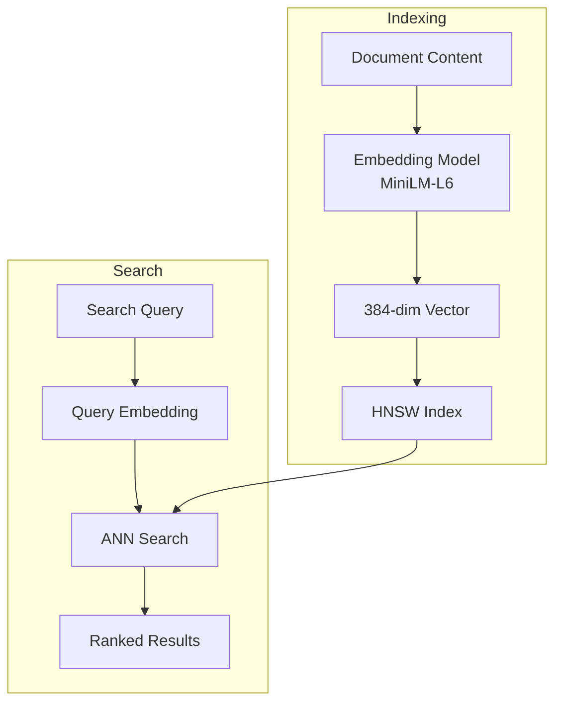

# 08: Vector Search

> Semantic search with embeddings and HNSW index

**Duration:** 2 weeks
**Dependencies:** @xnet/vectors from MVP

## Overview

Vector search enables semantic similarity search using embeddings. Components:

- Embedding model (MiniLM via TensorFlow.js)
- HNSW index for fast ANN search
- Hybrid search (vector + keyword)

## Architecture



## Implementation

### Embedding Model

```typescript
// packages/vectors/src/embedding.ts

import * as tf from '@tensorflow/tfjs'

export interface EmbeddingModel {
  embed(text: string): Promise<Float32Array>
  embedBatch(texts: string[]): Promise<Float32Array[]>
  dimensions: number
}

export async function loadEmbeddingModel(): Promise<EmbeddingModel> {
  // Load MiniLM model (384 dimensions)
  // In production, use a hosted model or bundle it
  const model = await tf.loadGraphModel('/models/minilm-l6/model.json')

  const tokenizer = await loadTokenizer()

  return {
    dimensions: 384,

    async embed(text: string): Promise<Float32Array> {
      const tokens = tokenizer.encode(text)
      const inputIds = tf.tensor2d([tokens.inputIds], [1, tokens.inputIds.length], 'int32')
      const attentionMask = tf.tensor2d(
        [tokens.attentionMask],
        [1, tokens.attentionMask.length],
        'int32'
      )

      const output = model.predict({
        input_ids: inputIds,
        attention_mask: attentionMask
      }) as tf.Tensor
      const embedding = await meanPooling(output, attentionMask)

      inputIds.dispose()
      attentionMask.dispose()
      output.dispose()

      return embedding
    },

    async embedBatch(texts: string[]): Promise<Float32Array[]> {
      // Process in batches for efficiency
      const batchSize = 32
      const results: Float32Array[] = []

      for (let i = 0; i < texts.length; i += batchSize) {
        const batch = texts.slice(i, i + batchSize)
        const embeddings = await Promise.all(batch.map((t) => this.embed(t)))
        results.push(...embeddings)
      }

      return results
    }
  }
}

async function meanPooling(output: tf.Tensor, attentionMask: tf.Tensor): Promise<Float32Array> {
  return tf.tidy(() => {
    const mask = attentionMask.expandDims(-1)
    const masked = output.mul(mask)
    const summed = masked.sum(1)
    const counts = mask.sum(1)
    const pooled = summed.div(counts)
    const normalized = tf.div(pooled, tf.norm(pooled, 2, 1, true))
    return normalized.dataSync() as Float32Array
  })
}
```

### HNSW Index

```typescript
// packages/vectors/src/hnsw.ts

// Using usearch for WASM-compatible HNSW
import { Index } from 'usearch'

export interface VectorIndexConfig {
  dimensions: number
  metric: 'cosine' | 'euclidean' | 'inner'
  efConstruction?: number // Build-time parameter (default: 128)
  M?: number // Max connections per node (default: 16)
}

export interface SearchResult {
  id: string
  score: number
}

export class VectorIndex {
  private index: Index
  private idMap: Map<number, string> = new Map()
  private reverseIdMap: Map<string, number> = new Map()
  private nextId = 0

  constructor(private config: VectorIndexConfig) {
    this.index = new Index({
      metric: config.metric,
      dimensions: config.dimensions,
      connectivity: config.M || 16,
      expansionAdd: config.efConstruction || 128,
      expansionSearch: 64
    })
  }

  add(id: string, vector: Float32Array): void {
    if (this.reverseIdMap.has(id)) {
      // Update existing
      const numId = this.reverseIdMap.get(id)!
      this.index.remove(numId)
    }

    const numId = this.nextId++
    this.idMap.set(numId, id)
    this.reverseIdMap.set(id, numId)

    this.index.add(numId, vector)
  }

  remove(id: string): boolean {
    const numId = this.reverseIdMap.get(id)
    if (numId === undefined) return false

    this.index.remove(numId)
    this.idMap.delete(numId)
    this.reverseIdMap.delete(id)

    return true
  }

  search(vector: Float32Array, k: number, threshold?: number): SearchResult[] {
    const results = this.index.search(vector, k)

    return results
      .map((match: { key: number; distance: number }) => ({
        id: this.idMap.get(match.key)!,
        score: 1 - match.distance // Convert distance to similarity
      }))
      .filter((r) => r.id && (threshold === undefined || r.score >= threshold))
  }

  size(): number {
    return this.idMap.size
  }

  // Serialization for persistence
  async serialize(): Promise<Uint8Array> {
    const indexData = this.index.save()
    const metadata = {
      idMap: Array.from(this.idMap.entries()),
      nextId: this.nextId,
      config: this.config
    }

    // Combine index binary + metadata JSON
    const metadataJson = JSON.stringify(metadata)
    const metadataBytes = new TextEncoder().encode(metadataJson)

    const combined = new Uint8Array(4 + metadataBytes.length + indexData.length)
    const view = new DataView(combined.buffer)
    view.setUint32(0, metadataBytes.length, true)
    combined.set(metadataBytes, 4)
    combined.set(indexData, 4 + metadataBytes.length)

    return combined
  }

  static async deserialize(data: Uint8Array): Promise<VectorIndex> {
    const view = new DataView(data.buffer)
    const metadataLength = view.getUint32(0, true)
    const metadataBytes = data.slice(4, 4 + metadataLength)
    const indexData = data.slice(4 + metadataLength)

    const metadata = JSON.parse(new TextDecoder().decode(metadataBytes))

    const instance = new VectorIndex(metadata.config)
    instance.index = Index.load(indexData)
    instance.idMap = new Map(metadata.idMap)
    instance.reverseIdMap = new Map(metadata.idMap.map(([k, v]: [number, string]) => [v, k]))
    instance.nextId = metadata.nextId

    return instance
  }
}
```

### Semantic Search Service

```typescript
// packages/vectors/src/search.ts

import { EmbeddingModel, loadEmbeddingModel } from './embedding'
import { VectorIndex, VectorIndexConfig, SearchResult } from './hnsw'
import { StorageAdapter } from '@xnet/storage'

export interface SemanticSearchConfig {
  indexConfig?: Partial<VectorIndexConfig>
  minScore?: number
  maxResults?: number
}

export interface DocumentChunk {
  documentId: string
  chunkIndex: number
  text: string
}

export class SemanticSearch {
  private model: EmbeddingModel | null = null
  private index: VectorIndex | null = null
  private storage: StorageAdapter
  private config: SemanticSearchConfig

  constructor(storage: StorageAdapter, config: SemanticSearchConfig = {}) {
    this.storage = storage
    this.config = {
      minScore: 0.5,
      maxResults: 20,
      ...config
    }
  }

  async initialize(): Promise<void> {
    // Load embedding model
    this.model = await loadEmbeddingModel()

    // Try to load existing index
    const savedIndex = await this.storage.get('vector-index')
    if (savedIndex) {
      this.index = await VectorIndex.deserialize(savedIndex as Uint8Array)
    } else {
      this.index = new VectorIndex({
        dimensions: this.model.dimensions,
        metric: 'cosine',
        ...this.config.indexConfig
      })
    }
  }

  async indexDocument(documentId: string, content: string): Promise<void> {
    if (!this.model || !this.index) {
      throw new Error('SemanticSearch not initialized')
    }

    // Chunk content for better results
    const chunks = this.chunkText(content)

    for (let i = 0; i < chunks.length; i++) {
      const embedding = await this.model.embed(chunks[i])
      const chunkId = `${documentId}:${i}`
      this.index.add(chunkId, embedding)
    }

    // Persist index periodically
    await this.persistIndex()
  }

  async removeDocument(documentId: string): Promise<void> {
    if (!this.index) return

    // Remove all chunks for this document
    let i = 0
    while (this.index.remove(`${documentId}:${i}`)) {
      i++
    }

    await this.persistIndex()
  }

  async search(query: string): Promise<SearchResult[]> {
    if (!this.model || !this.index) {
      throw new Error('SemanticSearch not initialized')
    }

    const queryEmbedding = await this.model.embed(query)
    const results = this.index.search(
      queryEmbedding,
      this.config.maxResults! * 2, // Get more to dedupe
      this.config.minScore
    )

    // Deduplicate by document ID (take best score per document)
    const byDocument = new Map<string, SearchResult>()
    for (const result of results) {
      const documentId = result.id.split(':')[0]
      const existing = byDocument.get(documentId)
      if (!existing || result.score > existing.score) {
        byDocument.set(documentId, { id: documentId, score: result.score })
      }
    }

    return Array.from(byDocument.values())
      .sort((a, b) => b.score - a.score)
      .slice(0, this.config.maxResults)
  }

  private chunkText(text: string, maxLength = 500, overlap = 50): string[] {
    const chunks: string[] = []
    let start = 0

    while (start < text.length) {
      let end = start + maxLength

      // Try to break at sentence boundary
      if (end < text.length) {
        const lastPeriod = text.lastIndexOf('.', end)
        if (lastPeriod > start + maxLength / 2) {
          end = lastPeriod + 1
        }
      }

      chunks.push(text.slice(start, end).trim())
      start = end - overlap
    }

    return chunks.filter((c) => c.length > 0)
  }

  private async persistIndex(): Promise<void> {
    if (!this.index) return
    const data = await this.index.serialize()
    await this.storage.set('vector-index', data)
  }
}
```

### Hybrid Search (Vector + Keyword)

```typescript
// packages/vectors/src/hybrid.ts

import { SemanticSearch, SearchResult } from './search'
import { QueryEngine } from '@xnet/query'

export interface HybridSearchOptions {
  vectorWeight?: number // 0-1, default 0.5
  keywordWeight?: number // 0-1, default 0.5
  minScore?: number
  maxResults?: number
}

export class HybridSearch {
  constructor(
    private semanticSearch: SemanticSearch,
    private queryEngine: QueryEngine
  ) {}

  async search(query: string, options: HybridSearchOptions = {}): Promise<SearchResult[]> {
    const { vectorWeight = 0.5, keywordWeight = 0.5, minScore = 0.3, maxResults = 20 } = options

    // Run both searches in parallel
    const [vectorResults, keywordResults] = await Promise.all([
      this.semanticSearch.search(query),
      this.keywordSearch(query)
    ])

    // Combine results with RRF (Reciprocal Rank Fusion)
    const scores = new Map<string, number>()

    vectorResults.forEach((result, rank) => {
      const rrf = vectorWeight / (60 + rank + 1)
      scores.set(result.id, (scores.get(result.id) || 0) + rrf)
    })

    keywordResults.forEach((result, rank) => {
      const rrf = keywordWeight / (60 + rank + 1)
      scores.set(result.id, (scores.get(result.id) || 0) + rrf)
    })

    return Array.from(scores.entries())
      .map(([id, score]) => ({ id, score }))
      .filter((r) => r.score >= minScore)
      .sort((a, b) => b.score - a.score)
      .slice(0, maxResults)
  }

  private async keywordSearch(query: string): Promise<SearchResult[]> {
    const results = await this.queryEngine.search(query)
    return results.map((r, i) => ({
      id: r.id,
      score: 1 / (i + 1) // Simple rank-based score
    }))
  }
}
```

## Tests

```typescript
// packages/vectors/test/search.test.ts

import { describe, it, expect, beforeAll } from 'vitest'
import { SemanticSearch } from '../src/search'
import { MemoryAdapter } from '@xnet/storage'

describe('SemanticSearch', () => {
  let search: SemanticSearch

  beforeAll(async () => {
    const storage = new MemoryAdapter()
    search = new SemanticSearch(storage)
    await search.initialize()
  })

  it('indexes and searches documents', async () => {
    await search.indexDocument('doc1', 'The quick brown fox jumps over the lazy dog')
    await search.indexDocument('doc2', 'Machine learning is a subset of artificial intelligence')
    await search.indexDocument('doc3', 'The dog barks at the mailman')

    const results = await search.search('animals jumping')

    expect(results.length).toBeGreaterThan(0)
    expect(results[0].id).toBe('doc1') // Most relevant
  })

  it('removes documents from index', async () => {
    await search.indexDocument('doc4', 'Test document for removal')
    await search.removeDocument('doc4')

    const results = await search.search('Test document for removal')
    expect(results.find((r) => r.id === 'doc4')).toBeUndefined()
  })

  it('handles long documents with chunking', async () => {
    const longContent = 'Lorem ipsum '.repeat(1000)
    await search.indexDocument('long-doc', longContent)

    const results = await search.search('Lorem ipsum')
    expect(results.find((r) => r.id === 'long-doc')).toBeDefined()
  })
})
```

## Checklist

### Week 1: Embeddings & Index

- [ ] TensorFlow.js MiniLM model loading
- [ ] Embedding generation
- [ ] HNSW index with usearch
- [ ] Index serialization/persistence
- [ ] Basic search API

### Week 2: Search Features

- [ ] Document chunking
- [ ] Incremental index updates
- [ ] Hybrid search (vector + keyword)
- [ ] Score normalization
- [ ] Performance optimization
- [ ] All tests pass

---

[← Back to Formula Engine](./07-formula-engine.md) | [Next: Infinite Canvas →](./09-infinite-canvas.md)
